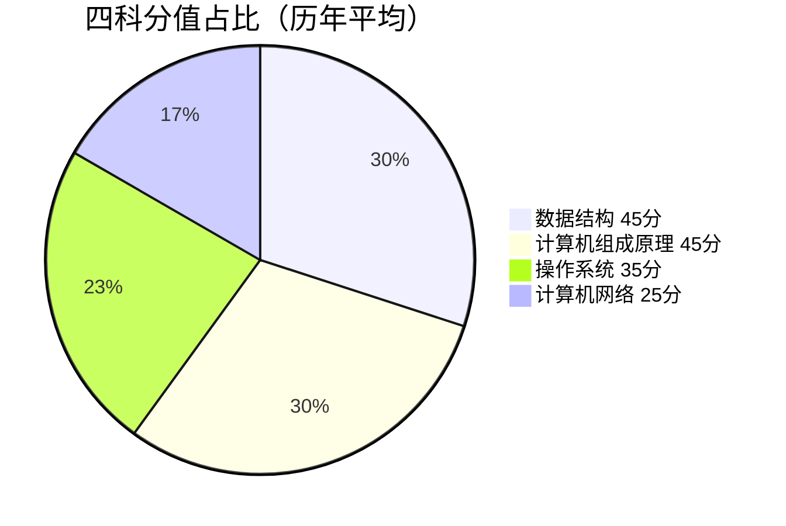
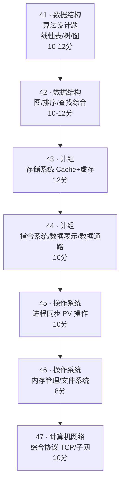
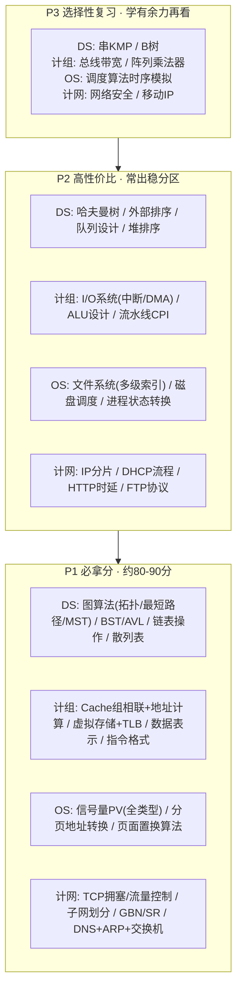

试卷结构
![[Pasted image 20260816193850.png]]

真题构成
![[Pasted image 20260816194345.png]]

# 408 考情分析（可视化总览）

> 四张核心图：试卷结构 → 高频考点频率 → 大题固定框架 → 复习优先级。
> 数据口径：**2016-2025 近 10 年大题（41-47 题）统计** + **2011-2025 共 15 年必考点 TOP20**。
> 详细逐年数据见 [[wiki/408高频考点分析_2016-2025]] 与 [[00-408考点总目录]]。

---

## 图一：试卷结构与分值分布

### 题型构成

| 题型 | 题数 | 每题分值 | 小计 | 占比 |
|------|------|---------|------|------|
| 单项选择题 | 40 题 | 2 分 | **80 分** | 53.3% |
| 综合应用题（大题 41-47） | 7 题 | 不定 | **70 分** | 46.7% |
| **合计** | | | **150 分** | 100% |

### 四科分值占比（历年平均）

| 科目 | 分值 | 占比 | 重要性 |
|------|------|------|--------|
| 数据结构 | ~45 分 | 30% | ⭐⭐⭐⭐⭐ |
| 计算机组成原理 | ~45 分 | 30% | ⭐⭐⭐⭐⭐ |
| 操作系统 | ~35 分 | 23.3% | ⭐⭐⭐⭐ |
| 计算机网络 | ~25 分 | 16.7% | ⭐⭐⭐ |

> 💡 数据结构 + 计组 = 90 分，占全卷 60%，是绝对的得分主战场。

---

## 图二：四科高频考点出现频率（近 10 年大题）

> 条形长度 = 2016-2025 年大题出现次数（满分 10 次），越满越要重点突破。

### 数据结构（41-42 题）

| 考点 | 出现次数 | 热度 | 频率条 |
|------|:-------:|:----:|--------|
| **图（遍历/最短路径/MST/关键路径/拓扑排序）** | 7 次 | ★★★★★ | ███████░░░ |
| **树与二叉树（BST/哈夫曼/遍历/性质）** | 6 次 | ★★★★★ | ██████░░░░ |
| **线性表（链表操作/顺序表算法）** | 5 次 | ★★★★ | █████░░░░░ |
| 查找（哈希表/散列冲突/B 树/折半） | 4 次 | ★★★★ | ████░░░░░░ |
| 排序（外部排序/堆排序/希尔/快速） | 4 次 | ★★★★ | ████░░░░░░ |
| 栈与队列（表达式求值/队列设计） | 3 次 | ★★★ | ███░░░░░░░ |

### 计算机组成原理（43-44 题）

| 考点 | 出现次数 | 热度 | 频率条 |
|------|:-------:|:----:|--------|
| **存储系统（Cache/TLB/虚拟存储/页式管理）** | 10 次 | ★★★★★ | ██████████ |
| **指令系统（指令格式/寻址方式/汇编分析）** | 8 次 | ★★★★★ | ████████░░ |
| **数据表示与运算（浮点/补码/ALU/溢出）** | 5 次 | ★★★★★ | █████░░░░░ |
| I/O 系统（中断/DMA/查询方式） | 4 次 | ★★★★ | ████░░░░░░ |
| CPU 数据通路与控制器（流水线/CPI） | 4 次 | ★★★★ | ████░░░░░░ |
| 总线系统 | 1 次 | ★★ | █░░░░░░░░░ |

### 操作系统（45-46 题）

| 考点 | 出现次数 | 热度 | 频率条 |
|------|:-------:|:----:|--------|
| **进程同步与互斥（信号量/PV/死锁）** | 9 次 | ★★★★★ | █████████░ |
| **内存管理（分页/TLB/页面置换算法）** | 8 次 | ★★★★★ | ████████░░ |
| **文件系统（索引节点/FAT/目录/磁盘 I/O）** | 5 次 | ★★★★ | █████░░░░░ |
| I/O 控制（中断/DMA/磁盘调度） | 4 次 | ★★★★ | ████░░░░░░ |
| 进程调度（优先级/时间片/饥饿） | 2 次 | ★★★ | ██░░░░░░░░ |
| 系统启动与虚拟化 | 2 次 | ★★ | ██░░░░░░░░ |

### 计算机网络（47 题）

| 考点 | 出现次数 | 热度 | 频率条 |
|------|:-------:|:----:|--------|
| **网络层（IP/子网划分/NAT/路由协议）** | 8 次 | ★★★★★ | ████████░░ |
| **传输层（TCP 可靠传输/拥塞/流量控制）** | 7 次 | ★★★★★ | ███████░░░ |
| **数据链路层（GBN/SR/CSMA/802.11）** | 6 次 | ★★★★ | ██████░░░░ |
| 应用层（DNS/FTP/HTTP/DHCP） | 5 次 | ★★★★ | █████░░░░░ |
| 物理层（时延/带宽/信道利用率） | 3 次 | ★★★ | ███░░░░░░░ |
| 网络安全 | 1 次 | ★★ | █░░░░░░░░░ |

### 最扎眼的几个数据

- 🥇 **计组存储系统 10/10 全勤**：Cache 映射 + 虚拟存储，每年必考一道大题
- 🥈 **OS 进程同步 9 次**：PV 操作几乎必考，被称为"必考中的必考"
- 🥉 **计组指令系统 / OS 内存管理 / 计网网络层各 8 次**
- ⚠️ 总线系统 1 次、网络安全 1 次 —— 属于**可选放弃区**

---

## 图三：大题固定题型框架（41-47）

> 近 10 年大题结构高度稳定，基本可"押题式"锁定每题考察方向。

| 题号 | 科目 | 固定题型 | 分值 | 命题稳定度 |
|------|------|---------|:----:|:--------:|
| 41 | 数据结构 | 算法设计题（线性表/树/图） | 10-12 | 稳定 |
| 42 | 数据结构 | 图/排序/查找综合应用 | 10-12 | 稳定 |
| 43 | 组成原理 | 存储系统（Cache + 虚拟存储） | 12 | **固定** |
| 44 | 组成原理 | 指令系统/数据表示/数据通路 | 10 | 轮换 |
| 45 | 操作系统 | 进程同步（信号量 PV） | 10 | **固定** |
| 46 | 操作系统 | 内存管理/文件系统 | 8 | 轮换 |
| 47 | 计算机网络 | 综合协议（TCP/子网/路由） | 10 | 稳定 |

### 轮换考察规律

- **操作系统**：进程同步与内存管理轮换（通常一题同步、一题内存或文件系统）
- **组成原理**：存储系统（Cache/虚存）**固定出一题**；另一题在指令系统/数据通路/I/O 间轮换
- **计算机网络**：传输层（TCP）和网络层（子网/路由）几乎每年必考，数据链路层隔年出现
- **数据结构**：41 题算法设计（手写代码），42 题综合应用（图/排序/查找）

### 近 5 年显著趋势（2021-2025）

| 趋势 | 具体表现 |
|------|---------|
| **跨章节综合性增强** | 存储大题同时考 Cache+TLB+虚存（2025、2023）；网络大题综合 DNS+ARP+交换机（2021） |
| **工程设计能力要求提升** | 要求设计算法 + 分析复杂度（2025、2024、2022） |
| **代码级分析深化** | 汇编 + C 代码 + 地址计算三合一（2024 大题 44） |
| **图算法持续升温** | 近 5 年拓扑排序出现 3 次（2025 AOE、2024、2023） |

---

## 图四：复习优先级金字塔

> 按"必拿分 → 高性价比 → 选择性"三层分配精力，暖色越深优先级越高。

| 层级 | 定位 | 覆盖知识点（四科） | 对应分值 |
|------|------|-------------------|:------:|
| **P1 必拿分** | 核心中的核心，优先吃透 | 图算法、Cache+虚存、PV 操作、分页、TCP、子网划分 | **约 80-90 分** |
| **P2 高性价比** | 常出稳分，学有余力补齐 | 哈夫曼、外部排序、I/O 系统、ALU、文件系统、磁盘调度、IP 分片、DHCP | 约 30-40 分 |
| **P3 选择性** | 低频考点，时间紧可放弃 | KMP、B 树、总线带宽、阵列乘法器、调度时序、网络安全、移动 IP | 约 10-15 分 |

> 🎯 结合当前进度（正在过 DS 和计网视频）：建议优先吃透**图算法**（近 5 年 3 次大题）和**存储系统**（10 年全勤）这两块。

---

## See Also

- [[wiki/408高频考点分析_2016-2025]] — 10 年真题逐年逐题考点统计
- [[00-408考点总目录]] — 15 年必考点 TOP20
- [[01-数据结构必考点]] — 数据结构详细考点
- [[02-计算机组成原理必考点]] — 计组详细考点
- [[03-操作系统必考点]] — 操作系统详细考点
- [[04-计算机网络必考点]] — 计算机网络详细考点
- [[05-备考策略与资料推荐]] — 三轮复习规划
