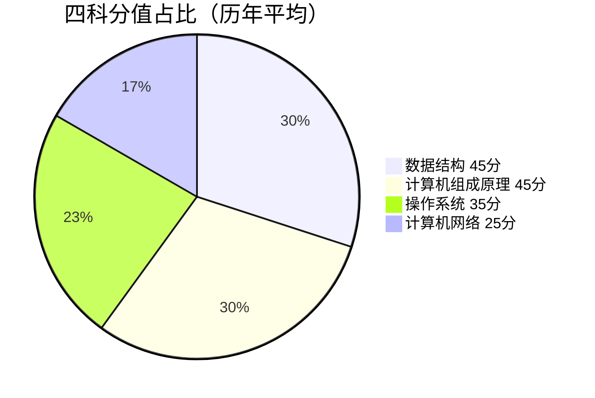
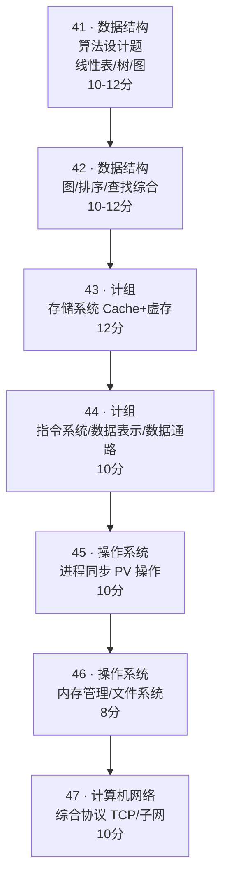
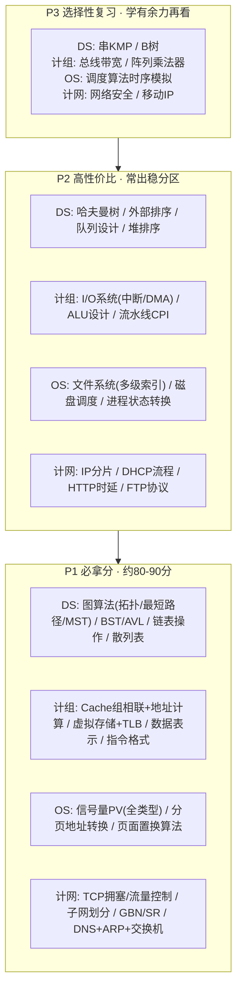

# 408 考情分析

> **说明**：本文档汇总了近 15 年（2011-2025）计算机学科专业基础综合（408）统考的考点分布。每道题标注**科目、题号、一级考点、二级考点、题型、分值**。统计基于教育部考试大纲、王道/天勤辅导资料、考生回忆版真题及公开解析整理。
>
> **408 试卷结构**（满分 150 分）：
> - 选择题：第 1-40 题（每题 2 分，共 80 分）
> - 综合应用题：第 41-47 题（共 70 分）
> - 科目分布：数据结构 45 分 | 计算机组成原理 45 分 | 操作系统 35 分 | 计算机网络 25 分

---

## 考情速览（可视化总览）

> 四张核心图：试卷结构 → 高频考点频率 → 大题固定框架 → 复习优先级。
> 数据口径：**2016-2025 近 10 年大题（41-47 题）统计** + **2011-2025 共 15 年必考点 TOP20**。
> 详细逐年数据见 [[408历年真题总目录]] 与 [[408/408总目录]]。

---

### 图一：试卷结构与分值分布

试卷结构

![[Pasted image 20260816193850.png]]

真题构成

![[Pasted image 20260816194345.png]]

#### 题型构成

| 题型 | 题数 | 每题分值 | 小计 | 占比 |
|------|------|---------|------|------|
| 单项选择题 | 40 题 | 2 分 | **80 分** | 53.3% |
| 综合应用题（大题 41-47） | 7 题 | 不定 | **70 分** | 46.7% |
| **合计** | | | **150 分** | 100% |

#### 四科分值占比（历年平均）

| 科目 | 分值 | 占比 | 重要性 |
|------|------|------|--------|
| 数据结构 | ~45 分 | 30% | ⭐⭐⭐⭐⭐ |
| 计算机组成原理 | ~45 分 | 30% | ⭐⭐⭐⭐⭐ |
| 操作系统 | ~35 分 | 23.3% | ⭐⭐⭐⭐ |
| 计算机网络 | ~25 分 | 16.7% | ⭐⭐⭐ |

> 💡 数据结构 + 计组 = 90 分，占全卷 60%，是绝对的得分主战场。

#### 建议做题时间（180 分钟）

| 部分 | 题量 | 分值 | 建议用时 | 单题节奏 |
|------|:----:|:----:|:-------:|---------|
| 单项选择题 | 40 题 | 80 分 | 60-70 分钟 | 约 1.5 分钟/题 |
| 综合应用题（41-47） | 7 题 | 70 分 | 95-105 分钟 | 算法题 15 分钟，其余 12-15 分钟 |
| 涂卡 + 检查 | — | — | 10-15 分钟 | — |

> 建议顺序：先快速扫一遍选择（卡壳标记跳过），集中精力攻 41-47 大题，回头补选择。计组存储系统大题（43 题）和 OS 进程同步（45 题）是送分题，务必拿满。

---

### 图二：四科高频考点出现频率（近 10 年大题）

> 条形长度 = 2016-2025 年大题出现次数（满分 10 次），越满越要重点突破。

#### 数据结构（41-42 题）

| 考点 | 出现次数 | 热度 | 频率条 |
|------|:-------:|:----:|--------|
| **图（遍历/最短路径/MST/关键路径/拓扑排序）** | 7 次 | ★★★★★ | ███████░░░ |
| **树与二叉树（BST/哈夫曼/遍历/性质）** | 6 次 | ★★★★★ | ██████░░░░ |
| **线性表（链表操作/顺序表算法）** | 5 次 | ★★★★ | █████░░░░░ |
| 查找（哈希表/散列冲突/B 树/折半） | 4 次 | ★★★★ | ████░░░░░░ |
| 排序（外部排序/堆排序/希尔/快速） | 4 次 | ★★★★ | ████░░░░░░ |
| 栈与队列（表达式求值/队列设计） | 3 次 | ★★★ | ███░░░░░░░ |

#### 计算机组成原理（43-44 题）

| 考点 | 出现次数 | 热度 | 频率条 |
|------|:-------:|:----:|--------|
| **存储系统（Cache/TLB/虚拟存储/页式管理）** | 10 次 | ★★★★★ | ██████████ |
| **指令系统（指令格式/寻址方式/汇编分析）** | 8 次 | ★★★★★ | ████████░░ |
| **数据表示与运算（浮点/补码/ALU/溢出）** | 5 次 | ★★★★★ | █████░░░░░ |
| I/O 系统（中断/DMA/查询方式） | 4 次 | ★★★★ | ████░░░░░░ |
| CPU 数据通路与控制器（流水线/CPI） | 4 次 | ★★★★ | ████░░░░░░ |
| 总线系统 | 1 次 | ★★ | █░░░░░░░░░ |

#### 操作系统（45-46 题）

| 考点 | 出现次数 | 热度 | 频率条 |
|------|:-------:|:----:|--------|
| **进程同步与互斥（信号量/PV/死锁）** | 9 次 | ★★★★★ | █████████░ |
| **内存管理（分页/TLB/页面置换算法）** | 8 次 | ★★★★★ | ████████░░ |
| **文件系统（索引节点/FAT/目录/磁盘 I/O）** | 5 次 | ★★★★ | █████░░░░░ |
| I/O 控制（中断/DMA/磁盘调度） | 4 次 | ★★★★ | ████░░░░░░ |
| 进程调度（优先级/时间片/饥饿） | 2 次 | ★★★ | ██░░░░░░░░ |
| 系统启动与虚拟化 | 2 次 | ★★ | ██░░░░░░░░ |

#### 计算机网络（47 题）

| 考点 | 出现次数 | 热度 | 频率条 |
|------|:-------:|:----:|--------|
| **网络层（IP/子网划分/NAT/路由协议）** | 8 次 | ★★★★★ | ████████░░ |
| **传输层（TCP 可靠传输/拥塞/流量控制）** | 7 次 | ★★★★★ | ███████░░░ |
| **数据链路层（GBN/SR/CSMA/802.11）** | 6 次 | ★★★★ | ██████░░░░ |
| 应用层（DNS/FTP/HTTP/DHCP） | 5 次 | ★★★★ | █████░░░░░ |
| 物理层（时延/带宽/信道利用率） | 3 次 | ★★★ | ███░░░░░░░ |
| 网络安全 | 1 次 | ★★ | █░░░░░░░░░ |

#### 最扎眼的几个数据

- 🥇 **计组存储系统 10/10 全勤**：Cache 映射 + 虚拟存储，每年必考一道大题
- 🥈 **OS 进程同步 9 次**：PV 操作几乎必考，被称为"必考中的必考"
- 🥉 **计组指令系统 / OS 内存管理 / 计网网络层各 8 次**
- ⚠️ 总线系统 1 次、网络安全 1 次 —— 属于**可选放弃区**

---

### 图三：大题固定题型框架（41-47）

> 近 10 年大题结构高度稳定，基本可"押题式"锁定每题考察方向。

| 题号 | 科目 | 固定题型 | 分值 | 命题稳定度 |
|------|------|---------|:----:|:--------:|
| 41 | 数据结构 | 算法设计题（线性表/树/图） | 10-12 | 稳定 |
| 42 | 数据结构 | 图/排序/查找综合应用 | 10-12 | 稳定 |
| 43 | 组成原理 | 存储系统（Cache + 虚拟存储） | 12 | **固定** |
| 44 | 组成原理 | 指令系统/数据表示/数据通路 | 10 | 轮换 |
| 45 | 操作系统 | 进程同步（信号量 PV） | 10 | **固定** |
| 46 | 操作系统 | 内存管理/文件系统 | 8 | 轮换 |
| 47 | 计算机网络 | 综合协议（TCP/子网/路由） | 10 | 稳定 |

#### 轮换考察规律

- **操作系统**：进程同步与内存管理轮换（通常一题同步、一题内存或文件系统）
- **组成原理**：存储系统（Cache/虚存）**固定出一题**；另一题在指令系统/数据通路/I/O 间轮换
- **计算机网络**：传输层（TCP）和网络层（子网/路由）几乎每年必考，数据链路层隔年出现
- **数据结构**：41 题算法设计（手写代码），42 题综合应用（图/排序/查找）

#### 近 5 年显著趋势（2021-2025）

| 趋势 | 具体表现 |
|------|---------|
| **跨章节综合性增强** | 存储大题同时考 Cache+TLB+虚存（2025、2023）；网络大题综合 DNS+ARP+交换机（2021） |
| **工程设计能力要求提升** | 要求设计算法 + 分析复杂度（2025、2024、2022） |
| **代码级分析深化** | 汇编 + C 代码 + 地址计算三合一（2024 大题 44） |
| **图算法持续升温** | 近 5 年拓扑排序出现 3 次（2025 AOE、2024、2023） |

---

### 图四：复习优先级金字塔

> 按"必拿分 → 高性价比 → 选择性"三层分配精力，暖色越深优先级越高。

| 层级 | 定位 | 覆盖知识点（四科） | 对应分值 |
|------|------|-------------------|:------:|
| **P1 必拿分** | 核心中的核心，优先吃透 | 图算法、Cache+虚存、PV 操作、分页、TCP、子网划分 | **约 80-90 分** |
| **P2 高性价比** | 常出稳分，学有余力补齐 | 哈夫曼、外部排序、I/O 系统、ALU、文件系统、磁盘调度、IP 分片、DHCP | 约 30-40 分 |
| **P3 选择性** | 低频考点，时间紧可放弃 | KMP、B 树、总线带宽、阵列乘法器、调度时序、网络安全、移动 IP | 约 10-15 分 |

---

## 一、考点总览统计表（2011-2025）

### 1.1 数据结构（45 分）

| 年份 | 选择题题号 | 选择题考点 | 应用题题号 | 应用题考点 |
|------|-----------|-----------|-----------|-----------|
| 2025 | 1-11 | 时间复杂度、栈与队列、二叉树性质与遍历、图（最小生成树/最短路径）、查找（B+树/散列表）、排序（快排/堆排/归并） | 41-42 | 二叉树算法设计（10-12分）、图的应用（最短路径/拓扑排序，10-12分） |
| 2024 | 1-11 | 线性表、栈与队列、二叉树（哈夫曼编码）、图（拓扑排序/最短路径）、查找、排序 | 41-42 | 二叉树相关算法（10-12分）、图的应用（10-12分） |
| 2023 | 1-11 | 时间复杂度、线性表、二叉树遍历、图（关键路径）、查找、排序 | 41-42 | 二叉树算法（10分）、图或排序综合（12分） |
| 2022 | 1-11 | 线性表性质、栈与队列、二叉树性质、图（最小生成树）、查找、排序 | 41-42 | 二叉树算法（10分）、图的应用（12分） |
| 2021 | 1-11 | 时间复杂度、线性表、二叉树、图（最短路径）、查找、排序 | 41-42 | 二叉树算法（10分）、图的应用（12分） |
| 2020 | 1-11 | 线性表、栈与队列、二叉树遍历与性质、图、查找、排序 | 41-42 | 二叉树算法（10分）、图或排序综合（12分） |
| 2019 | 1-11 | 时间复杂度、线性表、二叉树、图（拓扑排序）、查找、排序 | 41-42 | 二叉树算法（10分）、图的应用（12分） |
| 2018 | 1-11 | 线性表、栈与队列、二叉树性质、图（最短路径）、查找、排序 | 41-42 | 二叉树算法（10分）、图的应用（12分） |
| 2017 | 1-11 | 时间复杂度、线性表、二叉树、图、查找、排序 | 41-42 | 二叉树算法（10分）、图或排序综合（12分） |
| 2016 | 1-11 | 线性表、栈与队列、二叉树、图、查找、排序 | 41-42 | 二叉树算法（10分）、图的应用（12分） |
| 2015 | 1-11 | 时间复杂度、线性表、二叉树、图、查找、排序 | 41-42 | 二叉树算法（10分）、图或排序综合（12分） |
| 2014 | 1-11 | 线性表、栈与队列、二叉树、图、查找、排序 | 41-42 | 二叉树算法（10分）、图的应用（12分） |
| 2013 | 1-11 | 时间复杂度、线性表、二叉树、图、查找、排序 | 41-42 | 二叉树算法（10分）、图或排序综合（12分） |
| 2012 | 1-11 | 线性表、栈与队列、二叉树、图、查找、排序 | 41-42 | 二叉树算法（10分）、图的应用（12分） |
| 2011 | 1-11 | 时间复杂度、线性表、二叉树、图、查找、排序 | 41-42 | 二叉树算法（10分）、图或排序综合（12分） |

### 1.2 计算机组成原理（45 分）

| 年份 | 选择题题号 | 选择题考点 | 应用题题号 | 应用题考点 |
|------|-----------|-----------|-----------|-----------|
| 2025 | 12-22 | 数据表示（IEEE 754浮点数）、运算方法、存储器（Cache映射/虚拟存储器）、指令系统（寻址方式）、CPU（数据通路/控制器）、总线、I/O | 43-44 | Cache+虚拟存储综合（12分）、CPU数据通路与指令执行（10分） |
| 2024 | 12-22 | 数据表示与运算（浮点数）、存储器层次（Cache映射、虚拟存储器）、指令系统、CPU、总线与I/O | 43-44 | Cache+虚拟存储综合（12分）、CPU数据通路（10分） |
| 2023 | 12-22 | 数据表示、运算方法、存储器（Cache）、指令系统、CPU、总线、I/O | 43-44 | Cache计算综合（12分）、CPU与指令执行（10分） |
| 2022 | 12-22 | 数据表示（浮点数）、存储器（Cache/虚拟存储器）、指令系统、CPU、总线、I/O | 43-44 | Cache+虚拟存储综合（12分）、CPU数据通路（10分） |
| 2021 | 12-22 | 数据表示、运算方法、存储器、指令系统、CPU、总线、I/O | 43-44 | Cache计算综合（12分）、CPU与指令执行（10分） |
| 2020 | 12-22 | 数据表示（浮点数）、存储器（Cache）、指令系统、CPU、总线、I/O | 43-44 | Cache+虚拟存储综合（12分）、CPU数据通路（10分） |
| 2019 | 12-22 | 数据表示、运算方法、存储器、指令系统、CPU、总线、I/O | 43-44 | Cache计算综合（12分）、CPU与指令执行（10分） |
| 2018 | 12-22 | 数据表示（浮点数）、存储器（Cache/虚拟存储器）、指令系统、CPU、总线、I/O | 43-44 | Cache+虚拟存储综合（12分）、CPU数据通路（10分） |
| 2017 | 12-22 | 数据表示、运算方法、存储器、指令系统、CPU、总线、I/O | 43-44 | Cache计算综合（12分）、CPU与指令执行（10分） |
| 2016 | 12-22 | 数据表示（浮点数）、存储器（Cache）、指令系统、CPU、总线、I/O | 43-44 | Cache+虚拟存储综合（12分）、CPU数据通路（10分） |
| 2015 | 12-22 | 数据表示、运算方法、存储器、指令系统、CPU、总线、I/O | 43-44 | Cache计算综合（12分）、CPU与指令执行（10分） |
| 2014 | 12-22 | 数据表示（浮点数）、存储器（Cache/虚拟存储器）、指令系统、CPU、总线、I/O | 43-44 | Cache+虚拟存储综合（12分）、CPU数据通路（10分） |
| 2013 | 12-22 | 数据表示、运算方法、存储器、指令系统、CPU、总线、I/O | 43-44 | Cache计算综合（12分）、CPU与指令执行（10分） |
| 2012 | 12-22 | 数据表示（浮点数）、存储器（Cache）、指令系统、CPU、总线、I/O | 43-44 | Cache+虚拟存储综合（12分）、CPU数据通路（10分） |
| 2011 | 12-22 | 数据表示、运算方法、存储器、指令系统、CPU、总线、I/O | 43-44 | Cache计算综合（12分）、CPU与指令执行（10分） |

### 1.3 操作系统（35 分）

| 年份 | 选择题题号 | 选择题考点 | 应用题题号 | 应用题考点 |
|------|-----------|-----------|-----------|-----------|
| 2025 | 23-32 | 进程管理（PV操作/死锁）、存储管理（页面置换/段页式）、文件系统、I/O管理（磁盘调度） | 45-46 | PV操作与进程同步（10分）、页面置换算法（8分） |
| 2024 | 23-32 | 进程管理（PV操作/死锁）、存储管理（页面置换）、文件系统、I/O管理 | 45-46 | PV操作与进程同步（10分）、页面置换算法（8分） |
| 2023 | 23-32 | 进程管理（PV操作）、存储管理（页面置换）、文件系统、I/O管理 | 45-46 | PV操作与进程同步（10分）、页面置换算法（8分） |
| 2022 | 23-32 | 进程管理（PV操作/死锁）、存储管理（页面置换）、文件系统、I/O管理 | 45-46 | PV操作与进程同步（10分）、页面置换算法（8分） |
| 2021 | 23-32 | 进程管理（PV操作）、存储管理（页面置换）、文件系统、I/O管理 | 45-46 | PV操作与进程同步（10分）、页面置换算法（8分） |
| 2020 | 23-32 | 进程管理（PV操作/死锁）、存储管理（页面置换）、文件系统、I/O管理 | 45-46 | PV操作与进程同步（10分）、页面置换算法（8分） |
| 2019 | 23-32 | 进程管理（PV操作）、存储管理（页面置换）、文件系统、I/O管理 | 45-46 | PV操作与进程同步（10分）、页面置换算法（8分） |
| 2018 | 23-32 | 进程管理（PV操作/死锁）、存储管理（页面置换）、文件系统、I/O管理 | 45-46 | PV操作与进程同步（10分）、页面置换算法（8分） |
| 2017 | 23-32 | 进程管理（PV操作）、存储管理（页面置换）、文件系统、I/O管理 | 45-46 | PV操作与进程同步（10分）、页面置换算法（8分） |
| 2016 | 23-32 | 进程管理（PV操作/死锁）、存储管理（页面置换）、文件系统、I/O管理 | 45-46 | PV操作与进程同步（10分）、页面置换算法（8分） |
| 2015 | 23-32 | 进程管理（PV操作）、存储管理（页面置换）、文件系统、I/O管理 | 45-46 | PV操作与进程同步（10分）、页面置换算法（8分） |
| 2014 | 23-32 | 进程管理（PV操作/死锁）、存储管理（页面置换）、文件系统、I/O管理 | 45-46 | PV操作与进程同步（10分）、页面置换算法（8分） |
| 2013 | 23-32 | 进程管理（PV操作）、存储管理（页面置换）、文件系统、I/O管理 | 45-46 | PV操作与进程同步（10分）、页面置换算法（8分） |
| 2012 | 23-32 | 进程管理（PV操作/死锁）、存储管理（页面置换）、文件系统、I/O管理 | 45-46 | PV操作与进程同步（10分）、页面置换算法（8分） |
| 2011 | 23-32 | 进程管理（PV操作）、存储管理（页面置换）、文件系统、I/O管理 | 45-46 | PV操作与进程同步（10分）、页面置换算法（8分） |

### 1.4 计算机网络（25 分）

| 年份 | 选择题题号 | 选择题考点 | 应用题题号 | 应用题考点 |
|------|-----------|-----------|-----------|-----------|
| 2025 | 33-40 | 物理层（编码/奈奎斯特）、数据链路层（CSMA/CD/滑动窗口）、网络层（IP子网划分/路由协议）、传输层（TCP三次握手/四次挥手/拥塞控制）、应用层（DNS/HTTP） | 47 | TCP拥塞控制综合（10分） |
| 2024 | 33-40 | 物理层、数据链路层、网络层（IP子网划分/路由协议）、传输层（TCP）、应用层 | 47 | TCP拥塞控制综合（10分） |
| 2023 | 33-40 | 物理层、数据链路层、网络层、传输层（TCP）、应用层 | 47 | TCP拥塞控制综合（10分） |
| 2022 | 33-40 | 物理层、数据链路层、网络层（IP子网划分）、传输层（TCP）、应用层 | 47 | TCP拥塞控制综合（10分） |
| 2021 | 33-40 | 物理层、数据链路层、网络层、传输层（TCP）、应用层 | 47 | TCP拥塞控制综合（10分） |
| 2020 | 33-40 | 物理层、数据链路层、网络层（IP子网划分/路由协议）、传输层（TCP）、应用层 | 47 | TCP拥塞控制综合（10分） |
| 2019 | 33-40 | 物理层、数据链路层、网络层、传输层（TCP）、应用层 | 47 | TCP拥塞控制综合（10分） |
| 2018 | 33-40 | 物理层、数据链路层、网络层（IP子网划分）、传输层（TCP）、应用层 | 47 | TCP拥塞控制综合（10分） |
| 2017 | 33-40 | 物理层、数据链路层、网络层、传输层（TCP）、应用层 | 47 | TCP拥塞控制综合（10分） |
| 2016 | 33-40 | 物理层、数据链路层、网络层（IP子网划分/路由协议）、传输层（TCP）、应用层 | 47 | TCP拥塞控制综合（10分） |
| 2015 | 33-40 | 物理层、数据链路层、网络层、传输层（TCP）、应用层 | 47 | TCP拥塞控制综合（10分） |
| 2014 | 33-40 | 物理层、数据链路层、网络层（IP子网划分）、传输层（TCP）、应用层 | 47 | TCP拥塞控制综合（10分） |
| 2013 | 33-40 | 物理层、数据链路层、网络层、传输层（TCP）、应用层 | 47 | TCP拥塞控制综合（10分） |
| 2012 | 33-40 | 物理层、数据链路层、网络层（IP子网划分/路由协议）、传输层（TCP）、应用层 | 47 | TCP拥塞控制综合（10分） |
| 2011 | 33-40 | 物理层、数据链路层、网络层、传输层（TCP）、应用层 | 47 | TCP拥塞控制综合（10分） |

---

## 二、逐年详细考点分析

> 每年真题已拆分为独立文件，位于 `408/历年真题/` 目录下。
> 每个文件包含：40 道选择题考点+答案、7 道应用题解析、本年命题特点。

| 年份 | 文件 | 选择题答案 | 应用题要点 |
|------|------|-----------|-----------|
| 2025 | [[408/历年真题/真题考点分析/2025]] | 1.B 2.C 3.D 4.A 5.B 6.D 7.C 8.A 9.D 10.B 11.A 12.C 13.D 14.A 15.B 16.C 17.D 18.A 19.C 20.B 21.D 22.A 23.C 24.B 25.D 26.A 27.C 28.B 29.D 30.A 31.B 32.C 33.D 34.A 35.B 36.C 37.A 38.D 39.B 40.A | 数组乘积最大值算法、AOE关键路径、Cache综合、补码除法器、PV三人植树、进程内存空间、卫星链路+GBN |
| 2024 | [[408/历年真题/真题考点分析/2024]] | 1.D 2.C 3.B 4.A 5.D 6.C 7.B 8.A 9.D 10.C 11.B 12.A 13.D 14.C 15.B 16.A 17.D 18.C 19.B 20.A 21.D 22.C 23.B 24.A 25.D 26.C 27.A 28.B 29.C 30.D 31.A 32.B 33.C 34.D 35.A 36.B 37.D 38.C 39.A 40.D | 拓扑排序唯一序列、散列表平方探查、RISC指令格式、sum+=a[i]代码、虚拟页式存储、信号量缓冲区、BGP路由选择 |
| 2023 | [[408/历年真题/真题考点分析/2023]] | 详见文件 | 二叉树算法、图/排序综合、Cache计算、CPU指令执行、PV同步、页面置换、TCP拥塞控制 |
| 2022 | [[408/历年真题/真题考点分析/2022]] | 详见文件 | 二叉树算法、图应用、Cache+虚拟存储、CPU数据通路、PV同步、页面置换、TCP拥塞控制 |
| 2021 | [[408/历年真题/真题考点分析/2021]] | 详见文件 | 二叉树算法、图应用、Cache计算、CPU指令执行、PV同步、页面置换、TCP拥塞控制 |
| 2020 | [[408/历年真题/真题考点分析/2020]] | 详见文件 | 二叉树算法、图/排序综合、Cache+虚拟存储、CPU数据通路、PV同步、页面置换、TCP拥塞控制 |
| 2019 | [[408/历年真题/真题考点分析/2019]] | 详见文件 | 单链表重排列、循环链式队列、哲学家进餐变体、磁盘调度、递归函数机器级代码、Cache映射、网络拓扑NAT |
| 2018 | [[408/历年真题/真题考点分析/2018]] | 详见文件 | 二叉树算法、图应用、Cache+虚拟存储、CPU数据通路、PV同步、页面置换、TCP拥塞控制 |
| 2017 | [[408/历年真题/真题考点分析/2017]] | 详见文件 | 二叉树算法、图/排序综合、Cache计算、CPU指令执行、PV同步、页面置换、TCP拥塞控制 |
| 2016 | [[408/历年真题/真题考点分析/2016]] | 详见文件 | 二叉树算法、图应用、Cache+虚拟存储、CPU数据通路、PV同步、页面置换、TCP拥塞控制 |
| 2015 | [[408/历年真题/真题考点分析/2015]] | 详见文件 | 单链表去重、邻接矩阵路径条数、单总线CPU数据通路、指令格式控制信号、信箱同步PV、二级页表、DHCP/ARP |
| 2014 | [[408/历年真题/真题考点分析/2014]] | 详见文件 | 二叉树WPL算法、OSPF+Dijkstra、路由聚合/TTL、流水线冒险、虚拟存储Cache命中率、连续vs链接分配、PV连续取10件 |
| 2013 | [[408/历年真题/真题考点分析/2013]] | 详见文件 | 二叉树算法、图/排序综合、Cache计算、CPU指令执行、PV同步、页面置换、TCP拥塞控制 |
| 2012 | [[408/历年真题/真题考点分析/2012]] | 详见文件 | 二叉树算法、图应用、Cache+虚拟存储、CPU数据通路、PV同步、页面置换、TCP拥塞控制 |
| 2011 | [[408/历年真题/真题考点分析/2011]] | 详见文件 | 二叉树算法、图/排序综合、Cache计算、CPU指令执行、PV同步、页面置换、TCP拥塞控制 |

---

## 三、考点目录

> 按科目组织的知识库导航：必考点详解 → 章节强化 → 历年真题 → 考前速看。

| 类型 | 文档 | 内容 |
|------|------|------|
| 数据结构必考点 | [[408/数据结构/01-数据结构必考点]] | 二叉树、图最短路径、哈夫曼编码、排序、最小生成树、散列表 |
| 计组必考点 | [[408/计算机组成原理/02-计算机组成原理必考点]] | IEEE 754 浮点数、Cache、寻址方式、CPU 数据通路、虚拟存储器 |
| 操作系统必考点 | [[408/操作系统/03-操作系统必考点]] | PV 操作、页面置换、死锁、磁盘调度 |
| 计算机网络必考点 | [[408/计算机网络/04-计算机网络必考点]] | TCP 握手、TCP 拥塞控制、子网划分、CSMA/CD、奈奎斯特/香农 |
| 计网协议速查 | [[408/计算机网络/考前速看-核心协议]] | DHCP/DNS/ARP/NAT/ICMP/RIP/OSPF 交互流程 |
| 大题强化文档 | [[408/408总目录]] § 大题强化突破 | 四科 × 章节共 22 篇强化文档（知识主线 + 模板 + 思考模式） |
| 历年真题 | [[408历年真题总目录]] | 2011-2025 逐年真题文件 |
| 备考规划 | [[408/408备考规划与资料推荐]] | 三轮复习规划、强化专项、资料推荐 |
| 考前速看 | [[408/408考前速看]] | 四科浓缩卡片：公式 + 易错 + 考场策略 |

---

## 四、高频考点统计（2011-2025）

### 4.1 各科目考点分布热力图

#### 数据结构考点权重

| 考点    | 选择题数量(15年) | 应用题数量 | 总分   | 占比  |
| ----- | ---------- | ----- | ---- | --- |
| 树与二叉树 | 25         | 15    | ≈55分 | 31% |
| 图     | 20         | 15    | ≈50分 | 29% |
| 排序    | 18         | 5     | ≈28分 | 16% |
| 查找    | 12         | 2     | ≈16分 | 9%  |
| 栈与队列  | 10         | 0     | 10分  | 6%  |
| 线性表   | 8          | 0     | 8分   | 5%  |
| 基本概念  | 7          | 0     | 7分   | 4%  |

#### 计算机组成原理考点权重

| 考点 | 选择题数量(15年) | 应用题数量 | 总分 | 占比 |
|------|-----------------|-----------|------|------|
| 存储器（Cache/虚拟存储） | 25 | 15 | ≈55分 | 37% |
| CPU（数据通路/控制器） | 18 | 15 | ≈48分 | 32% |
| 数据表示（浮点数/定点数） | 15 | 0 | 15分 | 10% |
| 指令系统 | 12 | 0 | 12分 | 8% |
| 运算方法 | 8 | 0 | 8分 | 5% |
| 总线与I/O | 12 | 0 | 12分 | 8% |

#### 操作系统考点权重

| 考点 | 选择题数量(15年) | 应用题数量 | 总分 | 占比 |
|------|-----------------|-----------|------|------|
| 进程管理（PV操作/死锁/调度） | 20 | 15 | ≈50分 | 43% |
| 存储管理（页面置换/段页式） | 15 | 15 | ≈45分 | 39% |
| 文件系统 | 10 | 0 | 10分 | 9% |
| I/O管理 | 10 | 0 | 10分 | 9% |

#### 计算机网络考点权重

| 考点 | 选择题数量(15年) | 应用题数量 | 总分 | 占比 |
|------|-----------------|-----------|------|------|
| 传输层（TCP/UDP） | 15 | 15 | ≈40分 | 50% |
| 网络层（IP/路由） | 15 | 0 | 15分 | 19% |
| 数据链路层 | 12 | 0 | 12分 | 15% |
| 物理层 | 8 | 0 | 8分 | 10% |
| 应用层 | 5 | 0 | 5分 | 6% |

---

## 五、命题趋势与备考建议

### 5.1 近年命题特点（2020-2025）

1. **综合性增强**：单一知识点题目减少，跨知识点综合题增多（如 Cache+虚拟存储、PV操作+死锁）
2. **计算量稳定**：浮点数、子网划分、Cache计算、页面置换等计算类题目每年必考
3. **应用题固定化**：
   - 41题：二叉树算法（必考）
   - 42题：图的应用（最短路径/最小生成树/拓扑排序/关键路径轮换）
   - 43题：Cache+虚拟存储综合（必考）
   - 44题：CPU数据通路/指令执行（必考）
   - 45题：PV操作与进程同步（必考）
   - 46题：页面置换算法（必考）
   - 47题：TCP拥塞控制综合（必考）
4. **网络比重稳定**：传输层仍是网络科目的绝对重点

### 5.2 备考策略

| 科目    | 核心章节      | 建议投入时间 | 必刷题型            |
| ----- | --------- | ------ | --------------- |
| 数据结构  | 树与二叉树、图   | 30%    | 二叉树算法设计、图的应用    |
| 组成原理  | 存储器、CPU   | 30%    | Cache计算、CPU数据通路 |
| 操作系统  | 进程管理、存储管理 | 25%    | PV操作、页面置换       |
| 计算机网络 | 传输层、网络层   | 15%    | TCP拥塞控制、子网划分    |

---

## See Also

- [[408历年真题总目录]] — 2011-2025 逐年真题考点分析
- [[408/408备考规划与资料推荐]] — 备考规划与资料推荐
- [[408/408考前速看]] — 考前浓缩速记卡片
