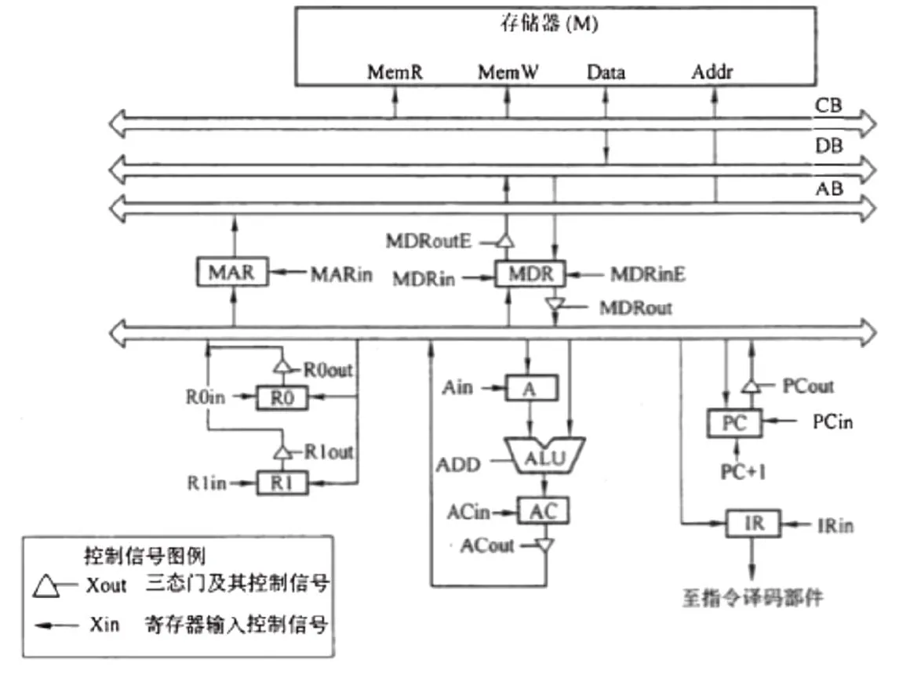

# 2009 年 408 真题 · 答案与解析

> 刷完 [[题面]] 后用此页对答案、看解析。
> 顺序：数据结构（1–11, 41–42）→ 组成原理（12–22, 43–44）→ 操作系统（23–32, 45–46）→ 计算机网络（33–40, 47）

## 一、选择题答案速查表（40 题，每题 2 分，共 80 分）

| 题号 | 1 | 2 | 3 | 4 | 5 | 6 | 7 | 8 | 9 | 10 |
| 答案 | **B** | **C** | **D** | **B** | **C** | **B** | **A** | **D** | **A** | **B** |
| 科目 | 数结 | 数结 | 数结 | 数结 | 数结 | 数结 | 数结 | 数结 | 数结 | 数结 |

| 题号 | 11 | 12 | 13 | 14 | 15 | 16 | 17 | 18 | 19 | 20 |
| 答案 | **C** | **D** | **D** | **C** | **D** | **C** | **A** | **A** | **D** | **B** |
| 科目 | 数结 | 组原 | 组原 | 组原 | 组原 | 组原 | 组原 | 组原 | 组原 | 组原 |

| 题号 | 21 | 22 | 23 | 24 | 25 | 26 | 27 | 28 | 29 | 30 |
| 答案 | **D** | **A** | **D** | **D** | **C** | **A** | **C** | **B** | **A** | **A** |
| 科目 | 组原 | 组原 | 操作 | 操作 | 操作 | 操作 | 操作 | 操作 | 操作 | 操作 |

| 题号 | 31 | 32 | 33 | 34 | 35 | 36 | 37 | 38 | 39 | 40 |
| 答案 | **B** | **A** | **B** | **B** | **C** | **A** | **D** | **D** | **C** | **A** |
| 科目 | 操作 | 操作 | 计网 | 计网 | 计网 | 计网 | 计网 | 计网 | 计网 | 计网 |

> 科目缩写：数结 = 数据结构 | 组原 = 计算机组成原理 | 操作 = 操作系统 | 计网 = 计算机网络

## 二、综合题答案要点速查表（7 题，共 70 分）

| 题号 | 分值 | 科目 | 考点 | 关键结论 |
|------|------|------|------|----------|
| 41 | 10 | 数据结构 | 图 | 答案：不一定能求得最短路径 |
| 42 | 15 | 数据结构 | 线性表 | 答案：1、基本思想：用快慢双指针，先让指针 p 前进 k 步，再让 q 与 p 同步前进；当 p 到达表尾时，q 即指向倒数第 k 个结点 |
| 43 | 8 | 计算机组成原理 | 输入输出系统 | 答案：1、中断方式下 CPU 用于外设 I/O 的时间占比为 2.5% |
| 44 | 13 | 计算机组成原理 | 中央处理器 | 答案：完成 (R1) 所指主存单元读出到 MDR 及后续加法的节拍与控制信号如下： |
| 45 | 7 | 操作系统 | 进程与线程 | 答案：设信号量 mutex=1（互斥访问缓冲区）、empty=N（空位数）、odd=0、even=0（分别同步奇偶数） |
| 46 | 8 | 操作系统 | 内存管理 | 答案：1、访问 2362H 用 210ns；访问 1565H 用 100000220ns（缺页）；访问 25A5H 用 110ns |
| 47 | 9 | 计算机网络 | 网络层 | 答案：(1) 划为两个 /25 子网：202.118.1.0/25 和 202.118.1.128/25（主机号 7 位，每个可含 126 台主机，满足不少于 ... |

---

## 三、详细解析

> 以下按题号顺序排列。每题包含题干、选项、答案、解析。
> 图片以相对路径 `images/xxx.webp` 引用，与本文同目录。

### 选择题 · 数据结构

### 1. （2 分 · 栈、队列与数组）

为解决计算机与打印机之间速度不匹配的问题，通常设置一个打印数据缓冲区，主机将要输出的数据依次写入该缓冲区，而打印机则依次从该缓冲区中取出数据。该缓冲区的逻辑结构应该是( )。

- **A.** 栈
- **B.** 队列
- **C.** 树
- **D.** 图

**答案**：B

**解析**：答案 B。缓冲区按「先写入的先取出」工作，这正是队列先进先出（FIFO）的特点。栈是后进先出，会颠倒打印顺序；树和图是非线性结构，无法描述这种顺序读写关系。

> 难度 ⭐ ｜ 章节 栈、队列与数组 ｜ 标签 数据结构 / 栈 / 队列 / 数组 / 缓冲区

---

### 2. （2 分 · 栈、队列与数组）

设栈 S 和队列 Q 的初始状态均为空，元素 a, b, c, d, e, f, g 依次进入栈 S 。若每个元素出栈后立即进入队列 Q，且 7 个元素出队的顺序是 b, d, c, f, e, a, g，则栈 S 的容量至少是( )。

- **A.** 1
- **B.** 2
- **C.** 3
- **D.** 4

**答案**：C

**解析**：答案 C。栈的容量即入栈过程中栈内元素最多的个数。按出栈序列 b,d,c,f,e,a,g 模拟入栈、出栈，栈内最多同时有 3 个元素，故容量至少为 3。

> 难度 ⭐⭐⭐ ｜ 章节 栈、队列与数组 ｜ 标签 数据结构 / 栈 / 队列 / 数组

---

### 3. （2 分 · 树与二叉树）

给定二叉树如图所示。设 N 代表二叉树的根，L 代表根结点的左子树，R 代表根结点的右子树。若遍历后的结点序列是 3，1，7，5，6，2，4，则其遍历方式是______。


- **A.** LRN
- **B.** NRL
- **C.** RLN
- **D.** RNL

**答案**：D

**解析**：答案 D。序列中先出现的都是右子树结点，接着是根结点，最后是左子树结点，即按「右子树 → 根 → 左子树」的顺序遍历，记为 RNL。这是中序遍历的镜像（把左右子树的访问顺序对调），不是二叉树三种基本遍历之一。

> 难度 ⭐⭐⭐ ｜ 章节 树与二叉树 ｜ 标签 数据结构 / 树 / 二叉树 / 二叉树遍历

---

### 4. （2 分 · 查找）

下列二叉排序树中，满足平衡二叉树定义的是______。


- **A.** 图 A
- **B.** 图 B
- **C.** 图 C
- **D.** 图 D

**答案**：B

**解析**：答案 B。平衡二叉树要求任意结点的左、右子树高度差绝对值不超过 1。B 满足；其余选项都有不满足该条件的结点，可逐个结点算平衡因子验证。

> 难度 ⭐⭐⭐ ｜ 章节 查找 ｜ 标签 数据结构 / 查找 / 散列表 / B树 / AVL树 / 二叉排序树

---

### 5. （2 分 · 树与二叉树）

已知一棵完全二叉树的第 6 层(设根为第 1 层)有 8 个叶结点，则该完全二叉树的结点个数最多是()。

- **A.** 39
- **B.** 52
- **C.** 111
- **D.** 119

**答案**：C

**解析**：答案 C。第 6 层有 8 个叶结点，说明第 7 层少了 8×2=16 个结点（这 8 个叶结点本应各有 2 个孩子）。满 7 层二叉树共 2⁷−1=127 个结点，减去 16 得 111 个。

> 难度 ⭐⭐⭐ ｜ 章节 树与二叉树 ｜ 标签 数据结构 / 树 / 二叉树 / 二叉树遍历

---

### 6. （2 分 · 树与二叉树）

将森林转换为对应的二叉树，若在二叉树中，结点 u 是结点 v 的父结点的父结点，则在原来的森林中，u 和 v 可能具有的关系是( )。

I. 父子关系

II. 兄弟关系

III. u 的父结点与 v 的父结点是兄弟关系

- **A.** 只有 II
- **B.** I 和 II
- **C.** I 和 III
- **D.** I、II 和 III

**答案**：B

**解析**：答案 B。森林转二叉树用「左孩子右兄弟」规则。转换后 u 是 v 的父结点的父结点，对应原森林中 u 是 v 的祖父（I），或 u 与 v 是隔一个兄弟的兄弟关系（II）；III 不可能。

> 难度 ⭐⭐⭐⭐ ｜ 章节 树与二叉树 ｜ 标签 数据结构 / 树 / 二叉树 / 二叉树遍历

---

### 7. （2 分 · 图）

下列关于无向连通图特性的叙述中，正确的是()。

I. 所有顶点的度之和为偶数

II. 边数大于顶点个数减 1

III. 至少有一个顶点的度为 1

- **A.** 只有 I
- **B.** 只有 II
- **C.** I 和 II
- **D.** I 和 III

**答案**：A

**解析**：答案 A。无向图中每条边连接两个顶点，求度之和时每条边被计两次，故度之和为偶数（I 正确）。n 个顶点 n−1 条边可构成树（II 错误）；完全图不存在度为 1 的顶点（III 错误）。

> 难度 ⭐⭐ ｜ 章节 图 ｜ 标签 数据结构 / 图 / 最短路径 / 最小生成树

---

### 8. （2 分 · 查找）

下列叙述中，不符合 m 阶 B 树定义要求的是()。

- **A.** 根节点最多有 m 棵子树
- **B.** 所有叶结点都在同一层上
- **C.** 各结点内关键字均升序或降序排列
- **D.** 叶结点之间通过指针链接

**答案**：D

**解析**：答案 D。m 阶 B 树要求结点内关键字有序、所有叶结点同层、每个结点至多 m 棵子树。D 的「叶结点之间用指针链接」是 B+ 树的特点，不是 B 树。

> 难度 ⭐⭐ ｜ 章节 查找 ｜ 标签 数据结构 / 查找 / 散列表 / B树

---

### 9. （2 分 · 排序）

已知关键字序列 5，8，12，19，28，20，15，22 是小根堆(最小堆)，插入关键字 3，调整后得到的小根堆是()。

- **A.** 3，5，12，8，28，20，15，22，19
- **B.** 3，5，12，19，20，15，22，8，28
- **C.** 3，8，12，5，20，15，22，28，19
- **D.** 3，12，5，8，28，20，15，22，19

**答案**：A

**解析**：答案 A。插入 3 先放堆尾，再向上调整。原堆 5,8,12,19,28,20,15,22 插入 3 并上浮后为 3,5,12,8,28,20,15,22,19。

> 难度 ⭐⭐ ｜ 章节 排序 ｜ 标签 数据结构 / 排序 / 内部排序 / 外部排序

---

### 10. （2 分 · 排序）

若数据元素序列 11，12，13，7，8，9，23，4，5 是采用下列排序方法之一得到的第二趟排序后的结果，则该排序算法只能是（）。

- **A.** 冒泡排序
- **B.** 插入排序
- **C.** 选择排序
- **D.** 二路归并排序

**答案**：B

**解析**：答案 B。序列 11,12,13,7,8,9,23,4,5 是第二趟后的结果，前三个元素 11,12,13 已有序，符合插入排序「每趟使前面元素有序」的特征。冒泡/选择每趟确定一个最大或最小元素，归并第一趟后应两两有序，均不符。

> 难度 ⭐⭐⭐ ｜ 章节 排序 ｜ 标签 数据结构 / 排序 / 内部排序 / 外部排序

---

### 综合题 · 数据结构

### 41. （10 分 · 图）

带权图(权值非负，表示边连接的两顶点间的距离)的最短路径问题是找出从初始顶点到目标顶点之间的一条最短路径。假设从初始顶点到目标顶点之间存在路径，现有一种解决该问题的方法：

① 设最短路径初始时仅包含初始顶点，令当前顶点 u 为初始顶点；

② 选择离 u 最近且尚未在最短路径中的一个顶点 v，加入到最短路径中，修改当前顶点 u=v；

③ 重复步骤 ②，直到 u 是目标顶点时为止。

请问上述方法能否求得最短路径？若该方法可行，请证明之；否则，请举例说明。

**答案 / 解析**：

答案：不一定能求得最短路径。理由：该方法每次选「离目标最近的邻接点」，是局部贪心，不能保证全局最短。反例：设顶点 1 到 4 的直连边权为 3，另有路径 1→2→3→4 总权为 2，从 1 出发选离 4 最近的邻接点会走权 3 的直边，得到 3 而非最短的 2；还可能因「离目标最近」判断错误而根本走不到目标。

> 难度 ⭐⭐⭐⭐ ｜ 章节 图 ｜ 标签 数据结构 / 图 / 最短路径 / 最小生成树

---

### 42. （15 分 · 线性表）

已知一个带有表头结点的单链表，结点结构为：


假设该链表只给出了头指针 list。在不改变链表的前提下，请设计一个尽可能高效的算法，查找链表中倒数第 k 个位置上的结点（k 为正整数）。若查找成功，算法输出该结点的 data 域的值，并返回 1；否则，只返回 0。要求：

（1）描述算法的基本设计思想。

（2）描述算法的详细实现步骤。

（3）根据设计思想和实现步骤，采用程序设计语言描述算法（使用 C、C++ 或 Java 语言实现），关键之处请给出简要注释。

**答案 / 解析**：

答案：1、基本思想：用快慢双指针，先让指针 p 前进 k 步，再让 q 与 p 同步前进；当 p 到达表尾时，q 即指向倒数第 k 个结点。一趟扫描完成。2、时间 O(n)、空间 O(1)。核心代码：

```c
int FindKthFromEnd(Node *head, int k) {
    Node *p = head, *q = head;
    for (int i = 0; i < k; i++) {
        if (p->link == NULL) return 0;   // k 超过表长
        p = p->link;
    }
    while (p != NULL) { p = p->link; q = q->link; }
    return q->data;
}
```

> 难度 ⭐⭐⭐⭐ ｜ 章节 线性表 ｜ 标签 数据结构 / 线性表 / 顺序表 / 链表

---

### 选择题 · 计算机组成原理

### 11. （2 分 · 计算机系统概述）

冯·诺依曼计算机中指令和数据均以二进制存放，CPU 区分它们的依据是（ ）。

- **A.** 指令操作码译码结果
- **B.** 指令和数据的寻址方式
- **C.** 指令周期的不同阶段
- **D.** 指令和数据所在存储单元

**答案**：C

**解析**：答案 C。CPU 靠指令周期的阶段区分指令和数据：取指阶段取出的是指令，执行阶段取出的是数据。不能靠译码结果区分，因为译码发生在确定是指令之后。

> 难度 ⭐⭐⭐ ｜ 章节 计算机系统概述 ｜ 标签 计算机组成原理 / 计算机系统概述

---

### 12. （2 分 · 数据表示与运算）

一个 C 语言程序在一台 32 位机器上运行。程序中定义了三个变量 x，y 和 z，其中 x 和 z 是 int 型，y 为 short 型。当 x=127，y=-9 时，执行赋值语句 z=x+y 后，x、y 和 z 的值分别是：

- **A.** x=0000007FH,y=FFF9H,z=00000076H
- **B.** x=0000007FH,y=FFF9H,z=FFFF0076H
- **C.** x=0000007FH,y=FFF7H,z=FFFF0076H
- **D.** x=0000007FH,y=FFF7H,z=00000076H

**答案**：D

**解析**：答案 D。x=127=0000007FH；y=−9 的 16 位补码为 FFF7H，符号扩展成 int 为 FFFFFFF7H。z=x+y=0000007FH+FFFFFFF7H=00000076H。

> 难度 ⭐⭐⭐ ｜ 章节 数据表示与运算 ｜ 标签 计算机组成原理 / 数据表示 / 运算

---

### 13. （2 分 · 数据表示与运算）

浮点数加、减运算过程一般包括对阶、尾数运算、规格化、舍入和判溢出等步骤。设浮点数的阶码和尾数均采用补码表示，且位数分别为 5 位和 7 位（均含 2 位符号位）。若有两个数 X=$2^7 \times 29/32$，Y=$2^5 \times 5/8$，则用浮点加法计算 X+Y 的最终结果是（ ）。

- **A.** 00111 1100010
- **B.** 00111 0100010
- **C.** 01000 0010001
- **D.** 发生溢出

**答案**：D

**解析**：答案 D。对阶后尾数相加得 01.00010，符号位为 01，需右规；右规后阶码加 1 变为 01,000，阶码符号位为 01 表示溢出。

> 难度 ⭐⭐⭐⭐ ｜ 章节 数据表示与运算 ｜ 标签 计算机组成原理 / 数据表示 / 运算

---

### 14. （2 分 · 存储器层次结构）

某计算机的 Cache 共有 16 块，采用 2 路组相联映射方式（即每组 2 块）。每个主存块大小为 32 字节，按字节编址。主存 129 号单元所在主存块应装入到的 Cache 组号是（ ）。

- **A.** 0
- **B.** 1
- **C.** 4
- **D.** 6

**答案**：C

**解析**：答案 C。16 块 2 路组相联共 8 组，主存块按模 8 映射。主存块大小 32 字节，129 号单元在第 4 块（129÷32=4），4 mod 8=4，映射到第 4 组。

> 难度 ⭐⭐ ｜ 章节 存储器层次结构 ｜ 标签 计算机组成原理 / 存储器层次结构 / Cache

---

### 15. （2 分 · 存储器层次结构）

某计算机主存容量为 64KB，其中 ROM 区为 4KB，其余为 RAM 区，按字节编址。现要用 2K×8 位的 ROM 芯片和 4K×4 位的 RAM 芯片来设计该存储器，则需要上述规格的 ROM 芯片数和 RAM 芯片数分别是（）。

- **A.** 1、15
- **B.** 2、15
- **C.** 1、30
- **D.** 2、30

**答案**：D

**解析**：答案 D。ROM 区 4KB 用 2K×8 芯片需 2 片（字扩展）；RAM 区 60KB 用 4K×4 芯片需 60K×8/(4K×4)=30 片（字位同时扩展）。

> 难度 ⭐⭐⭐ ｜ 章节 存储器层次结构 ｜ 标签 计算机组成原理 / 存储器层次结构

---

### 16. （2 分 · 指令系统）

某机器字长 16 位，主存按字节编址，转移指令采用相对寻址，由两个字节组成，第一字节为操作码字段，第二字节为相对位移量字段。假定取指令时，每取一个字节 PC 自动加 1。若某转移指令所在主存地址为 2000H，相对位移量字段的内容为 06H，则该转移指令成功转移后的目标地址是（）。

- **A.** 2006H
- **B.** 2007H
- **C.** 2008H
- **D.** 2009H

**答案**：C

**解析**：答案 C。相对寻址 EA=(PC)+A。取完两字节指令后 PC=2000H+2=2002H，故 EA=2002H+06H=2008H。易错点是 PC 要加 2 而不是加 1。

> 难度 ⭐⭐⭐ ｜ 章节 指令系统 ｜ 标签 计算机组成原理 / 指令系统 / 寻址方式 / CISC / RISC

---

### 17. （2 分 · 指令系统）

关于 RISC 的叙述，错误的是

- **A.** RISC 普遍采用微程序控制器
- **B.** 大多数指令在一个时钟周期内完成
- **C.** 内部通用寄存器数量相对 CISC 多
- **D.** 指令数、寻址方式和指令格式种类相对 CISC 少

**答案**：A

**解析**：答案 A。RISC 指令少、格式固定、以硬布线控制为主、速度快，不用或少用微程序控制。A 说「普遍采用微程序控制器」是错的。

> 难度 ⭐⭐ ｜ 章节 指令系统 ｜ 标签 计算机组成原理 / 指令系统 / 寻址方式 / CISC / RISC / 指令集架构

---

### 18. （2 分 · 中央处理器）

某计算机的指令流水线由四个功能段组成，指令流经各功能段的时间（忽略各功能段之间的缓存时间）分别为 90 ns、80 ns、70 ns、和 60 ns，则该计算机的 CPU 时钟周期至少是（）。

- **A.** 90ns
- **B.** 80ns
- **C.** 70ns
- **D.** 60ns

**答案**：A

**解析**：答案 A。流水线时钟周期取最慢功能段的时间，否则最慢段无法在周期内完成。故取 90ns。

> 难度 ⭐ ｜ 章节 中央处理器 ｜ 标签 计算机组成原理 / CPU / 数据通路 / 指令流水线 / Cache / 性能指标 / 应用层

---

### 19. （2 分 · 中央处理器）

相对于微程序控制器，硬布线控制器的特点是

- **A.** 速度慢修改扩展容易
- **B.** 速度慢修改扩展难
- **C.** 速度快修改扩展容易
- **D.** 速度快修改扩展难

**答案**：D

**解析**：答案 D。硬布线控制器用专用逻辑电路实现，速度快但难修改扩展；微程序控制器修改灵活但每条指令都要访问控制存储器，速度慢。

> 难度 ⭐⭐ ｜ 章节 中央处理器 ｜ 标签 计算机组成原理 / CPU / 数据通路 / 指令流水线 / CPU设计

---

### 20. （2 分 · 总线）

假设某系统总线在一个总线周期中并行传输 4 字节信息，一个总线周期占用 2 个时钟周期，总线时钟频率为 10MHz，则总线带宽是（）。

- **A.** 10MB/S
- **B.** 20MB/S
- **C.** 40MB/S
- **D.** 80MB/S

**答案**：B

**解析**：答案 B。时钟周期 = 1/10MHz = 0.1μs，一个总线周期 2 个时钟周期传输 4 字节，带宽 = 4B/(2×0.1μs) = 20MB/s。

> 难度 ⭐⭐ ｜ 章节 总线 ｜ 标签 计算机组成原理 / 总线 / 系统总线 / I/O接口 / 性能指标 / 物理层

---

### 21. （2 分 · 存储器层次结构）

假设某计算机的存储系统由 Cache 和主存组成，某程序执行过程中访存 1000 次，其中访问 Cache 缺失（未命中）50 次，则 Cache 的命中率是（）。

- **A.** 5%
- **B.** 9.5%
- **C.** 50%
- **D.** 95%

**答案**：D

**解析**：答案 D。命中率 = (1000−50)/1000 = 95%。注意题目给的是「缺失 50 次」而非「命中 50 次」。

> 难度 ⭐ ｜ 章节 存储器层次结构 ｜ 标签 计算机组成原理 / 存储器层次结构 / Cache

---

### 22. （2 分 · 中央处理器）

下列选项中，能引起外部中断的事件是（ ）。

- **A.** 键盘输入
- **B.** 除数为 0
- **C.** 浮点运算下溢
- **D.** 访存缺页

**答案**：A

**解析**：答案 A。外部中断来自 CPU 与内存之外。键盘输入是外部事件，能引起外部中断；除数为 0 和缺页是内中断（异常），浮点下溢按机器零处理不产生中断。

> 难度 ⭐⭐ ｜ 章节 中央处理器 ｜ 标签 计算机组成原理 / CPU / 数据通路 / 指令流水线 / I/O方式

---

### 综合题 · 计算机组成原理

### 43. （8 分 · 输入输出系统）

某计算机的 CPU 主频为 500MHz，CPI 为 5（即执行每条指令平均需 5 个时钟周期）。假定某外设的数据传输率为 0.5MB/s，采用中断方式与主机进行数据传送，以 32 位为传输单位，对应的中断服务程序包含 18 条指令，中断服务的其他开销相当于 2 条指令的执行时间。请回答下列问题，要求给出计算过程。

(1) 在中断方式下，CPU 用于该外设 I/ O 的时间占整个 CPU 时间的百分比是多少？

(2) 当该外设的数据传输率达到 5M B/s 时，改用 DMA 方式传送数据。假定每次 DMA 传送块大小为 5000B，且 DMA 预处理和后处理的总开销为 500 个时钟周期，则 CPU 用于该外设 I/ O 的时间占整个 CPU 时间的百分比是多少？（假设 DMA 与 CPU 之间没有访存冲突）

**答案 / 解析**：

答案：1、中断方式下 CPU 用于外设 I/O 的时间占比为 2.5%。2、改用 DMA 方式后占比降为 0.1%。

计算：中断每次传送 4B，开销 5×18+5×2=100 个时钟周期；0.5MB/s 对应每秒 125000 次中断，共 12.5M 周期，占 12.5M/500M=2.5%。DMA 每次 5000B，5MB/s 对应每秒 1000 次，总开销 1000×500=0.5M 周期，占 0.5M/500M=0.1%。

> 难度 ⭐⭐⭐ ｜ 章节 输入输出系统 ｜ 标签 计算机组成原理 / I/O系统 / 中断 / DMA / 性能指标 / I/O方式

---

### 44. （13 分 · 中央处理器）

某计算机字长为 16 位，采用 16 位定长指令字结构，部分数据通路结构如下图所示。图中所有控制信号为 1 时表示有效、为 0 时表示无效。例如，控制信号 MDRinE 为 1 表示允许数据从 DB 打入 MDR，MDRin 为 1 表示允许数据从内总线打入 MDR。假设 MAR 的输出一直处于使能状态。加法指令“ADD (R1), R0”的功能为 (R0) + ((R1)) → (R1)，即将 R0 中的数据与 R1 的内容所指主存单元的数据相加，并将结果送入 R1 的内容所指主存单元中保存。



下表给出了上述指令取指和译码阶段每个节拍（时钟周期）的功能和有效控制信号，请按表中描述方式用表格列出指令执行阶段每个节拍的功能和有效控制信号。

| 时钟 | 功能 | 有效控制信号 |
| --- | --- | --- |
| C1 | MAR ← (PC) | PCout, MARin |
| C2 | MDR ← M(MAR)；PC ← (PC) + 1 | MemR, MDRinE, PC+1 |
| C3 | IR ← (MDR) | MDRout, IRin |
| C4 | 指令译码 | 无 |

**答案 / 解析**：

答案：完成 (R1) 所指主存单元读出到 MDR 及后续加法的节拍与控制信号如下：

C5: (R1)→MAR（R1out, MARin）
C6: M(MAR)→MDR（MemR, MDRinE）
C7: (MDR)→A（MDRout, Ain）
C8: (A)+(R0)→AC（R0out, Add, ACin）
C9: (AC)→MDR（ACout, MDRin）
C10: (MDR)→M(MAR)（MDRoutE, MemW）

数据流动：先把 R1 内容作地址送 MAR，读出内存到 MDR，MDR 送入 ALU 输入端 A，与 R0 相加得 AC，再经 MDR 写回原地址（MAR 不变）。

> 难度 ⭐⭐⭐ ｜ 章节 中央处理器 ｜ 标签 计算机组成原理 / CPU / 数据通路 / 指令流水线 / CPU设计 / 性能指标

---

### 选择题 · 操作系统

### 23. （2 分 · 计算机系统概述）

单处理机系统中，可并行的是（ ）。

Ⅰ. 进程与进程

Ⅱ. 处理机与设备

Ⅲ. 处理机与通道

Ⅳ. 设备与设备

- **A.** Ⅰ、Ⅱ、Ⅲ
- **B.** Ⅰ、Ⅱ、Ⅳ
- **C.** Ⅰ、Ⅲ、Ⅳ
- **D.** Ⅱ、Ⅲ、Ⅳ

**答案**：D

**解析**：答案 D。单处理机同一时刻只能一个进程占用 CPU，进程间不能并行（Ⅰ 错）。处理机与设备、处理机与通道、设备与设备之间可并行（Ⅱ、Ⅲ、Ⅳ 对）。

> 难度 ⭐⭐ ｜ 章节 计算机系统概述 ｜ 标签 操作系统 / 计算机系统概述 / I/O方式

---

### 24. （2 分 · 进程与线程）

下列进程调度算法中，综合考虑进程等待时间和执行时间的是（ ）。

- **A.** 时间片轮转调度算法
- **B.** 短进程优先调度算法
- **C.** 先来先服务调度算法
- **D.** 高响应比优先调度算法

**答案**：D

**解析**：答案 D。最高响应比优先算法综合考虑等待时间和执行时间：响应比 R=(等待时间+执行时间)/执行时间，长进程也不会饿死。

> 难度 ⭐⭐ ｜ 章节 进程与线程 ｜ 标签 操作系统 / 进程管理 / 进程 / 线程 / 同步 / PV操作 / 进程调度

---

### 25. （2 分 · 进程与线程）

某计算机系统中有 8 台打印机，由 K 个进程竞争使用，每个进程最多需要 3 台打印机。该系统可能会发生死锁的 K 的最小值是（ ）。

- **A.** 2
- **B.** 3
- **C.** 4
- **D.** 5

**答案**：C

**解析**：答案 C。鸽巢原理：若 K 个进程各已占 2 台（共 2K 台）且无剩余可分配，则死锁。2K=8 即 K=4 时恰好死锁，故最小值为 4。

> 难度 ⭐⭐⭐ ｜ 章节 进程与线程 ｜ 标签 操作系统 / 进程管理 / 进程 / 线程 / 同步 / PV操作 / 死锁

---

### 26. （2 分 · 内存管理）

分区分配内存管理方式的主要保护措施是（ ）。

- **A.** 界地址保护
- **B.** 程序代码保护
- **C.** 数据保护
- **D.** 栈保护

**答案**：A

**解析**：答案 A。分区分配用界地址保护：程序访问内存时由硬件检查地址是否落在所属分区内，越界则中断。

> 难度 ⭐⭐ ｜ 章节 内存管理 ｜ 标签 操作系统 / 内存管理 / 分页 / 分段 / 虚拟内存 / 页面置换

---

### 27. （2 分 · 内存管理）

一个分段存储管理系统中，地址长度为 32 位，其中段号占 8 位，则最大段长是（ ）。

- **A.** 2⁸字节
- **B.** 2¹⁶字节
- **C.** 2²⁴字节
- **D.** 2³²字节

**答案**：C

**解析**：答案 C。段号占 8 位，位移量占 32−8=24 位，最大段长即位移量的最大值 2²⁴ B。

> 难度 ⭐⭐ ｜ 章节 内存管理 ｜ 标签 操作系统 / 内存管理 / 分页 / 分段 / 虚拟内存 / 页面置换 / 内存分配

---

### 28. （2 分 · 文件管理）

下列文件物理结构中，适合随机访问且易于文件扩展的是（ ）。

- **A.** 连续结构
- **B.** 索引结构
- **C.** 链式结构且磁盘块定长
- **D.** 链式结构且磁盘块变长

**答案**：B

**解析**：答案 B。索引结构通过索引表定位，支持随机访问，且增加索引项即可扩展文件。链式不能随机访问，连续分配不易扩展。

> 难度 ⭐⭐ ｜ 章节 文件管理 ｜ 标签 操作系统 / 文件系统 / 文件 / 目录 / 磁盘

---

### 29. （2 分 · 输入输出管理）

假设磁头当前位于第 105 道，正在向磁道序号增加的方向移动。现有一个磁道访问请求序列为 35，45，12，68，110，180，170，195，采用 SCAN 调度（电梯调度）算法得到的磁道访问序列是（ ）。

- **A.** 110,170,180,195,68,45,35,12
- **B.** 110,68,45,35,12,170,180,195
- **C.** 110,170,180,195,12,35,45,68
- **D.** 12,35,45,68,110,170,180,195

**答案**：A

**解析**：答案 A。SCAN 算法像电梯：磁头从 105 向增大方向移动，先服务 110,170,180,195，再反向依次服务 68,45,35,12。

> 难度 ⭐⭐⭐ ｜ 章节 输入输出管理 ｜ 标签 操作系统 / I/O系统 / 中断 / DMA / 磁盘 / 进程调度

---

### 30. （2 分 · 文件管理）

文件系统中，文件访问控制信息存储的合理位置是（ ）。

- **A.** 文件控制块
- **B.** 文件分配表
- **C.** 用户口令表
- **D.** 系统注册表

**答案**：A

**解析**：答案 A。文件控制块 FCB 存储文件的描述和控制信息（含访问控制信息），是实现按名存取的数据结构。

> 难度 ⭐⭐ ｜ 章节 文件管理 ｜ 标签 操作系统 / 文件系统 / 文件 / 目录 / 磁盘

---

### 31. （2 分 · 文件管理）

设文件 F1 的当前引用计数值为 1，先建立 F1 的符号链接（软链接）文件 F2，再建立 F1 的硬链接文件 F3，然后删除 F1。此时，F2 和 F3 的引用计数值分别是（ ）。

- **A.** 0、1
- **B.** 1、1
- **C.** 1、2
- **D.** 2、1

**答案**：B

**解析**：答案 B。符号链接是独立文件，建立时引用计数为 1；硬链接使源文件引用计数加 1。建立 F3 后 F1、F3 引用计数均为 2，删除 F1 后 F3 减为 1，F2 一直为 1。

> 难度 ⭐⭐⭐⭐ ｜ 章节 文件管理 ｜ 标签 操作系统 / 文件系统 / 文件 / 目录 / 磁盘

---

### 32. （2 分 · 输入输出管理）

程序员利用系统调用打开 I/O 设备时，通常使用的设备标识是（ ）。

- **A.** 逻辑设备名
- **B.** 物理设备名
- **C.** 主设备号
- **D.** 从设备号

**答案**：A

**解析**：答案 A。设备独立性：程序员用逻辑设备名请求设备，实际执行时由系统转换成对应的物理设备名。

> 难度 ⭐⭐ ｜ 章节 输入输出管理 ｜ 标签 操作系统 / I/O系统 / 中断 / DMA

---

### 综合题 · 操作系统

### 45. （7 分 · 进程与线程）

三个进程 P1、P2、P3 互斥使用一个包含 N（N > 0）个单元的缓冲区：

- P1：每次用 `produce()` 生成一个正整数，并用 `put()` 送入缓冲区某一空单元
- P2：每次用 `getodd()` 从该缓冲区中取出一个奇数，并用 `countodd()` 统计奇数个数
- P3：每次用 `geteven()` 从该缓冲区中取出一个偶数，并用 `counteven()` 统计偶数个数

请用信号量机制实现这三个进程的同步与互斥活动，并说明所定义信号量的含义。要求用伪代码描述。

**答案 / 解析**：

答案：设信号量 mutex=1（互斥访问缓冲区）、empty=N（空位数）、odd=0、even=0（分别同步奇偶数）。

```c
semaphore mutex=1, empty=N, odd=0, even=0;
P1() { while(1) { x=produce(); P(empty); P(mutex); put(x); V(mutex);
    if(x%2==0) V(even); else V(odd); } }
P2() { while(1) { P(odd); P(mutex); getodd(); V(mutex); V(empty); countodd(); } }
P3() { while(1) { P(even); P(mutex); geteven(); V(mutex); V(empty); counteven(); } }
```

> 难度 ⭐⭐⭐ ｜ 章节 进程与线程 ｜ 标签 操作系统 / 进程管理 / 进程 / 线程 / 同步 / PV操作 / 缓冲区 / 同步与互斥

---

### 46. （8 分 · 内存管理）

请求分页管理系统中，假设某进程的页表内容如下。

| 页号 | 页框（Page Frame）号 | 有效位（存在位） |
| --- | --- | --- |
| 0 | 101H | 1 |
| 1 |  | 0 |
| 2 | 254H | 1 |

页面大小为 4 KB，一次内存的访问时间为 100 ns，一次快表（TLB）的访问时间为 10 ns，处理一次缺页的平均时间为 $10^8$ ns（已含更新 TLB 和页表的时间），进程的驻留集大小固定为 2，采用最近最少使用置换算法（LRU）和局部淘汰策略。假设：

① TLB 初始为空；

② 地址转换时先访问 TLB，若 TLB 未命中，再访问页表（忽略访问页表之后的 TLB 更新时间）；

③ 有效位为 0 表示页面不在内存中，产生缺页中断；缺页中断处理后，返回到产生缺页中断的指令处重新执行。

设有虚地址访问序列 2362H、1565H、25A5H，请问：

（1）依次访问上述三个虚地址，各需多少时间？给出计算过程。

（2）基于上述访问序列，虚地址 1565H 的物理地址是多少？请说明理由。

**答案 / 解析**：

答案：1、访问 2362H 用 210ns；访问 1565H 用 100000220ns（缺页）；访问 25A5H 用 110ns。2、1565H 缺页时淘汰 0 号页，对应页框 101H，物理地址 101565H。

页面 4KB，低 12 位为页内偏移。2362H 页号 2：快表未命中→访页表 100ns→访存 100ns，加 10ns 快表共 210ns。1565H 页号 1：快表、页表均未命中→缺页 10⁸ns→再访快表 10ns→访存 100ns。25A5H 页号 2 已在快表，10+100=110ns。

> 难度 ⭐⭐⭐ ｜ 章节 内存管理 ｜ 标签 操作系统 / 内存管理 / 分页 / 分段 / 虚拟内存 / 页面置换 / Cache / 地址转换 / I/O方式 / 内存分配

---

### 选择题 · 计算机网络

### 33. （2 分 · 计算机网络体系结构）

OSI 参考模型中，自下而上第一个提供端到端服务的层次是（ ）

- **A.** 数据链路层
- **B.** 传输层
- **C.** 会话层
- **D.** 应用层

**答案**：B

**解析**：答案 B。传输层通过端口号提供进程间的端到端逻辑通信，是自下而上第一个提供端到端服务的层次。

> 难度 ⭐⭐ ｜ 章节 计算机网络体系结构 ｜ 标签 计算机网络 / 计算机网络体系结构

---

### 34. （2 分 · 物理层）

在无噪声情况下，若某低通通信链路的带宽为 3 kHz，采用 4 个相位，每个相位具有 4 种振幅的 QAM 调制技术，则该通信链路的最大数据传输速率是（ ）。

- **A.** 12 kbps
- **B.** 24 kbps
- **C.** 48 kbps
- **D.** 96 kbps

**答案**：B

**解析**：答案 B。4 相位 × 4 振幅 = 16 种组合，每码元携带 log₂16=4 bit。按奈奎斯特定理，最大速率 = 2×3k×4 = 24 kbps。

> 难度 ⭐⭐⭐ ｜ 章节 物理层 ｜ 标签 计算机网络 / 物理层 / 编码 / 调制

---

### 35. （2 分 · 数据链路层）

数据链路层采用后退 N 帧（GBN）协议，发送方已经发送了编号为 0～7 的帧。当计时器超时时，若发送方只收到 0、2、3 号帧的确认，则发送方需要重发的帧数是（ ）

- **A.** 2
- **B.** 3
- **C.** 4
- **D.** 5

**答案**：C

**解析**：答案 C。GBN 用累计确认：收到 3 号帧确认表示 0～3 号帧都已收到，1 号确认只是返回途中丢失。因此需重传 4、5、6、7 号帧。

> 难度 ⭐⭐⭐ ｜ 章节 数据链路层 ｜ 标签 计算机网络 / 数据链路层 / MAC / CSMA/CD / PPP

---

### 36. （2 分 · 数据链路层）

以太网交换机进行转发决策时使用的 PDU 地址是（ ）

- **A.** 目的物理地址
- **B.** 目的 IP 地址
- **C.** 源物理地址
- **D.** 源 IP 地址

**答案**：A

**解析**：答案 A。以太网交换机工作在数据链路层，按目的 MAC（物理）地址转发，使用的 PDU 地址是目的物理地址。

> 难度 ⭐ ｜ 章节 数据链路层 ｜ 标签 计算机网络 / 数据链路层 / MAC / CSMA/CD / PPP / 指令流水线 / 内存分配

---

### 37. （2 分 · 数据链路层）

在一个采用 CSMA/CD 协议的网络中，传输介质是一根完整的电缆，传输速率为 1 Gbps，电缆中的信号传播速度是 200000 km/s。若最小数据帧长度减少 800 比特，则最远的两个站点之间的距离至少需要（ ）

- **A.** 增加 160 m
- **B.** 增加 80 m
- **C.** 减少 160 m
- **D.** 减少 80 m

**答案**：D

**解析**：答案 D。CSMA/CD 要求最短帧发送时间不小于碰撞窗口（2 倍往返时延）。帧长缩短后需减少冲突域距离使往返时延同步缩短，计算得最远两站点距离需减少 80m。

> 难度 ⭐⭐⭐ ｜ 章节 数据链路层 ｜ 标签 计算机网络 / 数据链路层 / MAC / CSMA/CD / PPP

---

### 38. （2 分 · 传输层）

主机甲与主机乙之间已建立一个 TCP 连接，主机甲向主机乙发送了两个连续的 TCP 段，分别包含 300 字节和 500 字节的有效载荷，第一个段的序列号为 200，主机乙正确接收到两个段后，发送给主机甲的确认序列号是（ ）。

- **A.** 500
- **B.** 700
- **C.** 800
- **D.** 1000

**答案**：D

**解析**：答案 D。TCP 确认号是期望收到的下一字节序号。乙收到 300+500=800 字节，起始序号 200，故确认号 = 200+800 = 1000。

> 难度 ⭐⭐⭐ ｜ 章节 传输层 ｜ 标签 计算机网络 / 传输层 / TCP / UDP / 拥塞控制

---

### 39. （2 分 · 传输层）

一个 TCP 连接总是以 1 KB 的最大段长发送 TCP 段，发送方有足够多的数据要发送。当拥塞窗口为 16 KB 时发生了超时，如果接下来的 4 个 RTT（往返时间）时间内的 TCP 段的传输都是成功的，那么当第 4 个 RTT 时间内发送的所有 TCP 段都得到肯定应答时，拥塞窗口大小是（ ）。

- **A.** 7 KB
- **B.** 8 KB
- **C.** 9 KB
- **D.** 16 KB

**答案**：C

**解析**：答案 C。超时后 ssthresh=16/2=8KB，拥塞窗口回到 1KB。慢开始：第 1～3 个 RTT 后窗口为 2、4、8KB（达 ssthresh），第 4 个 RTT 转拥塞避免加 1，故为 9KB。

> 难度 ⭐⭐⭐ ｜ 章节 传输层 ｜ 标签 计算机网络 / 传输层 / TCP / UDP / 拥塞控制

---

### 40. （2 分 · 应用层）

FTP 客户和服务器间传递 FTP 命令时，使用的连接是（ ）。

- **A.** 建立在 TCP 之上的控制连接
- **B.** 建立在 TCP 之上的数据连接
- **C.** 建立在 UDP 之上的控制连接
- **D.** 建立在 UDP 之上的数据连接

**答案**：A

**解析**：答案 A。FTP 用 TCP 保证可靠传输，且控制命令走独立的控制连接（带外传送），故选 A。

> 难度 ⭐ ｜ 章节 应用层 ｜ 标签 计算机网络 / 应用层 / HTTP / DNS / FTP / SMTP

---

### 综合题 · 计算机网络

### 47. （9 分 · 网络层）

某网络拓扑如下图所示，路由器 R1 通过接口 E1、E2 分别连接局域网 1、局域网 2，通过接口 L0 连接路由器 R2，并通过路由器 R2 连接域名服务器与互联网。R1 的 L0 接口的 IP 地址是 202.118.2.1，R2 的 L0 接口的 IP 地址是 202.118.2.2，L1 接口的 IP 地址是 130.11.120.1，E0 接口的 IP 地址是 202.118.3.1，域名服务器的 IP 地址是 202.118.3.2。


R1 和 R2 的路由表结构为：

| 目的网络 IP 地址 | 子网掩码 | 下一跳 IP 地址 | 接口 |
| --- | --- | --- | --- |

（1）将 IP 地址空间 202.118.1.0/24 划分为 2 个子网，分别分配给局域网 1、局域网 2，每个局域网需分配的 IP 地址数不少于 120 个。请给出子网划分结果，说明理由或给出必要的计算过程。

（2）请给出 R1 的路由表，使其明确包括到局域网 1 的路由、局域网 2 的路由、域名服务器的主机路由和互联网的路由。

（3）请采用路由聚合技术，给出到局域网 1 和局域网 2 的路由。

**答案 / 解析**：

答案：(1) 划为两个 /25 子网：202.118.1.0/25 和 202.118.1.128/25（主机号 7 位，每个可含 126 台主机，满足不少于 120）。
(2) R1 路由表（子网 1 分给局域网 1 时）：局域网 1 用 202.118.1.0/25 经 E1 直连，局域网 2 用 202.118.1.128/25 经 E2 直连；DNS 特定路由 202.118.3.2/32 下一跳 202.118.2.2 经 L0；默认路由 0.0.0.0/0 下一跳 202.118.2.2 经 L0。
(3) 两个局域网可聚合为 202.118.1.0/24，R2 到它们的路由为 202.118.1.0/24 下一跳 202.118.2.1 经 L0。

> 难度 ⭐⭐⭐ ｜ 章节 网络层 ｜ 标签 计算机网络 / 网络层 / IP / 路由 / 子网划分 / CIDR / 应用层


## See Also

- [[题面]] — 仅题干与选项，用于限时刷题
- [[../408历年真题总目录]] — 历年真题总目录
- [[408考情分析]] — 试卷构成与逐年考点统计
