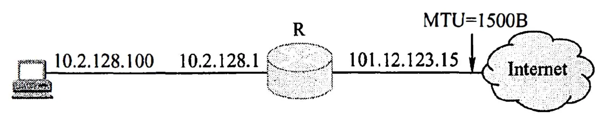

# 2011 年 408 真题 · 答案与解析

> 刷完 [[题面]] 后用此页对答案、看解析。
> 顺序：数据结构（1–11, 41–42）→ 组成原理（12–22, 43–44）→ 操作系统（23–32, 45–46）→ 计算机网络（33–40, 47）

## 一、选择题答案速查表（40 题，每题 2 分，共 80 分）

| 题号 | 1 | 2 | 3 | 4 | 5 | 6 | 7 | 8 | 9 | 10 |
| 答案 | **A** | **B** | **B** | **C** | **C** | **D** | **A** | **C** | **D** | **A** |
| 科目 | 数结 | 数结 | 数结 | 数结 | 数结 | 数结 | 数结 | 数结 | 数结 | 数结 |

| 题号 | 11 | 12 | 13 | 14 | 15 | 16 | 17 | 18 | 19 | 20 |
| 答案 | **B** | **D** | **A** | **B** | **D** | **A** | **C** | **D** | **C** | **C** |
| 科目 | 数结 | 组原 | 组原 | 组原 | 组原 | 组原 | 组原 | 组原 | 组原 | 组原 |

| 题号 | 21 | 22 | 23 | 24 | 25 | 26 | 27 | 28 | 29 | 30 |
| 答案 | **D** | **C** | **B** | **A** | **D** | **A** | **D** | **D** | **A** | **C** |
| 科目 | 组原 | 组原 | 操作 | 操作 | 操作 | 操作 | 操作 | 操作 | 操作 | 操作 |

| 题号 | 31 | 32 | 33 | 34 | 35 | 36 | 37 | 38 | 39 | 40 |
| 答案 | **B** | **C** | **A** | **B** | **B** | **D** | **D** | **C** | **C** | **B** |
| 科目 | 操作 | 操作 | 计网 | 计网 | 计网 | 计网 | 计网 | 计网 | 计网 | 计网 |

> 科目缩写：数结 = 数据结构 | 组原 = 计算机组成原理 | 操作 = 操作系统 | 计网 = 计算机网络

## 二、综合题答案要点速查表（7 题，共 70 分）

| 题号 | 分值 | 科目 | 考点 | 关键结论 |
|------|------|------|------|----------|
| 41 | 8 | 数据结构 | 图 | 答案： |
| 42 | 15 | 数据结构 | 线性表 | 答案： |
| 43 | 11 | 计算机组成原理 | 数据表示与运算 | 答案： |
| 44 | 12 | 计算机组成原理 | 存储器层次结构 | 答案： |
| 45 | 8 | 操作系统 | 进程与线程 | 答案： |
| 46 | 7 | 操作系统 | 文件管理 | 答案： |
| 47 | 9 | 计算机网络 | 网络层 | 答案： |

---

## 三、详细解析

> 以下按题号顺序排列。每题包含题干、选项、答案、解析。
> 图片以相对路径 `images/xxx.webp` 引用，与本文同目录。

### 选择题 · 数据结构

### 1. （2 分 · 绪论）

设 n 是描述问题规模的非负整数，下面程序片段的时间复杂度是（ ）。

```C
x = 2;
while (x < n / 2)
    x = 2 * x;
```

- **A.** O(logn)
- **B.** O(n)
- **C.** O(nlogn)
- **D.** O(n²)

**答案**：A

**解析**：答案 A。循环变量 x 从 2 开始每轮翻倍，执行 k 次后 x=2ᵏ，循环在 2ᵏ ≥ n/2 时结束，即 k ≈ log₂n−1。循环次数与 n 成对数关系，故时间复杂度为 O(log n)。

> 难度 ⭐⭐ ｜ 章节 绪论 ｜ 标签 数据结构 / 绪论

---

### 2. （2 分 · 栈、队列与数组）

元素 a，b，c，d，e 依次进入初始为空的栈中，若元素进栈后可停留、可出栈，直到所有元素都出栈，则在所有可能的出栈序列中，以元素 d 开头的序列个数是( )。

- **A.** 3
- **B.** 4
- **C.** 5
- **D.** 6

**答案**：B

**解析**：答案 B。要让 d 第一个出栈，a、b、c、d 需先依次进栈，随后 d 出栈，此后 c、b、a 只能按后进先出顺序依次出栈，剩 e 可插在这 4 个元素之间或末尾的 4 个空位，共 4 种序列。

> 难度 ⭐⭐⭐ ｜ 章节 栈、队列与数组 ｜ 标签 数据结构 / 栈 / 队列 / 数组

---

### 3. （2 分 · 栈、队列与数组）

已知循环队列存储在一维数组 A[ 0..n-1]中，且队列非空时 front 和 rear 分别指向队头元素和队尾元素。若初始时队列空，且要求第一个进入队列的元素存储在 A[0]处，则初始时 front 和 rear 的值分别是( )。

- **A.** 0，0
- **B.** 0，n-1
- **C.** n-1，0
- **D.** n-1，n-1

**答案**：B

**解析**：答案 B。循环队列入队先执行 rear=(rear+1)%n 再存入，第一个元素要落在 A[0]，即入队后 rear=0，故 rear 初值为 n−1；入队不改变 front，front 仍指向队头，初值为 0。

> 难度 ⭐⭐⭐ ｜ 章节 栈、队列与数组 ｜ 标签 数据结构 / 栈 / 队列 / 数组

---

### 4. （2 分 · 树与二叉树）

若一棵完全二叉树有 768 个结点，则该二叉树中叶结点的个数是()

- **A.** 257
- **B.** 258
- **C.** 384
- **D.** 385

**答案**：C

**解析**：答案 C。完全二叉树中最后一个分支结点的序号为 ⌊n/2⌋=⌊768/2⌋=384，其后的结点全是叶结点，故叶结点数为 768−384=384。

> 难度 ⭐⭐ ｜ 章节 树与二叉树 ｜ 标签 数据结构 / 树 / 二叉树 / 二叉树遍历

---

### 5. （2 分 · 树与二叉树）

若一棵二叉树的前序遍历序列和后序遍历序列分别为 1,2,3,4 和 4,3,2,1，则该二叉树的中序遍历序列不会是()

- **A.** 1,2,3,4
- **B.** 2,3,4,1
- **C.** 3,2,4,1
- **D.** 4,3,2,1

**答案**：C

**解析**：答案 C。前序与后序完全相反，说明每个结点至多只有一个孩子，树是高度为 4 的单链。根 1 在中序序列中必在首或尾，故 A、D 可行；在以 2 为根的子树中，2 也只能位于剩余序列的首或尾，B 可行，C 中 2 夹在中间，不可能。

> 难度 ⭐⭐⭐⭐ ｜ 章节 树与二叉树 ｜ 标签 数据结构 / 树 / 二叉树 / 二叉树遍历

---

### 6. （2 分 · 树与二叉树）

已知一棵有 2011 个结点的树，其叶结点个数为 116，该树对应的二叉树中无右孩子的结点个数是( )。

- **A.** 115
- **B.** 116
- **C.** 1895
- **D.** 1896

**答案**：D

**解析**：答案 D。树转二叉树（左孩子右兄弟）时，每个分支结点的最右子结点转换后无右孩子，根结点也无右孩子。分支结点数为 2011−116=1895，故无右孩子结点数为 1895+1=1896。

> 难度 ⭐⭐⭐ ｜ 章节 树与二叉树 ｜ 标签 数据结构 / 树 / 二叉树 / 二叉树遍历

---

### 7. （2 分 · 查找）

对于下列关键字序列，不可能构成某二叉排序树中一条查找路径的序列是( )。

- **A.** 95，22，91，24，94，71
- **B.** 92，20，91，34，88，35
- **C.** 21，89，77，29，36，38
- **D.** 12，25，71，68，33，34

**答案**：A

**解析**：答案 A。二叉排序树中一旦进入某结点的左子树，其后路径上的所有结点值都必须小于该结点。A 中 91 之后转向 24，说明进入了 91 的左子树，但后续又出现 94>91，矛盾，故不可能构成查找路径。

> 难度 ⭐⭐⭐ ｜ 章节 查找 ｜ 标签 数据结构 / 查找 / 散列表 / B树 / 二叉排序树

---

### 8. （2 分 · 图）

下列关于图的叙述中，正确的是( )。

 I. 回路是简单路径 

II. 存储稀疏图，用邻接矩阵比邻接表更省空间

 III. 若有向图中存在拓扑序列，则该图不存在回路

- **A.** 仅 II
- **B.** 仅 Ⅰ、II
- **C.** 仅 III
- **D.** 仅 Ⅰ、III

**答案**：C

**解析**：答案 C。I 错：回路首尾顶点相同，不属于顶点不重复的简单路径。II 错：邻接矩阵占用 O(n²) 空间，稀疏图边少，用邻接表 O(n+e) 更省空间。III 对：有向图存在拓扑序列当且仅当无回路。

> 难度 ⭐⭐ ｜ 章节 图 ｜ 标签 数据结构 / 图 / 最短路径 / 最小生成树 / 图的存储

---

### 9. （2 分 · 查找）

为提高哈希(Hash)表的查找效率，可以采取的正确措施是( )。

I. 增大装填因子

II. 设计冲突少的哈希函数

III. 处理冲突时避免产生堆积现象

- **A.** 仅 I
- **B.** 仅 II
- **C.** 仅 I、II
- **D.** 仅 II、III

**答案**：D

**解析**：答案 D。I 错：装填因子越大，冲突概率越高，查找效率越低。II 对：冲突少的哈希函数直接减少比较次数。III 对：处理冲突时避免堆积（如用拉链法）可提高查找效率。

> 难度 ⭐⭐ ｜ 章节 查找 ｜ 标签 数据结构 / 查找 / 散列表 / B树

---

### 10. （2 分 · 排序）

为实现快速排序算法，待排序序列宜采用的存储方式是()

- **A.** 顺序存储
- **B.** 散列存储
- **C.** 链式存储
- **D.** 索引存储

**答案**：A

**解析**：答案 A。快速排序需从序列两端交替向中间扫描并按下标随机访问元素，顺序存储支持 O(1) 的随机访问和原地交换，最合适；链式、散列、索引存储均不适合。

> 难度 ⭐ ｜ 章节 排序 ｜ 标签 数据结构 / 排序 / 内部排序 / 外部排序 / 排序算法

---

### 11. （2 分 · 排序）

已知序列 25, 13, 10, 12, 9 是大根堆，在序列尾部插入新元素 18，将其再调整为大根堆，调整过程中元素之间进行的比较次数是（）。

- **A.** 1
- **B.** 2
- **C.** 4
- **D.** 5

**答案**：B

**解析**：答案 B。18 插入堆尾后向上调整：先与父结点 10 比较，18>10 交换；再与父结点 25 比较，18<25 停止。共比较 2 次。

> 难度 ⭐⭐ ｜ 章节 排序 ｜ 标签 数据结构 / 排序 / 内部排序 / 外部排序

---

### 综合题 · 数据结构

### 41. （8 分 · 图）

已知有 6 个顶点（顶点编号为 0～5）的有向带权图 G，其邻接矩阵 A 为上三角矩阵，按行为主序（行优先）保存在如下的一维数组中：

```text
4, 6, ∞, ∞, ∞, 5, ∞, ∞, ∞, 4, 3, ∞, ∞, 3, 3
```

（1）写出图 G 的邻接矩阵 A。

（2）画出有向带权图 G。

（3）求图 G 的关键路径，并计算该关键路径的长度。

**答案 / 解析**：

答案：
1、上三角部分按行展开：A[0][1]=4，A[0][2]=6，A[0][3]=A[0][4]=A[0][5]=∞；A[1][2]=5，A[1][3]=A[1][4]=A[1][5]=∞；A[2][3]=4，A[2][4]=3，A[2][5]=∞；A[3][4]=∞，A[3][5]=3；A[4][5]=3。下三角为 ∞，对角线为 0。
2、图 G 含 7 条弧：0→1（权 4）、0→2（权 6）、1→2（权 5）、2→3（权 4）、2→4（权 3）、3→5（权 3）、4→5（权 3）。
3、按拓扑序求最早发生时间：ve(0)=0，ve(1)=4，ve(2)=max(0+6,4+5)=9，ve(3)=9+4=13，ve(4)=9+3=12，ve(5)=max(13+3,12+3)=16。逆序求最迟发生时间：vl(5)=16，vl(4)=13，vl(3)=13，vl(2)=min(13−4,13−3)=9，vl(1)=4，vl(0)=0。ve=vl 的顶点构成关键路径 0→1→2→3→5，关键路径长度为 16。

> 难度 ⭐⭐⭐⭐ ｜ 章节 图 ｜ 标签 数据结构 / 图 / 最短路径 / 最小生成树 / 图算法 / 图的存储

---

### 42. （15 分 · 线性表）

一个长度为 L（L ≥ 1）的升序序列 S，处在第 ⌈L/2⌉ 个位置的数称为 S 的中位数。例如，若序列 S₁ = (11, 13, 15, 17, 19)，则 S₁ 的中位数是 15。两个序列的中位数是含它们所有元素的升序序列的中位数。例如，若 S₂ = (2, 4, 6, 8, 20)，则 S₁ 和 S₂ 的中位数是 11。

现有两个等长的升序序列 A 和 B，试设计一个在时间和空间两方面都尽可能高效的算法，找出两个序列 A 和 B 的中位数。要求：

(1) 给出算法的基本设计思想。

(2) 根据设计思想，采用 C、C++ 或 Java 语言描述算法，关键之处给出注释。

(3) 说明你所设计算法的时间复杂度和空间复杂度。

**答案 / 解析**：

答案：
1、基本思想：分别求两序列 A、B 的中位数 a、b。若 a=b，则 a 即为所求。若 a<b，则中位数只可能落在 a 右侧与 b 左侧之间，舍弃 A 中 a 及其左侧的较小一半，同时舍弃 B 中 b 及其右侧的较大一半（两次舍弃长度相等）；若 a>b 则对称处理。在保留的两段上重复上述过程，直到两序列各剩 1 个元素，取较小者即为中位数。
2、核心代码：

```c
int M_Search(int A[], int B[], int n) {
    int s1 = 0, d1 = n - 1, m1, s2 = 0, d2 = n - 1, m2;
    while (s1 != d1 || s2 != d2) {
        m1 = (s1 + d1) / 2;
        m2 = (s2 + d2) / 2;
        if (A[m1] == B[m2])
            return A[m1];          // 两中位数相等
        if (A[m1] < B[m2]) {       // a<b：舍弃 A 较小一半、B 较大一半
            if ((s1 + d1) % 2 == 0) {   // 奇数个元素，保留中位点
                s1 = m1; d2 = m2;
            } else {                    // 偶数个元素
                s1 = m1 + 1; d2 = m2;
            }
        } else {                   // a>b：舍弃 A 较大一半、B 较小一半
            if ((s1 + d1) % 2 == 0) {
                d1 = m1; s2 = m2;
            } else {
                d1 = m1 + 1; s2 = m2;
            }
        }
    }
    return A[s1] < B[s2] ? A[s1] : B[s2];
}
```
3、每轮两段长度减半，共约 log₂n 轮，时间复杂度 O(log₂n)；仅用常数个变量，空间复杂度 O(1)。

> 难度 ⭐⭐⭐⭐ ｜ 章节 线性表 ｜ 标签 数据结构 / 线性表 / 顺序表 / 链表

---

### 选择题 · 计算机组成原理

### 12. （2 分 · 计算机系统概述）

下列选项中，描述浮点数操作速度指标的是（ ）。

- **A.** MIPS
- **B.** CPI
- **C.** IPC
- **D.** MFLOPS

**答案**：D

**解析**：答案 D。MFLOPS 表示每秒执行的百万次浮点运算次数，是衡量浮点运算速度的指标；MIPS、CPI、IPC 分别衡量指令执行速度与每指令时钟周期，与浮点运算无关。

> 难度 ⭐ ｜ 章节 计算机系统概述 ｜ 标签 计算机组成原理 / 计算机系统概述

---

### 13. （2 分 · 数据表示与运算）

float 型数据通常用 IEEE754 单精度浮点数格式表示。若编译器将 float 型变量 x 分配在一个 32 位浮点寄存器 FR1 中，且 x=-8.25，则 FR1 的内容是( )

- **A.** C1040000H
- **B.** C2420000H
- **C.** C1840000H
- **D.** C1C20000H

**答案**：A

**解析**：答案 A。−8.25=−1000.01=−1.00001×2³，故数符为 1，阶码 E=3+127=130，尾数取 1.00001 的小数位并补足 23 位。拼接为 1100 0001 0000 0100…0000，即 C1040000H。

> 难度 ⭐⭐⭐ ｜ 章节 数据表示与运算 ｜ 标签 计算机组成原理 / 数据表示 / 运算

---

### 14. （2 分 · 存储器层次结构）

下列各类存储器中，不采用随机存取方式的是（ ）。

- **A.** EPROM
- **B.** CDROM
- **C.** DRAM
- **D.** SRAM

**答案**：B

**解析**：答案 B。随机存取指访问任一存储单元的时间与物理位置无关。EPROM、DRAM、SRAM 都是半导体存储器，采用随机存取；CDROM 光盘按轨道顺序读取，属于串行存取。

> 难度 ⭐ ｜ 章节 存储器层次结构 ｜ 标签 计算机组成原理 / 存储器层次结构

---

### 15. （2 分 · 存储器层次结构）

某计算机存储器按字节编址，主存地址空间大小为 64MB，现用 4M×8 位的 RAM 芯片组成 32MB 的主存储器，则存储器地址寄存器 MAR 的位数至少是（ ）。

- **A.** 22位
- **B.** 23位
- **C.** 25位
- **D.** 26位

**答案**：D

**解析**：答案 D。MAR 的位数由主存地址空间决定：64MB=2²⁶B，按字节编址需 26 位地址。实际安装的 32MB 不决定 MAR 位数，MAR 需能覆盖整个主存地址空间。

> 难度 ⭐⭐⭐ ｜ 章节 存储器层次结构 ｜ 标签 计算机组成原理 / 存储器层次结构

---

### 16. （2 分 · 指令系统）

偏移寻址将某个寄存器内容与一个形式地址相加而生成有效地址。下列寻址方式中，不属于偏移寻址方式的是（ ）。

- **A.** 间接寻址
- **B.** 基址寻址
- **C.** 相对寻址
- **D.** 变址寻址

**答案**：A

**解析**：答案 A。偏移寻址的有效地址为寄存器内容加形式地址：基址寻址 EA=BR+A、变址寻址 EA=IX+A、相对寻址 EA=PC+A 均属此类；间接寻址 EA=(A) 只取内存单元内容，无寄存器参与相加，不属于偏移寻址。

> 难度 ⭐⭐ ｜ 章节 指令系统 ｜ 标签 计算机组成原理 / 指令系统 / 寻址方式 / CISC / RISC

---

### 17. （2 分 · 数据表示与运算）

某机器有一个标志寄存器，其中有进位/借位标志 CF、零标志 ZF、符号标志 SF 和溢出标志 OF，条件转移指令 bgt（无符号整数比较大于时转移）的转移条件是 ( )

- **A.** $CF + OF = 1$
- **B.** $\overline{SF + ZF} = 1$
- **C.** $\overline{CF + ZF} = 1$
- **D.** $\overline{CF + SF} = 1$

**答案**：C

**解析**：答案 C。bgt 比较无符号数 A、B，即执行 A−B：A>B 时既无借位又不为 0，故 CF=0 且 ZF=0，等价于 CF+ZF=0，即 ¬(CF+ZF)=1。选项中用到 SF、OF 的均应排除。

> 难度 ⭐⭐⭐⭐ ｜ 章节 数据表示与运算 ｜ 标签 计算机组成原理 / 数据表示 / 运算

---

### 18. （2 分 · 中央处理器）

下列给出的指令系统特点中，有利于实现指令流水线的是（ ）。

Ⅰ. 指令格式规整且长度一致

Ⅱ. 指令和数据按边界对齐存放

Ⅲ. 只有 Load/Store 指令才能对操作数进行存储访问

- **A.** 仅Ⅰ、Ⅱ
- **B.** 仅Ⅱ、Ⅲ
- **C.** 仅Ⅰ、Ⅲ
- **D.** Ⅰ、Ⅱ、Ⅲ

**答案**：D

**解析**：答案 D。指令定长规整可简化译码；指令和数据按边界对齐可在一个存取周期内取齐；仅 Load/Store 访存使各流水阶段时间固定。三者均为 RISC 特征，都有利于实现流水线。

> 难度 ⭐⭐ ｜ 章节 中央处理器 ｜ 标签 计算机组成原理 / CPU / 数据通路 / 指令流水线

---

### 19. （2 分 · 中央处理器）

假定不采用 Cache 和指令预取技术，且机器处于"开中断"状态，则在下列有关指令执行的叙述中，错误的是（ ）。

- **A.** 每个指令周期中 CPU 都至少访问内存一次
- **B.** 每个指令周期一定大于或等于一个 CPU 时钟周期
- **C.** 空操作指令的指令周期中任何寄存器的内容都不会被改变
- **D.** 当前程序在每条指令执行结束时都可能被外部中断打断

**答案**：C

**解析**：答案 C。即使执行空操作指令，取指后 PC 也会自动加 1，说任何寄存器内容都不变是错误的。A、B、D 的叙述均正确。

> 难度 ⭐⭐⭐ ｜ 章节 中央处理器 ｜ 标签 计算机组成原理 / CPU / 数据通路 / 指令流水线 / Cache / I/O方式

---

### 20. （2 分 · 总线）

在系统总线的数据线上，不可能传输的是（ ）。

- **A.** 指令
- **B.** 操作数
- **C.** 握手(应答)信号
- **D.** 中断类型号

**答案**：C

**解析**：答案 C。指令、操作数和中断类型号都属于数据信息，在数据线上传输；握手（应答）信号属于通信联络控制信号，在控制线上传输，不可能出现在数据线上。

> 难度 ⭐⭐ ｜ 章节 总线 ｜ 标签 计算机组成原理 / 总线 / 系统总线 / I/O接口

---

### 21. （2 分 · 中央处理器）

某计算机有五级中断 $L_4 \sim L_0$，中断屏蔽字为 $M_4 M_3 M_2 M_1 M_0$，$M_i = 1$（$0 \le i \le 4$）表示对 $L_i$ 级中断进行屏蔽。若中断响应优先级从高到低的顺序是 $L_0 \to L_1 \to L_2 \to L_3 \to L_4$，且要求中断处理优先级从高到低的顺序是 $L_4 \to L_0 \to L_2 \to L_1 \to L_3$，则 $L_1$ 的中断处理程序中设置的中断屏蔽字是（ ）。

- **A.** 11110
- **B.** 01101
- **C.** 00011
- **D.** 01010

**答案**：D

**解析**：答案 D。处理优先级从高到低为 L4、L0、L2、L1、L3。L1 处理时应屏蔽不高于自身的 L1、L3（M1、M3 置 1），不屏蔽高于自身的 L4、L0、L2（M4、M0、M2 置 0）。故屏蔽字为 01010。

> 难度 ⭐⭐⭐⭐ ｜ 章节 中央处理器 ｜ 标签 计算机组成原理 / CPU / 数据通路 / 指令流水线 / I/O方式 / 进程调度

---

### 22. （2 分 · 输入输出系统）

某计算机处理器主频为 50 MHz，采用定时查询方式控制设备 A 的 I/O，查询程序运行一次所用的时钟周期数至少为 500。在设备 A 工作期间，为数据不丢失，每秒需对其查询至少 200 次，则 CPU 用于设备 A 的 I/O 的时间占整个 CPU 时间的百分比至少是（ ）。

- **A.** 0.02%
- **B.** 0.05%
- **C.** 0.20%
- **D.** 0.50%

**答案**：C

**解析**：答案 C。每秒需查询 200 次，每次至少 500 个时钟周期，共 200×500=10⁵ 个周期；CPU 每秒有 50×10⁶ 个周期，故占比 10⁵/(5×10⁷)=0.20%。

> 难度 ⭐⭐ ｜ 章节 输入输出系统 ｜ 标签 计算机组成原理 / I/O系统 / 中断 / DMA / 性能指标

---

### 综合题 · 计算机组成原理

### 43. （11 分 · 数据表示与运算）

假定在一个 8 位字长的计算机中运行如下 C 程序段：

```c
unsigned int x = 134;
unsigned int y = 246;
int m = x;
int n = y;
unsigned int z1 = x - y;
unsigned int z2 = x + y;
int k1 = m - n;
int k2 = m + n;
```

若编译器编译时将 8 个 8 位寄存器 R1～R8 分别分配给变量 x、y、m、n、z1、z2、k1 和 k2。提示：带符号整数用补码表示。

（1）执行上述程序段后，寄存器 R1、R5 和 R6 的内容分别是什么（用十六进制表示）？

（2）执行上述程序段后，变量 m 和 k1 的值分别是多少（用十进制表示）？

（3）上述程序段涉及带符号整数加/减、无符号整数加/减运算，这四种运算能否利用同一个加法器及辅助电路实现？简述理由。

（4）计算机内部如何判断带符号整数加/减运算的结果是否发生溢出？上述程序段中，哪些带符号整数运算语句的执行结果会发生溢出？

**答案 / 解析**：

答案：
1、134=128+4+2=1000 0110B，R1 内容为 86H。x−y 用加 −y 的补码实现：1000 0110+0000 1010=(0)1001 0000，括号内为加法器进位，故 R5 内容为 90H。x+y：1000 0110+1111 0110=(1)0111 1100，进位丢弃，R6 内容为 7CH。
2、m 与 x 位模式相同，均为 86H，按补码解释为 −122；k1 与 z1 位模式相同，均为 90H，按补码解释为 −112。
3、能。n 位加法器实现的只是模 2ⁿ 的二进制加法；无符号减法 a−b 可化为 a 加 b 的补数（对 2ⁿ 取模），补码表示下带符号加减同样归结为模 2ⁿ 加法。只需在加法器外加取反加 1 的辅助电路即可统一实现四种运算。
4、判断方法：两个加数符号相同而结果符号不同，或最高位进位与次高位进位不同，则溢出。k2=m+n 执行时溢出：1000 0110+1111 0110=(1)0111 1100，两个负数相加结果符号为 0，且 m+n=−132 小于 8 位补码能表示的最小负数 −128。其余语句不溢出。

> 难度 ⭐⭐⭐ ｜ 章节 数据表示与运算 ｜ 标签 计算机组成原理 / 数据表示 / 运算

---

### 44. （12 分 · 存储器层次结构）

某计算机存储器按字节编址，虚拟（逻辑）地址空间大小为 16 MB，主存（物理）地址空间大小为 1 MB，页面大小为 4 KB；Cache 采用直接映射方式，共 8 行；主存与 Cache 之间交换的块大小为 32 B。系统运行到某一时刻时，页表的部分内容和 Cache 的部分内容如下，图中页框号及标记字段的内容均为十六进制形式。


（1）虚拟地址共有几位，哪几位表示虚页号？物理地址共有几位，哪几位表示页框号（物理页号）？

（2）使用物理地址访问 Cache 时，物理地址应划分成哪几个字段？要求说明每个字段的位数及在物理地址中的位置。

（3）虚拟地址 001C60H 所在的页面是否在主存中？若在主存中，则该虚拟地址对应的物理地址是什么？访问该地址时是否 Cache 命中？要求说明理由。

（4）假定为该机配置一个四路组相联的 TLB，该 TLB 共可存放 8 个页表项，若其当前内容（十六进制）如下，则此时虚拟地址 024BACH 所在的页面是否在主存中？要求说明理由。


**答案 / 解析**：

答案：
1、虚拟地址空间 16MB=2²⁴B，虚拟地址共 24 位；页面大小 4KB=2¹²B，页内偏移 12 位，故高 12 位为虚页号。物理地址空间 1MB=2²⁰B，物理地址共 20 位；页内偏移仍为 12 位，高 8 位为页框号。
2、直接映射 Cache 将物理地址划分为：块内偏移 log₂32=5 位，占低 5 位 [4:0]；Cache 行号 log₂8=3 位，占 [7:5]；标记字段 20−5−3=12 位，占高 12 位 [19:8]。
3、001C60H 的虚页号为 001H，查页表该项有效位为 1、页框号为 04H，故该页面在主存中，物理地址为 04C60H。04C60H 的标记为 04CH，行号为 011（第 3 行）；Cache 第 3 行有效位为 1，但标记 105H≠04CH，故不命中。
4、TLB 四路组相联、共 8 项，分为 2 组，虚页号最低 1 位为组号、高 11 位为标记。024BACH 的虚页号为 0000 0010 0100B，标记为 0000 0010 010B=012H，组号为 0。组 0 中存在有效位为 1、标记为 012H 的项，TLB 命中，故该页面在主存中。

> 难度 ⭐⭐⭐⭐ ｜ 章节 存储器层次结构 ｜ 标签 计算机组成原理 / 存储器层次结构 / Cache / 地址转换 / 内存分配

---

### 选择题 · 操作系统

### 23. （2 分 · 进程与线程）

下列选项中，满足短任务优先且不会发生饥饿现象的调度算法是（ ）。

- **A.** 先来先服务
- **B.** 高响应比优先
- **C.** 时间片轮转
- **D.** 非抢占式短任务优先

**答案**：B

**解析**：答案 B。高响应比优先的响应比=(等待时间+执行时间)/执行时间，执行时间越短响应比越高，满足短任务优先；等待时间越长的任务响应比越大，最终必被调度，不会饥饿。非抢占式短任务优先会使长任务饥饿，FCFS 和时间片轮转不满足短任务优先。

> 难度 ⭐⭐⭐ ｜ 章节 进程与线程 ｜ 标签 操作系统 / 进程管理 / 进程 / 线程 / 同步 / PV操作 / 进程调度

---

### 24. （2 分 · 计算机系统概述）

下列选项中，在用户态执行的是（ ）。

- **A.** 命令解释程序
- **B.** 缺页处理程序
- **C.** 进程调度程序
- **D.** 时钟中断处理程序

**答案**：A

**解析**：答案 A。缺页处理程序、进程调度程序、时钟中断处理程序都是操作系统内核功能，在内核态执行；命令解释程序是面向用户的系统程序，在用户态执行。

> 难度 ⭐⭐ ｜ 章节 计算机系统概述 ｜ 标签 操作系统 / 计算机系统概述

---

### 25. （2 分 · 进程与线程）

在支持多线程的系统中，进程 P 创建的若干线程不能共享的是（ ）。

- **A.** 进程 P 的代码段
- **B.** 进程 P 中打开的文件
- **C.** 进程 P 的全局变量
- **D.** 进程 P 中某线程的栈指针

**答案**：D

**解析**：答案 D。同一进程内的线程共享进程的代码段、已打开的文件和全局变量等进程资源；每个线程有自己独立的栈和栈指针，不与其他线程共享。

> 难度 ⭐⭐ ｜ 章节 进程与线程 ｜ 标签 操作系统 / 进程管理 / 进程 / 线程 / 同步 / PV操作

---

### 26. （2 分 · 输入输出管理）

用户程序发出磁盘 I/O 请求后，系统的正确处理流程是（ ）。

- **A.** 用户程序→系统调用处理程序→设备驱动程序→中断处理程序
- **B.** 用户程序→系统调用处理程序→中断处理程序→设备驱动程序
- **C.** 用户程序→设备驱动程序→系统调用处理程序→中断处理程序
- **D.** 用户程序→设备驱动程序→中断处理程序→系统调用处理程序

**答案**：A

**解析**：答案 A。I/O 处理流程为：用户程序发起系统调用，由系统调用处理程序（与设备无关的软件层）处理，再调用设备驱动程序启动设备；设备工作完成后发出中断，由中断处理程序收尾。故正确顺序为 用户程序→系统调用处理程序→设备驱动程序→中断处理程序。

> 难度 ⭐⭐ ｜ 章节 输入输出管理 ｜ 标签 操作系统 / I/O系统 / 中断 / DMA / 磁盘

---

### 27. （2 分 · 进程与线程）

某时刻进程的资源使用情况如下表所示。

| 进程 | 已分配 R1 | 已分配 R2 | 已分配 R3 | 尚需 R1 | 尚需 R2 | 尚需 R3 |
| --- | ---: | ---: | ---: | ---: | ---: | ---: |
| P1 | 2 | 0 | 0 | 0 | 0 | 1 |
| P2 | 1 | 2 | 0 | 1 | 3 | 2 |
| P3 | 0 | 1 | 1 | 1 | 3 | 1 |
| P4 | 0 | 0 | 1 | 2 | 0 | 0 |

当前可用资源为 `(R1, R2, R3) = (0, 2, 1)`。此时的安全序列是（ ）。

- **A.** P1,P2,P3,P4
- **B.** P1,P4,P3,P2
- **C.** P1,P3,P2,P4
- **D.** 不存在

**答案**：D

**解析**：答案 D。可用资源 (0,2,1) 只能满足 P1；P1 释放后可用 (2,2,1)，仅能满足 P4；P4 释放后可用 (2,2,2)，此时 P2 尚需 (1,3,2)、P3 尚需 (1,3,1)，R2 均不足，无法继续。故安全序列不存在。

> 难度 ⭐⭐⭐ ｜ 章节 进程与线程 ｜ 标签 操作系统 / 进程管理 / 进程 / 线程 / 同步 / PV操作

---

### 28. （2 分 · 内存管理）

在缺页处理过程中，操作系统执行的操作可能是（ ）。

I、修改页表 

II、磁盘 I/O 

III、分配页框

- **A.** 仅 I、II
- **B.** 仅 II
- **C.** 仅 III
- **D.** I、II 和 III

**答案**：D

**解析**：答案 D。缺页中断处理时，先在内存分配页框（无空闲时先置换出页面），再从外存调入所需页面（磁盘 I/O），最后修改页表，将有效位置 1 并填入页框号。三者都可能执行。

> 难度 ⭐⭐ ｜ 章节 内存管理 ｜ 标签 操作系统 / 内存管理 / 分页 / 分段 / 虚拟内存 / 页面置换 / 地址转换 / 磁盘 / 内存分配

---

### 29. （2 分 · 内存管理）

当系统发生抖动 (thrashing) 时，可以采取的有效措施是（ ）。

 I. 撤销部分进程 

II. 增加磁盘交换区的容量 

III. 提高用户进程的优先级

- **A.** 仅 I
- **B.** 仅 II
- **C.** 仅 III
- **D.** 仅 I、II

**答案**：A

**解析**：答案 A。抖动是因内存中活跃进程过多、页面频繁换入换出所致，撤销部分进程可减少所需页面数，缓解抖动；对换区容量和用户进程优先级都与抖动无关。

> 难度 ⭐⭐⭐ ｜ 章节 内存管理 ｜ 标签 操作系统 / 内存管理 / 分页 / 分段 / 虚拟内存 / 页面置换 / 磁盘 / 进程调度 / 内存分配

---

### 30. （2 分 · 内存管理）

在虚拟内存管理中，地址变换机构将逻辑地址变换为物理地址，形成该逻辑地址的阶段是（ ）。

- **A.** 编辑
- **B.** 编译
- **C.** 链接
- **D.** 装载

**答案**：C

**解析**：答案 C。编译产生的各目标模块地址都从 0 开始，只有模块内相对地址；链接阶段完成符号解析和重定位，把各模块合成统一的逻辑地址空间，逻辑地址在此阶段形成。装载只是把程序装入内存，不改变地址。

> 难度 ⭐⭐⭐ ｜ 章节 内存管理 ｜ 标签 操作系统 / 内存管理 / 分页 / 分段 / 虚拟内存 / 页面置换

---

### 31. （2 分 · 输入输出管理）

某文件占 10 个磁盘块，现要把该文件磁盘块逐个读入主存缓冲区，并送用户区进行分析，假设一个缓冲区与一个磁盘块大小相同，把一个磁盘块读入缓冲区的时间为 100μs，将缓冲区的数据传送到用户区的时间是 50μs，CPU 对一块数据进行分析的时间为 50μs。在单缓冲区和双缓冲区结构下，读入并分析完该文件的时间分别是（ ）。

- **A.** 1500μs、1000μs
- **B.** 1550μs、1100μs
- **C.** 1550μs、1550μs
- **D.** 2000μs、2000μs

**答案**：B

**解析**：答案 B。单缓冲下读入与传送串行，每块 150μs，10 块共 1500μs，加末块分析 50μs，共 1550μs。双缓冲下磁盘连续读入，10 块共 1000μs，加末块传送 50μs 和分析 50μs，共 1100μs。

> 难度 ⭐⭐⭐⭐ ｜ 章节 输入输出管理 ｜ 标签 操作系统 / I/O系统 / 中断 / DMA / 缓冲区 / 磁盘 / 文件系统

---

### 32. （2 分 · 进程与线程）

有两个并发执行的进程 $P_1$ 和 $P_2$，共享初值为 1 的变量 x。$P_1$ 对 x 加 1，$P_2$ 对 x 减 1。加 1 和减 1 操作的指令序列分别如下：

```text
// P1：加 1                    // P2：减 1
load R1, x                   load R2, x
inc  R1                      dec  R2
store x, R1                  store x, R2
```

两个操作完成后，x 的值（ ）。

- **A.** 可能为 -1 或 3
- **B.** 只能为 1
- **C.** 可能为 0、1 或 2
- **D.** 可能为 -1、0、1 或 2

**答案**：C

**解析**：答案 C。两进程指令可任意交错：完全串行结果为 1；P1 先读旧值 1 而 P2 后写回为 0；P2 先读旧值 1 而 P1 后写回为 2。P1 只写回 1 或 2，P2 只写回 0 或 1，故 −1、3 不可能。

> 难度 ⭐⭐⭐⭐ ｜ 章节 进程与线程 ｜ 标签 操作系统 / 进程管理 / 进程 / 线程 / 同步 / PV操作

---

### 综合题 · 操作系统

### 45. （8 分 · 进程与线程）

某银行提供 1 个服务窗口和 10 个供顾客等待的座位。顾客到达银行时，若有空座位，则到取号机上领取一个号，等待叫号。取号机每次仅允许一位顾客使用。当营业员空闲时，通过叫号选取一位顾客，并为其服务。顾客和营业员的活动过程描述如下：

```text
cobegin
{
    process 顾客 i
    {
        从取号机获取一个号码;
        等待叫号;
        获取服务;
    }

    process 营业员
    {
        while (TRUE)
        {
            叫号;
            为顾客服务;
        }
    }
}
coend
```

请添加必要的信号量和 P、V（或 `wait()`、`signal()`）操作，实现上述过程中的互斥与同步。要求写出完整的过程，说明信号量的含义并赋初值。

**答案 / 解析**：

答案：
设置 4 个信号量：empty=10（空座位数）、mutex=1（取号机互斥）、full=0（已就座等待的顾客数）、service=0（顾客等待被叫号）。

```c
semaphore empty = 10;   // 空座位数量
semaphore mutex = 1;    // 取号机互斥
semaphore full = 0;     // 已就座等待的顾客数
semaphore service = 0;  // 叫号同步

process 顾客 i {
    P(empty);           // 等待空座位
    P(mutex);           // 使用取号机
    从取号机取号;
    V(mutex);           // 释放取号机
    V(full);            // 通知营业员有新顾客
    P(service);         // 等待被叫号
    接受服务;
}

process 营业员 {
    while (TRUE) {
        P(full);        // 无顾客则等待
        叫号;
        V(empty);       // 顾客离开座位，空位增加
        V(service);     // 唤醒被叫号的顾客
        为顾客服务;
    }
}
```

> 难度 ⭐⭐⭐ ｜ 章节 进程与线程 ｜ 标签 操作系统 / 进程管理 / 进程 / 线程 / 同步 / PV操作 / 同步与互斥

---

### 46. （7 分 · 文件管理）

某文件系统为一级目录结构，文件的数据一次性写入磁盘，已写入的文件不可修改，但可多次创建新文件。请回答以下问题：

(1) 在连续、链式、索引三种文件的数据块组织方式中，哪种更合适？要求说明理由。为定位文件数据块，需要在 FCB 中设计哪些相关描述字段？

(2) 为快速找到文件，对于 FCB，是集中存储好，还是与对应的文件数据块连续存储好？要求说明理由。

**答案 / 解析**：

答案：
1、采用连续分配（连续结构）。文件数据一次性写入且不可修改，不存在扩展需求，连续分配难以扩展的缺点不构成问题；其优点是磁盘寻道时间短、随机访问效率高。FCB 中需增加定位字段：起始块号和块数，即 <起始块号, 块数>，或 <起始块号, 结束块号>。
2、集中存储好。所有 FCB 集中存放在固定区域，查找文件名时只需访问 FCB 所在块，可减少磁头移动和磁盘 I/O 次数；若 FCB 与文件数据连续存放，则 FCB 散落在整个磁盘，查找时需大范围寻道，效率低。

> 难度 ⭐⭐⭐ ｜ 章节 文件管理 ｜ 标签 操作系统 / 文件系统 / 文件 / 目录 / 磁盘

---

### 选择题 · 计算机网络

### 33. （2 分 · 计算机网络体系结构）

TCP/IP 参考模型的网络层提供的是（ ）。

- **A.** 无连接不可靠的数据报服务
- **B.** 无连接可靠的数据报服务
- **C.** 有连接不可靠的虚电路服务
- **D.** 有连接可靠的虚电路服务

**答案**：A

**解析**：答案 A。TCP/IP 网络层的 IP 协议提供无连接的、尽最大努力交付（不可靠）的数据报服务，分组独立转发，不保证可靠有序；有连接、可靠的服务由传输层 TCP 提供。

> 难度 ⭐⭐ ｜ 章节 计算机网络体系结构 ｜ 标签 计算机网络 / 计算机网络体系结构 / 传输层 / 网络层

---

### 34. （2 分 · 物理层）

若某通信链路的数据传输速率为 2400 bps，采用 4 相位调制，则该链路的波特率是（ ）。

- **A.** 600 波特
- **B.** 1200 波特
- **C.** 4800 波特
- **D.** 9600 波特

**答案**：B

**解析**：答案 B。4 相位调制有 4 种状态，每个码元携带 log₂4=2 比特。波特率=比特率/log₂4=2400/2=1200 波特。

> 难度 ⭐⭐ ｜ 章节 物理层 ｜ 标签 计算机网络 / 物理层 / 编码 / 调制

---

### 35. （2 分 · 数据链路层）

数据链路层采用选择重传协议（SR）传输数据，发送方已发送了 0 ～ 3 号数据帧，现已收到 1 号帧的确认，而 0、2 号帧依次超时，则此时需要重传的帧数是（ ）。

- **A.** 1
- **B.** 2
- **C.** 3
- **D.** 4

**答案**：B

**解析**：答案 B。选择重传协议中 ACK 不具累积确认作用，1 号帧的确认不代表 0、2 号帧被收到。0、2 号帧超时需重传，共 2 帧；3 号帧计时器未超时，暂不重传。

> 难度 ⭐⭐ ｜ 章节 数据链路层 ｜ 标签 计算机网络 / 数据链路层 / MAC / CSMA/CD / PPP

---

### 36. （2 分 · 数据链路层）

下列选项中，对正确接收到的数据帧进行确认的 MAC 协议是（ ）。

- **A.** CSMA
- **B.** CDMA
- **C.** CSMA/CD
- **D.** CSMA/CA

**答案**：D

**解析**：答案 D。CSMA/CA 是无线局域网 802.11 的 MAC 协议，接收方对正确收到的数据帧要发回 ACK 帧确认；CSMA、CDMA 和 CSMA/CD 都没有这种 MAC 层确认机制。

> 难度 ⭐⭐ ｜ 章节 数据链路层 ｜ 标签 计算机网络 / 数据链路层 / MAC / CSMA/CD / PPP

---

### 37. （2 分 · 网络层）

某网络拓扑如下图所示，路由器 R1 只有到达子网 192.168.1.0/24 的路由。为使 R1 可以将 IP 分组正确地路由到图中所有的子网，则在 R1 中需要增加的一条路由（目的网络，子网掩码，下一跳）是（ ）。


- **A.** 192.168.2.0，255.255.255.128，192.168.1.1
- **B.** 192.168.2.0，255.255.255.0，192.168.1.1
- **C.** 192.168.2.0，255.255.255.128，192.168.1.2
- **D.** 192.168.2.0，255.255.255.0，192.168.1.2

**答案**：D

**解析**：答案 D。192.168.2.0/25 与 192.168.2.128/25 前 24 位相同，可聚合成 192.168.2.0/24，掩码 255.255.255.0；下一跳为与 R1 直连的 R2 接口地址 192.168.1.2。

> 难度 ⭐⭐⭐ ｜ 章节 网络层 ｜ 标签 计算机网络 / 网络层 / IP / 路由 / 子网划分 / CIDR

---

### 38. （2 分 · 网络层）

在子网 192.168.4.0/30 中，能接收目的地址为 192.168.4.3 的 IP 分组的最大主机数是（ ）。

- **A.** 0
- **B.** 1
- **C.** 2
- **D.** 4

**答案**：C

**解析**：答案 C。192.168.4.0/30 的主机号占 2 位：.0 为网络号、.3 为广播地址，可用主机只有 .1、.2 两个。192.168.4.3 是定向广播地址，子网内 2 台主机都接收，故最大主机数为 2。

> 难度 ⭐⭐⭐ ｜ 章节 网络层 ｜ 标签 计算机网络 / 网络层 / IP / 路由 / 子网划分 / CIDR

---

### 39. （2 分 · 传输层）

主机甲向主机乙发送一个（SYN=1, seq=11220）的 TCP 段，期望与主机乙建立 TCP 连接，若主机乙接受该连接请求，则主机乙向主机甲发送的正确的 TCP 段可能是（ ）。

- **A.** `（SYN=0, ACK=0, seq=11221, ack=11221）`
- **B.** `（SYN=1, ACK=1, seq=11220, ack=11220）`
- **C.** `（SYN=1, ACK=1, seq=11221, ack=11221）`
- **D.** `（SYN=0, ACK=0, seq=11220, ack=11220）`

**答案**：C

**解析**：答案 C。乙接受连接后回送 SYN=1、ACK=1 的报文段；seq 为乙自行选定的初始序号，ack 必须为甲发送的 seq 加 1，即 ack=11220+1=11221。选项 C 的 SYN、ACK、ack 均正确。

> 难度 ⭐⭐ ｜ 章节 传输层 ｜ 标签 计算机网络 / 传输层 / TCP / UDP / 拥塞控制

---

### 40. （2 分 · 传输层）

主机甲与主机乙之间已建立一个 TCP 连接，主机甲向主机乙发送了 3 个连续的 TCP 段，分别包含 300 字节、400 字节和 500 字节的有效载荷，第 3 个段的序号为 900。若主机乙仅正确接收到第 1 和第 3 个段，则主机乙发送给主机甲的确认序号是（ ）。

- **A.** 300
- **B.** 500
- **C.** 1200
- **D.** 1400

**答案**：B

**解析**：答案 B。三个段序号连续，第 3 段序号为 900，则第 2 段序号为 900−400=500。乙只连续收到第 1 段，第 2 段缺失，确认号是期待收到的下一字节序号，即第 2 段首字节 500。

> 难度 ⭐⭐⭐ ｜ 章节 传输层 ｜ 标签 计算机网络 / 传输层 / TCP / UDP / 拥塞控制

---

### 综合题 · 计算机网络

### 47. （9 分 · 网络层）

某主机的 MAC 地址为 00-15-C5-C1-5E-28，IP 地址为 10.2.128.100（私有地址）。下图分别是网络拓扑，以及该主机进行 Web 请求的一个以太网数据帧前 80 B 的十六进制和 ASCII 码内容。




（1）Web 服务器的 IP 地址是什么？该主机的默认网关的 MAC 地址是什么？

（2）该主机在构造题图中的数据帧时，使用什么协议确定目的 MAC 地址？封装该协议请求报文的以太网帧的目的 MAC 地址是什么？

（3）假设 HTTP/1.1 协议以持续的非流水线方式工作，一次请求—响应时间为 RTT，rfc.html 页面引用了 5 个 JPEG 小图像，则从发出题图中的 Web 请求开始到浏览器收到全部内容为止，需要多少个 RTT？

（4）该帧所封装的 IP 分组经过路由器 R 转发时，需修改 IP 分组头中的哪些字段？

**答案 / 解析**：

答案：
1、以太网帧头占 14 字节，IP 头中目的 IP 字段位于帧内第 14+16=30 字节起，读出 40 aa 62 20，转十进制为 64.170.98.32，即 Web 服务器 IP。帧前 6 字节 00-21-27-21-51-ee 为目的 MAC，因目的主机不在本网段，它即默认网关 10.2.128.1 端口的 MAC 地址。
2、使用 ARP 协议确定默认网关的 MAC 地址；ARP 请求以广播方式发送，封装该请求的以太网帧的目的 MAC 地址为全 1，即 FF-FF-FF-FF-FF-FF。
3、非流水线的持续连接下，收到前一个响应后才能发下一个请求。页面含 1 个 HTML 和 5 个 JPEG 共 6 个对象，每个对象需要 1 个 RTT，共 1+5=6 个 RTT。
4、R 为 NAT 路由器：源 IP 地址由私有地址 10.2.128.100（0a 02 80 64）改为公网地址 101.12.123.15（65 0c 7b 0f）；TTL 减 1；头部校验和重新计算。若分组长度超过输出链路 MTU 触发分片，还需修改总长度、标志、片偏移字段。

> 难度 ⭐⭐⭐⭐ ｜ 章节 网络层 ｜ 标签 计算机网络 / 网络层 / IP / 路由 / 子网划分 / CIDR / 指令流水线 / 进程调度 / 应用层 / 数据链路层


## See Also

- [[题面]] — 仅题干与选项，用于限时刷题
- [[../408历年真题总目录]] — 历年真题总目录
- [[408考情分析]] — 试卷构成与逐年考点统计
