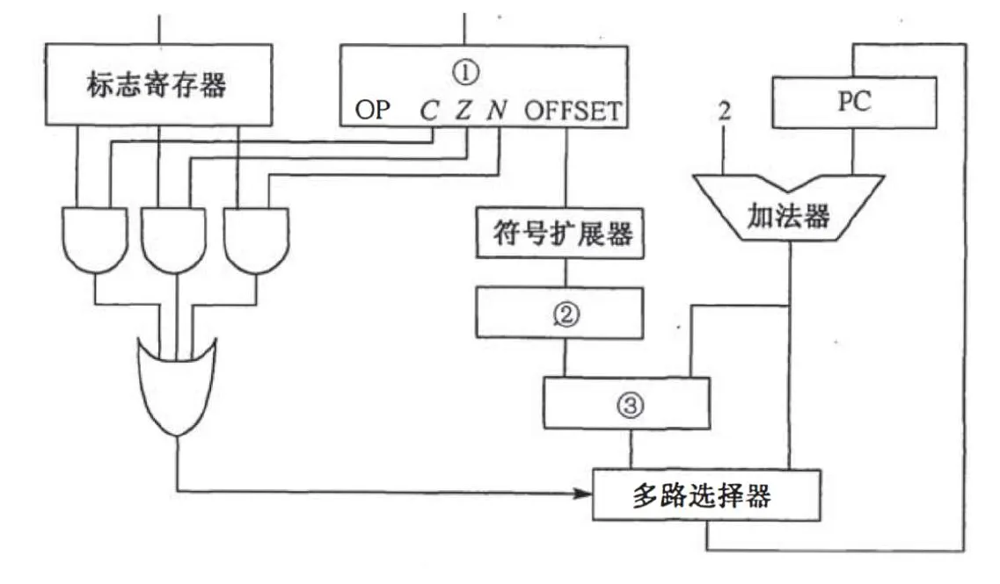
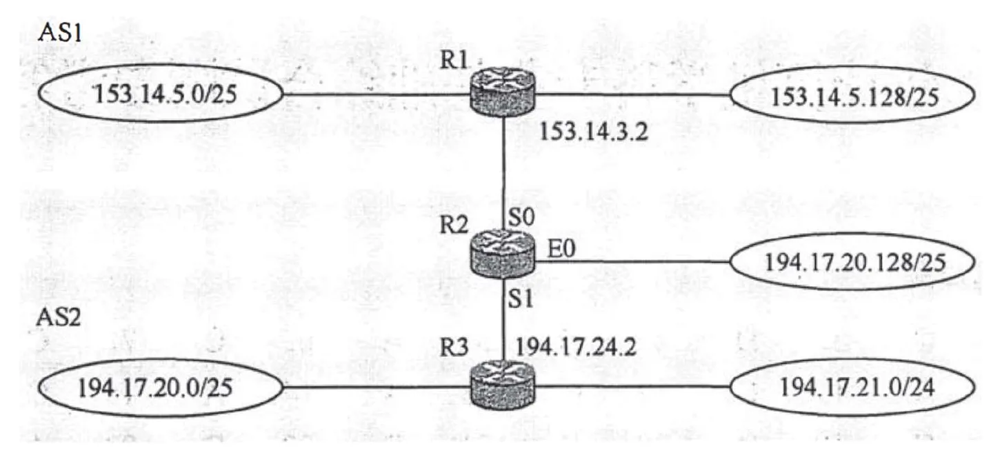

# 2013 年 408 真题 · 答案与解析

> 刷完 [[题面]] 后用此页对答案、看解析。
> 顺序：数据结构（1–11, 41–42）→ 组成原理（12–22, 43–44）→ 操作系统（23–32, 45–46）→ 计算机网络（33–40, 47）

## 一、选择题答案速查表（40 题，每题 2 分，共 80 分）

| 题号 | 1 | 2 | 3 | 4 | 5 | 6 | 7 | 8 | 9 | 10 |
| 答案 | **D** | **C** | **D** | **B** | **A** | **C** | **C** | **D** | **C** | **A** |
| 科目 | 数结 | 数结 | 数结 | 数结 | 数结 | 数结 | 数结 | 数结 | 数结 | 数结 |

| 题号 | 11 | 12 | 13 | 14 | 15 | 16 | 17 | 18 | 19 | 20 |
| 答案 | **C** | **C** | **A** | **A** | **C** | **A** | **D** | **C** | **B** | **B** |
| 科目 | 数结 | 组原 | 组原 | 组原 | 组原 | 组原 | 组原 | 组原 | 组原 | 组原 |

| 题号 | 21 | 22 | 23 | 24 | 25 | 26 | 27 | 28 | 29 | 30 |
| 答案 | **B** | **D** | **A** | **A** | **C** | **A** | **C** | **B** | **D** | **B** |
| 科目 | 组原 | 组原 | 操作 | 操作 | 操作 | 操作 | 操作 | 操作 | 操作 | 操作 |

| 题号 | 31 | 32 | 33 | 34 | 35 | 36 | 37 | 38 | 39 | 40 |
| 答案 | **B** | **B** | **B** | **A** | **D** | **B** | **A** | **B** | **B** | **A** |
| 科目 | 操作 | 操作 | 计网 | 计网 | 计网 | 计网 | 计网 | 计网 | 计网 | 计网 |

> 科目缩写：数结 = 数据结构 | 组原 = 计算机组成原理 | 操作 = 操作系统 | 计网 = 计算机网络

## 二、综合题答案要点速查表（7 题，共 70 分）

| 题号 | 分值 | 科目 | 考点 | 关键结论 |
|------|------|------|------|----------|
| 41 | 13 | 数据结构 | 线性表 | 答案：1、基本思想：先扫描一遍选出候选主元素——保存当前元素并计数，遇相同元素计数加 1，遇不同元素计数减 1，计数减到 0 时改取下一个元素重新计数；再扫描一... |
| 42 | 10 | 数据结构 | 查找 | 答案：1、顺序存储：元素按查找概率降序排列（两个 0.35 的 do、while 放最前，0.15 的 for、repeat 随后），采用顺序查找，查找成功平均... |
| 43 | 9 | 计算机组成原理 | 存储器层次结构 | 答案：1、CPU 时钟周期 = 1/800MHz = 1.25ns；总线时钟周期 = 1/200MHz = 5ns；总线带宽 = 4B × 200MHz = 8... |
| 44 | 14 | 计算机组成原理 | 指令系统 | 答案：1、指令长 16 位且下条指令地址为 (PC)+2，即每条指令占 2 字节，故按字节编址 |
| 45 | 7 | 操作系统 | 进程与线程 | 答案：设两个信号量：mutex 初值 1，用于出入口互斥（一次仅一人通过）；empty 初值 500，表示博物馆还可容纳的人数 |
| 46 | 8 | 操作系统 | 内存管理 | 答案：1、页内偏移 12 位，页大小 = 2¹² = 4KB；页表项数 = 2²⁰，页表最大 = 2²⁰×4B = 4MB |
| 47 | 9 | 计算机网络 | 网络层 | 答案：1、路由聚合：153.14.5.0/25 与 153.14.5.128/25 聚合为 153.14.5.0/24，下一跳 153.14.3.2，接口 S0... |

---

## 三、详细解析

> 以下按题号顺序排列。每题包含题干、选项、答案、解析。
> 图片以相对路径 `images/xxx.webp` 引用，与本文同目录。

### 选择题 · 数据结构

### 1. （2 分 · 线性表）

已知两个长度分别为 m 和 n 的升序链表，若将它们合并为一个长度为 m+n 的降序链表，则最坏情况下的时间复杂度是()。

- **A.** O(n)
- **B.** O(m×n)
- **C.** O(min(m,n))
- **D.** O(max(m,n))

**答案**：D

**解析**：答案 D。合并两个升序链表时，每次比较取较小元素链接，最坏情况下两个链表的所有元素都要参与比较，共 m+n 次。因 max(m,n) ≤ m+n ≤ 2max(m,n)，两者同阶，故选 O(max(m,n))。

> 难度 ⭐⭐ ｜ 章节 线性表 ｜ 标签 数据结构 / 线性表 / 顺序表 / 链表

---

### 2. （2 分 · 栈、队列与数组）

一个栈的入栈序列为1,2,3,⋯,n，其出栈序列是p1,p2,p3,⋯,pn，若p2=3，则p3可能取值的个数是()。

- **A.** n-3
- **B.** n-2
- **C.** n-1
- **D.** 无法确定

**答案**：C

**解析**：答案 C。p2=3 说明 3 已出栈，故 p3 必不等于 3。4～n 均可取：不断入栈后立即出栈即可。1、2 也可取：p1=1 时栈内剩 2 可出，p1=2 时栈内剩 1 可出。除 3 外其余 n-1 个值都可达。

> 难度 ⭐⭐⭐⭐ ｜ 章节 栈、队列与数组 ｜ 标签 数据结构 / 栈 / 队列 / 数组

---

### 3. （2 分 · 查找）

若将关键字 1,2,3,4,5,6,7 依次插入到初始为空的平衡二叉树 T 中，则 T 中平衡因子为 0 的分支结点的个数是( )。

- **A.** 0
- **B.** 1
- **C.** 2
- **D.** 3

**答案**：D

**解析**：答案 D。依次插入 1～7 并做旋转调整，最终 AVL 树为 4(2(1,3),6(5,7))。分支结点只有 4、2、6 三个，它们的左右子树等高，平衡因子均为 0；叶子 1、3、5、7 不算分支结点。

> 难度 ⭐⭐⭐⭐ ｜ 章节 查找 ｜ 标签 数据结构 / 查找 / 散列表 / B树 / AVL树

---

### 4. （2 分 · 树与二叉树）

已知三叉树 T 中 6 个叶结点的权分别是 2，3，4，5，6，7，T 的带权(外部)路径长度最小是( )。

- **A.** 27
- **B.** 46
- **C.** 54
- **D.** 56

**答案**：B

**解析**：答案 B。三叉哈夫曼树要求 (n₀−1) 能被 (3−1) 整除，6 个叶子需补 1 个权为 0 的虚叶。依次合并 {0,2,3}→5、{4,5,5}→14、{6,7,14}→27。WPL=6×1+7×1+4×2+5×2+2×3+3×3=46。

> 难度 ⭐⭐⭐⭐ ｜ 章节 树与二叉树 ｜ 标签 数据结构 / 树 / 二叉树 / 二叉树遍历

---

### 5. （2 分 · 树与二叉树）

若 X 是后序线索二叉树中的叶结点，且 X 存在左兄弟结点 Y 。则 X 的右线索指的是( )。

- **A.** X 的父结点
- **B.** 以 Y 为根的子树的最左下结点
- **C.** X 的左兄弟结点 Y
- **D.** 以 Y 为根的子树的最右下结点

**答案**：A

**解析**：答案 A。X 是叶结点且存在左兄弟，则 X 是其父结点的右孩子。后序遍历按 左子树、右子树、根 的顺序进行，访问完 X 后下一个访问的就是父结点，故 X 的右线索指向父结点。

> 难度 ⭐⭐⭐ ｜ 章节 树与二叉树 ｜ 标签 数据结构 / 树 / 二叉树 / 二叉树遍历 / 线索二叉树

---

### 6. （2 分 · 查找）

在任意一棵非空二叉排序树 T1 中，删除某结点 v 之后形成二叉排序树 T2 ，再将 v 插入 T2 形成二叉排序树 T3 。下列关于 T1 与 T3 的叙述中，正确的是( )。 

I. 若 v 是 T1 的叶结点，则 T1 与 T3 不同 

II. 若 v 是 T1 的叶结点，则 T1 与 T3 相同 

III. 若 v 不是 T1 的叶结点，则 T1 与 T3 不同 

IV. 若 v 不是 T1 的叶结点，则 T1 与 T3 相同

- **A.** 仅 I、III
- **B.** 仅 I、IV
- **C.** 仅 II、III
- **D.** 仅 II、IV

**答案**：C

**解析**：答案 C。删除叶结点后其位置的空指针仍在，再插入 v 会沿原查找路径回到同一位置，T3 与 T1 相同，故 II 正确。删除非叶结点后树的结构已变，再插入的 v 只能成为新叶子，T3 与 T1 必不同，故 III 正确。

> 难度 ⭐⭐⭐⭐ ｜ 章节 查找 ｜ 标签 数据结构 / 查找 / 散列表 / B树 / 二叉排序树

---

### 7. （2 分 · 图）

设图的邻接矩阵 A 如下所示。各顶点的度依次是（ ）。

$$
A=\begin{bmatrix}
0&1&0&1\\
0&0&1&1\\
0&1&0&0\\
1&0&0&0
\end{bmatrix}
$$

- **A.** 1，2，1，2
- **B.** 2，2，1，1
- **C.** 3，4，2，3
- **D.** 4，4，2，2

**答案**：C

**解析**：答案 C。邻接矩阵不对称，说明该图是有向图。顶点度 = 出度 + 入度，出度是该行元素之和，入度是该列元素之和。各行和为 2,2,1,1，各列和为 1,2,1,2，相加得各顶点度依次为 3,4,2,3。

> 难度 ⭐⭐ ｜ 章节 图 ｜ 标签 数据结构 / 图 / 最短路径 / 最小生成树 / 图的存储

---

### 8. （2 分 · 图）

若对如下无向图进行遍历，则下列选项中，不是广度优先遍历序列的是()

```graph
type: undirected
nodes:
  a @ (3, 0)
  b @ (1, 1)
  e @ (5, 1)
  c @ (0, 2)
  d @ (2, 2)
  f @ (4, 2)
  g @ (6, 2)
  h @ (3, 3)
edges:
  a -> b
  a -> h
  a -> e
  b -> c
  b -> d
  c -> d
  c -> h
  e -> f
  e -> g
```

- **A.** h，c，a，b，d，e，g，f
- **B.** e，a，f，g，b，h，c，d
- **C.** d，b，c，a，h，e，f，g
- **D.** a，b，c，d，h，e，f，g

**答案**：D

**解析**：答案 D。从 a 出发做 BFS 时，a 的三个邻点 b、e、h 必须先全部访问完，才轮到它们的邻点 c、d、f、g。选项 D 中 c、d 排在 e、h 之前，是沿一条路径深入的深度优先顺序，故不是广度优先遍历序列。

> 难度 ⭐⭐⭐⭐ ｜ 章节 图 ｜ 标签 数据结构 / 图 / 最短路径 / 最小生成树 / 二叉树遍历

---

### 9. （2 分 · 图）

下列 AOE 网表示一项包含 8 个活动的工程。通过同时加快若干活动的进度可以缩短整个工程的工期。下列选项中，加快其进度就可以缩短工程工期的是（ ）。


- **A.** c 和 e
- **B.** d 和 e
- **C.** f 和 d
- **D.** f 和 h

**答案**：C

**解析**：答案 C。计算得关键路径共三条：(b,d,c,g)、(b,d,e,h)、(b,f,h)。只有同时加快每条关键路径上的活动才能缩短工期。f 覆盖 (b,f,h)，d 覆盖前两条，f 与 d 的组合覆盖了全部关键路径。

> 难度 ⭐⭐⭐⭐ ｜ 章节 图 ｜ 标签 数据结构 / 图 / 最短路径 / 最小生成树 / 图算法

---

### 10. （2 分 · 查找）

在一株高度为 2 的 5 阶 B 树中，所含关键字的个数最少是()

- **A.** 5
- **B.** 7
- **C.** 8
- **D.** 14

**答案**：A

**解析**：答案 A。高度为 2 的 5 阶 B 树取最少关键字时：根 1 个关键字、2 个孩子，每个孩子至少 ⌈5/2⌉−1=2 个关键字。共 1+2×2=5 个。

> 难度 ⭐⭐⭐ ｜ 章节 查找 ｜ 标签 数据结构 / 查找 / 散列表 / B树

---

### 11. （2 分 · 排序）

对给定的关键字序列 110, 119, 007, 911, 114, 120, 122 进行基数排序，则第 2 趟分配收集后得到的关键字序列是（）。

- **A.** 007, 110, 119, 114, 911, 120, 122
- **B.** 007, 110, 119, 114, 911, 122, 120
- **C.** 007, 110, 911, 114, 119, 120, 122
- **D.** 110, 120, 911, 122, 114, 007, 119

**答案**：C

**解析**：答案 C。基数排序低位优先，第 2 趟按十位分配：007 入桶 0，110、911、114、119 入桶 1，120、122 入桶 2。按桶号收集，桶内保持上一趟（按个位）的相对顺序，得 007,110,911,114,119,120,122。

> 难度 ⭐⭐⭐ ｜ 章节 排序 ｜ 标签 数据结构 / 排序 / 内部排序 / 外部排序 / 排序算法

---

### 综合题 · 数据结构

### 41. （13 分 · 线性表）

已知一个整数序列 $A = (a_0, a_1, \ldots, a_{n-1})$，其中 $0 \le a_i < n$（$0 \le i < n$）。若存在 $a_{p_1} = a_{p_2} = \cdots = a_{p_m} = x$ 且 $m > n/2$（$0 \le p_k < n,\ 1 \le k \le m$），则称 $x$ 为 $A$ 的主元素。例如：

- A = (0, 5, 5, 3, 5, 7, 5, 5)，则 5 为主元素；
- A = (0, 5, 5, 3, 5, 1, 5, 7)，则 A 中没有主元素。

假设 A 中的 n 个元素保存在一个一维数组中，请设计一个尽可能高效的算法，找出 A 的主元素。若存在主元素，则输出该元素；否则输出 -1。要求：

(1) 给出算法的基本设计思想。

(2) 根据设计思想，采用 C、C++ 或 Java 语言描述算法，关键之处给出注释。

(3) 说明你所设计算法的时间复杂度和空间复杂度。

**答案 / 解析**：

答案：1、基本思想：先扫描一遍选出候选主元素——保存当前元素并计数，遇相同元素计数加 1，遇不同元素计数减 1，计数减到 0 时改取下一个元素重新计数；再扫描一遍统计候选元素出现次数，若大于 n/2 则为主元素，否则输出 −1。2、时间复杂度 O(n)、空间复杂度 O(1)。核心代码：

```c
int majority(int a[], int n) {
    if (n == 0) return -1;
    int num = a[0], cnt = 1;
    for (int i = 1; i < n; i++) {
        if (a[i] == num) cnt++;
        else if (--cnt == 0) { num = a[i]; cnt = 1; }
    }
    int m = 0;
    for (int i = 0; i < n; i++)
        if (a[i] == num) m++;
    return m > n / 2 ? num : -1;
}
```

> 难度 ⭐⭐⭐⭐ ｜ 章节 线性表 ｜ 标签 数据结构 / 线性表 / 顺序表 / 链表

---

### 42. （10 分 · 查找）

设包含 4 个数据元素的集合 S = {"do", "for", "repeat", "while"}，各元素的查找概率依次为：p₁ = 0.35, p₂ = 0.15, p₃ = 0.15, p₄ = 0.35。将 S 保存在一个长度为 4 的顺序表中，采用折半查找法，查找成功时的平均查找长度为 2.2。请回答：

(1) 若采用顺序存储结构保存 S，且要求平均查找长度更短，则元素应如何排列？应使用何种查找方法？查找成功时的平均查找长度是多少？

(2) 若采用链式存储结构保存 S，且要求平均查找长度更短，则元素应如何排列？应使用何种查找方法？查找成功时的平均查找长度是多少？

**答案 / 解析**：

答案：1、顺序存储：元素按查找概率降序排列（两个 0.35 的 do、while 放最前，0.15 的 for、repeat 随后），采用顺序查找，查找成功平均查找长度 = 0.35×1 + 0.35×2 + 0.15×3 + 0.15×4 = 2.1，比折半查找的 2.2 更短。2、链式存储不能折半查找，可构造二叉排序树：以 for 为根，左子树为 do，右子树以 while 为根且其左孩子为 repeat，各元素查找次数即其层数 1、2、2、3，ASL = 0.15×1 + 0.35×2 + 0.35×2 + 0.15×3 = 2.0。

> 难度 ⭐⭐⭐ ｜ 章节 查找 ｜ 标签 数据结构 / 查找 / 散列表 / B树 / 查找算法

---

### 选择题 · 计算机组成原理

### 12. （2 分 · 计算机系统概述）

某计算机主频为 1.2 GHz，其指令分为 4 类，它们在基准程序中所占比例及 CPI 如下表所示。

| 指令类型 | 所占比例 | CPI |
| --- | ---: | ---: |
| A | 50% | 2 |
| B | 20% | 3 |
| C | 10% | 4 |
| D | 20% | 5 |

该机的 MIPS 数是（ ）。

- **A.** 100
- **B.** 200
- **C.** 400
- **D.** 600

**答案**：C

**解析**：答案 C。加权平均 CPI = 2×0.5 + 3×0.2 + 4×0.1 + 5×0.2 = 3。主频 1.2GHz = 1200MHz，MIPS = 主频/CPI = 1200/3 = 400。

> 难度 ⭐⭐ ｜ 章节 计算机系统概述 ｜ 标签 计算机组成原理 / 计算机系统概述 / 性能指标 / 网络层

---

### 13. （2 分 · 数据表示与运算）

某数采用 IEEE754 单精度浮点数格式表示为 C6400000H，则该数的值是（ ）。

- **A.** $-1.5 \times 2^{13}$
- **B.** $-1.5 \times 2^{12}$
- **C.** $-0.5 \times 2^{13}$
- **D.** $-0.5 \times 2^{12}$

**答案**：A

**解析**：答案 A。C6400000H 的二进制为 1100 0110 0100 0000 0000 0000 0000 0000。符号位 1 表示负数；阶码 10001100₂=140，真值 = 140−127 = 13；尾数含隐含位为 1.1₂=1.5。故该数为 −1.5×2¹³。

> 难度 ⭐⭐⭐ ｜ 章节 数据表示与运算 ｜ 标签 计算机组成原理 / 数据表示 / 运算

---

### 14. （2 分 · 数据表示与运算）

某字长为 8 位的计算机中，已知整型变量 x、y 的机器数分别为 $[x]_补$ = 11110100， $[y]_补$ = 10110000。若整型变量 z = 2x + y/2，则 z 的机器数为（ ）。

- **A.** 11000000
- **B.** 00100100
- **C.** 10101010
- **D.** 溢出

**答案**：A

**解析**：答案 A。2x 将 [x]补 11110100 算术左移一位得 11101000；y/2 将 [y]补 10110000 算术右移一位（高位补符号位 1）得 11011000。两者相加为 111000000，舍去最高进位得 11000000，符号位不变，无溢出。

> 难度 ⭐⭐⭐ ｜ 章节 数据表示与运算 ｜ 标签 计算机组成原理 / 数据表示 / 运算

---

### 15. （2 分 · 数据表示与运算）

用海明码对长度为 8 位的数据进行检/纠错时，若能纠正一位错，则校验位数至少为（ ）。

- **A.** 2
- **B.** 3
- **C.** 4
- **D.** 5

**答案**：C

**解析**：答案 C。海明码纠正一位错须满足 2ᵏ ≥ n+k+1，n 为数据位、k 为校验位。n=8 时 k=3 得 2³=8 < 12 不满足；k=4 时 2⁴=16 ≥ 13 满足，故校验位至少 4 位。

> 难度 ⭐⭐ ｜ 章节 数据表示与运算 ｜ 标签 计算机组成原理 / 数据表示 / 运算

---

### 16. （2 分 · 存储器层次结构）

某计算机主存地址空间大小为 256 MB，按字节编址。虚拟地址空间大小为 4 GB，采用页式存储管理，页面大小为 4 KB。TLB（快表）采用全相联映射，有 4 个页表项，内容如下表所示。

| 有效位 | 标记 | 页框号 | … |
| --- | --- | --- | --- |
| 0 | FF180H | 0002H | … |
| 1 | 3FFF1H | 0035H | … |
| 0 | 02FF3H | 0351H | … |
| 1 | 03FFFH | 0153H | … |

对虚拟地址 03FFF180H 进行虚实地址变换的结果是（ ）。

- **A.** 0153180H
- **B.** 0035180H
- **C.** TLB缺失
- **D.** 缺页

**答案**：A

**解析**：答案 A。页面 4KB 占低 12 位，虚拟地址 03FFF180H 的页号为 03FFFH、页内偏移为 180H。TLB 中标记 03FFFH 的表项有效且命中，页框号为 0153H，页框号与页内偏移拼接得物理地址 0153180H。

> 难度 ⭐⭐⭐⭐ ｜ 章节 存储器层次结构 ｜ 标签 计算机组成原理 / 存储器层次结构 / Cache / 地址转换 / 内存分配

---

### 17. （2 分 · 指令系统）

假设变址寄存器 R 的内容为 1000H，指令中的形式地址为 2000H；地址 1000H 中的内容为 2000H，地址 2000H 中的内容为 3000H，地址 3000H 的内容为 4000H，则变址寻址方式下访问到的操作数是（）。

- **A.** 1000H
- **B.** 2000H
- **C.** 3000H
- **D.** 4000H

**答案**：D

**解析**：答案 D。变址寻址的有效地址 EA = 变址寄存器内容 + 形式地址 = 1000H + 2000H = 3000H。再按有效地址访存，地址 3000H 中的内容为 4000H，即操作数为 4000H。

> 难度 ⭐ ｜ 章节 指令系统 ｜ 标签 计算机组成原理 / 指令系统 / 寻址方式 / CISC / RISC

---

### 18. （2 分 · 中央处理器）

某 CPU 主频为 1.03GHz，采用 4 级指令流水线，每个段的执行需要 1 个时钟周期。假定 CPU 执行了 100 条指令，在其执行过程中没有发生任何流水线阻塞，此时流水线的吞吐率为（ ）。

- **A.** $0.25 \times 10^9$
- **B.** $0.97 \times 10^9$
- **C.** $1.0 \times 10^9$
- **D.** $1.03 \times 10^9$

**答案**：C

**解析**：答案 C。无阻塞时 100 条指令经 4 级流水共需 4+(100−1)=103 个时钟周期。每周期 1/(1.03×10⁹) s，总时间 103/1.03×10⁹ = 10⁻⁷ s。吞吐率 = 100/10⁻⁷ = 1.0×10⁹ 条/秒。

> 难度 ⭐⭐⭐ ｜ 章节 中央处理器 ｜ 标签 计算机组成原理 / CPU / 数据通路 / 指令流水线 / 性能指标

---

### 19. （2 分 · 总线）

> 编者注（大纲变动）：具体总线/接口标准的命名辨析（PCI / PCIe / AGP / USB / SATA 等"总线标准"）已不在现行 408 大纲中——大纲「总线」现仅含 总线的基本概念、组成及性能指标、总线事务和定时，不再单列总线标准/分类。本题为 2013 年真题，按"真题原貌"保留收录，仅作历史与方法参考。

下列选项中，用于设备和设备控制器（I/O 接口）之间互连的接口标准是（ ）。

- **A.** PCI
- **B.** USB
- **C.** AGP
- **D.** PCI-Express

**答案**：B

**解析**：答案 B。USB 是连接外部设备与设备控制器（I/O 接口）之间的通用串行接口标准。PCI、AGP、PCI-Express 均属系统总线，用于 CPU、主存与设备控制器之间互连，而非设备与设备控制器之间。

> 难度 ⭐⭐ ｜ 章节 总线 ｜ 标签 计算机组成原理 / 总线 / 系统总线 / I/O接口

---

### 20. （2 分 · 存储器层次结构）

下列选项中，用于提高 RAID 可靠性的措施有（ ）。

I. 磁盘镜像

Ⅱ. 条带化

Ⅲ. 奇偶校验

Ⅳ. 增加 Cache 机制

- **A.** 仅I、II
- **B.** 仅I、III
- **C.** 仅I、III和IV
- **D.** 仅II、III和IV

**答案**：B

**解析**：答案 B。提高 RAID 可靠性需要冗余：磁盘镜像（I）和奇偶校验（III）都能在磁盘损坏时恢复数据。条带化（II）只分散数据提高性能、无冗余，增加 Cache（IV）也只改善性能。故选仅 I、III。

> 难度 ⭐⭐ ｜ 章节 存储器层次结构 ｜ 标签 计算机组成原理 / 存储器层次结构 / Cache / 磁盘

---

### 21. （2 分 · 输入输出系统）

某磁盘的转速为 10000rpm，平均寻道时间是 6ms，磁盘传输速率是 20MB/s，磁盘控制器延时为 0.2ms，读取一个 4KB 的扇区所需的平均时间约为（ ）。

- **A.** 9ms
- **B.** 9.4ms
- **C.** 12ms
- **D.** 12.4ms

**答案**：B

**解析**：答案 B。平均存取时间 = 平均寻道 + 平均旋转延迟 + 传输时间 + 控制器延时。转速 10000rpm 转一圈 6ms，平均旋转延迟为半圈 3ms；传输 4KB 需 4KB/20MB/s = 0.2ms。合计 6+3+0.2+0.2 = 9.4ms。

> 难度 ⭐⭐⭐ ｜ 章节 输入输出系统 ｜ 标签 计算机组成原理 / I/O系统 / 中断 / DMA / 磁盘

---

### 22. （2 分 · 输入输出系统）

下列关于中断 I/O 方式和 DMA 方式比较的叙述中，错误的是（ ）。

- **A.** 中断 I/O 方式请求的是 CPU 处理时间，DMA 方式请求的是总线使用权
- **B.** 中断响应发生在一条指令执行结束后，DMA 响应发生在一个总线事务完成后
- **C.** 中断 I/O 方式下数据传送通过软件完成，DMA 方式下数据传送由硬件完成
- **D.** 中断 I/O 方式适用于所有外部设备，DMA 方式仅适用于快速外部设备

**答案**：D

**解析**：答案 D。中断 I/O 请求 CPU 处理时间、在指令执行结束后响应、数据传送靠软件完成，A、B、C 均正确。D 说法过于绝对：只要设备支持 DMA 协议即可使用，并非仅适用于快速外部设备，故 D 错误。

> 难度 ⭐⭐⭐ ｜ 章节 输入输出系统 ｜ 标签 计算机组成原理 / I/O系统 / 中断 / DMA / I/O方式

---

### 综合题 · 计算机组成原理

### 43. （9 分 · 存储器层次结构）

某 32 位计算机，CPU 主频为 800MHz，Cache 命中时的 CPI 为 4，Cache 块大小为 32 字节；主存采用 8 体交叉存储方式，每个体的存储字长为 32 位、存储周期是 40ns；存储器总线宽度为 32 位，总线时钟频率为 200MHz，支持突发传送总线事务。每次读突发传送总线事务的过程包括：送首地址和命令、存储器准备数据、传送数据。每次突发传送 32 字节，传送地址或者 32 位数据均需要一个总线时钟周期。请回答下列问题，要求给出理由或者计算过程。

(1) CPU 和总线的时钟周期各是多少？总线的带宽（即最大数据传输率）为多少？

(2) Cache 缺失时，需要用几个读突发传送总线事务来完成一个主存块的读取？

(3) 存储器总线完成一次读突发传送总线事务所需的时间是多少？

(4) 若程序 BP 执行过程中，共执行了 100 条指令，平均每条指令需要 1.2 次访存，Cache 缺失率是 5%，不考虑替换等开销，则 BP 的 CPU 执行时间是多少？

**答案 / 解析**：

答案：1、CPU 时钟周期 = 1/800MHz = 1.25ns；总线时钟周期 = 1/200MHz = 5ns；总线带宽 = 4B × 200MHz = 800MB/s。2、Cache 块 32B，一次读突发传送 32B，故需 1 个读突发总线事务。3、突发事务 = 送首地址 1 个总线周期（5ns）+ 第一个体准备数据 40ns + 传 32B 数据 8 个总线周期（8×5=40ns）= 85ns。4、命中时执行时间 = 100×4×1.25 = 500ns；缺失额外开销 = 100×1.2×5%×85 = 510ns；总执行时间 = 500+510 = 1010ns。

> 难度 ⭐⭐⭐⭐ ｜ 章节 存储器层次结构 ｜ 标签 计算机组成原理 / 存储器层次结构 / Cache / 性能指标 / 物理层

---

### 44. （14 分 · 指令系统）

某计算机采用 16 位定长指令字格式，其 CPU 中有一个标志寄存器，其中包含进位/借位标志 CF、零标志 ZF 和符号标志 NF。假定为该机设计了条件转移指令，其格式如下：

| 位号 | 15～11 | 10 | 9 | 8 | 7～0 |
| --- | --- | --- | --- | --- | --- |
| 字段 | 00000 | C | Z | N | OFFSET |

其中，00000 为操作码 OP；C、Z 和 N 分别为 CF、ZF 和 NF 的对应检测位。某检测位为 1 时表示需检测对应标志位，需检测的标志位中只要有一个为 1 就转移，否则不转移。例如，若 C=1、Z=0、N=1，则需检测 CF 和 NF 的值，当 CF=1 或 NF=1 时发生转移。OFFSET 是相对偏移量，用补码表示。转移执行时，转移目标地址为 `(PC) + 2 + 2 × OFFSET`；顺序执行时，下条指令地址为 `(PC) + 2`。

（1）该计算机存储器按字节编址还是按字编址？该条件转移指令向后（反向）最多可跳转多少条指令？

（2）某条件转移指令的地址为 200CH，指令内容如下。若该指令执行时 CF=0、ZF=0、NF=1，则该指令执行后 PC 的值是多少？若该指令执行时 CF=1、ZF=0、NF=0，则该指令执行后 PC 的值又是多少？请给出计算过程。

| 位号 | 15～11 | 10 | 9 | 8 | 7～0 |
| --- | --- | --- | --- | --- | --- |
| 内容 | 00000 | 0 | 1 | 1 | 11100011 |

（3）实现“无符号数比较小于等于时转移”功能的指令中，C、Z 和 N 应各是什么？

（4）以下是该指令对应的数据通路示意图，要求给出图中部件①～③的名称或功能说明。



**答案 / 解析**：

答案：1、指令长 16 位且下条指令地址为 (PC)+2，即每条指令占 2 字节，故按字节编址。OFFSET 为 8 位补码，范围 −128～127，向后最大位移 2×(−128) = −256 字节，即最多跳转 127 条指令。2、该指令 C=0、Z=1、N=1，检测 ZF 和 NF。CF=0、ZF=0、NF=1 时 NF=1，发生转移：OFFSET=E3H 符号扩展为 FFE3H，乘 2 得 FFC6H，PC = 200CH+2+FFC6H = 1FD4H。CF=1、ZF=0、NF=0 时 ZF、NF 均不为 1，不转移，PC = 200CH+2 = 200EH。3、无符号数 a≤b 等价于 a−b 为零或产生借位，即 ZF=1 或 CF=1，故 C=Z=1、N=0（无符号比较与 NF 无关）。4、部件①是指令寄存器（存放当前指令）；部件②是移位寄存器，把 OFFSET 左移一位实现乘 2；部件③是加法器，计算 PC+2 与 2×OFFSET 之和。

> 难度 ⭐⭐⭐⭐ ｜ 章节 指令系统 ｜ 标签 计算机组成原理 / 指令系统 / 寻址方式 / CISC / RISC / CPU设计

---

### 选择题 · 操作系统

### 23. （2 分 · 文件管理）

用户在删除某文件的过程中，操作系统不可能执行的操作是（ ）。

- **A.** 删除此文件所在的目录
- **B.** 删除与此文件关联的目录项
- **C.** 删除与此文件对应的文件控制块
- **D.** 释放与此文件关联的内存缓冲区

**答案**：A

**解析**：答案 A。删除文件时，操作系统要删除与该文件关联的目录项和文件控制块，并释放文件占用的缓冲区，但不会删除文件所在的目录，因为该目录下还有其他文件，故此项不可能执行。

> 难度 ⭐⭐ ｜ 章节 文件管理 ｜ 标签 操作系统 / 文件系统 / 文件 / 目录 / 磁盘

---

### 24. （2 分 · 文件管理）

为支持 CD-ROM 中视频文件的快速随机播放，播放性能最好的文件数据块组织方式是（ ）。

- **A.** 连续结构
- **B.** 链式结构
- **C.** 直接索引结构
- **D.** 多级索引结构

**答案**：A

**解析**：答案 A。快速随机播放要求最短的查询时间。连续结构下任意块的物理位置可由文件起始地址加偏移直接算出，一次定位即可随机访问，查询时间最短；链式和索引结构都需多次访问才能定位。

> 难度 ⭐⭐ ｜ 章节 文件管理 ｜ 标签 操作系统 / 文件系统 / 文件 / 目录 / 磁盘

---

### 25. （2 分 · 输入输出管理）

用户程序发出磁盘 I/O 请求后，系统的处理流程是：用户程序→系统调用处理程序→设备驱动程序→中断处理程序。其中，计算数据所在磁盘的柱面号、磁头号、扇区号的程序是（ ）。

- **A.** 用户程序
- **B.** 系统调用处理程序
- **C.** 设备驱动程序
- **D.** 中断处理程序

**答案**：C

**解析**：答案 C。计算数据所在的柱面号、磁头号、扇区号属于设备驱动程序的功能。这些物理参数因设备硬件而异，由厂家提供的设备驱动程序把逻辑请求转换成具体的磁盘物理地址。

> 难度 ⭐⭐⭐ ｜ 章节 输入输出管理 ｜ 标签 操作系统 / I/O系统 / 中断 / DMA / I/O方式 / 磁盘 / 设备管理

---

### 26. （2 分 · 文件管理）

若某文件系统索引结点 (inode) 中有直接地址项和间接地址项，则下列选项中，与单个文件长度无关的因素是（ ）。

- **A.** 索引结点的总数
- **B.** 间接地址索引的级数
- **C.** 地址项的个数
- **D.** 文件块大小

**答案**：A

**解析**：答案 A。间接地址索引的级数（B）、地址项的个数（C）和文件块大小（D）决定单个文件可寻址的空间。索引结点的总数（A）只决定整个文件系统能容纳的文件个数，与单个文件长度无关。

> 难度 ⭐⭐⭐ ｜ 章节 文件管理 ｜ 标签 操作系统 / 文件系统 / 文件 / 目录 / 磁盘

---

### 27. （2 分 · 输入输出管理）

设系统缓冲区和用户工作区均采用单缓冲，从外设读入 1 个数据块到系统缓冲区的时间为 100，从系统缓冲区读入 1 个数据块到用户工作区的时间为 5，对用户工作区中的 1 个数据块进行分析的时间为 90，如下图所示。进程从外设读入并分析 2 个数据块的最短时间是（ ）。


- **A.** 200
- **B.** 295
- **C.** 300
- **D.** 390

**答案**：C

**解析**：答案 C。单缓冲下各步只能部分重叠：读入块 1 用 100，转入工作区用 5；块 1 分析（90）期间可并行读入块 2（100）；再转入工作区 5，最后分析块 2 用 90。总时间 = 100+5+100+5+90 = 300。

> 难度 ⭐⭐⭐⭐ ｜ 章节 输入输出管理 ｜ 标签 操作系统 / I/O系统 / 中断 / DMA / 缓冲区

---

### 28. （2 分 · 计算机系统概述）

下列选项中，会导致用户进程从用户态切换到内核态的操作是（ ）。 

I. 整数除以零 

II. sin() 函数调用 

III. read 系统调用

- **A.** 仅 I、II
- **B.** 仅 I、III
- **C.** 仅 II、III
- **D.** I、II 和 III

**答案**：B

**解析**：答案 B。整数除以零是异常（内中断），由硬件触发进入内核处理；read 是系统调用，需陷入内核。sin() 只是用户态下的数学库函数调用，不进入内核。故选仅 I、III。

> 难度 ⭐⭐⭐ ｜ 章节 计算机系统概述 ｜ 标签 操作系统 / 计算机系统概述

---

### 29. （2 分 · 计算机系统概述）

计算机开机后，操作系统最终被加载到（ ）。

- **A.** BIOS
- **B.** ROM
- **C.** EPROM
- **D.** RAM

**答案**：D

**解析**：答案 D。开机后 BIOS 把操作系统从磁盘调入内存，操作系统运行需要可读可写的大容量存储，故最终加载到 RAM 中运行。ROM、EPROM 只读且容量小，BIOS 是固化在 ROM 中的引导程序。

> 难度 ⭐ ｜ 章节 计算机系统概述 ｜ 标签 操作系统 / 计算机系统概述

---

### 30. （2 分 · 内存管理）

若用户进程访问内存时产生缺页，则下列选项中，操作系统可能执行的操作是（ ）。 

I. 处理越界错 

II. 置换页 

III. 分配内存

- **A.** 仅 I、II
- **B.** 仅 II、III
- **C.** 仅 I、III
- **D.** I、II 和 III

**答案**：B

**解析**：答案 B。发生缺页中断后，系统可能分配内存（有空闲页框时调入页面）或置换页面（无空闲页框时换出某页腾出空间）。越界检查在地址变换时已由硬件完成，缺页处理不涉及越界错。故选仅 II、III。

> 难度 ⭐⭐ ｜ 章节 内存管理 ｜ 标签 操作系统 / 内存管理 / 分页 / 分段 / 虚拟内存 / 页面置换

---

### 31. （2 分 · 进程与线程）

某系统正在执行三个进程 P1、P2 和 P3，各进程的计算（CPU）时间和 I/O 时间比例如下表所示。

| 进程 | 计算时间 | I/O 时间 |
| --- | ---: | ---: |
| P1 | 90% | 10% |
| P2 | 50% | 50% |
| P3 | 15% | 85% |

为提高系统资源利用率，合理的进程优先级设置应为（ ）。

- **A.** P1>P2>P3
- **B.** P3>P2>P1
- **C.** P2>P1=P3
- **D.** P1>P2=P3

**答案**：B

**解析**：答案 B。I/O 占用多的进程应获更高优先级：它们占用 CPU 时间短，能尽快让出 CPU 发起 I/O，使 CPU 与 I/O 设备并行工作，提高资源利用率。按 I/O 比例排序为 P3(85%) > P2(50%) > P1(10%)。

> 难度 ⭐⭐⭐ ｜ 章节 进程与线程 ｜ 标签 操作系统 / 进程管理 / 进程 / 线程 / 同步 / PV操作 / 进程调度

---

### 32. （2 分 · 进程与线程）

下列关于银行家算法的叙述中，正确的是（ ）。

- **A.** 银行家算法可以预防死锁
- **B.** 当系统处于安全状态时，系统中一定无死锁进程
- **C.** 当系统处于不安全状态时，系统中一定会出现死锁进程
- **D.** 银行家算法破坏了死锁必要条件中的"请求和保持"条件

**答案**：B

**解析**：答案 B。银行家算法属于死锁避免而非预防，A 错。系统处于安全状态时存在让所有进程完成的进程序列，故一定无死锁进程，B 对。不安全状态只是有死锁风险、不必然死锁，C 错。银行家算法不破坏死锁必要条件，D 错。

> 难度 ⭐⭐⭐ ｜ 章节 进程与线程 ｜ 标签 操作系统 / 进程管理 / 进程 / 线程 / 同步 / PV操作 / 死锁

---

### 综合题 · 操作系统

### 45. （7 分 · 进程与线程）

某博物馆最多可容纳 500 人同时参观，有一个出入口，该出入口一次仅允许一个人通过。参观者的活动描述如下：

```text
cobegin
参观者进程 i:
{
    ...
    进门;
    ...
    参观;
    ...
    出门;
    ...
}
coend
```

请添加必要的信号量和 P、V（或 `wait()`、`signal()`）操作，以实现上述过程中的互斥与同步。要求写出完整的过程，说明信号量的含义并赋初值。

**答案 / 解析**：

答案：设两个信号量：mutex 初值 1，用于出入口互斥（一次仅一人通过）；empty 初值 500，表示博物馆还可容纳的人数。参观本身不占用出入口，无需加锁。核心代码：

```c
semaphore empty = 500, mutex = 1;
visitor() {
    P(empty);      // 申请馆内容量
    P(mutex);      // 占用出入口
    进门;
    V(mutex);      // 释放出入口
    参观;
    P(mutex);      // 出门同样占用出入口
    出门;
    V(mutex);
    V(empty);      // 释放一个容量
}
```

> 难度 ⭐⭐ ｜ 章节 进程与线程 ｜ 标签 操作系统 / 进程管理 / 进程 / 线程 / 同步 / PV操作 / 同步与互斥

---

### 46. （8 分 · 内存管理）

某计算机主存按字节编址，逻辑地址和物理地址都是 32 位，页表项大小为 4 字节。

（1）若使用一级页表的分页存储管理方式，逻辑地址结构如下：

| 页号（20 位） | 页内偏移量（12 位） |
| --- | --- |

则页的大小是多少字节？页表最大占用多少字节？

（2）若使用二级页表的分页存储管理方式，逻辑地址结构如下：

| 页目录号（10 位） | 页表索引（10 位） | 页内偏移量（12 位） |
| --- | --- | --- |

设逻辑地址为 LA，请分别给出其对应的页目录号和页表索引的表达式。

（3）采用第（1）问中的分页存储管理方式，一个代码段起始逻辑地址为 0000 8000H，其长度为 8 KB，被装载到从物理地址 0090 0000H 开始的连续主存空间中。页表从主存 0020 0000H 开始的物理地址处连续存放，如下图所示（地址大小自下向上递增）。请计算出该代码段对应的两个页表项的物理地址、这两个页表项中的页框号以及代码页面 2 的起始物理地址。


**答案 / 解析**：

答案：1、页内偏移 12 位，页大小 = 2¹² = 4KB；页表项数 = 2²⁰，页表最大 = 2²⁰×4B = 4MB。2、页目录号 = ((unsigned int)(LA) >> 22) & 0x3FF；页表索引 = ((unsigned int)(LA) >> 12) & 0x3FF。3、代码段起始逻辑地址 00008000H，页号 = 00008000H >> 12 = 8，8KB 长度占第 8、9 两页。页表项 8 的物理地址 = 00200000H + 8×4 = 00200020H，页表项 9 的 = 00200000H + 9×4 = 00200024H。代码段装入 00900000H 起，两个页框号分别为 00900H 和 00901H，代码页面 2 的起始物理地址 = 00901000H。

> 难度 ⭐⭐⭐ ｜ 章节 内存管理 ｜ 标签 操作系统 / 内存管理 / 分页 / 分段 / 虚拟内存 / 页面置换 / 地址转换 / 内存分配 / 文件系统

---

### 选择题 · 计算机网络

### 33. （2 分 · 计算机网络体系结构）

OSI 参考模型中，应用层的相邻下层实现的功能是（ ）

- **A.** 对话管理
- **B.** 数据格式转换
- **C.** 路由选择
- **D.** 可靠数据传输

**答案**：B

**解析**：答案 B。OSI 参考模型中应用层的相邻下层是表示层（第 6 层）。表示层实现与数据表示有关的功能：数据格式转换、字符集转换、文本压缩、数据加密解密等，故选数据格式转换。

> 难度 ⭐ ｜ 章节 计算机网络体系结构 ｜ 标签 计算机网络 / 计算机网络体系结构

---

### 34. （2 分 · 物理层）

若下图为 10BaseT 网卡接收到的信号波形，则该网卡收到的比特串是（ ）。


- **A.** 0011 0110
- **B.** 1010 1101
- **C.** 0101 0010
- **D.** 1100 0101

**答案**：A

**解析**：答案 A。10BaseT 采用曼彻斯特编码，每个码元中点必有电平跳变，前半低后半高表示 1、前半高后半低表示 0（按教材约定）。按各码元中点的跳变方向逐一解码，得到的比特串为 0011 0110。

> 难度 ⭐⭐⭐ ｜ 章节 物理层 ｜ 标签 计算机网络 / 物理层 / 编码 / 调制

---

### 35. （2 分 · 计算机网络体系结构）

主机甲通过 1 个路由器（存储转发方式）与主机乙互联，两段链路的数据传输速率均为 10Mbps，主机甲分别采用报文交换和分组大小为 10kb 的分组交换向主机乙发送 1 个大小为 8 Mb（1M = 10⁶ ）的报文。若忽略链路传播延迟、分组头开销和分组拆装时间，则两种交换方式完成该报文传输所需的总时间分别为（ ）。

- **A.** 800 ms、1600 ms
- **B.** 801 ms、1600 ms
- **C.** 1600 ms、800 ms
- **D.** 1600 ms、801 ms

**答案**：D

**解析**：答案 D。报文交换需收完整个报文再转发：8Mb/10Mbps=800ms 一段，两段链路共 1600ms。分组交换中每分组 10kb/10Mbps=1ms，共 800 个分组；源端发送 800ms，最后一个分组经路由器再转发 1ms，共 801ms。

> 难度 ⭐⭐⭐⭐ ｜ 章节 计算机网络体系结构 ｜ 标签 计算机网络 / 计算机网络体系结构 / 指令流水线 / 内存分配

---

### 36. （2 分 · 数据链路层）

下列介质访问控制方法中，可能发生冲突的是（ ）

- **A.** CDMA
- **B.** CSMA
- **C.** TDMA
- **D.** FDMA

**答案**：B

**解析**：答案 B。CDMA、TDMA、FDMA 都是信道划分协议，通过静态分配码片、时隙或频段避免冲突。CSMA 是随机访问协议，站点发送前虽侦听信道，但两个站点可能同时检测到信道空闲而发送，仍会发生冲突。

> 难度 ⭐⭐ ｜ 章节 数据链路层 ｜ 标签 计算机网络 / 数据链路层 / MAC / CSMA/CD / PPP

---

### 37. （2 分 · 数据链路层）

HDLC 协议采用零比特填充法，对数据 01111100 01111110 进行组帧后对应的比特串为（ ）

- **A.** 01111100 00111110 10
- **B.** 01111100 01111101 01111110
- **C.** 01111100 01111101 0
- **D.** 01111100 01111110 01111101

**答案**：A

**解析**：答案 A。HDLC 组帧时，数据中出现连续 5 个 1 就在其后插入一个 0（零比特填充）。原数据 01111100 01111110 中两处连续 5 个 1 后各插入一个 0，得 01111100 00111110 10。

> 难度 ⭐⭐⭐ ｜ 章节 数据链路层 ｜ 标签 计算机网络 / 数据链路层 / MAC / CSMA/CD / PPP

---

### 38. （2 分 · 数据链路层）

对于 100 Mbps 的以太网交换机，当输出端口无排队，以直通交换（cut-through switching）方式转发一个以太网帧（不包括前导码）时，引入的转发延迟至少是（ ）。

- **A.** 0 μs
- **B.** 0.48 μs
- **C.** 5.12 μs
- **D.** 121.44 μs

**答案**：B

**解析**：答案 B。直通交换在收到帧的目的地址后即开始转发，只需读取 6 字节的目的 MAC 地址。转发延迟 = 6×8 bit / 100Mbps = 0.48μs。

> 难度 ⭐⭐⭐ ｜ 章节 数据链路层 ｜ 标签 计算机网络 / 数据链路层 / MAC / CSMA/CD / PPP / 指令流水线 / 内存分配

---

### 39. （2 分 · 传输层）

主机甲与主机乙之间已建立一个 TCP 连接，双方持续有数据传输，且数据无差错与丢失。若甲收到 1 个来自乙的 TCP 段，该段的序号为 1913、确认序号为 2046、有效载荷为 100 字节，则甲立即发送给乙的 TCP 段的序号和确认序号分别是（ ）。

- **A.** 2046、2012
- **B.** 2046、2013
- **C.** 2047、2012
- **D.** 2047、2013

**答案**：B

**解析**：答案 B。乙发的段序号 1913、载荷 100 字节，覆盖 1913～2012，甲的确认序号应为 2013（期望的下一个字节）。乙的确认序号 2046 表示乙期望甲下一段从 2046 开始。故甲发回的段序号为 2046、确认序号为 2013。

> 难度 ⭐⭐⭐ ｜ 章节 传输层 ｜ 标签 计算机网络 / 传输层 / TCP / UDP / 拥塞控制

---

### 40. （2 分 · 应用层）

下列关于 SMTP 协议的叙述中，正确的是（ ）。

I. 只支持传输 7 比特 ASCII 码内容

II. 支持在邮件服务器之间发送邮件

III. 支持从用户代理向邮件服务器发送邮件

IV. 支持从邮件服务器向用户代理发送邮件

- **A.** 仅 I、II 和 III
- **B.** 仅 I、II 和 IV
- **C.** 仅 I、III 和 IV
- **D.** 仅 II、III 和 IV

**答案**：A

**解析**：答案 A。SMTP 只支持传输 7 位 ASCII 码内容（I 正确），用于用户代理向邮件服务器发送邮件（III 正确）以及邮件服务器之间传送邮件（II 正确）；邮件服务器向用户代理发送邮件是 POP3/IMAP 的功能（IV 错误）。

> 难度 ⭐⭐ ｜ 章节 应用层 ｜ 标签 计算机网络 / 应用层 / HTTP / DNS / FTP / SMTP

---

### 综合题 · 计算机网络

### 47. （9 分 · 网络层）

假设 Internet 的两个自治系统构成的网络如下图所示。自治系统 AS1 由路由器 R1 连接两个子网构成；自治系统 AS2 由路由器 R2、R3 互联并连接 3 个子网构成。各子网地址、R2 的接口名、R1 与 R3 的部分接口 IP 地址如图所示。



（1）假设路由表结构如下。请利用路由聚合技术，给出 R2 的路由表，要求包括到达题图中所有子网的路由，且路由表中的路由项尽可能少。

| 目的网络 | 下一跳 | 接口 |
| --- | --- | --- |

（2）若 R2 收到一个目的 IP 地址为 194.17.20.200 的 IP 分组，R2 会通过哪个接口转发该 IP 分组？

（3）R1 与 R2 之间利用哪个路由协议交换路由信息？该路由协议的报文被封装到哪个协议的分组中进行传输？

**答案 / 解析**：

答案：1、路由聚合：153.14.5.0/25 与 153.14.5.128/25 聚合为 153.14.5.0/24，下一跳 153.14.3.2，接口 S0；194.17.20.0/25 与 194.17.21.0/24 聚合为 194.17.20.0/23，下一跳 194.17.24.2，接口 S1；194.17.20.128/25 为直连子网，接口 E0。R2 路由表共 3 项。2、目的 IP 194.17.20.200 同时匹配 194.17.20.0/23 和 194.17.20.128/25 两条路由，按最长前缀匹配原则，经 E0 接口转发。3、R1 与 R2 分属不同自治系统，应使用边界网关协议 BGP（BGP4）交换路由信息；BGP 报文封装在 TCP 协议段中传输。

> 难度 ⭐⭐⭐ ｜ 章节 网络层 ｜ 标签 计算机网络 / 网络层 / IP / 路由 / 子网划分 / CIDR / 指令流水线 / 内存分配


## See Also

- [[题面]] — 仅题干与选项，用于限时刷题
- [[../408历年真题总目录]] — 历年真题总目录
- [[408考情分析]] — 试卷构成与逐年考点统计
