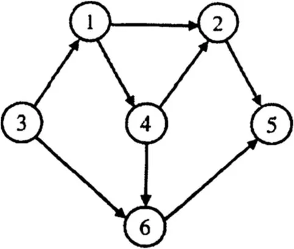
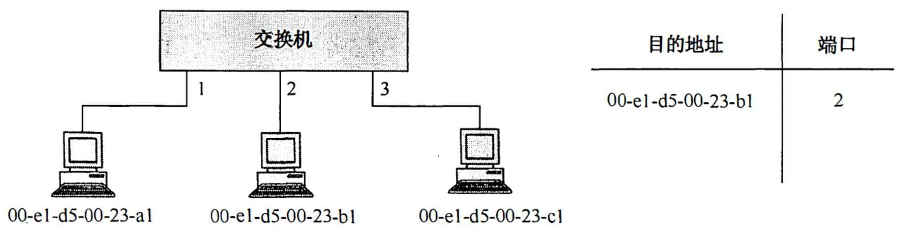

# 2014 年 408 真题 · 答案与解析

> 刷完 [[题面]] 后用此页对答案、看解析。
> 顺序：数据结构（1–11, 41–42）→ 组成原理（12–22, 43–44）→ 操作系统（23–32, 45–46）→ 计算机网络（33–40, 47）

## 一、选择题答案速查表（40 题，每题 2 分，共 80 分）

| 题号 | 1 | 2 | 3 | 4 | 5 | 6 | 7 | 8 | 9 | 10 |
| 答案 | **C** | **B** | **A** | **D** | **C** | **D** | **D** | **D** | **D** | **B** |
| 科目 | 数结 | 数结 | 数结 | 数结 | 数结 | 数结 | 数结 | 数结 | 数结 | 数结 |

| 题号 | 11 | 12 | 13 | 14 | 15 | 16 | 17 | 18 | 19 | 20 |
| 答案 | **C** | **D** | **C** | **A** | **A** | **D** | **A** | **C** | **C** | **C** |
| 科目 | 数结 | 组原 | 组原 | 组原 | 组原 | 组原 | 组原 | 组原 | 组原 | 组原 |

| 题号 | 21 | 22 | 23 | 24 | 25 | 26 | 27 | 28 | 29 | 30 |
| 答案 | **D** | **B** | **A** | **B** | **D** | **A** | **A** | **C** | **B** | **A** |
| 科目 | 组原 | 组原 | 操作 | 操作 | 操作 | 操作 | 操作 | 操作 | 操作 | 操作 |

| 题号 | 31 | 32 | 33 | 34 | 35 | 36 | 37 | 38 | 39 | 40 |
| 答案 | **C** | **D** | **C** | **B** | **D** | **C** | **B** | **A** | **B** | **D** |
| 科目 | 操作 | 操作 | 计网 | 计网 | 计网 | 计网 | 计网 | 计网 | 计网 | 计网 |

> 科目缩写：数结 = 数据结构 | 组原 = 计算机组成原理 | 操作 = 操作系统 | 计网 = 计算机网络

## 二、综合题答案要点速查表（7 题，共 70 分）

| 题号 | 分值 | 科目 | 考点 | 关键结论 |
|------|------|------|------|----------|
| 41 | 13 | 数据结构 | 树与二叉树 | 答案：1、基本设计思想：采用先序递归遍历，把结点深度作为参数逐层传递；遇到叶结点时累加 weight×depth（根深度为 0），内部结点则递归左右子树并将深度... |
| 42 | 10 | 数据结构 | 图 | 答案：1、该网络拓扑可抽象为图（无向图）：4 个路由器作为顶点，路由器之间及路由器与子网的连接作为边 |
| 43 | 9 | 计算机网络 | 网络层 | 答案：1、为使路由项最少，把 192.1.6.0/24 与 192.1.7.0/24 聚合为 192.1.6.0/23，R1 的路由表为：192.1.1.0/2... |
| 44 | 13 | 计算机组成原理 | 中央处理器 | 答案：1、按字节编址 |
| 45 | 12 | 计算机组成原理 | 存储器层次结构 | 答案：1、R2 中存放 i，循环条件为 i<N（N=1000），结束时 i=1000，故 R2 的内容为 1000 |
| 46 | 8 | 操作系统 | 文件管理 | 答案：1、最少访问 59 次磁盘块 |
| 47 | 8 | 操作系统 | 进程与线程 | 答案：1、信号量及初值：empty=1000（缓冲区空位数）、full=0（缓冲区产品数）、buffer_mutex=1（取放产品时互斥访问缓冲区）、consu... |

---

## 三、详细解析

> 以下按题号顺序排列。每题包含题干、选项、答案、解析。
> 图片以相对路径 `images/xxx.webp` 引用，与本文同目录。

### 选择题 · 数据结构

### 1. （2 分 · 绪论）

下列程序段的时间复杂度是（ ）。

```c
count = 0;
for (k = 1; k <= n; k *= 2)
    for (j = 1; j <= n; j++)
        count++;
```

- **A.** O(log₂n)
- **B.** O(n)
- **C.** O(nlog₂n)
- **D.** O(n²)

**答案**：C

**解析**：答案 C。外层 k 每次乘 2，从 1 到 n 共执行约 log₂n 次；内层 j 与外层无关，每轮固定执行 n 次。嵌套循环按乘法规则，总执行次数约 n·log₂n，故时间复杂度为 O(nlog₂n)。

> 难度 ⭐⭐ ｜ 章节 绪论 ｜ 标签 数据结构 / 绪论

---

### 2. （2 分 · 栈、队列与数组）

假设栈初始为空，将中缀表达式 `a/b+(c*d-e*f)/g` 转换为等价的后缀表达式的过程中，当扫描到 `f` 时，栈中的元素依次是（ ）。

- **A.** +(*-
- **B.** +(-*
- **C.** /+(*-*
- **D.** /+-*

**答案**：B

**解析**：答案 B。扫描到 f 时，栈中自底向上为 +、(、-、*，即 +(-*。过程：/ 先入栈，遇 + 时被弹出；遇 ( 入栈，遇 * 入栈，遇 - 弹出栈顶 * 后 - 入栈，再遇 * 入栈。

> 难度 ⭐⭐⭐⭐ ｜ 章节 栈、队列与数组 ｜ 标签 数据结构 / 栈 / 队列 / 数组

---

### 3. （2 分 · 栈、队列与数组）

循环队列放在一维数组 A[ 0..M-1] 中，end1 指向队头元素，end2 指向队尾元素的后一个位置。假设队列两端均可进行入队和出队操作，队列中最多能容纳 M-1 个元素。初始时为空。下列判断队空和队满的条件中，正确的是( )。

- **A.** 队空：`end1 == end2`；队满：`end1 == (end2 + 1) mod M`
- **B.** 队空：`end1 == end2`；队满：`end2 == (end1 + 1) mod (M - 1)`
- **C.** 队空：`end1 == (end1 + 1) mod M`；队满：`end1 == (end2 + 1) mod M`
- **D.** 队空：`end1 == (end2 + 1) mod M`；队满：`end2 == (end1 + 1) mod (M - 1)`

**答案**：A

**解析**：答案 A。end1 指向队头、end2 指向队尾后一个位置，队空时二者相等：end1==end2。队满时最多容纳 M-1 个元素，end2 再前进一格即与 end1 相遇，条件为 end1==(end2+1) mod M。

> 难度 ⭐⭐⭐ ｜ 章节 栈、队列与数组 ｜ 标签 数据结构 / 栈 / 队列 / 数组

---

### 4. （2 分 · 树与二叉树）

若对如下的二叉树进行中序线索化，则结点 x 的左、右线索指向的结点分别是( )。


- **A.** e、c
- **B.** e、a
- **C.** b、c
- **D.** b、a

**答案**：D

**解析**：答案 D。中序线索化时，线索分别指向中序遍历序列中的前驱和后继结点。该二叉树的中序遍历序列为 debxac，x 的前驱是 b、后继是 a，故左、右线索分别指向 b、a。

> 难度 ⭐⭐⭐ ｜ 章节 树与二叉树 ｜ 标签 数据结构 / 树 / 二叉树 / 二叉树遍历 / 线索二叉树

---

### 5. （2 分 · 树与二叉树）

将森林 F 转换为对应的二叉树 T，F 中叶子的个数等于( )。

- **A.** T 中叶结点的个数
- **B.** T 中度为 1 的结点个数
- **C.** T 中左孩子指针为空的结点个数
- **D.** T 中右孩子指针为空的结点个数

**答案**：C

**解析**：答案 C。森林转二叉树采用孩子兄弟表示法：结点的第一个孩子成为左子树，兄弟成为右子树。叶结点没有孩子，转换后其左孩子指针必为空，故 F 中叶结点数等于 T 中左孩子指针为空的结点数。

> 难度 ⭐⭐⭐⭐ ｜ 章节 树与二叉树 ｜ 标签 数据结构 / 树 / 二叉树 / 二叉树遍历

---

### 6. （2 分 · 树与二叉树）

5 个字符有如下 4 种编码方案，不是前缀编码的是( )。

- **A.** 01, 0000, 0001, 001, 1
- **B.** 011, 000, 001, 010, 1
- **C.** 000, 001, 010, 011, 100
- **D.** 0, 100, 110, 1110, 1100

**答案**：D

**解析**：答案 D。前缀编码要求任一字符的编码都不是另一字符编码的前缀。D 中 110 是 1100 的前缀，违反该规则，故 D 不是前缀编码。

> 难度 ⭐⭐ ｜ 章节 树与二叉树 ｜ 标签 数据结构 / 树 / 二叉树 / 二叉树遍历 / 物理层

---

### 7. （2 分 · 图）

对如下所示的有向图进行拓扑排序，得到的拓扑序列可能是()



- **A.** 3,1,2,4,5,6
- **B.** 3,1,2,4,6,5
- **C.** 3,1,4,2,5,6
- **D.** 3,1,4,2,6,5

**答案**：D

**解析**：答案 D。按入度为 0 优先删点：先删 3，再删 1，再删 4，此后 2 和 6 入度均为 0，顺序可互换，得到 3,1,4,2,6,5 或 3,1,4,6,2,5。四个选项中只有 D 符合。

> 难度 ⭐⭐⭐ ｜ 章节 图 ｜ 标签 数据结构 / 图 / 最短路径 / 最小生成树 / 图算法

---

### 8. （2 分 · 查找）

用哈希(散列)方法处理冲突(碰撞)时可能出现堆积(聚集)现象，下列选项中，会受堆积现象直接影响的是()

- **A.** 存储效率
- **B.** 散列函数
- **C.** 装填(装载)因子
- **D.** 平均查找长度

**答案**：D

**解析**：答案 D。堆积使同义词之间产生冲突、查找路径变长，直接影响平均查找长度；它对存储效率、散列函数和装填因子均无影响。

> 难度 ⭐⭐⭐ ｜ 章节 查找 ｜ 标签 数据结构 / 查找 / 散列表 / B树

---

### 9. （2 分 · 查找）

在一棵具有 15 个关键字的 4 阶 B 树中，含关键字的结点个数最多是()

- **A.** 5
- **B.** 6
- **C.** 10
- **D.** 15

**答案**：D

**解析**：答案 D。结点数最多要求每个结点含最少的关键字：4 阶 B 树中非根结点最少 ⌈4/2⌉−1=1 个，根结点也最少 1 个。15 个关键字各占一个结点，最多可形成 15 个结点（可构造 4 层 4 阶 B 树，叶结点全在第 4 层）。

> 难度 ⭐⭐⭐ ｜ 章节 查找 ｜ 标签 数据结构 / 查找 / 散列表 / B树

---

### 10. （2 分 · 排序）

用希尔排序方法对一个数据序列进行排序时，若第 1 趟排序结果为 9,1,4,13,7,8,20,23,15，则该趟排序采用的增量(间隔)可能是()

- **A.** 2
- **B.** 3
- **C.** 4
- **D.** 5

**答案**：B

**解析**：答案 B。第 1 趟排序后各间隔子序列应分别有序。增量为 3 时，9,13,20、1,7,23、4,8,15 三组均递增，符合；增量为 2、4、5 时均出现组内逆序（如 9>4、9>7、9>8），排除。

> 难度 ⭐⭐⭐⭐ ｜ 章节 排序 ｜ 标签 数据结构 / 排序 / 内部排序 / 外部排序 / 排序算法

---

### 11. （2 分 · 排序）

下列选项中，不可能是快速排序第 2 趟排序结果的是（）。

- **A.** 2, 3, 5, 4, 6, 7, 9
- **B.** 2, 7, 5, 6, 4, 3, 9
- **C.** 3, 2, 5, 4, 7, 6, 9
- **D.** 4, 2, 3, 5, 7, 6, 9

**答案**：C

**解析**：答案 C。快排每趟至少使一个元素就位，第 2 趟结束时至少 3 个元素应位于最终位置（左边全小于它、右边全大于它）。C 中只有 7、9 两个元素就位，不足 3 个，故不可能是第 2 趟排序结果。

> 难度 ⭐⭐⭐⭐ ｜ 章节 排序 ｜ 标签 数据结构 / 排序 / 内部排序 / 外部排序 / 排序算法

---

### 综合题 · 数据结构

### 41. （13 分 · 树与二叉树）

二叉树的带权路径长度（WPL）是二叉树中所有叶结点的带权路径长度之和。给定一棵二叉树 T，采用二叉链表存储，结点结构为：

```
+--------+--------+--------+
| left   | weight | right  |
+--------+--------+--------+
```

其中叶结点的 weight 域保存该结点的非负权值。设 root 为指向 T 的根结点的指针，请设计求 T 的 WPL 的算法。要求：

(1) 给出算法的基本设计思想。

(2) 使用 C 或 C++ 语言，给出二叉树结点的数据类型定义。

(3) 根据设计思想，采用 C 或 C++ 语言描述算法，关键之处给出注释。

**答案 / 解析**：

答案：1、基本设计思想：采用先序递归遍历，把结点深度作为参数逐层传递；遇到叶结点时累加 weight×depth（根深度为 0），内部结点则递归左右子树并将深度加 1。2、结点数据类型定义：

```c
typedef struct BiTNode {
    int weight;                     // 叶结点的非负权值
    struct BiTNode *lchild, *rchild;
} BiTNode, *BiTree;
```

3、算法描述（递归求 WPL，关键处已注释）：

```c
int WPL(BiTree root, int depth) {
    if (root == NULL) return 0;
    if (root->lchild == NULL && root->rchild == NULL)
        return depth * root->weight;   // 叶结点：权值×深度
    return WPL(root->lchild, depth + 1) +
           WPL(root->rchild, depth + 1);
}
```

调用 WPL(root, 0) 即得结果。时间复杂度 O(n)，空间复杂度 O(树高)。

> 难度 ⭐⭐⭐⭐ ｜ 章节 树与二叉树 ｜ 标签 数据结构 / 树 / 二叉树 / 二叉树遍历 / 链表

---

### 42. （10 分 · 图）

某网络中的路由器运行 OSPF 路由协议，下表是路由器 R1 维护的主要链路状态信息（LSI），下图是根据该表的接口名构造出来的网络拓扑。


请回答下列问题：

(1) 本题中的网络可抽象为数据结构中的哪种结构？

(2) 针对上表中的内容，设计合理的链式存储结构，以保存表中的链路状态信息（LSI）。要求给出链式存储结构的数据定义，并画出对应表的链式存储结构示意图（示意图中仅以 ID 标识结点）。

(3) 按照迪杰斯特拉（Dijkstra）算法的策略，依次给出 R1 到达图中子网 192.1.x.x 的最短路径及费用。

**答案 / 解析**：

答案：1、该网络拓扑可抽象为图（无向图）：4 个路由器作为顶点，路由器之间及路由器与子网的连接作为边。2、采用邻接表形式的链式存储：设 8 个表头结点（R1～R4 及 4 个子网 192.1.1.0/24、192.1.5.0/24、192.1.6.0/24、192.1.7.0/24），每个表头结点挂一条边表链，边表结点记录邻接对象 ID 与代价 metric。数据定义如下：

```c
// 表头结点：路由器或子网
typedef struct HNode {
    int id;                  // 路由器 ID 或子网号
    struct ArcNode *first;   // 指向第一条边
    struct HNode *next;      // 指向下一个表头结点
} HNode;
// 边表结点
typedef struct ArcNode {
    int flag;                // 1：连到路由器；2：连到子网
    int id;                  // 对端路由器 ID 或子网号
    int metric;              // 链路代价
    struct ArcNode *next;
} ArcNode;
```

示意图：每个表头结点（仅以 ID 标识）引出一条边表链，如 R1 的边表依次链接 R2、R3、192.1.1.0/24 等边表结点，各边表结点按 next 指针串联。3、按 Dijkstra 算法，R1 到各子网的最短路径及费用为：192.1.1.0/24 直接到达，费用 1；192.1.5.0/24 经 R1→R3→192.1.5.0/24，费用 3；192.1.6.0/24 经 R1→R2→192.1.6.0/24，费用 4；192.1.7.0/24 经 R1→R2→R4→192.1.7.0/24，费用 8。

> 难度 ⭐⭐⭐⭐ ｜ 章节 图 ｜ 标签 数据结构 / 图 / 最短路径 / 最小生成树 / 网络层

---

### 选择题 · 计算机组成原理

### 12. （2 分 · 计算机系统概述）

程序 P 在机器 M 上的执行时间是 20 秒，编译优化后，P 执行的指令数减少到原来的 70%，而 CPI 增加到原来的 1.2 倍，则 P 在 M 上的执行时间是（ ）。

- **A.** 8.4秒
- **B.** 11.7秒
- **C.** 14秒
- **D.** 16.8秒

**答案**：D

**解析**：答案 D。执行时间 = 指令数 × CPI × 时钟周期。优化后时间为 20 × 0.7 × 1.2 = 16.8 秒。

> 难度 ⭐⭐ ｜ 章节 计算机系统概述 ｜ 标签 计算机组成原理 / 计算机系统概述 / 性能指标

---

### 13. （2 分 · 数据表示与运算）

若 x=103，y=-25，则下列表达式采用 8 位定点补码运算实现时，会发生溢出的是（ ）。

- **A.** x+y
- **B.** -x+y
- **C.** x-y
- **D.** -x-y

**答案**：C

**解析**：答案 C。8 位定点补码的表示范围是 −128～127。x−y = 103−(−25) = 128，超出 127 发生溢出；A、B、D 的计算结果均在该范围内。

> 难度 ⭐⭐⭐ ｜ 章节 数据表示与运算 ｜ 标签 计算机组成原理 / 数据表示 / 运算

---

### 14. （2 分 · 数据表示与运算）

float 型数据常用 IEEE754 单精度浮点格式表示。假设两个 float 型变量 x 和 y 分别存放在 32 位寄存器 f1 和 f2 中，若 (f1)=CC900000H，(f2)=B0C00000H，则 x 和 y 之间的关系为（ ）。

- **A.** x<y且符号相同
- **B.** x<y且符号不同
- **C.** x>y且符号相同
- **D.** x>y且符号不同

**答案**：A

**解析**：答案 A。两数的最高位都是 1，符号相同（均为负）。阶码用移码表示，f1 的阶码 10011001 大于 f2 的 01100001，故 |f1|>|f2|；同为负数时绝对值大的真值更小，所以 x<y。

> 难度 ⭐⭐⭐ ｜ 章节 数据表示与运算 ｜ 标签 计算机组成原理 / 数据表示 / 运算

---

### 15. （2 分 · 存储器层次结构）

某容量为 256MB 的存储器由若干 4M×8 位的 DRAM 芯片构成，该 DRAM 芯片的地址引脚和数据引脚总数是（ ）。

- **A.** 19
- **B.** 22
- **C.** 30
- **D.** 36

**答案**：A

**解析**：答案 A。4M×8 位芯片需地址线 log₂4M=22 根、数据线 8 根。DRAM 采用地址复用，地址信号分行、列两次传送，地址引脚减半为 11 根，故地址引脚与数据引脚共 11+8=19 根。

> 难度 ⭐⭐⭐ ｜ 章节 存储器层次结构 ｜ 标签 计算机组成原理 / 存储器层次结构

---

### 16. （2 分 · 存储器层次结构）

采用指令 Cache 与数据 Cache 分离的主要目的是（ ）。

- **A.** 降低 Cache 的缺失损失
- **B.** 提高 Cache 的命中率
- **C.** 降低 CPU 平均访存时间
- **D.** 减少指令流水线资源冲突

**答案**：D

**解析**：答案 D。指令 Cache 与数据 Cache 分离后，取指和取数在不同 Cache 中进行，避免争用同一访存部件，减少了指令流水线的资源冲突。

> 难度 ⭐⭐ ｜ 章节 存储器层次结构 ｜ 标签 计算机组成原理 / 存储器层次结构 / Cache

---

### 17. （2 分 · 指令系统）

某计算机有 16 个通用寄存器，采用 32 位定长指令字，操作码字段（含寻址方式位）为 8 位，Store 指令的源操作数和目的操作数分别采用寄存器直接寻址和基址寻址方式。若基址寄存器可使用任一通用寄存器，且偏移量用补码表示，则 Store 指令中偏移量的取值范围是（ ）。

- **A.** -32768～+32767
- **B.** -32767～+32768
- **C.** -65536～+65535
- **D.** -65535～+65536

**答案**：A

**解析**：答案 A。地址码共 32−8=24 位；16 个通用寄存器各需 4 位编号，源操作数（寄存器直接）和基址寄存器共占 8 位，偏移量剩 24−8=16 位。16 位补码的表示范围为 −32768～+32767。

> 难度 ⭐⭐⭐ ｜ 章节 指令系统 ｜ 标签 计算机组成原理 / 指令系统 / 寻址方式 / CISC / RISC

---

### 18. （2 分 · 中央处理器）

某计算机采用微程序控制器，共有 32 条指令，公共的取指令微程序包含 2 条微指令，各指令对应的微程序平均由 4 条微指令组成，采用断定法（下地址字段法）确定下条微指令地址，则微指令中下地址字段的位数至少是（ ）。

- **A.** 5
- **B.** 6
- **C.** 8
- **D.** 9

**答案**：C

**解析**：答案 C。微指令总数为 32×4+2=130 条，下地址字段需能寻址全部微指令，⌈log₂130⌉=8（2⁷=128<130≤2⁸=256），故至少 8 位。

> 难度 ⭐⭐⭐ ｜ 章节 中央处理器 ｜ 标签 计算机组成原理 / CPU / 数据通路 / 指令流水线 / CPU设计

---

### 19. （2 分 · 总线）

某同步总线采用数据线和地址线复用方式，其中地址/数据线有 32 根，总线时钟频率为 66MHz，每个时钟周期传送两次数据（上升沿和下降沿各传送一次数据），该总线的最大数据传输率（总线带宽）是（ ）。

- **A.** 132MB/s
- **B.** 264MB/s
- **C.** 528MB/s
- **D.** 1056MB/s

**答案**：C

**解析**：答案 C。32 根数据线每时钟周期传送 4B，每个周期传送两次，最大数据传输率 = 66MHz × 2 × 4B = 528MB/s。

> 难度 ⭐⭐ ｜ 章节 总线 ｜ 标签 计算机组成原理 / 总线 / 系统总线 / I/O接口 / 性能指标 / 同步与互斥 / 物理层

---

### 20. （2 分 · 总线）

一次总线事务中，主设备只需给出一个首地址，从设备就能从首地址开始的若干连续单元读出或写入多个数据。这种总线事务方式称为（ ）。

- **A.** 并行传输
- **B.** 串行传输
- **C.** 突发传输
- **D.** 同步传输

**答案**：C

**解析**：答案 C。只需给出首地址，就能连续传送地址相邻的多个数据，这正是突发（burst）传输的特点；并行/串行指数据位的传送方式，同步指由统一时钟控制。

> 难度 ⭐ ｜ 章节 总线 ｜ 标签 计算机组成原理 / 总线 / 系统总线 / I/O接口

---

### 21. （2 分 · 输入输出系统）

下列有关 I/O 接口的叙述中，错误的是（ ）。

- **A.** 状态端口和控制端口可以合用同一个寄存器
- **B.** I/O 接口中 CPU 可访问的寄存器称为 I/O 端口
- **C.** 采用独立编址方式时，I/O 端口地址和主存地址可能相同
- **D.** 采用统一编址方式时，CPU 不能用访存指令访问 I/O 端口

**答案**：D

**解析**：答案 D。采用统一编址时，I/O 端口与主存统一编址，CPU 用访存指令即可访问 I/O 端口，故 D 错误；其余三项叙述均正确。

> 难度 ⭐⭐ ｜ 章节 输入输出系统 ｜ 标签 计算机组成原理 / I/O系统 / 中断 / DMA

---

### 22. （2 分 · 输入输出系统）

若某设备中断请求的响应和处理时间为 100 ns，每 400 ns 发出一次中断请求，中断响应所允许的最长延迟时间为 50 ns，则在该设备持续工作过程中，CPU 用于该设备的 I/O 时间占整个 CPU 时间的百分比至少是（ ）。

- **A.** 12.5%
- **B.** 25%
- **C.** 37.5%
- **D.** 50%

**答案**：B

**解析**：答案 B。每 400ns 发出一次中断请求，每次需 100ns 响应和处理，允许的 50ns 延迟不改变总处理量，占比为 100/400 = 25%。

> 难度 ⭐⭐⭐ ｜ 章节 输入输出系统 ｜ 标签 计算机组成原理 / I/O系统 / 中断 / DMA / I/O方式

---

### 综合题 · 计算机组成原理

### 44. （13 分 · 中央处理器）

某程序中有如下循环代码段 P：“`for (int i=0; i<N; i++) sum += A[i];`”。假设编译时变量 sum 和 i 分别分配在寄存器 R1 和 R2 中。常量 N 在寄存器 R6 中，数组 A 的首地址在寄存器 R3 中。程序段 P 起始地址为 08048100H，对应的汇编代码和机器代码如下表所示。

| 编号 |   地址    | 机器代码  |      汇编代码       |          注释          |
| :--: | :-------: | :-------: | :-----------------: | :--------------------: |
|  1   | 08048100H | 00022080H | loop: sll R4, R2, 2 |     (R2)<<2 → R4       |
|  2   | 08048104H | 00083020H |   add R4, R4, R3    |    (R4) + (R3) → R4    |
|  3   | 08048108H | 8C850000H |   load R5, 0(R4)    |    ((R4) + 0) → R5     |
|  4   | 0804810CH | 00250820H |   add R1, R1, R5    |    (R1) + (R5) → R1    |
|  5   | 08048110H | 20420001H |    add R2, R2, 1    |     (R2) + 1 → R2      |
|  6   | 08048114H | 1446FFFAH |  bne R2, R6, loop   | if (R2)≠(R6) goto loop |

执行上述代码的计算机 M 采用 32 位定长指令字，其中分支指令 bne 采用如下格式：

| 位段 | 内容 |
| --- | --- |
| 31～26 | Op |
| 25～21 | Rs |
| 20～16 | Rd |
| 15～0 | OFFSET |

Op 为操作码，Rs 和 Rd 为寄存器编号，OFFSET 为偏移量，用补码表示。请回答下列问题，并说明理由。

(1) M 的存储器编址单位是什么？

(2) 已知 sll 指令实现左移功能，数组 A 中每个元素占多少位？

(3) 题 44 表中 bne 指令的 OFFSET 字段的值是多少？已知 bne 指令采用相对寻址方式，当前 PC 内容为 bne 指令地址，通过分析题 44 表中指令地址和 bne 指令内容，推断出 bne 指令的转移目标地址计算公式。

(4) 若 M 采用如下“按序发射、按序完成”的 5 级指令流水线：IF（取指）、ID（译码及取数）、EXE（执行）、MEM（访存）、WB（写回寄存器），且硬件不采取任何转发措施，分支指令的执行均引起 3 个时钟周期阻塞，则 P 中那些指令的执行会由于数据相关而发生流水线阻塞？哪条指令的执行会发生控制冒险？为什么指令 1 的执行不会因为与指令 5 的数据相关而发生阻塞？

**答案 / 解析**：

答案：1、按字节编址。每条指令占 4B（32 位定长指令字），表中指令地址相邻差 4 个地址单位，故 1 个地址单位代表 1B。2、数组元素占 32 位（4B）。sll R4, R2, 2 把 i 左移 2 位相当于乘 4，相邻元素地址差 4 个地址单位，按字节编址即每个元素 4B。3、OFFSET = FFFAH，即补码 −6。bne 执行时 PC 已加 4 为 08048118H，目标地址 08048100H 与之相差 18H=24，而 −6×4=−24，故转移目标地址 = (PC) + 4 + OFFSET×4。4、因数据相关发生阻塞的是第 2、3、4、6 条指令（都与其前一条指令存在数据相关）；第 6 条 bne 还会发生控制冒险。指令 1 与指令 5 虽存在跨循环的数据相关（指令 5 写 R2、下次循环指令 1 读 R2），但 bne 后有 3 个时钟周期阻塞，指令 5 对 R2 的写已完成，相关被消除，故指令 1 不会因此阻塞。

> 难度 ⭐⭐⭐⭐ ｜ 章节 中央处理器 ｜ 标签 计算机组成原理 / CPU / 数据通路 / 指令流水线 / Cache / 性能指标

---

### 45. （12 分 · 存储器层次结构）

> 【承上题·2014 年第 44 题材料】 本题与第 44 题为同一组连续大题，共用下面的程序段 P。为便于独立作答，材料一并附在此处。

某程序中有如下循环代码段 P：“`for (int i=0; i＜N; i++) sum += A[i];`”。假设编译时变量 sum 和 i 分别分配在寄存器 R1 和 R2 中。常量 N 在寄存器 R6 中，数组 A 的首地址在寄存器 R3 中。程序段 P 起始地址为 08048100H，对应的汇编代码和机器代码如下表所示。

| 编号 |   地址    | 机器代码  |      汇编代码       |          注释          |
| :--: | :-------: | :-------: | :-----------------: | :--------------------: |
|  1   | 08048100H | 00022080H | loop: sll R4, R2, 2 |     (R2)<<2 → R4       |
|  2   | 08048104H | 00083020H |   add R4, R4, R3    |    (R4) + (R3) → R4    |
|  3   | 08048108H | 8C850000H |   load R5, 0(R4)    |    ((R4) + 0) → R5     |
|  4   | 0804810CH | 00250820H |   add R1, R1, R5    |    (R1) + (R5) → R1    |
|  5   | 08048110H | 20420001H |    add R2, R2, 1    |     (R2) + 1 → R2      |
|  6   | 08048114H | 1446FFFAH |  bne R2, R6, loop   | if (R2)≠(R6) goto loop |

计算机 M 采用 32 位定长指令字，按字节编址。

本题： 假设对于上述计算机 M 和程序段 P 的机器代码，M 采用页式虚拟存储管理；P 开始执行时，(R1)=(R2)=0，(R6)=1000，其机器代码已调入主存但不在 Cache 中；数组 A 未调入主存，且所有数组元素在同一页，并存储在磁盘同一个扇区。请回答下列问题并说明理由。

(1) P 执行结束时，R2 的内容是多少？

(2) M 的指令 Cache 和数据 Cache 分离。若指令 Cache 共有 16 行，Cache 和主存交换的块大小为 32 字节，则其数据区的容量是多少？若仅考虑程序段 P 的执行，则指令 Cache 的命中率为多少？

(3) P 在执行过程中，哪条指令的执行可能发生溢出异常？哪条指令的执行可能产生缺页异常？对于数组 A 的访问，需要读磁盘和 TLB 至少各多少次？

**答案 / 解析**：

答案：1、R2 中存放 i，循环条件为 i<N（N=1000），结束时 i=1000，故 R2 的内容为 1000。2、指令 Cache 数据区容量 = 16×32B = 512B。P 共 6 条指令 24B，位于同一主存块（32B）内且从块首开始，整个执行过程仅第一次取指缺失 1 次，其余均命中，命中率 = (1000×6−1)/(1000×6) = 99.98%。3、可能发生溢出异常的是指令 4（sum+=A[i]，元素值过大时求和溢出）；指令 1、2、5 的运算结果有限（地址计算、i 至多 1000），不会溢出。可能产生缺页异常的是指令 3（load，唯一的访存指令）。数组第一次被访问时缺页调入，之后不再访盘，共读磁盘 1 次；访问数组 1000 次均查 TLB，且第一次访问 A[0] 缺页处理完重新访问时多查 1 次，共查 TLB 1001 次。

> 难度 ⭐⭐⭐⭐ ｜ 章节 存储器层次结构 ｜ 标签 计算机组成原理 / 存储器层次结构 / Cache / 地址转换 / 虚拟内存 / 磁盘 / 内存分配

---

### 选择题 · 操作系统

### 23. （2 分 · 进程与线程）

下列调度算法中，不可能导致饥饿现象的是（ ）。

- **A.** 时间片轮转
- **B.** 静态优先数调度
- **C.** 非抢占式短作业优先
- **D.** 抢占式短作业优先

**答案**：A

**解析**：答案 A。时间片轮转按顺序轮流执行，每个进程都能在有限时间内获得处理机，不会饥饿；静态优先数、抢占/非抢占式短作业优先都可能因高优先或短任务持续到达而使其他进程饥饿。

> 难度 ⭐⭐ ｜ 章节 进程与线程 ｜ 标签 操作系统 / 进程管理 / 进程 / 线程 / 同步 / PV操作 / 进程调度

---

### 24. （2 分 · 进程与线程）

某系统有 n 台互斥使用的同类设备，三个并发进程分别需要 3、4、5 台设备，可确保系统不发生死锁的设备数 n 最小为（ ）。

- **A.** 9
- **B.** 10
- **C.** 11
- **D.** 12

**答案**：B

**解析**：答案 B。不发生死锁的最小设备数 = 各进程最大需求减 1 之和再加 1：(3−1)+(4−1)+(5−1)+1 = 10。只有 9 台时每个进程都差 1 台而互相等待，必然死锁。

> 难度 ⭐⭐⭐⭐ ｜ 章节 进程与线程 ｜ 标签 操作系统 / 进程管理 / 进程 / 线程 / 同步 / PV操作 / 同步与互斥 / 死锁

---

### 25. （2 分 · 计算机系统概述）

下列指令中，不能在用户态执行的是（ ）。

- **A.** trap 指令
- **B.** 跳转指令
- **C.** 压栈指令
- **D.** 关中断指令

**答案**：D

**解析**：答案 D。关中断指令影响系统状态，属于特权指令，只能在核心态执行；trap、跳转、压栈指令都可在用户态执行。

> 难度 ⭐⭐ ｜ 章节 计算机系统概述 ｜ 标签 操作系统 / 计算机系统概述

---

### 26. （2 分 · 进程与线程）

一个进程的读磁盘操作完成后，操作系统针对该进程必做的是（ ）。

- **A.** 修改进程状态为就绪态
- **B.** 降低进程优先级
- **C.** 给进程分配用户内存空间
- **D.** 增加进程时间片大小

**答案**：A

**解析**：答案 A。进程等待读磁盘时处于阻塞态，读操作完成后操作系统必将其状态改为就绪态；降低优先级、分配内存、增大时间片都不一定发生。

> 难度 ⭐⭐ ｜ 章节 进程与线程 ｜ 标签 操作系统 / 进程管理 / 进程 / 线程 / 同步 / PV操作 / 磁盘

---

### 27. （2 分 · 文件管理）

现有一个容量为 10GB 的磁盘分区，磁盘空间以簇 (Cluster) 为单位进行分配，簇的大小为 4KB，若采用位图法管理该分区的空闲空间，即用一位 (bit) 标识一个簇是否被分配，则存放该位图所需簇的个数为（ ）。

- **A.** 80
- **B.** 320
- **C.** 80K
- **D.** 320K

**答案**：A

**解析**：答案 A。簇数为 10GB/4KB = 2.5M，位图需 2.5M 位 = 320KB，占用 320KB/4KB = 80 个簇。

> 难度 ⭐⭐⭐ ｜ 章节 文件管理 ｜ 标签 操作系统 / 文件系统 / 文件 / 目录 / 磁盘

---

### 28. （2 分 · 内存管理）

下列措施中，能加快虚实地址转换的是（ ）。

I. 增大快表 (TLB) 容量

II. 让页表常驻内存

III. 增大交换区 (swap)

- **A.** 仅 I
- **B.** 仅 II
- **C.** 仅 I、II
- **D.** 仅 II、III

**答案**：C

**解析**：答案 C。增大快表容量可提高地址转换命中率，页表常驻内存可省去调入页表的时间，均能加快虚实地址转换；增大交换区与地址转换速度无关。

> 难度 ⭐⭐ ｜ 章节 内存管理 ｜ 标签 操作系统 / 内存管理 / 分页 / 分段 / 虚拟内存 / 页面置换 / 地址转换 / 内存分配

---

### 29. （2 分 · 文件管理）

在一个文件被用户进程首次打开的过程中，操作系统需要做的是（ ）。

- **A.** 将文件内容读到内存中
- **B.** 将文件控制块读到内存中
- **C.** 修改文件控制块中的读写权限
- **D.** 将文件的数据缓冲区首指针返回给用户进程

**答案**：B

**解析**：答案 B。首次打开文件时，系统将文件的文件控制块（FCB）调入内存，只有读/写时才把文件内容调入；FCB 的读写权限由打开方式决定，不会被修改。

> 难度 ⭐⭐ ｜ 章节 文件管理 ｜ 标签 操作系统 / 文件系统 / 文件 / 目录 / 磁盘

---

### 30. （2 分 · 内存管理）

在页式虚拟存储管理系统中，采用某些页面置换算法，会出现 Belady 异常现象，即进程的缺页次数会随着分配给该进程的页框个数的增加而增加。下列算法中，可能出现 Belady 异常现象的是（ ）。

I. LRU 算法

II. FIFO 算法

III. OPT 算法

- **A.** 仅 II
- **B.** 仅 I、II
- **C.** 仅 I、III
- **D.** 仅 II、III

**答案**：A

**解析**：答案 A。只有 FIFO 置换算法可能出现 Belady 异常；LRU 和 OPT 具有栈性质，分配的页框增加时缺页次数不会增加。

> 难度 ⭐⭐⭐ ｜ 章节 内存管理 ｜ 标签 操作系统 / 内存管理 / 分页 / 分段 / 虚拟内存 / 页面置换 / FIFO / Cache / 内存分配

---

### 31. （2 分 · 进程与线程）

下列关于管道(Pipe)通信的叙述中，正确的是（ ）。

- **A.** 一个管道可实现双向数据传输
- **B.** 管道的容量仅受磁盘容量大小限制
- **C.** 进程对管道进行读操作和写操作都可能被阻塞
- **D.** 一个管道只能有一个读进程或一个写进程对其操作

**答案**：C

**解析**：答案 C。管道是内存中的固定大小缓冲区，满时写进程被阻塞、空时读进程被阻塞，读写都可能阻塞。管道是半双工机制，同一时刻只能单向传输；其容量由内存大小决定，与磁盘容量无关。

> 难度 ⭐⭐⭐ ｜ 章节 进程与线程 ｜ 标签 操作系统 / 进程管理 / 进程 / 线程 / 同步 / PV操作

---

### 32. （2 分 · 内存管理）

下列选项中，属于多级页表优点的是（ ）。

- **A.** 加快地址变换速度
- **B.** 减少缺页中断次数
- **C.** 减少页表项所占字节数
- **D.** 减少页表所占的连续内存空间

**答案**：D

**解析**：答案 D。多级页表把大页表分级，使每级页表都能装进一页，减少页表占用的连续内存空间；它反而使地址转换变慢、可能增加缺页次数，也不减少页表项字节数。

> 难度 ⭐⭐⭐ ｜ 章节 内存管理 ｜ 标签 操作系统 / 内存管理 / 分页 / 分段 / 虚拟内存 / 页面置换 / 地址转换

---

### 综合题 · 操作系统

### 46. （8 分 · 文件管理）

文件 F 由 200 条记录组成，记录从 1 开始编号。用户打开文件后，欲将内存中的一条记录插入文件 F 中，作为其第 30 条记录。请回答下列问题，并说明理由。

(1) 若文件系统采用连续分配方式，每个磁盘块存放一条记录，文件 F 存储区域前后均有足够的空闲磁盘空间，则完成上述插入操作最少需要访问多少次磁盘块？F 的文件控制块内容会发生哪些改变？

(2) 若文件系统采用链接分配方式，每个磁盘块存放一条记录和一个链接指针，则完成上述插入操作需要访问多少次磁盘块？若每个存储块大小为 1 KB、其中 4 B 存放链接指针，则该文件系统支持的文件最大长度是多少？

**答案 / 解析**：

答案：1、最少访问 59 次磁盘块。连续分配下插入第 30 条记录，需把前 29 条记录依次前移，移动一条要读出和写回各 1 次，共 29×2=58 次，再把新记录写入第 30 块 1 次，合计 59 次。文件控制块中起始块号和文件长度会改变。2、需访问 31 次。链接分配只需修改指针：顺序找到第 29 块需 29 次，把新块写入磁盘 1 次，再写回修改指针后的第 29 块 1 次，共 31 次。每块 1KB 中 4B 存放链接指针、数据区 1020B；4B 指针可寻址 2³² 块，文件最大长度 = 2³²×1020B ≈ 4080GB。

> 难度 ⭐⭐⭐ ｜ 章节 文件管理 ｜ 标签 操作系统 / 文件系统 / 文件 / 目录 / 磁盘

---

### 47. （8 分 · 进程与线程）

系统中有多个生产者进程和多个消费者进程，共享一个能存放 1000 件产品的环形缓冲区（初始为空）。

约束：

- 缓冲区未满时，生产者进程可以放入其生产的一件产品；否则等待
- 缓冲区未空时，消费者进程可以从缓冲区取走一件产品；否则等待
- 要求一个消费者进程从缓冲区连续取出 10 件产品后，其他消费者进程才可以取产品

请使用信号量 P、V 操作实现进程间的互斥与同步，要求写出完整的过程，并说明所用信号量的含义和初值。

**答案 / 解析**：

答案：1、信号量及初值：empty=1000（缓冲区空位数）、full=0（缓冲区产品数）、buffer_mutex=1（取放产品时互斥访问缓冲区）、consumer_mutex=1（保证一个消费者连续取 10 件期间其他消费者不得取）。2、生产者与消费者进程描述：

```c
semaphore empty = 1000, full = 0;
semaphore buffer_mutex = 1, consumer_mutex = 1;

Producer() {
    while (1) {
        P(empty);              // 有空位才生产
        生产一件产品;
        P(buffer_mutex);       // 互斥访问缓冲区
        将产品放入缓冲区;
        V(buffer_mutex);
        V(full);               // 产品数加 1
    }
}

Consumer() {
    while (1) {
        P(consumer_mutex);     // 取得连续取 10 件的资格
        for (int i = 0; i < 10; i++) {
            P(full);           // 有产品才取
            P(buffer_mutex);   // 互斥访问缓冲区
            从缓冲区取出一件产品;
            V(buffer_mutex);
            V(empty);          // 空位数加 1
            消费该产品;
        }
        V(consumer_mutex);     // 允许其他消费者取产品
    }
}
```

> 难度 ⭐⭐⭐ ｜ 章节 进程与线程 ｜ 标签 操作系统 / 进程管理 / 进程 / 线程 / 同步 / PV操作 / 缓冲区 / 同步与互斥

---

### 选择题 · 计算机网络

### 33. （2 分 · 计算机网络体系结构）

在 OSI 参考模型中，直接为会话层提供服务的是（ ）。

- **A.** 应用层
- **B.** 表示层
- **C.** 传输层
- **D.** 网络层

**答案**：C

**解析**：答案 C。OSI 参考模型中每一层为上一层提供服务，会话层的下一层是传输层，故直接为会话层提供服务的是传输层。

> 难度 ⭐ ｜ 章节 计算机网络体系结构 ｜ 标签 计算机网络 / 计算机网络体系结构

---

### 34. （2 分 · 数据链路层）

某以太网拓扑及交换机当前转发表如下图所示，主机 00-e1-d5-00-23-a1 向主机 00-e1-d5-00-23-c1 发送 1 个数据帧，主机 00-e1-d5-00-23-c1 收到该帧后，向主机 00-e1-d5-00-23-a1 发送 1 个确认帧，交换机对这两个帧的转发端口分别是（ ）。



交换机当前转发表：

| 目的地址 | 端口 |
|---|---|
| 00-e1-d5-00-23-b1 | 2 |

- **A.** {3} 和 {1}
- **B.** {2,3} 和 {1}
- **C.** {2,3} 和 {1,2}
- **D.** {1,2,3} 和 {1}

**答案**：B

**解析**：答案 B。第一帧的目的地址 c1 不在转发表中，交换机向除接收端口 1 外的 2、3 端口广播，并学习到 a1 对应端口 1；随后 c1 发回的确认帧，其目的 a1 已在表中，交换机只向端口 1 转发。

> 难度 ⭐⭐⭐ ｜ 章节 数据链路层 ｜ 标签 计算机网络 / 数据链路层 / MAC / CSMA/CD / PPP / 指令流水线 / 内存分配

---

### 35. （2 分 · 物理层）

下列因素中，不会影响信道数据传输速率的是（ ）。

- **A.** 信噪比
- **B.** 频率带宽
- **C.** 调制速度
- **D.** 信号传播速度

**答案**：D

**解析**：答案 D。由香农公式，信噪比和频率带宽决定信道极限传输速率，调制速度也直接影响发送速率；信号传播速度是信号在介质中的传播快慢，与信道的数据传输速率无关。

> 难度 ⭐⭐ ｜ 章节 物理层 ｜ 标签 计算机网络 / 物理层 / 编码 / 调制

---

### 36. （2 分 · 数据链路层）

主机甲与主机乙之间使用后退 N 帧协议（GBN）传输数据，甲的发送窗口尺寸为 1000，数据帧长为 1000 字节，信道带宽为 100 Mbps，乙每收到一个数据帧立即利用一个短帧（忽略其传输延迟）进行确认，若甲乙之间的单向传播延迟是 50 ms，则甲可以达到的最大平均数据传输速率约为（ ）。

- **A.** 10 Mbps
- **B.** 20 Mbps
- **C.** 80 Mbps
- **D.** 100 Mbps

**答案**：C

**解析**：答案 C。收到第一个确认前最多发送 1000×1000B=1MB，用时一个往返时延 100ms，窗口限制速率为 1MB/0.1s=10MB/s=80Mbps；再受信道带宽 100Mbps 限制，取较小值 80Mbps。

> 难度 ⭐⭐⭐ ｜ 章节 数据链路层 ｜ 标签 计算机网络 / 数据链路层 / MAC / CSMA/CD / PPP / 物理层

---

### 37. （2 分 · 物理层）

站点 A、B、C 通过 CDMA 共享链路，A、B、C 的码片序列（chipping sequence）分别是（1, 1, 1, 1）、（1, -1, 1, -1）和（1, 1, -1, -1）。若 C 从链路上收到的序列是（2, 0, 2, 0, 0, -2, 0, -2, 0, 2, 0, 2），则 C 收到 A 发送的数据是（ ）。

- **A.** 000
- **B.** 101
- **C.** 110
- **D.** 111

**答案**：B

**解析**：答案 B。把收到的序列每 4 位一组，与 A 的码片 (1,1,1,1) 求内积再除以 4：(2,0,2,0)→1，(0,−2,0,−2)→−1，(0,2,0,2)→1，对应发送数据 101。

> 难度 ⭐⭐⭐⭐ ｜ 章节 物理层 ｜ 标签 计算机网络 / 物理层 / 编码 / 调制 / I/O方式

---

### 38. （2 分 · 传输层）

主机甲和主机乙已建立了 TCP 连接，甲始终以 MSS = 1 KB 大小的段发送数据，并一直有数据发送；乙每收到一个数据段都会发出一个接收窗口为 10 KB 的确认段。若甲在 t 时刻发生超时时拥塞窗口为 8 KB，则从 t 时刻起，不再发生超时的情况下，经过 10 个 RTT 后，甲的发送窗口是（ ）。

- **A.** 10 KB
- **B.** 12 KB
- **C.** 14 KB
- **D.** 15 KB

**答案**：A

**解析**：答案 A。超时后 ssthresh=4KB、cwnd=1KB，10 个 RTT 内 cwnd 为 2,4,5,…,12KB（先慢启动、后拥塞避免）。发送窗口取 cwnd 与接收窗口 10KB 的较小者，为 10KB。

> 难度 ⭐⭐⭐⭐ ｜ 章节 传输层 ｜ 标签 计算机网络 / 传输层 / TCP / UDP / 拥塞控制

---

### 39. （2 分 · 传输层）

下列关于 UDP 协议的叙述中，正确的是（ ）。

Ⅰ. 提供无连接服务

Ⅱ. 提供复用/分用服务

Ⅲ. 通过差错校验，保障可靠数据传输

- **A.** 仅 Ⅰ
- **B.** 仅 Ⅰ、Ⅱ
- **C.** 仅 Ⅱ、Ⅲ
- **D.** Ⅰ、Ⅱ、Ⅲ

**答案**：B

**解析**：答案 B。UDP 提供无连接服务（Ⅰ 正确）和复用/分用功能（Ⅱ 正确）；其校验和只能检测传输差错，出错即丢弃，不保证可靠传输，可靠传输须由应用层实现（Ⅲ 错误）。

> 难度 ⭐⭐ ｜ 章节 传输层 ｜ 标签 计算机网络 / 传输层 / TCP / UDP / 拥塞控制

---

### 40. （2 分 · 应用层）

使用浏览器访问某大学 Web 网站主页时，不可能使用到的协议是（ ）。

- **A.** PPP
- **B.** ARP
- **C.** UDP
- **D.** SMTP

**答案**：D

**解析**：答案 D。浏览网页可能用到 PPP（接入）、ARP（解析 MAC 地址）、DNS（域名解析，基于 UDP），不会发送邮件，故不可能用到 SMTP。

> 难度 ⭐⭐ ｜ 章节 应用层 ｜ 标签 计算机网络 / 应用层 / HTTP / DNS / FTP / SMTP

---

### 综合题 · 计算机网络

### 43. （9 分 · 网络层）

某网络由 4 台路由器 R1～R4 互联构成（拓扑及链路 metric 见下图），每台路由器都连接一个 /24 子网，且都运行 OSPF 协议。R1 所维护的 4 台路由器的链路状态信息（LSI）如下表。

请回答下列问题：

(1) 假设路由表结构如下表所示，请给出 R1 的路由表，要求包括到达图中子网 192.1.x.x 的路由，且路由表中的路由项尽可能少。

| 目的网络 | 下一跳 | 接口 |
| --- | --- | --- |

(2) 当主机 192.1.1.130 向主机 192.1.7.211 发送一个 TTL = 64 的 IP 分组时，R1 通过哪个接口转发该 IP 分组？主机 192.1.7.211 收到的 IP 分组 TTL 是多少？

(3) 若 R1 增加一条 Metric 为 10 的链路连接 Internet，则 R1 的 LSI 需要增加哪些信息？

**答案 / 解析**：

答案：1、为使路由项最少，把 192.1.6.0/24 与 192.1.7.0/24 聚合为 192.1.6.0/23，R1 的路由表为：192.1.1.0/24 直连，接口 E0；192.1.6.0/23 下一跳 10.1.1.2，接口 L0；192.1.5.0/24 下一跳 10.1.1.10，接口 L1。2、目的网络 192.1.7.0/24 命中聚合路由 192.1.6.0/23，R1 经 L0 接口转发该分组；分组途经 R1、R2、R4 三个路由器，主机 192.1.7.211 收到的 TTL = 64−3 = 61。3、R1 的 LSI 需增加一条特殊的直连网络：网络前缀 Prefix 为 0.0.0.0/0，Metric 为 10。

> 难度 ⭐⭐⭐⭐ ｜ 章节 网络层 ｜ 标签 计算机网络 / 网络层 / IP / 路由 / 子网划分 / CIDR / 指令流水线


## See Also

- [[题面]] — 仅题干与选项，用于限时刷题
- [[../408历年真题总目录]] — 历年真题总目录
- [[408考情分析]] — 试卷构成与逐年考点统计
