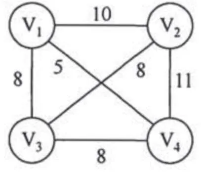
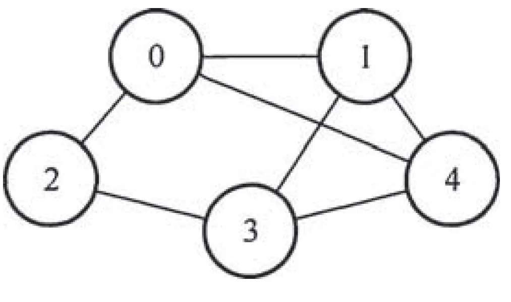

# 2015 年 408 真题 · 答案与解析

> 刷完 [[题面]] 后用此页对答案、看解析。
> 顺序：数据结构（1–11, 41–42）→ 组成原理（12–22, 43–44）→ 操作系统（23–32, 45–46）→ 计算机网络（33–40, 47）

## 一、选择题答案速查表（40 题，每题 2 分，共 80 分）

| 题号 | 1 | 2 | 3 | 4 | 5 | 6 | 7 | 8 | 9 | 10 |
| 答案 | **A** | **B** | **D** | **D** | **D** | **C** | **A** | **C** | **C** | **C** |
| 科目 | 数结 | 数结 | 数结 | 数结 | 数结 | 数结 | 数结 | 数结 | 数结 | 数结 |

| 题号 | 11 | 12 | 13 | 14 | 15 | 16 | 17 | 18 | 19 | 20 |
| 答案 | **A** | **A** | **B** | **D** | **C** | **B** | **B** | **D** | **C** | **B** |
| 科目 | 数结 | 组原 | 组原 | 组原 | 组原 | 组原 | 组原 | 组原 | 组原 | 组原 |

| 题号 | 21 | 22 | 23 | 24 | 25 | 26 | 27 | 28 | 29 | 30 |
| 答案 | **B** | **D** | **B** | **C** | **D** | **B** | **A** | **A** | **B** | **C** |
| 科目 | 组原 | 组原 | 操作 | 操作 | 操作 | 操作 | 操作 | 操作 | 操作 | 操作 |

| 题号 | 31 | 32 | 33 | 34 | 35 | 36 | 37 | 38 | 39 | 40 |
| 答案 | **C** | **C** | **D** | **A** | **B** | **B** | **A** | **C** | **A** | **C** |
| 科目 | 操作 | 操作 | 计网 | 计网 | 计网 | 计网 | 计网 | 计网 | 计网 | 计网 |

> 科目缩写：数结 = 数据结构 | 组原 = 计算机组成原理 | 操作 = 操作系统 | 计网 = 计算机网络

## 二、综合题答案要点速查表（7 题，共 70 分）

| 题号 | 分值 | 科目 | 考点 | 关键结论 |
|------|------|------|------|----------|
| 41 | 15 | 数据结构 | 线性表 | 答案：1、基本思想：因 |data| ≤ n，可开一个大小为 n+1 的辅助数组记录绝对值是否已出现 |
| 42 | 8 | 数据结构 | 图 | 答案：1、邻接矩阵（无向图，边为 0-1、0-2、0-4、1-3、1-4、2-3、3-4）： |
| 43 | 13 | 计算机组成原理 | 中央处理器 | 答案：1、程序员可见寄存器为通用寄存器 R0～R3 和 PC |
| 44 | 10 | 计算机组成原理 | 中央处理器 | 答案：1、指令操作码占 7 位，最多可定义 2⁷=128 条指令 |
| 45 | 9 | 操作系统 | 进程与线程 | 答案：1、信号量定义：A_full=x（A 信箱中已有的邮件数）、A_empty=M-x（A 信箱还可容纳的邮件数）、A_mutex=1（A 信箱互斥）、B_f... |
| 46 | 6 | 操作系统 | 内存管理 | 答案：1、页内偏移占 12 位，页与页框大小均为 2¹²=4KB；虚拟地址共 32 位，虚拟地址空间大小为 2³²/2¹²=2²⁰ 页 |
| 47 | 9 | 计算机网络 | 应用层 | 答案：1、子网 111.123.15.0/24 中 .1（路由器内网口）、.2（DHCP 服务器）、.3（WWW 服务器）、.4（主机 1）已静态占用，去掉网络... |

---

## 三、详细解析

> 以下按题号顺序排列。每题包含题干、选项、答案、解析。
> 图片以相对路径 `images/xxx.webp` 引用，与本文同目录。

### 选择题 · 数据结构

### 1. （2 分 · 栈、队列与数组）

已知程序如下： 

```c
int S(int n) {
    return (n <= 0) ? 0 : S(n - 1) + n;
}

void main() {
    cout << S(1);
}
```

程序运行时使用栈来保存调用过程的信息，自栈底到栈顶保存的信息依次对应的是（ ）。

- **A.** main() → S (1) → S (0)
- **B.** S (0) → S (1) → main()
- **C.** main() → S (0) → S (1)
- **D.** S (1) → S (0) → main()

**答案**：A

**解析**：答案 A。程序依次调用 main()、S(1)、S(0)，系统栈按后进先出保存调用信息，先调用的在栈底，故自栈底到栈顶依次为 main() → S(1) → S(0)。

> 难度 ⭐⭐ ｜ 章节 栈、队列与数组 ｜ 标签 数据结构 / 栈 / 队列 / 数组

---

### 2. （2 分 · 树与二叉树）

先序序列为 a,b,c,d 的不同二叉树的个数是()。

- **A.** 13
- **B.** 14
- **C.** 15
- **D.** 16

**答案**：B

**解析**：答案 B。先序序列固定的不同二叉树个数为卡特兰数 Cₙ = (1/(n+1))·C(2n,n)，n=4 时 C₄ = (1/5)×70 = 14，等价于 4 个元素以 a,b,c,d 为入栈次序的出栈序列数。

> 难度 ⭐⭐⭐ ｜ 章节 树与二叉树 ｜ 标签 数据结构 / 树 / 二叉树 / 二叉树遍历

---

### 3. （2 分 · 树与二叉树）

下列选项给出的是从根分别到达两个叶结点路径上的权值序列，能属于同一棵哈夫曼树的是( )。

- **A.** 24, 10, 5 和 24, 10, 7
- **B.** 24, 10, 5 和 24, 12, 7
- **C.** 24, 10, 10 和 24, 14, 11
- **D.** 24, 10, 5 和 24, 14, 6

**答案**：D

**解析**：答案 D。哈夫曼树中父结点权值等于两孩子权值之和。D 中 10 的另一孩子为 5、14 的另一孩子为 8，路径自洽；A 中同一 10 推出的孩子权值矛盾，B 中 10+12≠24，C 中 10−10=0 不合法。

> 难度 ⭐⭐⭐⭐ ｜ 章节 树与二叉树 ｜ 标签 数据结构 / 树 / 二叉树 / 二叉树遍历 / 哈夫曼树

---

### 4. （2 分 · 查找）

现有一棵无重复关键字的平衡二叉树(AVL 树)，对其进行中序遍历可得到一个降序序列。下列关于该平衡二叉树的叙述中，正确的是( )。

- **A.** 根结点的度一定为 2
- **B.** 树中最小元素一定是叶结点
- **C.** 最后插入的元素一定是叶结点
- **D.** 树中最大元素一定是无左子树

**答案**：D

**解析**：答案 D。中序为降序说明左子树大于根、右子树小于根。中序第一个元素即最大元素，它沿左子链走到底，必无左子树；根度可为 1，最小元素不一定为叶，最后插入的结点可能因旋转而成为内部结点，A、B、C 均错。

> 难度 ⭐⭐⭐⭐ ｜ 章节 查找 ｜ 标签 数据结构 / 查找 / 散列表 / B树 / AVL树 / 二叉树遍历

---

### 5. （2 分 · 图）

设有向图 G=(V,E)，顶点集 V={ v0 , v1 , v2 , v3 }，边集 E={< v0 , v1 >，< v0 , v2 >，< v0 , v3 >，< v1 , v3 >}。若从顶点 v0 开始对图进行深度优先遍历，则可能得到的不同遍历序列个数是（）。

- **A.** 2
- **B.** 3
- **C.** 4
- **D.** 5

**答案**：D

**解析**：答案 D。从 v0 出发 DFS：先访问 v1 时序列被锁定为 v0,v1,v3,v2，共 1 种；先访问 v2 或 v3 时，v0 剩余两个邻居的访问次序各 2 种。共 1+2+2=5 种。

> 难度 ⭐⭐⭐⭐ ｜ 章节 图 ｜ 标签 数据结构 / 图 / 最短路径 / 最小生成树 / 二叉树遍历

---

### 6. （2 分 · 图）

求下面带权图的最小(代价)生成树时，可能是克鲁斯卡(Kruskal)算法第 2 次选中但不是普里姆(Prim)算法(从 V4 开始)第 2 次选中的边是（ ）。



- **A.** ( V 1, V 3)
- **B.** ( V 1, V 4)
- **C.** ( V 2, V 3)
- **D.** ( V 3, V 4)

**答案**：C

**解析**：答案 C。Kruskal 第一条必选权值最小的 (V1,V4)，第二条可在三条权值为 8 的边中任选；而 Prim 从 V4 出发，第二条只能选与已选集合 {V1,V4} 关联的 (V1,V3) 或 (V3,V4)，(V2,V3) 两端都不在集合中，不可能被选中。

> 难度 ⭐⭐⭐⭐ ｜ 章节 图 ｜ 标签 数据结构 / 图 / 最短路径 / 最小生成树 / 数据链路层

---

### 7. （2 分 · 查找）

下列选项中，不能构成折半查找中关键字比较序列的是()。

- **A.** 500,200,450,180
- **B.** 500,450,200,180
- **C.** 180,500,200,450
- **D.** 180,200,500,450

**答案**：A

**解析**：答案 A。折半查找的判定树是二叉排序树：一旦进入某结点的右子树，之后比较的关键字都必须大于该结点。A 中 500→200→450 后出现 180，180<200 却出现在 200 的右子树方向，矛盾；B、C、D 均合法。

> 难度 ⭐⭐⭐⭐ ｜ 章节 查找 ｜ 标签 数据结构 / 查找 / 散列表 / B树 / 查找算法

---

### 8. （2 分 · 串）

已知字符串 s 为 "abaabaabacacaabaabcc"，模式串 t 为 "abaabc"。采用 KMP 算法进行匹配，第一次出现"失配"(s[i] ≠ t[j])时，i = j = 5，则下次开始匹配时，i 和 j 的值分别是( )。

- **A.** i = 1, j = 0
- **B.** i = 5, j = 0
- **C.** i = 5, j = 2
- **D.** i = 6, j = 2

**答案**：C

**解析**：答案 C。t="abaabc" 的 next 数组（下标从 0 起）为 -1,0,0,1,1,2。KMP 失配时 i 不变、j 回退到 next[j]，故 i=5 保持不变，j=next[5]=2。

> 难度 ⭐⭐⭐ ｜ 章节 串 ｜ 标签 数据结构 / 串

---

### 9. （2 分 · 排序）

下列排序算法中，元素的移动次数与关键字的初始排列次序无关的是()。

- **A.** 直接插入排序
- **B.** 冒泡排序
- **C.** 基数排序
- **D.** 快速排序

**答案**：C

**解析**：答案 C。基数排序按位进行分配与收集，每个元素每趟的移动次数固定，与关键字的初始排列无关；直接插入、起泡、快速排序的移动次数都随初始排列变化。

> 难度 ⭐⭐ ｜ 章节 排序 ｜ 标签 数据结构 / 排序 / 内部排序 / 外部排序

---

### 10. （2 分 · 排序）

已知小根堆为 8,15,10,21,34,16,12，删除关键字 8 之后需重建堆，在此过程中，关键字之间的比较次数是()。

- **A.** 1
- **B.** 2
- **C.** 3
- **D.** 4

**答案**：C

**解析**：答案 C。删除 8 后把末尾的 12 移到堆顶：先比较 15 与 10（第 1 次），再比较 10 与 12 并交换（第 2 次），12 下沉后与 16 比较（第 3 次），不再交换，共 3 次。

> 难度 ⭐⭐⭐ ｜ 章节 排序 ｜ 标签 数据结构 / 排序 / 内部排序 / 外部排序

---

### 11. （2 分 · 排序）

希尔排序的组内排序采用的是（）。

- **A.** 直接插入排序
- **B.** 折半插入排序
- **C.** 快速排序
- **D.** 归并排序

**答案**：A

**解析**：答案 A。希尔排序按增量把序列分成若干子序列，各组内采用直接插入排序，逐步缩小增量，最后增量为 1 时对全体元素再做一次直接插入排序。

> 难度 ⭐ ｜ 章节 排序 ｜ 标签 数据结构 / 排序 / 内部排序 / 外部排序 / 排序算法

---

### 综合题 · 数据结构

### 41. （15 分 · 线性表）

用单链表保存 m 个整数，结点的结构为 `data | link`，且 |data| ≤ n（n 为正整数）。现要求设计一个时间复杂度尽可能高效的算法，对于链表中 data 的绝对值相等的结点，仅保留第一次出现的结点而删除其余绝对值相等的结点。例如，若给定的单链表 head 如下：

则删除结点后的 head 为：

要求：

(1) 给出算法的基本设计思想。

(2) 使用 C 或 C++ 语言，给出单链表结点的数据类型定义。

(3) 根据设计思想，采用 C 或 C++ 语言描述算法，关键之处给出注释。

(4) 说明你所设计算法的时间复杂度和空间复杂度。


**答案 / 解析**：

答案：1、基本思想：因 |data| ≤ n，可开一个大小为 n+1 的辅助数组记录绝对值是否已出现。一趟扫描链表，首次出现的绝对值保留并标记，再次出现的绝对值删除对应结点，用空间换时间。2、结点类型定义：
```c
typedef struct node {
    int data;
    struct node *link;
} Node;
```
3、核心代码：
```c
void Remove(Node *head, int n) {
    int *q = (int *)malloc((n + 1) * sizeof(int));
    for (int i = 0; i <= n; i++) q[i] = 0;   // 0 表示未出现
    Node *p = head, *r = head->link;         // p 为前驱，r 为当前结点
    while (r != NULL) {
        int v = r->data < 0 ? -r->data : r->data;
        if (q[v] == 1) {                     // 绝对值已出现过，删除
            p->link = r->link;
            free(r);
            r = p->link;
        } else {
            q[v] = 1;                        // 首次出现，保留并标记
            p = r;
            r = r->link;
        }
    }
    free(q);
}
```
4、时间复杂度 O(m)，空间复杂度 O(n)。

> 难度 ⭐⭐⭐⭐ ｜ 章节 线性表 ｜ 标签 数据结构 / 线性表 / 顺序表 / 链表

---

### 42. （8 分 · 图）

已知含有 5 个顶点的图 G 如下图所示。



请回答下列问题：

(1) 写出图 G 的邻接矩阵 A（行、列下标均从 0 开始）。

(2) 求 A²，矩阵 A² 中位于 0 行 3 列元素值的含义是什么？

(3) 若已知具有 n（n ≥ 2）个顶点的图的邻接矩阵为 B，则 Bᵐ（2 ≤ m ≤ n）中非零元素的含义是什么？

**答案 / 解析**：

答案：1、邻接矩阵（无向图，边为 0-1、0-2、0-4、1-3、1-4、2-3、3-4）：
```text
    0 1 1 0 1
    1 0 0 1 1
A = 1 0 0 1 0
    0 1 1 0 1
    1 1 0 1 0
```
2、A² 为：
```text
    3 1 0 3 1
    1 3 2 1 2
    0 2 2 0 2
    3 1 0 3 1
    1 2 2 1 3
```
A² 中 0 行 3 列的元素为 3，表示从顶点 0 到顶点 3 长度为 2 的路径共有 3 条（分别经过中间顶点 1、2、4）。3、Bᵐ 中 (i, j) 处的非零元素表示从顶点 i 到顶点 j 长度为 m 的路径条数（允许重复经过顶点）。

> 难度 ⭐⭐⭐⭐ ｜ 章节 图 ｜ 标签 数据结构 / 图 / 最短路径 / 最小生成树 / 图的存储

---

### 选择题 · 计算机组成原理

### 12. （2 分 · 计算机系统概述）

计算机硬件能够直接执行的语言

Ⅰ. 机器语言程序

Ⅱ. 汇编语言程序

Ⅲ. 硬件描述语言程序

- **A.** 仅 Ⅰ
- **B.** 仅 Ⅰ、Ⅱ
- **C.** 仅 Ⅰ、Ⅲ
- **D.** Ⅰ、Ⅱ、Ⅲ

**答案**：A

**解析**：答案 A。硬件只能直接执行二进制形式的机器语言；汇编语言需经汇编程序翻译成机器码，硬件描述语言用于描述与综合电路，二者都不能被硬件直接执行。

> 难度 ⭐ ｜ 章节 计算机系统概述 ｜ 标签 计算机组成原理 / 计算机系统概述

---

### 13. （2 分 · 数据表示与运算）

由 3 个"1"和 5 个"0"组成的 8 位二进制补码，能表示的最小整数（ ）。

- **A.** -126
- **B.** -125
- **C.** -32
- **D.** -3

**答案**：B

**解析**：答案 B。负数补码的符号位为 1，还剩 2 个 1，放在最低两位可使数值最小，得补码 10000011₂，真值为 -2⁷+2¹+2⁰ = -128+3 = -125。

> 难度 ⭐⭐⭐ ｜ 章节 数据表示与运算 ｜ 标签 计算机组成原理 / 数据表示 / 运算

---

### 14. （2 分 · 数据表示与运算）

下列有关浮点数加减运算的叙述中，正确的是（ ）。

Ⅰ. 对阶操作不会引起阶码上溢或下溢

Ⅱ. 右规和尾数舍入都可能引起阶码上溢

Ⅲ. 左规时可能引起阶码下溢

Ⅳ. 尾数溢出时结果不一定溢出

- **A.** 仅Ⅱ、Ⅲ
- **B.** 仅Ⅰ、Ⅱ、Ⅳ
- **C.** 仅Ⅰ、Ⅲ、Ⅳ
- **D.** Ⅰ、Ⅱ、Ⅲ、Ⅳ

**答案**：D

**解析**：答案 D。对阶是小阶向大阶对齐，阶码不会越界（Ⅰ 对）；右规和舍入进位都使阶码加 1，可能上溢（Ⅱ 对）；左规使阶码减 1，可能下溢（Ⅲ 对）；尾数溢出可经右规恢复规格化，结果不一定溢出（Ⅳ 对）。

> 难度 ⭐⭐⭐⭐ ｜ 章节 数据表示与运算 ｜ 标签 计算机组成原理 / 数据表示 / 运算

---

### 15. （2 分 · 存储器层次结构）

假定主存地址位数为 32 位，按字节编址，主存和 Cache 之间采用直接映射方式，主存块大小为 4 个字，每字 32 位，写操作时采用回写 (Write Back) 方式，则能存放 4K 字数据的 Cache 的总容量的位数至少是（ ）。

- **A.** 146K
- **B.** 147K
- **C.** 148K
- **D.** 158K

**答案**：C

**解析**：答案 C。块大小为 4×32=128 位=16B，块内地址占 4 位；Cache 行数 4K/4=2¹⁰，行号占 10 位，主存字块标记占 32-10-4=18 位。回写法每行含 18 位标记+1 位有效位+1 位脏位+128 位数据=148 位，总容量 2¹⁰×148=148K 位。

> 难度 ⭐⭐⭐⭐ ｜ 章节 存储器层次结构 ｜ 标签 计算机组成原理 / 存储器层次结构 / Cache

---

### 16. （2 分 · 存储器层次结构）

假定编译器将赋值语句 "x=x+3;" 转换为指令 "add xaddr, 3"，其中 xaddr 是 x 对应的存储单元地址。若执行该指令的计算机采用页式虚拟存储管理方式，并配有相应的 TLB，且 Cache 使用直写（Write Through）方式，则完成该指令功能需要访问主存的次数至少是（ ）。

- **A.** 0
- **B.** 1
- **C.** 2
- **D.** 3

**答案**：B

**解析**：答案 B。指令执行分取数、运算、写回。最佳情况下取指、取数都命中 Cache 且 TLB 命中，无需访主存；但采用直写法，写 x 时必须同时写入 Cache 和主存，故至少访问主存 1 次。

> 难度 ⭐⭐⭐⭐ ｜ 章节 存储器层次结构 ｜ 标签 计算机组成原理 / 存储器层次结构 / Cache / 地址转换 / 虚拟内存

---

### 17. （2 分 · 存储器层次结构）

下列存储器中，在工作期间需要刷新的是（ ）。

- **A.** SRAM
- **B.** SDRAM
- **C.** ROM
- **D.** FLASH

**答案**：B

**解析**：答案 B。DRAM 用电容存储电荷，电荷会泄漏，必须定期刷新；SDRAM 是同步动态随机存储器，属于 DRAM，仍需刷新。SRAM 靠双稳态电路保持状态，ROM、FLASH 是非易失存储器，均不需刷新。

> 难度 ⭐ ｜ 章节 存储器层次结构 ｜ 标签 计算机组成原理 / 存储器层次结构

---

### 18. （2 分 · 存储器层次结构）

某计算机使用 4 体交叉编址存储器，假定在存储器总线上出现的主存地址（十进制）序列为 8005，8006，8007，8008，8001，8002，8003，8004，8000，则可能发生访存冲突的地址对是（ ）。

- **A.** 8004 和 8008
- **B.** 8002 和 8007
- **C.** 8001 和 8008
- **D.** 8000 和 8004

**答案**：D

**解析**：答案 D。4 体交叉编址时体号 = 地址 mod 4，序列 8005…8000 对应的体号依次为 1,2,3,0,1,2,3,0,0。8004 与 8000 同落体 0 且访问相邻，可能发生访存冲突。

> 难度 ⭐⭐⭐ ｜ 章节 存储器层次结构 ｜ 标签 计算机组成原理 / 存储器层次结构

---

### 19. （2 分 · 总线）

下列有关总线定时的叙述中，错误的是（ ）。

- **A.** 异步通信方式中，全互锁协议最慢
- **B.** 异步通信方式中，非互锁协议的可靠性最差
- **C.** 同步通信方式中，同步时钟信号可由各设备提供
- **D.** 半同步通信方式中，握手信号的采样由同步时钟控制

**答案**：C

**解析**：答案 C。同步通信要求所有设备共用一个统一时钟信号，由总线控制器统一发出，不能由各设备各自提供；A、B、D 的叙述均正确。

> 难度 ⭐⭐⭐ ｜ 章节 总线 ｜ 标签 计算机组成原理 / 总线 / 系统总线 / I/O接口

---

### 20. （2 分 · 输入输出系统）

若磁盘转速为 7200rpm，平均寻道时间为 8ms，每个磁道包含 1000 个扇区，则访问一个扇区的平均存取时间大约是（ ）。

- **A.** 8.1ms
- **B.** 12.2ms
- **C.** 16.3ms
- **D.** 20.5ms

**答案**：B

**解析**：答案 B。存取时间 = 寻道时间 + 平均延迟时间 + 传输时间 = 8 + (60/7200)/2 + (60/7200)/1000 ≈ 8+4.17+0.01 = 12.2ms。

> 难度 ⭐⭐ ｜ 章节 输入输出系统 ｜ 标签 计算机组成原理 / I/O系统 / 中断 / DMA / 磁盘

---

### 21. （2 分 · 输入输出系统）

在采用中断 I/O 方式控制打印输出的情况下，CPU 和打印控制接口中的 I/O 端口之间交换的信息不可能是（ ）。

- **A.** 打印字符
- **B.** 主存地址
- **C.** 设备状态
- **D.** 控制命令

**答案**：B

**解析**：答案 B。中断 I/O 方式下 CPU 与接口交换打印字符（数据端口）、设备状态（状态端口）和控制命令（控制端口）；主存地址只存在于 CPU 内部，不会传给 I/O 接口，向接口传递主存地址是 DMA 方式的特征。

> 难度 ⭐⭐ ｜ 章节 输入输出系统 ｜ 标签 计算机组成原理 / I/O系统 / 中断 / DMA / I/O方式 / 内存分配

---

### 22. （2 分 · 中央处理器）

内部异常（内中断）可分为故障（fault）、陷阱（trap）和终止（abort）三类。下列有关内部异常的叙述中，错误的是（ ）。

- **A.** 内部异常的产生与当前执行指令相关
- **B.** 内部异常的检测由 CPU 内部逻辑实现
- **C.** 内部异常的响应发生在指令执行过程中
- **D.** 内部异常处理后返回到发生异常的指令继续执行

**答案**：D

**解析**：答案 D。内部异常与当前指令相关、由 CPU 内部逻辑检测、在指令执行中响应，A、B、C 正确。但只有故障（fault）处理后返回原指令重执；陷阱（如 INT）返回下一条指令，终止不返回，故 D 错误。

> 难度 ⭐⭐⭐ ｜ 章节 中央处理器 ｜ 标签 计算机组成原理 / CPU / 数据通路 / 指令流水线 / I/O方式

---

### 综合题 · 计算机组成原理

### 43. （13 分 · 中央处理器）

某 16 位计算机的主存按字节编址，存取单位为 16 位；采用 16 位定长指令字格式；CPU 采用单总线结构，主要部分如下图所示。


图中 R0～R3 为通用寄存器；T 为暂存器；SR 为移位寄存器，可实现直送（mov）、左移一位（left）和右移一位（right）3 种操作，控制信号为 SRop，SR 的输出由信号 SRout 控制；ALU 可实现直送 A（mova）、A 加 B（add）、A 减 B（sub）、A 与 B（and）、A 或 B（or）、非 A（not）、A 加 1（inc）这 7 种操作，控制信号为 ALUop。

注：已补充内总线到 MAR 的箭头和内总线到 IR 的箭头。

请回答下列问题。

(1) 图中哪些寄存器是程序员可见的？为何要设置暂存器 T？

(2) 控制信号 ALUop 和 SRop 的位数至少各是多少？

(3) 控制信号 SRout 所控制部件的名称或作用是什么？

(4) 端点①～⑨中，哪些端点须连接到控制部件的输出端？

(5) 为完善单总线数据通路，需要在端点①～⑨中相应的端点之间添加必要的连线。写出连线的起点和终点，以正确表示数据的流动方向。

(6) 为什么二路选择器 MUX 的一个输入端是 2？

**答案 / 解析**：

答案：1、程序员可见寄存器为通用寄存器 R0～R3 和 PC。单总线结构下 ALU 的两个输入端口都接在同一根总线上，若不设暂存器 T，两个操作数会同时到达 A、B 端口而无法区分，故需 T 先暂存一个操作数。2、ALU 有 7 种操作，ALUop 至少 3 位；移位寄存器有 3 种操作，SRop 至少 2 位。3、SRout 控制 SR 输出端的三态门，决定移位寄存器输出与内总线的接通或断开。4、端点①、②、③、⑤、⑧须连接到控制部件的输出端。5、连线 1：⑥→⑨；连线 2：⑦→④。6、指令长 16 位、按字节编址，每条指令占 2 个存储单元，顺序执行时下条指令地址为 (PC)+2，故 MUX 的一个输入端为 2，便于执行 (PC)+2 操作。

> 难度 ⭐⭐⭐⭐ ｜ 章节 中央处理器 ｜ 标签 计算机组成原理 / CPU / 数据通路 / 指令流水线 / CPU设计

---

### 44. （10 分 · 中央处理器）

题 43 中描述的计算机如下图所示。为便于从本题入口独立作答，这里先附该 CPU 单总线数据通路图。


其部分指令执行过程的控制信号如题 44 图 a 所示

图 a  部分指令控制信号

该机指令格式如题 44 图 b 所示，支持寄存器直接和寄存器间接两种寻址方式，寻址方式位分别为 0 和 1，通用寄存器 R0～R3 的编号分别为 0、1、2 和 3。

请回答下列问题。

(1) 该机的指令系统最多可定义多少条指令？

(2) 假定 inc、shl 和 sub 指令的操作码分别为 01H、02H 和 03H，则以下指令对应的机器代码各是什么？

```
inc R1;             // (R1)+1→R1
shl R2, R1;         // (R1)<<1→R2
sub R3, (R1), R2;   // ((R1))–(R2)→R3
```

(3) 假设寄存器 X 的输入和输出控制信号分别为 Xin 和 Xout，其值为 1 表示有效，为 0 表示无效（例如，PCout=1 表示 PC 内容送总线）；存储器控制信号为 MEMop，用于控制存储器的读 (read) 和写 (write) 操作。写出题 44 图 a 中标号①～⑧处的控制信号或控制信号的取值。

(4) 指令 `sub R1，R3，(R2)` 和 `inc R1` 的执行阶段至少各需要多少个时钟周期？

**答案 / 解析**：

答案：1、指令操作码占 7 位，最多可定义 2⁷=128 条指令。2、机器代码：inc R1 为 0000 0010 0100 0000，即 0240H；shl R2, R1 为 0000 0100 1000 1000，即 0488H；sub R3, (R1), R2 为 0000 0110 1110 1010，即 06EAH。3、① 0；② mov；③ mova；④ left；⑤ read；⑥ sub；⑦ mov；⑧ SRout。4、sub R1, R3, (R2) 的执行阶段至少 4 个时钟周期（单总线需分拍完成：送 R3 入 T、送 (R2) 地址入 MAR、读主存、ALU 运算并回写）；inc R1 的执行阶段至少 2 个时钟周期。

> 难度 ⭐⭐⭐⭐ ｜ 章节 中央处理器 ｜ 标签 计算机组成原理 / CPU / 数据通路 / 指令流水线 / CPU设计 / 性能指标

---

### 选择题 · 操作系统

### 23. （2 分 · 输入输出管理）

处理外部中断时，应该由操作系统保存的是（ ）。

- **A.** 程序计数器（PC）的内容
- **B.** 通用寄存器的内容
- **C.** 快表（TLB）中的内容
- **D.** Cache 中的内容

**答案**：B

**解析**：答案 B。处理外部中断时，PC 的值由中断隐指令自动保存；通用寄存器的内容由操作系统在中断服务程序中保存；TLB 与 Cache 的内容不需要操作系统保存。

> 难度 ⭐⭐⭐ ｜ 章节 输入输出管理 ｜ 标签 操作系统 / I/O系统 / 中断 / DMA / I/O方式

---

### 24. （2 分 · 计算机系统概述）

假定下列指令已装入指令寄存器，则执行时不可能导致 CPU 从用户态变为内核态（系统态）的是（ ）。

- **A.** `DIV R0, R1;` (R0)/(R1)→R0
- **B.** `INT n;` 产生软中断
- **C.** `NOT R0;` 寄存器 `R0` 的内容取非
- **D.** `MOV R0, addr;` 把地址 `addr` 的内存数据放入寄存器 `R0` 中

**答案**：C

**解析**：答案 C。DIV 可能发生除零异常，INT n 是主动陷入的软中断，MOV 访存可能缺页，执行时都可能转入内核态；NOT R0 是纯寄存器运算，不访存也不产生异常，不可能引起用户态到内核态的切换。

> 难度 ⭐⭐⭐ ｜ 章节 计算机系统概述 ｜ 标签 操作系统 / 计算机系统概述

---

### 25. （2 分 · 进程与线程）

下列选项中，会导致进程从执行态变为就绪态的事件是（ ）。

- **A.** 执行 P(wait) 操作
- **B.** 申请内存失败
- **C.** 启动 I/O 设备
- **D.** 被高优先级进程抢占

**答案**：D

**解析**：答案 D。执行 P(wait)、申请内存失败、启动 I/O 都是在等待资源或事件，进程转入阻塞态；被高优先级进程抢占只是让出 CPU，进程仍可运行，转入就绪态。

> 难度 ⭐⭐ ｜ 章节 进程与线程 ｜ 标签 操作系统 / 进程管理 / 进程 / 线程 / 同步 / PV操作

---

### 26. （2 分 · 进程与线程）

若系统 S1 采用死锁避免方法，S2 采用死锁检测方法。下列叙述中，正确的是（ ）。

Ⅰ、S1 会限制用户申请资源的顺序，而 S2 不会
Ⅱ、S1 需要进程运行所需的资源总量信息，而 S2 不需要
Ⅲ、S1 不会给可能导致死锁的进程分配资源，而 S2 会

- **A.** 仅Ⅰ、Ⅱ
- **B.** 仅Ⅱ、Ⅲ
- **C.** 仅Ⅰ、Ⅲ
- **D.** Ⅰ、Ⅱ、Ⅲ

**答案**：B

**解析**：答案 B。限制申请顺序是死锁预防的手段，Ⅰ 错；死锁避免（银行家算法）需要进程最大资源需求信息，检测不需要，Ⅱ 对；避免策略分配前检查安全性、不安全则不分配，检测策略不设防、发现死锁后再解除，Ⅲ 对。

> 难度 ⭐⭐⭐ ｜ 章节 进程与线程 ｜ 标签 操作系统 / 进程管理 / 进程 / 线程 / 同步 / PV操作 / 死锁

---

### 27. （2 分 · 内存管理）

系统为某进程分配了 4 个页框，该进程已访问的页号序列为 2, 0, 2, 9, 3, 4, 2, 8, 2, 4, 8, 4, 5。若进程要访问的下一页的页号为 7，依据 LRU 算法，应淘汰页的页号是（ ）。

- **A.** 2
- **B.** 3
- **C.** 4
- **D.** 8

**答案**：A

**解析**：答案 A。LRU 淘汰最近最久未使用的页。序列访问完后内存中驻留 2、8、4、5，页 2 的最后一次访问最靠前（最久未用），访问页 7 时应淘汰页 2。

> 难度 ⭐⭐⭐ ｜ 章节 内存管理 ｜ 标签 操作系统 / 内存管理 / 分页 / 分段 / 虚拟内存 / 页面置换 / Cache / 内存分配

---

### 28. （2 分 · 输入输出管理）

在系统内存中设置磁盘缓冲区的主要目的是（ ）。

- **A.** 减少磁盘 I/O 次数
- **B.** 减少平均寻道时间
- **C.** 提高磁盘数据可靠性
- **D.** 实现设备无关性

**答案**：A

**解析**：答案 A。磁盘缓冲区把频繁访问的数据缓存在内存，命中时直接返回而无需访问磁盘，还能合并多次写操作，主要目的是减少磁盘 I/O 次数。

> 难度 ⭐⭐ ｜ 章节 输入输出管理 ｜ 标签 操作系统 / I/O系统 / 中断 / DMA / 缓冲区 / 磁盘

---

### 29. （2 分 · 文件管理）

在文件的索引节点中存放直接索引指针 10 个，一级和二级索引指针各 1 个。磁盘块大小为 1KB，每个索引指针占 4 个字节。若某文件的索引节点已在内存中，则把该文件偏移量（按字节编址）为 1234 和 307400 处所在的磁盘块读入内存，需访问的磁盘块个数分别是（ ）。

- **A.** 1、2
- **B.** 1、3
- **C.** 2、3
- **D.** 2、4

**答案**：B

**解析**：答案 B。直接索引覆盖 10KB，一级索引（每块 1KB/4B=256 个指针）覆盖至 10KB+256KB，二级索引覆盖至 64MB。偏移 1234B 在直接索引区，inode 已在内存，1 次访盘；偏移 307400B 在二级索引区，需先读两级索引块再读数据块，共 3 次。

> 难度 ⭐⭐⭐⭐ ｜ 章节 文件管理 ｜ 标签 操作系统 / 文件系统 / 文件 / 目录 / 磁盘

---

### 30. （2 分 · 内存管理）

在请求分页系统中，页面分配策略与页面置换策略不能组合使用的是（ ）。

- **A.** 可变分配，全局置换
- **B.** 可变分配，局部置换
- **C.** 固定分配，全局置换
- **D.** 固定分配，局部置换

**答案**：C

**解析**：答案 C。固定分配规定进程的页框数在运行期间不变，而全局置换缺页时可以从其他进程的页面中淘汰，会改变页框数，二者矛盾，故「固定分配，全局置换」不能组合使用。

> 难度 ⭐⭐⭐ ｜ 章节 内存管理 ｜ 标签 操作系统 / 内存管理 / 分页 / 分段 / 虚拟内存 / 页面置换 / 内存分配

---

### 31. （2 分 · 文件管理）

文件系统用位图法表示磁盘空间的分配情况，位图存于磁盘的 32～127 号块中，每个盘块占 1024 个字节，盘块和块内字节均从 0 开始编号。假设要释放的盘块号为 409612，则位图中要修改的位所在的盘块号和块内字节序号分别是（ ）。

- **A.** 81、1
- **B.** 81、2
- **C.** 82、1
- **D.** 82、2

**答案**：C

**解析**：答案 C。每个盘块可表示 1024×8=8192 位，409612/8192=50 余 12，位图起始块号为 32，故所在盘块号为 32+50=82；块内第 12 位，字节序号为 ⌊12/8⌋=1（从 0 起）。

> 难度 ⭐⭐⭐⭐ ｜ 章节 文件管理 ｜ 标签 操作系统 / 文件系统 / 文件 / 目录 / 磁盘

---

### 32. （2 分 · 输入输出管理）

某硬盘有 200 个磁道（最外侧磁道号为 0），磁道访问请求序列为：130，42，180，15，199，当前磁头位于第 58 号磁道并从外侧向内侧移动。按照 SCAN 调度方法处理完上述请求后，磁头移过的磁道数是（ ）。

- **A.** 208
- **B.** 287
- **C.** 325
- **D.** 382

**答案**：C

**解析**：答案 C。SCAN 即电梯算法：磁头从 58 向内侧移动，依次访问 130、180、199，到最内端后折返向外，再访问 42、15。移过的磁道数为 (199-58)+(199-15)=141+184=325。

> 难度 ⭐⭐⭐ ｜ 章节 输入输出管理 ｜ 标签 操作系统 / I/O系统 / 中断 / DMA / 磁盘 / 进程调度

---

### 综合题 · 操作系统

### 45. （9 分 · 进程与线程）

有 A、B 两人通过信箱进行辩论：

- 每个人都从自己的信箱中取得对方的问题，将答案和向对方提出的新问题组成一个邮件放入对方的信箱中
- 假设 A 的信箱最多放 M 个邮件，B 的信箱最多放 N 个邮件
- 初始时 A 的信箱中有 x 个邮件（0 < x < M），B 的信箱中有 y 个邮件（0 < y < N）
- 辩论者每取出一个邮件，邮件数减 1
- A、B 两人的操作过程描述如下：

```c
A {
    while (true) {
        从 A 的信箱中取出一个邮件;
        回答问题并提出一个新问题;
        将新邮件放入 B 的信箱;
    }
}

B {
    while (true) {
        从 B 的信箱中取出一个邮件;
        回答问题并提出一个新问题;
        将新邮件放入 A 的信箱;
    }
}
```

约束：信箱不为空时，辩论者才能从信箱中取邮件，否则等待；信箱不满时，辩论者才能将新邮件放入信箱，否则等待。

请添加必要的信号量和 P、V（或 wait、signal）操作，以实现上述过程的同步。要求写出完整的过程，并说明信号量的含义和初值。

**答案 / 解析**：

答案：1、信号量定义：A_full=x（A 信箱中已有的邮件数）、A_empty=M-x（A 信箱还可容纳的邮件数）、A_mutex=1（A 信箱互斥）、B_full=y、B_empty=N-y、B_mutex=1（B 信箱互斥）。2、A、B 过程：
```c
A() {
    while (1) {
        P(A_full);  P(A_mutex);
        从 A 信箱取出一个邮件;
        V(A_mutex); V(A_empty);
        回答问题并提出新问题;
        P(B_empty); P(B_mutex);
        将新邮件放入 B 信箱;
        V(B_mutex); V(B_full);
    }
}

B() {
    while (1) {
        P(B_full);  P(B_mutex);
        从 B 信箱取出一个邮件;
        V(B_mutex); V(B_empty);
        回答问题并提出新问题;
        P(A_empty); P(A_mutex);
        将新邮件放入 A 信箱;
        V(A_mutex); V(A_full);
    }
}
```

> 难度 ⭐⭐⭐ ｜ 章节 进程与线程 ｜ 标签 操作系统 / 进程管理 / 进程 / 线程 / 同步 / PV操作 / 同步与互斥

---

### 46. （6 分 · 内存管理）

某计算机系统按字节编址，采用二级页表的分页存储管理方式，虚拟地址格式如下所示：

| 页目录号 | 页表索引 | 页内偏移量 |
| :---: | :---: | :---: |
| 10 位 | 10 位 | 12 位 |

请回答下列问题。

（1）页和页框的大小各为多少字节？进程的虚拟地址空间大小为多少页？

（2）假定页目录项和页表项均占 4 字节，则进程的页目录和页表共占多少页？要求写出计算过程。

（3）若某指令周期内访问的虚拟地址为 0100 0000H 和 0111 2048H，则进行地址转换时共访问多少个二级页表？要求说明理由。

**答案 / 解析**：

答案：1、页内偏移占 12 位，页与页框大小均为 2¹²=4KB；虚拟地址共 32 位，虚拟地址空间大小为 2³²/2¹²=2²⁰ 页。2、页目录有 2¹⁰=1024 项，占 1024×4B=4KB=1 页；每个二级页表同样为 1024 项×4B=1 页，页目录 1024 项最多对应 1024 个页表，故页目录和页表最多共占 1+1024=1025 页。3、只需访问 1 个二级页表。01000000H 与 01112048H 的最高 10 位（页目录号）均为 0000000100（十进制 4），页目录号相同，指向同一个二级页表。

> 难度 ⭐⭐⭐ ｜ 章节 内存管理 ｜ 标签 操作系统 / 内存管理 / 分页 / 分段 / 虚拟内存 / 页面置换 / 地址转换 / 内存分配 / 文件系统

---

### 选择题 · 计算机网络

### 33. （2 分 · 应用层）

通过 POP3 协议接收邮件时，使用的传输层服务类型是（ ）。

- **A.** 无连接不可靠的数据传输服务
- **B.** 无连接可靠的数据传输服务
- **C.** 有连接不可靠的数据传输服务
- **D.** 有连接可靠的数据传输服务

**答案**：D

**解析**：答案 D。POP3 建立在 TCP 连接之上，TCP 提供面向连接、可靠的数据传输服务（确认、重传、按序交付）。

> 难度 ⭐⭐ ｜ 章节 应用层 ｜ 标签 计算机网络 / 应用层 / HTTP / DNS / FTP / SMTP

---

### 34. （2 分 · 物理层）

使用两种编码方案对比特流 01100111 进行编码的结果如下图所示，编码 1 和编码 2 分别是（ ）。


- **A.** NRZ 和曼彻斯特编码
- **B.** NRZ 和差分曼彻斯特编码
- **C.** NRZI 和曼彻斯特编码
- **D.** NRZI 和差分曼彻斯特编码

**答案**：A

**解析**：答案 A。编码 1 每个码元内电平不变，且连续的 1 没有电平翻转，符合 NRZ；编码 2 每个码元中间都发生跳变，且 0 为低→高、1 为高→低，符合曼彻斯特编码。

> 难度 ⭐⭐ ｜ 章节 物理层 ｜ 标签 计算机网络 / 物理层 / 编码 / 调制 / Cache

---

### 35. （2 分 · 数据链路层）

主机甲通过 128 kbps 卫星链路，采用滑动窗口协议向主机乙发送数据，链路单向传播延迟为 250 ms，帧长为 1000 字节。不考虑确认帧的开销，为使链路利用率不小于 80%，帧序号的比特数至少是（ ）。

- **A.** 3
- **B.** 4
- **C.** 7
- **D.** 8

**答案**：B

**解析**：答案 B。帧发送时延 = 1000×8/128kbps = 62.5ms，RTT = 500ms。由利用率 n×62.5/(62.5+500) ≥ 80% 得 n ≥ 7.2，取 n=8；滑动窗口协议要求 2ᵏ−1 ≥ 8，即 2ᵏ ≥ 9，故帧序号比特数至少为 4。

> 难度 ⭐⭐⭐⭐ ｜ 章节 数据链路层 ｜ 标签 计算机网络 / 数据链路层 / MAC / CSMA/CD / PPP / 传输层

---

### 36. （2 分 · 数据链路层）

下列关于 CSMA/CD 协议的叙述中，错误的是（ ）。

- **A.** 边发送数据帧，边检测是否发生冲突
- **B.** 适用于无线网络，以实现无线链路共享
- **C.** 需要根据网络跨距和数据传输速率限定最小帧长
- **D.** 当信号传播延迟趋近 0 时，信道利用率趋近 100%

**答案**：B

**解析**：答案 B。CSMA/CD 适用于有线以太网；无线网络难以边发边检测冲突，采用 CSMA/CA。A、C、D 均是对 CSMA/CD 的正确描述。

> 难度 ⭐⭐ ｜ 章节 数据链路层 ｜ 标签 计算机网络 / 数据链路层 / MAC / CSMA/CD / PPP

---

### 37. （2 分 · 数据链路层）

下列关于交换机的叙述中，正确的是（ ）。

- **A.** 以太网交换机本质上是一种多端口网桥
- **B.** 通过交换机互连的一组工作站构成一个冲突域
- **C.** 交换机每个端口所连网络构成一个独立的广播域
- **D.** 以太网交换机可实现采用不同网络层协议的网络互联

**答案**：A

**解析**：答案 A。以太网交换机本质上是多端口网桥，工作在数据链路层。交换机每个端口隔离冲突域，但整机属于一个广播域，也不能互联不同网络层协议的网络，B、C、D 均错。

> 难度 ⭐⭐⭐ ｜ 章节 数据链路层 ｜ 标签 计算机网络 / 数据链路层 / MAC / CSMA/CD / PPP / 内存分配

---

### 38. （2 分 · 网络层）

某路由器的路由表如下表所示：

| 目的网络        | 下一跳     | 接口 |
| --------------- | ---------- | ---- |
| 169.96.40.0/23  | 176.1.1.1  | S1   |
| 169.96.40.0/25  | 176.2.2.2  | S2   |
| 169.96.40.0/27  | 176.3.3.3  | S3   |
| 0.0.0.0/0       | 176.4.4.4  | S4   |

若路由器收到一个目的地址为 169.96.40.5 的 IP 分组，则转发该 IP 分组的接口是（ ）。

- **A.** S1
- **B.** S2
- **C.** S3
- **D.** S4

**答案**：C

**解析**：答案 C。169.96.40.5 与 169.96.40.0/27 匹配的前缀最长（27 位），按最长前缀匹配应选择接口 S3；/23、/25 虽也匹配但前缀较短，默认路由仅在无其他匹配时使用。

> 难度 ⭐⭐⭐ ｜ 章节 网络层 ｜ 标签 计算机网络 / 网络层 / IP / 路由 / 子网划分 / CIDR / 指令流水线

---

### 39. （2 分 · 传输层）

主机甲和主机乙新建一个 TCP 连接，甲的拥塞控制初始阈值为 32 KB，甲向乙始终以 MSS = 1 KB 大小的段发送数据，并一直有数据发送；乙为该连接分配 16 KB 接收缓存，并对每个数据段进行确认，忽略段传输延迟。若乙收到的数据全部存入缓存，不被取走，则甲从连接建立成功时刻起，未发生超时的情况下，经过 4 个 RTT 后，甲的发送窗口是（ ）。

- **A.** 1 KB
- **B.** 8 KB
- **C.** 16 KB
- **D.** 32 KB

**答案**：A

**解析**：答案 A。发送窗口 = min(拥塞窗口, 接收窗口)。慢启动下 cwnd 每 RTT 翻倍，4 个 RTT 后为 16KB；但乙的 16KB 接收缓存从不取走数据，4 个 RTT 内累计收到 1+2+4+8=15KB，接收窗口只剩 1KB，故发送窗口为 min(16,1)=1KB。

> 难度 ⭐⭐⭐⭐ ｜ 章节 传输层 ｜ 标签 计算机网络 / 传输层 / TCP / UDP / 拥塞控制 / Cache / 应用层

---

### 40. （2 分 · 应用层）

某浏览器发出的 HTTP 请求报文如下：

```
GET /index.html HTTP/1.1
Host: www.test.edu.cn
Connection: close
Cookie: 123456
```

下列叙述中，错误的是（ ）。

- **A.** 该浏览器请求浏览 index.html
- **B.** index.html 存放在 www.test.edu.cn 上
- **C.** 该浏览器请求使用持续连接
- **D.** 该浏览器曾经浏览过 www.test.edu.cn

**答案**：C

**解析**：答案 C。Connection: close 表示请求非持续连接（一次响应后即关闭连接），与 C 的说法相反；A（GET 行）、B（Host 头）、D（Cookie 头）均能从报文推出。

> 难度 ⭐⭐⭐ ｜ 章节 应用层 ｜ 标签 计算机网络 / 应用层 / HTTP / DNS / FTP / SMTP

---

### 综合题 · 计算机网络

### 47. （9 分 · 应用层）

某网络拓扑如题 47 图所示，其中路由器内网接口、DHCP 服务器、WWW 服务器与主机 1 均采用静态 IP 地址配置，相关地址信息见图中标注；主机 2～主机 N 通过 DHCP 服务器动态获取 IP 地址等配置信息。


请回答下列问题。

（1）DHCP 服务器可为主机 2～主机 N 动态分配 IP 地址的最大范围是什么？主机 2 使用 DHCP 协议获取 IP 地址的过程中，发送的封装 DHCP Discover 报文的 IP 分组的源 IP 地址和目的 IP 地址分别是什么？

（2）若主机 2 的 ARP 表为空，则该主机访问 Internet 时，发出的第一个以太网帧的目的 MAC 地址是什么？封装主机 2 发往 Internet 的 IP 分组的以太网帧的目的 MAC 地址是什么？

（3）若主机 1 的子网掩码和默认网关分别配置为 255.255.255.0 和 111.123.15.2，则该主机是否能访问 WWW 服务器？是否能访问 Internet？请说明理由。

**答案 / 解析**：

答案：1、子网 111.123.15.0/24 中 .1（路由器内网口）、.2（DHCP 服务器）、.3（WWW 服务器）、.4（主机 1）已静态占用，去掉网络号 .0 和广播地址 .255，DHCP 可动态分配的最大范围为 111.123.15.5 ～ 111.123.15.254。主机 2 发送的封装 DHCP Discover 报文的 IP 分组，源 IP 地址为 0.0.0.0，目的 IP 地址为 255.255.255.255。2、主机 2 的 ARP 表为空，访问 Internet 时发出的第一个以太网帧是 ARP 广播请求，目的 MAC 地址为 ff-ff-ff-ff-ff-ff；封装发往 Internet 的 IP 分组的以太网帧，目的 MAC 地址为默认网关（路由器内网口）的 00-a1-a1-a1-a1-a1。3、能访问 WWW 服务器，不能访问 Internet。主机 1 的子网掩码 255.255.255.0 配置正确，WWW 服务器（111.123.15.3）与本机同子网，直接访问不经过网关；但默认网关错配为 111.123.15.2（正确应为 111.123.15.1），访问 Internet 时分组被交给 DHCP 服务器而无法转发到 Internet。

> 难度 ⭐⭐⭐ ｜ 章节 应用层 ｜ 标签 计算机网络 / 应用层 / HTTP / DNS / FTP / SMTP / 内存分配 / 网络层 / 数据链路层


## See Also

- [[题面]] — 仅题干与选项，用于限时刷题
- [[../408历年真题总目录]] — 历年真题总目录
- [[408考情分析]] — 试卷构成与逐年考点统计
