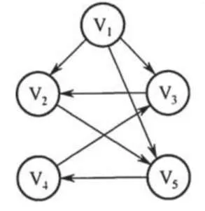
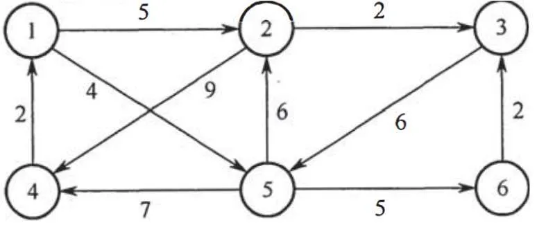
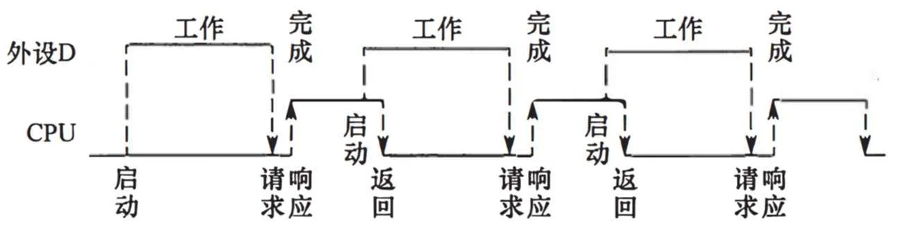
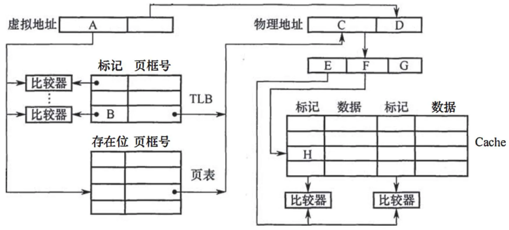
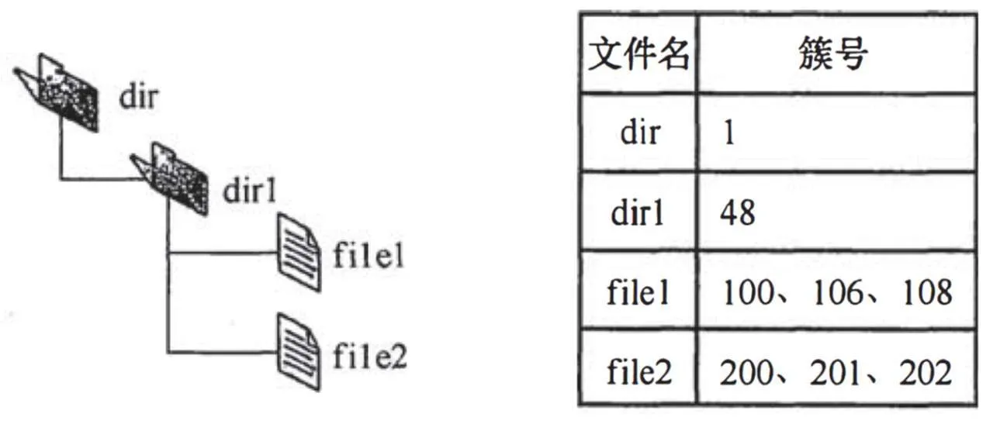
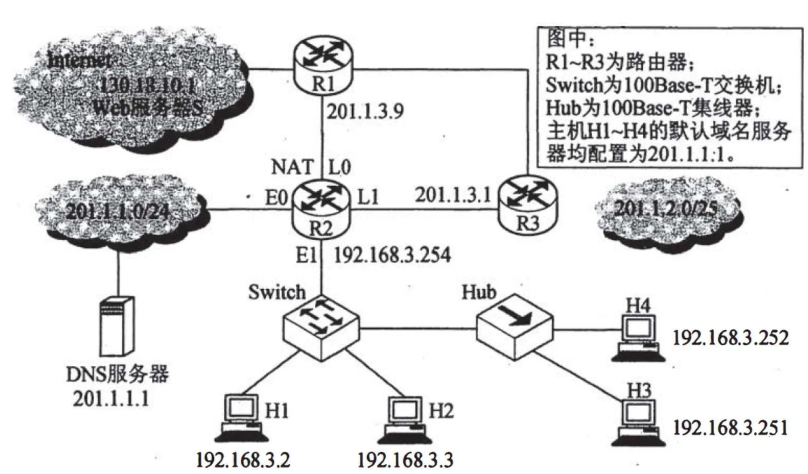

# 2016 年 408 真题 · 答案与解析

> 刷完 [[题面]] 后用此页对答案、看解析。
> 顺序：数据结构（1–11, 41–42）→ 组成原理（12–22, 43–44）→ 操作系统（23–32, 45–46）→ 计算机网络（33–40, 47）

## 一、选择题答案速查表（40 题，每题 2 分，共 80 分）

| 题号 | 1 | 2 | 3 | 4 | 5 | 6 | 7 | 8 | 9 | 10 |
| 答案 | **D** | **D** | **C** | **B** | **C** | **D** | **B** | **B** | **B** | **A** |
| 科目 | 数结 | 数结 | 数结 | 数结 | 数结 | 数结 | 数结 | 数结 | 数结 | 数结 |

| 题号 | 11 | 12 | 13 | 14 | 15 | 16 | 17 | 18 | 19 | 20 |
| 答案 | **D** | **C** | **D** | **A** | **C** | **C** | **C** | **B** | **B** | **A** |
| 科目 | 数结 | 组原 | 组原 | 组原 | 组原 | 组原 | 组原 | 组原 | 组原 | 组原 |

| 题号 | 21 | 22 | 23 | 24 | 25 | 26 | 27 | 28 | 29 | 30 |
| 答案 | **A** | **A** | **A** | **B** | **C** | **A** | **B** | **D** | **A** | **C** |
| 科目 | 组原 | 组原 | 操作 | 操作 | 操作 | 操作 | 操作 | 操作 | 操作 | 操作 |

| 题号 | 31 | 32 | 33 | 34 | 35 | 36 | 37 | 38 | 39 | 40 |
| 答案 | **D** | **A** | **C** | **C** | **D** | **B** | **B** | **D** | **C** | **C** |
| 科目 | 操作 | 操作 | 计网 | 计网 | 计网 | 计网 | 计网 | 计网 | 计网 | 计网 |

> 科目缩写：数结 = 数据结构 | 组原 = 计算机组成原理 | 操作 = 操作系统 | 计网 = 计算机网络

## 二、综合题答案要点速查表（7 题，共 70 分）

| 题号 | 分值 | 科目 | 考点 | 关键结论 |
|------|------|------|------|----------|
| 41 | 9 | 计算机网络 | 传输层 | 答案：1、第二次握手 SYN=1、ACK=1，确认序号为 100+1=101 |
| 42 | 8 | 数据结构 | 树与二叉树 | 答案：1、叶结点数 L=m(k−1)+1 |
| 43 | 15 | 数据结构 | 排序 | 答案：1、基本思想：仿快速排序的划分思想，用枢轴将数组划分成两部分，使枢轴最终落在第 ⌊n/2⌋ 个位置，则前 ⌊n/2⌋ 个元素构成 A₁、其余构成 A₂，此... |
| 44 | 12 | 计算机组成原理 | 输入输出系统 | 答案：1、每传送一个字符需传输 1 位起始位 + 7 位数据位 + 1 位奇校验位 + 1 位停止位 = 10 位；每秒最多可向 I/O 端口送入 1000/0... |
| 45 | 13 | 计算机组成原理 | 存储器层次结构 | 答案：1、页大小 8KB，页内偏移 D=13 位；虚拟地址 32 位，故虚页号 A=B=19 位；物理地址 24 位，物理页号 C=24−13=11 位；主存块... |
| 46 | 6 | 操作系统 | 进程与线程 | 答案：1、priority=nice 固定不变，若就绪队列中总有优先数更小的进程到来，优先数大的进程将长期得不到运行，产生饥饿 |
| 47 | 9 | 操作系统 | 文件管理 | 答案：1、dir 目录文件含一个目录项：dir1（48 号簇）；dir1 目录文件含两个目录项：file1（100 号簇）、file2（200 号簇） |

---

## 三、详细解析

> 以下按题号顺序排列。每题包含题干、选项、答案、解析。
> 图片以相对路径 `images/xxx.webp` 引用，与本文同目录。

### 选择题 · 数据结构

### 1. （2 分 · 线性表）

已知表头元素为 c 的单链表在内存中的存储状态如下表所示。现将 f 存放于 1014H 处并插入单链表，若 f 在逻辑上位于 a 和 e 之间，则 a, e, f 的"链接地址"依次是（ ）。

| 地址 | 元素 | 链接地址 |
|---|---|---|
| 1000H | a | 1010H |
| 1004H | b | 100CH |
| 1008H | c | 1000H |
| 100CH | d | NULL |
| 1010H | e | 1004H |
| 1014H | （空） | （空） |

表头元素是 c（位于 1008H）。1014H 是新结点 f 的预留位置。

- **A.** 1010H, 1014H, 1004H
- **B.** 1010H, 1004H, 1014H
- **C.** 1014H, 1010H, 1004H
- **D.** 1014H, 1004H, 1010H

**答案**：D

**解析**：答案 D。原链表为 c→a→e→b→d。插入 f 后 a 的链接地址改为 f 的地址 1014H，f 指向 e（1010H），e 仍指向 b（1004H），故依次为 1014H、1004H、1010H。

> 难度 ⭐⭐⭐ ｜ 章节 线性表 ｜ 标签 数据结构 / 线性表 / 顺序表 / 链表

---

### 2. （2 分 · 线性表）

已知一个带有表头结点的双向循环链表 L，结点结构为 prev|data|next，prev 和 next 分别是指向其直接前驱和直接后继结点的指针。现要删除指针 p 所指的结点，正确的语句序列是（ ）。

- **A.** `p->next->prev = p->prev; p->prev->next = p->prev; free(p);`
- **B.** `p->next->prev = p->next; p->prev->next = p->next; free(p);`
- **C.** `p->next->prev = p->next; p->prev->next = p->prev; free(p);`
- **D.** `p->next->prev = p->prev; p->prev->next = p->next; free(p);`

**答案**：D

**解析**：答案 D。删除 p 应让前驱与后继直接相连：p->next->prev = p->prev，p->prev->next = p->next，再 free(p)；其余选项均改错指针。

> 难度 ⭐⭐ ｜ 章节 线性表 ｜ 标签 数据结构 / 线性表 / 顺序表 / 链表 / 文件系统

---

### 3. （2 分 · 栈、队列与数组）

设有下图所示的火车车轨，入口到出口之间有 n 条轨道，列车的行进方向均为从左至右，列车可驶入任意一条轨道。现有编号为 1–9 的 9 列列车，驶入的次序依次是 8, 4, 2, 5, 3, 9, 1, 6, 7。若期望驶出的次序依次为 1～9，则 n 至少是（ ）。


- **A.** 2
- **B.** 3
- **C.** 4
- **D.** 5

**答案**：C

**解析**：答案 C。同一轨道按先进先出驶出，故同轨内先入的编号必须小于后入的。依次分配：8→轨 1，4→轨 2，2→轨 3，5→轨 2，3→轨 3，9→轨 1，1 需另开轨 4；之后 6、7 分别入轨 2、3 即可按 1～9 驶出，共需 4 条轨道。

> 难度 ⭐⭐⭐⭐ ｜ 章节 栈、队列与数组 ｜ 标签 数据结构 / 栈 / 队列 / 数组 / FIFO / Cache

---

### 4. （2 分 · 栈、队列与数组）

有一个 100 阶的三对角矩阵 $M$，其元素 $m_{i,j}\,(1 \le i \le 100, 1 \le j \le 100)$ 按行优先依次压缩存入下标从 0 开始的一维数组 $N$ 中。元素 $m_{30,30}$ 在数组 $N$ 中的下标是( )。

- **A.** 86
- **B.** 87
- **C.** 88
- **D.** 89

**答案**：B

**解析**：答案 B。三对角矩阵第 1 行有 2 个非零元，第 2～29 行每行 3 个，m₃₀,₃₀ 之前共有 2+28×3+1=87 个元素（含本行在它之前的 1 个），故其下标为 87。

> 难度 ⭐⭐⭐ ｜ 章节 栈、队列与数组 ｜ 标签 数据结构 / 栈 / 队列 / 数组

---

### 5. （2 分 · 树与二叉树）

若森林 F 有 15 条边、25 个结点，则 F 包含树的个数是( )。

- **A.** 8
- **B.** 9
- **C.** 10
- **D.** 11

**答案**：C

**解析**：答案 C。每棵树中结点数比边数多 1，森林中结点数比边数多 25−15=10，故含 10 棵树。

> 难度 ⭐⭐ ｜ 章节 树与二叉树 ｜ 标签 数据结构 / 树 / 二叉树 / 二叉树遍历

---

### 6. （2 分 · 图）

下列选项中，不是下图深度优先搜索序列的是（ ）。



- **A.** V1, V5, V4, V3, V2
- **B.** V1, V3, V2, V5, V4
- **C.** V1, V2, V5, V4, V3
- **D.** V1, V2, V3, V4, V5

**答案**：D

**解析**：答案 D。该图为有向图，V2 只有一条出边指向 V5，访问 V2 后按深度优先必须继续访问 V5；选项 D 却访问 V3（V2 无指向 V3 的出边），故不是深度优先搜索序列。

> 难度 ⭐⭐⭐⭐ ｜ 章节 图 ｜ 标签 数据结构 / 图 / 最短路径 / 最小生成树

---

### 7. （2 分 · 图）

若将 n 个顶点 e 条弧的有向图采用邻接表存储，则拓扑排序算法的时间复杂度是( )。

- **A.** O(n)
- **B.** O(n+e)
- **C.** O(n²)
- **D.** O(n∗e)

**答案**：B

**解析**：答案 B。邻接表存储时，统计各顶点入度需遍历全部邻接表 O(e)，输出顶点并删除边共 O(n+e)，故总时间复杂度为 O(n+e)。

> 难度 ⭐⭐ ｜ 章节 图 ｜ 标签 数据结构 / 图 / 最短路径 / 最小生成树 / 图算法 / 图的存储

---

### 8. （2 分 · 图）

使用迪杰斯特拉(Dijkstra)算法求下图中从顶点 1 到其他各顶点的最短路径，依次得到的各最短路径的目标顶点是（ ）。



- **A.** 5, 2, 3, 4, 6
- **B.** 5, 2, 3, 6, 4
- **C.** 5, 2, 4, 3, 6
- **D.** 5, 2, 6, 3, 4

**答案**：B

**解析**：答案 B。按 Dijkstra 逐趟确定：第 1 趟到 5（距离 4），第 2 趟到 2（5），第 3 趟到 3（7），第 4 趟到 6（9），第 5 趟到 4（11），故目标顶点依次为 5、2、3、6、4。

> 难度 ⭐⭐⭐⭐ ｜ 章节 图 ｜ 标签 数据结构 / 图 / 最短路径 / 最小生成树

---

### 9. （2 分 · 查找）

在有 $n\ (n>1000)$ 个元素的升序数组 $A$ 中查找关键字 $x$。查找算法的伪代码如下所示。

```c
k = 0;
while (k < n 且 A[k] < x) k = k + 3;
if (k < n 且 A[k] == x) 查找成功；
else if (k - 1 < n 且 A[k - 1] == x) 查找成功；
else if (k - 2 < n 且 A[k - 2] == x) 查找成功；
else 查找失败；
```

本算法与折半查找算法相比，有可能具有更少比较次数的情形是（ ）。

- **A.** 当 x 不在数组中
- **B.** 当 x 接近数组开头处
- **C.** 当 x 接近数组结尾处
- **D.** 当 x 位于数组中间位置

**答案**：B

**解析**：答案 B。该算法按步长 3 从前往后跳跃查找，x 越靠前比较次数越少；当 x 接近数组开头时其比较次数可能少于折半查找，而 x 位于中间、结尾或不在数组中时都不会更少。

> 难度 ⭐⭐⭐⭐ ｜ 章节 查找 ｜ 标签 数据结构 / 查找 / 散列表 / B树 / 查找算法

---

### 10. （2 分 · 查找）

B+ 树不同于 B 树的特点之一是( )。

- **A.** 能支持顺序查找
- **B.** 结点中含有关键字
- **C.** 根结点至少有两个分支
- **D.** 所有叶结点都在同一层上

**答案**：A

**解析**：答案 A。B+ 树所有叶结点包含全部关键字且按序链接，支持顺序查找；B 树只支持多路查找。B、C、D 也是 B 树具备的特点。

> 难度 ⭐⭐ ｜ 章节 查找 ｜ 标签 数据结构 / 查找 / 散列表 / B树

---

### 11. （2 分 · 排序）

对 10TB 的数据文件进行排序，应使用的方法是( )。

- **A.** 希尔排序
- **B.** 堆排序
- **C.** 快速排序
- **D.** 归并排序

**答案**：D

**解析**：答案 D。10TB 文件远大于内存容量，属外部排序，通常采用归并排序；希尔、堆、快速排序都是内部排序方法。

> 难度 ⭐⭐ ｜ 章节 排序 ｜ 标签 数据结构 / 排序 / 内部排序 / 外部排序 / 文件系统

---

### 综合题 · 数据结构

### 42. （8 分 · 树与二叉树）

如果一棵非空 k（k ≥ 2）叉树 T 中每个非叶结点都有 k 个孩子，则称 T 为正则 k 叉树。请回答下列问题并给出推导过程。

(1) 若 T 有 m 个非叶结点，则 T 中的叶结点有多少个？

(2) 若 T 的高度为 h（单结点的树 h = 1），则 T 的结点数最多为多少个？最少为多少个？

**答案 / 解析**：

答案：1、叶结点数 L=m(k−1)+1。设叶结点为 L 个，结点总数 m+L，边数 m+L−1；每个非叶结点有 k 个孩子，边数又等于 mk，故 m+L−1=mk，得 L=m(k−1)+1。2、最多：除第 h 层外各层结点均为度为 k 的分支结点，即满正则 k 叉树，结点数=1+k+k²+…+kʰ⁻¹=(kʰ−1)/(k−1)；最少：第 1 层仅根结点，第 2～h 层每层只有 1 个分支结点和 k−1 个叶结点，结点数=1+(h−1)k。

> 难度 ⭐⭐⭐ ｜ 章节 树与二叉树 ｜ 标签 数据结构 / 树 / 二叉树 / 二叉树遍历

---

### 43. （15 分 · 排序）

已知由 n（n ≥ 2）个正整数构成的集合 A = {a_k | 0 ≤ k < n}，将其划分为两个不相交的子集 A₁ 和 A₂，元素个数分别是 n₁ 和 n₂，A₁ 和 A₂ 中元素之和分别为 S₁ 和 S₂。设计一个尽可能高效的划分算法，满足 |n₁ - n₂| 最小且 |S₁ - S₂| 最大。要求：

(1) 给出算法的基本设计思想。

(2) 根据设计思想，采用 C 或 C++ 语言描述算法，关键之处给出注释。

(3) 说明你所设计算法的时间复杂度和空间复杂度。

**答案 / 解析**：

答案：1、基本思想：仿快速排序的划分思想，用枢轴将数组划分成两部分，使枢轴最终落在第 ⌊n/2⌋ 个位置，则前 ⌊n/2⌋ 个元素构成 A₁、其余构成 A₂，此时 |n₁−n₂| 最小且 |S₁−S₂| 最大；枢轴位置偏左只对右半继续划分，偏右只对左半继续划分。2、核心代码：

```c
int partition(int a[], int low, int high) {
    int pivot = a[low];
    while (low < high) {
        while (low < high && a[high] >= pivot) high--;
        a[low] = a[high];
        while (low < high && a[low] <= pivot) low++;
        a[high] = a[low];
    }
    a[low] = pivot;
    return low;
}

void quickSelect(int a[], int low, int high, int k) {  // 使第 k 个位置成为划分枢轴
    if (low >= high) return;
    int p = partition(a, low, high);
    if (p == k) return;
    if (p < k) quickSelect(a, p + 1, high, k);
    else quickSelect(a, low, p - 1, k);
}

int solve(int a[], int n) {
    quickSelect(a, 0, n - 1, n / 2);
    int S1 = 0, S2 = 0;
    for (int i = 0; i < n / 2; i++) S1 += a[i];
    for (int i = n / 2; i < n; i++) S2 += a[i];
    return S2 - S1;
}
```

3、平均时间复杂度 O(n)，空间复杂度 O(1)。

> 难度 ⭐⭐⭐⭐ ｜ 章节 排序 ｜ 标签 数据结构 / 排序 / 内部排序 / 外部排序

---

### 选择题 · 计算机组成原理

### 12. （2 分 · 计算机系统概述）

将高级语言源程序转换为机器目标代码文件的程序是（ ）。

- **A.** 汇编程序
- **B.** 链接程序
- **C.** 编译程序
- **D.** 解释程序

**答案**：C

**解析**：答案 C。编译程序把高级语言源程序整体翻译成目标代码文件；解释程序逐句翻译执行且不生成目标文件；汇编程序针对汇编语言，链接程序负责连接目标模块。

> 难度 ⭐ ｜ 章节 计算机系统概述 ｜ 标签 计算机组成原理 / 计算机系统概述 / 文件系统

---

### 13. （2 分 · 数据表示与运算）

有如下 C 语言程序段

```c
short si = -32767;
unsigned short usi = si;
```

执行上述两条语句后，usi 的值为（ ）。

- **A.** -32767
- **B.** 32767
- **C.** 32768
- **D.** 32769

**答案**：D

**解析**：答案 D。si=−32767 的 16 位补码为 1000 0000 0000 0001B；赋给 unsigned short 后按无符号数解释，符号位成为数值位，值为 2¹⁵+1=32769。

> 难度 ⭐⭐⭐ ｜ 章节 数据表示与运算 ｜ 标签 计算机组成原理 / 数据表示 / 运算

---

### 14. （2 分 · 数据表示与运算）

某计算机字长为 32 位，按字节编址，采用小端 (Little Endian) 方式存放数据，假定有一个 double 型变量，其机器数表示为 1122 3344 5566 7788H 存放在 0000 8040H 开始的连续存储单元中，则存储单元 0000 8046H 中存放的是（ ）。

- **A.** 22H
- **B.** 33H
- **C.** 66H
- **D.** 77H

**答案**：A

**解析**：答案 A。小端方式低字节存低地址：1122 3344 5566 7788H 从 8040H 起按 88H、77H、66H、55H、44H、33H、22H、11H 依次存放，故 8046H（第 7 字节）中存 22H。

> 难度 ⭐⭐ ｜ 章节 数据表示与运算 ｜ 标签 计算机组成原理 / 数据表示 / 运算

---

### 15. （2 分 · 存储器层次结构）

有如下 C 语言程序段：

```c
for (k = 0; k < 1000; k++)
    a[k] = a[k] + 32;
```

若数组 a 以及变量 k 均为 int 型，int 型数据占 4B，数据 Cache 采用直接映射方式，数据区大小是 1KB，块大小是 16B，该程序段执行前 Cache 为空，则该程序段执行过程中，访问数组 a 的 Cache 的缺失率是（ ）。

- **A.** 1.25%
- **B.** 2.5%
- **C.** 12.5%
- **D.** 25%

**答案**：C

**解析**：答案 C。每块 16B 装 4 个 int；a[k]=a[k]+32 对每个元素读、写各一次，一个块内 4 个元素共 8 次访问，仅第一次读缺失，其余 7 次命中，缺失率 1/8=12.5%。

> 难度 ⭐⭐⭐⭐ ｜ 章节 存储器层次结构 ｜ 标签 计算机组成原理 / 存储器层次结构 / Cache

---

### 16. （2 分 · 存储器层次结构）

某存储器容量为 64KB，按字节编址，地址 4000H～5FFFH 为 ROM 区，其余为 RAM 区。若采用 8K×4 位的 SRAM 芯片进行设计，则需要该芯片的数量是（ ）。

- **A.** 7
- **B.** 8
- **C.** 14
- **D.** 16

**答案**：C

**解析**：答案 C。ROM 区 4000H～5FFFH 共 2000H=8KB，RAM 区为 56KB；8K×4 位芯片一片容量 4KB，需 56KB/4KB=14 片。

> 难度 ⭐⭐⭐ ｜ 章节 存储器层次结构 ｜ 标签 计算机组成原理 / 存储器层次结构

---

### 17. （2 分 · 指令系统）

某指令格式如下所示。

| OP | M | I | D |
| --- | --- | --- | --- |

其中 `M` 为寻址方式，`I` 为变址寄存器编号，`D` 为形式地址。若采用先变址后间址的寻址方式，则操作数的有效地址是（ ）。

- **A.** `I+D`
- **B.** `(I)+D`
- **C.** `((I)+D)`
- **D.** `((I))+D`

**答案**：C

**解析**：答案 C。先变址得到地址 (I)+D，再间址取出该单元的内容作为操作数地址，故有效地址为 ((I)+D)。

> 难度 ⭐⭐ ｜ 章节 指令系统 ｜ 标签 计算机组成原理 / 指令系统 / 寻址方式 / CISC / RISC

---

### 18. （2 分 · 中央处理器）

某计算机主存空间为 4GB，字长为 32 位，按字节编址，采用 32 位定长指令字格式，若指令按字边界对齐存放，则程序计数器 (PC) 和指令寄存器 (IR) 的位数至少分别是（ ）。

- **A.** 30、30
- **B.** 30、32
- **C.** 32、30
- **D.** 32、32

**答案**：B

**解析**：答案 B。4GB 按字节编址共 2³² 个字节，32 位指令按字边界对齐存放，指令数为 2³⁰，PC 至少 30 位；IR 要容纳 32 位指令字，至少 32 位。

> 难度 ⭐⭐⭐ ｜ 章节 中央处理器 ｜ 标签 计算机组成原理 / CPU / 数据通路 / 指令流水线

---

### 19. （2 分 · 中央处理器）

在无转发机制的五段基本流水线中，下列指令序列存在数据冒险的指令对是（ ）。

```
I1: add R1, R2, R3;         // (R2)+(R3)→R1
I2: add R5, R2, R4;         // (R2)+(R4)→R5
I3: add R4, R5, R3;         // (R5)+(R3)→R4
I4: add R5, R2, R6;         // (R2)+(R6)→R5
```

- **A.** I1 和 I2
- **B.** I2 和 I3
- **C.** I2 和 I4
- **D.** I3 和 I4

**答案**：B

**解析**：答案 B。I2 写 R5、I3 读 R5，无转发机制时 I3 取数而 I2 尚未写回，构成写后读（RAW）数据冒险；其余指令对之间无寄存器读写冲突。

> 难度 ⭐⭐⭐ ｜ 章节 中央处理器 ｜ 标签 计算机组成原理 / CPU / 数据通路 / 指令流水线

---

### 20. （2 分 · 中央处理器）

单周期处理器中所有指令的指令周期为一个时钟周期。下列关于单周期处理器的叙述中，错误的是（ ）。

- **A.** 可以采用单总线结构数据通路
- **B.** 处理器时钟频率较低
- **C.** 在指令执行过程中控制信号不变
- **D.** 每条指令的 CPI 为 1

**答案**：A

**解析**：答案 A。单周期处理器要求一条指令的取指、译码、执行、访存、写回各阶段在一个时钟周期内完成，需多条通路并行传送信息，单总线同一时刻只能传送一个信息，无法满足，故不能采用单总线数据通路；B、C、D 均正确。

> 难度 ⭐⭐⭐ ｜ 章节 中央处理器 ｜ 标签 计算机组成原理 / CPU / 数据通路 / 指令流水线 / 性能指标

---

### 21. （2 分 · 总线）

下列关于总线设计的叙述中，错误的是（ ）。

- **A.** 并行总线传输比串行总线传输速度快
- **B.** 采用信号线复用技术可减少信号线数量
- **C.** 采用突发传输方式可提高总线数据传输率
- **D.** 采用分离事务通信方式可提高总线利用率

**答案**：A

**解析**：答案 A。时钟频率较低时并行总线确实更快，但频率提高后并行线间干扰严重，串行总线反而可通过提高频率获得更高速率，故「并行总线一定比串行快」错误；其余说法均正确。

> 难度 ⭐⭐⭐⭐ ｜ 章节 总线 ｜ 标签 计算机组成原理 / 总线 / 系统总线 / I/O接口

---

### 22. （2 分 · 中央处理器）

异常是指令执行过程中在处理器内部发生的特殊事件，中断是来自处理器外部的请求事件。下列关于中断或异常情况的叙述中，错误的是（ ）。

- **A.** "访存时缺页"属于中断
- **B.** "整数除以 0"属于异常
- **C.** "DMA 传送结束"属于中断
- **D.** "存储保护错"属于异常

**答案**：A

**解析**：答案 A。缺页由指令执行过程中访问存储引发，属于处理器内部的异常而非外部中断；整数除以 0、存储保护错也属异常，DMA 传送结束属于中断。

> 难度 ⭐⭐ ｜ 章节 中央处理器 ｜ 标签 计算机组成原理 / CPU / 数据通路 / 指令流水线 / I/O方式

---

### 综合题 · 计算机组成原理

### 44. （12 分 · 输入输出系统）

假定 CPU 主频为 50MHz，CPI 为 4。设备 D 采用异步串行通信方式向主机传送 7 位 ASCII 字符，通信规程中有 1 位奇校验位和 1 位停止位，从 D 接收启动命令到字符送入 I/O 端口需要 0.5ms。请回答下列问题，要求说明理由。

(1) 每传送一个字符，在异步串行通信线上共需传输多少位？在设备 D 持续工作过程中，每秒钟最多可向 I/O 端口送入多少个字符？

(2) 设备 D 采用中断方式进行输入/输出，示意图如下∶



I/O 端口每收到一个字符申请一次中断，中断响应需 10 个时钟周期，中断服务程序共有 20 条指令，其中第 15 条指令启动 D 工作。若 CPU 需从 D 读取 1000 个字符，则完成这一任务所需时间大约是多少个时钟周期？CPU 用于完成这一任务的时间大约是多少个时钟周期？在中断响应阶段 CPU 进行了哪些操作？

**答案 / 解析**：

答案：1、每传送一个字符需传输 1 位起始位 + 7 位数据位 + 1 位奇校验位 + 1 位停止位 = 10 位；每秒最多可向 I/O 端口送入 1000/0.5=2000 个字符。2、时钟周期=1/50MHz=20ns，设备 D 送一个字符到端口需 0.5ms，即 2.5×10⁴ 个时钟周期；每字符总时间≈2.5×10⁴+10+15×4=25070 个周期，完成 1000 个字符约需 1000×25070=2.507×10⁷ 个周期；CPU 用于该任务的时间=1000×(10+20×4)=9×10⁴ 个周期。中断响应阶段 CPU 执行关中断、保护断点和程序状态、识别中断源。

> 难度 ⭐⭐⭐ ｜ 章节 输入输出系统 ｜ 标签 计算机组成原理 / I/O系统 / 中断 / DMA / 性能指标 / I/O方式

---

### 45. （13 分 · 存储器层次结构）

某计算机采用页式虚拟存储管理方式，按字节编址，虚拟地址为 32 位，物理地址为 24 位，页大小为 8KB；TLB 采用全相联映射；Cache 数据区大小为 64KB，按 2 路组相联方式组织，主存块大小为 64B。存储访问过程的示意图如下。



请回答下列问题。

(1) 图中字段 A～G 的位数各是多少？TLB 标记字段 B 中存放的是什么信息？

(2) 将块号为 4099 的主存块装入到 Cache 中时，所映射的 Cache 组号是多少？对应的 H 字段内容是什么？

(3) Cache 缺失处理的时间开销大还是缺页处理的时间开销大？为什么？

(4) 为什么 Cache 可以采用直写 (Write Through) 策略，而修改页面内容时总是采用回写 (Write Back) 策略？

**答案 / 解析**：

答案：1、页大小 8KB，页内偏移 D=13 位；虚拟地址 32 位，故虚页号 A=B=19 位；物理地址 24 位，物理页号 C=24−13=11 位；主存块 64B，块内偏移 G=6 位；Cache 2 路组相联，每组 64B×2=128B，共 64KB/128B=512 组，F=9 位，E=24−G−F=9 位。TLB 标记字段 B 中存放虚页号。2、块号 4099=000001000000000011B，低 9 位为组号 000000011B=3，高 9 位为 H 字段内容 000001000B。3、缺页处理开销大，因为缺页需访问磁盘，Cache 缺失只需访问主存。4、主存比磁盘快得多，Cache-主存层采用直写代价小；若主存-外存层也直写，每次修改都要写磁盘，太慢，故页面修改总是采用回写。

> 难度 ⭐⭐⭐⭐ ｜ 章节 存储器层次结构 ｜ 标签 计算机组成原理 / 存储器层次结构 / Cache / 地址转换 / 虚拟内存

---

### 选择题 · 操作系统

### 23. （2 分 · 计算机系统概述）

下列关于批处理系统的叙述中，正确的是（ ）。

Ⅰ. 批处理系统允许多个用户与计算机直接交互
Ⅱ. 批处理系统分为单道批处理系统和多道批处理系统
Ⅲ. 中断技术使得多道批处理系统和 I/O 设备可与 CPU 并行工作

- **A.** 仅Ⅱ、Ⅲ
- **B.** 仅Ⅱ
- **C.** 仅Ⅰ、Ⅱ
- **D.** 仅Ⅰ、Ⅲ

**答案**：A

**解析**：答案 A。批处理系统用户不能与计算机交互，Ⅰ 错；批处理系统分单道、多道两类，Ⅱ 对；中断技术使多道批处理系统的 I/O 设备可与 CPU 并行工作，Ⅲ 对。故仅 Ⅱ、Ⅲ。

> 难度 ⭐⭐ ｜ 章节 计算机系统概述 ｜ 标签 操作系统 / 计算机系统概述 / I/O方式

---

### 24. （2 分 · 操作系统概述）

某单 CPU 系统中有输入和输出设备各 1 台，现有 3 个并发执行的作业，每个作业的输入、计算和输出时间均分别为 2ms，3ms 和 4ms，且都按输入、计算和输出的顺序执行，则执行完 3 个作业需要的时间最少是（ ）。

- **A.** 15ms
- **B.** 17ms
- **C.** 22ms
- **D.** 27ms

**答案**：B

**解析**：答案 B。流水线式安排：J1 输入 0～2、计算 2～5、输出 5～9；J2 输入 2～4、计算 5～8、输出 9～13；J3 输入 4～6、计算 8～11、输出 13～17（单位 ms），共 17ms。

> 难度 ⭐⭐⭐⭐ ｜ 章节 操作系统概述 ｜ 标签 操作系统 / 操作系统概述

---

### 25. （2 分 · 进程与线程）

系统中有 3 个不同的临界资源 R1、R2 和 R3，被 4 个进程 p1、p2、p3 及 p4 共享。各进程对资源的需求为：p1 申请 R1 和 R2，p2 申请 R2 和 R3，p3 申请 R1 和 R3，p4 申请 R2。若系统出现死锁，则处于死锁状态的进程数至少是（ ）。

- **A.** 1
- **B.** 2
- **C.** 3
- **D.** 4

**答案**：C

**解析**：答案 C。p4 只申请 R2，先满足其请求并运行、释放 R2，不影响死锁；若 p1 持 R1 等 R2、p2 持 R2 等 R3、p3 持 R3 等 R1，则 3 个进程形成循环等待而死锁，故死锁进程至少 3 个。

> 难度 ⭐⭐⭐⭐ ｜ 章节 进程与线程 ｜ 标签 操作系统 / 进程管理 / 进程 / 线程 / 同步 / PV操作 / 死锁

---

### 26. （2 分 · 内存管理）

某系统采用改进型 CLOCK 置换算法，页表项中字段 A 为访问位，M 为修改位。A=0 表示页最近没有被访问，A=1 表示页最近被访问过。M=0 表示页没有被修改过，M=1 表示页被修改过。按 (A, M) 所有可能的取值，将页分为四类：(0, 0)、(1, 0)、(0, 1) 和 (1, 1)，则该算法淘汰页的次序为（ ）。

- **A.** (0, 0), (0, 1), (1, 0), (1, 1)
- **B.** (0, 0), (1, 0), (0, 1), (1, 1)
- **C.** (0, 0), (0, 1), (1, 1), (1, 0)
- **D.** (0, 0), (1, 1), (0, 1), (1, 0)

**答案**：A

**解析**：答案 A。改进型 CLOCK 先淘汰最近未被访问的页，同为未访问时优先淘汰未修改的（免写回），顺序为 (0,0)、(0,1)、(1,0)、(1,1)。

> 难度 ⭐⭐ ｜ 章节 内存管理 ｜ 标签 操作系统 / 内存管理 / 分页 / 分段 / 虚拟内存 / 页面置换 / Cache / 地址转换

---

### 27. （2 分 · 进程与线程）

使用 TSL 指令实现进程互斥的伪代码如下。

```c
do {
    ...
    while (TSL(&lock));
    critical section;
    lock = FALSE;
    ...
} while (TRUE);
```

下列与该实现机制相关的叙述中，正确的是（ ）。

- **A.** 退出临界区的进程负责唤醒阻塞态进程
- **B.** 等待进入临界区的进程不会主动放弃 CPU
- **C.** 上述伪代码满足"让权等待"的同步准则
- **D.** `while (TSL(&lock))` 应在关中断状态下执行

**答案**：B

**解析**：答案 B。TSL 互斥采用忙等待：进不了临界区的进程在 while(TSL(&lock)) 处自旋，不会主动放弃 CPU，因而不满足让权等待；退出时仅置 lock=FALSE 不唤醒进程，且自旋不能在关中断状态下执行。

> 难度 ⭐⭐⭐ ｜ 章节 进程与线程 ｜ 标签 操作系统 / 进程管理 / 进程 / 线程 / 同步 / PV操作 / 同步与互斥

---

### 28. （2 分 · 内存管理）

某进程的段表内容如下所示。

| 段号 | 段长 | 内存起始地址 | 权限 | 状态     |
| ---- | ---- | ------------ | ---- | -------- |
| 0    | 100  | 6000         | 只读 | 在内存   |
| 1    | 200  | · · ·        | 读写 | 不在内存 |
| 2    | 300  | 4000         | 读写 | 在内存   |

当访问段号为 2、段内地址为 400 的逻辑地址时，进行地址转换的结果是（ ）

- **A.** 段缺失异常
- **B.** 得到内存地址 4400
- **C.** 越权异常
- **D.** 越界异常

**答案**：D

**解析**：答案 D。段 2 段长 300，段内地址 400 已超过段长，发生越界异常；该段在内存且允许读写，故不是段缺失或越权。

> 难度 ⭐⭐ ｜ 章节 内存管理 ｜ 标签 操作系统 / 内存管理 / 分页 / 分段 / 虚拟内存 / 页面置换 / 地址转换

---

### 29. （2 分 · 内存管理）

某进程访问页面的序列如下所示。


若工作集的窗口大小为 6，则在 t 时刻的工作集为（ ）。

- **A.** {6, 0, 3, 2}
- **B.** {2, 3, 0, 4}
- **C.** {0, 4, 3, 2, 9}
- **D.** {4, 5, 6, 0, 3, 2}

**答案**：A

**解析**：答案 A。工作集是最近 6 次内存访问所访问页面的集合（去重），最近 6 次访问为 6、0、3、2、3、2，去重得 {6, 0, 3, 2}。

> 难度 ⭐⭐⭐ ｜ 章节 内存管理 ｜ 标签 操作系统 / 内存管理 / 分页 / 分段 / 虚拟内存 / 页面置换

---

### 30. （2 分 · 进程与线程）

进程 P1 和 P2 均包含并发执行的线程，下列选项中，需要互斥执行的操作是（ ）。

进程P1

```c
int x = 0;
Thread1()
{
    int a;
    a = 1; x += 1;
}
Thread2()
{
    int a;
    a = 2; x += 2;
}
```

进程P2

```c
int x = 0;
Thread3()
{
    int a;
    a = x; x += 3;
}
Thread4()
{
    int b;
    b = x; x += 4;
}
```

- **A.** a=1 与 a=2
- **B.** a=x 与 b=x
- **C.** x+=1 与 x+=2
- **D.** x+=1 与 x+=3

**答案**：C

**解析**：答案 C。P1 内两线程共享 x，x+=1 与 x+=2 竞争同一存储单元，必须互斥执行；a=1、a=2 是线程私有变量，a=x、b=x 只读不写，P1 与 P2 的 x 相互独立，均无需互斥。

> 难度 ⭐⭐⭐ ｜ 章节 进程与线程 ｜ 标签 操作系统 / 进程管理 / 进程 / 线程 / 同步 / PV操作 / 同步与互斥

---

### 31. （2 分 · 输入输出管理）

下列关于 SPOOLing 技术的叙述中，错误的是（ ）。

- **A.** 需要外存的支持
- **B.** 需要多道程序设计技术的支持
- **C.** 可以让多个作业共享一台独占设备
- **D.** 由用户作业控制设备与输入/输出井之间的数据传送

**答案**：D

**解析**：答案 D。设备与输入/输出井之间的数据传送由操作系统控制完成，不由用户作业控制；SPOOLing 需要外存和多道程序设计支持，可将独占设备改造为共享设备。

> 难度 ⭐⭐ ｜ 章节 输入输出管理 ｜ 标签 操作系统 / I/O系统 / 中断 / DMA / 设备管理

---

### 32. （2 分 · 进程与线程）

下列关于管程的叙述中，错误的是（ ）

- **A.** 管程只能用于实现进程的互斥
- **B.** 管程是由编程语言支持的进程同步机制
- **C.** 任何时候只能有一个进程在管程中执行
- **D.** 管程中定义的变量只能被管程内的过程访问

**答案**：A

**解析**：答案 A。管程不仅能实现进程互斥，还能实现进程同步；它由编程语言支持，每次仅允许一个进程在管程内执行，管程内变量只能被管程内过程访问。

> 难度 ⭐⭐ ｜ 章节 进程与线程 ｜ 标签 操作系统 / 进程管理 / 进程 / 线程 / 同步 / PV操作 / 同步与互斥

---

### 综合题 · 操作系统

### 46. （6 分 · 进程与线程）

某进程调度程序采用基于优先数（priority）的调度策略，即选择优先数最小的进程运行。进程创建时由用户指定一个 nice 作为静态优先数。

为了动态调整优先数，引入：

- 运行时间 cpuTime（初值 0）
- 等待时间 waitTime（初值 0）

更新规则：

- 进程处于执行态时：cpuTime 定时加 1，且 waitTime 置 0
- 进程处于就绪态时：cpuTime 置 0，waitTime 定时加 1

请回答下列问题：

(1) 若调度程序只将 nice 的值作为进程的优先数，即 priority = nice，则可能会出现饥饿现象，为什么？

(2) 使用 nice、cpuTime 和 waitTime 设计一种动态优先数计算方法，以避免产生饥饿现象，并说明 waitTime 的作用。

**答案 / 解析**：

答案：1、priority=nice 固定不变，若就绪队列中总有优先数更小的进程到来，优先数大的进程将长期得不到运行，产生饥饿。2、priority = nice + k₁×cpuTime − k₂×waitTime（k₁、k₂>0 为调节系数）。运行越久优先数越大（优先级降低），等待越久优先数越小（优先级提高），waitTime 使长时间等待的进程尽快获得运行，从而避免饥饿。

> 难度 ⭐⭐⭐ ｜ 章节 进程与线程 ｜ 标签 操作系统 / 进程管理 / 进程 / 线程 / 同步 / PV操作 / 进程调度

---

### 47. （9 分 · 文件管理）

某磁盘文件系统使用链接分配方式组织文件，簇大小为 4 KB。目录文件的每个目录项包括"文件名 + 文件的第一个簇号"，其余簇号存放在文件分配表（FAT）中。

(1) 假定目录树结构与各文件占用的簇号顺序如下图所示（dir、dir1 是目录；file1、file2 是用户文件）。请给出所有目录文件的内容。



(2) 若 FAT 的每个表项仅存放簇号，占 2 个字节，则 FAT 的最大长度为多少字节？该文件系统支持的文件长度最大是多少？

(3) 系统通过目录文件和 FAT 实现对文件的按名存取，说明 file1 的 106、108 两个簇号分别存放在 FAT 的哪个表项中。

(4) 假设仅 FAT 和 dir 目录文件已读入内存，若需将文件 `dir/dir1/file1` 的第 5000 个字节读入内存，则要访问哪几个簇？

**答案 / 解析**：

答案：1、dir 目录文件含一个目录项：dir1（48 号簇）；dir1 目录文件含两个目录项：file1（100 号簇）、file2（200 号簇）。2、FAT 表项占 2 字节即 16 位，最多 2¹⁶=65536 个表项，FAT 最大长度=2¹⁶×2B=128KB；文件最大长度=2¹⁶×4KB=256MB。3、file1 首簇 100 记录在 dir1 的目录项中，簇 106 存放在 FAT 的 100 号表项，簇 108 存放在 FAT 的 106 号表项。4、需访问 dir1 所在的 48 号簇（读 dir1 目录文件），再访问 file1 的 106 号簇（第 5000 字节位于第 2 个簇，即 106 号簇内）。

> 难度 ⭐⭐⭐ ｜ 章节 文件管理 ｜ 标签 操作系统 / 文件系统 / 文件 / 目录 / 磁盘

---

### 选择题 · 计算机网络

### 33. （2 分 · 计算机网络体系结构）

在 OSI 参考模型中，R1、Switch、Hub 实现的最高功能层分别是（ ）。


- **A.** 2、2、1
- **B.** 2、2、2
- **C.** 3、2、1
- **D.** 3、2、2

**答案**：C

**解析**：答案 C。路由器实现网络层（第 3 层），以太网交换机实现数据链路层（第 2 层），集线器实现物理层（第 1 层）。

> 难度 ⭐ ｜ 章节 计算机网络体系结构 ｜ 标签 计算机网络 / 计算机网络体系结构 / 内存分配 / 网络层 / 应用层 / 数据链路层

---

### 34. （2 分 · 物理层）

若连接 R2 和 R3 链路的频率带宽为 8 kHz，信噪比为 30 dB，该链路实际数据传输速率约为理论最大数据传输速率的 50%，则该链路的实际数据传输速率约是（ ）。


- **A.** 8 kbps
- **B.** 20 kbps
- **C.** 40 kbps
- **D.** 80 kbps

**答案**：C

**解析**：答案 C。信噪比 30dB 即 S/N=10³，香农定理理论最大速率 = 8kHz×log₂(1+10³) ≈ 8k×10 = 80kbps，实际为理论的 50%，即 40kbps。

> 难度 ⭐⭐⭐ ｜ 章节 物理层 ｜ 标签 计算机网络 / 物理层 / 编码 / 调制

---

### 35. （2 分 · 数据链路层）

下图所示网络中，若主机 H2 向主机 H4 发送 1 个数据帧，主机 H4 向主机 H2 立即发送一个确认帧，则除 H4 外，从物理层上能够收到该确认帧的主机还有（ ）。


- **A.** 仅 H2
- **B.** 仅 H3
- **C.** 仅 H1、H2
- **D.** 仅 H2、H3

**答案**：D

**解析**：答案 D。H4 的确认帧经交换机转发到 H2、H3 所在的集线器网段，集线器在物理层广播，故 H2、H3 在物理层都能收到该帧；交换机隔离冲突域，H1 所在网段收不到。

> 难度 ⭐⭐⭐ ｜ 章节 数据链路层 ｜ 标签 计算机网络 / 数据链路层 / MAC / CSMA/CD / PPP / 内存分配 / 网络层

---

### 36. （2 分 · 数据链路层）

下图所示网络中，若 Hub 再生比特流过程中，会产生 1.535 μs 延时，信号传播速度为 200 m/μs，不考虑以太网帧的前导码，则 H3 与 H4 之间理论上可以相距的最远距离是（ ）。


- **A.** 200 m
- **B.** 205 m
- **C.** 359 m
- **D.** 512 m

**答案**：B

**解析**：答案 B。最短帧 64B=512bit，100Mb/s 下往返时延 5.12μs，单程 2.56μs；扣除 Hub 再生延时 1.535μs 得单程传播时延 1.025μs，最远距离 = 200×1.025 ≈ 205m。

> 难度 ⭐⭐⭐⭐ ｜ 章节 数据链路层 ｜ 标签 计算机网络 / 数据链路层 / MAC / CSMA/CD / PPP

---

### 37. （2 分 · 网络层）

下图所示网络中，假设 R1、R2、R3 采用 RIP 协议交换路由信息，且均已收敛。若 R3 检测到网络 201.1.2.0/25 不可达，并向 R2 通告一次新的距离向量，则 R2 更新后，其到达该网络的距离是（ ）。


- **A.** 2
- **B.** 3
- **C.** 16
- **D.** 17

**答案**：B

**解析**：答案 B。R3 将到 201.1.2.0/25 的距离改为 16（不可达）并通告 R2，R2 不能经 R3 到达；但坏消息传得慢，R1 未收到更新仍通告距离 2，R2 经 R1 到该网络的距离为 2+1=3。

> 难度 ⭐⭐⭐⭐ ｜ 章节 网络层 ｜ 标签 计算机网络 / 网络层 / IP / 路由 / 子网划分 / CIDR / 内存分配

---

### 38. （2 分 · 网络层）

下图所示网络中，假设连接 R1、R2 和 R3 之间的点对点链路使用 201.1.3.x/30 地址，当 H3 访问 Web 服务器 S 时，R2 转发出去的封装 HTTP 请求报文的 IP 分组的源 IP 地址和目的 IP 地址分别是（ ）。



- **A.** 192.168.3.251，130.18.10.1
- **B.** 192.168.3.251，201.1.3.9
- **C.** 201.1.3.8，130.18.10.1
- **D.** 201.1.3.10，130.18.10.1

**答案**：D

**解析**：答案 D。R1-R2 链路为 201.1.3.8/30 子网，R1 接口为 201.1.3.9，子网内可用作源地址的只有 201.1.3.10（R2 接口）；目的地址为 Web 服务器 S 的 130.18.10.1。

> 难度 ⭐⭐⭐ ｜ 章节 网络层 ｜ 标签 计算机网络 / 网络层 / IP / 路由 / 子网划分 / CIDR / 指令流水线 / 应用层

---

### 39. （2 分 · 网络层）

下图所示网络中，假设 H1 与 H2 的默认网关和子网掩码均分别配置为 192.168.3.1 和 255.255.255.128，H3 与 H4 的默认网关和子网掩码均分别配置为 192.168.3.254 和 255.255.255.128，则下列现象中可能发生的是（ ）。


- **A.** H1 不能与 H2 进行正常 IP 通信
- **B.** H2 与 H4 均不能访问 Internet
- **C.** H1 不能与 H3 进行正常 IP 通信
- **D.** H3 不能与 H4 进行正常 IP 通信

**答案**：C

**解析**：答案 C。H1、H2 属 192.168.3.0/25，H3、H4 属 192.168.3.128/25；R2 的 E1 接口为 192.168.3.254，H1、H2 的网关配成 192.168.3.1，故 H1 访问 H3 无法转发。

> 难度 ⭐⭐⭐⭐ ｜ 章节 网络层 ｜ 标签 计算机网络 / 网络层 / IP / 路由 / 子网划分 / CIDR / 内存分配 / 数据链路层

---

### 40. （2 分 · 应用层）

假设所有域名服务器均采用迭代查询方式进行域名解析。当 H4 访问规范域名为 www.abc.xyz.com 的网站时，域名服务器 201.1.1.1 在完成该域名解析过程中，可能发出 DNS 查询的最少和最多次数分别是（ ）。


- **A.** 0，3
- **B.** 1，3
- **C.** 0，4
- **D.** 1，4

**答案**：C

**解析**：答案 C。若本地 DNS 缓存中已有解析结果，最少发出 0 次查询；最坏情况需依次迭代查询本地、根、顶级（xyz.com）、权限（abc.xyz.com）域名服务器，最多发出 4 次查询。

> 难度 ⭐⭐⭐ ｜ 章节 应用层 ｜ 标签 计算机网络 / 应用层 / HTTP / DNS / FTP / SMTP / 内存分配 / 网络层 / 数据链路层

---

### 综合题 · 计算机网络

### 41. （9 分 · 传输层）

某网络拓扑如题 41 图所示：


假设题 33～41 图中的 H3 访问 Web 服务器 S 时，S 为新建的 TCP 连接分配了 20 KB（K = 1024）的接收缓存，最大段长 MSS = 1 KB，平均往返时间 RTT = 200 ms。H3 建立连接时的初始序号为 100，且持续以 MSS 大小的段向 S 发送数据，拥塞窗口初始阈值为 32 KB；S 对收到的每个段进行确认，并通告新的接收窗口。假定 TCP 连接建立完成后，S 端的 TCP 接收缓存仅有数据存入而无数据取出。请回答下列问题。

(1) 在 TCP 连接建立过程中，H3 收到的 S 发送过来的第二次握手 TCP 段的 SYN 和 ACK 标志位的值分别是多少？确认序号是多少？

(2) H3 收到的第 8 个确认段所通告的接收窗口是多少？此时 H3 的拥塞窗口变为多少？H3 的发送窗口变为多少？

(3) 当 H3 的发送窗口等于 0 时，下一个待发送的数据段序号是多少？H3 从发送第 1 个数据段到发送窗口等于 0 时刻为止，平均数据传输速率是多少（忽略段的传输延时）？

(4) 若 H3 与 S 之间通信已经结束，在 t 时刻 H3 请求断开该连接，则从 t 时刻起，S 释放该连接的最短时间是多少？

**答案 / 解析**：

答案：1、第二次握手 SYN=1、ACK=1，确认序号为 100+1=101。2、第 8 个确认段通告的接收窗口为 20−8=12KB；慢开始阶段每收到一个对新段的确认 cwnd 加 1KB，此时 cwnd=1+8=9KB；发送窗口=min{拥塞窗口, 接收窗口}=min{9, 12}=9KB。3、发送窗口为 0 时已发送 20KB 数据，下一个待发送段序号为 20×1024+101=20581；从发送第 1 段到窗口为 0 共经过 5 个传输轮次（5×RTT=1s），平均速率=20KB/(5×200ms)=20KB/s=20.48kbps。4、S 释放连接的最短时间=1.5×200ms=300ms（H3 的释放报文到 S、S 的释放报文到 H3、H3 的确认报文到 S 共三个单程时延）。

> 难度 ⭐⭐⭐⭐ ｜ 章节 传输层 ｜ 标签 计算机网络 / 传输层 / TCP / UDP / 拥塞控制 / Cache / 内存分配 / 网络层 / 应用层 / 数据链路层


## See Also

- [[题面]] — 仅题干与选项，用于限时刷题
- [[../408历年真题总目录]] — 历年真题总目录
- [[408考情分析]] — 试卷构成与逐年考点统计
