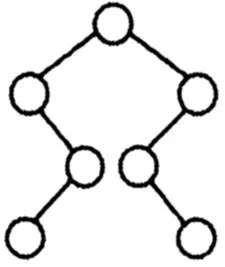
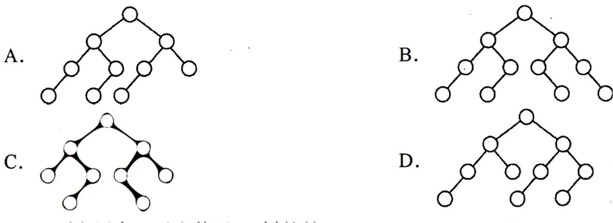
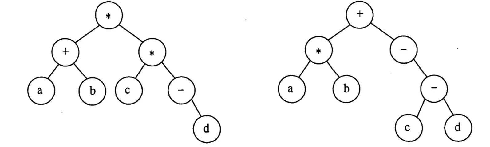
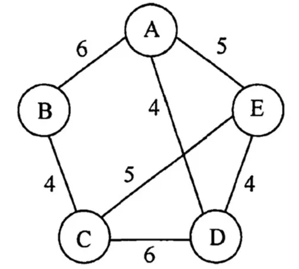
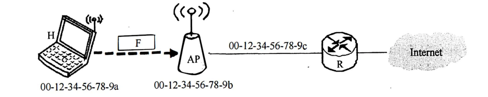
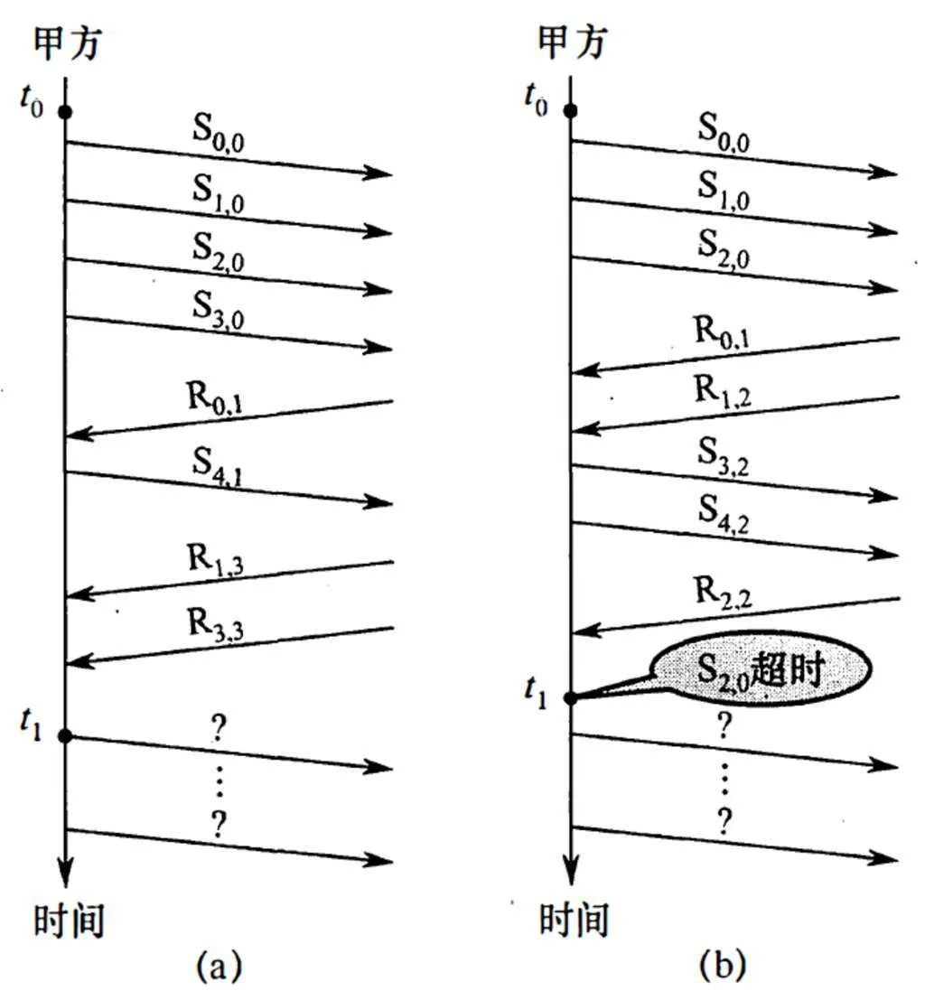

# 2017 年 408 真题 · 答案与解析

> 刷完 [[题面]] 后用此页对答案、看解析。
> 顺序：数据结构（1–11, 41–42）→ 组成原理（12–22, 43–44）→ 操作系统（23–32, 45–46）→ 计算机网络（33–40, 47）

## 一、选择题答案速查表（40 题，每题 2 分，共 80 分）

| 题号 | 1 | 2 | 3 | 4 | 5 | 6 | 7 | 8 | 9 | 10 |
| 答案 | **B** | **C** | **A** | **B** | **B** | **D** | **B** | **A** | **B** | **B** |
| 科目 | 数结 | 数结 | 数结 | 数结 | 数结 | 数结 | 数结 | 数结 | 数结 | 数结 |

| 题号 | 11 | 12 | 13 | 14 | 15 | 16 | 17 | 18 | 19 | 20 |
| 答案 | **D** | **C** | **C** | **A** | **D** | **A** | **C** | **B** | **A** | **D** |
| 科目 | 数结 | 组原 | 组原 | 组原 | 组原 | 组原 | 组原 | 组原 | 组原 | 组原 |

| 题号 | 21 | 22 | 23 | 24 | 25 | 26 | 27 | 28 | 29 | 30 |
| 答案 | **D** | **B** | **D** | **C** | **B** | **D** | **B** | **D** | **B** | **D** |
| 科目 | 组原 | 组原 | 操作 | 操作 | 操作 | 操作 | 操作 | 操作 | 操作 | 操作 |

| 题号 | 31 | 32 | 33 | 34 | 35 | 36 | 37 | 38 | 39 | 40 |
| 答案 | **B** | **B** | **A** | **D** | **B** | **A** | **D** | **C** | **A** | **C** |
| 科目 | 操作 | 操作 | 计网 | 计网 | 计网 | 计网 | 计网 | 计网 | 计网 | 计网 |

> 科目缩写：数结 = 数据结构 | 组原 = 计算机组成原理 | 操作 = 操作系统 | 计网 = 计算机网络

## 二、综合题答案要点速查表（7 题，共 70 分）

| 题号 | 分值 | 科目 | 考点 | 关键结论 |
|------|------|------|------|----------|
| 41 | 15 | 数据结构 | 树与二叉树 | 答案：1、基本思想：对表达式树进行中序遍历，访问分支结点（操作符）时先输出左括号，再递归遍历左子树，输出操作符，再递归遍历右子树，最后输出右括号；叶结点（操作数... |
| 42 | 8 | 数据结构 | 图 | 答案：1、从 A 出发依次选出 (A,D)、(D,E)、(C,E)、(B,C)，权值分别为 4、4、5、4，MST 总权值为 17 |
| 43 | 13 | 计算机组成原理 | 数据表示与运算 | 答案：1、n=0 时 n−1 按无符号计算为 2³²−1（机器数全 1），条件 i ≤ n−1 恒成立，故死循环；若 i、n 改为 int，n−1 = −1，i... |
| 44 | 10 | 计算机组成原理 | 指令系统 | 答案：1、M 是 CISC |
| 45 | 7 | 操作系统 | 内存管理 | 答案：1、f1 的机器指令代码虚拟地址高 20 位均相同，位于同一页，占 1 页 |
| 46 | 8 | 操作系统 | 进程与线程 | 答案：1、thread1 读 x、y，thread2 读 y、z，thread3 写 y、z |
| 47 | 9 | 计算机网络 | 数据链路层 | 答案：1、3 个数据帧，分别是 S₀,₀、S₁,₀、S₂,₀ |

---

## 三、详细解析

> 以下按题号顺序排列。每题包含题干、选项、答案、解析。
> 图片以相对路径 `images/xxx.webp` 引用，与本文同目录。

### 选择题 · 数据结构

### 1. （2 分 · 绪论）

下列函数的时间复杂度是（ ）。

```c
int func(int n) {
    int i = 0, sum = 0;
    while(sum < n)
        sum += ++i;
    return i;
}
```

- **A.** $O(\log_2 n)$
- **B.** $O(n^{1/2})$
- **C.** $O(n)$
- **D.** $O(n\log_2 n)$

**答案**：B

**解析**：答案 B。sum 每轮累加 1+2+…+k = k(k+1)/2，循环退出时 k(k+1)/2 ≥ n，故 k ≈ √(2n)，循环次数为 O(√n)，即时间复杂度为 O(n^1/2)。

> 难度 ⭐⭐⭐ ｜ 章节 绪论 ｜ 标签 数据结构 / 绪论

---

### 2. （2 分 · 栈、队列与数组）

下列关于栈的叙述中，错误的是( )。

I. 采用非递归方式重写递归程序时必须使用栈

II. 函数调用时，系统要用栈保存必要信息

III. 只要确定了入栈次序，即可确定出栈次序

IV. 栈是一种受限的线性表，允许在其两端进行操作

- **A.** 仅 I
- **B.** 仅 I、II、III
- **C.** 仅 I、III、IV
- **D.** 仅 II、III、IV

**答案**：C

**解析**：答案 C。Ⅰ错：斐波那契数列等递归可用循环迭代实现，不必用栈；Ⅱ对：函数调用需用栈保存返回地址等信息；Ⅲ错：入栈 1、2 既可出栈 2、1 也可出栈 1、2，出栈次序不唯一；Ⅳ错：栈只允许在栈顶一端操作。错误的是Ⅰ、Ⅲ、Ⅳ。

> 难度 ⭐⭐⭐ ｜ 章节 栈、队列与数组 ｜ 标签 数据结构 / 栈 / 队列 / 数组

---

### 3. （2 分 · 栈、队列与数组）

适用于压缩存储稀疏矩阵的两种存储结构是( )。

- **A.** 三元组表和十字链表
- **B.** 三元组表和邻接矩阵
- **C.** 十字链表和二叉链表
- **D.** 邻接矩阵和十字链表

**答案**：A

**解析**：答案 A。三元组表只存非零元的行、列、值，十字链表将行链表和列链表结合，均适合稀疏矩阵的压缩存储。邻接矩阵空间复杂度为 O(n²)，二叉链表用于表示树或森林。

> 难度 ⭐⭐ ｜ 章节 栈、队列与数组 ｜ 标签 数据结构 / 栈 / 队列 / 数组 / 特殊矩阵

---

### 4. （2 分 · 树与二叉树）

要使一棵非空二叉树的先序序列与中序序列相同，其所有非叶节点须满足的条件是( )。

- **A.** 只有左子树
- **B.** 只有右子树
- **C.** 结点的度均为 1
- **D.** 结点的度均为 2

**答案**：B

**解析**：答案 B。先序是根左右，中序是左根右。若所有非叶结点只有右子树，则两个序列都是先父结点后右子树递归进行，故完全相同。

> 难度 ⭐⭐ ｜ 章节 树与二叉树 ｜ 标签 数据结构 / 树 / 二叉树 / 二叉树遍历

---

### 5. （2 分 · 树与二叉树）

已知一棵二叉树的树形如下图所示，其后序序列为 `e, a, c, b, d, g, f`，树中与结点 a 同层的结点是（ ）。



- **A.** c
- **B.** d
- **C.** f
- **D.** g

**答案**：B

**解析**：答案 B。后序末位 f 为根，左子树 e、a、c 的根为 c，其右孩子为 a（e 是 a 的左孩子）；右子树 b、d、g 的根为 g，其左孩子为 d（b 是 d 的右孩子）。故 a 与 d 同层。

> 难度 ⭐⭐⭐ ｜ 章节 树与二叉树 ｜ 标签 数据结构 / 树 / 二叉树 / 二叉树遍历

---

### 6. （2 分 · 树与二叉树）

已知字符集 `{a, b, c, d, e, f, g, h}`，若各字符的哈夫曼编码依次是

`0100, 10, 0000, 0101, 001, 011, 11, 0001`

则编码序列 `0100011001001011110101` 的译码结果是( )。

- **A.** `a c g a b f h`
- **B.** `a d b a g b b`
- **C.** `a f b e a g d`
- **D.** `a f e e f g d`

**答案**：D

**解析**：答案 D。哈夫曼编码是前缀编码，逐位匹配切分：0100|011|001|001|011|11|0101，分别对应 a、f、e、e、f、g、d。

> 难度 ⭐⭐⭐ ｜ 章节 树与二叉树 ｜ 标签 数据结构 / 树 / 二叉树 / 二叉树遍历 / 哈夫曼树 / 物理层

---

### 7. （2 分 · 图）

已知无向图 G 含有 16 条边，其中度为 4 的顶点个数为 3，度为 3 的顶点个数为 4，其他顶点的度均小于 3。图 G 所含的顶点个数至少是( )。

- **A.** 10
- **B.** 11
- **C.** 13
- **D.** 15

**答案**：B

**解析**：答案 B。握手定理：总度数 = 2×16 = 32。已知顶点贡献 3×4+4×3 = 24，余 8 度由其他顶点分担，其度均小于 3，最多各 2 度，至少需 8/2 = 4 个，故顶点数至少为 3+4+4 = 11。

> 难度 ⭐⭐⭐ ｜ 章节 图 ｜ 标签 数据结构 / 图 / 最短路径 / 最小生成树

---

### 8. （2 分 · 查找）

下列二叉树中，可能成为折半查找判定树（不含外部结点）的是（ ）。

A 选项的二叉树（共 10 个节点）：



B 选项的二叉树（共 11 个节点）：

C 选项的二叉树（共 9 个节点）：

D 选项的二叉树（共 10 个节点）：

- **A.** 如上图 A
- **B.** 如上图 B
- **C.** 如上图 C
- **D.** 如上图 D

**答案**：A

**解析**：答案 A。折半查找判定树须满足：中序遍历为有序序列，各子树结点数差不超过 1，且全树 mid 的向上/向下取整策略一致。A 完全符合；B、C、D 均存在左右子树取整策略不一致的情况。

> 难度 ⭐⭐⭐⭐ ｜ 章节 查找 ｜ 标签 数据结构 / 查找 / 散列表 / B树 / 二叉树遍历 / 查找算法

---

### 9. （2 分 · 查找）

下列应用中，适合使用 B+ 树的是( )。

- **A.** 编译器中的词法分析
- **B.** 关系数据库系统中的索引
- **C.** 网络中的路由表快速查找
- **D.** 操作系统的磁盘空闲块管理

**答案**：B

**解析**：答案 B。B+ 树是 B 树的变形，磁盘读写代价低、查询效率稳定，最适合数据库索引。词法分析用有穷自动机，路由表查找用专门算法，磁盘空闲块用空闲链表或位图管理。

> 难度 ⭐⭐ ｜ 章节 查找 ｜ 标签 数据结构 / 查找 / 散列表 / B树

---

### 10. （2 分 · 排序）

在内部排序时，若选择了归并排序而没有选择插入排序，则可能的理由是( )。

① 归并排序的程序代码更短

② 归并排序的占用空间更少

③ 归并排序的运行效率更高

- **A.** 仅 ②
- **B.** 仅 ③
- **C.** 仅 ①、②
- **D.** 仅 ①、③

**答案**：B

**解析**：答案 B。归并排序代码比插入排序复杂，且需 O(n) 辅助空间，但其时间复杂度 O(n log n) 优于插入排序的 O(n²)，故只有③成立。

> 难度 ⭐⭐ ｜ 章节 排序 ｜ 标签 数据结构 / 排序 / 内部排序 / 外部排序 / 排序算法

---

### 11. （2 分 · 排序）

下列排序方法中，若将顺序存储更换为链式存储，则算法的时间效率会降低的是( )。

① 插入排序　② 选择排序　③ 冒泡排序　④ 希尔排序　⑤ 堆排序

- **A.** 仅 ①、②
- **B.** 仅 ②、③
- **C.** 仅 ③、④
- **D.** 仅 ④、⑤

**答案**：D

**解析**：答案 D。插入、选择、冒泡排序只依赖顺序访问，改链式存储后时间复杂度不变；希尔排序需按下标跨步访问、堆排序需按下标定位父子结点，都依赖顺序存储的随机访问特性，改链式后时间复杂度会提高。

> 难度 ⭐⭐⭐ ｜ 章节 排序 ｜ 标签 数据结构 / 排序 / 内部排序 / 外部排序 / 排序算法

---

### 综合题 · 数据结构

### 41. （15 分 · 树与二叉树）

请设计一个算法，将给定的表达式树（二叉树）转换为等价的中缀表达式（通过括号反映操作符的计算次序）并输出。例如，下列两棵表达式树作为算法输入时，输出的中缀表达式分别为 `(a+b)*(c*(-d))` 和 `(a*b)+(-(c-d))`。

表达式树 1（中缀：`(a+b)*(c*(-d))`）：



表达式树 2（中缀：`(a*b)+(-(c-d))`）：

二叉树结点的定义如下：

```c
typedef struct node {
    char data[10];   // 存储操作数或操作符
    struct node *left, *right;
} BTree;
```

要求：

(1) 给出算法的基本设计思想。

(2) 根据设计思想，采用 C 或 C++ 语言描述算法，关键之处给出注释。

**答案 / 解析**：

答案：1、基本思想：对表达式树进行中序遍历，访问分支结点（操作符）时先输出左括号，再递归遍历左子树，输出操作符，再递归遍历右子树，最后输出右括号；叶结点（操作数）直接输出；根结点不加括号。
2、时间复杂度 O(n)，空间复杂度 O(n)（递归栈深度）。核心代码：
```c
void BtreeToE(BTree *root, int depth) {   // 调用：BtreeToE(root, 1)
    if (root == NULL) return;
    if (root->left == NULL && root->right == NULL)
        printf("%s", root->data);         // 操作数直接输出
    else {
        if (depth > 1) printf("(");       // 非根结点输出左括号
        BtreeToE(root->left, depth + 1);
        printf("%s", root->data);         // 输出操作符
        BtreeToE(root->right, depth + 1);
        if (depth > 1) printf(")");       // 非根结点输出右括号
    }
}
```

> 难度 ⭐⭐⭐⭐ ｜ 章节 树与二叉树 ｜ 标签 数据结构 / 树 / 二叉树 / 二叉树遍历

---

### 42. （8 分 · 图）

使用 Prim（普里姆）算法求带权连通图的最小（代价）生成树（MST）。请回答下列问题：

(1) 对下列图 G，从顶点 A 开始求 G 的 MST，依次给出按算法选出的边。



(2) 图 G 的 MST 是唯一的吗？

(3) 对任意的带权连通图，满足什么条件时，其 MST 是唯一的？

**答案 / 解析**：

答案：1、从 A 出发依次选出 (A,D)、(D,E)、(C,E)、(B,C)，权值分别为 4、4、5、4，MST 总权值为 17。2、是唯一的。权值最小的三条边 (A,D)、(D,E)、(B,C) 互不构成环，必须全部选入；剩余候选 (A,E)、(C,E) 中 (A,E) 会构成环，只能选 (C,E)，故 MST 唯一。3、当带权连通图的任意一个环中所含边的权值均不相同时，其 MST 唯一（充分条件；所有边权值互不相同也满足）。

> 难度 ⭐⭐⭐ ｜ 章节 图 ｜ 标签 数据结构 / 图 / 最短路径 / 最小生成树 / 数据链路层

---

### 选择题 · 计算机组成原理

### 12. （2 分 · 计算机系统概述）

假定计算机 M1 和 M2 具有相同的指令集体系结构（ISA），主频分别为 1.5GHz 和 1.2GHz。在 M1 和 M2 上运行某基准程序 P，平均 CPI 分别为 2 和 1，则程序 P 在 M1 和 M2 上运行时间的比值是（ ）。

- **A.** 0.4
- **B.** 0.625
- **C.** 1.6
- **D.** 2.5

**答案**：C

**解析**：答案 C。运行时间 = 指令数×CPI÷主频。两机指令数相同，T1/T2 = (2/1.5)÷(1/1.2) = 1.6。

> 难度 ⭐⭐ ｜ 章节 计算机系统概述 ｜ 标签 计算机组成原理 / 计算机系统概述 / 性能指标

---

### 13. （2 分 · 存储器层次结构）

某计算机主存按字节编址，由 4 个 64M×8 位的 DRAM 芯片采用交叉编址方式构成，并与宽度为 32 位的存储器总线相连，主存每次最多读写 32 位数据。若 double 型变量 x 的主存地址为 804001AH，则读取 x 需要的存储周期数是（ ）。

- **A.** 1
- **B.** 2
- **C.** 3
- **D.** 4

**答案**：C

**解析**：答案 C。4 个 DRAM 芯片交叉编址，末 2 位地址为体号。double 占 8 字节，从 804001AH 起跨越 3 个 32 位字，一个存储周期读一个字，故需 3 个周期。

> 难度 ⭐⭐⭐⭐ ｜ 章节 存储器层次结构 ｜ 标签 计算机组成原理 / 存储器层次结构

---

### 14. （2 分 · 存储器层次结构）

某 C 语言程序段如下：

```c
for (i = 0; i <= 9; i++) {
    temp = 1;
    for (j = 0; j <= i; j++) {
        temp *= a[j];
    }
    sum += temp;
}
```

下列关于数组 a 的访问局部性的描述中，正确的是（ ）。

- **A.** 时间局部性和空间局部性皆有
- **B.** 无时间局部性，有空间局部性
- **C.** 有时间局部性，无空间局部性
- **D.** 时间局部性和空间局部性皆无

**答案**：A

**解析**：答案 A。内层循环按 j 递增顺序访问 a[j]，地址连续，有空间局部性；外层循环重复访问 a[0]～a[i]，同一元素短期内多次被访问，有时间局部性。

> 难度 ⭐⭐⭐ ｜ 章节 存储器层次结构 ｜ 标签 计算机组成原理 / 存储器层次结构

---

### 15. （2 分 · 指令系统）

下列寻址方式中，最适合按下标顺序访问一维数组元素的是（ ）。

- **A.** 相对寻址
- **B.** 寄存器寻址
- **C.** 直接寻址
- **D.** 变址寻址

**答案**：D

**解析**：答案 D。变址寻址中有效地址 EA = 变址寄存器内容 + 形式地址，指令给出数组首地址，变址寄存器随下标递增，最适合按下标顺序访问一维数组元素。

> 难度 ⭐ ｜ 章节 指令系统 ｜ 标签 计算机组成原理 / 指令系统 / 寻址方式 / CISC / RISC

---

### 16. （2 分 · 指令系统）

某计算机按字节编址，指令字长固定且只有两种指令格式，其中三地址指令 29 条，二地址指令 107 条，每个地址字段为 6 位，则指令字长至少应该是（ ）。

- **A.** 24 位
- **B.** 26 位
- **C.** 28 位
- **D.** 32 位

**答案**：A

**解析**：答案 A。29 条三地址指令需 5 位操作码，余 32−29 = 3 种作扩展前缀；二地址再增 6 位，最多 3×2⁶ = 192 条 ≥ 107。字长 = 5+18 = 23 位，按字节编址须为 8 的倍数，故至少 24 位。

> 难度 ⭐⭐⭐⭐ ｜ 章节 指令系统 ｜ 标签 计算机组成原理 / 指令系统 / 寻址方式 / CISC / RISC

---

### 17. （2 分 · 中央处理器）

下列关于超标量流水线特性的叙述中，正确的是（ ）。

Ⅰ. 能缩短流水线功能段的处理时间
Ⅱ. 能在一个时钟周期内同时发射多条指令
Ⅲ. 能结合动态调度技术提高指令执行并行性

- **A.** 仅Ⅱ
- **B.** 仅Ⅰ、Ⅲ
- **C.** 仅Ⅱ、Ⅲ
- **D.** Ⅰ、Ⅱ和Ⅲ

**答案**：C

**解析**：答案 C。超标量流水线在 CPU 内设多条流水线，每个时钟周期可发射多条指令（Ⅱ对），可结合动态调度提高并行性（Ⅲ对）；但不能缩短功能段处理时间（Ⅰ错）。

> 难度 ⭐⭐⭐ ｜ 章节 中央处理器 ｜ 标签 计算机组成原理 / CPU / 数据通路 / 指令流水线 / 性能指标 / 进程调度

---

### 18. （2 分 · 中央处理器）

下列关于主存储器（MM）和控制存储器（CS）的叙述中，错误的是（ ）。

- **A.** MM 在 CPU 外，CS 在 CPU 内
- **B.** MM 按地址访问，CS 按内容访问
- **C.** MM 存储指令和数据，CS 存储微指令
- **D.** MM 用 RAM 和 ROM 实现，CS 用 ROM 实现

**答案**：B

**解析**：答案 B。CS 与 MM 一样也是按地址（微地址）访问，并非按内容访问，B 错。MM 在 CPU 外、存指令和数据、用 RAM 和 ROM 实现，CS 在 CPU 内、存微指令、用 ROM 实现，均正确。

> 难度 ⭐⭐⭐ ｜ 章节 中央处理器 ｜ 标签 计算机组成原理 / CPU / 数据通路 / 指令流水线 / CPU设计

---

### 19. （2 分 · 中央处理器）

下列关于指令流水线数据通路的叙述中，错误的是（ ）。

- **A.** 包含生成控制信号的控制部件
- **B.** 包含算术逻辑运算部件（ALU）
- **C.** 包含通用寄存器组和取指部件
- **D.** 由组合逻辑电路和时序逻辑电路组合而成

**答案**：A

**解析**：答案 A。数据通路是数据传送路径，含 PC、ALU、通用寄存器组、取指部件等，由组合与时序电路构成；控制部件生成控制信号，与数据通路并列，不属于数据通路。

> 难度 ⭐⭐⭐ ｜ 章节 中央处理器 ｜ 标签 计算机组成原理 / CPU / 数据通路 / 指令流水线 / CPU设计

---

### 20. （2 分 · 总线）

下列关于多总线结构的叙述中，错误的是（ ）。

- **A.** 靠近 CPU 的总线速度较快
- **B.** 存储器总线可支持突发传送方式
- **C.** 总线之间须通过桥接器相连
- **D.** PCI-Express×16 采用并行传输方式

**答案**：D

**解析**：答案 D。多总线结构中靠近 CPU 的总线较快，存储器总线可支持突发传送，总线之间经桥接器相连。PCI-Express 采用串行传输，×16 表示 16 条串行通道而非 16 位并行，故 D 错。

> 难度 ⭐⭐⭐ ｜ 章节 总线 ｜ 标签 计算机组成原理 / 总线 / 系统总线 / I/O接口

---

### 21. （2 分 · 输入输出系统）

I/O 指令实现的数据传送通常发生在（ ）。

- **A.** I/O 设备和 I/O 端口之间
- **B.** 通用寄存器和 I/O 设备之间
- **C.** I/O 端口和 I/O 端口之间
- **D.** 通用寄存器和 I/O 端口之间

**答案**：D

**解析**：答案 D。I/O 端口是 CPU 与设备间的交接面。执行 I/O 指令时，CPU 经地址总线选择端口，经数据总线在通用寄存器与 I/O 端口之间传送数据。

> 难度 ⭐⭐ ｜ 章节 输入输出系统 ｜ 标签 计算机组成原理 / I/O系统 / 中断 / DMA

---

### 22. （2 分 · 输入输出系统）

下列关于多重中断系统的叙述中，错误的是（ ）。

- **A.** 在一条指令执行结束时响应中断
- **B.** 中断处理期间 CPU 处于关中断状态
- **C.** 中断请求的产生与当前指令的执行无关
- **D.** CPU 通过采样中断请求信号检测中断请求

**答案**：B

**解析**：答案 B。多重中断系统在保护现场时关中断，进入中断处理程序后要开中断以便响应更高级中断，并非整个处理期间都关中断。其余叙述均正确。

> 难度 ⭐⭐⭐ ｜ 章节 输入输出系统 ｜ 标签 计算机组成原理 / I/O系统 / 中断 / DMA / I/O方式

---

### 综合题 · 计算机组成原理

### 43. （13 分 · 数据表示与运算）

已知 $f(n) = \sum_{i=0}^{n} 2^i = 2^{n+1} - 1 = \underbrace{11\cdots1}_{n+1 \text{ 个 } 1}\text{B}$，计算 $f(n)$ 的 C 语言函数 f1 如下：

```c
int f1(unsigned n) {
    int sum = 1, power = 1;
    for (unsigned i = 0; i <= n - 1; i++) {
        power *= 2;
        sum += power;
    }
    return sum;
}
```

将 f1 中的 int 都改为 float，可得到计算 f(n) 的另一个函数 f2。假设 unsigned 和 int 型数据都占 32 位，float 采用 IEEE754 单精度标准。请回答下列问题。

(1) 当 n=0 时，f1 会出现死循环，为什么？若将 f1 中的变量 i 和 n 都定义为 int 型，则 f1 是否还会出现死循环？为什么？

(2) f1(23) 和 f2(23) 的返回值是否相等？机器数各是什么（用十六进制表示）？

(3) f1(24) 和 f2(24) 的返回值分别为 33554431 和 33554432.0，为什么不相等？

(4) $f(31) = 2^{32}-1$，而 f1(31) 的返回值却为 -1，为什么？若使 f1(n) 的返回值与 f(n) 相等，则最大的 n 是多少？

(5) f2(127) 的机器数为 7F80 0000H，对应的值是什么？若使 f2(n) 的结果不溢出，则最大的 n 是多少？若使 f2(n) 的结果精确（无舍入），则最大的 n 是多少？

**答案 / 解析**：

答案：1、n=0 时 n−1 按无符号计算为 2³²−1（机器数全 1），条件 i ≤ n−1 恒成立，故死循环；若 i、n 改为 int，n−1 = −1，i=0 时不满足条件，不会死循环。2、相等。f(23) = 2²⁴−1 = 16777215，int 可精确表示，float 有 24 位有效位也精确。f1(23) 的机器数为 00FF FFFFH，f2(23) 的机器数为 4B7F FFFFH。3、f(24) = 2²⁵−1 有 25 个 1，int 精确表示；float 只有 24 位有效位，舍入后数值增大为 2²⁵，故 f2(24) 比 f1(24) 大 1。4、f(31) = 2³²−1 超出 int 表示范围，溢出后机器数为 32 个 1，按补码解释为 −1。int 最大表示 2³¹−1，故最大 n = 30。5、7F80 0000H 阶码全 1、尾数全 0，表示 +∞。n=126 时阶码为 254，是单精度最大正常阶码，故不溢出的最大 n = 126；float 有 24 位有效位，n=23 时 f(23) 恰好为 24 个 1 不需舍入，故结果精确的最大 n = 23。

> 难度 ⭐⭐⭐⭐ ｜ 章节 数据表示与运算 ｜ 标签 计算机组成原理 / 数据表示 / 运算 / 文件系统

---

### 44. （10 分 · 指令系统）

在按字节编址的计算机 M 上，题 43 中 f1 的部分源程序（阴影部分）与对应的机器级代码（包括指令的虚拟地址）如下图所示。

```
int f1(unsigned n)
1   00401020 55         push ebp
...      ...        ...
    for (unsigned i = 0; i <= n-1; i++) {
...      ...        ...
20  0040105E 39 4D F4   cmp dword ptr [ebp-0Ch],ecx
...      ...        ...
        power *= 2;
...      ...        ...
23  00401066 D1 E2      shl edx,1
...      ...        ...
    return sum;
...      ...        ...
35  0040107F C3         ret
```

其中，机器级代码行包括行号、虚拟地址、机器指令和汇编指令。

请回答下列问题。

(1) 计算机 M 是 RISC 还是 CISC？为什么？

(2) f1 的机器指令代码共占多少字节？要求给出计算过程。

(3) 第 20 条指令 cmp 通过 i 减 n-1 实现对 i 和 n-1 的比较。执行 f1(0) 过程中，当 i=0 时，cmp 指令执行后，进/借位标志 CF 的内容是什么？要求给出计算过程。

(4) 第 23 条指令 shl 通过左移操作实现了 power*2 运算，在 f2 中能否也用 shl 指令实现 power*2？为什么？

**答案 / 解析**：

答案：1、M 是 CISC。指令长度不固定（push 1 字节、cmp 3 字节、shl 2 字节），不符合 RISC 指令定长的特点。2、f1 机器代码长度为 0040 107FH − 0040 1020H + 1 = 60H = 96 字节。3、f1(0) 时 n−1 = FFFF FFFFH，cmp 执行 0 − FFFF FFFFH，即 0000 0000H + 0000 0001H（取补加 1），进位输出 C=0，减法借位标志 CF = C⊕1 = 1。4、不能。shl 将机器数整体左移实现乘 2，只对整数有效；float 的机器数含阶码与尾数，整体左移并不能实现乘 2，浮点数乘 2 应使阶码加 1。

> 难度 ⭐⭐⭐⭐ ｜ 章节 指令系统 ｜ 标签 计算机组成原理 / 指令系统 / 寻址方式 / CISC / RISC / 指令集架构

---

### 选择题 · 操作系统

### 23. （2 分 · 进程与线程）

假设 4 个作业到达系统的时刻和运行时间如下表所示。

| 作业 | 达到时刻 t | 运行时间 |
| --- | --- | --- |
| J1 | 0 | 3 |
| J2 | 1 | 3 |
| J3 | 1 | 2 |
| J4 | 3 | 1 |

系统在 t=2 时开始作业调度。若分别采用先来先服务和短作业优先调度算法，则选中的作业分别是（ ）。

- **A.** J2、J3
- **B.** J1、J4
- **C.** J2、J4
- **D.** J1、J3

**答案**：D

**解析**：答案 D。t=2 时 J4 尚未到达，就绪队列为 J1、J2、J3。先来先服务选最早到达的 J1；短作业优先选运行时间最短的 J3。

> 难度 ⭐⭐⭐ ｜ 章节 进程与线程 ｜ 标签 操作系统 / 进程管理 / 进程 / 线程 / 同步 / PV操作 / 进程调度

---

### 24. （2 分 · 计算机系统概述）

执行系统调用的过程包括如下主要操作：

① 返回用户态
② 执行陷入（trap）指令
③ 传递系统调用参数
④ 执行相应的服务程序

正确的执行顺序是（ ）。

- **A.** ②→③→①→④
- **B.** ②→④→③→①
- **C.** ③→②→④→①
- **D.** ③→④→②→①

**答案**：C

**解析**：答案 C。先由用户态传递系统调用参数，再执行陷入指令切换至内核态，然后执行相应服务程序，最后返回用户态，顺序为③→②→④→①。

> 难度 ⭐⭐ ｜ 章节 计算机系统概述 ｜ 标签 操作系统 / 计算机系统概述

---

### 25. （2 分 · 内存管理）

某计算机按字节编址，其动态分区内存管理采用最佳适应算法，每次分配和回收内存后都对空闲分区链重新排序。当前空闲分区信息如下表所示。

| 分区起始地址 | 20K | 500K | 1000K | 200K |
| --- | --- | --- | --- | --- |
| 分区大小 | 40KB | 80KB | 100KB | 200KB |

回收起始地址为 60K、大小为 140KB 的分区后，系统中空闲分区的数量、空闲分区链第一个分区的起始地址和大小分别是（ ）。

- **A.** 3、20K、380KB
- **B.** 3、500K、80KB
- **C.** 4、20K、180KB
- **D.** 4、500K、80KB

**答案**：B

**解析**：答案 B。回收 60K、140KB 分区后与 20K、40KB 和 200K、200KB 相邻分区合并为 20K、380KB，空闲分区剩 3 个。最佳适应按大小升序排序，链表第一块为 500K、80KB。

> 难度 ⭐⭐⭐⭐ ｜ 章节 内存管理 ｜ 标签 操作系统 / 内存管理 / 分页 / 分段 / 虚拟内存 / 页面置换

---

### 26. （2 分 · 文件管理）

某文件系统的簇和磁盘扇区大小分别为 1KB 和 512B。若一个文件的大小为 1026B，则系统分配给该文件的磁盘空间大小是（ ）。

- **A.** 1026B
- **B.** 1536B
- **C.** 1538B
- **D.** 2048B

**答案**：D

**解析**：答案 D。文件以簇为最小分配单位，1026B 需占 2 簇，实际分配 2×1024 = 2048B。扇区大小只决定读写粒度，不影响分配量。

> 难度 ⭐⭐ ｜ 章节 文件管理 ｜ 标签 操作系统 / 文件系统 / 文件 / 目录 / 磁盘

---

### 27. （2 分 · 进程与线程）

下列有关基于时间片的进程调度的叙述中，错误的是（ ）。

- **A.** 时间片越短，进程切换的次数越多，系统开销也越大
- **B.** 当前进程的时间片用完后，该进程状态由执行态变为阻塞态
- **C.** 时钟中断发生后，系统会修改当前进程在时间片内的剩余时间
- **D.** 影响时间片大小的主要因素包括响应时间、系统开销和进程数量等

**答案**：B

**解析**：答案 B。时间片用完只是被剥夺 CPU，进程未等待任何事件，应进入就绪态而非阻塞态。其余叙述均正确。

> 难度 ⭐⭐ ｜ 章节 进程与线程 ｜ 标签 操作系统 / 进程管理 / 进程 / 线程 / 同步 / PV操作 / 进程调度

---

### 28. （2 分 · 计算机系统概述）

与单道程序系统相比，多道程序系统的优点是（ ）。

Ⅰ. CPU 利用率高
Ⅱ. 系统开销小
Ⅲ. 系统吞吐量大
Ⅳ. I/O 设备利用率高

- **A.** 仅Ⅰ、Ⅲ
- **B.** 仅Ⅰ、Ⅳ
- **C.** 仅Ⅱ、Ⅲ
- **D.** 仅Ⅰ、Ⅲ、Ⅳ

**答案**：D

**解析**：答案 D。多道程序使 CPU 与 I/O 并行工作，提高 CPU 利用率、系统吞吐量和 I/O 设备利用率（Ⅰ、Ⅲ、Ⅳ对）；但调度与切换需付出额外系统开销，Ⅱ错。

> 难度 ⭐⭐ ｜ 章节 计算机系统概述 ｜ 标签 操作系统 / 计算机系统概述

---

### 29. （2 分 · 文件管理）

下列选项中，磁盘逻辑格式化程序所做的工作是（ ）。

Ⅰ. 对磁盘进行分区
Ⅱ. 建立文件系统的根目录
Ⅲ. 确定磁盘扇区校验码所占位数
Ⅳ. 对保存空闲磁盘块信息的数据结构进行初始化

- **A.** 仅Ⅱ
- **B.** 仅Ⅱ、Ⅳ
- **C.** 仅Ⅲ、Ⅳ
- **D.** 仅Ⅰ、Ⅱ、Ⅳ

**答案**：B

**解析**：答案 B。逻辑格式化在分区上建立文件系统，包括创建根目录（Ⅱ）和初始化空闲块管理结构（Ⅳ）。分区是独立步骤，确定扇区校验码位数属于物理格式化。

> 难度 ⭐⭐⭐ ｜ 章节 文件管理 ｜ 标签 操作系统 / 文件系统 / 文件 / 目录 / 磁盘

---

### 30. （2 分 · 文件管理）

某文件系统中，针对每个文件，用户类别分为 4 类：安全管理员、文件主、文件主的伙伴、其他用户；访问权限分为 5 种：完全控制、执行、修改、读取、写入。若文件控制块中用二进制位串表示文件权限，为表示不同类别用户对一个文件的访问权限，则描述文件权限的位数至少应为（ ）。

- **A.** 5
- **B.** 9
- **C.** 12
- **D.** 20

**答案**：D

**解析**：答案 D。4 类用户 × 5 种权限，每类用户用 5 位表示各种权限的有无，共需 4×5 = 20 位。

> 难度 ⭐⭐ ｜ 章节 文件管理 ｜ 标签 操作系统 / 文件系统 / 文件 / 目录 / 磁盘

---

### 31. （2 分 · 文件管理）

若文件 f1 的硬链接为 f2，两个进程分别打开 f1 和 f2，获得对应的文件描述符为 fd1 和 fd2，则下列叙述中，正确的是（ ）。

Ⅰ. f1 和 f2 的读写指针位置保持相同

Ⅱ. f1 和 f2 共享同一个内存索引结点

Ⅲ. fd1 和 fd2 分别指向各自的用户打开文件表中的一项

- **A.** 仅Ⅲ
- **B.** 仅Ⅱ、Ⅲ
- **C.** 仅Ⅰ、Ⅱ
- **D.** Ⅰ、Ⅱ和Ⅲ

**答案**：B

**解析**：答案 B。硬链接使 f1、f2 共享同一 inode，内存中也共享同一索引结点（Ⅱ对）；两进程各自打开文件，fd1、fd2 指向各自的用户打开文件表项（Ⅲ对）；但系统打开文件表项独立，读写指针互不影响（Ⅰ错）。

> 难度 ⭐⭐⭐ ｜ 章节 文件管理 ｜ 标签 操作系统 / 文件系统 / 文件 / 目录 / 磁盘

---

### 32. （2 分 · 输入输出管理）

系统将数据从磁盘读到内存的过程包括以下操作：

① DMA 控制器发出中断请求

② 初始化 DMA 控制器并启动磁盘

③ 从磁盘传输一块数据到内存缓冲区

④ 执行"DMA 结束"中断服务程序

正确的执行顺序是（ ）。

- **A.** ③→①→②→④
- **B.** ②→③→①→④
- **C.** ②→①→③→④
- **D.** ①→②→④→③

**答案**：B

**解析**：答案 B。DMA 流程：②初始化 DMA 控制器并启动磁盘 → ③从磁盘传一块数据到内存缓冲区 → ①DMA 控制器发中断请求 → ④执行 DMA 结束中断服务程序。

> 难度 ⭐⭐ ｜ 章节 输入输出管理 ｜ 标签 操作系统 / I/O系统 / 中断 / DMA / 缓冲区 / I/O方式 / 磁盘

---

### 综合题 · 操作系统

### 45. （7 分 · 内存管理）

假定题 44 给出的计算机 M 采用二级分页虚拟存储管理方式，虚拟地址格式如下：

| 位段 | 内容 |
| --- | --- |
| 31～22 | 页目录号 |
| 21～12 | 页表索引 |
| 11～0 | 页内偏移 |

请针对题 43 的函数 `f1` 和题 44 中的机器指令代码，回答下列问题：

(1) 函数 `f1` 的机器指令代码占多少页？

(2) 取第 1 条指令（`push ebp`）时，若在进行地址变换的过程中需要访问内存中的页目录和页表，则会分别访问它们各自的第几个表项（编号从 0 开始）？

(3) M 的 I/O 采用中断控制方式。若进程 P 在调用 `f1` 之前通过 `scanf()` 获取 n 的值，则在执行 `scanf()` 的过程中，进程 P 的状态会如何变化？CPU 是否会进入内核态？

>

**答案 / 解析**：

答案：1、f1 的机器指令代码虚拟地址高 20 位均相同，位于同一页，占 1 页。2、push ebp 的虚拟地址 0040 1020H 的页目录号为 0000000001，页表索引为 0000000001，故分别访问页目录的第 1 个表项和对应页表的第 1 个表项。3、执行 scanf() 时进程 P 因等待输入由执行态变为阻塞态；输入结束后被中断处理程序唤醒变为就绪态；被调度程序选中后变为运行态。执行系统调用及中断处理时 CPU 进入内核态。

> 难度 ⭐⭐⭐ ｜ 章节 内存管理 ｜ 标签 操作系统 / 内存管理 / 分页 / 分段 / 虚拟内存 / 页面置换 / 地址转换 / I/O方式 / 磁盘 / 内存分配 / 文件系统

---

### 46. （8 分 · 进程与线程）

某进程中有 3 个并发执行的线程 thread1、thread2、thread3，其伪代码如下：

```c
// 复数的结构类型定义
typedef struct {
    float a;
    float b;
} cnum;

// 全局变量
cnum x, y, z;

// 计算两个复数之和
cnum add(cnum p, cnum q) {
    cnum s;
    s.a = p.a + q.a;
    s.b = p.b + q.b;
    return s;
}

thread1 {
    cnum w;
    w = add(x, y);
    ...
}

thread2 {
    cnum w;
    w = add(y, z);
    ...
}

thread3 {
    cnum w;
    w.a = 1;
    w.b = 2;
    z = add(z, w);
    y = add(y, w);
    ...
}
```

请添加必要的信号量和 P、V（或 wait、signal）操作，要求确保线程互斥访问临界资源，并且最大程度地并发执行。

**答案 / 解析**：

答案：1、thread1 读 x、y，thread2 读 y、z，thread3 写 y、z。互斥关系：thread1 与 thread3 在 y 上读写冲突，thread2 与 thread3 在 y、z 上读写冲突；thread1 与 thread2 同为读 y，可并行。
2、设置信号量 y1（调节 thread1 与 thread3 对 y 的访问）、y2（调节 thread2 与 thread3 对 y 的访问）、z（调节 thread2 与 thread3 对 z 的访问），初值均为 1。核心代码：
```c
semaphore y1 = 1, y2 = 1, z = 1;
thread1() {
    cnum w;
    P(y1);
    w = add(x, y);
    V(y1);
}
thread2() {
    cnum w;
    P(z); P(y2);
    w = add(y, z);
    V(y2); V(z);
}
thread3() {
    cnum w;
    w.a = 1; w.b = 2;
    P(z);
    z = add(z, w);
    V(z);
    P(y1); P(y2);
    y = add(y, w);
    V(y2); V(y1);
}
```

> 难度 ⭐⭐⭐⭐ ｜ 章节 进程与线程 ｜ 标签 操作系统 / 进程管理 / 进程 / 线程 / 同步 / PV操作 / 同步与互斥

---

### 选择题 · 计算机网络

### 33. （2 分 · 计算机网络体系结构）

假设 OSI 参考模型的应用层欲发送 400 B 的数据（无拆分），除物理层和应用层之外，其他各层在封装 PDU 时均引入 20 B 的额外开销，则应用层数据传输效率约为（ ）。

- **A.** 80%
- **B.** 83%
- **C.** 87%
- **D.** 91%

**答案**：A

**解析**：答案 A。中间 5 层各加 20 B 开销共 100 B，总传输 400+100 = 500 B，效率 = 400/500 = 80%。

> 难度 ⭐⭐ ｜ 章节 计算机网络体系结构 ｜ 标签 计算机网络 / 计算机网络体系结构

---

### 34. （2 分 · 物理层）

若信道在无噪声情况下的极限数据传输速率不小于信噪比为 30 dB 条件下的极限数据传输速率，则信号状态数至少是（ ）。

- **A.** 4
- **B.** 8
- **C.** 16
- **D.** 32

**答案**：D

**解析**：答案 D。30 dB 即 S/N = 10³ = 1000，香农极限 C = B·log₂(1+1000) ≈ 10B。由 2B·log₂V ≥ 10B 得 log₂V ≥ 5，V ≥ 2⁵ = 32。

> 难度 ⭐⭐⭐ ｜ 章节 物理层 ｜ 标签 计算机网络 / 物理层 / 编码 / 调制

---

### 35. （2 分 · 数据链路层）

在下图所示的网络中，若主机 H 发送一个封装访问 Internet 的 IP 分组的 IEEE 802.11 数据帧 F，则帧 F 的地址 1、地址 2 和地址 3 分别是（ ）。



- **A.** 00-12-34-56-78-9a, 00-12-34-56-78-9b, 00-12-34-56-78-9c
- **B.** 00-12-34-56-78-9b, 00-12-34-56-78-9a, 00-12-34-56-78-9c
- **C.** 00-12-34-56-78-9b, 00-12-34-56-78-9c, 00-12-34-56-78-9a
- **D.** 00-12-34-56-78-9a, 00-12-34-56-78-9c, 00-12-34-56-78-9b

**答案**：B

**解析**：答案 B。H 经 AP 访问 Internet，帧方向为 STA→DS：地址 1 为接收方（BSSID，即 AP 的 MAC），地址 2 为发送方（H 的 MAC），地址 3 为目的方（路由器 R 接 AP 一侧的 MAC）。

> 难度 ⭐⭐⭐ ｜ 章节 数据链路层 ｜ 标签 计算机网络 / 数据链路层 / MAC / CSMA/CD / PPP / 网络层

---

### 36. （2 分 · 网络层）

下列 IP 地址中，只能作为 IP 分组的源 IP 地址但不能作为目的 IP 地址的是（ ）。

- **A.** 0.0.0.0
- **B.** 127.0.0.1
- **C.** 200.10.10.3
- **D.** 255.255.255.255

**答案**：A

**解析**：答案 A。0.0.0.0 表示本机尚未获得 IP，只能作源地址。127.0.0.1 是回环地址，255.255.255.255 是受限广播地址，200.10.10.3 是普通 C 类地址，均可作目的地址。

> 难度 ⭐⭐⭐ ｜ 章节 网络层 ｜ 标签 计算机网络 / 网络层 / IP / 路由 / 子网划分 / CIDR

---

### 37. （2 分 · 网络层）

直接封装 RIP、OSPF、BGP 报文的协议分别是（ ）。

- **A.** TCP、UDP、IP
- **B.** TCP、IP、UDP
- **C.** UDP、TCP、IP
- **D.** UDP、IP、TCP

**答案**：D

**解析**：答案 D。RIP 用 UDP 报文交换路由信息，OSPF 直接用 IP 分组封装（协议号 89），BGP 用 TCP 连接传送（端口 179）。

> 难度 ⭐⭐ ｜ 章节 网络层 ｜ 标签 计算机网络 / 网络层 / IP / 路由 / 子网划分 / CIDR

---

### 38. （2 分 · 网络层）

若将网络 21.3.0.0/16 划分为 128 个规模相同的子网，则每个子网可分配的最大 IP 地址个数是（ ）。

- **A.** 254
- **B.** 256
- **C.** 510
- **D.** 512

**答案**：C

**解析**：答案 C。/16 划分 128 个子网需借 7 位，子网前缀为 23 位，主机位 9 位，每子网 2⁹ = 512 个地址，去掉网络地址和广播地址，可分配 512−2 = 510 个。

> 难度 ⭐⭐⭐ ｜ 章节 网络层 ｜ 标签 计算机网络 / 网络层 / IP / 路由 / 子网划分 / CIDR

---

### 39. （2 分 · 传输层）

若甲向乙发起一个 TCP 连接，最大段长 MSS = 1 KB，RTT = 5 ms，乙开辟的接收缓存为 64 KB，则甲从连接建立成功至发送窗口达到 32 KB，需经过的时间至少是（ ）。

- **A.** 25 ms
- **B.** 30 ms
- **C.** 160 ms
- **D.** 165 ms

**答案**：A

**解析**：答案 A。发送窗口 = min(拥塞窗口, 接收窗口)，初始 cwnd = 1 KB，慢开始每 RTT 翻倍：1→2→4→8→16→32 KB，需 5 个 RTT，即 5×5 = 25 ms。

> 难度 ⭐⭐⭐ ｜ 章节 传输层 ｜ 标签 计算机网络 / 传输层 / TCP / UDP / 拥塞控制 / Cache / 应用层

---

### 40. （2 分 · 应用层）

下列关于 FTP 协议的叙述中，错误的是（ ）。

- **A.** 数据连接在每次数据传输完毕后就关闭
- **B.** 控制连接在整个会话期间保持打开状态
- **C.** 服务器与客户端的 TCP 20 端口建立数据连接
- **D.** 客户端与服务器的 TCP 21 端口建立控制连接

**答案**：C

**解析**：答案 C。FTP 控制连接整个会话保持，数据连接每次传输后关闭，客户端连服务器 21 端口建立控制连接，均正确。主动模式下数据连接由服务器从自己的 20 端口连客户端临时端口，不是连客户端的 20 端口，C 错。

> 难度 ⭐⭐⭐ ｜ 章节 应用层 ｜ 标签 计算机网络 / 应用层 / HTTP / DNS / FTP / SMTP

---

### 综合题 · 计算机网络

### 47. （9 分 · 数据链路层）

甲乙双方均采用后退 N 帧协议（GBN）进行持续的双向数据传输，且双方始终采用捎带确认，帧长均为 1000B。$S_{x,y}$ 和 $R_{x,y}$ 分别表示甲方和乙方发送的数据帧，其中，$x$ 是发送序号，$y$ 是确认序号（表示希望接收对方的下一帧序号）；数据帧的发送序号和确认序号字段均为 3 比特。信道传输速率为 100Mbps，RTT = 0.96ms。下图给出了甲方发送数据帧和接收数据帧的两种场景，其中 $t_0$ 为初始时刻，此时甲方的发送序号和确认序号均为 0，$t_1$ 时刻甲方有足够多的数据待发送。



请回答下列问题。

（1）对于图（a），$t_0$ 时刻到 $t_1$ 时刻期间，甲方可以断定乙方已正确接收的数据帧数是多少？正确接收的是哪几个帧？（请用 $S_{x,y}$ 形式给出。）

（2）对于图（a），从 $t_1$ 时刻起，甲方在不出现超时且未收到乙方新的数据帧之前，最多还可以发送多少个数据帧？其中第一个帧和最后一个帧分别是哪个？（请用 $S_{x,y}$ 形式给出。）

（3）对于图（b），从 $t_1$ 时刻起，甲方在不出现新的超时且未收到乙方新的数据帧之前，需要重发多少个数据帧？重发的第一个帧是哪个？（请用 $S_{x,y}$ 形式给出。）

（4）甲方可以达到的最大信道利用率是多少？

**答案 / 解析**：

答案：1、3 个数据帧，分别是 S₀,₀、S₁,₀、S₂,₀。乙发送的确认号为 3，表示已正确接收序号 0～2 的帧，希望甲发送序号 3。2、最多还可发送 5 个数据帧。序号 3 位共 8 个，GBN 要求序号数 ≥ 发送窗口+1，窗口最大为 7；t₁ 时 S₃、S₄ 尚未确认，故还可发 7−2 = 5 个，第一个为 S₅,₂，最后一个为 S₁,₂。3、需要重发 3 个数据帧（S₂、S₃、S₄），重发的第一个帧为 S₂,₃。4、Td = 1000×8÷(100×10⁶) = 80 µs，窗口最大 N = 7，捎带确认下 U = N·Td/(RTT+2Td) = 7×80/(960+160) = 50%。

> 难度 ⭐⭐⭐⭐ ｜ 章节 数据链路层 ｜ 标签 计算机网络 / 数据链路层 / MAC / CSMA/CD / PPP


## See Also

- [[题面]] — 仅题干与选项，用于限时刷题
- [[../408历年真题总目录]] — 历年真题总目录
- [[408考情分析]] — 试卷构成与逐年考点统计
