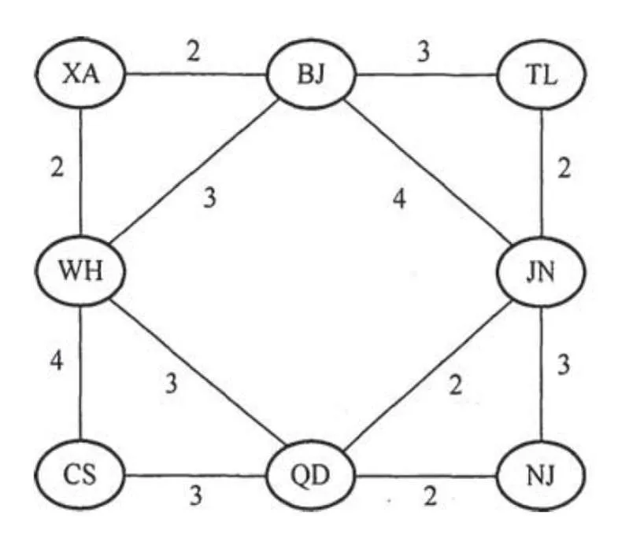
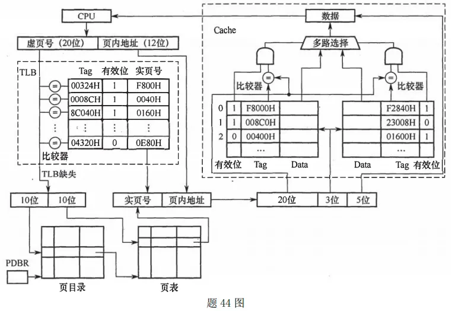
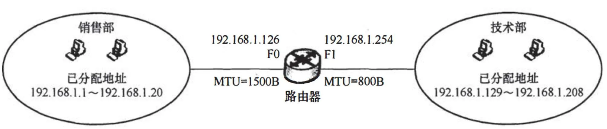

# 2018 年 408 真题 · 答案与解析

> 刷完 [[题面]] 后用此页对答案、看解析。
> 顺序：数据结构（1–11, 41–42）→ 组成原理（12–22, 43–44）→ 操作系统（23–32, 45–46）→ 计算机网络（33–40, 47）

## 一、选择题答案速查表（40 题，每题 2 分，共 80 分）

| 题号 | 1 | 2 | 3 | 4 | 5 | 6 | 7 | 8 | 9 | 10 |
| 答案 | **B** | **C** | **A** | **A** | **A** | **C** | **D** | **B** | **C** | **D** |
| 科目 | 数结 | 数结 | 数结 | 数结 | 数结 | 数结 | 数结 | 数结 | 数结 | 数结 |

| 题号 | 11 | 12 | 13 | 14 | 15 | 16 | 17 | 18 | 19 | 20 |
| 答案 | **A** | **D** | **C** | **A** | **A** | **B** | **C** | **B** | **A** | **D** |
| 科目 | 数结 | 组原 | 组原 | 组原 | 组原 | 组原 | 组原 | 组原 | 组原 | 组原 |

| 题号 | 21 | 22 | 23 | 24 | 25 | 26 | 27 | 28 | 29 | 30 |
| 答案 | **B** | **C** | **C** | **D** | **B** | **A** | **C** | **D** | **D** | **A** |
| 科目 | 组原 | 组原 | 操作 | 操作 | 操作 | 操作 | 操作 | 操作 | 操作 | 操作 |

| 题号 | 31 | 32 | 33 | 34 | 35 | 36 | 37 | 38 | 39 | 40 |
| 答案 | **D** | **C** | **B** | **C** | **D** | **D** | **D** | **C** | **B** | **D** |
| 科目 | 操作 | 操作 | 计网 | 计网 | 计网 | 计网 | 计网 | 计网 | 计网 | 计网 |

> 科目缩写：数结 = 数据结构 | 组原 = 计算机组成原理 | 操作 = 操作系统 | 计网 = 计算机网络

## 二、综合题答案要点速查表（7 题，共 70 分）

| 题号 | 分值 | 科目 | 考点 | 关键结论 |
|------|------|------|------|----------|
| 41 | 13 | 数据结构 | 线性表 | 答案：1、基本设计思想：用空间换时间 |
| 42 | 12 | 数据结构 | 图 | 答案：1、最经济方案即求图的最小生成树，共有两种，总费用均为 16：方案一含边 XA-BJ、XA-WH、TL-JN、QD-JN、QD-NJ、BJ-TL、CS-Q... |
| 43 | 8 | 计算机组成原理 | 输入输出系统 | 答案：1、设备 A 准备 4B（32 位）数据需 4B/2MBps=2μs，故最多间隔 2μs 查询一次；每秒查询 1s/2μs=5×10⁵ 次，每次 10 条... |
| 44 | 15 | 计算机组成原理 | 存储器层次结构 | 答案：1、主存物理地址 28 位（实页号 16 位+页内偏移 12 位，即 Tag 20+组号 3+块内偏移 5） |
| 45 | 8 | 操作系统 | 内存管理 | 答案：1、虚拟地址共 32 位，页目录号、页号各 10 位、页内偏移 12 位，得 6×2²²+6×2¹²+8=01806008H |
| 46 | 7 | 操作系统 | 文件管理 | 答案：1、每簇 4KB、地址项 4B，每簇可存 4096/4=1024 个地址项，最大文件长度=(8+1024+1024²+1024³)×4KB |
| 47 | 7 | 计算机网络 | 网络层 | 答案：1、192.168.1.0/24 均分为两个 /25：销售部为 192.168.1.0/25，广播地址 192.168.1.127；技术部为 192.16... |

---

## 三、详细解析

> 以下按题号顺序排列。每题包含题干、选项、答案、解析。
> 图片以相对路径 `images/xxx.webp` 引用，与本文同目录。

### 选择题 · 数据结构

### 1. （2 分 · 栈、队列与数组）

若栈 S1 中保存整数，栈 S2 中保存运算符，函数 F() 依次执行下述各步操作： 

1、从 S1 中依次弹出两个操作数 a 和 b;

2、从 S2 中弹出一个运算符 op;

3、执行相应的运算 b op a;

4、将运算结果压入 S1 。

假定 S1 中的操作数依次是 5,8,3,2（2 在栈顶），S2 中的运算符依次是 ×,−,+ （ + 在栈顶）。调用 3 次 F() 后，S1 栈顶保存的值是（ ）。

- **A.** -15
- **B.** 15
- **C.** -20
- **D.** 20

**答案**：B

**解析**：答案 B。三次调用：先弹 a=2、b=3 与运算符 +，得 3+2=5 压回；再弹 a=5、b=8 与 −，得 8−5=3；最后弹 a=3、b=5 与 ×，得 5×3=15 压回，S1 栈顶即 15。

> 难度 ⭐⭐⭐ ｜ 章节 栈、队列与数组 ｜ 标签 数据结构 / 栈 / 队列 / 数组

---

### 2. （2 分 · 栈、队列与数组）

现有队列 Q 与栈 S，初始时 Q 中的元素依次是 1,2,3,4,5,6（1 在队头），S 为空。若仅允许下列 3 种操作：

① 出队并输出出队元素；
② 出队并将出队元素入栈；
③ 出栈并输出出栈元素，

则不能得到的输出序列是( )。

- **A.** 1，2，5，6，4，3
- **B.** 2，3，4，5，6，1
- **C.** 3，4，5，6，1，2
- **D.** 6，5，4，3，2，1

**答案**：C

**解析**：答案 C。A、B、D 均可由①、②、③组合实现。C 要求先输出 3，则 1、2 必须先依次入栈，而栈后进先出，2 必先于 1 出栈，得不到 …1,2 的顺序。

> 难度 ⭐⭐⭐ ｜ 章节 栈、队列与数组 ｜ 标签 数据结构 / 栈 / 队列 / 数组

---

### 3. （2 分 · 栈、队列与数组）

设有一个12×12的对称矩阵M，将其上三角部分的元素mi,j(1≤i≤j≤ 12)按行优先存入 C 语言的一维数组N中，元素m6,6在N中的下标是( )。

- **A.** 50
- **B.** 51
- **C.** 55
- **D.** 66

**答案**：A

**解析**：答案 A。上三角按行优先存储，第 i 行有 12−i+1 个元素。前 5 行共 12+11+10+9+8=50 个，m₆,₆ 是第 6 行第一个元素，为数组中第 51 个元素；C 语言下标从 0 起，故下标为 50。

> 难度 ⭐⭐⭐ ｜ 章节 栈、队列与数组 ｜ 标签 数据结构 / 栈 / 队列 / 数组 / 特殊矩阵

---

### 4. （2 分 · 树与二叉树）

设一棵非空完全二叉树 T 的所有叶结点均位于同一层，且每个非叶结点都有 2 个子结点。若 T 有 k 个叶结点，则 T 的结点总数是( )。

- **A.** $2k-1$
- **B.** $2k$
- **C.** $k^2$
- **D.** $2^{k-1}$

**答案**：A

**解析**：答案 A。所有叶结点同层且非叶结点均有 2 个孩子，即为满二叉树。设树高 h，叶结点数 k=2ʰ⁻¹，总结点数 2ʰ−1=2k−1。

> 难度 ⭐⭐ ｜ 章节 树与二叉树 ｜ 标签 数据结构 / 树 / 二叉树 / 二叉树遍历

---

### 5. （2 分 · 树与二叉树）

已知字符集{a, b, c, d, e, f}，若各字符出现的次数分别为 6, 3, 8, 2, 10, 4，则对应字符集中各字符的哈夫曼编码可能是( )。

- **A.** 00, 1011, 01, 1010, 11, 100
- **B.** 00, 100, 110, 000, 0010, 01
- **C.** 10, 1011, 11, 0011, 00, 010
- **D.** 0011, 10, 11, 0010, 01, 000

**答案**：A

**解析**：答案 A。哈夫曼编码必为前缀码，B 中 00 是 000 的前缀、C 中 10 是 1011 的前缀，均排除。A 的带权路径长度 6×2+3×4+8×2+2×4+10×2+4×3=80，等于最小 WPL，故选 A。

> 难度 ⭐⭐⭐⭐ ｜ 章节 树与二叉树 ｜ 标签 数据结构 / 树 / 二叉树 / 二叉树遍历 / 哈夫曼树 / 物理层

---

### 6. （2 分 · 查找）

已知二叉排序树如下图所示，元素之间应满足的大小关系是（ ）。


- **A.** x 1<x 2<x 3
- **B.** x 1<x 4<x 5
- **C.** x 3<x 5<x 4
- **D.** x 4<x 3<x 5

**答案**：C

**解析**：答案 C。二叉排序树中序遍历序列递增，图中序遍历为 x1、x3、x5、x4、x2，故 x3<x5<x4，选 C。

> 难度 ⭐⭐⭐ ｜ 章节 查找 ｜ 标签 数据结构 / 查找 / 散列表 / B树 / 二叉排序树

---

### 7. （2 分 · 图）

下列选项中，不是如下有向图的拓扑序列的是（ ）


- **A.** 1, 5, 2, 3, 6, 4
- **B.** 5, 1, 2, 6, 3, 4
- **C.** 5, 1, 2, 3, 6, 4
- **D.** 5, 2, 1, 6, 3, 4

**答案**：D

**解析**：答案 D。拓扑序列中任一结点的前驱必须排在它之前；图中有边 1→2，故 1 必须先于 2 出现，D 中 2 排在 1 前，不是拓扑序列。

> 难度 ⭐⭐⭐ ｜ 章节 图 ｜ 标签 数据结构 / 图 / 最短路径 / 最小生成树

---

### 8. （2 分 · 查找）

高度为 5 的 3 阶 B 树含有的关键字个数至少是( )

- **A.** 15
- **B.** 31
- **C.** 62
- **D.** 242

**答案**：B

**解析**：答案 B。3 阶 B 树非根非叶结点最少有 ⌈3/2⌉−1=1 个关键字、2 个孩子，根至少 1 个关键字。高度 5 时结点数最少为 1+2+4+8+16=31，每结点 1 个关键字，故关键字最少 31 个。

> 难度 ⭐⭐⭐⭐ ｜ 章节 查找 ｜ 标签 数据结构 / 查找 / 散列表 / B树

---

### 9. （2 分 · 查找）

现有长度为 7、初始为空的散列表 HT，散列函数 H(k) = k % 7，用线性探测再散列法解决冲突。将关键字 22, 43, 15 依次插人到 HT 后，查找成功的平均查找长度是( )

- **A.** 1.5
- **B.** 1.6
- **C.** 2
- **D.** 3

**答案**：C

**解析**：答案 C。22、43、15 的散列地址均为 1，线性探测后依次放入下标 1、2、3，查找成功比较次数分别为 1、2、3，平均查找长度 (1+2+3)/3=2。

> 难度 ⭐⭐⭐ ｜ 章节 查找 ｜ 标签 数据结构 / 查找 / 散列表 / B树

---

### 10. （2 分 · 排序）

对初始数据序列 (8, 3, 9, 11, 2, 1, 4, 7, 5, 10, 6) 进行希尔排序。若第一趟排序结果为 (1, 3, 7, 5, 2, 6, 4, 9, 11, 10, 8)，第二趟排序结果为 (1, 2, 6, 4, 3, 7, 5, 8, 11, 10, 9)，则两趟排序采用的增量(间隔)依次是( )。

- **A.** 3,1
- **B.** 3,2
- **C.** 5,2
- **D.** 5,3

**答案**：D

**解析**：答案 D。希尔排序按增量分组、组内插入排序后各组有序：第一趟结果沿间隔 5 分组有序，第二趟沿间隔 3 分组有序，故增量依次为 5、3。

> 难度 ⭐⭐⭐⭐ ｜ 章节 排序 ｜ 标签 数据结构 / 排序 / 内部排序 / 外部排序 / 排序算法

---

### 11. （2 分 · 排序）

在将数据序列 (6, 1, 5, 9, 8, 4, 7) 建成大根堆时，正确的序列变化过程是（）。

- **A.** 6, 1, 7, 9, 8, 4, 5 → 6, 9, 7, 1, 8, 4, 5 → 9, 6, 7, 1, 8, 4, 5 → 9, 8, 7, 1, 6, 4, 5
- **B.** 6, 9, 5, 1, 8, 4, 7 → 6, 9, 7, 1, 8, 4, 5 → 9, 6, 7, 1, 8, 4, 5 → 9, 8, 7, 1, 6, 4, 5
- **C.** 6, 9, 5, 1, 8, 4, 7 → 9, 6, 5, 1, 8, 4, 7 → 9, 6, 7, 1, 8, 4, 5 → 9, 8, 7, 1, 6, 4, 5
- **D.** 6, 1, 7, 9, 8, 4, 5 → 7, 1, 6, 9, 8, 4, 5 → 7, 9, 6, 1, 8, 4, 5 → 9, 7, 6, 1, 8, 4, 5 → 9, 8, 6, 1, 7, 4, 5

**答案**：A

**解析**：答案 A。建堆从最后一个非叶结点（下标 3，值 5）向前逐个向下调整：5 与 7 交换，1 与 9 交换，6 先与 9 换、再与 8 换，序列变化恰为 A 的四帧。

> 难度 ⭐⭐⭐⭐ ｜ 章节 排序 ｜ 标签 数据结构 / 排序 / 内部排序 / 外部排序

---

### 综合题 · 数据结构

### 41. （13 分 · 线性表）

给定一个含 n（n ≥ 1）个整数的数组，请设计一个在时间上尽可能高效的算法，找出数组中未出现的最小正整数。例如，数组 {-5, 3, 2, 3} 中未出现的最小正整数是 1；数组 {1, 2, 3} 中未出现的最小正整数是 4。要求：

(1) 给出算法的基本设计思想。

(2) 根据设计思想，采用 C 或 C++ 语言描述算法，关键之处给出注释。

(3) 说明你所设计算法的时间复杂度和空间复杂度。

**答案 / 解析**：

答案：1、基本设计思想：用空间换时间。开辟长度为 n 的标记数组 vis，记录 1～n 中哪些正整数已在 A 中出现。因 A 只有 n 个数，未出现的最小正整数必在 1～n+1 之间。第一遍扫描 A，若 A[i]∈[1,n] 则置 vis[A[i]−1]=1；第二遍从下标 0 起找第一个 vis 为 0 的位置，返回 i+1；若 1～n 全部出现则返回 n+1。2、核心代码：

```c
int findMissMin(int A[], int n) {
    int vis[n], i;
    for (i = 0; i < n; i++) vis[i] = 0;
    for (i = 0; i < n; i++)
        if (A[i] >= 1 && A[i] <= n) vis[A[i] - 1] = 1;
    for (i = 0; i < n; i++)
        if (vis[i] == 0) return i + 1;
    return n + 1;
}
```
3、时间复杂度 O(n)，空间复杂度 O(n)。

> 难度 ⭐⭐⭐⭐ ｜ 章节 线性表 ｜ 标签 数据结构 / 线性表 / 顺序表 / 链表

---

### 42. （12 分 · 图）

拟建设一个光通信骨干网络连通 BJ、CS、XA、QD、JN、NJ、TL 和 WH 等 8 个城市，题 42 图中无向边上的权值表示两个城市间备选光缆的铺设费用。



请回答下列问题：

(1) 仅从铺设费用角度出发，给出所有可能的最经济的光缆铺设方案（用带权图表示），并计算相应方案的总费用。

(2) 题 42 图可采用图的哪一种存储结构？给出求解问题 (1) 所使用的算法名称。

(3) 假设每个城市采用一个路由器按 (1) 中得到的最经济方案组网，主机 H1 直接连接在 TL 的路由器上，主机 H2 直接连接在 BJ 的路由器上。若 H1 向 H2 发送一个 TTL = 5 的 IP 分组，则 H2 是否可以收到该 IP 分组？

**答案 / 解析**：

答案：1、最经济方案即求图的最小生成树，共有两种，总费用均为 16：方案一含边 XA-BJ、XA-WH、TL-JN、QD-JN、QD-NJ、BJ-TL、CS-QD；方案二将 BJ-TL 换为 WH-QD，其余相同。其中权为 2 的 5 条边必选，CS-QD 必选，BJ-TL 与 WH-QD 二选一。2、存储结构可用邻接矩阵或邻接表（8 顶点 12 边为稀疏图，邻接表更省空间）；求最小生成树用 Prim 或 Kruskal 算法。3、若采用含 BJ-TL 直连的方案，H1 到 H2 只经过 TL、BJ 两个路由器，TTL=5 足够，H2 能收到；若采用不含 BJ-TL 的方案，路径为 TL→JN→QD→WH→XA→BJ，需经 6 个路由器，TTL 减至 0 时分组被丢弃，H2 收不到。

> 难度 ⭐⭐⭐⭐ ｜ 章节 图 ｜ 标签 数据结构 / 图 / 最短路径 / 最小生成树 / 网络层

---

### 选择题 · 计算机组成原理

### 12. （2 分 · 计算机系统概述）

冯诺依曼结构计算机中数据采用二进制编码表示，其主要原因是（ ）。

Ⅰ. 二进制的运算规则简单
Ⅱ. 制造两个稳态的物理器件较容易
Ⅲ. 便于用逻辑门电路实现算术运算

- **A.** 仅Ⅰ、Ⅱ
- **B.** 仅Ⅰ、Ⅲ
- **C.** 仅Ⅱ、Ⅲ
- **D.** Ⅰ、Ⅱ和Ⅲ

**答案**：D

**解析**：答案 D。二进制运算规则简单、双稳态物理器件易于制造、0/1 与逻辑真假值对应便于用门电路实现算术运算，Ⅰ、Ⅱ、Ⅲ 均正确。

> 难度 ⭐ ｜ 章节 计算机系统概述 ｜ 标签 计算机组成原理 / 计算机系统概述 / 物理层

---

### 13. （2 分 · 数据表示与运算）

假定带符号整数采用补码表示，若 int 型变量 x 和 y 的机器数分别是 FFFF FFDFH 和 0000 0041H，则 x、y 的值以及 x-y 的机器数分别是（ ）。

- **A.** x=-65，y=41，x-y 的机器数溢出
- **B.** x=-33，y=65，x-y 的机器数为 FFFFFF9DH
- **C.** x=-33，y=65，x-y 的机器数为 FFFFFF9EH
- **D.** x=-65，y=41，x-y 的机器数为 FFFFFF96H

**答案**：C

**解析**：答案 C。x=FFFFFFDFH 最高位为 1，取反加 1 得 0x21=33，故 x=−33；y=41H=65。x−y=−98，其补码为 FFFFFF9EH。

> 难度 ⭐⭐⭐ ｜ 章节 数据表示与运算 ｜ 标签 计算机组成原理 / 数据表示 / 运算

---

### 14. （2 分 · 数据表示与运算）

IEEE 754 单精度浮点格式表示的数中，最小的规格化正数是（ ）。

- **A.** 1.0×2⁻¹²⁶
- **B.** 1.0×2⁻¹²⁷
- **C.** 1.0×2⁻¹²⁸
- **D.** 1.0×2⁻¹⁴⁹

**答案**：A

**解析**：答案 A。规格化数阶码字段 E 取最小值 1，真值阶码 1−127=−126；尾数取最小 1.0，故最小规格化正数为 1.0×2⁻¹²⁶。

> 难度 ⭐⭐⭐ ｜ 章节 数据表示与运算 ｜ 标签 计算机组成原理 / 数据表示 / 运算

---

### 15. （2 分 · 数据表示与运算）

某 32 位计算机按字节编址，采用小端（Little Endian）方式。若语句 `int i=0` 对应指令的机器代码为 `C7 45 FC 00 00 00 00`，则语句 `int i=-64` 对应指令的机器代码是（ ）。

- **A.** C7 45 FC C0 FF FF FF
- **B.** C7 45 FC 0C FF FF FF
- **C.** C7 45 FC FF FF FF C0
- **D.** C7 45 FC FF FF FF 0C

**答案**：A

**解析**：答案 A。−64 的 32 位补码为 FFFFFFC0H，按小端方式低字节存低地址，立即数段写为 C0 FF FF FF。

> 难度 ⭐⭐ ｜ 章节 数据表示与运算 ｜ 标签 计算机组成原理 / 数据表示 / 运算

---

### 16. （2 分 · 数据表示与运算）

整数 x 的机器数为 11011000，分别对 x 进行逻辑右移 1 位和算术右移 1 位操作，得到的机器数各是（ ）。

- **A.** 1110 1100、1110 1100
- **B.** 0110 1100、1110 1100
- **C.** 1110 1100、0110 1100
- **D.** 0110 1100、0110 1100

**答案**：B

**解析**：答案 B。逻辑右移最高位补 0，得 0110 1100；算术右移最高位补符号位 1，得 1110 1100。

> 难度 ⭐ ｜ 章节 数据表示与运算 ｜ 标签 计算机组成原理 / 数据表示 / 运算

---

### 17. （2 分 · 存储器层次结构）

假定 DRAM 芯片中存储阵列的行数为 r、列数为 c，对于一个 2K×1 位的 DRAM 芯片，为保证其地址引脚数最少，并尽量减少刷新开销，则 r、c 的取值分别是（ ）。

- **A.** 2048、1
- **B.** 64、32
- **C.** 32、64
- **D.** 1、2048

**答案**：C

**解析**：答案 C。DRAM 行列地址复用，引脚数取 ⌈log₂max(r,c)⌉，r、c 越接近越省引脚，B、C 均只需 6 根；刷新按行进行，行数少的 C（32 行）刷新开销更小。

> 难度 ⭐⭐⭐⭐ ｜ 章节 存储器层次结构 ｜ 标签 计算机组成原理 / 存储器层次结构

---

### 18. （2 分 · 指令系统）

按字节编址的计算机中，某 double 型数组 A 的首地址为 2000H，使用变址寻址和循环结构访问数组 A，保存数组下标的变址寄存器初值为 0，每次循环取一个数组元素，其偏移地址为变址值乘以 sizeof(double)，取完后变址寄存器内容自动加 1。若某次循环所取元素的地址为 2100H，则进入该次循环时变址寄存器的内容是（ ）。

- **A.** 25
- **B.** 32
- **C.** 64
- **D.** 100

**答案**：B

**解析**：答案 B。元素地址=2000H+变址值×sizeof(double)，(2100H−2000H)/8=256/8=32。

> 难度 ⭐⭐ ｜ 章节 指令系统 ｜ 标签 计算机组成原理 / 指令系统 / 寻址方式 / CISC / RISC

---

### 19. （2 分 · 数据表示与运算）

减法指令 `sub R1,R2,R3` 的功能为 `(R1)-(R2)→R3`，该指令执行后将生成进位/借位标志 CF 和溢出标志 OF。若 `(R1)=FFFFFFFFH`，`(R2)=FFFFFFF0H`，则该减法指令执行后，CF 与 OF 分别为（ ）。

- **A.** CF=0，OF=0
- **B.** CF=1，OF=0
- **C.** CF=0，OF=1
- **D.** CF=1，OF=1

**答案**：A

**解析**：答案 A。R1−R2=−1−(−16)=15，无需借位，CF=0；两操作数同号相减不会溢出，OF=0。

> 难度 ⭐⭐⭐⭐ ｜ 章节 数据表示与运算 ｜ 标签 计算机组成原理 / 数据表示 / 运算

---

### 20. （2 分 · 中央处理器）

若某计算机最复杂指令的执行需要完成 5 个子功能，分别由功能部件 A～E 实现，各功能部件所需时间分别为 80ps、50ps、50ps、70ps 和 50ps，采用流水线方式执行指令，流水段寄存器延时为 20ps，则 CPU 时钟周期至少为（ ）。

- **A.** 60ps
- **B.** 70ps
- **C.** 80ps
- **D.** 100ps

**答案**：D

**解析**：答案 D。流水线时钟周期取最慢段时间加流水段寄存器延时，80+20=100ps。

> 难度 ⭐⭐ ｜ 章节 中央处理器 ｜ 标签 计算机组成原理 / CPU / 数据通路 / 指令流水线 / 性能指标

---

### 21. （2 分 · 总线）

下列选项中，可提高同步总线数据传输率的是（ ）。

Ⅰ. 增加总线宽度
Ⅱ. 提高总线工作频率
Ⅲ. 支持突发传输
Ⅳ. 采用地址/数据线复用

- **A.** 仅Ⅰ、Ⅱ
- **B.** 仅Ⅰ、Ⅱ、Ⅲ
- **C.** 仅Ⅲ、Ⅳ
- **D.** Ⅰ、Ⅱ、Ⅲ和Ⅳ

**答案**：B

**解析**：答案 B。传输率=总线宽度×频率，Ⅰ、Ⅱ 提高传输率；突发传输省去重复送地址，提高有效传输率；地址/数据线复用只减少线数、降低成本，不能提高传输率，Ⅳ 错。

> 难度 ⭐⭐⭐ ｜ 章节 总线 ｜ 标签 计算机组成原理 / 总线 / 系统总线 / I/O接口 / 同步与互斥

---

### 22. （2 分 · 输入输出系统）

下列关于外部 I/O 中断的叙述中，正确的是（ ）。

- **A.** 中断控制器按所接收中断请求的先后次序进行中断优先级排队
- **B.** CPU 响应中断时，通过执行中断隐指令完成通用寄存器的保护
- **C.** CPU 只有在处于中断允许状态时，才能响应外部设备的中断请求
- **D.** 有中断请求时，CPU 立即暂停当前指令执行，转去执行中断服务程序

**答案**：C

**解析**：答案 C。中断优先级由判优逻辑和屏蔽字决定，非请求先后，A 错；中断隐指令只做关中断、保存断点、引出中断服务程序，通用寄存器由服务程序保护，B 错；开中断（中断允许）时才能响应外部中断，C 对；有请求也要等当前指令结束后才响应，D 错。

> 难度 ⭐⭐⭐ ｜ 章节 输入输出系统 ｜ 标签 计算机组成原理 / I/O系统 / 中断 / DMA / I/O方式

---

### 综合题 · 计算机组成原理

### 43. （8 分 · 输入输出系统）

假定计算机的主频为 500MHz，CPI 为 4。现有设备 A 和 B，其数据传输率分别为 2MBps 和 40MBps，对应 I/O 接口中各有一个 32 位数据缓冲寄存器。请回答下列问题，要求给出计算过程。

(1) 若设备 A 采用定时查询 I/O 方式，每次输入/输出都至少执行 10 条指令。设备 A 最多间隔多长时间查询一次才能不丢失数据？CPU 用于设备 A 输入/输出的时间占 CPU 总时间的百分比至少是多少？

(2) 在中断 I/O 方式下，若每次中断响应和中断处理的总时钟周期数至少为 400，则设备 B 能否采用中断 I/O 方式？为什么？

(3) 若设备 B 采用 DMA 方式，每次 DMA 传送的数据块大小 1000B，CPU 用于 DMA 预处理和后处理的总时钟周期数为 500，则 CPU 用于设备 B 输入/输出的时间占 CPU 总时间的百分比最大是多少？

**答案 / 解析**：

答案：1、设备 A 准备 4B（32 位）数据需 4B/2MBps=2μs，故最多间隔 2μs 查询一次；每秒查询 1s/2μs=5×10⁵ 次，每次 10 条指令×CPI 4=40 个时钟周期，每秒耗 2×10⁷ 周期，占 CPU 总周期 5×10⁸ 的 4%。2、不能。设备 B 每 4B/40MBps=0.1μs 产生一个 32 位数据，而一次中断响应加处理需 400×2ns=0.8μs，远大于 0.1μs，数据会被覆盖丢失。3、设备 B 每秒 DMA 次数为 40MB/1000B=40000，每次预、后处理 500 个时钟周期，每秒耗 40000×500=2×10⁷ 周期，占 CPU 总时间最大为 2×10⁷/5×10⁸=4%。

> 难度 ⭐⭐⭐ ｜ 章节 输入输出系统 ｜ 标签 计算机组成原理 / I/O系统 / 中断 / DMA / 性能指标 / I/O方式

---

### 44. （15 分 · 存储器层次结构）

某计算机采用页式虚拟存储管理方式，按字节编址。CPU 进行存储访问的过程如题 44 图所示。



根据题 44 图回答下列问题。

(1) 主存物理地址占多少位？

(2) TLB 采用什么映射方式？TLB 用 SRAM 还是 DRAM 实现？

(3) Cache 采用什么映射方式？若 Cache 采用 LRU 替换算法和回写（Write Back）策略，则 Cache 每行中除数据（Data）、Tag 和有效位外，还应有哪些附加位？Cache 总容量是多少？Cache 中有效位的作用是什么？

(4) 若 CPU 给出的虚拟地址为 0008C040H，则对应的物理地址是多少？是否在 Cache 中命中？说明理由。若 CPU 给出的虚拟地址为 0007C260H，则该地址所在主存块映射到的 Cache 组号是多少？

**答案 / 解析**：

答案：1、主存物理地址 28 位（实页号 16 位+页内偏移 12 位，即 Tag 20+组号 3+块内偏移 5）。2、TLB 采用全相联映射；用 SRAM 实现，读写快、容量小、成本高。3、Cache 为 2 路组相联；采用 LRU 和回写策略，每行还需 1 位 LRU 位和 1 位修改位（脏位）。每行共 1+1+1+20+32×8=279 位，组号 3 位共 8 组、每组 2 行，总容量 8×2×279=4464 位=558 字节；有效位指出该行信息是否有效，无效时不能算命中。4、虚地址 0008C040H 的虚页号为 008CH，TLB 命中对应实页号 0040H，物理地址为 0040040H；其 Tag 为 00400H、组号为 010B=2，第 2 组中 Tag 匹配的行有效位为 0，另一行 Tag 不匹配，故不命中。0007C260H 的页内偏移为 260H=0010 0110 0000B，低 8 位前 3 位为 011B=3，故该主存块映射到 Cache 组号 3。

> 难度 ⭐⭐⭐⭐ ｜ 章节 存储器层次结构 ｜ 标签 计算机组成原理 / 存储器层次结构 / Cache / 地址转换 / 虚拟内存

---

### 选择题 · 操作系统

### 23. （2 分 · 计算机系统概述）

下列关于多任务操作系统的叙述中，正确的是（ ）。

Ⅰ. 具有并发和并行的特点
Ⅱ. 需要实现对共享资源的保护
Ⅲ. 需要运行在多 CPU 的硬件平台上

- **A.** 仅Ⅰ
- **B.** 仅Ⅱ
- **C.** 仅Ⅰ、Ⅱ
- **D.** Ⅰ、Ⅱ、Ⅲ

**答案**：C

**解析**：答案 C。多任务操作系统具有并发特点，并行也不一定需要多核（CPU 与 I/O 可并行），Ⅰ 对；多任务共享资源需要互斥保护，Ⅱ 对；多任务并不要求运行在多 CPU 上，Ⅲ 错。

> 难度 ⭐⭐ ｜ 章节 计算机系统概述 ｜ 标签 操作系统 / 计算机系统概述

---

### 24. （2 分 · 进程与线程）

某系统采用基于优先权的非抢占式进程调度策略，完成一次进程调度和进程切换的系统时间开销为 1us。在 T 时刻就绪队列中有 3 个进程 P1、P2 和 P3，其在就绪队列中的等待时间、需要的 CPU 时间和优先权如下表所示。若优先权值大的进程优先获得 CPU，从 T 时刻起系统开始进程调度，则系统的平均周转时间为（）。

| 进程 | 等待时间 | 需要的 CPU 时间 | 优先级 |
| --- | --- | --- | --- |
| P1 | 30us | 12us | 10 |
| P2 | 15us | 24us | 30 |
| P3 | 18us | 36us | 20 |

若优先权值大的进程优先获得 CPU，从 T 时刻起系统开始进程调度，则系统的平均周转时间为（ ）。

- **A.** 54us
- **B.** 73us
- **C.** 74us
- **D.** 75us

**答案**：D

**解析**：答案 D。优先级高者先执行，顺序为 P2→P3→P1，每次调度切换耗 1us。周转时间 P2=15+1+24=40，P3=18+1+24+1+36=80，P1=30+1+24+1+36+1+12=105，平均 (40+80+105)/3=75us。

> 难度 ⭐⭐⭐⭐ ｜ 章节 进程与线程 ｜ 标签 操作系统 / 进程管理 / 进程 / 线程 / 同步 / PV操作 / 队列 / 进程调度

---

### 25. （2 分 · 进程与线程）

属于同一进程的两个线程 thread1 和 thread2 并发执行，共享初值为 0 的全局变量 x。thread1 和 thread2 实现对全局变量 x 加 1 的机器级代码描述如下：

thread1
```
mov R1, x   // (x) → R1
inc R1      // (R1) + 1 → R1
mov x, R1   // (R1) → x
```

thread2
```
mov R2, x   // (x) → R2
inc R2      // (R2) + 1 → R2
mov x, R2   // (R2) → x
```

在所有可能的指令执行序列中，使 x 的值为 2 的序列个数是（ ）。

- **A.** 1
- **B.** 2
- **C.** 3
- **D.** 4

**答案**：B

**解析**：答案 B。要使 x=2，一个线程的三条指令必须全部执行完另一个线程才开始，即完全串行，只有 thread1 先或 thread2 先两种序列。

> 难度 ⭐⭐⭐⭐ ｜ 章节 进程与线程 ｜ 标签 操作系统 / 进程管理 / 进程 / 线程 / 同步 / PV操作

---

### 26. （2 分 · 进程与线程）

假设系统中有 4 个同类资源，进程 P1、P2 和 P3 需要的资源数分别为 4、3 和 1，P1、P2 和 P3 已申请到的资源数分别为 2、1 和 0，则执行安全性检测算法的结果是（）。

- **A.** 不存在安全序列，系统处于不安全状态
- **B.** 存在多个安全序列，系统处于安全状态
- **C.** 存在唯一安全序列 P3、P1、P2，系统处于安全状态
- **D.** 存在唯一安全序列 P3、P2、P1，系统处于安全状态

**答案**：A

**解析**：答案 A。可用资源为 4−2−1−0=1。P3 还需 1 个资源，可先完成，但归还后可用仍为 1；P1、P2 各还需 2 个，均无法完成，不存在安全序列，系统不安全。

> 难度 ⭐⭐⭐ ｜ 章节 进程与线程 ｜ 标签 操作系统 / 进程管理 / 进程 / 线程 / 同步 / PV操作

---

### 27. （2 分 · 进程与线程）

下列选项中，可能导致当前进程 P 阻塞的事件是（ ）。

Ⅰ. 进程 P 申请临界资源
Ⅱ. 进程 P 从磁盘读数据
Ⅲ. 系统将 CPU 分配给高优先级的进程

- **A.** 仅Ⅰ
- **B.** 仅Ⅱ
- **C.** 仅Ⅰ、Ⅱ
- **D.** Ⅰ、Ⅱ、Ⅲ

**答案**：C

**解析**：答案 C。申请临界资源、等待磁盘读数据都会使进程阻塞；Ⅲ 是进程被高优先级进程抢占，转入就绪态而非阻塞态。

> 难度 ⭐⭐ ｜ 章节 进程与线程 ｜ 标签 操作系统 / 进程管理 / 进程 / 线程 / 同步 / PV操作 / 磁盘 / 进程调度

---

### 28. （2 分 · 进程与线程）

若 x 是管程内的条件变量，则当进程执行 x.wait() 时所做的工作是（）。

- **A.** 实现对变量 x 的互斥访问
- **B.** 唤醒一个在 x 上阻塞的进程
- **C.** 根据 x 的值判断该进程是否进入阻塞态
- **D.** 阻塞该进程，并将之插入 x 的阻塞队列中

**答案**：D

**解析**：答案 D。x.wait() 无条件阻塞当前进程，并将其插入条件变量 x 的阻塞队列，同时释放管程使用权。

> 难度 ⭐⭐ ｜ 章节 进程与线程 ｜ 标签 操作系统 / 进程管理 / 进程 / 线程 / 同步 / PV操作 / 同步与互斥

---

### 29. （2 分 · 输入输出管理）

定时器产生时钟中断后，由时钟中断服务程序更新的部分内容是（ ）。

Ⅰ. 内核中时钟变量的值
Ⅱ. 当前进程占用 CPU 的时间
Ⅲ. 当前进程在时间片内的剩余执行时间

- **A.** 仅Ⅰ、Ⅱ
- **B.** 仅Ⅱ、Ⅲ
- **C.** 仅Ⅰ、Ⅲ
- **D.** Ⅰ、Ⅱ、Ⅲ

**答案**：D

**解析**：答案 D。时钟中断服务程序每个 tick 更新内核时钟变量、当前进程占用 CPU 的时间和进程在时间片内的剩余时间，三项均需更新。

> 难度 ⭐⭐ ｜ 章节 输入输出管理 ｜ 标签 操作系统 / I/O系统 / 中断 / DMA / I/O方式

---

### 30. （2 分 · 输入输出管理）

系统总是访问磁盘的某个磁道而不响应对其他磁道的访问请求，这种现象称为磁臂黏着。下列磁盘调度算法中，不会导致磁臂粘着的是（ ）。

- **A.** 先来先服务 (FCFS)
- **B.** 最短寻道时间优先 (SSTF)
- **C.** 扫描算法 (SCAN)
- **D.** 循环扫描算法 (CSCAN)

**答案**：A

**解析**：答案 A。FCFS 按请求到达顺序服务，与磁头位置无关，不会发生磁臂黏着；SSTF、SCAN、CSCAN 都依据磁头位置或方向选择，会黏着。

> 难度 ⭐⭐⭐ ｜ 章节 输入输出管理 ｜ 标签 操作系统 / I/O系统 / 中断 / DMA / 磁盘 / 进程调度

---

### 31. （2 分 · 文件管理）

下列优化方法中，可以提高文件访问速度的是（ ）。

Ⅰ. 提前读
Ⅱ. 为文件分配连续的簇
Ⅲ. 延迟写
Ⅳ. 采用磁盘高速缓存

- **A.** 仅Ⅰ、Ⅱ
- **B.** 仅Ⅱ、Ⅲ
- **C.** 仅Ⅰ、Ⅲ、Ⅳ
- **D.** Ⅰ、Ⅱ、Ⅲ、Ⅳ

**答案**：D

**解析**：答案 D。提前读、延迟写、磁盘高速缓存减少磁盘访问次数，连续簇分配减少寻道时间，四项都能提高文件访问速度。

> 难度 ⭐⭐ ｜ 章节 文件管理 ｜ 标签 操作系统 / 文件系统 / 文件 / 目录 / 磁盘 / Cache / 应用层

---

### 32. （2 分 · 进程与线程）

在下列同步机制中，可以实现让权等待的是（ ）。

- **A.** Peterson 方法
- **B.** swap 指令
- **C.** 信号量方法
- **D.** TestAndSet 指令

**答案**：C

**解析**：答案 C。Peterson 方法、swap 指令、TestAndSet 都是忙等待，不让权；记录型信号量的 P 操作在资源不足时阻塞进程并让其让出 CPU，实现让权等待。

> 难度 ⭐⭐ ｜ 章节 进程与线程 ｜ 标签 操作系统 / 进程管理 / 进程 / 线程 / 同步 / PV操作 / 同步与互斥

---

### 综合题 · 操作系统

### 45. （8 分 · 内存管理）

（本题满分 8 分）

请根据题 44 图给出的虚拟存储管理方式回答下列问题 


(1) 某虚拟地址对应的页目录号为 6，在相应的页表中对应的页号为 6，页内偏移量为 8，该虚拟地址的十六进制表示是什么？

(2) 寄存器 PDBR 用于保存当前进程的页目录起始地址。
- 该地址是物理地址还是虚拟地址？
- 进程切换时，PDBR 的内容是否会变化？说明理由
- 同一进程的线程切换时，PDBR 的内容是否会变化？说明理由

(3) 为了支持改进型 CLOCK 置换算法，需要在页表项中设置哪些字段？

**答案 / 解析**：

答案：1、虚拟地址共 32 位，页目录号、页号各 10 位、页内偏移 12 位，得 6×2²²+6×2¹²+8=01806008H。2、PDBR 保存页目录起始地址，必须是物理地址，否则查页表自身又要查页表形成循环；进程切换时地址空间改变，PDBR 随之变化；同一进程的线程共享地址空间和页目录，线程切换时 PDBR 不变。3、改进型 CLOCK 算法需要访问位（使用位）和修改位（脏位）两个字段。

> 难度 ⭐⭐⭐ ｜ 章节 内存管理 ｜ 标签 操作系统 / 内存管理 / 分页 / 分段 / 虚拟内存 / 页面置换 / Cache / 地址转换 / 文件系统

---

### 46. （7 分 · 文件管理）

某文件系统采用索引节点存放文件的属性和地址信息，簇大小为 4 KB。每个文件索引节点占 64 B，有 11 个地址项：

- 直接地址项 8 个
- 一级、二级、三级间接地址项各 1 个
- 每个地址项长度 4 B

请回答下列问题：

(1) 该文件系统能支持的最大文件长度是多少？（给出计算表达式即可）

(2) 文件系统用 1 M（$1\text{ M} = 2^{20}$）个簇存放文件索引节点，用 512 M 个簇存放文件数据。若一个图像文件的大小为 5600 B，则该文件系统最多能存放多少个这样的图像文件？

(3) 若文件 F1 的大小为 6 KB、文件 F2 的大小为 40 KB，则该文件系统获取 F1 和 F2 最后一个簇的簇号所需的时间是否相同？为什么？

**答案 / 解析**：

答案：1、每簇 4KB、地址项 4B，每簇可存 4096/4=1024 个地址项，最大文件长度=(8+1024+1024²+1024³)×4KB。2、索引节点总数=1M×4KB/64B=2²⁶=64M 个；5600B 文件需 ⌈5600/4096⌉=2 个簇，数据区 512M 簇可存 256M 个文件；文件数受 inode 数限制，最多 64M 个。3、不相同。F1 为 6KB，最后一个簇由直接地址项索引，只需访问索引节点；F2 为 40KB，超过 8 个直接地址项覆盖的 32KB，最后一个簇需经一级间接索引，还要读一级索引表，耗时更长。

> 难度 ⭐⭐⭐ ｜ 章节 文件管理 ｜ 标签 操作系统 / 文件系统 / 文件 / 目录 / 磁盘

---

### 选择题 · 计算机网络

### 33. （2 分 · 应用层）

下列 TCP/IP 应用层协议中，可以使用传输层无连接服务的是（ ）。

- **A.** FTP
- **B.** DNS
- **C.** SMTP
- **D.** HTTP

**答案**：B

**解析**：答案 B。FTP、SMTP、HTTP 对可靠性要求高，使用面向连接的 TCP；DNS 查询报文短小且可超时重发，使用无连接的 UDP。

> 难度 ⭐⭐ ｜ 章节 应用层 ｜ 标签 计算机网络 / 应用层 / HTTP / DNS / FTP / SMTP / 传输层 / 网络层

---

### 34. （2 分 · 物理层）

下列选项中，不属于物理层接口规范定义范畴的是（ ）。

- **A.** 接口形状
- **B.** 引脚功能
- **C.** 物理地址
- **D.** 信号电平

**答案**：C

**解析**：答案 C。物理层接口规范含机械（接口形状）、电气（信号电平）、功能（引脚功能）、规程四特性；物理地址即 MAC 地址，属于数据链路层。

> 难度 ⭐⭐ ｜ 章节 物理层 ｜ 标签 计算机网络 / 物理层 / 编码 / 调制

---

### 35. （2 分 · 数据链路层）

IEEE 802.11 无线局域网的 MAC 协议 CSMA/CA 进行信道预约的方法是（ ）。

- **A.** 发送确认帧
- **B.** 采用二进制指数退避
- **C.** 使用多个 MAC 地址
- **D.** 交换 RTS 与 CTS 帧

**答案**：D

**解析**：答案 D。CSMA/CA 通过交换 RTS 与 CTS 帧预约信道；确认帧用于可靠传输，二进制指数退避用于冲突后退避，都不是信道预约方法。

> 难度 ⭐⭐ ｜ 章节 数据链路层 ｜ 标签 计算机网络 / 数据链路层 / MAC / CSMA/CD / PPP

---

### 36. （2 分 · 数据链路层）

主机甲采用停-等协议向主机乙发送数据，数据传输速率是 3 kbps，单向传播延时是 200 ms，忽略确认帧的传输延时。当信道利用率等于 40% 时，数据帧的长度为（ ）。

- **A.** 240 比特
- **B.** 400 比特
- **C.** 480 比特
- **D.** 800 比特

**答案**：D

**解析**：答案 D。停等协议利用率 U=(x/R)/(x/R+2τ)，代入 R=3000bit/s、τ=200ms、U=0.4，解得 x=800 比特。

> 难度 ⭐⭐⭐ ｜ 章节 数据链路层 ｜ 标签 计算机网络 / 数据链路层 / MAC / CSMA/CD / PPP

---

### 37. （2 分 · 数据链路层）

路由器 R 通过以太网交换机 S1 和 S2 连接两个网络，R 的接口、主机 H1 和 H2 的 IP 地址与 MAC 地址如下图所示。若 H1 向 H2 发送一个 IP 分组 P，则 H1 发出的封装 P 的以太网帧的目的 MAC 地址、H2 收到的封装 P 的以太网帧的源 MAC 地址分别是（ ）。


- **A.** 00-a1-b2-c3-d4-62、00-1a-2b-3c-4d-52
- **B.** 00-a1-b2-c3-d4-62、00-a1-b2-c3-d4-61
- **C.** 00-1a-2b-3c-4d-51、00-1a-2b-3c-4d-52
- **D.** 00-1a-2b-3c-4d-51、00-a1-b2-c3-d4-61

**答案**：D

**解析**：答案 D。H1 与 H2 不在同一子网，帧先发往默认网关，H1 发出帧的目的 MAC 为路由器 R 左口 00-1a-2b-3c-4d-51；R 转发时重写帧头，H2 收到帧的源 MAC 为 R 右口 00-a1-b2-c3-d4-61。

> 难度 ⭐⭐⭐ ｜ 章节 数据链路层 ｜ 标签 计算机网络 / 数据链路层 / MAC / CSMA/CD / PPP / 内存分配 / 网络层

---

### 38. （2 分 · 网络层）

某路由表中有转发接口相同的 4 条路由表项，其目的网络地址分别是 35.230.32.0/21、35.230.40.0/21、35.230.48.0/21 和 35.230.56.0/21，将该 4 条路由聚合后的目的网络地址为（ ）。

- **A.** 35.230.0.0/19
- **B.** 35.230.0.0/20
- **C.** 35.230.32.0/19
- **D.** 35.230.32.0/20

**答案**：C

**解析**：答案 C。四个 /21 的第三字节 32、40、48、56 前 3 位相同（001），最长公共前缀 16+3=19 位，第三字节其余位清零得 32，故聚合为 35.230.32.0/19。

> 难度 ⭐⭐⭐ ｜ 章节 网络层 ｜ 标签 计算机网络 / 网络层 / IP / 路由 / 子网划分 / CIDR / 指令流水线

---

### 39. （2 分 · 传输层）

UDP 协议实现分用（demultiplexing）时所依据的头部字段是（ ）。

- **A.** 源端口号
- **B.** 目的端口号
- **C.** 长度
- **D.** 校验和

**答案**：B

**解析**：答案 B。分用是接收方传输层依据报文段首部的目的端口号，把数据正确交付给本机对应进程。

> 难度 ⭐⭐ ｜ 章节 传输层 ｜ 标签 计算机网络 / 传输层 / TCP / UDP / 拥塞控制

---

### 40. （2 分 · 应用层）

无需转换即可由 SMTP 协议直接传输的内容是（ ）。

- **A.** JPEG 图形
- **B.** MPEG 视频
- **C.** EXE 文件
- **D.** ASCII 文本

**答案**：D

**解析**：答案 D。SMTP 只允许传输 7 位 ASCII 内容，JPEG、MPEG、EXE 等二进制文件需经 MIME 编码（如 Base64）后才能传输，ASCII 文本无需转换。

> 难度 ⭐⭐ ｜ 章节 应用层 ｜ 标签 计算机网络 / 应用层 / HTTP / DNS / FTP / SMTP

---

### 综合题 · 计算机网络

### 47. （7 分 · 网络层）

某公司网络如题 47 图所示。IP 地址空间 192.168.1.0/24 被均分给销售部和技术部两个子网，并已分别为部分主机和路由器接口分配了 IP 地址，销售部子网的 MTU = 1500 B，技术部子网的 MTU = 800 B。



请回答下列问题。

(1) 销售部子网的广播地址是什么？技术部子网的子网地址是什么？若每个主机仅分配一个 IP 地址，则技术部子网还可以连接多少台主机？

(2) 假设主机 192.168.1.1 向主机 192.168.1.208 发送一个总长度为 1500 B 的 IP 分组，IP 分组的头部长度为 20 B，路由器在通过接口 F1 转发该 IP 分组时进行了分片。若分片时尽可能分为最大片，则一个最大 IP 分片封装数据的字节数是多少？至少需要分为几个分片？每个分片的片偏移量是多少？

**答案 / 解析**：

答案：1、192.168.1.0/24 均分为两个 /25：销售部为 192.168.1.0/25，广播地址 192.168.1.127；技术部为 192.168.1.128/25，子网地址即 192.168.1.128。技术部可分配主机 2⁷−2=126 台，已分配给主机 192.168.1.129～208 共 80 个，路由器接口 192.168.1.254 占 1 个，还可连接 126−80−1=45 台。2、技术部 MTU=800B、IP 头 20B，最大分片数据为 ⌊(800−20)/8⌋×8=776B；原分组数据 1500−20=1480B，需 ⌈1480/776⌉=2 个分片；第 1 片偏移 0，第 2 片偏移 776/8=97。

> 难度 ⭐⭐⭐ ｜ 章节 网络层 ｜ 标签 计算机网络 / 网络层 / IP / 路由 / 子网划分 / CIDR / 指令流水线


## See Also

- [[题面]] — 仅题干与选项，用于限时刷题
- [[../408历年真题总目录]] — 历年真题总目录
- [[408考情分析]] — 试卷构成与逐年考点统计
