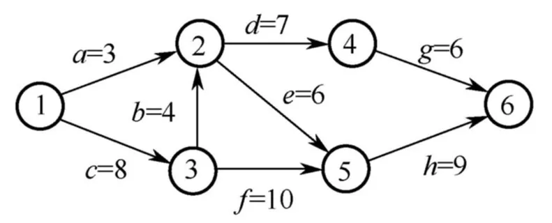
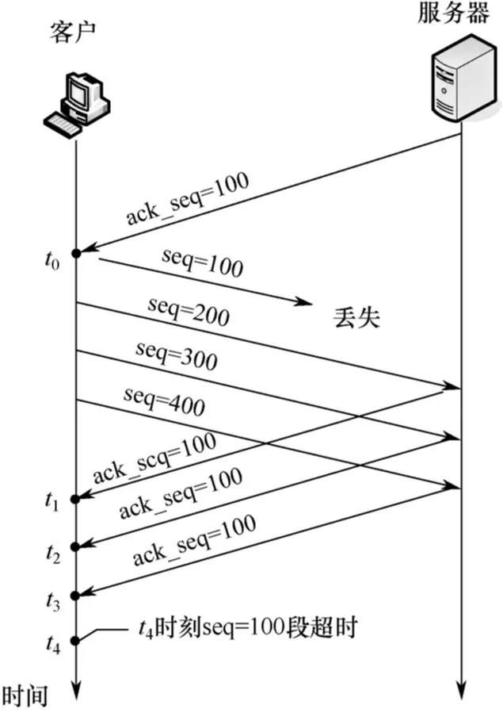
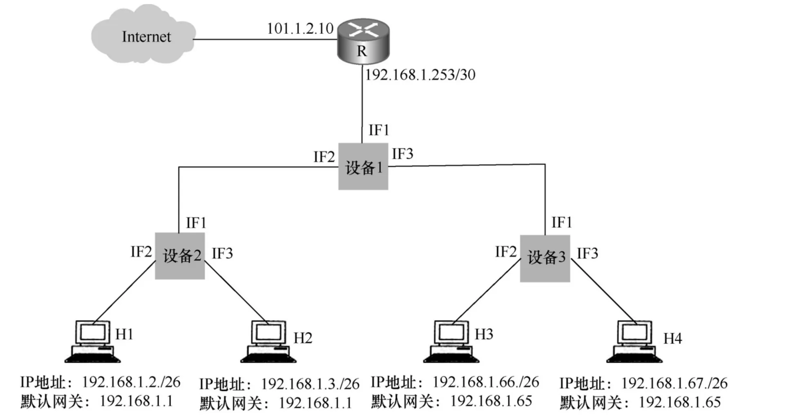

# 2019 年 408 真题 · 答案与解析

> 刷完 [[题面]] 后用此页对答案、看解析。
> 顺序：数据结构（1–11, 41–42）→ 组成原理（12–22, 43–44）→ 操作系统（23–32, 45–46）→ 计算机网络（33–40, 47）

## 一、选择题答案速查表（40 题，每题 2 分，共 80 分）

| 题号 | 1 | 2 | 3 | 4 | 5 | 6 | 7 | 8 | 9 | 10 |
| 答案 | **B** | **B** | **C** | **A** | **C** | **A** | **D** | **C** | **B** | **D** |
| 科目 | 数结 | 数结 | 数结 | 数结 | 数结 | 数结 | 数结 | 数结 | 数结 | 数结 |

| 题号 | 11 | 12 | 13 | 14 | 15 | 16 | 17 | 18 | 19 | 20 |
| 答案 | **B** | **C** | **A** | **D** | **D** | **D** | **B** | **C** | **B** | **C** |
| 科目 | 数结 | 组原 | 组原 | 组原 | 组原 | 组原 | 组原 | 组原 | 组原 | 组原 |

| 题号 | 21 | 22 | 23 | 24 | 25 | 26 | 27 | 28 | 29 | 30 |
| 答案 | **A** | **D** | **B** | **C** | **C** | **B** | **C** | **B** | **C** | **B** |
| 科目 | 组原 | 组原 | 操作 | 操作 | 操作 | 操作 | 操作 | 操作 | 操作 | 操作 |

| 题号 | 31 | 32 | 33 | 34 | 35 | 36 | 37 | 38 | 39 | 40 |
| 答案 | **A** | **C** | **C** | **A** | **B** | **B** | **B** | **C** | **D** | **B** |
| 科目 | 操作 | 操作 | 计网 | 计网 | 计网 | 计网 | 计网 | 计网 | 计网 | 计网 |

> 科目缩写：数结 = 数据结构 | 组原 = 计算机组成原理 | 操作 = 操作系统 | 计网 = 计算机网络

## 二、综合题答案要点速查表（7 题，共 70 分）

| 题号 | 分值 | 科目 | 考点 | 关键结论 |
|------|------|------|------|----------|
| 41 | 13 | 数据结构 | 线性表 | 答案：1、基本思想：设快、慢两个指针，fast 每次走两步、slow 每次走一步，fast 到达链尾时 slow 正好停在链表前半段的末尾；将后半段结点原地逆置... |
| 42 | 10 | 数据结构 | 栈、队列与数组 | 答案：1、顺序存储的队列空间固定，无法满足「入队时允许增加占用空间」，故选择链式存储，用循环单链表实现，设队头指针 front、队尾指针 rear |
| 43 | 8 | 操作系统 | 进程与线程 | 答案：设信号量 fork[n] 初值均为 1，表示相邻两位哲学家之间的一根筷子；设信号量 plate 初值为 min(m, n−1)，用来限制同时就餐的哲学家数... |
| 44 | 7 | 操作系统 | 输入输出管理 | 答案：1、磁盘容量 = 300×10×200×512B = 3×10⁵KB |
| 45 | 16 | 计算机组成原理 | 数据表示与运算 | 答案：1、f1(10) 会依次调用 f1(9)…f1(1)，共调用 f1 10 次；执行第 16 行的 call 指令会递归调用 f1 |
| 46 | 7 | 计算机组成原理 | 存储器层次结构 | 答案：1、页大小 4KB，虚拟地址高 20 位为虚页号 |
| 47 | 9 | 计算机网络 | 网络层 | 答案：1、H1、H2 的网络前缀均为 192.168.1.0/26，构成 LAN1；H3、H4 的网络前缀均为 192.168.1.64/26，构成 LAN2 |

---

## 三、详细解析

> 以下按题号顺序排列。每题包含题干、选项、答案、解析。
> 图片以相对路径 `images/xxx.webp` 引用，与本文同目录。

### 选择题 · 数据结构

### 1. （2 分 · 绪论）

设 n 是描述问题规模的非负整数，下列程序段的时间复杂度是( )。

```
x = 0;
while (n >= (x + 1) * (x + 1))
    x = x + 1;
```

- **A.** $O(\log n)$
- **B.** $O(n^{1/2})$
- **C.** $O(n)$
- **D.** $O(n^2)$

**答案**：B

**解析**：答案 B。循环终止时 x 已增到约 √n：退出条件为 (x+1)²>n，即 x+1>√n，故循环约执行 √n 次，时间复杂度为 O(√n)=O(n^1/2)。

> 难度 ⭐⭐⭐ ｜ 章节 绪论 ｜ 标签 数据结构 / 绪论

---

### 2. （2 分 · 树与二叉树）

若将一棵树 T 转化为对应的二叉树 BT，则下列对 BT 的遍历中，其遍历序列与 T 的后根遍历序列相同的是( )。

- **A.** 先序遍历
- **B.** 中序遍历
- **C.** 后序遍历
- **D.** 按层遍历

**答案**：B

**解析**：答案 B。树按「左孩子右兄弟」规则转为二叉树：第一个孩子放左子树，其余孩子依次挂到右链上。如此树的后根遍历（先子树后根）正好对应二叉树的中序遍历。

> 难度 ⭐⭐⭐ ｜ 章节 树与二叉树 ｜ 标签 数据结构 / 树 / 二叉树 / 二叉树遍历

---

### 3. （2 分 · 树与二叉树）

对 n 个互不相同的符号进行哈夫曼编码。若生成的哈夫曼树共有 115 个结点，则 n 的值是( )。

- **A.** 56
- **B.** 57
- **C.** 58
- **D.** 60

**答案**：C

**解析**：答案 C。哈夫曼树是严格二叉树，n 个叶子结点的哈夫曼树共有 2n−1 个结点。由 2n−1=115 解得 n=58。

> 难度 ⭐⭐ ｜ 章节 树与二叉树 ｜ 标签 数据结构 / 树 / 二叉树 / 二叉树遍历 / 哈夫曼树 / 物理层

---

### 4. （2 分 · 查找）

在任意一棵非空平衡二叉树(AVL 树)T1 中，删除某结点 v 之后形成平衡二叉树 T2 ，再将 v 插入 T2 形成平衡二叉树 T3 。下列关于 T1 与 T3 的叙述中，正确的是( )。

I. 若 v 是 T1 的叶结点，则 T1 与 T3 可能不相同

II. 若 v 不是 T1 的叶结点，则 T1 与 T3 一定不相同

III. 若 v 不是 T1 的叶结点，则 T1 与 T3 一定相同

- **A.** 仅 I
- **B.** 仅 II
- **C.** 仅 I、II
- **D.** 仅 I、III

**答案**：A

**解析**：答案 A。v 为叶结点时，删除后若失衡而调整，再插回后 T3 与 T1 可能不同，Ⅰ 正确；若删除后未调整则相同。v 非叶结点时，T1 与 T3 可能相同也可能不同，故 Ⅱ、Ⅲ 的「一定」说法均错。

> 难度 ⭐⭐⭐⭐ ｜ 章节 查找 ｜ 标签 数据结构 / 查找 / 散列表 / B树 / AVL树

---

### 5. （2 分 · 图）

下图所示的 AOE 网表示一项包含 8 个活动的工程。活动 d 的最早开始时间和最迟开始时间分别是（ ）。



- **A.** 3 和 7
- **B.** 12 和 12
- **C.** 12 和 14
- **D.** 15 和 15

**答案**：C

**解析**：答案 C。活动 d 须等 a、b 都完成才能开始，最早开始时间为 max(3, 4+8)=12。关键路径总长 27，事件 4 的最迟发生时间为 27−6=21，故 d 的最迟开始时间为 21−7=14。

> 难度 ⭐⭐⭐⭐ ｜ 章节 图 ｜ 标签 数据结构 / 图 / 最短路径 / 最小生成树 / 图算法

---

### 6. （2 分 · 图）

用有向无环图描述表达式 $(x+y)*((x+y)/x)$，需要的顶点个数至少是( )。

- **A.** 5
- **B.** 6
- **C.** 8
- **D.** 9

**答案**：A

**解析**：答案 A。把表达式二叉树中相同的子表达式合并：x+y 出现两次只保留一个结点，x、y 各占一个叶子，加 *、/ 两个运算符，共 5 个顶点。

> 难度 ⭐⭐⭐ ｜ 章节 图 ｜ 标签 数据结构 / 图 / 最短路径 / 最小生成树

---

### 7. （2 分 · 排序）

选择一个排序算法时，除算法的时空效率外，下列因素中，还需要考虑的是( )。

Ⅰ. 数据的规模

Ⅱ. 数据的存储方式

Ⅲ. 算法的稳定性

Ⅳ. 数据的初始状态

- **A.** 仅Ⅲ
- **B.** 仅Ⅰ、Ⅱ
- **C.** 仅Ⅱ、Ⅲ、Ⅳ
- **D.** Ⅰ、Ⅱ、Ⅲ、Ⅳ

**答案**：D

**解析**：答案 D。选排序算法除时空效率外，还要考虑数据规模（决定选简单排序、高级排序还是外部排序）、存储方式（如堆排序只能顺序存储）、稳定性要求以及数据初始状态（如基本有序时直接插入效率最高），四项都需考虑。

> 难度 ⭐⭐ ｜ 章节 排序 ｜ 标签 数据结构 / 排序 / 内部排序 / 外部排序

---

### 8. （2 分 · 查找）

现有长度为 11 且初始为空的散列表 HT，散列函数是 H(key)=key%7，采用线性探查(线性探测再散列)法解决冲突将关键字序列 87，40，30，6，11，22，98，20 依次插入到 HT 后，HT 查找失败的平均查找长度是( )。

- **A.** 4
- **B.** 5.25
- **C.** 6
- **D.** 6.29

**答案**：C

**解析**：答案 C。散列地址只可能是 0～6，各地址查找失败时需探测到第一个空位置，0～6 对应比较次数依次为 9、8、7、6、5、4、3，平均为 (9+8+7+6+5+4+3)/7=6。

> 难度 ⭐⭐⭐ ｜ 章节 查找 ｜ 标签 数据结构 / 查找 / 散列表 / B树

---

### 9. （2 分 · 串）

设主串 T="abaabaabcabaabc"，模式串 S="abaabc"，采用 KMP 算法进行模式匹配，到匹配成功时为止，在匹配过程中进行的单个字符间的比较次数是( )。

- **A.** 9
- **B.** 10
- **C.** 12
- **D.** 15

**答案**：B

**解析**：答案 B。模式串的 next 数组（0 起）为 -1,0,0,1,1,2。第一趟连续比较 6 次，T[5] 与 S[5] 失配后 j 回退到 2；第二趟再比较 4 次匹配成功，共比较 10 次。

> 难度 ⭐⭐⭐⭐ ｜ 章节 串 ｜ 标签 数据结构 / 串

---

### 10. （2 分 · 排序）

排序过程中，对尚未确定最终位置的所有元素进行一遍处理称为一"趟"。下列序列中，不可能是快速排序第二趟结果的是( )。

- **A.** 5，2，16，12，28，60，32，72
- **B.** 2，16，5，28，12，60，32，72
- **C.** 2，12，16，5，28，32，72，60
- **D.** 5，2，12，28，16，32，72，60

**答案**：D

**解析**：答案 D。第二趟后到位元素：首趟枢轴居中时至少 3 个，在首尾时至少 2 个。A、B、C 均可由两趟划分得到；D 中仅 12、32 到位，且 [5,2]、[72,60] 两个 2 元素区间若被划分必变有序，与 D 矛盾，故不可能。

> 难度 ⭐⭐⭐⭐ ｜ 章节 排序 ｜ 标签 数据结构 / 排序 / 内部排序 / 外部排序 / 排序算法

---

### 11. （2 分 · 排序）

设外存上有 120 个初始归并段，进行 12 路归并时，为实现最佳归并，需要补充的虚段个数是（）。

- **A.** 1
- **B.** 2
- **C.** 3
- **D.** 4

**答案**：B

**解析**：答案 B。k 路最佳归并要求归并树为严格 k 叉树，须满足 (m+s−1) mod (k−1)=0。代入 m=120、k=12：(119+s) mod 11=0，s 的最小值为 2。

> 难度 ⭐⭐⭐ ｜ 章节 排序 ｜ 标签 数据结构 / 排序 / 内部排序 / 外部排序

---

### 综合题 · 数据结构

### 41. （13 分 · 线性表）

设线性表 L = (a₁, a₂, a₃, …, aₙ₋₂, aₙ₋₁, aₙ) 采用带头结点的单链表保存，链表中的结点定义如下：

```c
typedef struct node {
    int data;
    struct node *next;
} NODE;
```

请设计一个空间复杂度为 O(1) 且时间上尽可能高效的算法，重新排列 L 中的各结点，得到线性表 L' = (a₁, aₙ, a₂, aₙ₋₁, a₃, aₙ₋₂, …)。要求：

(1) 给出算法的基本设计思想。

(2) 根据设计思想，采用 C 或 C++ 语言描述算法，关键之处给出注释。

(3) 说明你所设计算法的时间复杂度。

**答案 / 解析**：

答案：1、基本思想：设快、慢两个指针，fast 每次走两步、slow 每次走一步，fast 到达链尾时 slow 正好停在链表前半段的末尾；将后半段结点原地逆置，再从头两段各取一个结点交替穿插，得到 L'。2、时间 O(n)、空间 O(1)。核心代码：

```c
void rearrange(NODE *L) {             // L 为带头结点的单链表
    NODE *slow = L, *fast = L;
    while (fast->next && fast->next->next) {  // 快慢指针找中点
        slow = slow->next;
        fast = fast->next->next;
    }
    NODE *p = slow->next;             // 后半段起点
    slow->next = NULL;                // 断开两段
    NODE *r = NULL;                   // 逆置后半段
    while (p) {
        NODE *t = p->next;
        p->next = r;
        r = p;
        p = t;
    }
    p = L->next;                      // p 指前半段，r 指逆置后的后半段
    while (p && r) {                  // 交替合并
        NODE *pn = p->next, *rn = r->next;
        p->next = r;
        r->next = pn;
        p = pn;
        r = rn;
    }
}
```

> 难度 ⭐⭐⭐⭐ ｜ 章节 线性表 ｜ 标签 数据结构 / 线性表 / 顺序表 / 链表 / 文件系统

---

### 42. （10 分 · 栈、队列与数组）

请设计一个队列，要求满足：

① 初始时队列为空；

② 入队时，允许增加队列占用空间；

③ 出队后，出队元素所占用的空间可重复使用，即整个队列所占用的空间只增不减；

④ 入队操作和出队操作的时间复杂度始终保持为 O(1)。

请回答下列问题：

(1) 该队列是应选择链式存储结构，还是应选择顺序存储结构？

(2) 画出队列的初始状态，并给出判断队空和队满的条件。

(3) 画出第一个元素入队后的队列状态。

(4) 给出入队操作和出队操作的基本过程。请回答下列问题：
- （1）该队列是应选择链式存储结构，还是应选择顺序存储结构？
- （2）画出队列的初始状态，并给出判断队空和队满的条件。
- （3）画出第一个元素入队后的队列状态。
- （4）给出入队操作和出队操作的基本过程。

**答案 / 解析**：

答案：1、顺序存储的队列空间固定，无法满足「入队时允许增加占用空间」，故选择链式存储，用循环单链表实现，设队头指针 front、队尾指针 rear。
2、初始状态：链表只有一个空闲结点，front 与 rear 均指向它。队空条件：front==rear；队满条件：front==rear->next（只剩 front 所指一个空闲结点）。
3、第一个元素入队后：若队满则在 rear 后插入新结点，rear 后移指向存放该元素的结点，front 不动。
4、入队：若 front==rear->next 则在 rear 之后插入一个新的空闲结点；再令 rear=rear->next，将元素存入 rear 所指结点。出队：若 front==rear 则队空、出队失败；否则取出队头元素，front=front->next（结点不释放，供后续入队复用）。入队、出队时间复杂度均为 O(1)。

> 难度 ⭐⭐⭐ ｜ 章节 栈、队列与数组 ｜ 标签 数据结构 / 栈 / 队列 / 数组

---

### 选择题 · 计算机组成原理

### 12. （2 分 · 计算机系统概述）

下列关于冯·诺依曼结构计算机基本思想的叙述中，错误的是（ ）。

- **A.** 程序的功能都通过中央处理器执行指令实现
- **B.** 指令和数据都用二进制表示，形式上无差别
- **C.** 指令按地址访问，数据都在指令中直接给出
- **D.** 程序执行前，指令和数据需预先存放在存储器中

**答案**：C

**解析**：答案 C。指令按地址访问，数据由指令的地址码指出，除立即寻址外数据都存放在存储器中，「数据都在指令中直接给出」错误。其余三项均符合冯·诺依曼思想。

> 难度 ⭐⭐ ｜ 章节 计算机系统概述 ｜ 标签 计算机组成原理 / 计算机系统概述

---

### 13. （2 分 · 数据表示与运算）

考虑以下 C 语言代码：

```c
unsigned short usi = 65535;
short si = usi;
```

执行上述程序段后，si 的值是（ ）。

- **A.** -1
- **B.** -32767
- **C.** -32768
- **D.** -65535

**答案**：A

**解析**：答案 A。unsigned short 的 65535 即 16 位全 1（0xFFFF），赋给 short 后位模式不变，按补码解读全 1 为 −1。

> 难度 ⭐⭐ ｜ 章节 数据表示与运算 ｜ 标签 计算机组成原理 / 数据表示 / 运算

---

### 14. （2 分 · 存储器层次结构）

下列关于缺页处理的叙述中，错误的是（ ）。

- **A.** 缺页是在地址转换时 CPU 检测到的一种异常
- **B.** 缺页处理由操作系统提供的缺页处理程序来完成
- **C.** 缺页处理程序根据页故障地址从外存读入所缺失的页
- **D.** 缺页处理完成后回到发生缺页的指令的下一条指令执行

**答案**：D

**解析**：答案 D。缺页是地址转换时 CPU 检测到的异常，由操作系统缺页处理程序从外存读入所缺页；缺页指令尚未完成访存，处理完成后应回到该指令重新执行，而非执行下一条指令。

> 难度 ⭐⭐⭐ ｜ 章节 存储器层次结构 ｜ 标签 计算机组成原理 / 存储器层次结构 / 虚拟内存

---

### 15. （2 分 · 指令系统）

某计算机采用大端方式，按字节编址。某指令中操作数的机器数为 1234FF00H，该操作数采用基址寻址方式，形式地址（用补码表示）为 FF12H，基址寄存器内容为 F0000000H，则该操作数的 LSB（最低有效字节）所在的地址是（ ）。

- **A.** F000FF12H
- **B.** F000FF15H
- **C.** EFFFFF12H
- **D.** EFFFFF15H

**答案**：D

**解析**：答案 D。形式地址 FF12H 为补码，真值 −00EEH，EA=F0000000H−00EEH=EFFFFF12H。大端方式下 4 字节操作数的 LSB 存于最高地址，故 LSB 地址为 EFFFFF12H+3=EFFFFF15H。

> 难度 ⭐⭐⭐⭐ ｜ 章节 指令系统 ｜ 标签 计算机组成原理 / 指令系统 / 寻址方式 / CISC / RISC

---

### 16. （2 分 · 计算机系统概述）

下列有关处理器时钟脉冲信号的叙述中，错误的是（ ）。

- **A.** 时钟脉冲信号由机器脉冲源发出的脉冲信号经整形和分频后形成
- **B.** 时钟脉冲信号的宽度称为时钟周期，时钟周期的倒数为机器主频
- **C.** 时钟周期以相邻状态单元间组合逻辑电路的最大延迟为基准确定
- **D.** 处理器总是在每来一个时钟脉冲信号时就开始执行一条新的指令

**答案**：D

**解析**：答案 D。一条指令通常需要多个时钟周期（CPI>1），处理器并非每来一个时钟脉冲就执行一条新指令。A、B、C 分别对应时钟脉冲来源、时钟周期与主频关系、时钟周期以组合逻辑最大延迟为基准，均正确。

> 难度 ⭐⭐ ｜ 章节 计算机系统概述 ｜ 标签 计算机组成原理 / 计算机系统概述

---

### 17. （2 分 · 中央处理器）

某指令功能为 `R[r2] ← R[r1] + M[R[r0]]`，其两个源操作数分别采用寄存器、寄存器间接寻址方式。对于下列给定部件，该指令在取数及执行过程中需要用到的是（ ）。

Ⅰ. 通用寄存器组（GPRs）
Ⅱ. 算术逻辑单元（ALU）
Ⅲ. 存储器（Memory）
Ⅳ. 指令译码器（ID）

- **A.** 仅I、II
- **B.** 仅I、II、III
- **C.** 仅II、III、IV
- **D.** 仅I、III、IV

**答案**：B

**解析**：答案 B。寄存器寻址和寄存器间接寻址的取数阶段需用通用寄存器组和存储器，相加需用 ALU；指令译码器只在译码阶段使用，取数及执行阶段用不到。

> 难度 ⭐⭐⭐ ｜ 章节 中央处理器 ｜ 标签 计算机组成原理 / CPU / 数据通路 / 指令流水线

---

### 18. （2 分 · 中央处理器）

在采用"取指、译码/取数、执行、访存、写回"5 段流水线的处理器中，执行如下指令序列：

```
I1: add s2,s1,s0    // R[s2]←R[s1]+R[s0]
I2: load s3,0(t2)   // R[s3]←M[R[t2]+0]
I3: add s2,s2,s3    // R[s2]←R[s2]+R[s3]
I4: store s2,0(t2)  // M[R[t2]+0]←R[s2]
```

下列指令对中，不存在数据冒险的是（ ）。

- **A.** I1 和 I3
- **B.** I2 和 I3
- **C.** I2 和 I4
- **D.** I3 和 I4

**答案**：C

**解析**：答案 C。I1 写 s2 被 I3 读、I2 写 s3 被 I3 读、I3 写 s2 被 I4 读，均构成写后读（RAW）数据冒险；I2 写 s3，而 I4 只读 s2、t2，故 I2 和 I4 之间无数据冒险。

> 难度 ⭐⭐⭐ ｜ 章节 中央处理器 ｜ 标签 计算机组成原理 / CPU / 数据通路 / 指令流水线 / Cache

---

### 19. （2 分 · 总线）

假定一台计算机采用 3 通道存储器总线，配套的内存条型号为 DDR3-1333，即内存条所接插的存储器总线的工作频率为 1333MHz，总线宽度为 64 位，则存储器总线的总带宽大约是（ ）。

- **A.** 10.66GBps
- **B.** 32GBps
- **C.** 64GBps
- **D.** 96GBps

**答案**：B

**解析**：答案 B。单通道带宽=1333MHz×64 位/8≈10.66GB/s，3 通道总带宽约 3×10.66≈32GB/s。

> 难度 ⭐⭐⭐ ｜ 章节 总线 ｜ 标签 计算机组成原理 / 总线 / 系统总线 / I/O接口 / I/O方式 / 物理层

---

### 20. （2 分 · 输入输出系统）

下列关于磁盘存储器的叙述中，错误的是（ ）。

- **A.** 磁盘的格式化容量比非格式化容量小
- **B.** 扇区中包含数据、地址和校验等信息
- **C.** 磁盘存储器的最小读写单位为一字节
- **D.** 磁盘存储器由磁盘控制器、磁盘驱动器和盘片组成

**答案**：C

**解析**：答案 C。磁盘的最小读写单位是扇区而非字节，C 错误。格式化容量比非格式化容量小、扇区含数据地址校验信息、磁盘由控制器驱动器和盘片组成均正确。

> 难度 ⭐⭐ ｜ 章节 输入输出系统 ｜ 标签 计算机组成原理 / I/O系统 / 中断 / DMA / 磁盘

---

### 21. （2 分 · 中央处理器）

某设备以中断方式与 CPU 进行数据交换，CPU 主频为 1GHz，设备接口中的数据缓冲寄存器为 32 位，设备的数据传输率为 50KBps。若每次中断开销（包括中断响应和中断处理）为 1000 个时钟周期，则 CPU 用于该设备输入/输出的时间占整个 CPU 时间的百分比最多是（ ）。

- **A.** 1.25%
- **B.** 2.5%
- **C.** 5%
- **D.** 12.5%

**答案**：A

**解析**：答案 A。缓冲寄存器 32 位即每次中断传送 4B，每秒需 50×10³/4=1.25×10⁴ 次中断，总开销 1.25×10⁴×1000=1.25×10⁷ 个时钟周期，占 1GHz 的 1.25%。

> 难度 ⭐⭐⭐ ｜ 章节 中央处理器 ｜ 标签 计算机组成原理 / CPU / 数据通路 / 指令流水线 / 性能指标 / I/O方式 / 内存分配

---

### 22. （2 分 · 输入输出系统）

下列关于 DMA 方式的叙述中，正确的是（ ）。

I. DMA 传送前由设备驱动程序设置传送参数

II. 数据传送前由 DMA 控制器请求总线使用权

III. 数据传送由 DMA 控制器直接控制总线完成

IV. DMA 传送结束后的处理由中断服务程序完成

- **A.** 仅 I、II
- **B.** 仅 I、III、IV
- **C.** 仅 II、III、IV
- **D.** I、II、III、IV

**答案**：D

**解析**：答案 D。DMA 传送前由设备驱动程序设置传送参数（Ⅰ），随后 DMA 控制器请求总线使用权（Ⅱ）并直接控制总线完成数据传送（Ⅲ），传送结束后由中断服务程序处理（Ⅳ），四项均正确。

> 难度 ⭐⭐ ｜ 章节 输入输出系统 ｜ 标签 计算机组成原理 / I/O系统 / 中断 / DMA / I/O方式 / 设备管理

---

### 综合题 · 计算机组成原理

### 45. （16 分 · 数据表示与运算）

已知 $f(n) = n! = n \times (n-1) \times (n-2) \times \cdots \times 2 \times 1$，计算 $f(n)$ 的 C 语言函数 f1 的源程序（阴影部分）及其在 32 位计算机 M 上的部分机器级代码如下：

```
int f1(int n) {
1   00401000   55             push ebp
      ...           ...            ...
   if(n>1)
11  00401018  83 7D 08 01    cmp   dword ptr [ebp+8],1
12  0040101C  7E 17          jle   f1+35h (00401035)
   return n*f1(n-1);
13  0040101E  8B 45 08       mov   eax, dword ptr [ebp+8]
14  00401021  83 E8 01       sub   eax, 1
15  00401024  50             push  eax
16  00401025  E8 D6 FF FF FF call  f1 ( 00401000)
      ...           ...            ...
19  00401030  0F AF C1       imul  eax, ecx
20  00401033  EB 05          jmp   f1+3Ah (0040103a)
   else return 1;
}
21  00401035  B8 01 00 00 00 mov   eax,1
      ...           ...            ...
26  00401040  3B EC          cmp   ebp, esp
      ...           ...            ...
30  0040104A  C3             ret
```

其中，机器级代码行包括行号、虚拟地址、机器指令和汇编指令，计算机 M 按字节编址，int 型数据占 32 位。请回答下列问题：

(1) 计算 f(10) 需要调用函数 f1 多少次？执行哪条指令会递归调用 f1？

(2) 上述代码中，哪条指令是条件转移指令？哪几条指令一定会使程序跳转执行？

(3) 根据第 16 行的 call 指令，第 17 行指令的虚拟地址应是多少？已知第 16 行的 call 指令采用相对寻址方式，该指令中的偏移量应是多少（给出计算过程）？已知第 16 行的 call 指令的后 4 字节为偏移量，M 是采用大端方式还是采用小端方式？

(4) f(13)=6227020800，但 f1(13) 的返回值为 1932053504，为什么两者不相等？要使 f1(13) 能返回正确的结果，应如何修改 f1 的源程序？

(5) 第 19 行的 imul 指令（带符号整数乘）的功能是 R[eax]←R[eax]×R[ecx]，当乘法器输出的高、低 32 位乘积之间满足什么条件时，溢出标志 OF=1？要使 CPU 在发生溢出时转异常处理，编译器应在 imul 指令后应加一条什么指令？

**答案 / 解析**：

答案：1、f1(10) 会依次调用 f1(9)…f1(1)，共调用 f1 10 次；执行第 16 行的 call 指令会递归调用 f1。
2、第 12 行的 jle 是条件转移指令，n≤1 时跳转到 00401035H；第 16 行 call、第 20 行 jmp、第 30 行 ret 一定会使程序跳转。
3、call 指令长 5 字节，第 17 行指令地址为 00401025H+5=0040102AH。相对寻址偏移量 = 目标地址 − (PC) = 00401000H − 0040102AH = FFFFFFD6H。机器码中偏移字段为 D6 FF FF FF，低字节在前，故 M 采用小端方式。
4、f(13)=6227020800 超出 32 位 int 的表示范围，f1 累乘发生溢出，得到错误结果 1932053504。将 f1 的返回值类型改为 double（或 long long 等更宽类型）即可返回正确结果。
5、当乘积的高 32 位不全为 0 也不全为 1（即 64 位乘积不能用 32 位表示）时 OF=1。编译器应在 imul 指令后加一条溢出自陷指令，使 OF=1 时转入溢出异常处理程序。

> 难度 ⭐⭐⭐⭐ ｜ 章节 数据表示与运算 ｜ 标签 计算机组成原理 / 数据表示 / 运算

---

### 46. （7 分 · 存储器层次结构）

> 【承上题·2019 年第 45 题材料】 本题与第 45 题为同一组连续大题，共用下面这段代码。为便于独立作答，材料一并附在此处。

已知 $f(n) = n! = n \times (n-1) \times (n-2) \times \cdots \times 2 \times 1$，计算 $f(n)$ 的 C 语言函数 f1 的源程序（阴影部分）及其在 32 位计算机 M 上的部分机器级代码如下：

```
int f1(int n) {
1   00401000   55             push ebp
      ...           ...            ...
   if(n>1)
11  00401018  83 7D 08 01    cmp   dword ptr [ebp+8],1
12  0040101C  7E 17          jle   f1+35h (00401035)
   return n*f1(n-1);
13  0040101E  8B 45 08       mov   eax, dword ptr [ebp+8]
14  00401021  83 E8 01       sub   eax, 1
15  00401024  50             push  eax
16  00401025  E8 D6 FF FF FF call  f1 ( 00401000)
      ...           ...            ...
19  00401030  0F AF C1       imul  eax, ecx
20  00401033  EB 05          jmp   f1+3Ah (0040103a)
   else return 1;
}
21  00401035  B8 01 00 00 00 mov   eax,1
      ...           ...            ...
26  00401040  3B EC          cmp   ebp, esp
      ...           ...            ...
30  0040104A  C3             ret
```

机器级代码行包括行号、虚拟地址、机器指令和汇编指令，计算机 M 按字节编址，int 型数据占 32 位。

本题： 对于上述程序：

（1）若计算机 M 的主存地址为 32 位，釆用分页存储管理方式，页大小为 4KB，则第 1 行的 push 指令和第 30 行的 ret 指令是否在同一页中（说明理由）？

（2）若指令 Cache 有 64 行，采用 4 路组相联映射方式，主存块大小为 64B，则 32 位主存地址中，哪几位表示块内地址？哪几位表示 Cache 组号？哪几位表示标记（tag）信息？

（3）读取第 16 行的 call 指令时，只可能在指令 Cache 的哪一组中命中（说明理由）？

**答案 / 解析**：

答案：1、页大小 4KB，虚拟地址高 20 位为虚页号。push（00401000H）与 ret（0040104AH）的高 20 位均为 00401H，故在同一页中。
2、主存块 64B，块内地址为低 6 位；Cache 共 64/4=16 组，组号 4 位，为地址的第 6～9 位；其余高 22 位为标记（tag）。
3、call 指令虚拟地址 00401025H 的低 12 位为 025H=0000 0010 0101B，其中第 6～9 位为 0000，故只可能在指令 Cache 的第 0 组中命中。

> 难度 ⭐⭐⭐⭐ ｜ 章节 存储器层次结构 ｜ 标签 计算机组成原理 / 存储器层次结构 / Cache / 内存分配

---

### 选择题 · 操作系统

### 23. （2 分 · 进程与线程）

下列关于线程的描述中，错误的是（ ）。

- **A.** 内核级线程的调度由操作系统完成
- **B.** 操作系统为每个用户级线程建立一个线程控制块
- **C.** 用户级线程间的切换比内核级线程间的切换效率高
- **D.** 用户级线程可以在不支持内核级线程的操作系统上实现

**答案**：B

**解析**：答案 B。用户级线程的控制块由用户态线程库维护，操作系统不为每个用户级线程建立线程控制块，B 错误。其余：内核级线程由 OS 调度、用户级线程切换不进内核故效率更高、用户级线程可在不支持内核级线程的 OS 上实现，均正确。

> 难度 ⭐⭐⭐ ｜ 章节 进程与线程 ｜ 标签 操作系统 / 进程管理 / 进程 / 线程 / 同步 / PV操作

---

### 24. （2 分 · 进程与线程）

下列选项中，可能将进程唤醒的事件是（ ）。

Ⅰ. I/O 结束
Ⅱ. 某进程退出临界区
Ⅲ. 当前进程的时间片用完

- **A.** 仅Ⅰ
- **B.** 仅Ⅲ
- **C.** 仅Ⅰ、Ⅱ
- **D.** Ⅰ、Ⅱ、Ⅲ

**答案**：C

**解析**：答案 C。I/O 结束会唤醒等待该 I/O 的阻塞进程（Ⅰ 对）；某进程退出临界区会唤醒等待该临界资源的进程（Ⅱ 对）；时间片用完使当前进程运行态转就绪态，是被剥夺而非唤醒（Ⅲ 错）。

> 难度 ⭐⭐ ｜ 章节 进程与线程 ｜ 标签 操作系统 / 进程管理 / 进程 / 线程 / 同步 / PV操作

---

### 25. （2 分 · 计算机系统概述）

下列关于系统调用的叙述中，正确的是（ ）。

Ⅰ. 在执行系统调用服务程序的过程中，CPU 处于内核态
Ⅱ. 操作系统通过提供系统调用避免用户程序直接访问外设
Ⅲ. 不同的操作系统为应用程序提供了统一的系统调用接口
Ⅳ. 系统调用是操作系统内核为应用程序提供服务的接口

- **A.** 仅Ⅰ、Ⅳ
- **B.** 仅Ⅱ、Ⅲ
- **C.** 仅Ⅰ、Ⅱ、Ⅳ
- **D.** Ⅰ、Ⅲ、Ⅳ

**答案**：C

**解析**：答案 C。系统调用服务程序在内核态执行（Ⅰ 对）；通过系统调用避免用户程序直接访问外设（Ⅱ 对）；系统调用是内核为应用程序提供服务的接口（Ⅳ 对）；不同操作系统的系统调用接口并不统一（Ⅲ 错）。

> 难度 ⭐⭐ ｜ 章节 计算机系统概述 ｜ 标签 操作系统 / 计算机系统概述

---

### 26. （2 分 · 文件管理）

下列选项中，可用于文件系统管理空闲磁盘块的数据结构是（ ）。

Ⅰ. 位图
Ⅱ. 索引结点
Ⅲ. 空闲磁盘块链
Ⅳ. 文件分配表 (FAT)

- **A.** 仅Ⅰ、Ⅱ
- **B.** 仅Ⅰ、Ⅲ、Ⅳ
- **C.** 仅Ⅰ、Ⅲ
- **D.** 仅Ⅱ、Ⅲ、Ⅳ

**答案**：B

**解析**：答案 B。位图、空闲磁盘块链和文件分配表（FAT）都可用于管理空闲磁盘块；索引结点存放文件描述信息，与空闲块管理无关（Ⅱ 错）。

> 难度 ⭐⭐ ｜ 章节 文件管理 ｜ 标签 操作系统 / 文件系统 / 文件 / 目录 / 磁盘

---

### 27. （2 分 · 进程与线程）

系统采用二级反馈队列调度算法进行进程调度。就绪队列 Q1 采用时间片轮转调度算法，时间片为 10ms；就绪队列 Q2 采用短进程优先调度算法；系统优先调度 Q1 队列中的进程，当 Q1 为空时系统才会调度 Q2 中的进程；新创建的进程首先进入 Q1;Q1 中的进程执行一个时间片后，若未结束，则转入 Q2。若当前 Q1，Q2 为空，系统依次创建进程 P1，P2 后即开始进程调度，P1,P2 需要的 CPU 时间分别为 30ms 和 20ms，则进程 P1，P2 在系统中的平均等待时间为（ ）。

- **A.** 25ms
- **B.** 20ms
- **C.** 15ms
- **D.** 10ms

**答案**：C

**解析**：答案 C。P1、P2 在 Q1 各执行一个 10ms 时间片后转入 Q2，P2 剩 10ms、P1 剩 20ms；Q2 按短进程优先执行 P2 再执行 P1。P1 等待 20ms、P2 等待 10ms，平均 (20+10)/2=15ms。

> 难度 ⭐⭐⭐⭐ ｜ 章节 进程与线程 ｜ 标签 操作系统 / 进程管理 / 进程 / 线程 / 同步 / PV操作 / 队列 / 进程调度

---

### 28. （2 分 · 内存管理）

在分段存储管理系统中，用共享段表描述所有共享的段。若进程 P1 和 P2 共享段 S，下列叙述中，错误的是（ ）。

- **A.** 在物理内存中仅保存一份段 S 的内容
- **B.** 段 S 在 P1 和 P2 中应该具有相同的段号
- **C.** P1 和 P2 共享段 S 在共享段表中的段表项
- **D.** P1 和 P2 都不再使用段 S 时才回收段 S 所占的内存空间

**答案**：B

**解析**：答案 B。共享段在物理内存中只保存一份（A 对），两进程共享同一段表项（C 对），所有进程都不再使用才回收（D 对）；段号是各进程段表中的索引，P1、P2 中段 S 的段号可以不同（B 错）。

> 难度 ⭐⭐⭐ ｜ 章节 内存管理 ｜ 标签 操作系统 / 内存管理 / 分页 / 分段 / 虚拟内存 / 页面置换 / 地址转换 / 内存分配

---

### 29. （2 分 · 内存管理）

某系统采用 LRU 页置换算法和局部置换策略，若系统为进程 P 预分配了 4 个页框，进程 P 访问页号的序列为 0, 1, 2, 7, 0, 5, 3, 5, 0, 2, 7, 6，则进程访问上述页的过程中，产生页置换的总次数是（ ）。

- **A.** 3
- **B.** 4
- **C.** 5
- **D.** 6

**答案**：C

**解析**：答案 C。前 4 次缺页装入空页框，不产生置换；之后访问 5、3、2、7、6 时分别换出最久未使用的 1、2、7、3、5，共置换 5 次。

> 难度 ⭐⭐⭐ ｜ 章节 内存管理 ｜ 标签 操作系统 / 内存管理 / 分页 / 分段 / 虚拟内存 / 页面置换 / Cache / 内存分配

---

### 30. （2 分 · 进程与线程）

下列关于死锁的叙述中，正确的是（ ）。

Ⅰ、可以通过剥夺进程资源解除死锁
Ⅱ、死锁的预防方法能确保系统不发生死锁
Ⅲ、银行家算法可以判断系统是否处于死锁状态
Ⅳ、当系统出现死锁时，必然有两个或两个以上的进程处于阻塞态

- **A.** 仅Ⅱ、Ⅲ
- **B.** 仅Ⅰ、Ⅱ、Ⅳ
- **C.** 仅Ⅰ、Ⅱ、Ⅲ
- **D.** 仅Ⅰ、Ⅲ、Ⅳ

**答案**：B

**解析**：答案 B。剥夺进程资源可解除死锁（Ⅰ 对）；死锁预防破坏四个必要条件之一，能确保系统不发生死锁（Ⅱ 对）；死锁时必有至少两个进程循环等待而阻塞（Ⅳ 对）；银行家算法用于避免死锁，不能判断系统是否处于死锁状态（Ⅲ 错）。

> 难度 ⭐⭐⭐ ｜ 章节 进程与线程 ｜ 标签 操作系统 / 进程管理 / 进程 / 线程 / 同步 / PV操作 / 死锁

---

### 31. （2 分 · 内存管理）

某计算机主存按字节编址，采用二级分页存储管理，地址结构如下所示：

| 页目录号（10 位） | 页号（10 位） | 页内偏移（12 位） |
| ----------------- | ------------- | ----------------- |

虚拟地址 20501225H 对应的页目录号、页号分别是（ ）。

- **A.** 081H、101H
- **B.** 081H、401H
- **C.** 201H、101H
- **D.** 201H、401H

**答案**：A

**解析**：答案 A。20501225H 展开为 32 位二进制，前 10 位 0010000001 为页目录号 081H，随后 10 位 0100000001 为页号 101H，低 12 位为页内偏移。

> 难度 ⭐⭐⭐ ｜ 章节 内存管理 ｜ 标签 操作系统 / 内存管理 / 分页 / 分段 / 虚拟内存 / 页面置换 / 地址转换 / 内存分配 / 文件系统

---

### 32. （2 分 · 内存管理）

在下列动态分区分配算法中，最容易产生内存碎片的是（ ）。

- **A.** 首次适应算法
- **B.** 最坏适应算法
- **C.** 最佳适应算法
- **D.** 循环首次适应算法

**答案**：C

**解析**：答案 C。最佳适应算法总是选择与需求最接近的空闲分区，几乎每次分配都会留下很小的难以利用的分区，最容易产生内存碎片。

> 难度 ⭐⭐ ｜ 章节 内存管理 ｜ 标签 操作系统 / 内存管理 / 分页 / 分段 / 虚拟内存 / 页面置换

---

### 综合题 · 操作系统

### 43. （8 分 · 进程与线程）

有 n（n ≥ 3）位哲学家围坐在一张圆桌边，每位哲学家交替地就餐和思考。在圆桌中心有 m（m ≥ 1）个碗，每两位哲学家之间有一根筷子。每位哲学家必须取到一个碗和两侧的筷子后，才能就餐，进餐完毕，将碗和筷子放回原位，并继续思考。为使尽可能多的哲学家同时就餐，且防止出现死锁现象，请使用信号量的 P、V 操作（wait()、signal() 操作）描述上述过程中的互斥与同步，并说明所用信号量及初值的含义。

**答案 / 解析**：

答案：设信号量 fork[n] 初值均为 1，表示相邻两位哲学家之间的一根筷子；设信号量 plate 初值为 min(m, n−1)，用来限制同时就餐的哲学家数不超过 n−1，从而避免死锁。每位哲学家先取碗再取两侧筷子，就餐结束后先放筷子再放碗：

```c
semaphore fork[n] = {1};
semaphore plate = min(m, n - 1);   // 碗数 m 不足 n-1 时取 m

philosopher(int i) {
    while (1) {
        think();
        P(plate);                    // 先取碗，限制同时就餐人数
        P(fork[i]);
        P(fork[(i + 1) % n]);
        eat();
        V(fork[i]);
        V(fork[(i + 1) % n]);
        V(plate);
    }
}
```

> 难度 ⭐⭐⭐ ｜ 章节 进程与线程 ｜ 标签 操作系统 / 进程管理 / 进程 / 线程 / 同步 / PV操作 / 同步与互斥 / 死锁

---

### 44. （7 分 · 输入输出管理）

某计算机系统中的磁盘有 300 个柱面，每个柱面有 10 个磁道，每个磁道有 200 个扇区，扇区大小为 512B。文件系统的每个簇包含 2 个扇区。请回答下列问题：

(1) 磁盘的容量是多少？

(2) 假设磁头在 85 号柱面上，此时有 4 个磁盘访问请求，簇号分别为 100260、60005、101660 和 110560。若采用最短寻道时间优先 (SSTF) 调度算法，则系统访问簇的先后次序是什么？

(3) 第 100530 簇在磁盘上的物理地址是什么？将簇号转换成磁盘物理地址的过程是由 I/O 系统的什么程序完成的？

**答案 / 解析**：

答案：1、磁盘容量 = 300×10×200×512B = 3×10⁵KB。
2、每柱面有 10×200/2=1000 个簇，85 号柱面对应簇号 85000～85999。SSTF 依次选择离当前柱面最近的请求，访问顺序为：100260、101660、110560、60005。
3、100530 簇的物理地址：柱面号 = ⌊100530/1000⌋ = 100；磁道号 = ⌊(100530 mod 1000)/100⌋ = 5；扇区号 = (530×2) mod 200 = 60。簇号到物理地址的转换由磁盘驱动程序完成。

> 难度 ⭐⭐⭐ ｜ 章节 输入输出管理 ｜ 标签 操作系统 / I/O系统 / 中断 / DMA / 磁盘 / 进程调度 / 文件系统

---

### 选择题 · 计算机网络

### 33. （2 分 · 计算机网络体系结构）

OSI 参考模型的第 5 层（自下而上）完成的主要功能是（ ）

- **A.** 差错控制
- **B.** 路由选择
- **C.** 会话管理
- **D.** 数据表示转换

**答案**：C

**解析**：答案 C。OSI 参考模型自下而上第 5 层为会话层，主要功能是建立、管理和终止应用程序之间的会话，即会话管理。

> 难度 ⭐⭐ ｜ 章节 计算机网络体系结构 ｜ 标签 计算机网络 / 计算机网络体系结构

---

### 34. （2 分 · 物理层）

100BaseT 快速以太网使用的导向传输介质是（ ）。

- **A.** 双绞线
- **B.** 单模光纤
- **C.** 多模光纤
- **D.** 同轴电缆

**答案**：A

**解析**：答案 A。100Base-T 中 100 表示 100Mb/s，Base 表示基带传输，T 表示传输介质为双绞线。

> 难度 ⭐ ｜ 章节 物理层 ｜ 标签 计算机网络 / 物理层 / 编码 / 调制 / 数据链路层

---

### 35. （2 分 · 数据链路层）

对于滑动窗口协议，如果分组序号采用 3 比特编号，发送窗口大小为 5，则接收窗口最大是（ ）。

- **A.** 2
- **B.** 3
- **C.** 4
- **D.** 5

**答案**：B

**解析**：答案 B。滑动窗口协议要求发送窗口与接收窗口之和不超过序号空间 2³=8，即 W_R≤8−5=3；同时接收窗口不超过 2^(3−1)=4，取较紧者，接收窗口最大为 3。

> 难度 ⭐⭐⭐⭐ ｜ 章节 数据链路层 ｜ 标签 计算机网络 / 数据链路层 / MAC / CSMA/CD / PPP / 传输层

---

### 36. （2 分 · 数据链路层）

假设一个采用 CSMA/CD 协议的 100 Mbps 局域网，最小帧长是 128 B，则在一个冲突域内两个站点之间的单向传播延时最多是（ ）。

- **A.** 2.56 μs
- **B.** 5.12 μs
- **C.** 10.24 μs
- **D.** 20.48 μs

**答案**：B

**解析**：答案 B。最小帧发送时间 T=128×8/100M=10.24μs，CSMA/CD 要求 T≥2τ，故单向传播延时 τ 最大为 5.12μs。

> 难度 ⭐⭐ ｜ 章节 数据链路层 ｜ 标签 计算机网络 / 数据链路层 / MAC / CSMA/CD / PPP

---

### 37. （2 分 · 网络层）

若将 101.200.16.0/20 划分为 5 个子网，则可能的最小子网的可分配 IP 地址数是（ ）。

- **A.** 126
- **B.** 254
- **C.** 510
- **D.** 1022

**答案**：B

**解析**：答案 B。101.200.16.0/20 共 4096 个地址，划为 5 个子网并让其他子网尽量大，可用变长划分：/21、/22、/23 加两个 /24，最小子网为 /24，可分配 256−2=254 个地址。

> 难度 ⭐⭐⭐⭐ ｜ 章节 网络层 ｜ 标签 计算机网络 / 网络层 / IP / 路由 / 子网划分 / CIDR

---

### 38. （2 分 · 传输层）

某客户通过一个 TCP 连接向服务器发送数据的部分过程如下图所示。客户在 t0 时刻第一次收到确认序列号 ack_seq = 100 的段，并发送序列号 seq = 100 的段，但发生丢失。若 TCP 支持快速重传，则客户重新发送 seq = 100 段的时刻是（ ）。



- **A.** t1
- **B.** t2
- **C.** t3
- **D.** t4

**答案**：C

**解析**：答案 C。客户在 t0 首次收到 ack_seq=100 后，又在 t1、t2、t3 连续收到 3 个重复确认，即认为 seq=100 的段丢失，于 t3 时刻执行快速重传。

> 难度 ⭐⭐⭐ ｜ 章节 传输层 ｜ 标签 计算机网络 / 传输层 / TCP / UDP / 拥塞控制

---

### 39. （2 分 · 传输层）

若主机甲主动发起一个与主机乙的 TCP 连接，甲、乙选择的初始序列号分别为 2018 和 2046，则第三次握手 TCP 段的确认序列号是（ ）。

- **A.** 2018
- **B.** 2019
- **C.** 2046
- **D.** 2047

**答案**：D

**解析**：答案 D。第三次握手时甲对乙的 SYN 段进行确认，确认序列号为乙的初始序列号加 1，即 2046+1=2047。

> 难度 ⭐⭐ ｜ 章节 传输层 ｜ 标签 计算机网络 / 传输层 / TCP / UDP / 拥塞控制

---

### 40. （2 分 · 应用层）

下列关于网络应用模型的叙述中，错误的是（ ）。

- **A.** 在 P2P 模型中，结点之间具有对等关系
- **B.** 在客户/服务器（C/S）模型中，客户与客户之间可以直接通信
- **C.** 在 C/S 模型中，主动发起通信的是客户，被动通信的是服务器
- **D.** 在向多用户分发一个文件时，P2P 模型通常比 C/S 模型所需时间短

**答案**：B

**解析**：答案 B。C/S 模型中客户之间不能直接通信，须经服务器中转，B 错误。P2P 结点对等、客户主动发起通信、P2P 分发文件更快均正确。

> 难度 ⭐⭐ ｜ 章节 应用层 ｜ 标签 计算机网络 / 应用层 / HTTP / DNS / FTP / SMTP

---

### 综合题 · 计算机网络

### 47. （9 分 · 网络层）

某网络拓扑如题 47 图所示，其中 R 为路由器，主机 H1～H4 的 IP 地址配置以及 R 的各接口 IP 地址配置如图中所示。现有若干台以太网交换机（无 VLAN 功能）和路由器两类网络互连设备可供选择。



请回答下列问题：

(1) 设备 1、设备 2 和设备 3 分别应选择什么类型网络设备？

(2) 设备 1、设备 2 和设备 3 中，哪几个设备的接口需要配置 IP 地址？并为对应的接口配置正确的 IP 地址。

(3) 为确保主机 H1～H4 能够访问 Internet，R 需要提供什么服务？

(4) 若主机 H3 发送一个目的地址为 192.168.1.127 的 IP 数据报，网络中哪几个主机会接收该数据报？

**答案 / 解析**：

答案：1、H1、H2 的网络前缀均为 192.168.1.0/26，构成 LAN1；H3、H4 的网络前缀均为 192.168.1.64/26，构成 LAN2。设备 1 连接两个不同子网，应为路由器；设备 2、3 连接同一子网内的主机，应为以太网交换机。
2、只有设备 1（路由器）的接口需要配置 IP。IF1 与 R 的接口 192.168.1.253/30 相连，应配 192.168.1.254；IF2 作为 LAN1 的默认网关配 192.168.1.1；IF3 作为 LAN2 的默认网关配 192.168.1.65。
3、H1～H4 均使用私有地址，R 需提供 NAT（网络地址转换）服务才能访问 Internet。
4、192.168.1.127 是 192.168.1.64/26 子网的广播地址（主机号全 1），路由器隔离广播域，故只有 H4 会接收该数据报。

> 难度 ⭐⭐⭐ ｜ 章节 网络层 ｜ 标签 计算机网络 / 网络层 / IP / 路由 / 子网划分 / CIDR / 内存分配 / 数据链路层


## See Also

- [[题面]] — 仅题干与选项，用于限时刷题
- [[../408历年真题总目录]] — 历年真题总目录
- [[408考情分析]] — 试卷构成与逐年考点统计
