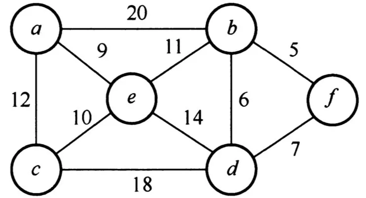
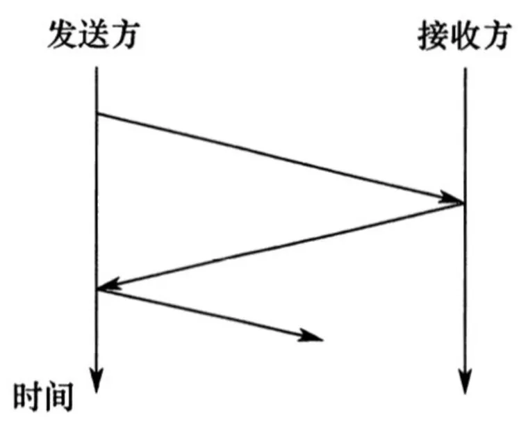
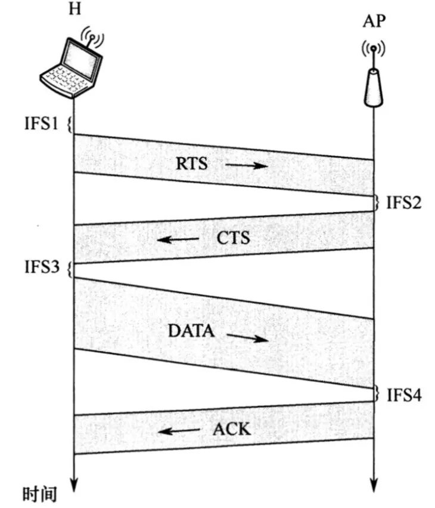
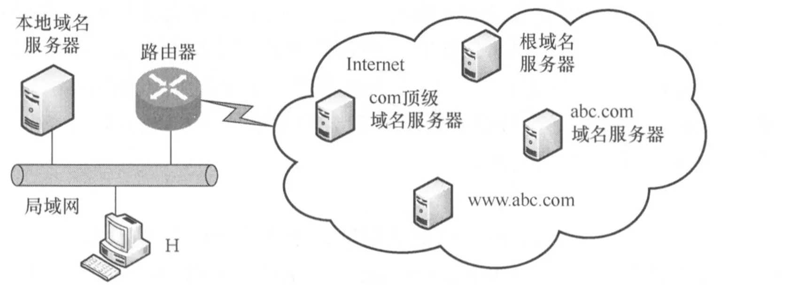
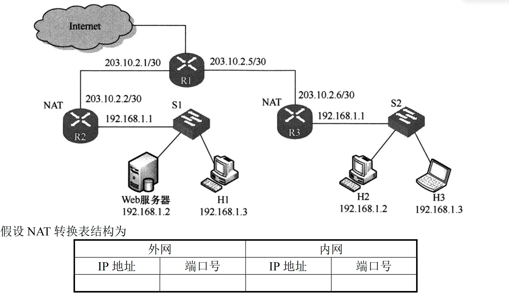

# 2020 年 408 真题 · 答案与解析

> 刷完 [[题面]] 后用此页对答案、看解析。
> 顺序：数据结构（1–11, 41–42）→ 组成原理（12–22, 43–44）→ 操作系统（23–32, 45–46）→ 计算机网络（33–40, 47）

## 一、选择题答案速查表（40 题，每题 2 分，共 80 分）

| 题号 | 1 | 2 | 3 | 4 | 5 | 6 | 7 | 8 | 9 | 10 |
| 答案 | **C** | **D** | **A** | **C** | **B** | **B** | **A** | **B** | **C** | **B** |
| 科目 | 数结 | 数结 | 数结 | 数结 | 数结 | 数结 | 数结 | 数结 | 数结 | 数结 |

| 题号 | 11 | 12 | 13 | 14 | 15 | 16 | 17 | 18 | 19 | 20 |
| 答案 | **A** | **B** | **A** | **D** | **D** | **A** | **B** | **A** | **C** | **C** |
| 科目 | 数结 | 组原 | 组原 | 组原 | 组原 | 组原 | 组原 | 组原 | 组原 | 组原 |

| 题号 | 21 | 22 | 23 | 24 | 25 | 26 | 27 | 28 | 29 | 30 |
| 答案 | **B** | **C** | **B** | **A** | **D** | **D** | **B** | **D** | **B** | **D** |
| 科目 | 组原 | 组原 | 操作 | 操作 | 操作 | 操作 | 操作 | 操作 | 操作 | 操作 |

| 题号 | 31 | 32 | 33 | 34 | 35 | 36 | 37 | 38 | 39 | 40 |
| 答案 | **B** | **C** | **C** | **B** | **C** | **D** | **A** | **D** | **C** | **D** |
| 科目 | 操作 | 操作 | 计网 | 计网 | 计网 | 计网 | 计网 | 计网 | 计网 | 计网 |

> 科目缩写：数结 = 数据结构 | 组原 = 计算机组成原理 | 操作 = 操作系统 | 计网 = 计算机网络

## 二、综合题答案要点速查表（7 题，共 70 分）

| 题号 | 分值 | 科目 | 考点 | 关键结论 |
|------|------|------|------|----------|
| 41 | 13 | 数据结构 | 线性表 | 答案：1、基本思想：用三指针 i、j、k 分别指向三个升序数组，每次计算当前三元组的距离 D=|a−b|+|b−c|+|c−a| 并更新最小距离，然后移动三者中... |
| 42 | 10 | 数据结构 | 树与二叉树 | 答案：1、用一棵二叉树保存编码：每个字符放在叶结点，从根到该叶结点的 0/1 路径即其编码 |
| 43 | 13 | 计算机组成原理 | 数据表示与运算 | 答案：1、乘法可分解为加法和移位：把乘数按位展开，遇 1 就累加被乘数左移相应位数后的值，编译器可将乘法转换为由比较、加法、移位等指令组成的循环 |
| 44 | 10 | 计算机组成原理 | 存储器层次结构 | 答案：1、块内地址 6 位、Cache 组号 6 位（32KB/(64B×8)=64 组），Tag=32−6−6=20 位；8 路组相联 LRU 需 3 位（l... |
| 45 | 7 | 操作系统 | 进程与线程 | 答案：四个同步关系分别用初值为 0 的信号量 SAC、SBC、SCE、SDE 表示 |
| 46 | 8 | 操作系统 | 内存管理 | 答案：1、页面大小 2¹²=4KB，每行 1024 个元素×4B=4KB，正好一页 |
| 47 | 9 | 计算机网络 | 网络层 | 答案：1、两个局域网使用相同网段，需在 R2 上配置 NAT 转换表，将 Web 服务器映射到 R2 的外网地址：外网 IP 203.10.2.2、端口 80 ... |

---

## 三、详细解析

> 以下按题号顺序排列。每题包含题干、选项、答案、解析。
> 图片以相对路径 `images/xxx.webp` 引用，与本文同目录。

### 选择题 · 数据结构

### 1. （2 分 · 栈、队列与数组）

将一个 $10 \times 10$ 对称矩阵 $M$ 的上三角部分的元素 $m_{i,j}$（$1 \le i \le j \le 10$），按列优先存入 C 语言的一维数组 $N$ 中，元素 $m_{7,2}$ 在 $N$ 中的下标是( )。

- **A.** 15
- **B.** 16
- **C.** 22
- **D.** 23

**答案**：C

**解析**：答案 C。由对称性 m₇,₂=m₂,₇，即求第 7 列元素 m₂,₇ 的下标。按列优先，前 6 列共存 1+2+…+6=21 个元素，第 7 列 m₂,₇ 之前还有 1 个；C 语言下标从 0 开始，故下标为 21+1=22。

> 难度 ⭐⭐⭐ ｜ 章节 栈、队列与数组 ｜ 标签 数据结构 / 栈 / 队列 / 数组 / 特殊矩阵

---

### 2. （2 分 · 栈、队列与数组）

对空栈 $S$ 进行 Push 和 Pop 操作，入栈序列为 $a, b, c, d, e$，经过 Push, Push, Pop, Push, Pop, Push, Push, Pop 操作后，得到的出栈序列是( )。

- **A.** b, a, c
- **B.** b, a, e
- **C.** b, c, a
- **D.** b, c, e

**答案**：D

**解析**：答案 D。按操作序列逐步模拟：Push a、Push b 后 Pop 出 b；Push c 后 Pop 出 c；Push d、Push e 后 Pop 出 e，出栈序列为 b,c,e。

> 难度 ⭐⭐ ｜ 章节 栈、队列与数组 ｜ 标签 数据结构 / 栈 / 队列 / 数组

---

### 3. （2 分 · 树与二叉树）

对于任意一棵高度为 $5$ 且有 $10$ 个结点的二叉树，若采用顺序存储结构保存，每个结点占 $1$ 个存储单元（仅存放结点的数据信息），则存放该二叉树需要的存储单元数量至少是( )。

- **A.** 31
- **B.** 16
- **C.** 15
- **D.** 10

**答案**：A

**解析**：答案 A。顺序存储按完全二叉树的层序编号，为满足任意一棵高度为 5 的二叉树，需按最坏情况预留空间；第 5 层最右结点的编号为 2⁵−1=31，故至少需要 31 个存储单元。

> 难度 ⭐⭐⭐ ｜ 章节 树与二叉树 ｜ 标签 数据结构 / 树 / 二叉树 / 二叉树遍历

---

### 4. （2 分 · 树与二叉树）

已知森林 $F$ 及与之对应的二叉树 $T$，若 $F$ 的先根遍历序列是 $a, b, c, d, e, f$，中根遍历序列是 $b, a, d, f, e, c$，则 $T$ 的后序遍历序列是( )。

- **A.** b, a, d, f, e, c
- **B.** b, d, f, e, c, a
- **C.** b, f, e, d, c, a
- **D.** f, e, d, c, b, a

**答案**：C

**解析**：答案 C。森林先根、中根遍历分别对应二叉树的先序、中序遍历，即 T 的先序为 a,b,c,d,e,f，中序为 b,a,d,f,e,c，可唯一构造该二叉树；对其后序遍历得 b,f,e,d,c,a。

> 难度 ⭐⭐⭐⭐ ｜ 章节 树与二叉树 ｜ 标签 数据结构 / 树 / 二叉树 / 二叉树遍历

---

### 5. （2 分 · 查找）

下列给定的关键字输入序列中，不能生成如下二叉排序树的是( )。

```binary-tree
4(2(1, 3), 5)
```

- **A.** 4, 5, 2, 1, 3
- **B.** 4, 5, 1, 2, 3
- **C.** 4, 2, 5, 3, 1
- **D.** 4, 2, 1, 3, 5

**答案**：B

**解析**：答案 B。目标树中 4 的左孩子是 2，故 2 必须先于 1、3 插入。B 序列中 1 先于 2 插入，4 的左孩子会变成 1，生成的树与给定二叉排序树不符；其余选项均能生成目标树。

> 难度 ⭐⭐⭐ ｜ 章节 查找 ｜ 标签 数据结构 / 查找 / 散列表 / B树 / 二叉排序树

---

### 6. （2 分 · 图）

修改递归方式实现的图的深度优先搜索（DFS）算法，将输出（访问）顶点信息的语句移到退出递归前（即执行输出语句后立刻退出递归）。采用修改后的算法遍历有向无环图 $G$，若输出结果中包含 $G$ 中的全部顶点，则输出的顶点序列是 $G$ 的( )。

- **A.** 拓扑有序序列
- **B.** 逆拓扑有序序列
- **C.** 广度优先搜索序列
- **D.** 深度优先搜索序列

**答案**：B

**解析**：答案 B。DFS 中先访问的顶点最后才退出递归；把输出语句移到退出递归前，则每条边 u→v 的 v 先于 u 输出，得到的正是拓扑序列的逆序，即逆拓扑有序序列。

> 难度 ⭐⭐⭐⭐ ｜ 章节 图 ｜ 标签 数据结构 / 图 / 最短路径 / 最小生成树 / 二叉树遍历

---

### 7. （2 分 · 图）

已知无向图 $G$ 如下图所示，使用克鲁斯卡尔（Kruskal）算法求图 $G$ 的最小生成树，加入到最小生成树中的边依次是（ ）。



- **A.** (b,f)(b,d)(a,e)(c,e)(b,e)
- **B.** (b,f)(b,d)(b,e)(a,e)(e,c)
- **C.** (a,e)(b,e)(c,e)(b,d)(b,f)
- **D.** (a,e)(c,e)(b,e)(b,f)(b,d)

**答案**：A

**解析**：答案 A。Kruskal 按权值升序选边，不成环即加入：依次选 (b,f)5、(b,d)6、(a,e)9、(c,e)10、(b,e)11，共 5 条边；权 7 的 (d,f) 与已选边成环而被跳过。

> 难度 ⭐⭐⭐ ｜ 章节 图 ｜ 标签 数据结构 / 图 / 最短路径 / 最小生成树 / 数据链路层

---

### 8. （2 分 · 图）

若使用 AOE 网估算工程进度，则下列叙述中正确的是( )。

- **A.** 关键路径是从源点到汇点边数最多的一条路径
- **B.** 关键路径是从源点到汇点路径长度最长的路径
- **C.** 增加任一关键活动的时间不会延长工程的工期
- **D.** 缩短任一关键活动的时间将会缩短工程的工期

**答案**：B

**解析**：答案 B。关键路径是源点到汇点权值之和最大的路径，不是边数最多，A 错；增加任一关键活动时间都会延长工期，C 错；存在多条关键路径时，缩短一条上的活动不一定缩短工期，D 错。

> 难度 ⭐⭐⭐⭐ ｜ 章节 图 ｜ 标签 数据结构 / 图 / 最短路径 / 最小生成树 / 图算法

---

### 9. （2 分 · 排序）

下列关于大根堆（至少含 $2$ 个元素）的叙述中正确的是( )。

Ⅰ. 可以将堆看成一棵完全二叉树

Ⅱ. 可采用顺序存储方式保存堆

Ⅲ. 可以将堆看成一棵二叉排序树

Ⅳ. 堆中的次大值一定在根的下一层

- **A.** 仅 Ⅰ、Ⅱ
- **B.** 仅 Ⅱ、Ⅲ
- **C.** 仅 Ⅰ、Ⅱ、Ⅳ
- **D.** 仅 Ⅰ、Ⅲ、Ⅳ

**答案**：C

**解析**：答案 C。堆是完全二叉树且采用顺序存储，Ⅰ、Ⅱ 正确；堆只要求父大于子，左右孩子间无序，不是二叉排序树，Ⅲ 错误；堆的左右子树也是大根堆，次大值必为根的左或右孩子，即在根的下一层，Ⅳ 正确。

> 难度 ⭐⭐⭐ ｜ 章节 排序 ｜ 标签 数据结构 / 排序 / 内部排序 / 外部排序 / 二叉排序树 / 二叉树

---

### 10. （2 分 · 查找）

依次将关键字 $5, 6, 9, 13, 8, 2, 12, 15$ 插入初始为空的 $4$ 阶 B 树后，根结点中包含的关键字是( )。

- **A.** 8
- **B.** 6, 9
- **C.** 8, 13
- **D.** 9, 12

**答案**：B

**解析**：答案 B。4 阶 B 树每结点至多 3 个关键字。插入 13 时结点分裂，上提 6 作根；插入 12 时再次分裂，上提 9 并入根，根变为 [6,9]；之后插入 15 只落在最右叶子，根不变，故根含 6、9。

> 难度 ⭐⭐⭐⭐ ｜ 章节 查找 ｜ 标签 数据结构 / 查找 / 散列表 / B树

---

### 11. （2 分 · 排序）

对大部分元素已有序的数组进行排序时，直接插入排序比简单选择排序效率更高，其原因是( )。

Ⅰ. 直接插入排序过程中元素之间的比较次数更少

Ⅱ. 直接插入排序过程中所需要的辅助空间更少

Ⅲ. 直接插入排序过程中元素的移动次数更少

- **A.** 仅 Ⅰ
- **B.** 仅 Ⅲ
- **C.** 仅 Ⅰ、Ⅱ
- **D.** 仅 Ⅰ、Ⅱ和 Ⅲ

**答案**：A

**解析**：答案 A。基本有序时直接插入排序仅需约 n−1 次比较，简单选择排序的比较次数恒为 n(n−1)/2，Ⅰ 正确；两者辅助空间均为 O(1)，Ⅱ 错误；插入排序需后移元素，移动次数不一定更少，Ⅲ 错误。

> 难度 ⭐⭐⭐⭐ ｜ 章节 排序 ｜ 标签 数据结构 / 排序 / 内部排序 / 外部排序 / 排序算法

---

### 综合题 · 数据结构

### 41. （13 分 · 线性表）

定义三元组 (a, b, c)（a, b, c 均为正数）的距离 D = |a - b| + |b - c| + |c - a|。给定 3 个非空整数集合 S₁, S₂, S₃，按升序分别存储在 3 个数组中。请设计一个尽可能高效的算法，计算并输出所有可能的三元组 (a, b, c)（a ∈ S₁, b ∈ S₂, c ∈ S₃）中的最小距离。

例如，S₁ = {-1, 0, 9}，S₂ = {-25, -10, 10, 11}，S₃ = {2, 9, 17, 30, 41}，则最小距离为 2，相应的三元组为 (9, 10, 9)。

要求：

(1) 给出算法的基本设计思想。

(2) 根据设计思想，采用 C 或 C++ 语言描述算法，关键之处给出注释。

(3) 说明你所设计算法的时间复杂度和空间复杂度。

**答案 / 解析**：

答案：1、基本思想：用三指针 i、j、k 分别指向三个升序数组，每次计算当前三元组的距离 D=|a−b|+|b−c|+|c−a| 并更新最小距离，然后移动三者中最小元素所在的指针；由 D=2(max−min) 知距离只取决于最大、最小元素，增大最小值才有机会缩小距离，任一数组遍历完即停止。2、时间 O(n₁+n₂+n₃)，空间 O(1)。核心代码：

```c
int solve(int S1[], int n1, int S2[], int n2, int S3[], int n3) {
    int i = 0, j = 0, k = 0, res = INT_MAX;
    while (i < n1 && j < n2 && k < n3) {
        int a = S1[i], b = S2[j], c = S3[k];
        res = min(res, abs(a - b) + abs(b - c) + abs(a - c));
        int m = min(a, min(b, c));
        if (m == a) i++;
        else if (m == b) j++;
        else k++;
    }
    return res;
}
```

> 难度 ⭐⭐⭐⭐ ｜ 章节 线性表 ｜ 标签 数据结构 / 线性表 / 顺序表 / 链表 / 特殊矩阵

---

### 42. （10 分 · 树与二叉树）

任一个字符的编码都不是其它字符编码的前缀，则称这种编码具有前缀特性。现有某字符集（字符个数 ≥ 2）的不等长编码，每个字符的编码均为二进制的 0、1 序列，最长为 L 位，且具有前缀特性。请回答下列问题：

(1) 哪种数据结构适宜保存上述具有前缀特性的不等长编码？

(2) 基于你所设计的数据结构，简述从 0/1 串到字符串的译码过程。

(3) 简述判定某字符集的不等长编码是否具有前缀特性的过程。

**答案 / 解析**：

答案：1、用一棵二叉树保存编码：每个字符放在叶结点，从根到该叶结点的 0/1 路径即其编码。2、译码：从根开始，从左至右扫描 0/1 串，按当前位沿左（0）或右（1）指针下移，到叶结点时输出其中保存的字符并回到根，重复直至串扫描完。3、判定（同时即建树过程）：初始只有根，依次把每个编码按位插入，遇到空指针就创建新结点；若插入过程中遇到已有叶结点，或处理完整个编码都没有创建新结点，则该编码不具备前缀特性；全部编码通过验证则具有前缀特性。

> 难度 ⭐⭐⭐ ｜ 章节 树与二叉树 ｜ 标签 数据结构 / 树 / 二叉树 / 二叉树遍历 / 物理层

---

### 选择题 · 计算机组成原理

### 12. （2 分 · 计算机系统概述）

下列给出的部件中其位数（宽度）一定与机器字长相同的是（ ）。

I、ALU
II、指令寄存器
III、通用寄存器
IV、浮点寄存器

- **A.** Ⅰ，Ⅱ
- **B.** Ⅰ，Ⅲ
- **C.** Ⅱ，Ⅲ
- **D.** Ⅱ，Ⅲ，IV

**答案**：B

**解析**：答案 B。机器字长等于 CPU 内部整数运算数据通路的宽度，ALU 与通用寄存器必须与之相同；指令寄存器宽度取决于指令字长、浮点寄存器宽度取决于浮点格式，均不一定等于机器字长。

> 难度 ⭐⭐⭐ ｜ 章节 计算机系统概述 ｜ 标签 计算机组成原理 / 计算机系统概述

---

### 13. （2 分 · 数据表示与运算）

已知带符号整数用补码表示，float 型数据用 IEEE 754 标准表示，假定变量 x 的类型只能是 int 或 float。当 x 的机器数为 C800 0000H 时，x 的值可能是（ ）。

- **A.** -7×2²⁷
- **B.** -2¹⁶
- **C.** 2¹⁷
- **D.** 25×2²⁷

**答案**：A

**解析**：答案 A。按 int 补码解读：符号位为 1，取反加 1 得 38000000H=56×2²⁴=7×2²⁷，故值为 −7×2²⁷；按 IEEE 754 单精度解读为 −2¹⁷，不在选项中。

> 难度 ⭐⭐⭐⭐ ｜ 章节 数据表示与运算 ｜ 标签 计算机组成原理 / 数据表示 / 运算

---

### 14. （2 分 · 数据表示与运算）

在按字节编址，采用小端方式的 32 位计算机中，按边界对齐方式为以下 C 语言结构型变量 a 分配存储空间。

```c
struct record {
    short x1;
    int x2;
} a;
```

若 `a` 的首地址为 2020FE00H，a 的成员变量 `x2` 的机器数为 12340000H，则其中 34H 所在存储单元的地址是（ ）。

- **A.** 2020FE03H
- **B.** 2020FE04H
- **C.** 2020FE05H
- **D.** 2020FE06H

**答案**：D

**解析**：答案 D。x1 占 2 字节后，int 型 x2 需 4 字节对齐，从 2020FE04H 开始（FE02、FE03 为填充）；小端方式下 12340000H 低字节到高字节为 00、00、34、12，依次存入 FE04～FE07，故 34H 位于 2020FE06H。

> 难度 ⭐⭐⭐⭐ ｜ 章节 数据表示与运算 ｜ 标签 计算机组成原理 / 数据表示 / 运算

---

### 15. （2 分 · 存储器层次结构）

下列关于 TLB 和 Cache 的叙述中，错误的是（ ）。

- **A.** 命中率都与局部性有关
- **B.** 缺失后都需访问主存
- **C.** 缺失处理都可由硬件实现
- **D.** 都由DRAM组成

**答案**：D

**解析**：答案 D。Cache 由 SRAM 组成，TLB 通常由相联存储器（或 SRAM）组成，DRAM 需刷新且速度慢，不适合；故“都由 DRAM 组成”错误，A、B、C 均为二者的特点。

> 难度 ⭐⭐⭐ ｜ 章节 存储器层次结构 ｜ 标签 计算机组成原理 / 存储器层次结构 / Cache / 地址转换

---

### 16. （2 分 · 指令系统）

某计算机采用 16 位定长指令字格式，操作码位数和寻址方式位数固定，指令系统有 48 条指令，支持直接、间接、立即、相对 4 种寻址方式，单地址指令中直接寻址方式可寻址范围是（ ）。

- **A.** 0～255
- **B.** 0～1023
- **C.** -128～127
- **D.** -512～511

**答案**：A

**解析**：答案 A。48 条指令需 6 位操作码，4 种寻址方式需 2 位，剩 16−6−2=8 位作地址码；直接寻址时地址码即无符号主存地址，可寻址范围 0～2⁸−1=0～255。

> 难度 ⭐⭐⭐ ｜ 章节 指令系统 ｜ 标签 计算机组成原理 / 指令系统 / 寻址方式 / CISC / RISC

---

### 17. （2 分 · 中央处理器）

下列给出的处理器类型中理想情况下 CPI 为 1 的是（ ）。

I、单周期 CPU；
II、多周期 CPU；
III、基本流水线 CPU；
IV、超标量流水线 CPU

- **A.** I、II
- **B.** I、III
- **C.** II、IV
- **D.** III、IV

**答案**：B

**解析**：答案 B。单周期 CPU 每条指令用 1 个时钟周期，CPI=1；基本流水线理想情况下每时钟周期流出一条指令，CPI=1。多周期 CPU 的 CPI 大于 1，超标量流水线 CPI 小于 1。

> 难度 ⭐⭐ ｜ 章节 中央处理器 ｜ 标签 计算机组成原理 / CPU / 数据通路 / 指令流水线 / 性能指标

---

### 18. （2 分 · 中央处理器）

下列关于"自陷"（Trap，也称陷阱）的叙述中错误的是（ ）。

- **A.** 自陷是通过陷阱指令预先设定的一类外部中断事件
- **B.** 自陷可用于实现断点设置和单步跟踪
- **C.** 自陷发生后CPU转去执行OS内核相应程序
- **D.** 自陷处理完后返回陷阱指令下一条指令

**答案**：A

**解析**：答案 A。自陷是执行陷阱指令时主动触发的内部异常，不是外部中断事件；自陷可用于断点设置和单步跟踪（B），发生后转去执行内核程序（C），处理完返回陷阱指令的下一条指令（D），均正确。

> 难度 ⭐⭐⭐ ｜ 章节 中央处理器 ｜ 标签 计算机组成原理 / CPU / 数据通路 / 指令流水线

---

### 19. （2 分 · 总线）

QPI 总线是一种点对点全工双同步串行总线，总线上的设备可同时接收和发送信息，每个方向可同时传输 20 位信息（16 位数据 + 4 位校验位），每个 QPI 数据包有 80 位信息，分 2 个时钟周期传送，每个时钟周期传递 2 次，因此 QPI 总线带宽为每秒传送次数×2B×2。若 QPI 时钟频率为 2.4GHz，则总线带宽为（ ）。

- **A.** 4.8
- **B.** 9.6
- **C.** 19.2
- **D.** 38.4(单位GB/s)

**答案**：C

**解析**：答案 C。每时钟周期传送 2 次，每秒传送次数=2.4G×2=4.8G；带宽=4.8G×2B×2=19.2GB/s。其中 ×2B 表示每次传送 16 位数据，×2 表示全双工双向同时传输。

> 难度 ⭐⭐⭐ ｜ 章节 总线 ｜ 标签 计算机组成原理 / 总线 / 系统总线 / I/O接口 / 性能指标 / 同步与互斥 / 物理层

---

### 20. （2 分 · 中央处理器）

下列事件中属于外部中断事件的是（ ）。

I、访存时缺页；

II、定时器到时；

III、网络数据包到达；

- **A.** 仅 I、II
- **B.** 仅 I、III
- **C.** 仅 II、III
- **D.** I、II、III

**答案**：C

**解析**：答案 C。访存缺页是 CPU 执行指令时检测到的内部异常；定时器到时、网络数据包到达均由 CPU 外部硬件触发，属于外部中断。

> 难度 ⭐⭐ ｜ 章节 中央处理器 ｜ 标签 计算机组成原理 / CPU / 数据通路 / 指令流水线 / 虚拟内存 / I/O方式

---

### 21. （2 分 · 中央处理器）

外部中断包括不可屏蔽中断（NMI）和可屏蔽中断，下列关于外部中断的叙述中错误的是（ ）。

- **A.** 关中断状态也能响应NMI
- **B.** 一旦可屏蔽中断请求信号有效CPU将立即响应
- **C.** NMI优先级比可屏蔽中断高
- **D.** 可通过中断屏蔽字改变可屏蔽中断处理优先级

**答案**：B

**解析**：答案 B。CPU 响应可屏蔽中断须同时满足有中断请求、开中断、一条指令执行完毕，故请求有效不一定立即响应；NMI 关中断时也能响应且优先级最高（A、C 对），中断屏蔽字可改变可屏蔽中断的处理优先级（D 对）。

> 难度 ⭐⭐⭐ ｜ 章节 中央处理器 ｜ 标签 计算机组成原理 / CPU / 数据通路 / 指令流水线 / I/O方式

---

### 22. （2 分 · 输入输出系统）

若设备采用周期挪用 DMA 方式进行输入输出，每次 DMA 传送的数据块大小为 512 字节，相应的 I/O 接口中有一个 32 位数据缓冲寄存器，对于数据输入过程，下列叙述中错误的是（ ）。

- **A.** 每准备好 32 位数据，DMA 控制器就发出一次总线请求
- **B.** 相对于 CPU，DMA 控制器的总线使用权的优先级更高
- **C.** 在整个数据块的传送过程中，CPU 不可以访问主存储器
- **D.** 数据块传送结束时，会产生 "DMA 传送结束"的中断请求

**答案**：C

**解析**：答案 C。周期挪用方式下 DMA 每次只挪用（占用）一个总线周期，其余时间 CPU 仍可访问主存；“整个数据块传送过程中 CPU 不可以访问主存”是停止 CPU 方式的特点，故 C 错误，其余三项均正确。

> 难度 ⭐⭐⭐ ｜ 章节 输入输出系统 ｜ 标签 计算机组成原理 / I/O系统 / 中断 / DMA / I/O方式

---

### 综合题 · 计算机组成原理

### 43. （13 分 · 数据表示与运算）

有实现 $x \times y$ 的两个 C 语言函数如下：

```c
unsigned umul (unsigned x, unsigned y) { return x*y; }
int imul (int x, int y) { return x * y; }
```

假定某计算机 M 中 ALU 只能进行加减运算和逻辑运算。请回答下列问题。

(1) 若 M 的指令系统中没有乘法指令，但有加法、减法和移位等指令，则在 M 上也能实现上述两个函数中的乘法运算，为什么？

(2) 若 M 的指令系统中有乘法指令，则基于 ALU、移位器、寄存器以及相应控制逻辑实现乘法指令时，控制逻辑的作用是什么？

(3) 针对以下三种情况：
①没有乘法指令；
②有使用 ALU 和移位器实现的乘法指令；
③有使用阵列乘法器实现的乘法指令，
函数 `umul()` 在哪种情况下执行时间最长？哪种情况下执行的时间最短？说明理由。

(4) $n$ 位整数乘法指令可保存 $2n$ 位乘积，当仅取低 $n$ 位作为乘积时，其结果可能会发生溢出。当 $n=32$、$x=2^{31}-1$、$y=2$ 时，带符号整数乘法指令和无符号整数乘法指令得到的 $x \times y$ 的 $2n$ 位乘积分别是什么（用十六进制表示）？此时函数 `umul()` 和 `imul()` 的返回结果是否溢出？对于无符号整数乘法运算，当仅取乘积的低位作为乘法结果时，如何用 $2n$ 位乘积进行溢出判断？

**答案 / 解析**：

答案：1、乘法可分解为加法和移位：把乘数按位展开，遇 1 就累加被乘数左移相应位数后的值，编译器可将乘法转换为由比较、加法、移位等指令组成的循环。2、控制逻辑的作用：控制循环次数，控制加法和移位操作。3、①最长、③最短：①要用软件循环执行很多条指令（每条都要取指、译码、取数、执行、存结果），时间最长；②一条乘法指令需多个时钟周期；③阵列乘法器在一个时钟周期内完成，时间最短。4、x×y=(2³¹−1)×2=2³²−2，2n 位乘积为 0000 0000 FFFF FFFEH；imul() 溢出（超出 int 范围），umul() 不溢出。无符号乘法溢出判断：2n 位乘积的高 n 位全为 0 则不溢出，否则溢出。

> 难度 ⭐⭐⭐⭐ ｜ 章节 数据表示与运算 ｜ 标签 计算机组成原理 / 数据表示 / 运算

---

### 44. （10 分 · 存储器层次结构）

假定主存地址为 32 位，按字节编址，指令 Cache 和数据 Cache 与主存之间均采用 8 路组相联映射方式，直写（WriteThrough）写策略和 LRU 替换算法，主存块大小为 64B，数据区容量各为 32KB。开始时 Cache 均为空。请回答下列问题。

(1) Cache 每一行中标记（Tag）、LRU 位各占几位？是否有修改位？

(2) 有如下 C 语言程序段：

```c
for(k = 0; k < 1024; k++)
    s[k] = 2 * s[k];
```

若数组 s 及其变量 k 均为 int 型，int 型数据占 4B，变量 k 分配在寄存器中，数组 s 在主存中的起始地址为 008000C0H，则该程序段执行过程中，访问数组 s 的数据 Cache 缺失次数为多少？

(3) 若 CPU 最先开始的访问操作是读取主存单元 00010003H 中的指令，简要说明从 Cache 中访问该指令的过程，包括 Cache 缺失处理过程。```c
for(k = 0; k < 1024; k++)
    s[k] = 2 * s[k];
```

若数组 s 及其变量 k 均为 int 型，int 型数据占 4B，变量 k 分配在寄存器中，数组 s 在主存中的起始地址为 008000C0H，则该程序段执行过程中，访问数组 s 的数据 Cache 缺失次数为多少？
- （3）若 CPU 最先开始的访问操作是读取主存单元 00010003H 中的指令，简要说明从 Cache 中访问该指令的过程，包括 Cache 缺失处理过程。

**答案 / 解析**：

答案：1、块内地址 6 位、Cache 组号 6 位（32KB/(64B×8)=64 组），Tag=32−6−6=20 位；8 路组相联 LRU 需 3 位（log₂8）；直写策略无修改位。2、s 起始地址 008000C0H 低 6 位全 0，恰在块边界；数组共 1024×4B/64B=64 个主存块，每块 16 个元素，每块首次访问缺失后整块调入，之后全部命中，缺失次数为 64。3、00010003H 中 6 位组号为 0，映射到指令 Cache 第 0 组；Cache 初始为空、有效位均为 0，故缺失。处理：从主存读出该 64B 主存块存入第 0 组任一行，将高 20 位标记 00010H 填入标记字段，置有效位并修改 LRU 位，最后按块内地址 000011B 取出指令。

> 难度 ⭐⭐⭐⭐ ｜ 章节 存储器层次结构 ｜ 标签 计算机组成原理 / 存储器层次结构 / Cache

---

### 选择题 · 操作系统

### 23. （2 分 · 文件管理）

若多个进程共享同一个文件 F，则下列叙述中，正确的是（ ）。

- **A.** 各进程只能用"读"方式打开文件 F
- **B.** 在系统打开文件表中仅有一个表项包含 F 的属性
- **C.** 各进程的用户打开文件表中关于 F 的表项内容相同
- **D.** 进程关闭 F 时，系统删除 F 在系统打开文件表中的表项

**答案**：B

**解析**：答案 B。系统打开文件表全系统只有一张，同一文件被多次打开只增加引用计数，其中仅一个表项含 F 的属性；各进程可按需以读或写方式打开（A 错），用户表项内容可不同（C 错），引用计数减为 0 才删除表项（D 错）。

> 难度 ⭐⭐⭐ ｜ 章节 文件管理 ｜ 标签 操作系统 / 文件系统 / 文件 / 目录 / 磁盘

---

### 24. （2 分 · 文件管理）

下列选项中，支持文件长度可变、随机访问的磁盘存储空间分配方式是（ ）。

- **A.** 索引分配
- **B.** 链接分配
- **C.** 连续分配
- **D.** 动态分区分配

**答案**：A

**解析**：答案 A。索引分配将各数据块地址集中存于索引表，可随机访问，文件变长只需增删索引项；链接分配只能顺指针访问，不能随机访问；连续分配难以扩展；动态分区分配是内存管理方式。

> 难度 ⭐⭐ ｜ 章节 文件管理 ｜ 标签 操作系统 / 文件系统 / 文件 / 目录 / 磁盘

---

### 25. （2 分 · 输入输出管理）

下列与中断相关的操作中，由操作系统完成的是（）。

Ⅰ、保存被中断程序的中断点

Ⅱ、提供中断服务

Ⅲ、初始化中断向量表

Ⅳ、保存中断屏蔽字

- **A.** 仅Ⅰ、Ⅱ
- **B.** 仅Ⅰ、Ⅱ、Ⅳ
- **C.** 仅Ⅲ、Ⅳ
- **D.** 仅Ⅱ、Ⅲ、Ⅳ

**答案**：D

**解析**：答案 D。保存被中断程序的中断点（断点）由硬件自动完成，Ⅰ 错误；提供中断服务、初始化中断向量表、保存中断屏蔽字均由操作系统完成，Ⅱ、Ⅲ、Ⅳ 正确。

> 难度 ⭐⭐⭐⭐ ｜ 章节 输入输出管理 ｜ 标签 操作系统 / I/O系统 / 中断 / DMA / I/O方式

---

### 26. （2 分 · 进程与线程）

下列与进程调度有关的因素中，在设计多级反馈队列调度算法时需要考虑的是（ ）。

Ⅰ. 就绪队列的数量

Ⅱ. 就绪队列的优先级

Ⅲ. 各就绪队列的调度算法

Ⅳ. 进程在就绪队列间的迁移条件

- **A.** 仅Ⅰ、Ⅱ
- **B.** 仅Ⅲ、Ⅳ
- **C.** 仅Ⅱ、Ⅲ、Ⅳ
- **D.** Ⅰ、Ⅱ、Ⅲ和Ⅳ

**答案**：D

**解析**：答案 D。设计多级反馈队列调度算法需确定就绪队列的数量、各队列的优先级、各队列的调度算法以及进程在队列间的迁移条件，Ⅰ～Ⅳ 均需考虑。

> 难度 ⭐⭐ ｜ 章节 进程与线程 ｜ 标签 操作系统 / 进程管理 / 进程 / 线程 / 同步 / PV操作 / 队列 / 进程调度

---

### 27. （2 分 · 进程与线程）

某系统中有 A、B 两类资源各 6 个，t 时刻资源分配及需求情况如下表所示。

| 进程 | A 已分配数量 | B 已分配数量 | A 需求总量 | B 需求总量 |
| ---- | ------------ | ------------ | ---------- | ---------- |
| P1   | 2            | 3            | 4          | 4          |
| P2   | 2            | 1            | 3          | 1          |
| P3   | 1            | 2            | 3          | 4          |

t 时刻安全性检测结果是（ ）。

- **A.** 存在安全序列 P1、P2、P3
- **B.** 存在安全序列 P2、P1、P3
- **C.** 存在安全序列 P2、P3、P1
- **D.** 不存在安全序列

**答案**：B

**解析**：答案 B。已分配 A、B 共 (5,6)，Available=(1,0)，需求 P1(2,1)、P2(1,0)、P3(2,2)。初始仅 P2 可满足，释放后 Work=(3,1) 满足 P1，再得 Work=(5,4) 满足 P3，安全序列为 P2、P1、P3。

> 难度 ⭐⭐⭐ ｜ 章节 进程与线程 ｜ 标签 操作系统 / 进程管理 / 进程 / 线程 / 同步 / PV操作

---

### 28. （2 分 · 内存管理）

下列因素中，影响请求分页系统有效（平均）访存时间的是（ ）。

Ⅰ. 缺页率

Ⅱ. 磁盘读写时间

Ⅲ. 内存访问时间

Ⅳ. 执行缺页处理程序的 CPU 时间

- **A.** 仅Ⅱ、Ⅲ
- **B.** 仅Ⅰ、Ⅳ
- **C.** 仅Ⅰ、Ⅲ、Ⅳ
- **D.** Ⅰ、Ⅱ、Ⅲ和Ⅳ

**答案**：D

**解析**：答案 D。缺页率影响缺页中断的频率，磁盘读写时间和缺页处理程序的 CPU 时间影响缺页处理开销，内存访问时间影响访问页表及目标物理地址的时间，四者均影响有效访存时间。

> 难度 ⭐⭐ ｜ 章节 内存管理 ｜ 标签 操作系统 / 内存管理 / 分页 / 分段 / 虚拟内存 / 页面置换 / 磁盘 / 内存分配

---

### 29. （2 分 · 进程与线程）

下列关于父进程与子进程的叙述中，错误的是（ ）。

- **A.** 父进程与子进程可以并发执行
- **B.** 父进程与子进程共享虚拟地址空间
- **C.** 父进程与子进程有不同的进程控制块
- **D.** 父进程与子进程不能同时使用同一临界资源

**答案**：B

**解析**：答案 B。创建子进程时会为子进程分配独立的虚拟地址空间，父进程与子进程不共享虚拟地址空间，B 错误；父子可并发执行、各有独立 PCB、不能同时使用同一临界资源，A、C、D 均正确。

> 难度 ⭐⭐⭐ ｜ 章节 进程与线程 ｜ 标签 操作系统 / 进程管理 / 进程 / 线程 / 同步 / PV操作

---

### 30. （2 分 · 输入输出管理）

对于具备设备独立性的系统，下列叙述中，错误的是（ ）。

- **A.** 可以使用文件名访问物理设备
- **B.** 用户程序使用逻辑设备名访问物理设备
- **C.** 需要建立逻辑设备与物理设备之间的映射关系
- **D.** 更换物理设备后必须修改访问该设备的应用程序

**答案**：D

**解析**：答案 D。设备可视为特殊文件（A 对），用户程序用逻辑设备名访问物理设备（B 对），系统需建立逻辑设备与物理设备的映射（C 对）；更换物理设备只需更换驱动程序，无须修改应用程序，D 错误。

> 难度 ⭐⭐ ｜ 章节 输入输出管理 ｜ 标签 操作系统 / I/O系统 / 中断 / DMA / 设备管理

---

### 31. （2 分 · 文件管理）

某文件系统的目录项由文件名和索引结点号构成。若每个目录项长度为 64 字节，其中 4 字节存放索引结点号，60 字节存放文件名。文件名由小写英文字母构成，则该文件系统能创建的文件数量的上限为（ ）。

- **A.** 2^26
- **B.** 2^32
- **C.** 2^60
- **D.** 2^64

**答案**：B

**解析**：答案 B。不同目录下文件名可以相同，故文件数量上限由索引结点号位数决定；索引结点号占 4 字节即 32 位，最多可表示 2³² 个文件。

> 难度 ⭐⭐⭐ ｜ 章节 文件管理 ｜ 标签 操作系统 / 文件系统 / 文件 / 目录 / 磁盘

---

### 32. （2 分 · 进程与线程）

下列准则中，实现临界区互斥机制必须遵循的是（ ）。

Ⅰ、两个进程不能同时进入临界区

Ⅱ、允许进程访问空闲的临界资源

Ⅲ、进程等待进入临界区的时间是有限的

Ⅳ、不能进入临界区的执行态进程立即放弃 CPU

- **A.** 仅Ⅰ、Ⅳ
- **B.** 仅Ⅱ、Ⅲ
- **C.** 仅Ⅰ、Ⅱ、Ⅲ
- **D.** 仅Ⅰ、Ⅲ、Ⅳ

**答案**：C

**解析**：答案 C。实现临界区互斥必须遵循忙则等待（Ⅰ）、空闲让进（Ⅱ）、有限等待（Ⅲ）三条准则；Ⅳ 让权等待并非必须，如 Peterson 算法即可在不放弃 CPU 的情况下实现互斥。

> 难度 ⭐⭐⭐ ｜ 章节 进程与线程 ｜ 标签 操作系统 / 进程管理 / 进程 / 线程 / 同步 / PV操作 / 同步与互斥

---

### 综合题 · 操作系统

### 45. （7 分 · 进程与线程）

现有 5 个操作 A、B、C、D、E，约束：

- 操作 C 必须在 A 和 B 完成后执行
- 操作 E 必须在 C 和 D 完成后执行

请使用信号量的 `wait()`、`signal()` 操作（P、V 操作）描述上述操作之间的同步关系，并说明所用信号量及其初值。

**答案 / 解析**：

答案：四个同步关系分别用初值为 0 的信号量 SAC、SBC、SCE、SDE 表示。A 执行完 V(SAC)，B 执行完 V(SBC)；C 先 P(SAC)、P(SBC) 再执行，执行完 V(SCE)；D 执行完 V(SDE)；E 先 P(SCE)、P(SDE) 再执行。核心代码：

```c
semaphore SAC = 0, SBC = 0, SCE = 0, SDE = 0;
A() { 操作A; V(SAC); }
B() { 操作B; V(SBC); }
C() { P(SAC); P(SBC); 操作C; V(SCE); }
D() { 操作D; V(SDE); }
E() { P(SCE); P(SDE); 操作E; }
```

> 难度 ⭐⭐ ｜ 章节 进程与线程 ｜ 标签 操作系统 / 进程管理 / 进程 / 线程 / 同步 / PV操作 / 同步与互斥

---

### 46. （8 分 · 内存管理）

某 32 位系统采用基于二级页表的请求分页存储管理方式，按字节编址，页目录项和页表项长度均为 4 字节，虚拟地址结构如下：

| 位段 | 内容 |
| --- | --- |
| 31～22 | 页目录号 |
| 21～12 | 页号 |
| 11～0 | 页内偏移 |

某 C 程序中数组 `a[1024][1024]` 的起始虚拟地址为 1080 0000H，数组元素占 4 字节。该程序运行时，其进程的页目录起始物理地址为 0020 1000H。请回答下列问题：

(1) 数组元素 `a[1][2]` 的：
- 虚拟地址是什么？
- 对应的页目录号和页号分别是什么？
- 对应的页目录项的物理地址是什么？
- 若该目录项中存放的页框号为 00301H，则 `a[1][2]` 所在页对应的页表项的物理地址是什么？

(2) 数组 `a` 在虚拟地址空间中所占区域是否必须连续？在物理地址空间中所占区域是否必须连续？

(3) 已知数组 `a` 按行优先方式存放，若对数组 `a` 分别按行遍历和按列遍历，哪一种遍历方式的局部性更好？

**答案 / 解析**：

答案：1、页面大小 2¹²=4KB，每行 1024 个元素×4B=4KB，正好一页。a[1][2] 的虚拟地址=10800000H+1×4096+2×4=10801008H；按虚地址结构（页目录号 10 位、页号 10 位、偏移 12 位）划分，页目录号=042H，页号=001H；页目录项物理地址=00201000H+042H×4=00201108H；页框号 00301H 对应二级页表起始地址 00301000H，页表项物理地址=00301000H+001H×4=00301004H。2、虚拟地址空间必须连续（数组按行优先连续存放、支持随机存取）；物理地址空间不必连续（相邻虚页可映射到任意页框）。3、每页正好存放一整行，按行遍历时同一行元素位于同一页内，局部性更好。

> 难度 ⭐⭐⭐ ｜ 章节 内存管理 ｜ 标签 操作系统 / 内存管理 / 分页 / 分段 / 虚拟内存 / 页面置换 / 二叉树遍历 / 地址转换 / 内存分配 / 文件系统

---

### 选择题 · 计算机网络

### 33. （2 分 · 计算机网络体系结构）

下图描述的协议要素是（ ）。



题选要素：

Ⅰ. 语法

Ⅱ. 语义

Ⅲ. 时序

- **A.** 仅 Ⅰ
- **B.** 仅 Ⅱ
- **C.** 仅 Ⅲ
- **D.** Ⅰ、Ⅱ、Ⅲ

**答案**：C

**解析**：答案 C。协议三要素中，语法规定数据格式，语义规定控制信息与应答的含义，时序规定信息交流的次序；图中双方按时间依次交换信息，体现的是时序要素。

> 难度 ⭐ ｜ 章节 计算机网络体系结构 ｜ 标签 计算机网络 / 计算机网络体系结构

---

### 34. （2 分 · 网络层）

下列关于虚电路网络的叙述中错误的是（ ）。

- **A.** 可以确保数据分组传输顺序
- **B.** 需要为每条虚电路预分配带宽
- **C.** 建立虚电路时需要进行路由选择
- **D.** 依据虚电路号（VCID）进行数据分组转发

**答案**：B

**解析**：答案 B。虚电路建立时确定路由，分组按虚电路号转发，同一虚电路的分组沿同一路由到达，可保证传输顺序（A 对）；但虚电路属分组交换，各虚电路共享链路带宽，无须预分配带宽，B 错误。

> 难度 ⭐⭐⭐ ｜ 章节 网络层 ｜ 标签 计算机网络 / 网络层 / IP / 路由 / 子网划分 / CIDR

---

### 35. （2 分 · 数据链路层）

下图所示的网络冲突域和广播域的个数分别是（ ）。


- **A.** 2，2
- **B.** 2，4
- **C.** 4，2
- **D.** 4，4

**答案**：C

**解析**：答案 C。路由器可隔离广播域和冲突域，普通交换机只隔离冲突域，集线器两者都不隔离。图中路由器两侧各 1 个广播域，共 2 个；4 个集线器各对应 1 个冲突域，共 4 个。

> 难度 ⭐⭐⭐ ｜ 章节 数据链路层 ｜ 标签 计算机网络 / 数据链路层 / MAC / CSMA/CD / PPP / 内存分配

---

### 36. （2 分 · 数据链路层）

假设主机甲采用停等协议向主机乙发送数据帧，数据帧长与确认帧长均为 1000 B。数据传输速率是 10 kbps，单向传播延时是 200 ms。则甲的最大信道利用率（ ）。

- **A.** 80%
- **B.** 66.7%
- **C.** 44.4%
- **D.** 40%

**答案**：D

**解析**：答案 D。发送数据帧和确认帧的时间均为 1000×8/10kbps=800ms；一个发送周期=800+200+800+200=2000ms，信道利用率=800/2000=40%。

> 难度 ⭐⭐⭐ ｜ 章节 数据链路层 ｜ 标签 计算机网络 / 数据链路层 / MAC / CSMA/CD / PPP

---

### 37. （2 分 · 数据链路层）

某 IEEE 802.11 无线局域网中主机 H 与 AP 之间发送或接收 CSMA/CA 帧的过程如下图所示，在 H 或 AP 发送帧前所等待的帧间间隔时间（IFS）中最长的是（ ）。



- **A.** IFS1
- **B.** IFS2
- **C.** IFS3
- **D.** IFS4

**答案**：A

**解析**：答案 A。IFS1 是发送 RTS 前等待的 DIFS（分布式协调帧间间隔），时间最长；IFS2、IFS3、IFS4 分别是发送 CTS、DATA、ACK 前的 SIFS（短帧间间隔），时间最短。

> 难度 ⭐⭐⭐ ｜ 章节 数据链路层 ｜ 标签 计算机网络 / 数据链路层 / MAC / CSMA/CD / PPP

---

### 38. （2 分 · 传输层）

若主机甲与主机乙已建立一条 TCP 连接，最大段长（MSS）为 1 KB，往返时间（RTT）为 2 ms，则在不出现拥塞的前提下，拥塞窗口从 8 KB 增长到 32 KB 所需的最长时间是：

- **A.** 4 ms
- **B.** 8 ms
- **C.** 24 ms
- **D.** 48 ms

**答案**：D

**解析**：答案 D。求最长时间，可假定慢开始门限不大于 8KB，使窗口全程处于拥塞避免阶段：每 RTT 加 1KB，从 8KB 到 32KB 需 24 个 RTT，即 24×2ms=48ms。

> 难度 ⭐⭐⭐ ｜ 章节 传输层 ｜ 标签 计算机网络 / 传输层 / TCP / UDP / 拥塞控制

---

### 39. （2 分 · 传输层）

若主机甲与主机乙建立 TCP 连接时发送的 SYN 段中的序号为 1000，在断开连接时，甲发送给乙的 FIN 段中的序号为 5001，则在无任何重传的情况下，甲向乙已经发送的应用层数据的字节数为：

- **A.** 4002
- **B.** 4001
- **C.** 4000
- **D.** 3999

**答案**：C

**解析**：答案 C。SYN 段占 1 个序号，数据传输阶段的起始序号为 1001；FIN 段序号为 5001，在无重传的情况下，已发送的应用层数据字节数=5001−1001=4000。

> 难度 ⭐⭐⭐ ｜ 章节 传输层 ｜ 标签 计算机网络 / 传输层 / TCP / UDP / 拥塞控制

---

### 40. （2 分 · 应用层）

假设下图所示网络中的本地域名服务器只提供递归查询服务，其他域名的服务器均只提供迭代查询服务；局域网内主机访问 Internet 上各服务器的往返时间（RTT）均为 10 ms，忽略其他各种时延。若主机 H 通过超链接 `http://www.abc.com/index.html` 请求浏览纯文本 Web 页 index.html，则从点击超链接开始到浏览器接收到 index.html 页面为止，所需最短、最长时间分别是（ ）。



- **A.** 10 ms, 40 ms
- **B.** 10 ms, 50 ms
- **C.** 20 ms, 40 ms
- **D.** 20 ms, 50 ms

**答案**：D

**解析**：答案 D。H 与本地 DNS 在同一局域网，该跳时延忽略。最短：DNS 缓存命中，建 TCP 连接加 HTTP 请求响应共 2 个 RTT，即 20ms；最长：本地 DNS 迭代查询根、com、abc.com 共 3 个 RTT，再加 2 个 RTT 取页面，共 5 个 RTT，即 50ms。

> 难度 ⭐⭐⭐ ｜ 章节 应用层 ｜ 标签 计算机网络 / 应用层 / HTTP / DNS / FTP / SMTP

---

### 综合题 · 计算机网络

### 47. （9 分 · 网络层）

某校园网有两个局域网，通过路由器 R1、R2 和 R3 互联后接入 Internet，S1 和 S2 为以太网交换机，局域网采用静态 IP 地址配置，路由器部分接口以及各主机的 IP 地址如图所示：



请回答下列问题：

(1) 为使 H2 和 H3 能够访问 Web 服务器（使用默认端口号），需要进行什么配置？

(2) 若 H2 主动访问 Web 服务器时，将 HTTP 请求报文封装到 IP 数据报 P 中发送，则 H2 发送 P 的源 IP 地址和目的 IP 地址分别是什么？经过 R3 转发后，P 的源 IP 地址和目的 IP 地址分别是什么？经过 R2 转发后，P 的源 IP 地址和目的 IP 地址分别是什么？

**答案 / 解析**：

答案：1、两个局域网使用相同网段，需在 R2 上配置 NAT 转换表，将 Web 服务器映射到 R2 的外网地址：外网 IP 203.10.2.2、端口 80 ↔ 内网 IP 192.168.1.2、端口 80（Web 默认端口为 80）。2、H2 发送时：源 IP 192.168.1.2，目的 IP 203.10.2.2；经 R3 转发后：源 IP 改为 203.10.2.6，目的 IP 不变仍为 203.10.2.2；经 R2 转发后：源 IP 不变为 203.10.2.6，目的 IP 改为 Web 服务器的内网地址 192.168.1.2。

> 难度 ⭐⭐⭐⭐ ｜ 章节 网络层 ｜ 标签 计算机网络 / 网络层 / IP / 路由 / 子网划分 / CIDR / 指令流水线 / 内存分配 / 应用层 / 数据链路层


## See Also

- [[题面]] — 仅题干与选项，用于限时刷题
- [[../408历年真题总目录]] — 历年真题总目录
- [[408考情分析]] — 试卷构成与逐年考点统计
