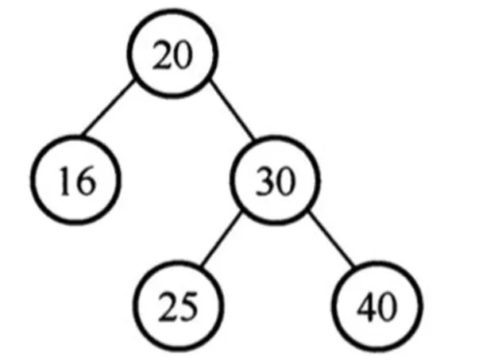
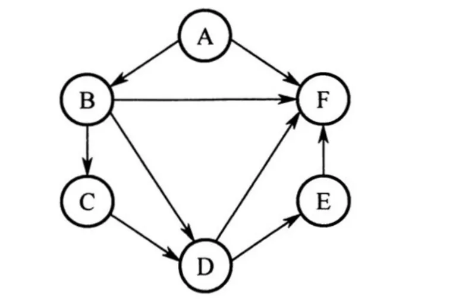
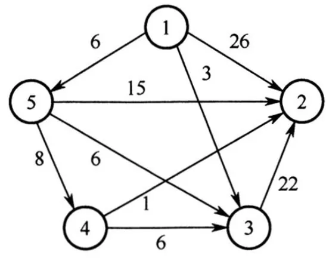
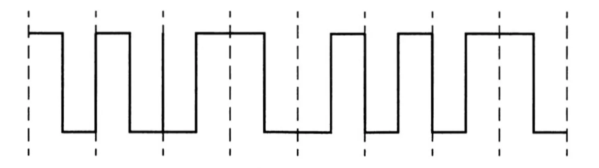
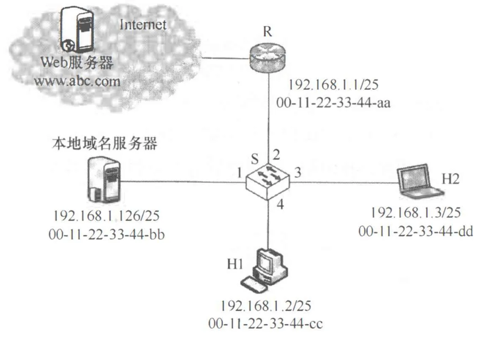

# 2021 年 408 真题 · 题面

> 共 47 题（选择 40 题 + 综合 7 题）。仅题干与选项，不含答案。
> 刷完后对答案、看解析：[[答案与解析]]

## 一、单项选择题（40 题，每题 2 分，共 80 分）

### 1.

已知头指针 h 指向一个带头结点的非空单循环链表，结点结构为

```
------------
|data |next|
------------
```

其中 `next` 是指向直接后继结点的指针，`p` 是尾指针，`q` 是临时指针。现要删除该链表的第一个元素，正确的语句序列是（ ）。

- **A.** `h->next = h->next->next; q = h->next; free(q);`
- **B.** `q = h->next; h->next = h->next->next; free(q);`
- **C.** `q = h->next; h->next = q->next; if (p != q) p = h; free(q);`
- **D.** `q = h->next; h->next = q->next; if (p == q) p = h; free(q);`

---

### 2.

已知初始为空的队列 Q 的一端仅能进行入队操作，另外一端既能进行入队操作又能进行出队操作。若 Q 的入队序列是 1, 2, 3, 4, 5，则不能得到的出队序列是( )。

- **A.** 5,4,3,1,2
- **B.** 5,3,1,2,4
- **C.** 4,2,1,3,5
- **D.** 4,1,3,2,5

---

### 3.

已知二维数组 A 按行优先方式存储，每个元素占用 1 个存储单元。若元素 A[0][0] 的存储地址是 100, A[3][3] 的存储地址是 220 , 则元素 A[5][5] 的存储地址是( )。

- **A.** 295
- **B.** 300
- **C.** 301
- **D.** 306

---

### 4.

某森林 F 对应的二叉树为 T , 若 T 的先序遍历序列是 a, b, d, c, e, g, f , 中序遍历序列是 b, d, a, e, g, c, f , 则 F 中树的棵数是( )。

- **A.** 1
- **B.** 2
- **C.** 3
- **D.** 4

---

### 5.

若某二叉树有 5 个叶结点，其权值分别为 10、12、16、21、30，则其最小的带权路径长度(WPL)是( )。

- **A.** 89
- **B.** 200
- **C.** 208
- **D.** 289

---

### 6.

给定平衡二叉树如下图所示，插入关键字 23 后，根中的关键字是（ ）。



- **A.** 16
- **B.** 20
- **C.** 23
- **D.** 25

---

### 7.

给定如下有向图，该图的拓扑有序序列的个数是( )。



- **A.** 1
- **B.** 2
- **C.** 3
- **D.** 4

---

### 8.

使用 Dijkstra 算法求下图中从顶点 1 到其余各顶点的最短路径，将当前找到的从顶点 1 到顶点 2, 3, 4, 5 的最短路径长保存在数组 dist 中，求出第二条最短路径后，dist 中的内容更新为（ ）。



- **A.** 26, 3, 14, 6
- **B.** 25, 3, 14, 6
- **C.** 21, 3, 14, 6
- **D.** 15, 3, 14, 6

---

### 9.

在一棵高度为 3 的 3 阶 B 树中，根为第 1 层，若第 2 层中有 4 个关键字，则该树的结点个数最多是( )。

- **A.** 11
- **B.** 10
- **C.** 9
- **D.** 8

---

### 10.

设数组 S[] = {93, 946, 372, 9, 146, 151, 301, 485, 236, 327, 43, 892}, 采用最低位优先(LSD)基数排序将 S 排列成升序序列。第 1 趟分配、收集后，元素 372 之前、之后紧邻的元素分别是 (  )。

- **A.** 43, 892
- **B.** 236, 301
- **C.** 301, 892
- **D.** 485, 301

---

### 11.

将关键字 6, 9, 1, 5, 8, 4, 7 依次插入到初始为空的大根堆 H 中，得到的 H 是（）。

- **A.** 9, 8, 7, 6, 5, 4, 1
- **B.** 9, 8, 7, 5, 6, 1, 4
- **C.** 9, 8, 7, 5, 6, 4, 1
- **D.** 9, 6, 7, 5, 8, 4, 1

---

### 12.

2017 年公布的全球超级计算机 TOP500 排名中，我国"神威·太湖之光"超级计算机蝉联第一，其浮点运算速度为 93.0146 PFLOPS，说明该计算机每秒钟完成的浮点操作次数为（ ）。

- **A.** 9.3×10¹³ 次
- **B.** 9.3×10¹⁵ 次
- **C.** 9.3 千万亿次
- **D.** 9.3 亿亿次

---

### 13.

已知带符号整数用补码表示，变量 x、y、z 的机器数分别为 FFFDH、FFDFH、7FFCH，下列结论中，正确的是（ ）。

- **A.** 若 x、y 和 z 为无符号整数，则 z < x < y
- **B.** 若 x、y 和 z 为无符号整数，则 x < y < z
- **C.** 若 x、y 和 z 为带符号整数，则 x < y < z
- **D.** 若 x、y 和 z 为带符号整数，则 y < x < z

---

### 14.

下列数值中，不能用 IEEE 754 浮点格式精确表示的是（ ）。

- **A.** 1.2
- **B.** 1.25
- **C.** 2.0
- **D.** 2.5

---

### 15.

某计算机的存储器总线中有 24 位地址线和 32 位数据线，按字编址，字长为 32 位。若 000000H～3FFFFFH 为 RAM 区，则需要 512K×8 位的 RAM 芯片数为（ ）。

- **A.** 8
- **B.** 16
- **C.** 32
- **D.** 64

---

### 16.

若计算机主存地址为 32 位，按字节编址，Cache 数据区大小为 32KB，主存块大小为 32B，采用直接映射方式和回写策略，则 Cache 行的位数至少是（ ）。

- **A.** 275
- **B.** 274
- **C.** 258
- **D.** 257

---

### 17.

下列存储器中，汇编语言程序员可见的是（ ）。

Ⅰ. 指令寄存器

Ⅱ. 微指令寄存器

Ⅲ. 基址寄存器

Ⅳ. 标志状态寄存器

- **A.** 仅Ⅰ、Ⅱ
- **B.** 仅Ⅰ、Ⅳ
- **C.** 仅Ⅱ、Ⅳ
- **D.** 仅Ⅲ、Ⅳ

---

### 18.

下列关于数据通路的叙述中，错误的是（ ）。

- **A.** 数据通路包含 ALU 等组合逻辑元件
- **B.** 数据通路包含寄存器等时序逻辑元件
- **C.** 数据通路不包含用于异常事件检测及响应的电路
- **D.** 数据通路中的数据流动路径由控制信号进行控制

---

### 19.

下列关于总线的叙述中，错误的是（ ）。

- **A.** 总线是在两个或多个部件之间进行数据交换的传输介质
- **B.** 同步总线由时钟信号定时，时钟频率不一定等于工作频率
- **C.** 异步总线由握手信号定时，一次握手过程完成一位数据交换
- **D.** 突发传送总线事务可以在总线上连续传送多个数据

---

### 20.

下列选项中不属于 I/O 接口的是（ ）。

- **A.** 磁盘驱动器
- **B.** 打印机适配器
- **C.** 网络控制器
- **D.** 可编程中断控制器

---

### 21.

异常事件在当前指令执行过程中进行检测，中断请求则在当前指令执行后进行检测。下列事件中，相应处理程序执行后，必须回到当前指令重新执行的是（ ）。

- **A.** 系统调用
- **B.** 页缺失
- **C.** DMA传送结束
- **D.** 打印机缺纸

---

### 22.

下列是关于多重中断系统中 CPU 响应中断的叙述，其中错误的是（ ）。

- **A.** 仅在用户态（执行用户程序）下，CPU 才能检测和响应中断
- **B.** CPU 只有在检测到中断请求信号后，才会进入中断响应周期
- **C.** 进入中断响应周期时，CPU 一定处于中断允许（开中断）状态
- **D.** 若 CPU 检测到中断请求信号，则一定存在未被屏蔽的中断源请求信号

---

### 23.

下列指令中，只能在内核态执行的是（ ）。

- **A.** trap 指令
- **B.** I/O 指令
- **C.** 数据传送指令
- **D.** 设置断点指令

---

### 24.

下列操作中，操作系统在创建新进程时，必须完成的是（ ）。

Ⅰ. 申请空白的进程控制块
Ⅱ. 初始化进程控制块
Ⅲ. 设置进程状态为执行态

- **A.** 仅 Ⅰ
- **B.** 仅 Ⅰ、Ⅱ
- **C.** 仅 Ⅰ、Ⅲ
- **D.** 仅 Ⅱ、Ⅲ

---

### 25.

下列内核的数据结构或程序中，分时系统实现时间片轮转调度需要使用的是（ ）。

Ⅰ. 进程控制块
Ⅱ. 时钟中断处理程序
Ⅲ. 进程就绪队列
Ⅳ. 进程阻塞队列

- **A.** 仅 Ⅱ、Ⅲ
- **B.** 仅 Ⅰ、Ⅳ
- **C.** 仅 Ⅰ、Ⅱ、Ⅲ
- **D.** 仅 Ⅰ、Ⅱ、Ⅳ

---

### 26.

某系统中磁盘的磁道数为 200（0～199），磁头当前在 184 号磁道上。用户进程提出的磁盘访问请求对应的磁道号依次为 184, 187, 176, 182, 199。若采用最短寻道时间优先调度算法（SSTF）完成磁盘访问，则磁头移动的距离（磁道数）是（ ）。

- **A.** 37
- **B.** 38
- **C.** 41
- **D.** 42

---

### 27.

下列事件中，可能引起进程调度程序执行的是（ ）。

Ⅰ. 中断处理结束
Ⅱ. 进程阻塞
Ⅲ. 进程执行结束
Ⅳ. 进程的时间片用完

- **A.** 仅 Ⅰ、Ⅲ
- **B.** 仅 Ⅱ、Ⅳ
- **C.** 仅 Ⅲ、Ⅳ
- **D.** Ⅰ、Ⅱ、Ⅲ、Ⅳ

---

### 28.

某请求分页存储系统的页大小为 4KB，按字节编址。系统给进程 P 分配 2 个固定的页框并采用改进型 Clock 置换算法，进程 P 页表的部分内容如下表所示：

| 页号 | 页框号 | 存在位（1：存在；0：不存在） | 访问位（1：访问；0：未访问） | 修改位（1：修改；0：未修改） |
| --- | --- | --- | --- | --- |
| ... | ... | ... | ... | ... |
| 2 | 20H | 0 | 0 | 0 |
| 3 | 60H | 1 | 1 | 0 |
| 4 | 80H | 1 | 1 | 1 |
| ... | ... | ... | ... | ... |

若 P 访问虚拟地址为 02A01H 的存储单元，则经地址变换后得到的物理地址是（ ）。

- **A.** 00A01H
- **B.** 20A01H
- **C.** 60A01H
- **D.** 80A01H

---

### 29.

在采用二级页表的分页系统中，CPU 页表基址寄存器中的内容是（ ）。

- **A.** 当前进程的一级页表的起始虚拟地址
- **B.** 当前进程的一级页表的起始物理地址
- **C.** 当前进程的二级页表的起始虚拟地址
- **D.** 当前进程的二级页表的起始物理地址

---

### 30.

若目录 dir 下有文件 file1，则为删除该文件内核不必完成的工作是（ ）。

- **A.** 删除 file1 的快捷方式
- **B.** 释放 file1 的文件控制块
- **C.** 释放 file1 占用的磁盘空间
- **D.** 删除目录 dir 中与 file1 对应的目录项

---

### 31.

若系统中有 n（n≥2）个进程，每个进程均需要使用某类临界资源 2 个，则系统不会发生死锁所需的该类资源总数至少是（ ）。

- **A.** 2
- **B.** n
- **C.** n+1
- **D.** 2n

---

### 32.

下列选项中，通过系统调用完成的操作是（ ）。

- **A.** 页置换
- **B.** 进程调度
- **C.** 创建新进程
- **D.** 生成随机整数

---

### 33.

在 TCP/IP 参考模型中，由传输层相邻的下一层实现的主要功能是（ ）。

- **A.** 对话管理
- **B.** 路由选择
- **C.** 端到端报文段传输
- **D.** 结点到结点流量控制

---

### 34.

若下图为一段差分曼彻斯特编码信号波形，则其编码的二进制位串是（ ）。



- **A.** 1011 1001
- **B.** 1101 0001
- **C.** 0010 1110
- **D.** 1011 0110

---

### 35.

现将一个 IP 网络划分为 3 个子网，若其中一个子网是 192.168.9.128/26，则下列网络中，不可能是另外两个子网之一的是（ ）。

- **A.** 192.168.9.0/25
- **B.** 192.168.9.0/26
- **C.** 192.168.9.192/26
- **D.** 192.168.9.192/27

---

### 36.

若路由器向 MTU = 800 B 的链路转发一个总长度为 1580 B 的 IP 数据报（首部长度为 20 B）时，进行了分片，且每个分片尽可能大，则第 2 个分片的总长度字段和 MF 标志位的值分别是（ ）。

- **A.** 796, 0
- **B.** 796, 1
- **C.** 800, 0
- **D.** 800, 1

---

### 37.

某网络中的所有路由器均采用距离向量路由算法计算路由。若路由器 E 与邻居路由器 A、B、C 和 D 之间的直接链路距离分别是 8、10、12 和 6，且 E 收到邻居路由器的距离向量如下表所示，则路由器 E 更新后的到达目的网络 Net1 ～ Net4 的距离分别是（ ）。

| 目的网络 | A 的距离向量 | B 的距离向量 | C 的距离向量 | D 的距离向量 |
|---|---|---|---|---|
| Net1 | 1 | 23 | 20 | 22 |
| Net2 | 12 | 35 | 30 | 28 |
| Net3 | 24 | 18 | 16 | 36 |
| Net4 | 36 | 30 | 8 | 24 |

- **A.** 9, 10, 12, 6
- **B.** 9, 10, 28, 20
- **C.** 9, 20, 12, 20
- **D.** 9, 20, 28, 20

---

### 38.

若客户首先向服务器发送 FIN 段请求断开 TCP 连接，则当客户收到服务器发送的 FIN 段并向服务器发送了 ACK 段后，客户的 TCP 状态转换为（ ）。

- **A.** CLOSE_WAIT
- **B.** TIME_WAIT
- **C.** FIN_WAIT_1
- **D.** FIN_WAIT_2

---

### 39.

若大小为 12 B 的应用层数据分别通过 1 个 UDP 数据报和 1 个 TCP 段传输，则该 UDP 数据报和 TCP 段实现的有效载荷（应用层数据）最大传输效率分别是（ ）。

- **A.** 37.5%, 16.7%
- **B.** 37.5%, 37.5%
- **C.** 60.0%, 16.7%
- **D.** 60.0%, 37.5%

---

### 40.

设主机甲通过 TCP 向主机乙发送数据，部分过程如下图所示。甲在 t0 时刻发送一个序号 seq=501、封装 200 B 数据的段，在 t1 时刻收到乙发送的序号 seq=601、确认序号 ack_seq=501、接收窗口 rcvwnd=500 B 的段，则甲在未收到新的确认段之前，可以继续向乙发送的数据序号范围是（ ）。

```message-sequence
lanes:
  H [host] : "主机甲"
  S [server] : "主机乙"
messages:
  H -> S : "seq=501, 200B 数据" @ t0
  S -> H : "seq=601, ack_seq=501, rcvwnd=500B" @ t1
```

- **A.** 501 ～ 1000
- **B.** 601 ～ 1100
- **C.** 701 ～ 1000
- **D.** 801 ～ 1100

---

## 二、综合应用题（7 题，共 70 分）

### 41. （15 分）

已知无向连通图 G 由顶点集 V 和边集 E 组成，|E| > 0，当 G 中度为奇数的顶点个数为不大于 2 的偶数时，G 存在包含所有边且长度为 |E| 的路径（称为 EL 路径）。设图 G 采用邻接矩阵存储，类型定义如下：

```c
typedef struct {                    // 图的定义
    int numVertices, numEdges;      // 图中实际的顶点数和边数
    char VerticesList[MAXV];        // 顶点表，MAXV 为已定义常量
    int Edge[MAXV][MAXV];           // 邻接矩阵
} MGraph;
```

请设计算法 `int IsExistEL(MGraph G)`，判断 G 是否存在 EL 路径，若存在则返回 1，否则返回 0。要求：

(1) 给出算法的基本设计思想。

(2) 根据设计思想，采用 C 或 C++ 语言描述算法，关键之处给出注释。

(3) 说明你所设计算法的时间复杂度和空间复杂度。

---

### 42. （8 分）

已知某排序算法如下：

```c
void cmpCountSort(int a[], int b[], int n) {
    int i, j, *count;
    count = (int *)malloc(sizeof(int) * n);   // C++ 语言：count = new int[n];
    for (i = 0; i < n; i++) count[i] = 0;
    for (i = 0; i < n - 1; i++)
        for (j = i + 1; j < n; j++)
            if (a[i] < a[j]) count[j]++;
            else            count[i]++;
    for (i = 0; i < n; i++) b[count[i]] = a[i];
    free(count);   // C++ 语言：delete count;
}
```

请回答下列问题：

(1) 若有 `int a[] = {25, -10, 25, 10, 11, 19}, b[6];`，则调用 `cmpCountSort(a, b, 6)` 后数组 b 中的内容是什么？

(2) 若 a 中含有 n 个元素，则算法执行过程中，元素之间的比较次数是多少？

(3) 该算法是稳定的吗？若是，则阐述理由；否则，修改为稳定排序算法。

---

### 43. （15 分）

假定计算机 M 字长为 16 位，按字节编址，连接 CPU 和主存的系统总线中地址线为 20 位、数据线为 8 位，采用 16 位定长指令字，指令格式及其说明如下：

R 型：`R[rd] ← R[rs] op1 R[rt]`

| 位段 | 内容 |
| --- | --- |
| 15～10 | R型 = 000000 |
| 9～8 | rs |
| 7～6 | rt |
| 5～4 | rd |
| 3～0 | op1 |

I 型（含 ALU 运算、条件转移和访存操作三种指令）

| 位段 | 内容 |
| --- | --- |
| 15～10 | op2 |
| 9～8 | rs |
| 7～6 | rt |
| 5～0 | imm |

J 型：`PC 的低 10 位 ← target`

| 位段 | 内容 |
| --- | --- |
| 15～10 | op3 |
| 9～0 | target |

其中，op1～op3 为操作码，rs、rt 和 rd 为通用寄存器编号，R[r] 表示寄存器 r 的内容，imm 为立即数，target 为转移目标的形式地址。请回答下列问题。

(1) ALU 的宽度是多少位？可寻址主存空间大小为多少字节？指令寄存器、主存地址寄存器（MAR）和主存数据寄存器（MDR）分别应有多少位？

(2) R 型格式最多可定义多少种操作？I 型和 J 型格式总共最多可定义多少种操作？通用寄存器最多有多少个？

(3) 假定 op1 为 0010 和 0011 时，分别表示带符号整数减法和带符号整数乘法指令，则指令 01B2H 的功能是什么（参考上述指令功能说明的格式进行描述）？若 1、2、3 号通用寄存器当前内容分别为 B052H、0008H、0020H，则分别执行指令 01B2H 和 01B3H 后，3 号通用寄存器内容各是什么？各自结果是否溢出？

(4) 若采用 I 型格式的访存指令中 imm（偏移量）为带符号整数，则地址计算时应对 imm 进行零扩展还是符号扩展？

(5) 无条件转移指令可以采用上述哪种指令格式？

---

### 44. （8 分）

假设计算机 M 的主存地址为 24 位，按字节编址；采用分页存储管理方式，虚拟地址为 30 位，页大小为 4KB；TLB 采用 2 路组相联方式和 LRU 替换策略，共 8 组。请回答下列问题。

(1) 虚拟地址中哪几位表示虚页号？哪几位表示页内地址？

(2) 已知访问 TLB 时虚页号高位部分用作 TLB 标记，低位部分用作 TLB 组号，M 的虚拟地址中哪几位是 TLB 标记？哪几位是 TLB 组号？

(3) 假设 TLB 初始时为空，访问的虚页号依次为 10、12、16、7、26、4、12 和 20，在此过程中，哪一个虚页号对应的 TLB 表项被替换？说明理由。

(4) 若将 M 中的虚拟地址位数增加到 32 位，则 TLB 表项的位数增加几位？

---

### 45. （7 分）

下表给出了整型信号量 S 的 `wait()` 和 `signal()` 操作的功能描述，以及采用开/关中断指令实现信号量操作互斥的两种方法。

功能描述

```c
Semaphore S;

wait(S) {
    while (S <= 0);
    S = S - 1;
}

signal(S) {
    S = S + 1;
}
```

方法 1

```c
wait(S) {
    关中断;
    while (S <= 0);
    S = S - 1;
    开中断;
}

signal(S) {
    关中断;
    S = S + 1;
    开中断;
}
```

方法 2

```c
wait(S) {
    关中断;
    while (S <= 0) {
        开中断;
        关中断;
    }
    S = S - 1;
    开中断;
}

signal(S) {
    关中断;
    S = S + 1;
    开中断;
}
```

请回答下列问题：

(1) 为什么在 `wait()` 和 `signal()` 操作中对信号量 S 的访问必须互斥执行？

(2) 分别说明方法 1 和方法 2 是否正确。若不正确，请说明理由。

(3) 用户程序能否使用开/关中断指令实现临界区互斥？为什么？

---

### 46. （8 分）

某计算机用硬盘作为启动盘，硬盘第一个扇区存放主引导记录，其中包含磁盘引导程序和分区表。磁盘引导程序用于选择要引导哪个分区的操作系统，分区表记录硬盘上各分区的位置等描述信息。硬盘被划分成若干个分区，每个分区的第一个扇区存放分区引导程序，用于引导该分区中的操作系统。

系统采用多阶段引导方式，除了执行磁盘引导程序和分区引导程序外，还需要执行 ROM 中的引导程序。请回答下列问题：

(1) 系统启动过程中以下 4 个程序的执行顺序是什么？
- 操作系统的初始化程序
- 分区引导程序
- ROM 中的引导程序
- 磁盘引导程序

(2) 把硬盘制作为启动盘时，需要完成以下 4 个操作的正确顺序是什么？
- 操作系统的安装
- 磁盘的物理格式化
- 逻辑格式化
- 对磁盘进行分区

(3) 磁盘扇区的划分和文件系统根目录的建立分别是在第 (2) 问的哪个操作中完成的？

---

### 47. （9 分）

某网络拓扑如题 47 图所示，以太网交换机 S 通过路由器 R 与 Internet 互联。路由器部分接口、本地域名服务器、H1、H2 的 IP 地址和 MAC 地址如图中所示。在 $t_0$ 时刻 H1 的 ARP 表和 S 的交换表均为空，H1 在此刻利用浏览器通过域名 `www.abc.com` 请求访问 Web 服务器，在 $t_1$ 时刻（$t_1 > t_0$）S 第一次收到了封装 HTTP 请求报文的以太网帧，假设从 $t_0$ 到 $t_1$ 期间网络未发生任何与此次 Web 访问无关的网络通信。



请回答下列问题。

(1) 从 $t_0$ 到 $t_1$ 期间，H1 除了 HTTP 之外还运行了哪个应用层协议？从应用层到数据链路层，该应用层协议报文是通过哪些协议进行逐层封装的？

(2) 若 S 的交换表结构为 〈MAC 地址, 端口〉，则 $t_1$ 时刻 S 交换表的内容是什么？

(3) 从 $t_0$ 到 $t_1$ 期间，H2 至少会接收到几个与此次 Web 访问相关的帧？接收到的是什么帧？帧的目的 MAC 地址是什么？

---

## See Also

- [[答案与解析]]
- [[408历年真题总目录]]
- [[答案与解析]]
