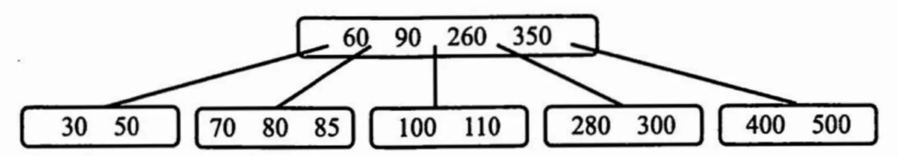
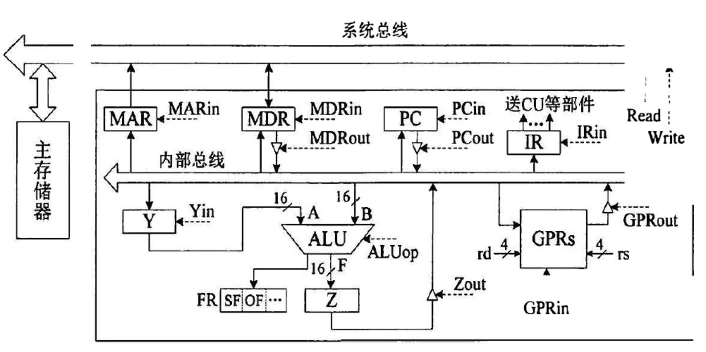
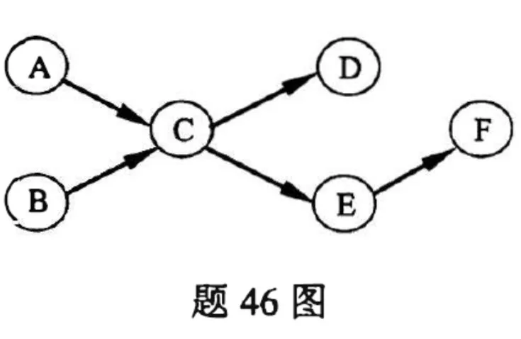
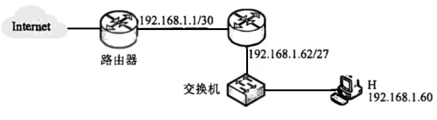

# 2022 年 408 真题 · 答案与解析

> 刷完 [[题面]] 后用此页对答案、看解析。
> 顺序：数据结构（1–11, 41–42）→ 组成原理（12–22, 43–44）→ 操作系统（23–32, 45–46）→ 计算机网络（33–40, 47）

## 一、选择题答案速查表（40 题，每题 2 分，共 80 分）

| 题号 | 1 | 2 | 3 | 4 | 5 | 6 | 7 | 8 | 9 | 10 |
| 答案 | **B** | **D** | **B** | **C** | **D** | **D** | **B** | **D** | **D** | **A** |
| 科目 | 数结 | 数结 | 数结 | 数结 | 数结 | 数结 | 数结 | 数结 | 数结 | 数结 |

| 题号 | 11 | 12 | 13 | 14 | 15 | 16 | 17 | 18 | 19 | 20 |
| 答案 | **D** | **A** | **B** | **A** | **C** | **A** | **C** | **B** | **D** | **A** |
| 科目 | 数结 | 组原 | 组原 | 组原 | 组原 | 组原 | 组原 | 组原 | 组原 | 组原 |

| 题号 | 21 | 22 | 23 | 24 | 25 | 26 | 27 | 28 | 29 | 30 |
| 答案 | **C** | **C** | **D** | **A** | **C** | **B** | **C** | **D** | **A** | **D** |
| 科目 | 组原 | 组原 | 操作 | 操作 | 操作 | 操作 | 操作 | 操作 | 操作 | 操作 |

| 题号 | 31 | 32 | 33 | 34 | 35 | 36 | 37 | 38 | 39 | 40 |
| 答案 | **B** | **A** | **B** | **C** | **B** | **D** | **B** | **C** | **D** | **B** |
| 科目 | 操作 | 操作 | 计网 | 计网 | 计网 | 计网 | 计网 | 计网 | 计网 | 计网 |

> 科目缩写：数结 = 数据结构 | 组原 = 计算机组成原理 | 操作 = 操作系统 | 计网 = 计算机网络

## 二、综合题答案要点速查表（7 题，共 70 分）

| 题号 | 分值 | 科目 | 考点 | 关键结论 |
|------|------|------|------|----------|
| 41 | 13 | 数据结构 | 树与二叉树 | 答案：1、基本思想：对顺序存储的二叉树做中序遍历，用变量 val 记录已访问结点的最大值（初值为负整数）；当前结点值不大于 val 则返回 false，否则更新... |
| 42 | 10 | 数据结构 | 排序 | 答案：1、维护一个含 10 个元素的大根堆 H，各元素初值为足够大的数 |
| 43 | 15 | 计算机组成原理 | 中央处理器 | 答案：1、SF = F₁₅ |
| 44 | 8 | 计算机组成原理 | 总线 | 答案：1、三个字段为柱面号（磁道号）、磁头号（盘面号）、扇区号 |
| 45 | 7 | 操作系统 | 文件管理 | 答案：1、目录项由文件名和索引结点号构成，stu 中两条目录项为 course→2、doc→10 |
| 46 | 8 | 操作系统 | 进程与线程 | 答案：同步关系有两对：C 须等 A 完成（A→C），E 须等 C 完成（C→E）；B、D、F 均在各自线程内有序，不需同步 |
| 47 | 9 | 计算机网络 | 数据链路层 | 答案：1、设备 1 选 100BaseT 以太网交换机（隔离冲突域、不隔离广播域），设备 2 选 100BaseT 集线器（冲突域与广播域均不隔离） |

---

## 三、详细解析

> 以下按题号顺序排列。每题包含题干、选项、答案、解析。
> 图片以相对路径 `images/xxx.webp` 引用，与本文同目录。

### 选择题 · 数据结构

### 1. （2 分 · 绪论）

下列程序段的时间复杂度是（ ）。

```C
int sum = 0;
for (int i = 1; i < n; i *= 2)
    for (int j = 0; j < i; j++)
        sum++;
```

- **A.** $O(\log_2 n)$
- **B.** $O(n)$
- **C.** $O(n\log_2 n)$
- **D.** $O(n^2)$

**答案**：B

**解析**：答案 B。外层循环 i 取值 1,2,4,…,2ᵏ⁻¹，内层每轮执行 i 次，总次数 = 1+2+4+…+2ᵏ⁻¹ = 2ᵏ−1 ≈ n−1，故时间复杂度为 O(n)。

> 难度 ⭐⭐⭐ ｜ 章节 绪论 ｜ 标签 数据结构 / 绪论

---

### 2. （2 分 · 栈、队列与数组）

给定有限符号集 S, in 和 out 均为 S 中所有元素的任意排列。对于初始为空的栈 ST, 下列叙述中，正确的是( )。

- **A.** 若 in 是 ST 的入栈序列，则不能判断 out 是否为其可能的出栈序列
- **B.** 若 out 是 ST 的出栈序列，则不能判断 in 是否为其可能的入栈序列
- **C.** 若 in 是 ST 的入栈序列，out 是对应 in 的出栈序列，则 in 与 out 一定不同
- **D.** 若 in 是 ST 的入栈序列，out 是对应 in 的出栈序列，则 in 与 out 可能互为倒序

**答案**：D

**解析**：答案 D。给定入栈序列就能求出全部可能的出栈序列，故 A、B 的「不能判断」错误；每入栈立即出栈时 in 与 out 相同，C 错。全部元素入栈后再依次出栈，out 恰为 in 的倒序，D 正确。

> 难度 ⭐⭐⭐ ｜ 章节 栈、队列与数组 ｜ 标签 数据结构 / 栈 / 队列 / 数组

---

### 3. （2 分 · 树与二叉树）

若结点 p 与 q 在二叉树 T 的中序遍历序列中相邻，且 p 在 q 之前，则下列 p 与 q 的关系中，不可能的是( )。

I. q 是 p 的双亲

II. q 是 p 的右孩子

III. q 是 p 的右兄弟

IV. q 是 p 的双亲的双亲

- **A.** 仅 I
- **B.** 仅 III
- **C.** 仅 II、III
- **D.** 仅 II、IV

**答案**：B

**解析**：答案 B。I 可能：p 是 q 左子树中序遍历的末结点；II 可能：q 无左子树，访问 p 后即访问 q；IV 可能：p 是 q 左子树中最右下的结点。III 不可能：p、q 为右兄弟时，中序必先访问共同双亲再访问 q，二者不可能相邻。

> 难度 ⭐⭐⭐⭐ ｜ 章节 树与二叉树 ｜ 标签 数据结构 / 树 / 二叉树 / 二叉树遍历

---

### 4. （2 分 · 树与二叉树）

若三叉树 T 中有 244 个结点（叶结点的高度为 1），则 T 的高度至少是 ( )。

- **A.** 8
- **B.** 7
- **C.** 6
- **D.** 5

**答案**：C

**解析**：答案 C。高度 h 的满三叉树最多 (3ʰ−1)/2 个结点：h=5 时最多 121，h=6 时最多 364，121<244≤364，故高度至少为 6。

> 难度 ⭐⭐⭐ ｜ 章节 树与二叉树 ｜ 标签 数据结构 / 树 / 二叉树 / 二叉树遍历

---

### 5. （2 分 · 树与二叉树）

对任意给定的含 n (n > 2) 个字符的有限集 S, 用二叉树表示 S 的哈夫曼编码集和定长编码集，分别得到二叉树 T1 和 T2。下列叙述中，正确的是 ( )。

- **A.** T1 与 T2 的结点数相同
- **B.** T1 的高度大于 T2 的高度
- **C.** 出现频次不同的字符在 T1 中处于不同的层
- **D.** 出现频次不同的字符在 T2 中处于相同的层

**答案**：D

**解析**：答案 D。定长编码各字符码长相同，在 T2 中必处于同一层且均为叶结点，与频次无关，D 正确。哈夫曼树 T1 结点数 2n−1，与 T2 一般不同，高度也不必然更高，频次不同的字符可能同层，A、B、C 错。

> 难度 ⭐⭐⭐ ｜ 章节 树与二叉树 ｜ 标签 数据结构 / 树 / 二叉树 / 二叉树遍历 / 哈夫曼树 / 物理层

---

### 6. （2 分 · 图）

对于无向图 G=(V,E)，下列选项中，正确的是(  )。

- **A.** 当 $|V| > |E|$ 时，G 一定是连通的
- **B.** 当 $|V| < |E|$ 时，G 一定是连通的
- **C.** 当 $|V| = |E|-1$ 时，G 一定是不连通的
- **D.** 当 $|V| > |E|+1$ 时，G 一定是不连通的

**答案**：D

**解析**：答案 D。无向图连通至少需 |V|−1 条边；|V|>|E|+1 即 |E|<|V|−1，边数不足以连通全部顶点，必不连通。其余选项均可构造反例。

> 难度 ⭐⭐⭐ ｜ 章节 图 ｜ 标签 数据结构 / 图 / 最短路径 / 最小生成树

---

### 7. （2 分 · 图）

下图是一个有 10 个活动的 AOE 网，时间余量最大的活动是 （ ）。


- **A.** c
- **B.** g
- **C.** h
- **D.** j

**答案**：B

**解析**：答案 B。活动时间余量 = vl(终点)−ve(起点)−持续时间。ve 为 0,2,5,8,9,12，vl 为 0,4,5,8,11,12：c 余量 5−2−1=2，g 余量 12−5−1=6，h 余量 11−8−1=2，j 余量 12−9−1=2，g 最大。

> 难度 ⭐⭐⭐⭐ ｜ 章节 图 ｜ 标签 数据结构 / 图 / 最短路径 / 最小生成树 / 图算法

---

### 8. （2 分 · 查找）

在下图所示的 5 阶 B 树 T 中，删除关键字 260 之后需要进行必要的调整，得到新的 B 树 T1。下列选项中，不可能是 T1 根结点中关键字序列的是(  )。



- **A.** 60，90，280
- **B.** 60，90，350
- **C.** 60，85，110，350
- **D.** 60，90，110，350

**答案**：D

**解析**：答案 D。5 阶 B 树非根结点关键字数须满足 2≤k≤4。删 260 可取其前驱 110 或后继 280 替换，调整后根可为 {60,85,110,350}、{60,90,350} 或 {60,90,280}。D 的 {60,90,110,350} 是未修复下溢的中间状态，不可能。

> 难度 ⭐⭐⭐⭐ ｜ 章节 查找 ｜ 标签 数据结构 / 查找 / 散列表 / B树

---

### 9. （2 分 · 查找）

下列因素中，影响散列(哈希)方法平均查找长度的是( )。

I. 装填因子

II. 散列函数

III. 冲突解决策略

- **A.** 仅 I、II
- **B.** 仅 I、III
- **C.** 仅 II、III
- **D.** I、 II、 III

**答案**：D

**解析**：答案 D。装填因子越大冲突越频繁，平均查找长度越大；散列函数决定关键字分布的均匀程度，冲突解决策略决定冲突后的查找路径，三者都影响平均查找长度。

> 难度 ⭐⭐ ｜ 章节 查找 ｜ 标签 数据结构 / 查找 / 散列表 / B树

---

### 10. （2 分 · 排序）

使用二路归并排序对含 n 个元素的数组 M 进行排序时，二路归并操作的功能是( )。

- **A.** 将两个有序表合并为一个新的有序表
- **B.** 将 M 划分为两部分，两部分的元素个数大致相等
- **C.** 将 M 划分为 n 个部分，每个部分中仅含有一个元素
- **D.** 将 M 划分为两部分，一部分元素的值均小于另一部分元素的值

**答案**：A

**解析**：答案 A。二路归并就是把两个有序表合并为一个新的有序表。B、C 描述的是归并排序的划分过程，D 是快速排序的划分操作。

> 难度 ⭐ ｜ 章节 排序 ｜ 标签 数据结构 / 排序 / 内部排序 / 外部排序 / 排序算法

---

### 11. （2 分 · 排序）

对数据进行排序时，若采用直接插入排序而不采用快速排序，则可能的原因是（）。

Ⅰ. 大部分元素已有序

Ⅱ. 待排序元素数量很少

Ⅲ. 要求空间复杂度为 $O(1)$

Ⅳ. 要求排序算法是稳定的

- **A.** 仅Ⅰ、Ⅱ
- **B.** 仅Ⅲ、Ⅳ
- **C.** 仅Ⅰ、Ⅱ、Ⅳ
- **D.** Ⅰ、Ⅱ、Ⅲ、Ⅳ

**答案**：D

**解析**：答案 D。插入排序在序列基本有序时接近 O(n)、元素少时常数小、空间 O(1)、且稳定；快排在这些场景下均不如插入排序，故四个理由都成立。

> 难度 ⭐⭐⭐ ｜ 章节 排序 ｜ 标签 数据结构 / 排序 / 内部排序 / 外部排序 / 排序算法

---

### 综合题 · 数据结构

### 41. （13 分 · 树与二叉树）

已知非空二叉树 T 的结点值均为正整数，采用顺序存储方式保存，数据结构定义如下：

```c
typedef struct {                    // MAX_SIZE 为已定义常量
    Elemtype SqBiTNode[MAX_SIZE];   // 保存二叉树结点值的数组
    int      ElemNum;               // 实际占用的数组元素个数
} SqBiTree;
```

T 中不存在的结点在数组 `SqBiTNode` 中用 -1 表示。例如，对于两棵非空二叉树 T₁ 和 T₂：


T₁ 和 T₂ 对应的顺序存储如下

| 数组 | 内容（依次） | ElemNum |
|---|---|---|
| `T₁.SqBiTNode` | `[40, 25, 60, -1, 30, -1, 80, -1, -1, 27]` | 10 |
| `T₂.SqBiTNode` | `[40, 50, 60, -1, 30, -1, -1, -1, -1, -1, 35]` | 11 |

请设计一个尽可能高效的算法，判定一棵采用这种方式存储的二叉树是否为二叉搜索树，若是则返回 true，否则返回 false。要求：

(1) 给出算法的基本设计思想。

(2) 根据设计思想，采用 C 或 C++ 语言描述算法，关键之处给出注释。

**答案 / 解析**：

答案：1、基本思想：对顺序存储的二叉树做中序遍历，用变量 val 记录已访问结点的最大值（初值为负整数）；当前结点值不大于 val 则返回 false，否则更新 val。下标 i 的左孩子为 2i+1、右孩子为 2i+2，下标越界或值为 −1 表示空子树，返回 true。2、时间复杂度 O(n)，空间复杂度 O(h)（h 为树高，递归栈）。核心代码：

```c
int val = -1;   // 已遍历结点的最大值，初值小于任意正整数
bool solve(SqBiTree T, int i) {
    if (i >= T.ElemNum || T.SqBiTNode[i] == -1) return true;  // 空子树
    if (!solve(T, 2*i+1)) return false;       // 先判定左子树
    if (T.SqBiTNode[i] <= val) return false;  // 中序序列必须严格递增
    val = T.SqBiTNode[i];
    return solve(T, 2*i+2);                   // 再判定右子树
}
bool isBST(SqBiTree T) { return solve(T, 0); }
```

> 难度 ⭐⭐⭐⭐ ｜ 章节 树与二叉树 ｜ 标签 数据结构 / 树 / 二叉树 / 二叉树遍历 / 二叉排序树

---

### 42. （10 分 · 排序）

现有 n（n > 100000）个数保存在一维数组 M 中，需要查找 M 中最小的 10 个数，请回答下列问题：

(1) 设计一个完成上述查找任务的算法，要求平均情况下的比较次数尽可能少，简单描述其算法思想，不需要程序实现。

(2) 说明你所设计的算法平均情况下的时间复杂度和空间复杂度。

**答案 / 解析**：

答案：1、维护一个含 10 个元素的大根堆 H，各元素初值为足够大的数。遍历 M 中每个元素 s：若 s 小于堆顶，则删除堆顶并把 s 插入堆；否则跳过。扫描完毕，堆中即为最小的 10 个数，每个元素平均只需与堆顶比较 1 次即被淘汰。也可用含 10 个元素的升序数组，s 小于最大元素时插入并丢弃最大者，效果相同。2、时间复杂度 O(n)，空间复杂度 O(1)（仅 10 个元素的堆，与 n 无关）。

> 难度 ⭐⭐⭐ ｜ 章节 排序 ｜ 标签 数据结构 / 排序 / 内部排序 / 外部排序

---

### 选择题 · 计算机组成原理

### 12. （2 分 · 计算机系统概述）

某计算机主频为 1GHz，程序 P 运行过程中，共执行了 10000 条指令，其中，80% 的指令执行平均需 1 个时钟周期，20% 的指令执行平均需 10 个时钟周期。程序 P 的平均 CPI 和 CPU 执行时间分别是（ ）。

- **A.** 2.8，28μs
- **B.** 28，28μs
- **C.** 2.8，28ms
- **D.** 28，28ms

**答案**：A

**解析**：答案 A。平均 CPI = 0.8×1+0.2×10 = 2.8；CPU 执行时间 = 10000×2.8/10⁹ ≈ 2.8×10⁻⁵ s = 28μs。

> 难度 ⭐⭐ ｜ 章节 计算机系统概述 ｜ 标签 计算机组成原理 / 计算机系统概述 / 性能指标

---

### 13. （2 分 · 数据表示与运算）

32 位补码所能表示的整数范围是（ ）。

- **A.** $-2^{32} \sim 2^{31}-1$
- **B.** $-2^{31} \sim 2^{31}-1$
- **C.** $-2^{32} \sim 2^{32}-1$
- **D.** $-2^{31} \sim 2^{32}-1$

**答案**：B

**解析**：答案 B。32 位补码最大值为 0x7FFFFFFF = 2³¹−1，最小值为 0x80000000 = −2³¹，故范围为 −2³¹ ∼ 2³¹−1。

> 难度 ⭐ ｜ 章节 数据表示与运算 ｜ 标签 计算机组成原理 / 数据表示 / 运算

---

### 14. （2 分 · 数据表示与运算）

-0.4375 的 IEEE 754 单精度浮点数表示为（ ）。

- **A.** BEE0 0000H
- **B.** BF60 0000H
- **C.** BF70 0000H
- **D.** C0E0 0000H

**答案**：A

**解析**：答案 A。0.4375 = 0.0111₂ = 1.11×2⁻²。数符 1，阶码 −2+127=125=01111101，尾数 1100…0，拼得 1011 1110 1110 0000…，即 BEE0 0000H。

> 难度 ⭐⭐⭐ ｜ 章节 数据表示与运算 ｜ 标签 计算机组成原理 / 数据表示 / 运算

---

### 15. （2 分 · 存储器层次结构）

某计算机主存地址为 24 位，采用分页虚拟存储管理方式，虚拟地址空间大小为 4GB，页大小为 4KB，按字节编址。某进程的页表部分内容如下表所示。当 CPU 访问虚拟地址 00082840H，虚-实地址转换的结果是（ ）。

| 虚页号 | 实页号（页框号）| 存在位 |
|---|---|---|
| 82 | 024H | 0 |
| ... | ... | ... |
| 129 | 180H | 1 |
| 130 | 018H | 1 |

- **A.** 得到主存地址 024840H
- **B.** 得到主存地址 180840H
- **C.** 得到主存地址 018840H
- **D.** 检测到缺页异常

**答案**：C

**解析**：答案 C。页大小 4KB，低 12 位为页内偏移 840H；虚页号为高 20 位 00082H=130（十进制）。查页表 130 号页存在位为 1，页框号 018H，拼得主存地址 018840H。

> 难度 ⭐⭐⭐⭐ ｜ 章节 存储器层次结构 ｜ 标签 计算机组成原理 / 存储器层次结构 / 地址转换 / 虚拟内存 / 内存分配

---

### 16. （2 分 · 存储器层次结构）

某计算机主存地址为 32 位，按字节编址，某 Cache 的数据区容量为 32KB，主存块大小为 64B，采用 8 路组相联映射方式，该 Cache 中比较器的个数和位数分别为（ ），

- **A.** 8，20
- **B.** 8，23
- **C.** 64，20
- **D.** 64，23

**答案**：A

**解析**：答案 A。块内地址占 6 位；总行数 32KB/64B=512，8 路组相联共 64 组，组号占 6 位；Tag=32−6−6=20 位。比较器个数等于路数 8，位数等于 Tag 位数 20。

> 难度 ⭐⭐⭐ ｜ 章节 存储器层次结构 ｜ 标签 计算机组成原理 / 存储器层次结构 / Cache

---

### 17. （2 分 · 存储器层次结构）

某内存条包含 8 个 8192×8192×8 位的 DRAM 芯片，按字节编址，支持突发传送方式，对应存储器总线宽度为 64 位，每个 DRAM 芯片内有一个行缓冲区。下列关于该内存条的叙述中，不正确的是（ ）。

- **A.** 内存条的容量为 512MB
- **B.** 采用多模块交叉编址方式
- **C.** 芯片的地址引脚为 26 位
- **D.** 芯片内行缓冲有 8192×8 位

**答案**：C

**解析**：答案 C。8 片总容量 8×8192×8192×8 bit=512MB，A 正确；总线 64 位需 8 片按字节交叉编址，B 正确；DRAM 行、列地址复用，行数列数均 8192，只需 13 根地址引脚而非 26，C 错；行缓冲为一行 8192×8 位，D 正确。

> 难度 ⭐⭐⭐⭐ ｜ 章节 存储器层次结构 ｜ 标签 计算机组成原理 / 存储器层次结构 / 缓冲区

---

### 18. （2 分 · 指令系统）

下列选项中，属于指令集体系结构（ISA）规定的内容是（ ）。

Ⅰ. 指令字格式和指令类型

Ⅱ. CPU 的时钟周期

Ⅲ. 通用寄存器个数和位数

Ⅳ. 加法器的进位方式

- **A.** 仅Ⅰ、Ⅱ
- **B.** 仅Ⅰ、Ⅲ
- **C.** 仅Ⅱ、Ⅳ
- **D.** 仅Ⅰ、Ⅲ、Ⅳ

**答案**：B

**解析**：答案 B。ISA 规定软件可见的内容，如指令字格式与类型、通用寄存器个数与位数；CPU 时钟周期属硬件实现细节，加法器进位方式属电路设计，均不由 ISA 规定。

> 难度 ⭐⭐⭐ ｜ 章节 指令系统 ｜ 标签 计算机组成原理 / 指令系统 / 寻址方式 / CISC / RISC / 性能指标

---

### 19. （2 分 · 指令系统）

设计某指令系统时，假设采用 16 位定长指令字格式，操作码使用扩展编码方式，地址码为 6 位，包含零地址、一地址和二地址 3 种格式的指令。若二地址指令有 12 条，一地址指令有 254 条，则零地址指令的条数最多为（ ）。

- **A.** 0
- **B.** 2
- **C.** 64
- **D.** 128

**答案**：D

**解析**：答案 D。二地址 OP 4 位共 16 个编码，用 12 个剩 4 个作前缀；一地址最多 4×2⁶=256 条，用 254 条剩 2 个前缀；零地址最多 2×2⁶=128 条。

> 难度 ⭐⭐⭐⭐ ｜ 章节 指令系统 ｜ 标签 计算机组成原理 / 指令系统 / 寻址方式 / CISC / RISC / 物理层

---

### 20. （2 分 · 计算机系统概述）

将高级语言源程序转换为可执行目标文件的主要过程是（ ）。

- **A.** 预处理 → 编译 → 汇编 → 链接
- **B.** 预处理 → 汇编 → 编译 → 链接
- **C.** 预处理 → 编译 → 链接 → 汇编
- **D.** 预处理 → 汇编 → 链接 → 编译

**答案**：A

**解析**：答案 A。源程序转换为可执行目标文件依次经过预处理、编译、汇编、链接四个阶段：预处理展开宏和包含头文件，编译生成汇编代码，汇编生成可重定位目标文件，链接合并目标文件并解析符号。

> 难度 ⭐ ｜ 章节 计算机系统概述 ｜ 标签 计算机组成原理 / 计算机系统概述 / 文件系统

---

### 21. （2 分 · 输入输出系统）

下列关于中断 I/O 方式的叙述中，不正确的是（ ）。

- **A.** 适用于键盘、针式打印机等字符型设备
- **B.** 外设和主机之间的数据传送通过软件完成
- **C.** 外设准备数据的时间应小于中断处理时间
- **D.** 外设为某进程准备数据时 CPU 可运行其他进程

**答案**：C

**解析**：答案 C。中断方式适用于慢速字符型设备，A 正确；数据传送由中断服务程序（软件）完成，B 正确；外设准备数据时间应大于中断处理时间，否则缓冲数据来不及取走而丢失，C 错；准备期间 CPU 可运行其他进程，D 正确。

> 难度 ⭐⭐⭐ ｜ 章节 输入输出系统 ｜ 标签 计算机组成原理 / I/O系统 / 中断 / DMA / I/O方式

---

### 22. （2 分 · 中央处理器）

下列关于并行处理技术的叙述中，不正确的是（ ）。

- **A.** 多核处理器属于 MIMD 结构
- **B.** 向量处理器属于 SIMD 结构
- **C.** 硬件多线程技术只可用于多核处理器
- **D.** SMP 中所有处理器共享单一物理地址空间

**答案**：C

**解析**：答案 C。多核属 MIMD，A 正确；向量处理器属 SIMD，B 正确；硬件多线程是在一个核内交替执行多个线程，单核也可用（如 Pentium 4 超线程），并非只用于多核，C 错；SMP 共享单一物理地址空间，D 正确。

> 难度 ⭐⭐ ｜ 章节 中央处理器 ｜ 标签 计算机组成原理 / CPU / 数据通路 / 指令流水线

---

### 综合题 · 计算机组成原理

### 43. （15 分 · 中央处理器）

某 CPU 中部分数据通路如图所示，其中，GPRs 为通用寄存器组；FR 为标志寄存器，用于存放 ALU 产生的标志信息；带箭头虚线表示控制信号，如控制信号 ReaD. Write 分别表示主存读、主存写，MDRin 表示内部总线上数据写入 MDR，MDRout 表示 MDR 的内容送内部总线。



(1) ALU 的输入端 A. B 及输出端 F 的最高位分别为 A15 、 B15 及 F15 ，FR 中的符号标志和溢出标志分别为 SF 和 OF，则 SF 的逻辑表达式是什么？A 加 B. A 减 B 时 OF 的逻辑表达式分别是什么？要求逻辑表达式的输入变量为 A15、B15 及 F15 。

(2) 为什么要设置暂存器 Y 和 Z？

(3) 若 GPRs 的输入端 rs、rd 分别为所读、写的通用寄存器的编号，则 GPRs 中最多有多少个通用寄存器？rs 和 rd 来自图中的哪个寄存器？已知 GPRs 内部有一个地址译码器和一个多路选择器，rd 应该连接地址译码器还是多路选择器？

(4) 取指令阶段（不考虑 PC 增量操作）的控制信号序列是什么？若从发出主存读命令到主存读出数据并传送到 MDR 共需 5 个时钟周期，则取指令阶段至少需要几个时钟周期？

(5) 图中控制信号由什么部件产生？图中哪些寄存器的输出信号会连到该部件的输入端？

**答案 / 解析**：

答案：1、SF = F₁₅。A 加 B 时 OF = A₁₅B₁₅F̄₁₅ + Ā₁₅B̄₁₅F₁₅（两加数同号而结果异号即溢出）；A 减 B 时 OF = A₁₅B̄₁₅F̄₁₅ + Ā₁₅B₁₅F₁₅（A 与 B 异号且结果与 A 异号即溢出）。2、单总线结构每一时刻总线上只能有一个数据，而 ALU 有两个输入端，需先用暂存器 Y 缓存第一个操作数，再经总线送第二个；运算结果产生时总线正被占用，故用暂存器 Z 缓存 ALU 输出。3、rs、rd 各 4 位，最多 2⁴=16 个通用寄存器；rs、rd 来自指令寄存器 IR；rd 为写寄存器编号，应连接地址译码器。4、控制信号序列：①PCout、MARin（送指令地址）②Read（读主存至 MDR，需 5 个时钟周期）③MDRout、IRin（写入指令寄存器）。取指阶段至少 1+5+1=7 个时钟周期。5、控制信号由控制部件（CU）产生；指令寄存器 IR 和标志寄存器 FR 的输出信号连到 CU 的输入端。

> 难度 ⭐⭐⭐⭐ ｜ 章节 中央处理器 ｜ 标签 计算机组成原理 / CPU / 数据通路 / 指令流水线 / CPU设计 / 性能指标

---

### 44. （8 分 · 总线）

假设某磁盘驱动器中有 4 个双面盘片，每个盘面有 20000 个磁道，每个磁道有 500 个扇区，每个扇区可记录 512 字节的数据，盘片转速为 7200rpm（转/分），平均寻道时间为 5ms，请回答下列问题。

(1) 每个扇区包含数据及地址信息，地址信息分为 3 个字段，这 3 个字段的名称格式什么？对于该磁盘，各字段至少占多少位？

(2) 一个扇区的平均访问时间约为多少？

(3) 若采用周期挪用 DMA 方式进行磁盘与主机之间的数据传送，磁盘控制器中的数据缓冲区大小为 64 位，则在一个扇区读写过程中，DMA 控制器向 CPU 发送了多少次总线请求？若 CPU 检测到 DMA 控制器的总线请求信号时也需要访问主存，则 DMA 控制器是否可以获得总线使用权？为什么？

**答案 / 解析**：

答案：1、三个字段为柱面号（磁道号）、磁头号（盘面号）、扇区号。柱面 20000 个需 ⌈log₂20000⌉=15 位；磁头 4×2=8 个需 3 位；扇区 500 个需 ⌈log₂500⌉=9 位。2、平均访问时间 = 平均寻道 + 平均旋转延迟 + 传输时间。转一圈需 60/7200≈8.33ms，旋转延迟约 4.17ms，传输一个扇区约 8.33/500≈0.017ms，合计约 5+4.17+0.017≈9.2ms。3、缓冲区每满 64 位发一次总线请求，一个扇区 512B，共 512×8/64=64 次。周期挪用方式下 DMA 可优先获得总线使用权，因为磁盘一旦开始读写必须按时完成传送，否则缓冲区数据会丢失。

> 难度 ⭐⭐⭐ ｜ 章节 总线 ｜ 标签 计算机组成原理 / 总线 / 系统总线 / I/O接口 / 缓冲区 / I/O方式 / 磁盘

---

### 选择题 · 操作系统

### 23. （2 分 · 计算机系统概述）

下列关于多道程序系统的叙述中，不正确的是（ ）。

- **A.** 支持进程的并发执行
- **B.** 不必支持虚拟存储管理
- **C.** 需要实现对共享资源的管理
- **D.** 进程数越多 CPU 利用率越高

**答案**：D

**解析**：答案 D。并发与共享是多道程序系统的基本特征，A、C 正确；不采用虚拟存储也能实现多道并发，B 正确。进程过多会使资源竞争加剧甚至死锁，CPU 利用率不一定随进程数增加而提高，D 错。

> 难度 ⭐⭐ ｜ 章节 计算机系统概述 ｜ 标签 操作系统 / 计算机系统概述

---

### 24. （2 分 · 计算机系统概述）

下列选项中，需要在操作系统进行初始化过程中创建的是（ ）。

- **A.** 中断向量表
- **B.** 文件系统的根目录
- **C.** 硬盘分区表
- **D.** 文件系统的索引节点表

**答案**：A

**解析**：答案 A。中断向量表存放中断服务程序入口地址，必须在 OS 初始化时建立。文件系统根目录、硬盘分区表、索引节点表分别于格式化、分区、文件系统创建时生成，不属于 OS 初始化内容。

> 难度 ⭐⭐ ｜ 章节 计算机系统概述 ｜ 标签 操作系统 / 计算机系统概述

---

### 25. （2 分 · 进程与线程）

进程 P0、P1、P2 和 P3 进入就绪队列的时刻、优先级（值越小优先权越高）及 CPU 执行时间如下表所示。

| 进程 | 进入就绪队列的时刻 | 优先级 | CPU 执行时间 |
| --- | --- | --- | --- |
| P0 | 0 ms | 15 | 100 ms |
| P1 | 10 ms | 20 | 60 ms |
| P2 | 10 ms | 10 | 20 ms |
| P3 | 15 ms | 6 | 10 ms |

若系统采用基于优先权的抢占式进程调度算法，则从 0ms 时刻开始调度，到 4 个进程都运行结束为止，发生进程调度的总次数为（ ）。

- **A.** 4
- **B.** 5
- **C.** 6
- **D.** 7

**答案**：C

**解析**：答案 C。0ms 调度 P0，10ms P2 抢占，15ms P3 抢占，25ms P3 结束调度 P2，40ms P2 结束调度 P0，130ms P0 结束调度 P1，190ms P1 结束，共调度 6 次。

> 难度 ⭐⭐⭐ ｜ 章节 进程与线程 ｜ 标签 操作系统 / 进程管理 / 进程 / 线程 / 同步 / PV操作 / 队列 / 进程调度

---

### 26. （2 分 · 进程与线程）

系统中有三个进程 P0、P1、P2 及三类资源 A、B、C。若某时刻系统分配资源的情况如下表所示，则此时系统中存在的安全序列的个数为（ ）。

| 进程 | 已分配 A | 已分配 B | 已分配 C | 尚需 A | 尚需 B | 尚需 C |
| --- | ---: | ---: | ---: | ---: | ---: | ---: |
| P0 | 2 | 0 | 1 | 0 | 2 | 1 |
| P1 | 0 | 2 | 0 | 1 | 2 | 3 |
| P2 | 1 | 0 | 1 | 0 | 1 | 3 |

当前可用资源 Available = (1, 3, 2)。

- **A.** 1
- **B.** 2
- **C.** 3
- **D.** 4

**答案**：B

**解析**：答案 B。可用资源 (1,3,2) 只能满足 P0 需求 (0,2,1)，故 P0 必在最前；P0 完成后 Work=(3,3,3)，P1、P2 均可执行，安全序列为 P0→P1→P2 和 P0→P2→P1，共 2 个。

> 难度 ⭐⭐⭐ ｜ 章节 进程与线程 ｜ 标签 操作系统 / 进程管理 / 进程 / 线程 / 同步 / PV操作

---

### 27. （2 分 · 计算机系统概述）

下列关于 CPU 模式的叙述中，正确的是（ ）。

- **A.** CPU 处于用户态时只能执行特权指令
- **B.** CPU 处于内核态时只能执行特权指令
- **C.** CPU 处于用户态时只能执行非特权指令
- **D.** CPU 处于内核态时只能执行非特权指令

**答案**：C

**解析**：答案 C。用户态只能执行非特权指令；内核态可执行特权指令和非特权指令，A、B、D 的「只能」限定均不成立。

> 难度 ⭐⭐ ｜ 章节 计算机系统概述 ｜ 标签 操作系统 / 计算机系统概述

---

### 28. （2 分 · 进程与线程）

下列事件或操作中，可能导致进程 P 由执行态变为阻塞态的是（ ）。

Ⅰ. 进程 P 读文件
Ⅱ. 进程 P 的时间片用完
Ⅲ. 进程 P 申请外设
Ⅳ. 进程 P 执行信号量的 wait() 操作

- **A.** 仅Ⅰ、Ⅳ
- **B.** 仅Ⅱ、Ⅲ
- **C.** 仅Ⅲ、Ⅳ
- **D.** 仅Ⅰ、Ⅲ、Ⅳ

**答案**：D

**解析**：答案 D。读文件要等待磁盘 I/O 完成，申请外设可能因设备被占而等待，wait() 使信号量减 1 为负时阻塞，三者都会使进程进入阻塞态；时间片用完只转入就绪态，故为 Ⅰ、Ⅲ、Ⅳ。

> 难度 ⭐⭐ ｜ 章节 进程与线程 ｜ 标签 操作系统 / 进程管理 / 进程 / 线程 / 同步 / PV操作 / 同步与互斥 / 文件系统

---

### 29. （2 分 · 内存管理）

某进程访问的页 b 不在内存中，导致产生缺页异常，该缺页异常处理过程中不一定包含的操作是（ ）。

- **A.** 淘汰内存中的页
- **B.** 建立页号与页框号的对应关系
- **C.** 将页 b 从外存读入内存
- **D.** 修改页表中页 b 对应的存在位

**答案**：A

**解析**：答案 A。缺页处理须将页 b 从外存读入、建立页号与页框号对应、修改存在位，B、C、D 必做；仅当内存无空闲页框时才需淘汰页面，A 不一定发生。

> 难度 ⭐⭐⭐ ｜ 章节 内存管理 ｜ 标签 操作系统 / 内存管理 / 分页 / 分段 / 虚拟内存 / 页面置换

---

### 30. （2 分 · 内存管理）

下列选项中，不会影响系统缺页率的是（ ）。

- **A.** 页面置换算法
- **B.** 工作集的大小
- **C.** 进程的数量
- **D.** 页缓冲队列的长度

**答案**：D

**解析**：答案 D。置换算法、工作集大小、进程数量都影响缺页发生的次数；页缓冲队列只加快缺页后的处理速度，不改变缺页次数，故不影响缺页率。

> 难度 ⭐⭐⭐⭐ ｜ 章节 内存管理 ｜ 标签 操作系统 / 内存管理 / 分页 / 分段 / 虚拟内存 / 页面置换

---

### 31. （2 分 · 计算机系统概述）

执行系统调用的过程涉及下列操作，其中由操作系统完成的是（ ）。

Ⅰ. 保存断点和程序状态字
Ⅱ. 保存通用寄存器的内容
Ⅲ. 执行系统调用服务程序
Ⅳ. 将 CPU 模式改为内核态

- **A.** 仅Ⅰ、Ⅲ
- **B.** 仅Ⅱ、Ⅲ
- **C.** 仅Ⅱ、Ⅳ
- **D.** 仅Ⅱ、Ⅲ、Ⅳ

**答案**：B

**解析**：答案 B。保存断点和程序状态字、将 CPU 模式改为内核态由硬件自动完成；保存通用寄存器、执行系统调用服务程序由操作系统完成，故选 Ⅱ、Ⅲ。

> 难度 ⭐⭐⭐ ｜ 章节 计算机系统概述 ｜ 标签 操作系统 / 计算机系统概述

---

### 32. （2 分 · 输入输出管理）

下列关于驱动程序的叙述中，不正确的是（ ）。

- **A.** 驱动程序与 I/O 控制方式无关
- **B.** 初始化设备是由驱动程序控制完成的
- **C.** 进程在执行驱动程序时可能进入阻塞态
- **D.** 读/写设备的操作是由驱动程序控制完成的

**答案**：A

**解析**：答案 A。驱动程序须针对具体 I/O 控制方式编写，轮询、中断、DMA 的驱动各不相同，并非与 I/O 控制方式无关，A 错；初始化设备、读写设备均由驱动程序控制，执行驱动时可能因设备忙而阻塞，B、C、D 正确。

> 难度 ⭐⭐⭐ ｜ 章节 输入输出管理 ｜ 标签 操作系统 / I/O系统 / 中断 / DMA

---

### 综合题 · 操作系统

### 45. （7 分 · 文件管理）

某文件系统的磁盘块大小为 4 KB，目录项由文件名和索引节点号构成，每个索引节点占 256 字节，其中包含直接地址项 10 个，一级、二级和三级间接地址项各 1 个，每个地址项占 4 字节。

该文件系统中子目录 `stu` 的结构如下图所示：`stu` 包含子目录 `course` 和文件 `doc`，`course` 子目录包含文件 `course1` 和 `course2`。各文件的文件名、索引节点号、占用磁盘块的块号也一并给出（其中文件 `doc` 占用的磁盘块号 x 为待求）。


请回答下列问题。

(1) 目录文件 `stu` 中每个目录项的内容是什么？

(2) 文件 `doc` 占用的磁盘块的块号 x 的值是多少？

(3) 若目录文件 `course` 的内容已在内存，则打开文件 `course1` 并将其读入内存，需要读几个磁盘块？说明理由。

(4) 若文件 `course2` 的大小增长到 6 MB，为了存取 `course2` 需要使用该文件索引节点的哪几级间接地址项？说明理由。

**答案 / 解析**：

答案：1、目录项由文件名和索引结点号构成，stu 中两条目录项为 course→2、doc→10。2、doc 与 course1 的索引结点号同为 10，是同一文件的硬链接，故 x 等于 course1 所占磁盘块号 30。3、需读 2 个磁盘块：course 目录内容已在内存，先据 course1 的目录项读出其索引结点所在块，再据索引结点读出 30 号数据块。4、6MB 需 6MB/4KB=1536 个磁盘块；直接地址 10 块加一级间接 1024 块共 1034 块仍不够，二级间接还能管理 1024×1024 块，故需使用一级和二级间接地址项。

> 难度 ⭐⭐⭐ ｜ 章节 文件管理 ｜ 标签 操作系统 / 文件系统 / 文件 / 目录 / 磁盘

---

### 46. （8 分 · 进程与线程）

某进程的两个线程 T1 和 T2 并发执行 A、B、C、D、E、F 共 6 个操作，其中 T1 执行 A、E、F，T2 执行 B、C、D。

操作之间的执行顺序约束（如题 46 图）：



- C 必须在 A 和 B 完成后执行
- D 和 E 必须在 C 完成后执行
- F 必须在 E 完成后执行

请使用信号量的 `wait()`、`signal()` 操作描述 T1 和 T2 之间的同步关系，并说明所用信号量的作用及其初值。

**答案 / 解析**：

答案：同步关系有两对：C 须等 A 完成（A→C），E 须等 C 完成（C→E）；B、D、F 均在各自线程内有序，不需同步。设两个初值为 0 的信号量 AC、CE：AC 表示「A 已完成」，CE 表示「C 已完成」。核心代码：

```c
semaphore AC = 0, CE = 0;
T1() { A; signal(AC); wait(CE); E; F; }
T2() { B; wait(AC); C; signal(CE); D; }
```

> 难度 ⭐⭐⭐ ｜ 章节 进程与线程 ｜ 标签 操作系统 / 进程管理 / 进程 / 线程 / 同步 / PV操作 / 同步与互斥

---

### 选择题 · 计算机网络

### 33. （2 分 · 计算机网络体系结构）

在 ISO/OSI 参考模型中，实现两个相邻结点间流量控制功能的是（ ）。

- **A.** 物理层
- **B.** 数据链路层
- **C.** 网络层
- **D.** 传输层

**答案**：B

**解析**：答案 B。数据链路层实现相邻结点间的流量控制；网络层做整个网络的流量控制，传输层做端到端流量控制。题问相邻结点间，故选数据链路层。

> 难度 ⭐⭐ ｜ 章节 计算机网络体系结构 ｜ 标签 计算机网络 / 计算机网络体系结构 / 传输层

---

### 34. （2 分 · 物理层）

在一条带宽为 200 kHz 的无噪声信道上，若采用 4 个幅值的 ASK 调制，则该信道的最大数据传输速率是（ ）。

- **A.** 200 kbps
- **B.** 400 kbps
- **C.** 800 kbps
- **D.** 1600 kbps

**答案**：C

**解析**：答案 C。由奈奎斯特定理，最大数据传输速率 = 2B·log₂V = 2×200k×log₂4 = 800 kbps。

> 难度 ⭐⭐ ｜ 章节 物理层 ｜ 标签 计算机网络 / 物理层 / 编码 / 调制

---

### 35. （2 分 · 网络层）

若某主机的 IP 地址是 183.80.72.48，子网掩码是 255.255.192.0，则该主机所在网络的网络地址是（ ）。

- **A.** 183.80.0.0
- **B.** 183.80.64.0
- **C.** 183.80.72.0
- **D.** 183.80.192.0

**答案**：B

**解析**：答案 B。网络地址 = IP 与子网掩码逐位相与。掩码 255.255.192.0 前 18 位为 1，将 183.80.72.48 的后 14 位清零得 183.80.64.0。

> 难度 ⭐⭐⭐ ｜ 章节 网络层 ｜ 标签 计算机网络 / 网络层 / IP / 路由 / 子网划分 / CIDR

---

### 36. （2 分 · 网络层）

如下图所示的网络中，主机 H 的子网掩码与默认网关分别是（ ）



- **A.** 255.255.255.192, 192.168.1.1
- **B.** 255.255.255.192, 192.168.1.62
- **C.** 255.255.255.224, 192.168.1.1
- **D.** 255.255.255.224, 192.168.1.62

**答案**：D

**解析**：答案 D。H 与 R2 接口 192.168.1.62 同属 /27 子网，掩码为 255.255.255.224；默认网关是直连路由器接口的地址 192.168.1.62（R1 侧 192.168.1.1 不在 H 的子网内）。

> 难度 ⭐⭐⭐ ｜ 章节 网络层 ｜ 标签 计算机网络 / 网络层 / IP / 路由 / 子网划分 / CIDR / 内存分配 / 数据链路层

---

### 37. （2 分 · 网络层）

SDN 控制器向数据平面的 SDN 交换机下发流表时所使用的接口是（ ）

- **A.** 东向接口
- **B.** 南向接口
- **C.** 西向接口
- **D.** 北向接口

**答案**：B

**解析**：答案 B。南向接口负责控制平面与数据平面之间的通信，控制器通过它向交换机下发流表；北向接口面向应用，东向/西向接口用于控制器之间协同。

> 难度 ⭐⭐ ｜ 章节 网络层 ｜ 标签 计算机网络 / 网络层 / IP / 路由 / 子网划分 / CIDR / 内存分配 / 数据链路层

---

### 38. （2 分 · 传输层）

假设主机甲和主机乙已建立一个 TCP 连接，最大段长 MSS = 1 KB，甲一直有数据向乙发送，当甲的拥塞窗口为 16 KB 时，计时器发生了超时，则甲的拥塞窗口再次增长到 16 KB 所需要的时间至少是（ ）。

- **A.** 4 RTT
- **B.** 5 RTT
- **C.** 11 RTT
- **D.** 16 RTT

**答案**：C

**解析**：答案 C。超时后 cwnd 置 1、ssthresh 置 8：慢启动经 3 个 RTT 把 cwnd 增至 8，拥塞避免再经 8 个 RTT 线性增至 16，共 11 个 RTT。

> 难度 ⭐⭐⭐⭐ ｜ 章节 传输层 ｜ 标签 计算机网络 / 传输层 / TCP / UDP / 拥塞控制

---

### 39. （2 分 · 传输层）

假设客户 C 和服务器 S 已建立一个 TCP 连接，通信往返时间 RTT = 50 ms，最长报文段寿命 MSL = 800 ms，数据传输结束后，C 主动请求断开连接。若从 C 主动向 S 发出 FIN 段时刻算起，则 C 和 S 进入 CLOSED 状态所需的时间至少分别是（ ）。

- **A.** 850 ms, 50 ms
- **B.** 1650 ms, 50 ms
- **C.** 850 ms, 75 ms
- **D.** 1650 ms, 75 ms

**答案**：D

**解析**：答案 D。C 发 FIN 后 1 RTT 收到 ACK 与 FIN 进入 TIME_WAIT，再等 2 MSL=1600ms，共 50+1600=1650ms 进入 CLOSED；S 在 1.5 RTT=75ms 收到 ACK 即进入 CLOSED。

> 难度 ⭐⭐⭐⭐ ｜ 章节 传输层 ｜ 标签 计算机网络 / 传输层 / TCP / UDP / 拥塞控制

---

### 40. （2 分 · 应用层）

假设主机 H 通过 HTTP/1.1 请求浏览某 Web 服务器 S 上的 Web 页 news408.html，news408.html 引用了同目录下的 1 幅图像，news408.html 文件大小为 1 MSS（最大段长），图像文件大小为 3 MSS，H 访问 S 的往返时间 RTT = 10 ms，忽略 HTTP 响应报文的首部开销和 TCP 段传输时延。若 H 已完成域名解析，则从 H 请求与 S 建立 TCP 连接时刻起，到接收到全部内容止，所需的时间至少是（ ）。

- **A.** 30 ms
- **B.** 40 ms
- **C.** 50 ms
- **D.** 60 ms

**答案**：B

**解析**：答案 B。第 1 个 RTT 完成三次握手并捎带 HTTP 请求；第 2 个 RTT 收到 1MSS 的 HTML；第 3 个 RTT 收到 2MSS 图像；第 4 个 RTT 收到剩余 1MSS 图像，共 4 RTT=40ms。

> 难度 ⭐⭐⭐⭐ ｜ 章节 应用层 ｜ 标签 计算机网络 / 应用层 / HTTP / DNS / FTP / SMTP / 文件系统 / 传输层

---

### 综合题 · 计算机网络

### 47. （9 分 · 数据链路层）

某网络拓扑如题 47 图所示，R 为路由器，S 为以太网交换机，AP 是 802.11 接入点，路由器的 E0 接口和 DHCP 服务器的 IP 地址配置如图中所示；H1 与 H2 属于同一个广播域，但不属于同一个冲突域；H2 和 H3 属于同一个冲突域；H4 和 H5 已经接入网络，并通过 DHCP 动态获取了 IP 地址。现有路由器、100BaseT 以太网交换机和 100BaseT 集线器（Hub）三类设备各若干台。


请回答下列问题。

(1) 设备 1 和设备 2 应该分别选择哪类设备？

(2) 若信号传播速度为 $2 \times 10^8$ m/s，以太网最小帧长为 64 B，信号通过设备 2 时会产生额外的 1.51 μs 的时间延迟，则 H2 与 H3 之间可以相距的最远距离是多少？

(3) 在 H4 通过 DHCP 动态获取 IP 地址过程中，H4 首先发送了 DHCP 报文 M，M 是哪种 DHCP 报文？路由器 E0 接口能否收到封装 M 的以太网帧？S 向 DHCP 服务器转发的封装 M 的以太网帧的目的 MAC 地址是什么？

(4) 若 H4 向 H5 发送一个 IP 分组 P，则 H5 收到的封装 P 的 802.11 帧的地址 1、地址 2 和地址 3 分别是什么？

**答案 / 解析**：

答案：1、设备 1 选 100BaseT 以太网交换机（隔离冲突域、不隔离广播域），设备 2 选 100BaseT 集线器（冲突域与广播域均不隔离）。2、由最短帧长 = 2×传播时延×速率：64×8 = 2×(D/(2×10⁸)+1.51×10⁻⁶)×100×10⁶，解得 D=210m。3、M 是 DHCP 发现报文（Discover）；它是广播帧，同一广播域内所有设备都能收到，故路由器 E0 接口能收到；S 转发该帧的目的 MAC 地址为全 1，即 FF-FF-FF-FF-FF-FF。4、H5 收到的 AP→H5 帧中：地址 1（接收端 H5）为 00-11-11-11-11-E1，地址 2（AP）为 00-11-11-11-11-C1，地址 3（真实发送端 H4）为 00-11-11-11-11-D1。

> 难度 ⭐⭐⭐⭐ ｜ 章节 数据链路层 ｜ 标签 计算机网络 / 数据链路层 / MAC / CSMA/CD / PPP / 指令流水线 / 内存分配 / 网络层


## See Also

- [[题面]] — 仅题干与选项，用于限时刷题
- [[../408历年真题总目录]] — 历年真题总目录
- [[408考情分析]] — 试卷构成与逐年考点统计
