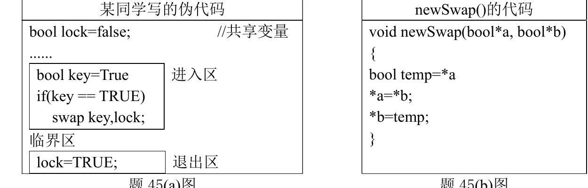
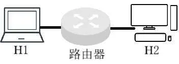
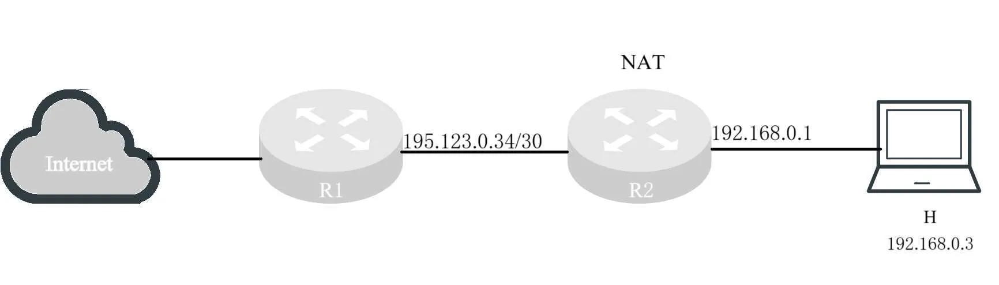

# 2023 年 408 真题 · 答案与解析

> 刷完 [[题面]] 后用此页对答案、看解析。
> 顺序：数据结构（1–11, 41–42）→ 组成原理（12–22, 43–44）→ 操作系统（23–32, 45–46）→ 计算机网络（33–40, 47）

## 一、选择题答案速查表（40 题，每题 2 分，共 80 分）

| 题号 | 1 | 2 | 3 | 4 | 5 | 6 | 7 | 8 | 9 | 10 |
| 答案 | **D** | **C** | **A** | **B** | **A** | **B** | **B** | **B** | **C** | **C** |
| 科目 | 数结 | 数结 | 数结 | 数结 | 数结 | 数结 | 数结 | 数结 | 数结 | 数结 |

| 题号 | 11 | 12 | 13 | 14 | 15 | 16 | 17 | 18 | 19 | 20 |
| 答案 | **D** | **C** | **A** | **A** | **C** | **B** | **A** | **B** | **C** | **D** |
| 科目 | 数结 | 组原 | 组原 | 组原 | 组原 | 组原 | 组原 | 组原 | 组原 | 组原 |

| 题号 | 21 | 22 | 23 | 24 | 25 | 26 | 27 | 28 | 29 | 30 |
| 答案 | **D** | **C** | **D** | **A** | **C** | **D** | **C** | **D** | **B** | **C** |
| 科目 | 组原 | 组原 | 操作 | 操作 | 操作 | 操作 | 操作 | 操作 | 操作 | 操作 |

| 题号 | 31 | 32 | 33 | 34 | 35 | 36 | 37 | 38 | 39 | 40 |
| 答案 | **B** | **D** | **D** | **C** | **B** | **C** | **D** | **A** | **B** | **D** |
| 科目 | 操作 | 操作 | 计网 | 计网 | 计网 | 计网 | 计网 | 计网 | 计网 | 计网 |

> 科目缩写：数结 = 数据结构 | 组原 = 计算机组成原理 | 操作 = 操作系统 | 计网 = 计算机网络

## 二、综合题答案要点速查表（7 题，共 70 分）

| 题号 | 分值 | 科目 | 考点 | 关键结论 |
|------|------|------|------|----------|
| 41 | 13 | 数据结构 | 图 | 答案：1、设计思想：邻接矩阵中第 i 行非零元的个数为顶点 i 的出度，第 i 列非零元的个数为其入度 |
| 42 | 10 | 数据结构 | 排序 | 答案：1、共生成 3 个初始归并段：R1 = (37, 51, 63, 92, 94, 99)，长度 6；R2 = (14, 15, 23, 31, 48, 5... |
| 43 | 14 | 计算机组成原理 | 存储器层次结构 | 答案：1、a 共 24×64×4 = 6144 B，页大小 4KB，跨 2 个页面存储；执行期间缺页 2 次，页故障地址分别为 0042 2000H、0042 ... |
| 44 | 9 | 计算机组成原理 | 指令系统 | 答案：1、第 20 条指令的虚拟地址 = 0040 10AEH + 11 = 0040 10B9H |
| 45 | 7 | 操作系统 | 进程与线程 | 答案：1、进入区语句 if (key == TRUE) swap key, lock; 改为 while (key == TRUE) swap key, loc... |
| 46 | 8 | 操作系统 | 输入输出管理 | 答案：1、操作①的前一个操作是③，后一个操作是⑤；操作⑥的后一个操作是④ |
| 47 | 9 | 计算机网络 | 传输层 | 答案：1、FTP 控制连接是持久的，数据连接是非持久的；H 登录服务器时建立的是控制连接 |

---

## 三、详细解析

> 以下按题号顺序排列。每题包含题干、选项、答案、解析。
> 图片以相对路径 `images/xxx.webp` 引用，与本文同目录。

### 选择题 · 数据结构

### 1. （2 分 · 线性表）

下列对顺序存储的有序表（长度为 $n$）实现给定操作的算法中，平均时间复杂度为 $O(1)$ 的是( )。

- **A.** 查找包含指定值元素的算法
- **B.** 插入包含指定值元素的算法
- **C.** 删除第 $i$ 个元素的算法
- **D.** 获取第 $i$ 个值的算法

**答案**：D

**解析**：答案 D。顺序存储支持随机存取，按下标 i 经 LOC(aᵢ)=LOC(a₁)+(i−1)×L 直接计算地址、一次访存即可取到值，与表长 n 无关，为 O(1)。按值查找需比较（O(n) 或 O(log n)），插入和删除需移动后续元素（O(n)），都达不到常数级。

> 难度 ⭐⭐ ｜ 章节 线性表 ｜ 标签 数据结构 / 线性表 / 顺序表 / 链表

---

### 2. （2 分 · 线性表）

现有非空双向链表 L，其结点结构为：

```
prev | data | next
```

`prev` 是指向直接前驱结点的指针，`next` 是指向直接后继结点的指针。若要在 L 中指针 `p` 所指向的结点（非尾结点）之后插入指针 `s` 指向的新结点，则在执行了语句序列 `s->next = p->next; p->next = s;` 后，还要执行（ ）。

- **A.** `s->next->prev = p; s->prev = p;`
- **B.** `p->next->prev = s; s->prev = p;`
- **C.** `s->prev = s->next->prev; s->next->prev = s;`
- **D.** `p->next->prev = s->prev; s->next->prev = p;`

**答案**：C

**解析**：答案 C。执行 s->next = p->next; p->next = s; 后，还需让 s->prev 指向 p、原后继的 prev 指向 s。此时 p->next 已是 s，须借 s->next 找到原后继：s->prev = s->next->prev（此刻仍为 p），再 s->next->prev = s。

> 难度 ⭐⭐⭐⭐ ｜ 章节 线性表 ｜ 标签 数据结构 / 线性表 / 顺序表 / 链表 / 文件系统

---

### 3. （2 分 · 栈、队列与数组）

若采用三元组表存储结构存储稀疏矩阵 M，则除三元组外，下列数据中还需要保存的是( )。

I. M 的行数

II. M 中包含非零元素的行数

III. M 的列数

IV. M 中包含非零元素的列数

- **A.** 仅 I 和 III
- **B.** 仅 I 和 IV
- **C.** 仅 II 和 IV
- **D.** I、II、III、IV

**答案**：A

**解析**：答案 A。三元组表只记录非零元的行、列、值，要完整恢复矩阵还必须另存矩阵的行数 I 和列数 III，用于确定矩阵规模与越界判断。非零元所在的行、列信息已含在每条三元组中，无需额外保存。即仅 I、III。

> 难度 ⭐⭐ ｜ 章节 栈、队列与数组 ｜ 标签 数据结构 / 栈 / 队列 / 数组 / 特殊矩阵

---

### 4. （2 分 · 树与二叉树）

在由 6 个字符组成的字符集 S 中，各个字符出现的频次分别为 3, 4, 5, 6, 8, 10，为 S 构造的哈夫曼树的加权平均长度为( )。

- **A.** 2.4
- **B.** 2.5
- **C.** 2.67
- **D.** 2.75

**答案**：B

**解析**：答案 B。合并过程：3+4=7，5+6=11，7+8=15，10+11=21，15+21=36。3、4、5、6 编码长 3，8、10 长 2。加权平均长度 = ((3+4+5+6)×3+(8+10)×2)/36 = 90/36 = 2.5。

> 难度 ⭐⭐⭐ ｜ 章节 树与二叉树 ｜ 标签 数据结构 / 树 / 二叉树 / 二叉树遍历 / 哈夫曼树

---

### 5. （2 分 · 树与二叉树）

已知一棵二叉树的树形如下图所示，若其后序遍历为 f, d, b, e, c, a，则其先序序列为（ ）。


- **A.** a, e, d, f, b, c
- **B.** a, c, e, b, d, f
- **C.** c, a, b, e, f, d
- **D.** d, f, e, b, a, c

**答案**：A

**解析**：答案 A。后序最后一个 a 是根，其前的 f、d、b、e 属左子树，c 属右子树。左子树后序 f、d、b、e 中 e 为根，其左子树含 d、f，右子树为 b；d 的孩子为 f。按根左右的先序得：a, e, d, f, b, c。

> 难度 ⭐⭐⭐ ｜ 章节 树与二叉树 ｜ 标签 数据结构 / 树 / 二叉树 / 二叉树遍历

---

### 6. （2 分 · 图）

已知无向连通图 G 中各边的权值均为 1，下列算法中，一定能够求出图 G 中从某顶点到其余各个顶点最短路径的是( )。

I. 普里姆（Prim）算法

II. 克鲁斯卡尔（Kruskal）算法

III. 图的广度优先搜索

- **A.** 仅 I
- **B.** 仅 III
- **C.** 仅 I 和 II
- **D.** I、II、III

**答案**：B

**解析**：答案 B。Prim 和 Kruskal 解决最小生成树问题，与两点间最短路径无关。各边权均为 1 时，BFS 从源点按层扩展，第 k 层顶点到源点恰经过 k 条边，即为最短路径长度。仅 III 正确。

> 难度 ⭐⭐⭐ ｜ 章节 图 ｜ 标签 数据结构 / 图 / 最短路径 / 最小生成树

---

### 7. （2 分 · 查找）

下列关于非空 B 树的叙述中，正确的是( )。

I. 插入操作可能增加树的高度

II. 删除操作一定会导致叶结点的变化

III. 查找某关键字一定要查找到叶结点

IV. 插入的新关键字最终位于叶结点中

- **A.** 仅 I
- **B.** 仅 I、II
- **C.** 仅 III、IV
- **D.** 仅 I、II、IV

**答案**：B

**解析**：答案 B。I 正确：插入使叶结点分裂，根分裂则树高增加。II 正确：无论直接删叶结点关键字，还是用前驱/后继替换内部结点关键字后再删，最终都落在叶结点上。III 错误：内部结点命中即返回，不必查到叶结点。IV 错误：分裂时中位数上移，新关键字可能不在叶结点。

> 难度 ⭐⭐⭐⭐ ｜ 章节 查找 ｜ 标签 数据结构 / 查找 / 散列表 / B树

---

### 8. （2 分 · 查找）

对含有 600 个元素的有序顺序表进行折半查找，关键字之间的比较次数最多是( )。

- **A.** 9
- **B.** 10
- **C.** 30
- **D.** 300

**答案**：B

**解析**：答案 B。折半查找的最多比较次数为判定树的高度 ⌊log₂n⌋+1。log₂600 介于 9 与 10 之间，⌊log₂600⌋=9，故最多比较 9+1=10 次。

> 难度 ⭐⭐ ｜ 章节 查找 ｜ 标签 数据结构 / 查找 / 散列表 / B树 / 查找算法

---

### 9. （2 分 · 查找）

现有长度为 5，初始为空的散列表 HT，散列表函数 H(k) = (k+4) % 5 用线性探查再散列法解决冲突。若将关键字序列 2022,12,25 依次插入 HT 中，然后删除关键字 25，则 HT 中查找失败的平均查找长度（ ）。

- **A.** 1
- **B.** 1.6
- **C.** 1.8
- **D.** 2.2

**答案**：C

**解析**：答案 C。插入后 2022 在位置 1、12 在位置 2、25 在位置 4；删除 25 后该位置留删除标记，查找失败须越过标记继续探测至真正的空位。5 个起点的失败比较次数为 1、3、2、1、2，ASL=(1+3+2+1+2)/5=1.8。

> 难度 ⭐⭐⭐ ｜ 章节 查找 ｜ 标签 数据结构 / 查找 / 散列表 / B树

---

### 10. （2 分 · 排序）

下列排序算法中，不稳定的是( )。

I. 希尔排序

II. 归并排序

III. 快速排序

IV. 堆排序

V. 基数排序

- **A.** 仅 I 和 II
- **B.** 仅 II 和 V
- **C.** 仅 I、III、IV
- **D.** 仅 III、IV、V

**答案**：C

**解析**：答案 C。不稳定的是希尔、快速、堆排序：希尔跨组跳跃式比较交换，快排划分交换可能越过相等元素，堆排序建堆调整时大跨度交换，都可能改变相等元素的相对顺序。归并和基数排序稳定。

> 难度 ⭐⭐ ｜ 章节 排序 ｜ 标签 数据结构 / 排序 / 内部排序 / 外部排序 / 排序算法

---

### 11. （2 分 · 排序）

使用快速排序算法对数据进行升序排序，若经过一次划分后得到的数据序列是 68, 11, 70, 23, 80, 77, 48, 81, 93, 88，则该次划分的枢轴是( )。

- **A.** 11
- **B.** 70
- **C.** 80
- **D.** 81

**答案**：D

**解析**：答案 D。划分后枢轴必处于最终位置：其左边元素均不超过它、右边均不小于它。11 左边有 68 大于它；70 右边有 23、48 小于它；80 右边有 77、48 小于它；81 左边最大为 80、右边最小为 88，符合条件。

> 难度 ⭐⭐⭐ ｜ 章节 排序 ｜ 标签 数据结构 / 排序 / 内部排序 / 外部排序 / 排序算法

---

### 综合题 · 数据结构

### 41. （13 分 · 图）

已知有向图 G 采用邻接矩阵存储，类型定义如下：

```c
typedef struct {                    // 图的类型定义
    int  numVertices, numEdges;     // 图中顶点数和有向边数
    char VerticesList[MAXV];        // 顶点表，MAXV 为已定义常量
    int  Edge[MAXV][MAXV];          // 邻接矩阵
} MGraph;
```

将图中出度大于入度的顶点称为 K 顶点。例如在题 41 图中，顶点 a 和 b 都是 K 顶点。


设计算法 `int printVertices(MGraph G)`：对给定任意非空有向图 G，输出 G 中所有 K 顶点，并返回 K 顶点的个数。要求：

(1) 给出算法的设计思想。

(2) 根据算法思想，写出 C/C++ 描述，并注释。

**答案 / 解析**：

答案：1、设计思想：邻接矩阵中第 i 行非零元的个数为顶点 i 的出度，第 i 列非零元的个数为其入度。对每个顶点分别统计出度和入度，若出度 > 入度则输出该顶点并使计数加 1，最后返回 K 顶点个数。2、时间 O(n²)、空间 O(1)。核心代码：

```c
int printVertices(MGraph G) {
    int count = 0;
    for (int v = 0; v < G.numVertices; v++) {
        int outdegree = 0, indegree = 0;
        for (int i = 0; i < G.numVertices; i++)
            outdegree += G.Edge[v][i];   // 第 v 行之和为出度
        for (int i = 0; i < G.numVertices; i++)
            indegree += G.Edge[i][v];    // 第 v 列之和为入度
        if (outdegree > indegree) {
            printf("%c ", G.VerticesList[v]);
            count++;
        }
    }
    return count;
}
```

> 难度 ⭐⭐⭐ ｜ 章节 图 ｜ 标签 数据结构 / 图 / 最短路径 / 最小生成树 / 图的存储

---

### 42. （10 分 · 排序）

对含有 n（n > 0）个记录的文件进行外部排序，采用置换-选择排序生成初始归并段时需要使用一个工作区，工作区中能保存 m 个记录，请回答下列问题：

(1) 如果文件中有 19 个记录，其关键字是 51, 94, 37, 92, 14, 63, 15, 99, 48, 56, 23, 60, 31, 17, 43, 8, 90, 166, 100；当 m = 4 时，可以生成几个初始归并段，各是什么？

(2) 对任意的 m（n > m > 0），生成的第一个初始归并段的长度最大值和最小值分别是多少？

**答案 / 解析**：

答案：1、共生成 3 个初始归并段：R1 = (37, 51, 63, 92, 94, 99)，长度 6；R2 = (14, 15, 23, 31, 48, 56, 60, 90, 166)，长度 9；R3 = (8, 17, 43, 100)，长度 4。三段合计 19 个记录。2、第一个初始归并段长度的最大值 = n，最小值 = m。

说明：置换-选择排序每次从容量 m 的工作区中选出不小于当前段已输出最大关键字的最小记录输出，小于它的新记录冻结留到下一段，工作区全部冻结或输入读完时结束当前段。

> 难度 ⭐⭐⭐⭐ ｜ 章节 排序 ｜ 标签 数据结构 / 排序 / 内部排序 / 外部排序 / 排序算法 / 文件系统

---

### 选择题 · 计算机组成原理

### 12. （2 分 · 计算机系统概述）

若机器 M 的主频为 1.5GHz，在 M 上执行程序 p 的指令条数为 $5 \times 10^5$，p 的平均 CPI 为 1.2，则 p 在 M 上的指令执行速度和用户 CPU 时间分别为( )。

- **A.** 0.8 GIPS、0.4 ms
- **B.** 0.8 GIPS、0.4 μs
- **C.** 1.25 GIPS、0.4 ms
- **D.** 1.25 GIPS、0.4 μs

**答案**：C

**解析**：答案 C。指令执行速度 = 主频/CPI = 1.5 GHz/1.2 = 1.25 GIPS。用户 CPU 时间 = 指令数×CPI/主频 = 5×10⁵×1.2/(1.5×10⁹) = 4×10⁻⁴ s = 0.4 ms。

> 难度 ⭐⭐ ｜ 章节 计算机系统概述 ｜ 标签 计算机组成原理 / 计算机系统概述 / 性能指标

---

### 13. （2 分 · 数据表示与运算）

若 short 型变量 x = -8190，则 x 的机器数为( )。

- **A.** E002H
- **B.** E001H
- **C.** 9FFFH
- **D.** 9FFEH

**答案**：A

**解析**：答案 A。8190 = 1FFEH，负数补码按位取反加 1：1FFE 取反得 E001，加 1 得 E002H；也可直接算 2¹⁶−8190 = 57346 = E002H。

> 难度 ⭐⭐⭐ ｜ 章节 数据表示与运算 ｜ 标签 计算机组成原理 / 数据表示 / 运算

---

### 14. （2 分 · 数据表示与运算）

已知 float 型变量用 IEEE 754 单精度浮点数格式表示。若 float 型变量 x 的机器数为 8020 0000H，则 x 的值是( )。

- **A.** $-2^{-128}$
- **B.** $-1.01 \times 2^{-127}$
- **C.** $-1.01 \times 2^{-126}$
- **D.** 非数（NaN）

**答案**：A

**解析**：答案 A。8020 0000H 拆为符号 1、指数 00000000、尾数 010…0。指数全 0 且尾数非 0 是非规格化数，尾数前补 0 不补 1、指数固定为 −126：真值 = −2⁻² × 2⁻¹²⁶ = −2⁻¹²⁸。

> 难度 ⭐⭐⭐⭐ ｜ 章节 数据表示与运算 ｜ 标签 计算机组成原理 / 数据表示 / 运算

---

### 15. （2 分 · 存储器层次结构）

某计算机的 CPU 有 30 根地址线，按字节编址，CPU 和主存芯片连接时，要求主存芯片占满所有可能存储地址空间，并且 RAM 区和 ROM 区所分配的容量大小比为 3:1，若 RAM 在连续低地址区，ROM 在连续高地址区，则 ROM 的地址范围是( )。

- **A.** 00000000H ～ 0FFFFFFFH
- **B.** 10000000H ～ 2FFFFFFFH
- **C.** 30000000H ～ 3FFFFFFFH
- **D.** 40000000H ～ 4FFFFFFFH

**答案**：C

**解析**：答案 C。30 根地址线寻址 2³⁰ B = 1 GB，RAM:ROM = 3:1，故 ROM 占 2²⁸ B，位于连续高地址区。最高地址 3FFF FFFFH 向前 2²⁸ 个地址即 3000 0000H，故 ROM 范围为 3000 0000H～3FFF FFFFH。

> 难度 ⭐⭐⭐ ｜ 章节 存储器层次结构 ｜ 标签 计算机组成原理 / 存储器层次结构

---

### 16. （2 分 · 数据表示与运算）

已知 x、y 为 int 类型，当 x = 100，y = 200 时，执行 x − y 指令得到的溢出标志 OF 和借位标志 CF 分别为 0、1，那么当 x = 10，y = −20 时，执行该指令得到的 OF 和 CF 分别是( )。

- **A.** 0, 0
- **B.** 0, 1
- **C.** 1, 0
- **D.** 1, 1

**答案**：B

**解析**：答案 B。OF 从有符号角度判断：10−(−20)=30，在 int 范围内不溢出，OF=0。CF 从无符号角度判断：y=−20 的补码按无符号看是 2³²−20，10 小于它，相减需借位，CF=1。

> 难度 ⭐⭐⭐⭐ ｜ 章节 数据表示与运算 ｜ 标签 计算机组成原理 / 数据表示 / 运算

---

### 17. （2 分 · 指令系统）

某运算类型指令中有一个地址码为通用寄存器编号，对应通用寄存器中存放的是操作数或操作数地址，CPU 区分两者的依据是( )。

- **A.** 操作数的寻址方式
- **B.** 操作数的编码方式
- **C.** 通用寄存器编号
- **D.** 通用寄存器的内容

**答案**：A

**解析**：答案 A。寄存器内容当作操作数还是操作数地址，取决于指令的寻址方式：寄存器寻址取内容为操作数，寄存器间接寻址先取内容作地址再访存。CPU 在译码阶段按指令中的寻址方式字段区分。

> 难度 ⭐⭐ ｜ 章节 指令系统 ｜ 标签 计算机组成原理 / 指令系统 / 寻址方式 / CISC / RISC

---

### 18. （2 分 · 中央处理器）

数据通路由组合逻辑元件（操作元件）和时序逻辑元件（状态元件）组成。下列给出的元件中，属于操作元件的是( )。

I. 算术逻辑部件（ALU）

II. 程序计数器（PC）

III. 通用寄存器组（GPRs）

IV. 多路选择器（MUX）

- **A.** 仅 I、II
- **B.** 仅 I、IV
- **C.** 仅 II、III
- **D.** 仅 I、II、IV

**答案**：B

**解析**：答案 B。操作元件（组合逻辑）输出仅取决于当前输入、无存储功能，ALU 和多路选择器 MUX 属此类；PC 和通用寄存器组保存状态、需时钟驱动，属时序逻辑的状态元件。仅 I、IV。

> 难度 ⭐⭐⭐ ｜ 章节 中央处理器 ｜ 标签 计算机组成原理 / CPU / 数据通路 / 指令流水线 / CPU设计

---

### 19. （2 分 · 中央处理器）

在采用"取指、译码/取数、执行、访存、写回"5 段流水线的 RISC 处理器中，执行如下指令序列（第一列为指令序号），其中 s0、s1、s2、s3 和 t2 表示寄存器编号。

```
I1     add  s2, s1, s0   // R[s2] ← R[s1] + R[s0]
I2     load s3, 0(s2)    // R[s3] ← M[R[s2] + 0]
I3     beq  t2, s3, L1   // if R[t2] = R[s3] jump to L1
I4     addi t2, t2, 20   // R[t2] ← R[t2] + 20
I5 L1:
```

若采用转发（旁路）技术处理数据冒险，采用硬件阻塞方式处理控制冒险，则在 I1～I4 执行过程中，发生流水线阻塞的指令有（ ）。

- **A.** 仅 I3
- **B.** 仅 I2、I4
- **C.** 仅 I3、I4
- **D.** 仅 I2、I3、I4

**答案**：C

**解析**：答案 C。I1 的 s2 在 EX 段末已产出，可转发给 I2，不阻塞；I2 是 load，s3 到访存段末才有效，I3 须阻塞 1 个周期（load-use 冒险，转发救不了）；I3 是分支，硬件阻塞方式下 I4 须等分支结果确定。阻塞发生在 I3、I4。

> 难度 ⭐⭐⭐⭐ ｜ 章节 中央处理器 ｜ 标签 计算机组成原理 / CPU / 数据通路 / 指令流水线 / Cache / 指令集架构

---

### 20. （2 分 · 总线）

某存储器总线宽度为 64 位，总线时钟频率为 1 GHz，在总线上传输一个数据或地址需要一个时钟周期，不支持突发传送方式，若通过该总线连接 CPU 和主存，主存每次准备一个 64 位数据需要 6 ns，主存块大小为 32 B，则读取一个主存块需要的时间为( )。

- **A.** 8 ns
- **B.** 11 ns
- **C.** 26 ns
- **D.** 32 ns

**答案**：D

**解析**：答案 D。总线时钟 1 GHz，一个时钟周期 1 ns。读一个 64 位字需：发地址 1 ns + 主存准备 6 ns + 传数据 1 ns = 8 ns。块 32 B 含 4 个 64 位字，且不支持突发传送，须逐字重发地址，共 4×8 = 32 ns。

> 难度 ⭐⭐⭐ ｜ 章节 总线 ｜ 标签 计算机组成原理 / 总线 / 系统总线 / I/O接口 / 性能指标

---

### 21. （2 分 · 中央处理器）

下列关于硬件和异常/中断关系的叙述中，错误的是( )。

- **A.** CPU 在执行一条指令过程中检测异常事件
- **B.** CPU 在执行完一条指令时检测中断请求信号
- **C.** 开中断时 CPU 检测到中断请求后就进行中断响应
- **D.** 外部设备通过中断控制器向 CPU 发中断结束信号

**答案**：D

**解析**：答案 D。异常在指令执行过程中被检测，A 正确；外部中断在指令执行完毕时检测，开中断且收到请求即响应，B、C 正确。外部设备向中断控制器发的是中断请求信号；中断结束（EOI）信号由 CPU 发给中断控制器，D 错误。

> 难度 ⭐⭐⭐ ｜ 章节 中央处理器 ｜ 标签 计算机组成原理 / CPU / 数据通路 / 指令流水线 / I/O方式

---

### 22. （2 分 · 输入输出系统）

下列关于 I/O 控制方式的叙述中，错误的是（ ）。

- **A.** 查询方式下，通过 CPU 执行查询程序进行 I/O 操作
- **B.** 中断方式下，通过 CPU 执行中断服务程序进行 I/O 操作
- **C.** DMA 方式下，通过 CPU 执行 DMA 传送程序进行 I/O 操作
- **D.** 对于 SSD、网络适配器等高速设备，采用 DMA 方式输入/输出

**答案**：C

**解析**：答案 C。DMA 方式的数据传送由 DMA 控制器硬件直接控制总线完成，CPU 不执行任何「DMA 传送程序」，仅在预处理阶段初始化控制器、后处理阶段处理结束中断。查询方式和中断方式才由 CPU 执行程序完成传送。

> 难度 ⭐⭐ ｜ 章节 输入输出系统 ｜ 标签 计算机组成原理 / I/O系统 / 中断 / DMA

---

### 综合题 · 计算机组成原理

### 43. （14 分 · 存储器层次结构）

已知计算机 M 字长为 32 位，按字节编址，采用请求调页策略的虚拟存储管理方式，虚拟地址为 32 位，页面大小为 4KB；数据 Cache 采用 4 路组相联映射，数据区大小为 8KB，主存块大小为 32B。现有 C 语言程序段如下：

```c
int a[24][64];
int i, j;
for (i = 0; i < 24; i++)
    for (j = 0; j < 64; j++) a[i][j] = 10;
```

已知二维数组 a 按行优先存放，在虚拟地址空间中分配的起始地址为 0042 2000H，sizeof(int)=4，假定在 M 上执行上述程序段之前数组 a 不在主存，且在该程序段执行过程中不会发生页面置换。请回答下列问题。

(1) 数组 a 分为几个页面存储？对于数组 a 的访问，会发生几次缺页异常？页故障地址各是什么？

(2) 不考虑变量 i 和 j，该程序段的数据访问是否具有时间局部性？为什么？

(3) 计算机 M 的虚拟地址（A31～A0）中哪几位用作块内地址？哪几位用作 Cache 组号？a[1][0] 的虚拟地址是多少？其所在主存块对应的 Cache 组号是多少？

(4) 数组 a 占用多少主存块？假设上述程序段执行过程中数组 a 的访问不会和其他数据发生 Cache 访问冲突，则数组 a 的 Cache 命中率是多少？若将循环中 i 和 j 的次序按如下方式调换：

```c
for (j = 0; j < 64; j++)
    for (i = 0; i < 24; i++) a[i][j] = 10;
```

则数组 a 的 Cache 命中率又是多少？```c
for (j = 0; j < 64; j++)
    for (i = 0; i < 24; i++) a[i][j] = 10;
```

则数组 a 的 Cache 命中率又是多少？

**答案 / 解析**：

答案：1、a 共 24×64×4 = 6144 B，页大小 4KB，跨 2 个页面存储；执行期间缺页 2 次，页故障地址分别为 0042 2000H、0042 3000H。2、不具有时间局部性：每个数组元素仅被访问一次，不存在近期内再次访问。3、块内地址用虚拟地址低 5 位（A₄～A₀）；Cache 组号用 A₁₀～A₅（组数 = 8KB/(32B×4) = 64，需 6 位）。a[1][0] 的地址 = 0042 2000H + 1×64×4 = 0042 2100H；其低 11 位中组号字段为 001000，对应组号 8。4、a 占 6144/32 = 192 个主存块，每块 8 个元素，行优先访问时每块只有首次访问未命中，命中率 7/8 = 87.5%。交换 i、j 次序后按列访问，4 路组相联下每个组可容纳 24/8 = 3 行数组数据、不发生替换，命中率仍为 7/8。

> 难度 ⭐⭐⭐⭐ ｜ 章节 存储器层次结构 ｜ 标签 计算机组成原理 / 存储器层次结构 / Cache / 虚拟内存 / 内存分配

---

### 44. （9 分 · 指令系统）

上题中 C 程序段在计算机 M 上的部分机器级代码如下，每个机器级代码行中依次包含指令序号、虚拟地址、机器指令和汇编指令。

```
for (i = 0; i < 24; i++)
1   00401072  C7 45 F8 00 00 00 00              mov[ebp-8], 0
2   00401079  EB 09                             jmp 00401084h
3   0040107B  8B 55 F8                          mov eax, [ebp-8]
    ...       ...                               ...
7   00401088  7D 32                             jge 004010bch
    for (j = 0; j < 64; j++)
8   0040108A  C7 45 FC 00 00 00 00              mov[ebp-4], 0
    ...       ...                               ...
        a[i][j] = 10;
    ...       ...                               ...
19  004010AE  C7 84 82 00 20 42 00 0A 00 00 00  mov[ecx+edx*4+00422000h], 0Ah
20  ...       ...
```

请回答下列问题。

(1) 第 20 条指令的虚拟地址是多少？

(2) 已知第 2 条 jmp 和第 7 条 jge 都是跳转指令，其操作码分别是 EBH 和 7DH，跳转地址分别为 0040 1084H、0040 10BCH，这两条指令都采用什么寻址方式？给出第 2 条指令 jmp 的跳转目标地址计算过程。

(3) 已知第 19 条 mov 指令的功能是“a[i][j]←10”，其中 ecx 和 edx 为寄存器名，0042 2000H 是数组 a 的首地址，指令中源操作数采用什么寻址方式？已知 edx 中存放的是变量 j，ecx 中存放的是什么？根据该指令的机器码判断计算机 M 采用的是大端还是小端方式。

(4) 第一次执行第 19 条指令时，取指令过程中是否会发生缺页异常？为什么？

**答案 / 解析**：

答案：1、第 20 条指令的虚拟地址 = 0040 10AEH + 11 = 0040 10B9H。2、两条跳转指令都采用相对寻址：目标地址 = (PC 取指后) + 偏移。jmp 的机器码 EB 09 占 2 字节，取指后 PC = 0040 1079H + 2 = 0040 107BH，加偏移 09H 得 0040 1084H。3、源操作数 0Ah 为立即数，采用立即寻址；由 ecx + edx×4 + 0042 2000H = i×64×4 + j×4 + 0042 2000H 得 ecx = i×256；机器码中位移 00 20 42 00 与立即数 0A 00 00 00 均低字节在前，M 采用小端方式。4、不会缺页。第 19 条指令地址 0040 10AEH 所在页面（页号 00401H）与第 1 条指令同页，此前已装入主存，取指不会触发缺页异常。

> 难度 ⭐⭐⭐⭐ ｜ 章节 指令系统 ｜ 标签 计算机组成原理 / 指令系统 / 寻址方式 / CISC / RISC / 虚拟内存

---

### 选择题 · 操作系统

### 23. （2 分 · 计算机系统概述）

与宏内核操作系统相比，下列特征中微内核操作系统具有的是( )。

I. 较好的性能

II. 较高的可靠性

III. 较高的安全性

IV. 较强的可扩展性

- **A.** II、IV
- **B.** I、II、III
- **C.** I、III、IV
- **D.** II、III、IV

**答案**：D

**解析**：答案 D。微内核将文件、驱动等服务移至用户态进程，经 IPC 通信，额外开销大，性能不如宏内核（I 错）；但服务相互隔离，可靠性、安全性更高，且增删服务无需改内核，可扩展性强。II、III、IV 正确。

> 难度 ⭐⭐ ｜ 章节 计算机系统概述 ｜ 标签 操作系统 / 计算机系统概述

---

### 24. （2 分 · 输入输出管理）

在操作系统内核中，中断向量表适合采用的数据结构是( )。

- **A.** 数组
- **B.** 队列
- **C.** 单向链表
- **D.** 双向链表

**答案**：A

**解析**：答案 A。中断向量表以中断号作为下标直接定位处理程序入口，要求 O(1) 随机访问、大小固定且无需插入删除，数组完全匹配；链表查找慢，队列用途不符。

> 难度 ⭐⭐ ｜ 章节 输入输出管理 ｜ 标签 操作系统 / I/O系统 / 中断 / DMA / I/O方式

---

### 25. （2 分 · 内存管理）

某系统采用页式存储管理，用位图管理空闲页框。若页大小为 4 KB，物理内存大小为 16 GB，则位图所占空间的大小是( )。

- **A.** 128 B
- **B.** 128 KB
- **C.** 512 KB
- **D.** 4 MB

**答案**：C

**解析**：答案 C。页框总数 = 16 GB ÷ 4 KB = 2³⁴/2¹² = 2²² 个。位图每个页框占 1 位，共 2²² bit，折合 2²²/8 = 2¹⁹ B = 512 KB。

> 难度 ⭐⭐⭐ ｜ 章节 内存管理 ｜ 标签 操作系统 / 内存管理 / 分页 / 分段 / 虚拟内存 / 页面置换 / 内存分配

---

### 26. （2 分 · 计算机系统概述）

下列操作完成时，导致 CPU 从内核态转为用户态的是( )。

- **A.** 阻塞进程
- **B.** 执行 CPU 调度
- **C.** 唤醒进程
- **D.** 执行系统调用

**答案**：D

**解析**：答案 D。用户程序执行系统调用时陷入内核态，内核完成服务后返回用户态，系统调用完成时对应内核态到用户态的切换。阻塞进程、执行 CPU 调度、唤醒进程均在内核态内完成，不涉及模式切换。

> 难度 ⭐⭐⭐ ｜ 章节 计算机系统概述 ｜ 标签 操作系统 / 计算机系统概述

---

### 27. （2 分 · 进程与线程）

下列由当前线程引起的事件或执行的操作中，可能导致该线程由执行态变为就绪态的是( )。

- **A.** 键盘输入
- **B.** 缺页异常
- **C.** 主动出让 CPU
- **D.** 执行信号量的 wait() 操作

**答案**：C

**解析**：答案 C。线程主动出让 CPU（如 yield）后仍可运行，只是暂时不占用处理器，转入就绪态。键盘输入、缺页异常、信号量 wait() 不满足条件都需要等待事件，线程转入阻塞态。

> 难度 ⭐⭐⭐ ｜ 章节 进程与线程 ｜ 标签 操作系统 / 进程管理 / 进程 / 线程 / 同步 / PV操作

---

### 28. （2 分 · 内存管理）

对于采用虚拟内存管理方式的系统，下列关于进程虚拟地址空间的叙述中，错误的是（ ）。

- **A.** 每个进程都有自己独立的虚拟地址空间
- **B.** C 语言中 malloc() 函数返回的是虚拟地址
- **C.** 进程对数据段和代码段可以有不同的访问权限
- **D.** 虚拟地址的大小由主存和硬盘的大小决定

**答案**：D

**解析**：答案 D。虚拟地址空间的大小由 CPU 的地址位数决定（32 位 CPU 对应 4 GB），主存和硬盘大小只影响实际可用的物理容量，并不决定虚拟地址大小。每个进程有独立虚地址空间、malloc 返回虚拟地址、各段访问权限可不同，A、B、C 均正确。

> 难度 ⭐⭐ ｜ 章节 内存管理 ｜ 标签 操作系统 / 内存管理 / 分页 / 分段 / 虚拟内存 / 页面置换

---

### 29. （2 分 · 进程与线程）

进程 P1、P2 和 P3 进入就绪队列的时刻、优先级（越大优先权越高）以及 CPU 的执行时间如下表所示。

| 进程名 | 进入就绪队列的时刻 | 优先级 | CPU 执行时间 |
| --- | --- | --- | --- |
| P1 | 0ms | 1 | 60ms |
| P2 | 20ms | 10 | 42ms |
| P3 | 30ms | 100 | 13ms |

系统采用基于优先权的抢占式 CPU 调度算法，从 0ms 时刻开始进行调度，则 P1、P2 和 P3 的平均周转时间为（ ）。

- **A.** 60 ms
- **B.** 61 ms
- **C.** 70 ms
- **D.** 71 ms

**答案**：B

**解析**：答案 B。抢占式优先级调度：0～20 运行 P1，20 起 P2 抢占至 30，30 起 P3 抢占至 43 完成，P2 续至 75，P1 最后至 115。周转时间 P1=115、P2=55、P3=13，平均 (115+55+13)/3 = 61 ms。

> 难度 ⭐⭐⭐ ｜ 章节 进程与线程 ｜ 标签 操作系统 / 进程管理 / 进程 / 线程 / 同步 / PV操作 / 队列 / 进程调度

---

### 30. （2 分 · 内存管理）

进程 R 和 S 共享数据 data，若 data 在 R 和 S 中所在页的页号分别为 p1 和 p2，两个页所对应的页框号分别为 f1 和 f2，则下列叙述中，正确的是（ ）。

- **A.** p1 和 p2 一定相等，f1 和 f2 一定相等
- **B.** p1 和 p2 一定相等，f1 和 f2 不一定相等
- **C.** p1 和 p2 不一定相等，f1 和 f2 一定相等
- **D.** p1 和 p2 不一定相等，f1 和 f2 不一定相等

**答案**：C

**解析**：答案 C。两个进程共享数据时，各自页表中对应页项都映射到同一物理页框，故 f1 = f2 一定相等；但两进程的虚地址空间相互独立，data 所在页的页号 p1、p2 不一定相等。

> 难度 ⭐⭐⭐ ｜ 章节 内存管理 ｜ 标签 操作系统 / 内存管理 / 分页 / 分段 / 虚拟内存 / 页面置换 / 内存分配

---

### 31. （2 分 · 文件管理）

若文件 F 仅被进程 P 打开并访问，则当进程 P 关闭 F 时，下列操作中，文件系统需要完成的是（ ）。

- **A.** 删除目录中文件 F 的目录项
- **B.** 释放 F 的索引节点所占的内存空间
- **C.** 释放 F 的索引节点所占的外存空间
- **D.** 将文件磁盘索引节点中的链接计数减 1

**答案**：B

**解析**：答案 B。文件打开时系统将磁盘索引节点复制为内存索引节点并记录打开计数，关闭时计数减 1，减至 0 即释放该内存索引节点。删除目录项、释放外存 inode、链接计数减 1 都是删除文件时的操作。

> 难度 ⭐⭐⭐ ｜ 章节 文件管理 ｜ 标签 操作系统 / 文件系统 / 文件 / 目录 / 磁盘

---

### 32. （2 分 · 输入输出管理）

下列因素中，设备分配需要考虑的是（ ）。

Ⅰ. 设备的类型
Ⅱ. 设备的访问权限
Ⅲ. 设备的占用状态
Ⅳ. 逻辑设备与物理设备的映射关系

- **A.** Ⅰ、Ⅱ
- **B.** Ⅱ、Ⅲ
- **C.** Ⅲ、Ⅳ
- **D.** Ⅰ、Ⅱ、Ⅲ、Ⅳ

**答案**：D

**解析**：答案 D。设备分配需依次考虑：设备类型决定采用独占、共享还是虚拟分配方式；访问权限决定进程能否使用；占用状态决定能否分配、是否入队等待；逻辑设备与物理设备的映射关系用于把用户请求定位到具体硬件。四项均需考虑。

> 难度 ⭐⭐ ｜ 章节 输入输出管理 ｜ 标签 操作系统 / I/O系统 / 中断 / DMA

---

### 综合题 · 操作系统

### 45. （7 分 · 进程与线程）

现要求学生使用 swap 指令和布尔型变量 lock，实现临界区互斥。lock 为线程间共享的变量。lock 的值为 TRUE 时线程不能进入临界区，为 FALSE 时线程能进入临界区。某同学编写的实现临界区互斥的伪代码如题 45（a）图所示。



请回答下列问题。

（1）题 45（a）图的伪代码中哪些语句存在错误？将其改为正确的语句（不增加语句条数）。

（2）题 45（b）图给出了两个变量值的函数 newSwap() 的代码，是否可以用函数调用语句 `newSwap(&key, &lock)` 代替指令 `swap key, lock` 以实现临界区的互斥？为什么？

**答案 / 解析**：

答案：1、进入区语句 if (key == TRUE) swap key, lock; 改为 while (key == TRUE) swap key, lock;（拿不到锁就一直自旋，直到 key 变为 FALSE）；退出区语句 lock = TRUE; 改为 lock = FALSE;（释放锁）。2、不能。swap 是硬件原子指令，一次完成两个变量值的交换；newSwap() 是普通函数，对共享变量 lock 的读和写分成多条语句，多个线程并发执行时可能交错，无法保证交换的原子性，可能同时进入临界区，破坏互斥。

> 难度 ⭐⭐⭐ ｜ 章节 进程与线程 ｜ 标签 操作系统 / 进程管理 / 进程 / 线程 / 同步 / PV操作 / 同步与互斥 / 内存分配

---

### 46. （8 分 · 输入输出管理）

进程 P 通过执行系统调用从键盘接收一个字符的输入，已知此过程中与进程 P 相关的操作包括：

- ① 将进程 P 插入就绪队列
- ② 将进程 P 插入阻塞队列
- ③ 将字符从键盘控制器读入系统缓冲区
- ④ 启动键盘中断处理程序
- ⑤ 进程 P 从系统调用返回
- ⑥ 用户在键盘上输入字符

请回答下列问题：

(1) 按照正确的操作顺序，操作 ① 的前一个和后一个操作分别是上述操作中的哪一个？操作 ⑥ 的后一个操作是上述操作中的哪一个？

(2) 在上述哪个操作之后 CPU 一定从进程 P 切换到其他进程？在上述哪个操作之后 CPU 调度程序才能选择进程 P 执行？

(3) 完成上述哪个操作的代码属于键盘驱动程序？

(4) 键盘中断处理程序执行时，进程 P 处于什么状态？CPU 处于内核态还是用户态？

**答案 / 解析**：

答案：1、操作①的前一个操作是③，后一个操作是⑤；操作⑥的后一个操作是④。正确顺序为 ②→⑥→④→③→①→⑤。2、操作②（将 P 插入阻塞队列）之后 CPU 一定从 P 切换到其他进程；操作①（将 P 插入就绪队列）之后调度程序才能选择 P 执行。3、完成操作③（把字符从键盘控制器读入系统缓冲区）的代码属于键盘驱动程序。4、键盘中断处理程序执行时，P 处于阻塞状态；CPU 处于内核态。

> 难度 ⭐⭐⭐ ｜ 章节 输入输出管理 ｜ 标签 操作系统 / I/O系统 / 中断 / DMA / 缓冲区 / 队列 / I/O方式 / 进程调度

---

### 选择题 · 计算机网络

### 33. （2 分 · 计算机网络体系结构）

如下图，2 段链路的数据传输速率为 100 Mbps，时延带宽积（即单向传播时延 × 带宽）均为 1000 bit。若 H1 向 H2 发送 1 个大小为 1 MB 的文件，分组长度为 1000 B，则从 H1 开始发送时刻起到 H2 收到文件全部数据时刻止，所需的时间至少是（注：M = 10⁶）（ ）。



- **A.** 80.02 ms
- **B.** 80.08 ms
- **C.** 80.09 ms
- **D.** 80.10 ms

**答案**：D

**解析**：答案 D。每跳传播时延 1000 bit/100 Mbps = 10 μs，每分组发送时延 8000 bit/100 Mbps = 80 μs，共 1000 个分组。H1 发完需 1000×80 μs，最后一个分组再经传播 10 + 转发 80 + 传播 10 = 100 μs，总 80100 μs = 80.10 ms。

> 难度 ⭐⭐⭐⭐ ｜ 章节 计算机网络体系结构 ｜ 标签 计算机网络 / 计算机网络体系结构 / 文件系统 / 物理层

---

### 34. （2 分 · 物理层）

某无噪声理想信道带宽为 4 MHz，采用 QAM 调制，若该信道的最大数据传输率是 48 Mbps，则该信道采用的 QAM 调制方案是（ ）。

- **A.** QAM-16
- **B.** QAM-32
- **C.** QAM-64
- **D.** QAM-128

**答案**：C

**解析**：答案 C。无噪声理想信道用奈奎斯特定理 C = 2B·log₂V：48 Mbps = 2 × 4 MHz × log₂V，解得 log₂V = 6，V = 2⁶ = 64，对应 QAM-64。

> 难度 ⭐⭐⭐ ｜ 章节 物理层 ｜ 标签 计算机网络 / 物理层 / 编码 / 调制

---

### 35. （2 分 · 数据链路层）

假设通过同一信道，数据链路层分别采用停等协议、GBN 协议和 SR 协议（发送窗口和接收窗口相等）传输数据，三个协议数据帧长相同，忽略确认帧长度，帧序号位数为 3 比特。若对应三个协议的发送方最大信道利用率分别是 U1、U2 和 U3，则 U1、U2 和 U3 满足的关系是（ ）。

- **A.** U1 ≤ U2 ≤ U3
- **B.** U1 ≤ U3 ≤ U2
- **C.** U2 ≤ U3 ≤ U1
- **D.** U3 ≤ U2 ≤ U1

**答案**：B

**解析**：答案 B。停等协议发送窗口为 1；序号 3 位时 GBN 发送窗口最大 2³−1 = 7；SR 要求收发窗口之和不超过 2³ 且二者相等，发送窗口最大 2³⁻¹ = 4。信道利用率随发送窗口增大而提高，故 U1 ≤ U3 ≤ U2。

> 难度 ⭐⭐⭐ ｜ 章节 数据链路层 ｜ 标签 计算机网络 / 数据链路层 / MAC / CSMA/CD / PPP

---

### 36. （2 分 · 数据链路层）

已知 10BaseT 以太网的争用时间片为 51.2 μs。若网卡在发送某帧时发生了连续 4 次冲突，则基于二进制指数退避算法确定的再次尝试重发该帧前等待的最长时间是（ ）。

- **A.** 51.2 μs
- **B.** 204.8 μs
- **C.** 768 μs
- **D.** 819.2 μs

**答案**：C

**解析**：答案 C。二进制指数退避中第 k 次冲突的退避区间为 [0, 2ᵏ−1]，k = min(冲突次数, 10)。连续第 4 次冲突 k=4，区间为 [0, 15]，最长取 r=15：15 × 51.2 μs = 768 μs。

> 难度 ⭐⭐⭐ ｜ 章节 数据链路层 ｜ 标签 计算机网络 / 数据链路层 / MAC / CSMA/CD / PPP

---

### 37. （2 分 · 数据链路层）

若甲向乙发送数据时采用 CRC 校验，生成多项式为 G(x) = x⁴ + x + 1（即 G = 10011），则乙接收到下列比特串时，可以断定其在传输过程中未发生错误的是（ ）。

- **A.** 101110000
- **B.** 101110100
- **C.** 101111000
- **D.** 101111100

**答案**：D

**解析**：答案 D。CRC 校验中接收端把整个比特串模 2 除以生成多项式 10011，余数为 0 判定未出错。对四个选项做模 2 除法，A、B、C 的余数均非 0，只有 D（101111100）的余数为 0。

> 难度 ⭐⭐⭐⭐ ｜ 章节 数据链路层 ｜ 标签 计算机网络 / 数据链路层 / MAC / CSMA/CD / PPP

---

### 38. （2 分 · 网络层）

某网络拓扑如下图所示，其中路由器 R2 实现 NAT 功能。若主机 H 向 Internet 发送一个 IP 分组，则经过 R2 转发后，该 IP 分组的源 IP 地址是（ ）。



- **A.** 192.168.0.33
- **B.** 192.168.0.35
- **C.** 192.168.0.1
- **D.** 192.168.0.3

**答案**：A

**解析**：答案 A。H 发出的分组到达 R2 时，NAT 将源 IP 改写为 R2 公网侧接口的地址。R2 与 R1 之间是 192.168.0.32/30 子网，可用地址仅 .33、.34 两个，R1 已用 .34，故 R2 为 192.168.0.33。

> 难度 ⭐⭐⭐ ｜ 章节 网络层 ｜ 标签 计算机网络 / 网络层 / IP / 路由 / 子网划分 / CIDR / 指令流水线

---

### 39. （2 分 · 网络层）

主机 168.16.84.24/20 所在子网的最小可分配地址和最大可分配地址分别是（ ）。

- **A.** 168.16.80.1，168.16.84.254
- **B.** 168.16.80.1，168.16.95.254
- **C.** 168.16.84.1，168.16.84.254
- **D.** 168.16.84.1，168.16.95.254

**答案**：B

**解析**：答案 B。/20 中第三字节高 4 位为网络位：84 = 01010100，网络位 0101，故网络号 168.16.80.0，主机位全 1 得广播 168.16.95.255。最小可分配 168.16.80.1，最大可分配 168.16.95.254。

> 难度 ⭐⭐⭐ ｜ 章节 网络层 ｜ 标签 计算机网络 / 网络层 / IP / 路由 / 子网划分 / CIDR

---

### 40. （2 分 · 网络层）

下列关于 IPv6 和 IPv4 的叙述中，正确的是（ ）。

Ⅰ. IPv6 地址空间是 IPv4 地址空间的 96 倍

Ⅱ. IPv4 和 IPv6 的基本首部的长度均可变

Ⅲ. IPv4 向 IPv6 过渡可以采用双协议栈和隧道技术

Ⅳ. IPv6 首部的 Hop-Limit 等价于 IPv4 首部的 TTL 字段

- **A.** 仅 Ⅰ、Ⅱ
- **B.** 仅 Ⅰ、Ⅳ
- **C.** 仅 Ⅱ、Ⅲ
- **D.** 仅 Ⅲ、Ⅳ

**答案**：D

**解析**：答案 D。IPv6 地址空间是 IPv4 的 2⁹⁶ 倍而非 96 倍，I 错；IPv6 基本首部固定 40 字节，选项移入扩展首部，长度不可变，II 错；双协议栈与隧道是常用过渡技术，III 对；Hop-Limit 与 TTL 都表示最大跳数，IV 对。

> 难度 ⭐⭐⭐ ｜ 章节 网络层 ｜ 标签 计算机网络 / 网络层 / IP / 路由 / 子网划分 / CIDR / 栈

---

### 综合题 · 计算机网络

### 47. （9 分 · 传输层）

如图，主机 H 登录到 FTP 服务器后，向服务器上传一个大小为 18000 B 的文件 F，假设 H 传输 F 建立数据连接时，选择的初始序号为 100，MSS = 1000 B，拥塞控制的初始阈值 ssthresh = 4 MSS，RTT = 10 ms，忽略 TCP 的传输时延，在 F 的传送过程中，H 以 MSS 段向服务器发送数据，且始终没有错误、丢包和乱序。


(1) FTP 的控制连接是持久的还是非持久的？FTP 的数据连接是持久的还是非持久的？H 登录服务器时，建立的 FTP 连接是数据连接还是控制连接？

(2) H 通过数据连接发送 F 时，F 的第一个字节序号是多少？在断开数据连接的过程中，FTP 发送的第二次挥手的 ACK 序号是多少？

(3) F 发送过程中，当 H 收到确认序号为 2101 的确认段时，H 的拥塞窗口调整为多少？收到确认序号为 7101 的确认段时，H 的拥塞窗口调整为多少？

(4) H 从请求建立数据连接开始，到确认 F 已被服务器全部接收为止，至少要多长时间？期间应用层数据平均发送速率是多少？

**答案 / 解析**：

答案：1、FTP 控制连接是持久的，数据连接是非持久的；H 登录服务器时建立的是控制连接。2、F 第一个字节的序号 = 100 + 1 = 101（SYN 消耗一个序号）；断开时 H 的 FIN 序号为 101 + 18000 = 18101，第二次挥手的 ACK 序号 = 18101 + 1 = 18102。3、确认号 2101 表示已收到 2000 B（2 个 MSS），慢启动下 cwnd 增至 3 MSS；确认号 7101 表示已收到 7 个 MSS，cwnd 经慢启动到 4（达 ssthresh）后进入拥塞避免，第 4～7 个 ACK 各加 1/4，增至 5 MSS。4、共 18 个 MSS 段，cwnd 按 1→2→4 慢启动、5→6 拥塞避免，累计 1+2+4+5+6 = 18，数据传送 5 个 RTT，加上建立数据连接的 1 个 RTT，至少 6 RTT = 60 ms；平均发送速率 = 18000 B/60 ms = 0.3 MB/s = 2.4 Mb/s。

> 难度 ⭐⭐⭐⭐ ｜ 章节 传输层 ｜ 标签 计算机网络 / 传输层 / TCP / UDP / 拥塞控制 / 内存分配 / 文件系统 / 应用层 / 数据链路层


## See Also

- [[题面]] — 仅题干与选项，用于限时刷题
- [[../408历年真题总目录]] — 历年真题总目录
- [[408考情分析]] — 试卷构成与逐年考点统计
