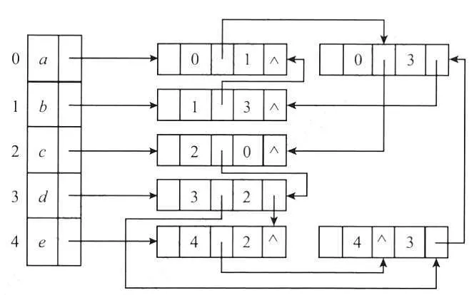
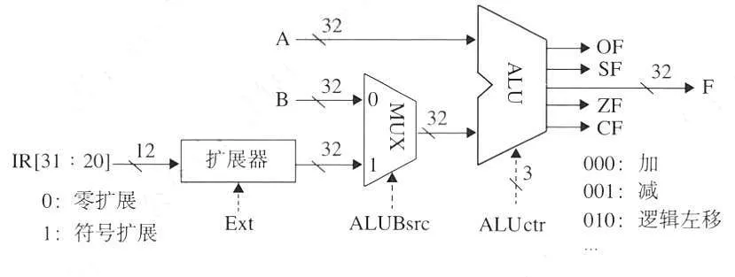
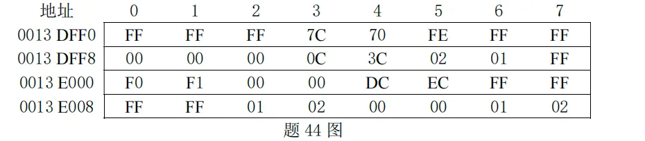
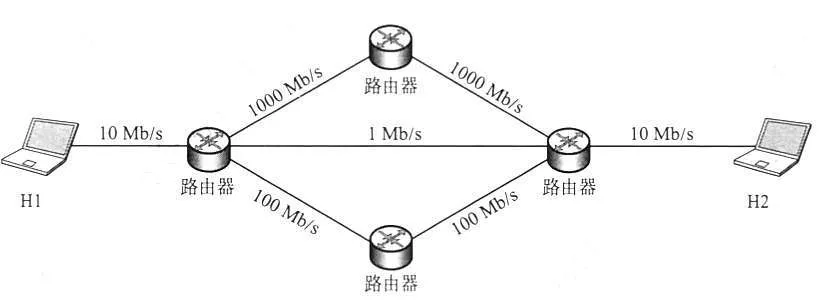
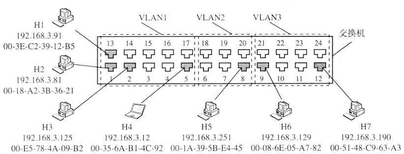
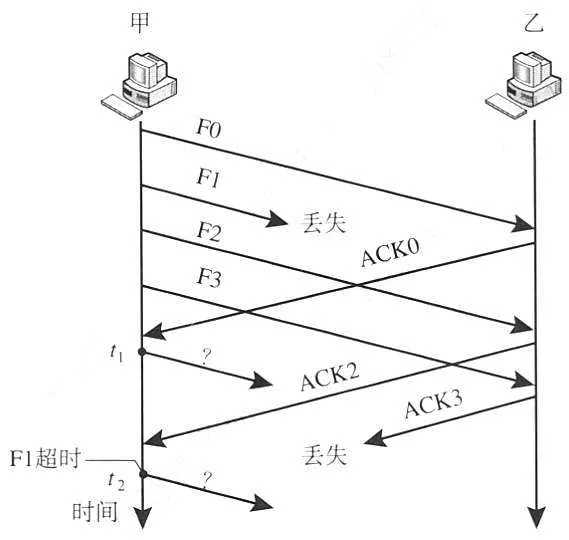
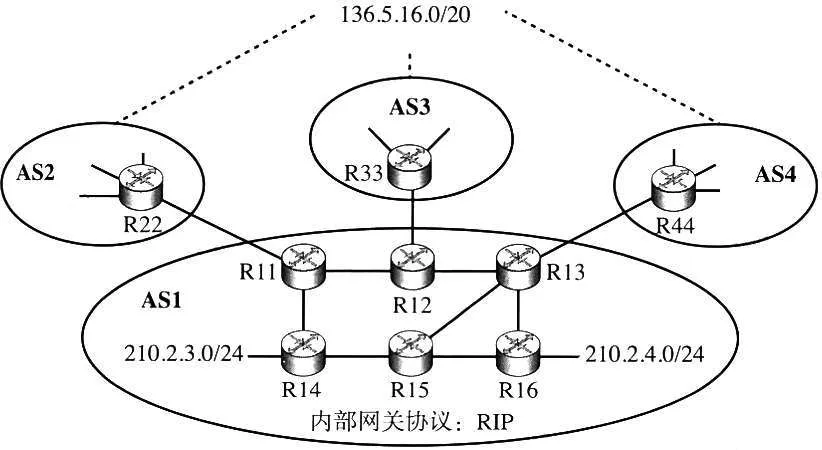

# 2024 年 408 真题 · 答案与解析

> 刷完 [[题面]] 后用此页对答案、看解析。
> 顺序：数据结构（1–11, 41–42）→ 组成原理（12–22, 43–44）→ 操作系统（23–32, 45–46）→ 计算机网络（33–40, 47）

## 一、选择题答案速查表（40 题，每题 2 分，共 80 分）

| 题号 | 1 | 2 | 3 | 4 | 5 | 6 | 7 | 8 | 9 | 10 |
| 答案 | **D** | **A** | **A** | **B** | **D** | **A** | **D** | **A** | **B** | **C** |
| 科目 | 数结 | 数结 | 数结 | 数结 | 数结 | 数结 | 数结 | 数结 | 数结 | 数结 |

| 题号 | 11 | 12 | 13 | 14 | 15 | 16 | 17 | 18 | 19 | 20 |
| 答案 | **D** | **B** | **B** | **C** | **D** | **D** | **C** | **B** | **C** | **B** |
| 科目 | 数结 | 组原 | 组原 | 组原 | 组原 | 组原 | 组原 | 组原 | 组原 | 组原 |

| 题号 | 21 | 22 | 23 | 24 | 25 | 26 | 27 | 28 | 29 | 30 |
| 答案 | **A** | **C** | **A** | **A** | **D** | **A** | **A** | **B** | **A** | **C** |
| 科目 | 组原 | 组原 | 操作 | 操作 | 操作 | 操作 | 操作 | 操作 | 操作 | 操作 |

| 题号 | 31 | 32 | 33 | 34 | 35 | 36 | 37 | 38 | 39 | 40 |
| 答案 | **C** | **C** | **B** | **C** | **D** | **B** | **D** | **D** | **C** | **D** |
| 科目 | 操作 | 操作 | 计网 | 计网 | 计网 | 计网 | 计网 | 计网 | 计网 | 计网 |

> 科目缩写：数结 = 数据结构 | 组原 = 计算机组成原理 | 操作 = 操作系统 | 计网 = 计算机网络

## 二、综合题答案要点速查表（7 题，共 70 分）

| 题号 | 分值 | 科目 | 考点 | 关键结论 |
|------|------|------|------|----------|
| 41 | 13 | 数据结构 | 图 | 答案：1、基本思想：仿 Kahn 算法做 n 轮，每轮统计入度为 0 的顶点 |
| 42 | 10 | 数据结构 | 查找 | 答案：1、HT 各地址 0～10 依次为 11、空、14、7、空、20、9、空、空、3、18；装填因子 α=7/11 |
| 43 | 13 | 计算机组成原理 | 指令系统 | 答案：1、rs1/rs2/rd 字段各占 5 位，故最多 2⁵=32 个通用寄存器；机器字长 32 位，左移位数需表示 0～31，5 位足够 |
| 44 | 10 | 计算机组成原理 | 存储器层次结构 | 答案：1、a 的首地址在 r3（03H），i 在 r2（02H），sum 在 r1（01H） |
| 45 | 7 | 操作系统 | 内存管理 | 答案：1、虚拟地址 1234 5678H 的页号（高 10 位）为 048H，页内偏移为 345678H |
| 46 | 8 | 操作系统 | 进程与线程 | 答案：1、是临界区 |
| 47 | 9 | 计算机网络 | 网络层 | 答案：1、AS4 选 OSPF |

---

## 三、详细解析

> 以下按题号顺序排列。每题包含题干、选项、答案、解析。
> 图片以相对路径 `images/xxx.webp` 引用，与本文同目录。

### 选择题 · 数据结构

### 1. （2 分 · 线性表）

已知带头结点的非空单链表 L 的头指针为 h，指针 p 指向 L 中间的一个链表结点(不是第一个和最后一个结点)。q=p->next，p->next=q->next，q->next=h->next，h->next=q。这段代码的功能是（ ）。

- **A.** 把 q 指向的结点插入到 p 的后面
- **B.** 把 p 指向的结点插入到 q 的后面
- **C.** 把 p 指向的结点插入到 h 的后面
- **D.** 把 q 指向的结点插入到 h 的后面

**答案**：D

**解析**：答案 D。q=p->next 记下后继，p->next=q->next 把 q 摘出，q->next=h->next 指向原首结点，h->next=q 把 q 接到头结点之后，即把 q 摘除后插入到链表头部。

> 难度 ⭐⭐⭐ ｜ 章节 线性表 ｜ 标签 数据结构 / 线性表 / 顺序表 / 链表 / 文件系统

---

### 2. （2 分 · 栈、队列与数组）

表达式 `x+y*(z-u)/v` 的等价后缀是（ ）

- **A.** xyzu-*v/+
- **B.** xyzu-v/*+
- **C.** +x/*y-zuv
- **D.** +x*y/-zuv

**答案**：A

**解析**：答案 A。按优先级自内向外转换：z-u 得 zu-，y*(z-u) 得 yzu-*，再除以 v 得 yzu-*v/，最后加 x 得 x yzu-*v/+，即 xyzu-*v/+。操作数次序不变，运算符按优先级依次后移。

> 难度 ⭐⭐ ｜ 章节 栈、队列与数组 ｜ 标签 数据结构 / 栈 / 队列 / 数组

---

### 3. （2 分 · 树与二叉树）

p、q、v 都是二叉树 T 中的结点，二叉树 T 的中序遍历为 ···, p，v，q，··· ，其中 v 有两个孩子结点，则下列说法正确的是( )。

- **A.** p 没右孩子，q 没左孩子
- **B.** p 没右孩子，q 有左孩子
- **C.** p 有右孩子，q 没左孩子
- **D.** p 有右孩子，q 有左孩子

**答案**：A

**解析**：答案 A。中序序列中 p 紧邻 v 之前，是 v 左子树中最后访问的结点，必无右孩子；q 紧邻 v 之后，是 v 右子树中最先访问的结点，必无左孩子。

> 难度 ⭐⭐⭐⭐ ｜ 章节 树与二叉树 ｜ 标签 数据结构 / 树 / 二叉树 / 二叉树遍历

---

### 4. （2 分 · 图）

给定无向图的邻接多重表，求顶点 b、d 的度()



- **A.** 0, 2
- **B.** 2, 4
- **C.** 3, 2
- **D.** 2, 3

**答案**：B

**解析**：答案 B。由邻接多重表还原图，边为 a-b、a-d、b-d、a-c、c-d、c-e、d-e。b 出现在 a-b、b-d 两条边中，度为 2；d 出现在 a-d、b-d、c-d、d-e 四条边中，度为 4。

> 难度 ⭐⭐⭐⭐ ｜ 章节 图 ｜ 标签 数据结构 / 图 / 最短路径 / 最小生成树

---

### 5. （2 分 · 查找）

下列数据结构中，不适合直接使用折半查找的是( )

I. 有序链表
II. 无序数组
III. 有序静态链表
IV. 无序静态链表

- **A.** 仅 I、II
- **B.** 仅 II、IV
- **C.** 仅 I、II、IV
- **D.** I、II、III、IV

**答案**：D

**解析**：答案 D。折半查找要求序列有序且能随机存取。链表（含静态链表）不能 O(1) 定位中点，静态链表的逻辑顺序也不等于数组下标；无序数组不满足有序条件，故四种结构均不适合。

> 难度 ⭐⭐⭐ ｜ 章节 查找 ｜ 标签 数据结构 / 查找 / 散列表 / B树 / 查找算法 / 链表

---

### 6. （2 分 · 串）

KMP 算法使用修正后的 next 数组进行模式匹配，模式串 S = "aabaab"，当主串中某字符与 S 中某字符失去配对时，S 将向右滑动的最长距离是( )

- **A.** 5
- **B.** 4
- **C.** 3
- **D.** 2

**答案**：A

**解析**：答案 A。"aabaab" 的 next 为 -1,0,1,0,1,2，修正后 nextval 为 -1,-1,1,-1,-1,1。失配时滑动距离为 j−nextval[j]，第 5 个字符失配时滑 4−(−1)=5 位，为最大值。

> 难度 ⭐⭐⭐⭐ ｜ 章节 串 ｜ 标签 数据结构 / 串 / 文件系统

---

### 7. （2 分 · 查找）

一棵二叉搜索树如下图所示，$K_1$、$K_2$、$K_3$ 分别是对应结点中保存的关键字、三角形表示子树。则子树 T 中任一结点中保存的关键字 X 满足的是（ ）。


- **A.** $X < K_1$
- **B.** $X > K_2$
- **C.** $K_1 < X < K_3$
- **D.** $K_3 < X < K_2$

**答案**：D

**解析**：答案 D。T 是 K3 的右子树，故 X>K3；K3 在 K2 的左子树中，故 X<K2；又 K3 在 K1 的右子树中，K3>K1。综合得 K3<X<K2。

> 难度 ⭐⭐⭐ ｜ 章节 查找 ｜ 标签 数据结构 / 查找 / 散列表 / B树 / 二叉排序树

---

### 8. （2 分 · 排序）

使用快速排序算法对含 N（N ≥ 3） 个元素的数组 M 进行排序，若第一趟排序将除枢轴外的 N-1 个元素划分为 P 和 Q 两个部分，则下列叙述中，正确的是（ ）。

- **A.** P 和 Q 块间有序
- **B.** P 和 Q 均块内有序
- **C.** P 和 Q 的元素个数大致相等
- **D.** P 和 Q 中均不存在相等的元素

**答案**：A

**解析**：答案 A。第一趟划分只保证枢轴左侧元素都小于枢轴、右侧都大于枢轴，即 P、Q 两块间有序；块内仍未排序，需递归继续，块内元素个数与是否相等均无保证。

> 难度 ⭐⭐⭐ ｜ 章节 排序 ｜ 标签 数据结构 / 排序 / 内部排序 / 外部排序 / 排序算法

---

### 9. （2 分 · 排序）

已知关键字序列 28, 22, 20, 19, 8, 12, 15, 5 是大根堆(最大堆)，对该堆进行两次删除操作后，得到的新堆是( )。

- **A.** 20, 19, 15, 12, 8, 5
- **B.** 20, 19, 15, 5, 8, 12
- **C.** 20, 19, 12, 15, 8, 5
- **D.** 20, 19, 8, 12, 15, 5

**答案**：B

**解析**：答案 B。删 28：末元素 5 上移下沉，得 22,19,20,5,8,12,15；删 22：末元素 15 上移下沉，得 20,19,15,5,8,12。即两次删除后新堆的层序为 20,19,15,5,8,12。

> 难度 ⭐⭐⭐ ｜ 章节 排序 ｜ 标签 数据结构 / 排序 / 内部排序 / 外部排序

---

### 10. （2 分 · 排序）

初始有三个升序序列 (3, 5)、(7, 9)、(6)，若按从左至右的次序选择有序序列进行二路归并排序，则关键字之间的总比较次数是( )。

- **A.** 3
- **B.** 4
- **C.** 5
- **D.** 6

**答案**：C

**解析**：答案 C。第一轮合并 (3,5) 与 (7,9)：3 比 7、5 比 7 共 2 次，剩余直接尾接；第二轮合并 (3,5,7,9) 与 (6)：3、5、7 各与 6 比较共 3 次。总比较次数 2+3=5。

> 难度 ⭐⭐⭐ ｜ 章节 排序 ｜ 标签 数据结构 / 排序 / 内部排序 / 外部排序 / 排序算法

---

### 11. （2 分 · 排序）

在外排序中，利用败者树对初始为升序的归并段进行多路归并，败者树中记录"冠军"的结点保存的是（ ）。

- **A.** 最大关键字
- **B.** 最小关键字
- **C.** 最大关键字所在的归并段号
- **D.** 最小关键字所在的归并段号

**答案**：D

**解析**：答案 D。败者树的内部结点记录每轮比较中"败者"所在的归并段号，根结点即"冠军"结点，保存的是当前最小关键字所在的归并段号。

> 难度 ⭐⭐⭐ ｜ 章节 排序 ｜ 标签 数据结构 / 排序 / 内部排序 / 外部排序

---

### 综合题 · 数据结构

### 41. （13 分 · 图）

2023 年 10 月 26 日，神舟十七号载人飞船发射取得圆满成功，再次彰显了中国航天事业的辉煌成就。载人航天工程是包含众多子工程的复杂系统工程，为了保证工程的有序开展，需要明确各子工程的前导工程，以协调各子工程的实施。该问题可以简化、抽象为有向图的拓扑序列问题。

已知有向图 G 采用邻接矩阵存储，类型定义如下：

```c
typedef struct {                    // 图的类型定义
    int  numVertices, numEdges;     // 图的顶点数和有向边数
    char VerticesList[MAXV];        // 顶点表，MAXV 为已定义常量
    int  Edge[MAXV][MAXV];          // 邻接矩阵
} MGraph;
```

请设计算法：`int uniquely(MGraph G)`，判定 G 是否存在唯一的拓扑序列，若是则返回 1，否则返回 0。要求：

(1) 给出算法的基本设计思想。（4 分）

(2) 根据设计思想，采用 C 或 C++ 语言描述算法，关键之处给出注释。（9 分）

**答案 / 解析**：

答案：1、基本思想：仿 Kahn 算法做 n 轮，每轮统计入度为 0 的顶点。若恰好只有 1 个，则删除它并令其后继的入度减 1；若为 0 个说明剩余顶点成环，若多于 1 个说明有多种选法，均不存在唯一拓扑序列，返回 0。每轮都唯一则返回 1。2、时间复杂度 O(n²)，空间复杂度 O(n)。核心代码：

```c
int uniquely(MGraph G) {
    int i, j, k, cnt, v0;
    int n = G.numVertices, inDeg[MAXV] = {0};
    for (i = 0; i < n; i++)                    // 统计各顶点入度
        for (j = 0; j < n; j++)
            if (G.Edge[i][j] != 0) inDeg[j]++;
    for (k = 0; k < n; k++) {                  // 重复 n 轮
        cnt = 0; v0 = -1;
        for (i = 0; i < n; i++)
            if (inDeg[i] == 0) { cnt++; v0 = i; }
        if (cnt != 1) return 0;                // 有环或拓扑序不唯一
        inDeg[v0] = -1;                        // 摘除 v0
        for (j = 0; j < n; j++)
            if (G.Edge[v0][j] != 0) inDeg[j]--; // 后继入度减 1
    }
    return 1;
}
```

> 难度 ⭐⭐⭐⭐ ｜ 章节 图 ｜ 标签 数据结构 / 图 / 最短路径 / 最小生成树 / 图的存储

---

### 42. （10 分 · 查找）

将关键字 20, 3, 11, 18, 9, 14, 7 依次存储到长度为 11 的散列表 HT 中，散列函数为 H(key) = (key × 3) mod 11。

H₀ 为初始散列地址，H₁、H₂、H₃、…、H_k 分别为第 1 次冲突、第 2 次冲突、第 3 次冲突、…、第 k 次冲突时探测的地址，H_k = (H₀ + k²) mod 11。

请回答下列问题：

(1) 画出所构造的 HT，并计算 HT 的装填因子。

(2) 给出在 HT 中查找关键字 14 的关键字比较序列。

(3) 在 HT 中查找关键字 8，确认查找失败时的散列地址是多少？

**答案 / 解析**：

答案：1、HT 各地址 0～10 依次为 11、空、14、7、空、20、9、空、空、3、18；装填因子 α=7/11。2、查找 14：H₀=9 处为 3，H₁=10 处为 18，H₂=2 处命中 14，比较序列为 3、18、14。3、查找 8：H₀=2 处为 14，H₁=3 处为 7，H₂=6 处为 9，H₃=0 处为 11，H₄=7 处为空，查找失败，失败时的散列地址为 7。

> 难度 ⭐⭐⭐⭐ ｜ 章节 查找 ｜ 标签 数据结构 / 查找 / 散列表 / B树

---

### 选择题 · 计算机组成原理

### 12. （2 分 · 数据表示与运算）

C 语言代码如下：

```c
int i    = 32777;
short si = i;
int j    = si;
```

执行上述代码段后，j 的值为（ ）。

- **A.** -32777
- **B.** -32759
- **C.** 32759
- **D.** 32777

**答案**：B

**解析**：答案 B。32777=2¹⁵+9，转 short 时截取低 16 位得 8009H，按补码解读为 −32768+9=−32759；再转 int 做符号扩展，数值不变，仍为 −32759。

> 难度 ⭐⭐⭐ ｜ 章节 数据表示与运算 ｜ 标签 计算机组成原理 / 数据表示 / 运算

---

### 13. （2 分 · 指令系统）

将汇编语言程序中实现特定功能的指令序列定义成一条伪指令。下列选项中，CPU 能理解并直接执行的是（ ）。

Ⅰ. 伪指令
Ⅱ. 微指令
Ⅲ. 机器指令
Ⅳ. 汇编指令

- **A.** 仅Ⅰ和Ⅳ
- **B.** 仅Ⅱ和Ⅲ
- **C.** 仅Ⅲ和Ⅳ
- **D.** 仅Ⅰ、Ⅲ和Ⅳ

**答案**：B

**解析**：答案 B。CPU 直接执行机器指令，每条机器指令又由控制器执行的若干微指令完成；伪指令由汇编器处理，汇编指令需汇编器翻译成机器码，CPU 均不直接执行。

> 难度 ⭐⭐ ｜ 章节 指令系统 ｜ 标签 计算机组成原理 / 指令系统 / 寻址方式 / CISC / RISC / CPU设计

---

### 14. （2 分 · 数据表示与运算）

某科学实验中，需要使用大量的整型参数，为了在保证表数精度的基础上提高运算速度，需要选择合理的数据表示方法。若整型参数 α 和 β 的取值范围分别为 −2²⁰～2²⁰、−2⁴⁰～2⁴⁰，则下列选项中，α 和 β 最适宜采用的数据表示方法分别是（ ）。

- **A.** 32 位整数、32 位整数
- **B.** 单精度浮点数、单精度浮点数
- **C.** 32 位整数、双精度浮点数
- **D.** 单精度浮点数、双精度浮点数

**答案**：C

**解析**：答案 C。α 的范围 ±2²⁰ 在 32 位整数范围内，整数运算快且无精度损失，用 32 位整数；β 达 ±2⁴⁰，超出 32 位整数与单精度浮点（只能精确表示 ±2²⁴ 内的整数）的范围，应用双精度浮点。

> 难度 ⭐⭐⭐ ｜ 章节 数据表示与运算 ｜ 标签 计算机组成原理 / 数据表示 / 运算

---

### 15. （2 分 · 数据表示与运算）

下列关于整数乘法运算的叙述中，错误的是（ ）。

- **A.** 用阵列乘法器实现乘运算可以在一个时钟周期完成
- **B.** 用 ALU 和移位器实现的乘运算无法在一个时钟周期内完成
- **C.** 变量与常数的乘运算可编译优化为若干条移位及加/减运算指令
- **D.** 两个变量的乘运算无法编译为移位及加法等指令的循环实现

**答案**：D

**解析**：答案 D。A 阵列乘法器是组合电路，一个时钟周期可完成；B 用 ALU 加移位器需多个周期；C 变量乘常数可编译为若干移位和加减指令。D 错误：两个变量相乘同样可用移位加法的循环实现（如加移法）。

> 难度 ⭐⭐⭐ ｜ 章节 数据表示与运算 ｜ 标签 计算机组成原理 / 数据表示 / 运算

---

### 16. （2 分 · 存储器层次结构）

对于页式虚拟存储管理系统，下列关于存储器层次结构的叙述中，错误的是（ ）。

- **A.** Cache-主存层次的交换单位为主存块，主存-外存层次的交换单位为页
- **B.** Cache-主存层次替换算法由硬件实现，主存-外存层次由软件实现
- **C.** Cache-主存层次可采用回写法写策略，主存-外存层次通常采用回写法
- **D.** Cache-主存层次可采用直接映射，主存-外存层次通常采用直接映射

**答案**：D

**解析**：答案 D。Cache-主存层次可用直接映射，但主存-外存层次采用页式映射（本质是全相联），虚拟页可装入任一空闲页框，不采用直接映射。

> 难度 ⭐⭐⭐ ｜ 章节 存储器层次结构 ｜ 标签 计算机组成原理 / 存储器层次结构 / 虚拟内存

---

### 17. （2 分 · 存储器层次结构）

某计算机按字节编址，采用页式虚拟存储管理方式，虚拟地址为 32 位，主存地址为 30 位，页大小为 1KB。若 TLB 共有 32 个表项，采用 4 路组相联映射方式，则 TLB 表项中标记字段的位数至少是（ ）。

- **A.** 17
- **B.** 18
- **C.** 19
- **D.** 20

**答案**：C

**解析**：答案 C。页大小 1KB=2¹⁰B，虚拟页号 32−10=22 位。TLB 32 项 4 路组相联共 8 组，组号占 3 位，标记位数=22−3=19。

> 难度 ⭐⭐⭐ ｜ 章节 存储器层次结构 ｜ 标签 计算机组成原理 / 存储器层次结构 / Cache / 地址转换 / 虚拟内存

---

### 18. （2 分 · 存储器层次结构）

下列事件中，不是在 MMU 地址转换过程检测的是（ ）。

- **A.** 访问越权
- **B.** Cache 缺失
- **C.** 页面缺失
- **D.** TLB 缺失

**答案**：B

**解析**：答案 B。MMU 地址转换过程中检测 TLB 缺失、页面缺失和访问越权；Cache 缺失发生在物理地址产生之后，由 Cache 控制器检测，不在 MMU 转换过程内。

> 难度 ⭐⭐⭐ ｜ 章节 存储器层次结构 ｜ 标签 计算机组成原理 / 存储器层次结构

---

### 19. （2 分 · 中央处理器）

在采用"取指、译码/取数、执行、访存、写回"5 段流水线的 RISC 处理器中，下列关于指令流水线数据冒险处理的叙述中，错误的是（ ）。

- **A.** 相邻两条指令中的操作数相关可能引起数据冒险
- **B.** 在数据相关的指令间插入"气泡"能避免数据冒险
- **C.** 所有数据冒险都可以通过加入转发（旁路）电路解决
- **D.** 所有数据冒险都能通过调整指令顺序和插入 nop 指令解决

**答案**：C

**解析**：答案 C。A、B、D 均正确。C 错误：load-use 冒险中，load 的结果到访存阶段末才就绪，而后续指令执行阶段就要使用，旁路电路来不及，必须插入气泡阻塞一个周期。

> 难度 ⭐⭐⭐ ｜ 章节 中央处理器 ｜ 标签 计算机组成原理 / CPU / 数据通路 / 指令流水线 / Cache / 指令集架构

---

### 20. （2 分 · 总线）

某存储器总线的时钟频率为 420MHz，总线宽度为 64 位，每个时钟周期传送 2 次数据；其总线事务支持突发传送方式，最多传送 8 次数据，第 1 个时钟周期传送地址和读/写命令，从第 4 个至第 7 个时钟周期连续传送 8 次数据。该总线的总线带宽（最大传输速率）为（ ）。

- **A.** 3.84 GB/s
- **B.** 6.72 GB/s
- **C.** 30.72 GB/s
- **D.** 53.76 GB/s

**答案**：B

**解析**：答案 B。总线每个时钟周期传 2 次数据，每次 64 位=8B，即每周期传 16B。最大传输速率=16B×420MHz=6.72GB/s（53.76Gb/s），按数据传输阶段的峰值计算，不计事务中地址/命令周期开销。

> 难度 ⭐⭐⭐⭐ ｜ 章节 总线 ｜ 标签 计算机组成原理 / 总线 / 系统总线 / I/O接口 / 性能指标 / 物理层

---

### 21. （2 分 · 输入输出系统）

下列关于中断 I/O 方式的叙述中，错误的是（ ）。

- **A.** 中断屏蔽字用于确定中断响应的优先级
- **B.** 保存断点和程序状态字在中断响应阶段完成
- **C.** 保存通用寄存器和设置新中断屏蔽字由软件实现
- **D.** 单重中断方式下，中断处理时 CPU 处于关中断状态

**答案**：A

**解析**：答案 A。中断屏蔽字决定中断处理过程中哪些中断能打断当前中断（处理优先级），不能决定中断响应的顺序；响应优先级由硬件判优电路确定，屏蔽字无法改变。

> 难度 ⭐⭐⭐ ｜ 章节 输入输出系统 ｜ 标签 计算机组成原理 / I/O系统 / 中断 / DMA / I/O方式

---

### 22. （2 分 · 输入输出系统）

DMA 方式中，DMA 控制器控制的数据传输通路位于（ ）。

- **A.** CPU 和主存之间
- **B.** CPU 和 DMA 控制器之间
- **C.** 设备接口和主存之间
- **D.** 设备接口和 DMA 控制器之间

**答案**：C

**解析**：答案 C。DMA 方式下数据在设备接口与主存之间直接传送，不经过 CPU，DMA 控制器只发送地址、计数等控制信号，故数据通路位于设备接口和主存之间。

> 难度 ⭐ ｜ 章节 输入输出系统 ｜ 标签 计算机组成原理 / I/O系统 / 中断 / DMA / I/O方式

---

### 综合题 · 计算机组成原理

### 43. （13 分 · 指令系统）

假定计算机 M 字长为 32 位，按字节编址，采用 32 位定长指令字，指令 add、slli 和 lw 的格式、编码和功能说明如题 43 图（a）所示。

| 指令 | 31～25 | 24～20 | 19～15 | 14～12 | 11～7 | 6～0 | 指令功能说明 |
| :---: | :---: | :---: | :---: | :---: | :---: | :---: | :--- |
| add | 0000000 | rs2 | rs1 | 000 | rd | 0110011 | $R[rd] leftarrow R[rs1]+R[rs2]$ |
| slli | 0000000 | shamt | rs1 | 010 | rd | 0010011 | $R[rd] leftarrow R[rs1] << shamt$ |
| lw | imm[11:5] | imm[4:0] | rs1 | 010 | rd | 0000011 | $R[rd] leftarrow M[R[rs1]+imm]$ |

*题 43 图（a）*

其中，$R[x]$ 表示通用寄存器 x 的内容，$M[x]$ 表示地址为 x 的存储单元内容，shamt 为移位位数，imm 为补码表示的偏移量。题 43 图（b）给出了计算机 M 的部分数据通路及其控制信号（用带箭头虚线表示），其中，A 和 B 分别表示从通用寄存器 rs1 和 rs2 中读出的内容；IR[31:20] 表示指令寄存器中的高 12 位；控制信号 Ext 为 0、1 时扩展器分别实现零扩展、符号扩展，ALUctr 为 000、001、010 时 ALU 分别实现加、减、逻辑左移运算。



请回答下列问题。

（1）计算机 M 最多有多少个通用寄存器？为什么 shamt 字段占 5 位？（2 分）

（2）执行 add 指令时，控制信号 ALUBsrc 的取值应是什么？若 rs1 和 rs2 寄存器内容分别是 8765 4321H 和 9876 5432H，则 add 指令执行后，ALU 输出端 F、OF 和 CF 的结果分别是什么？若该 add 指令处理的是无符号整数，则应根据哪个标志判断是否溢出？（5 分）

（3）执行 slli 指令时，控制信号 Ext 的取值可以是 0 也可以是 1，为什么？（2 分）

（4）执行 lw 指令时，控制信号 Ext、ALUctr 的取值分别是什么？（2 分）

（5）若一条指令的机器码是 A040 A103H，则该指令一定是 lw 指令，为什么？若执行该指令时，R[01H] = FFFF A2D0H，则所读取数据的存储地址是什么？（2 分）

**答案 / 解析**：

答案：1、rs1/rs2/rd 字段各占 5 位，故最多 2⁵=32 个通用寄存器；机器字长 32 位，左移位数需表示 0～31，5 位足够。2、add 的 B 端取 rs2 寄存器内容，ALUBsrc=0。F=8765 4321H+9876 5432H=1 1FDB 9753H，取低 32 位为 1FDB 9753H；最高位有进位，CF=1；两负数相加结果为正，发生溢出，OF=1。无符号整数用 CF 判断溢出。3、slli 指令 IR[31:20] 的最高位为 0，零扩展与符号扩展都在高位补 0，结果相同，故 Ext 取 0 或 1 均可。4、lw 的 imm 是补码偏移量，可正可负，须符号扩展，Ext=1；地址为 R[rs1]+imm，ALU 做加法，ALUctr=000。5、A040 A103H 的低 7 位为 0000011，正是 lw 的 opcode；其 rs1 字段为 01H，imm 为 A04H，符号扩展成 FFFF FA04H。存储地址=FFFF FA04H+FFFF A2D0H=FFFF 9CD4H。

> 难度 ⭐⭐⭐⭐ ｜ 章节 指令系统 ｜ 标签 计算机组成原理 / 指令系统 / 寻址方式 / CISC / RISC / CPU设计 / 文件系统 / 物理层

---

### 44. （10 分 · 存储器层次结构）

对于题 43 中的计算机 M，C 语言程序 P 包含的语句 `sum+=a[i];` 在 M 中对应的指令序列 S 如下。

```
slli  r4, r2, 2    // R[r4] ← R[r2] << 2
add   r4, r3, r4   // R[r4] ← R[r3] + R[r4]
lw    r5, 0(r4)    // R[r5] ← M[R[r4] + 0]
add   r1, r1, r5   // R[r1] ← R[r1] + R[r5]
```

已知变量 i、sum 和数组 a 都为 int 型，通用寄存器 r1～r5 的编号为 01H～05H。

请回答下列问题。

（1）根据指令序列 S 中每条指令的功能，写出存放数组 a 的首地址、变量 i 和 sum 的通用寄存器编号。（3 分）

（2）已知 M 为小端方式计算机，采用页式存储管理方式，页大小为 4KB。若执行到指令序列 S 中第 1 条指令时，i = 5 且 r1 和 r3 的内容分别为 0000 1332H 和 0013 DFF0H，从地址 0013 DFF0H 开始的存储单元内容如题 44 图所示，则执行 `sum+=a[i];` 语句后，a[i] 的地址、a[i] 和 sum 的机器数分别是什么（用十六进制表示）？a[i] 所在页的页号是多少？此次执行中，数组 a 至少存放在几页中？（5 分）



（3）指令 `slli r4, r2, 2` 的机器码是什么（用十六进制表示）？若数组 a 改为 short 类型，则指令序列 S 中 slli 指令的汇编形式应是什么？（2 分）

**答案 / 解析**：

答案：1、a 的首地址在 r3（03H），i 在 r2（02H），sum 在 r1（01H）。2、a[i] 地址=0013 DFF0H+5×4=0013 E004H；小端读出 4 字节 DC EC FF FF，故 a[i]=FFFF ECDCH；sum=0000 1332H+FFFF ECDCH=0000 000EH（舍去进位）；页大小 4KB，a[i] 所在页页号=0013EH；数组首元素在 0013DH 页、a[5] 在 0013EH 页，至少占 2 页。3、slli r4, r2, 2 的机器码为 0021 2213H；a 改为 short 后移位量为 1，汇编形式为 slli r4, r2, 1。

> 难度 ⭐⭐⭐⭐ ｜ 章节 存储器层次结构 ｜ 标签 计算机组成原理 / 存储器层次结构

---

### 选择题 · 操作系统

### 23. （2 分 · 输入输出管理）

下面关于中断和异常的说法中，错误的是（ ）。

- **A.** 中断或异常发生时，CPU 处于内核态
- **B.** 每个系统调用都有对应的内核服务例程
- **C.** 中断处理程序开始执行时，CPU 处于内核态
- **D.** 系统添加新类型设备时，需注册相应的中断服务例程

**答案**：A

**解析**：答案 A。中断或异常在用户程序执行时发生，此刻 CPU 处于用户态，响应后才切换到内核态执行处理程序；B、C、D 均正确。

> 难度 ⭐⭐⭐ ｜ 章节 输入输出管理 ｜ 标签 操作系统 / I/O系统 / 中断 / DMA / I/O方式

---

### 24. （2 分 · 进程与线程）

下列选项中，操作系统在终止进程时不一定执行的是（ ）。

- **A.** 终止子进程
- **B.** 回收分配的内存资源
- **C.** 撤销进程 PCB
- **D.** 回收进程占用的设备

**答案**：A

**解析**：答案 A。终止进程时必回收内存资源、撤销 PCB、回收占用的设备；子进程不一定被终止，父进程终止后子进程可继续运行（如成为孤儿进程）。

> 难度 ⭐⭐⭐ ｜ 章节 进程与线程 ｜ 标签 操作系统 / 进程管理 / 进程 / 线程 / 同步 / PV操作

---

### 25. （2 分 · 进程与线程）

在支持页式存储管理的系统中，进程切换时 OS 要执行（ ）。

Ⅰ. 更新 PC（程序计数器）值
Ⅱ. 更新栈基址寄存器值（ebp）
Ⅲ. 更新页表基址寄存器值

- **A.** 仅 Ⅲ
- **B.** 仅 Ⅰ、Ⅱ
- **C.** 仅 Ⅰ、Ⅲ
- **D.** Ⅰ、Ⅱ、Ⅲ

**答案**：D

**解析**：答案 D。进程切换需保存和恢复完整上下文：更新 PC 使新进程从正确位置继续，更新栈基址寄存器使用自己的栈，页式存储下还要更新页表基址寄存器切换地址空间，三项都要执行。

> 难度 ⭐⭐ ｜ 章节 进程与线程 ｜ 标签 操作系统 / 进程管理 / 进程 / 线程 / 同步 / PV操作 / 栈 / 地址转换

---

### 26. （2 分 · 文件管理）

文件系统需要额外的外存空间记录空闲块的位置，占用外存空间大小与当前空闲块数量无关的是（ ）。

- **A.** 位示图
- **B.** 空闲表
- **C.** 成组链接
- **D.** 空闲链表

**答案**：A

**解析**：答案 A。位示图每个磁盘块对应一位，大小只取决于磁盘总块数，与当前空闲块数量无关；空闲表、成组链接、空闲链表的大小都随空闲块数量变化。

> 难度 ⭐⭐⭐ ｜ 章节 文件管理 ｜ 标签 操作系统 / 文件系统 / 文件 / 目录 / 磁盘

---

### 27. （2 分 · 内存管理）

回收分区时，仅合并大小相等的空闲分区的算法是（ ）。

- **A.** 伙伴算法
- **B.** 最佳适应算法
- **C.** 最坏适应算法
- **D.** 首次适应算法

**答案**：A

**解析**：答案 A。伙伴算法按 2 的幂次划分内存，回收时仅当两个空闲分区大小相等、物理相邻且互为伙伴才合并；最佳、最坏、首次适应算法回收时只要求相邻，无大小相等的要求。

> 难度 ⭐⭐ ｜ 章节 内存管理 ｜ 标签 操作系统 / 内存管理 / 分页 / 分段 / 虚拟内存 / 页面置换

---

### 28. （2 分 · 进程与线程）

若进程 P 中有一个线程 T，打开文件后获得 fd，再创建线程 Ta、Tb，则线程 Ta、Tb 可共享的资源是（ ）。

Ⅰ. 进程 P 的地址空间
Ⅱ. 线程 T 的栈
Ⅲ. fd

- **A.** 仅 Ⅰ
- **B.** 仅 Ⅰ、Ⅲ
- **C.** 仅 Ⅱ、Ⅲ
- **D.** Ⅰ、Ⅱ、Ⅲ

**答案**：B

**解析**：答案 B。同一进程的各线程共享进程的地址空间和文件描述符表（fd）；栈是线程私有的，T 的栈不能被 Ta、Tb 共享。

> 难度 ⭐⭐ ｜ 章节 进程与线程 ｜ 标签 操作系统 / 进程管理 / 进程 / 线程 / 同步 / PV操作 / 栈 / 文件系统

---

### 29. （2 分 · 文件管理）

以下系统调用中，包含文件按名查找功能的系统调用是（ ）。

- **A.** open()
- **B.** read()
- **C.** write()
- **D.** close()

**答案**：A

**解析**：答案 A。open() 以文件路径名为参数，需先在目录中按名查找文件；read、write、close 均以已打开的 fd 为参数，不需按名查找。

> 难度 ⭐ ｜ 章节 文件管理 ｜ 标签 操作系统 / 文件系统 / 文件 / 目录 / 磁盘

---

### 30. （2 分 · 进程与线程）

假设某系统使用时间片轮转调度算法进行 CPU 调度，时间片大小为 5 ms，系统共有 10 个进程，初始时均处于就绪队列，执行结束前仅处于执行态或就绪态。若队尾的进程 P 所需 CPU 时间最短，时间为 25 ms。在不考虑系统开销的情况下，则进程 P 的周转时间为（ ）。

- **A.** 200ms
- **B.** 205ms
- **C.** 250ms
- **D.** 295ms

**答案**：C

**解析**：答案 C。P 需 25/5=5 个时间片，每轮 10 个进程各运行 5ms，共 50ms。P 在队尾，每轮最后一个执行，完成时刻为 5×50=250ms，周转时间即 250ms。

> 难度 ⭐⭐⭐ ｜ 章节 进程与线程 ｜ 标签 操作系统 / 进程管理 / 进程 / 线程 / 同步 / PV操作 / 队列 / 进程调度

---

### 31. （2 分 · 输入输出管理）

键盘中断服务例程执行结束时，所输入的数据存放位置是（ ）。

- **A.** 用户缓冲区
- **B.** CPU 的通用寄存器
- **C.** 内核缓冲区
- **D.** 键盘控制器的数据缓冲区

**答案**：C

**解析**：答案 C。中断服务例程把键盘控制器数据寄存器中的数据读出并存入内核缓冲区后返回；用户缓冲区要等 read 系统调用时才复制过去。

> 难度 ⭐⭐ ｜ 章节 输入输出管理 ｜ 标签 操作系统 / I/O系统 / 中断 / DMA / I/O方式

---

### 32. （2 分 · 输入输出管理）

某磁盘的磁道数为 400（磁道号为 0～399），采用循环扫描算法 (CSCAN) 进行磁盘调度，完成对 200 号磁道的请求后，磁头向磁道号减小的方向移动，若还有 7 个请求，对应的磁道号分别为 300, 120, 110, 0, 160, 210, 399，则完成上述磁盘请求后磁头移动的距离是（ ）。

- **A.** 599
- **B.** 619
- **C.** 788
- **D.** 799

**答案**：C

**解析**：答案 C。从 200 向减小方向依次服务 160、120、110、0，移动 40+40+10+110=200；跳到 399 移动 399，再向减小方向服务 300、210，移动 99+90。总距离 200+399+99+90=788。

> 难度 ⭐⭐⭐ ｜ 章节 输入输出管理 ｜ 标签 操作系统 / I/O系统 / 中断 / DMA / 磁盘 / 进程调度

---

### 综合题 · 操作系统

### 45. （7 分 · 内存管理）

某计算机按字节编址，采用页式虚拟存储管理方式，虚拟地址和物理地址的长度均为 32 位，页表项的大小为 4 字节，页大小为 4MB，虚拟地址结构如下。

| 页号 | 页内偏移量 |
| :---: | :---: |
| 10 位 | 22 位 |

进程 P 的页表起始虚拟地址为 B8C0 0000H，被装载到从物理地址 6540 0000H 开始的连续主存空间中。

请回答下列问题，要求答案用十六进制表示。

（1）若 CPU 在执行进程 P 的过程中，访问虚拟地址 1234 5678H 时发生了缺页异常，经过缺页异常处理和 MMU 地址转换后得到的物理地址是 BAB4 5678H，在此次缺页异常处理过程中，需要为所缺页分配页框并更新相应的页表项，则该页表项的虚拟地址和物理地址分别是什么？该页表项中的页框号更新后的值是什么？（3 分）

（2）进程 P 的页表所在页的页号是什么？该页对应的页表项的虚拟地址是什么？该页表项中的页框号是什么？（4 分）

**答案 / 解析**：

答案：1、虚拟地址 1234 5678H 的页号（高 10 位）为 048H，页内偏移为 345678H。页表项虚拟地址=B8C0 0000H+048H×4=B8C0 0120H，物理地址=6540 0000H+048H×4=6540 0120H；转换后物理地址 BAB4 5678H 的页框号（高 10 位）为 2EAH。2、页表起始虚拟地址 B8C0 0000H 的高 10 位即页表所在页的页号，为 2E3H；该页对应的页表项虚拟地址=B8C0 0000H+2E3H×4=B8C0 0B8CH；页表装载的物理地址 6540 0000H 的高 10 位即该页表项的页框号，为 195H。

> 难度 ⭐⭐⭐⭐ ｜ 章节 内存管理 ｜ 标签 操作系统 / 内存管理 / 分页 / 分段 / 虚拟内存 / 页面置换 / 地址转换 / 内存分配

---

### 46. （8 分 · 进程与线程）

计算机系统中的进程之间往往需要相互协作以完成一个任务。在某网络系统中缓冲区 B 用于存放一个数据分组，对 B 的操作有 C1、C2、C3：

- C1：将一个数据分组写入 B
- C2：从 B 中读出一个数据分组
- C3：对 B 中的数据分组进行修改

要求 B 为空时才能执行 C1，B 非空时才能执行 C2 和 C3。

请回答下列问题。

(1) 假设进程 P1 和 P2 均需执行 C1，实现 C1 的代码是否为临界区？为什么？（2 分）

(2) 假设 B 初始为空，进程 P1 执行 C1 一次，进程 P2 执行 C2 一次。请定义尽可能少的信号量，并用 `wait()`/`signal()` 操作描述 P1、P2 之间的同步或互斥关系，说明所用信号量的作用及初值。（3 分）

(3) 假设 B 初始不为空，进程 P1 和 P2 各执行 C3 一次，请定义尽可能少的信号量，并用 `wait()`/`signal()` 操作描述 P1 和 P2 之间的同步或互斥关系，说明所用信号量的作用及初值。（3 分）

**答案 / 解析**：

答案：1、是临界区。C1 对共享缓冲区 B 进行写操作，P1、P2 同时执行会破坏数据一致性，必须互斥访问，故实现 C1 的代码是临界区。2、只需 1 个同步信号量 full=0，表示 B 中是否有数据：P1 写完置 1，P2 等其为 1 后再读。3、只需 1 个互斥信号量 mutex=1，保证同一时刻只有一个进程执行 C3。核心代码：

```c
semaphore full = 0;             // (2) 同步：B 中是否有数据
P1() { C1; signal(full); }      // 写入 B 后通知 P2
P2() { wait(full); C2; }        // 等 B 非空再读出

semaphore mutex = 1;            // (3) 互斥：同一时刻只允许一个进程访问 B
P1() { wait(mutex); C3; signal(mutex); }
P2() { wait(mutex); C3; signal(mutex); }
```

> 难度 ⭐⭐⭐ ｜ 章节 进程与线程 ｜ 标签 操作系统 / 进程管理 / 进程 / 线程 / 同步 / PV操作 / 缓冲区 / 同步与互斥

---

### 选择题 · 计算机网络

### 33. （2 分 · 计算机网络体系结构）

若分组交换网络及每段链路的带宽如下图，则 H1 到 H2 的最大吞吐量约为（ ）。



- **A.** 1 Mbps
- **B.** 10 Mbps
- **C.** 100 Mbps
- **D.** 1000 Mbps

**答案**：B

**解析**：答案 B。H1 到 H2 的吞吐量受路径上最小带宽链路的限制，首尾链路带宽均为 10Mbps，故最大吞吐量约为 10Mbps。

> 难度 ⭐⭐⭐ ｜ 章节 计算机网络体系结构 ｜ 标签 计算机网络 / 计算机网络体系结构 / 内存分配 / 物理层

---

### 34. （2 分 · 物理层）

在下列二进制数字调制方法中，需要 2 个不同频率载波的是（ ）。

- **A.** ASK
- **B.** PSK
- **C.** FSK
- **D.** DPSK

**答案**：C

**解析**：答案 C。FSK（频移键控）用不同频率的载波分别表示 0 和 1，需要 2 个不同频率；ASK 靠幅度变化，PSK、DPSK 靠相位变化，都只用单一频率载波。

> 难度 ⭐⭐ ｜ 章节 物理层 ｜ 标签 计算机网络 / 物理层 / 编码 / 调制

---

### 35. （2 分 · 数据链路层）

如下图所示的支持 VLAN 划分的交换机，已按端口划分了 3 个 VLAN，部分端口连接主机的 IP 地址和 MAC 地址如图中所示，ARP 表结构为 <IP 地址，MAC 地址，TTL>，下列选项中，不会出现在 H4 的 ARP 表中的是（ ）。



- **A.** <192.168.3.81, 00-18-A2-3B-36-21, 14:32:00>
- **B.** <192.168.3.91, 00-3E-C2-39-12-B5, 14:37:00>
- **C.** <192.168.3.125, 00-E5-78-4A-09-B2, 14:45:00>
- **D.** <192.168.3.129, 00-08-6E-05-A7-82, 14:52:00>

**答案**：D

**解析**：答案 D。ARP 请求是广播帧，只在同一 VLAN（广播域）内传播。H4 在 VLAN1，H6 在 VLAN3，跨 VLAN 的广播被交换机隔离，故 H6 的 IP-MAC 映射不会出现在 H4 的 ARP 表中。

> 难度 ⭐⭐⭐ ｜ 章节 数据链路层 ｜ 标签 计算机网络 / 数据链路层 / MAC / CSMA/CD / PPP / 同步与互斥 / 内存分配 / 网络层

---

### 36. （2 分 · 数据链路层）

在采用 CSMA/CA 的 802.11 无线局域网中，DIFS = 120 μs，SIFS = 28 μs，RTS、CTS 和 ACK 帧的传输时延分别是 3 μs、2 μs 和 2 μs，忽略信号传播时延。若主机 A 欲向 AP 发送一个总长度为 1998 B 的数据帧，无线链路带宽为 54 Mb/s，则隐藏站 B 收到 AP 发送的 CTS 帧时，设置的网络分配向量 NAV 的值是（）

- **A.** 326 μs
- **B.** 354 μs
- **C.** 385 μs
- **D.** 513 μs

**答案**：B

**解析**：答案 B。数据帧发送时间=1998×8/54Mbps=296μs。B 收到 CTS 后设置的 NAV 为 CTS 之后的 SIFS+数据+SIFS+ACK=28+296+28+2=354μs。

> 难度 ⭐⭐⭐⭐ ｜ 章节 数据链路层 ｜ 标签 计算机网络 / 数据链路层 / MAC / CSMA/CD / PPP / 物理层

---

### 37. （2 分 · 数据链路层）

如图所示，主机甲向乙发送数据，采用 SR 滑动窗口协议，发送窗口为 4，序号为 0 ～ 7。在 t1 时刻，帧 F1 出错，甲在 t1 和 t2 时刻发送的数据帧分别是（ ）。



- **A.** F1、F3
- **B.** F1、F4
- **C.** F3、F1
- **D.** F4、F1

**答案**：D

**解析**：答案 D。SR 协议发送窗口为 4。t1 时刻收到 ACK0，窗口右移，甲发送新帧 F4；t2 时刻 F1 超时，只重传 F1（选择性重传，不重发其他帧）。

> 难度 ⭐⭐⭐⭐ ｜ 章节 数据链路层 ｜ 标签 计算机网络 / 数据链路层 / MAC / CSMA/CD / PPP / 传输层

---

### 38. （2 分 · 传输层）

假设主机 H 通过 TCP 向服务器发送长度为 3000 B 的报文，往返时间 RTT = 10 ms，最长报文段寿命 MSL = 30 s，最大报文段长度 MSS = 1000 B，忽略 TCP 段的传输时延，报文传输结束后 H 首先请求断开连接，则从 H 请求建立 TCP 连接时刻起，到 H 进入 CLOSED 状态为止，所需时间至少是（ ）

- **A.** 30.03 s
- **B.** 30.04 s
- **C.** 60.03 s
- **D.** 60.04 s

**答案**：D

**解析**：答案 D。建立连接 1 个 RTT；3000B 数据按 MSS=1000B 分 3 段，慢开始需 2 个 RTT 发完；断开连接 1 个 RTT；再等 2MSL=60s。共 4RTT+2MSL=40ms+60s=60.04s。

> 难度 ⭐⭐⭐⭐ ｜ 章节 传输层 ｜ 标签 计算机网络 / 传输层 / TCP / UDP / 拥塞控制

---

### 39. （2 分 · 传输层）

若 UDP 协议在计算校验和过程中，计算机得到中间结果为 1011 1001 1011 0110 时，还需要加上最后一个 16 位数 0110 0101 1100 0101，则最终计算得到的校验和是（ ）

- **A.** 0001 1111 0111 1011
- **B.** 0001 1111 0111 1100
- **C.** 1110 0000 1000 0011
- **D.** 1110 0000 1000 0100

**答案**：C

**解析**：答案 C。两数相加得 1 0001 1111 0111 1011，把溢出的最高位 1 回卷加到低位得 0001 1111 0111 1100，再按位取反得校验和 1110 0000 1000 0011。

> 难度 ⭐⭐⭐⭐ ｜ 章节 传输层 ｜ 标签 计算机网络 / 传输层 / TCP / UDP / 拥塞控制

---

### 40. （2 分 · 应用层）

若浏览器不支持并行 TCP 连接，使用非持久的 HTTP/1.0 协议请求浏览 1 个 web 页，该页中引用同一个网站上 7 个小图像文件，则从浏览器传输 web 页请求建立 TCP 连接开始，到接收完所有内容为止，所需要的往返时间 RTT 数至少是（ ）

- **A.** 4
- **B.** 9
- **C.** 14
- **D.** 16

**答案**：D

**解析**：答案 D。非持久 HTTP/1.0 且不支持并行连接时，每个对象需建立连接 1 个 RTT 加请求/响应 1 个 RTT，共 2 RTT。主页面加 7 个图像共 8 个对象，共 8×2=16 个 RTT。

> 难度 ⭐⭐ ｜ 章节 应用层 ｜ 标签 计算机网络 / 应用层 / HTTP / DNS / FTP / SMTP / 文件系统 / 传输层

---

### 综合题 · 计算机网络

### 47. （9 分 · 网络层）

网络空间是继陆海空地之后的"第五疆域"，网络技术是网络疆域建设与治理的基础。路由算法与协议是网络核心技术之一。对其准确认知，合理选择与应用，对网络建设十分重要。假设现有互联网中的 4 个自治系统互连拓扑示意图如题 47 图所示。其中，AS1 运行内部网关协议 RIP；AS3 规模较小，自治系统内任意两个主机间通信，经过路由器数不超过 15 个；AS4 规模较大，自治系统内任意两个主机间通信，经过路由器数量可能超过 20 个。



请回答下列问题：

(1) 若仅有 RIP 和 OSPF 内部网关协议供选择，则 AS4 应选择哪个协议？

(2) 若 AS3 中的某主机向本自治系统另一主机发送 1 个 IP 分组，为确保该 IP 分组能正常接收，则该 IP 分组的初始 TTL 值应至少设置为多少？

(3) 设 AS1 中的路由器同一时刻启动，启动后立即构建并交换初始距离向量，之后每隔 30 s 交换一次最新的距离向量。则从交换初始距离向量时刻算起，R11～R16 路由器均获到达网络 210.2.4.0/24 的正确路由，至少需多长时间？

(4) R44 向 R13 通告到达网络 136.5.16.0/20 路由时，由 BGP 协议哪类会话完成？通过哪个 BGP 报文通告？R13 通过 BGP 协议的哪类会话将该网络可达性信息通告给 R14 和 R15？

(5) 若 R14 和 R15 均收到分别由 R11、R12、R13 通告的到达网络 136.5.16.0/20 的可达性信息为：

- 目的网络：136.5.16.0/20，AS 路径：AS2 AS8 AS19，下一跳：R11
- 目的网络：136.5.16.0/20，AS 路径：AS3 AS7 AS11 AS19，下一跳：R12
- 目的网络：136.5.16.0/20，AS 路径：AS4 AS10 AS19，下一跳：R13

则在无策略约束情况下，R14 和 R15 更新路由表后，各自路由表中到达网络 136.5.16.0/20 路由的下一跳分别是什么（用路由器名称表示）？

**答案 / 解析**：

答案：1、AS4 选 OSPF。AS4 内任意两主机通信可能经过 20 多个路由器，超过 RIP 的 15 跳上限，RIP 不可用。2、至少 16。AS3 内最多经过 15 个路由器，TTL 每经过一个路由器减 1，初始值 16 到达时仍剩 1，能正常接收。3、60s。210.2.4.0/24 直连在 AS1 中某路由器上，RIP 每 30s 交换一次距离向量，一次交换传播一跳，距直连点最远 3 跳的路由器需 (3−1)×30=60s 获知正确路由。4、R44 与 R13 分属不同自治系统，用 eBGP 会话，通过 UPDATE 报文通告；R13 与 R14、R15 同属 AS1，用 iBGP 会话，也用 UPDATE 报文通告。5、无策略约束时按 AS 路径最短选择：R11 的路径为 3 跳（AS2 AS8 AS19），R12 为 4 跳（AS3 AS7 AS11 AS19），R13 为 3 跳（AS4 AS10 AS19），排除 R12。R14 的下一跳为 R11，R15 的下一跳为 R13。

> 难度 ⭐⭐⭐⭐ ｜ 章节 网络层 ｜ 标签 计算机网络 / 网络层 / IP / 路由 / 子网划分 / CIDR / 内存分配


## See Also

- [[题面]] — 仅题干与选项，用于限时刷题
- [[../408历年真题总目录]] — 历年真题总目录
- [[408考情分析]] — 试卷构成与逐年考点统计
