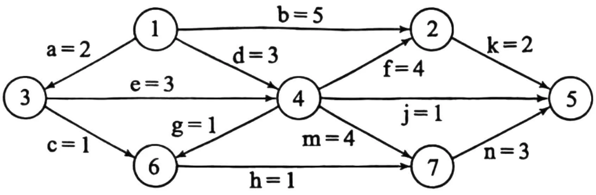
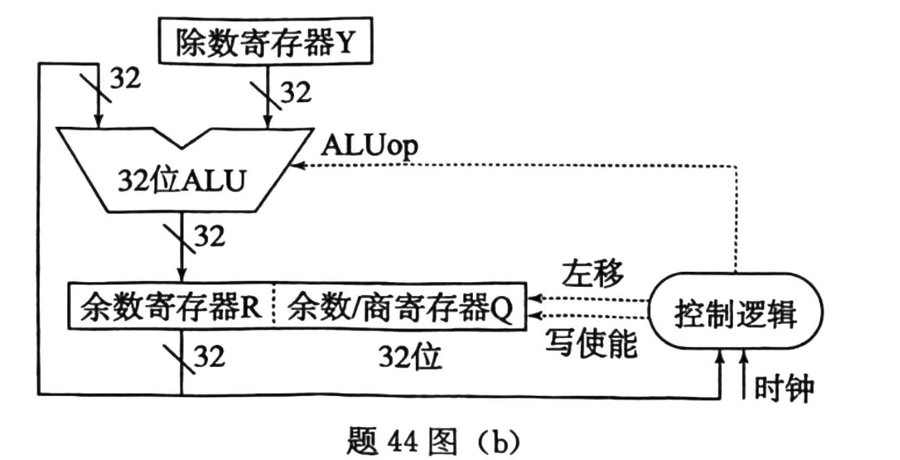
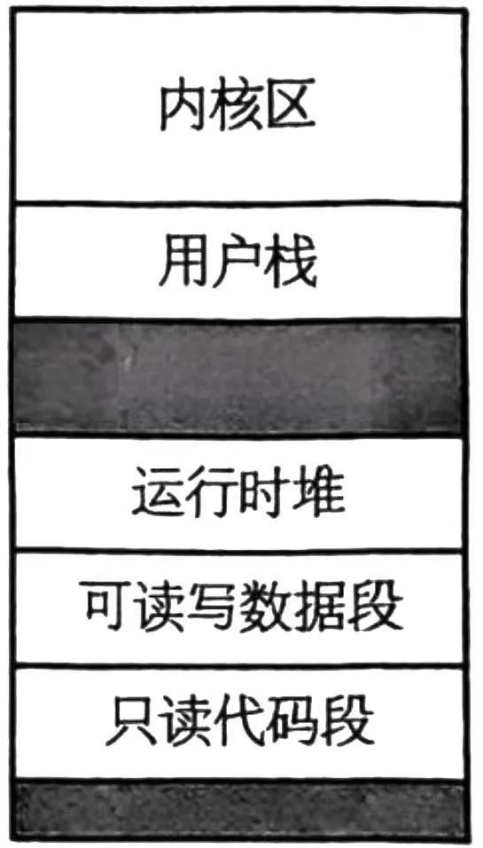
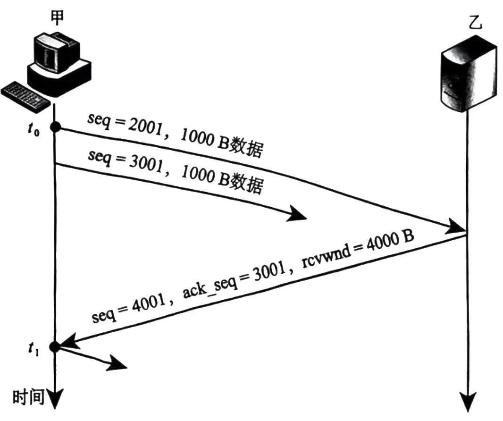
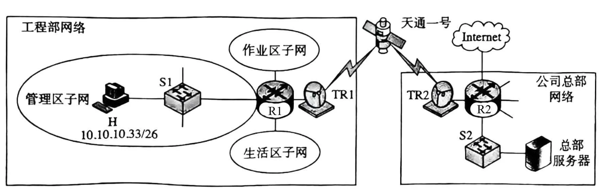

# 2025 年 408 真题 · 答案与解析

> 刷完 [[题面]] 后用此页对答案、看解析。
> 顺序：数据结构（1–11, 41–42）→ 组成原理（12–22, 43–44）→ 操作系统（23–32, 45–46）→ 计算机网络（33–40, 47）

## 一、选择题答案速查表（40 题，每题 2 分，共 80 分）

| 题号 | 1 | 2 | 3 | 4 | 5 | 6 | 7 | 8 | 9 | 10 |
|------|---|---|---|---|---|---|---|---|---|---|
| 答案 | **B** | **D** | **D** | **B** | **D** | **C** | **C** | **C** | **A** | **D** |
| 科目 | 数结 | 数结 | 数结 | 数结 | 数结 | 数结 | 数结 | 数结 | 数结 | 数结 |

| 题号 | 11 | 12 | 13 | 14 | 15 | 16 | 17 | 18 | 19 | 20 |
|------|----|----|----|----|----|----|----|----|----|----|
| 答案 | **A** | **D** | **D** | **D** | **C** | **B** | **C** | **B** | **A** | **A** |
| 科目 | 数结 | 组原 | 组原 | 组原 | 组原 | 组原 | 组原 | 组原 | 组原 | 组原 |

| 题号 | 21 | 22 | 23 | 24 | 25 | 26 | 27 | 28 | 29 | 30 |
|------|----|----|----|----|----|----|----|----|----|----|
| 答案 | **B** | **A** | **D** | **C** | **C** | **B** | **D** | **C** | **C** | **A** |
| 科目 | 组原 | 组原 | 操作 | 操作 | 操作 | 操作 | 操作 | 操作 | 操作 | 操作 |

| 题号 | 31 | 32 | 33 | 34 | 35 | 36 | 37 | 38 | 39 | 40 |
|------|----|----|----|----|----|----|----|----|----|----|
| 答案 | **C** | **B** | **B** | **C** | **C** | **C** | **B** | **A** | **B** | **A** |
| 科目 | 操作 | 操作 | 计网 | 计网 | 计网 | 计网 | 计网 | 计网 | 计网 | 计网 |

> 科目缩写：数结 = 数据结构 | 组原 = 计算机组成原理 | 操作 = 操作系统 | 计网 = 计算机网络

## 二、综合应用题答案要点速查表（7 题，共 70 分）

| 题号 | 分值 | 科目 | 考点 | 关键结论 |
|------|------|------|------|----------|
| 41 | 13 | 数结 | 线性表 | 从右往左扫描维护后缀 `maxValue`/`minValue`，`res[i] = max(A[i]·max, A[i]·min)`；时间 O(n)，空间 O(1) |
| 42 | 10 | 数结 | 图（AOE） | `ve = (0,9,2,5,12,6,9)`，`vl = (0,10,2,5,12,8,9)`；关键活动 a/e/m/n；活动 j 余量最大 = 6；b 最多 4，压缩 k 至 1 |
| 43 | 12 | 组原 | Cache/虚存 | 块内 6 位 + 组号 6 位（64 组 8 路）；`d[100] VA = 0180 01B0H`，组号 6；缺失率 ≈ 3.15%，平均 8.24 周期；3 页，缺页 3 次 |
| 44 | 9 | 组原 | CPU/除法器 | R = FFFFFFFFH，Q = 87654321H，Y = 000000FFH；控制逻辑含计数器；ALUop = 加/减；异常：除 0 或商溢出（`80000000H / FFFFFFFFH`） |
| 45 | 8 | 操作 | PV 同步 | 4 个信号量：`mutex=1`（铁锹互斥）、`pits=3`（甲挖坑额度）、`empty=0`（待乙坑数）、`water=0`（待浇树苗） |
| 46 | 9 | 操作 | 内存布局 | PCB 在内核区；scanf 阻塞态；main 代码在 .text；ptr 全局读写段；length 在用户栈；ptr 指向字符串在堆区 |
| 47 | 9 | 计网 | 网络层 | 单向传播时延 0.24s，吞吐 200 kbps；4000B 需 0.4s；GBN 窗口 ≥ 8，帧序号 4 位；生活区 `10.10.10.128/25`，作业区 `10.10.10.64/26` |

---

## 三、详细解析

> 以下按题号顺序排列。每题包含题干、选项、答案、解析。
> 图片以相对路径 `images/xxx.webp` 引用，与本文同目录。

### 选择题 · 数据结构

### 1. （2 分 · 绪论）

以下 C 代码的时间复杂度是（ ）。

```C
int count = 0;
for (int i=0; i*i<n; i++)
    for (int j=0; j<i; j++)
        count++;
```

- **A.** O(log₂n)
- **B.** O(n)
- **C.** O(nlog₂n)
- **D.** O(n²)

**答案**：B

**解析**：答案 B。外层循环 i 从 0 取到约 √n，内层循环执行 i 次，总执行次数约 Σi ≈ n/2，故时间复杂度为 O(n)。

> 难度 ⭐⭐⭐ ｜ 章节 绪论 ｜ 标签 数据结构 / 绪论

---

### 2. （2 分 · 栈、队列与数组）

对于括号匹配问题，符号栈初始为空，容量为 3，下列表达式不能实现的是( )。

- **A.** (a+[b+(c+d)e]+f)+g-h
- **B.** [a*((b+c)/(d-e)+f/g)]-h
- **C.** [a*(b-(c-d)*e/(f+g))-h]
- **D.** [a-(b+[c*(d+e)-f]+g+h)]

**答案**：D

**解析**：答案 D。括号匹配时遇左符号入栈、遇右符号出栈，扫描过程中栈深峰值即最大嵌套深度。A、B、C 的峰值均为 3；D 中 [a-(b+[c*(d+e) 出现 [、[、(、( 四层嵌套，深度达 4，超过栈容量 3，无法实现。

> 难度 ⭐⭐⭐ ｜ 章节 栈、队列与数组 ｜ 标签 数据结构 / 栈 / 队列 / 数组

---

### 3. （2 分 · 树与二叉树）

若二叉树的节点值均为正整数，采用顺序存储方式保存在数组 R 中，用 -1 表示节点不存在，则下列数组中，不能表示一棵二叉树的是()。

- **A.** `R[] = {20, 15, 40, -1, -1, 35}`
- **B.** `R[] = {15, 40, 10, 18, 35, -1, -1}`
- **C.** `R[] = {15, 40, 10, -1, -1, -1, 12}`
- **D.** `R[] = {17, 20, 35, -1, 18, 45, -1, -1, 19, 27}`

**答案**：D

**解析**：答案 D。顺序存储中下标 i 的结点的父结点下标为 ⌊(i−1)/2⌋。D 中下标 8 的值为 19，其父结点下标为 3，但 R[3] = −1（父结点不存在），违反二叉树定义；其余选项每个非 −1 结点都有存在的父结点。

> 难度 ⭐⭐⭐⭐ ｜ 章节 树与二叉树 ｜ 标签 数据结构 / 树 / 二叉树 / 二叉树遍历

---

### 4. （2 分 · 树与二叉树）

下列关于二叉树及森林的叙述中，正确的是？( )。

- **A.** 完全二叉树不存在度为 1 的结点
- **B.** 任意一个森林可以转换为一棵二叉树。
- **C.** 二叉树的分支结点个数比叶结点个数少
- **D.** 链式树的根中保存的是最先计算的运算符

**答案**：B

**解析**：答案 B。完全二叉树可有度为 1 的结点（如仅 2 个结点时根度为 1），A 错；森林按孩子兄弟表示法总可转为一棵二叉树，B 对；链状树分支可比叶子多，C 错；表达式树的根存最后计算的运算符，D 错。

> 难度 ⭐⭐⭐ ｜ 章节 树与二叉树 ｜ 标签 数据结构 / 树 / 二叉树 / 二叉树遍历

---

### 5. （2 分 · 树与二叉树）

设字符集 S 包含 7 个字符，各字符出现的频次分别是 2, 3, 4, 6, 8, 10, 11。为 S 中的各字符构造哈夫曼编码，编码长度不小于 3 的字符个数是( )。

- **A.** 2
- **B.** 3
- **C.** 4
- **D.** 5

**答案**：D

**解析**：答案 D。合并最小两个频次：2+3=5、4+5=9、6+8=14、9+10=19、11+14=25、19+25=44。10、11 深度 2，4、6、8 深度 3，2、3 深度 4，编码长度不小于 3 的有 4、6、8、2、3 共 5 个。

> 难度 ⭐⭐⭐⭐ ｜ 章节 树与二叉树 ｜ 标签 数据结构 / 树 / 二叉树 / 二叉树遍历 / 哈夫曼树 / 物理层

---

### 6. （2 分 · 图）

下列关于图的叙述中，正确的是( )。

- **A.** 有向图必定存在入度为 0 的顶点
- **B.** 有向无环图的拓扑排序有序序列存在且唯一
- **C.** 各顶点的度均大于等于 2 的无向图必有回路
- **D.** 可用 BFS 算法求出带权图中的每一对顶点的最短路径

**答案**：C

**解析**：答案 C。若无向图所有顶点度 ≥ 2 而无回路，则它是树或森林，而树或森林必有度为 1 的叶子，矛盾，故必有回路。A 反例为有向环（各顶点入度均为 1）；B 中拓扑排序可能不唯一；D 中 BFS 不能求带权图的最短路径。

> 难度 ⭐⭐⭐ ｜ 章节 图 ｜ 标签 数据结构 / 图 / 最短路径 / 最小生成树

---

### 7. （2 分 · 查找）

已知查找表中有 400 个元素，查找元素概率相同。采用分块查找法且均匀分块。若采用顺序查找法确定元素所在块，且块内也采用顺序查找法，为效率最高，每块包含元素应为( )。

- **A.** 8
- **B.** 10
- **C.** 20
- **D.** 25

**答案**：C

**解析**：答案 C。每块 s 个元素、共 b 块，b·s = 400，平均查找长度约 (b+s)/2 + 1。均值不等式 b+s ≥ 2√(bs) = 40，b = s = 20 时最小，故每块 20 个元素。

> 难度 ⭐⭐⭐ ｜ 章节 查找 ｜ 标签 数据结构 / 查找 / 散列表 / B树 / 查找算法

---

### 8. （2 分 · 查找）

给 7 个不同的关键字，能够构成不同 4 阶 B 树的个数为( )。

- **A.** 7
- **B.** 8
- **C.** 9
- **D.** 10

**答案**：C

**解析**：答案 C。4 阶 B 树每个结点关键字数在 1～3 之间，叶子同层。树高为 3 时仅 1 种结构；树高为 2 时按根结点含 1、2、3 个关键字分别有 1、6、1 种，共 8 种。合计 9 种。

> 难度 ⭐⭐⭐⭐ ｜ 章节 查找 ｜ 标签 数据结构 / 查找 / 散列表 / B树

---

### 9. （2 分 · 查找）

下列关于散列法处理冲突的叙述中，正确的是( )。

- **A.** 只要散列表不满，线性探查再散列一定能找到一个空闲位置
- **B.** 只要散列表不满，二次探查再散列一定能找到一个空闲位置
- **C.** 线性探查再散列处理的冲突，一定是发生在同义词之间
- **D.** 二次探查再散列处理的冲突，一定是发生在非同义词之间

**答案**：A

**解析**：答案 A。线性探查的探查序列为 h, h+1, h+2, …（模 m），必然遍历全部 m 个位置，只要散列表不满就一定能找到空位。二次探查可能只探查部分位置，表未满也可能失败；线性探查与二次探查的冲突都可能发生在同义词或非同义词之间。

> 难度 ⭐⭐⭐⭐ ｜ 章节 查找 ｜ 标签 数据结构 / 查找 / 散列表 / B树

---

### 10. （2 分 · 排序）

下列排序算法中，最坏情况下元素移动最少的是( )。

- **A.** 冒泡排序
- **B.** 直接插入排序
- **C.** 快速排序
- **D.** 简单选择排序

**答案**：D

**解析**：答案 D。简单选择排序每趟只比较不移动，找到最小元素后再与当前趟首元素交换（至多 3 次移动），共 n−1 趟，最坏移动次数为 O(n)；冒泡、直接插入、快速排序最坏移动次数均为 O(n²)。

> 难度 ⭐⭐⭐ ｜ 章节 排序 ｜ 标签 数据结构 / 排序 / 内部排序 / 外部排序

---

### 11. （2 分 · 排序）

对含 9 个关键字的初始序列进行排序，若序列的变化情况如下表所示，则采用的排序算法是（）。

| 阶段 | 序列 |
|------|------|
| 初始序列 | 5, 25, 40, 30, 10, 20, 45, 15, 35 |
| 第 1 趟排序后 | 5, 10, 20, 30, 15, 35, 45, 25, 40 |
| 第 2 趟排序后 | 5, 10, 15, 25, 20, 30, 40, 35, 45 |

- **A.** 希尔排序
- **B.** 基数排序
- **C.** 归并排序
- **D.** 折半插入排序

**答案**：A

**解析**：答案 A。第 1 趟排序后下标差 3 的子序列有序，第 2 趟后下标差 2 的子序列有序，符合希尔排序按增量 3、2 分组做插入排序的过程。

> 难度 ⭐⭐⭐⭐ ｜ 章节 排序 ｜ 标签 数据结构 / 排序 / 内部排序 / 外部排序

---

### 综合题 · 数据结构

### 41. （13 分 · 线性表）

设有两个长度均为 n 的一维整型数组 A 和 res，对数组 A 中的每个元素 A[i]，计算 A[i] 与 A[j]（0 ≤ i ≤ j ≤ n-1）乘积的最大值，并将其保存到 res[i] 中。例如，若 A = {1, 4, -9, 6}，则得到 res = {6, 24, 81, 36}。现给定数组 A，请设计一个时间和空间上尽可能高效的算法 calMulMax，求 res 中各元素的值。函数原型为：

```c
void calMulMax(int A[], int res[], int n);
```

要求：

(1) 给出算法的基本设计思想。（4 分）

(2) 根据设计思想，采用 C 或 C++ 语言描述算法，关键之处给出注释。（7 分）

(3) 说明你所设计算法的时间复杂度和空间复杂度。（2 分）

**答案 / 解析**：

答案：1、基本思想：res[i] 是 A[i] 与后缀 A[i..n−1] 中某元素乘积的最大值。A[i] ≥ 0 时取后缀最大值，A[i] < 0 时取后缀最小值。从右往左一次扫描，同时维护后缀最大值 maxValue 和最小值 minValue，res[i] = max(A[i]·maxValue, A[i]·minValue)。2、核心代码：

```c
void calMulMax(int A[], int res[], int n) {
    int minValue = INT32_MAX;
    int maxValue = INT32_MIN;
    for (int i = n - 1; i >= 0; i--) {
        if (A[i] < minValue) minValue = A[i];
        if (A[i] > maxValue) maxValue = A[i];
        if (A[i] > 0) res[i] = A[i] * maxValue;
        else res[i] = A[i] * minValue;
    }
}
```
3、时间复杂度 O(n)，空间复杂度 O(1)。

> 难度 ⭐⭐⭐⭐ ｜ 章节 线性表 ｜ 标签 数据结构 / 线性表 / 顺序表 / 链表

---

### 42. （10 分 · 图）

某 AOE 网描述了 12 个工程活动及其持续时间（活动名跳过 i、l 避免与数字 1、字母 l 混淆）。



请回答下列问题：

(1) 完成该工程的最短时间是多少？哪些是关键活动？

(2) 若以最短时间完成工程，则与活动 e 同时进行的活动可能有哪些？

(3) 时间余量最大的活动是哪个？其时间余量是多少？

(4) 假设工程从时刻 0 启动，因某种原因，活动 b 在时刻 6 开始，为保证工程不延期，在其它活动持续时间保持不变的情况下，b 的持续时间最多是多少？若不改变 b 的持续时间，则压缩哪个活动的持续时间也能保证工程不延期？

**答案 / 解析**：

答案：1、按拓扑序求 ve、逆序求 vl 得：ve = (0, 9, 2, 5, 12, 6, 9)，vl = (0, 10, 2, 5, 12, 8, 9)。最短工期 = ve(v5) = 12；ve = vl 的顶点为 1、3、4、7、5，对应关键活动为 a、e、m、n。2、活动 e 的执行区间为 [2, 5]，可与 e 同时进行的活动有 b、c、d。3、时间余量 = vl(j) − ve(i) − 边长，活动 j 余量最大，为 vl(v5) − ve(v4) − 1 = 12 − 5 − 1 = 6。4、活动 b 在时刻 6 开始，为保证 6 + b + k ≤ 12（k 不变为 2），b 的持续时间最多为 4；若不缩短 b，则需将活动 k 的持续时间压缩为 1。

> 难度 ⭐⭐⭐⭐ ｜ 章节 图 ｜ 标签 数据结构 / 图 / 最短路径 / 最小生成树 / 图算法

---


---

### 选择题 · 计算机组成原理

### 12. （2 分 · 数据表示与运算）

在 32 位计算机上执行下列 C 语言代码：

```c
short si = -32767
unsigned int ui = si;
```

则 ui 的真值为（ ）。

- **A.** $2^{15}-1$
- **B.** $2^{15}+1$
- **C.** $2^{32}-2^{15}-1$
- **D.** $2^{32}-2^{15}+1$

**答案**：D

**解析**：答案 D。−32767 的 16 位补码为 1000 0000 0000 0001。short 转 unsigned 时先符号扩展到 32 位，高位补 1 得 0xFFFF8001，按无符号读即 2³²−2¹⁵+1。

> 难度 ⭐⭐⭐ ｜ 章节 数据表示与运算 ｜ 标签 计算机组成原理 / 数据表示 / 运算

---

### 13. （2 分 · 数据表示与运算）

已知 float 型变量用 IEEE 754 单精度浮点数格式表示。若 float 型变量 x 的机器数为 4730 0000H；则 x 的值为（ ）。

- **A.** $0.375 \times 2^{14}$
- **B.** $1.375 \times 2^{14}$
- **C.** $0.375 \times 2^{15}$
- **D.** $1.375 \times 2^{15}$

**答案**：D

**解析**：答案 D。4730 0000H = 0100 0111 0011…B，S=0，阶码 E = 1000 1110₂ = 142，指数 = 142−127 = 15；尾数 1.011₂ = 1.375，故 x = 1.375 × 2¹⁵。

> 难度 ⭐⭐⭐ ｜ 章节 数据表示与运算 ｜ 标签 计算机组成原理 / 数据表示 / 运算

---

### 14. （2 分 · 数据表示与运算）

假设 8 位字长的计算机中，两个带符号整数 x 和 y 的补码表示分别为 x 补 = A3H，y 补 = 75H，则通过补码加减运算器得到的 x-y 的值及 OF 标志分别为（ ）。

- **A.** 24, 0
- **B.** 24, 1
- **C.** 46, 0
- **D.** 46, 1

**答案**：D

**解析**：答案 D。x−y 的补码为 x补+(−y)补 = A3H + 8BH = 1 0010 1110，舍去最高进位得 0010 1110₂ = 46。两负数相加得正数，符号反转，故 OF = 1。

> 难度 ⭐⭐⭐⭐ ｜ 章节 数据表示与运算 ｜ 标签 计算机组成原理 / 数据表示 / 运算

---

### 15. （2 分 · 数据表示与运算）

某 32 位计算机按字节编址，采用小端方式存放数据，编译器按边界对齐方式为下列 C 语言结构型数组变量 employee 分配储存空间。

```c
struct record {
    int id;
    char name[10];
    int salary;
} employee[200];
```

数组 employee 的起始地址为 0000A0B0H，employee[1].id 的机器数为 12345678H，问 56H 的地址是多少？（ ）。

- **A.** 0000 A0C3H
- **B.** 0000 A0C4H
- **C.** 0000 A0C5H
- **D.** 0000 A0C6H

**答案**：C

**解析**：答案 C。struct record 按边界对齐共 20B（4+10+2+4）。employee[1] 首地址 = A0B0H + 20 = A0C4H，其 id 按小端存放为 78 56 34 12，故 56H 在 A0C5H。

> 难度 ⭐⭐⭐⭐ ｜ 章节 数据表示与运算 ｜ 标签 计算机组成原理 / 数据表示 / 运算

---

### 16. （2 分 · 指令系统）

下列选项中，由指令体系结构（ISA）规定的是（ ）。

- **A.** 是否采用阵列乘法器
- **B.** 是否采用定长指令字格式
- **C.** 是否采用微程序控制器
- **D.** 是否采用单总线数据通路

**答案**：B

**解析**：答案 B。ISA 规定软件可见的接口约定，包括指令格式（如是否采用定长指令字）。是否采用阵列乘法器、微程序控制器、单总线数据通路都属于微架构层面的实现细节，不由 ISA 规定。

> 难度 ⭐⭐ ｜ 章节 指令系统 ｜ 标签 计算机组成原理 / 指令系统 / 寻址方式 / CISC / RISC

---

### 17. （2 分 · 指令系统）

下列关于 RISC 的叙述中，错误的是（ ）。

- **A.** 多采用硬连线方式实现控制器
- **B.** 通常采用 Load/Store 型指令设计风格
- **C.** 难以采用流水线数据通路实现微架构
- **D.** 多采用寄存器传递过程调用时的参数

**答案**：C

**解析**：答案 C。RISC 指令定长、格式统一、采用 Load/Store 型设计，恰恰易于采用流水线数据通路，因此 C 说「难以采用流水线」是错误的。A、B、D 均符合 RISC 特点。

> 难度 ⭐⭐ ｜ 章节 指令系统 ｜ 标签 计算机组成原理 / 指令系统 / 寻址方式 / CISC / RISC / 指令集架构

---

### 18. （2 分 · 计算机系统概述）

下列关于 CPI 和 CPU 时钟周期的叙述中，错误的是（ ）。

- **A.** 不同类型指令的 CPI 可能不一样
- **B.** 程序的 CPI 与 Cache 缺失率无关
- **C.** 单周期 CPU 的时钟周期以最耗时指令所用的时间为准
- **D.** 流水线 CPU 的时钟周期以最长流水段所用时间为准

**答案**：B

**解析**：答案 B。程序 CPI 会受 Cache 缺失率影响：缺失带来额外的访存延迟，使访存指令的平均时钟周期数增加，故 B 说「与缺失率无关」错误。A、C、D 均正确。

> 难度 ⭐⭐⭐ ｜ 章节 计算机系统概述 ｜ 标签 计算机组成原理 / 计算机系统概述 / 性能指标

---

### 19. （2 分 · 中央处理器）

下列关于 CPU 中的数据通路和控制器的叙述中，错误的是（ ）。

- **A.** 通用寄存器组中应该包含程序计数器
- **B.** 控制器中一定包含指令操作码的译码电路
- **C.** 单周期 CPU 中的控制器比多周期 CPU 中的更简单
- **D.** 流水线 CPU 需解决数据相关和控制相关等冒险问题

**答案**：A

**解析**：答案 A。PC 是保存下一条指令地址的专用寄存器，由控制器自动更新，不属于通用寄存器组，故 A 错误。控制器含操作码译码电路、单周期 CPU 控制器更简单、流水线 CPU 需解决数据与控制冒险均正确。

> 难度 ⭐⭐⭐ ｜ 章节 中央处理器 ｜ 标签 计算机组成原理 / CPU / 数据通路 / 指令流水线 / CPU设计

---

### 20. （2 分 · 总线）

某处理器总线采用同步并行传输方式，每个总线时钟周期传送 4 次数据（quadpumped 技术），若该总线的工作频率为 1333MHz，总线宽度为 64 位，则总线带宽约为（ ）。

- **A.** 10.66 GB/s
- **B.** 42.66 GB/s
- **C.** 85.31 GB/s
- **D.** 341.25 GB/s

**答案**：A

**解析**：答案 A。总线带宽 = 工作频率 × 总线宽度 = 1333 × 10⁶ × 8B ≈ 10.66 GB/s。题给 1333 MHz 已是每周期传 4 次的 quadpumped 工作频率，不能再乘 4。

> 难度 ⭐⭐⭐⭐ ｜ 章节 总线 ｜ 标签 计算机组成原理 / 总线 / 系统总线 / I/O接口 / 性能指标 / 同步与互斥 / 物理层

---

### 21. （2 分 · 输入输出系统）

下列设备中，适合采用 DMA 输入输出的设备是（ ）。

Ⅰ. 键盘
Ⅱ. 网卡
Ⅲ. 固态硬盘
Ⅳ. 针式打印机

- **A.** Ⅰ、Ⅱ
- **B.** Ⅱ、Ⅲ
- **C.** Ⅱ、Ⅳ
- **D.** Ⅲ、Ⅳ

**答案**：B

**解析**：答案 B。DMA 适合高速、成块传输的设备。网卡和固态硬盘数据传输量大且成块，适合用 DMA；键盘、针式打印机数据量小且零散，用中断方式更合适。

> 难度 ⭐⭐ ｜ 章节 输入输出系统 ｜ 标签 计算机组成原理 / I/O系统 / 中断 / DMA / I/O方式

---

### 22. （2 分 · 输入输出系统）

下列选项中，会触发外部中断请求的事件是（ ）。

- **A.** DMA 传送结束
- **B.** 总线事务结束
- **C.** 页故障处理结束
- **D.** 执行断点指令

**答案**：A

**解析**：答案 A。外部中断由 CPU 外部的事件触发。DMA 传送结束由 DMA 控制器向 CPU 发出中断请求，属于外部中断；总线事务结束不产生中断，页故障处理结束与执行断点指令（陷阱）均属内部事件。

> 难度 ⭐⭐ ｜ 章节 输入输出系统 ｜ 标签 计算机组成原理 / I/O系统 / 中断 / DMA / I/O方式

---

### 综合题 · 计算机组成原理

### 43. （12 分 · 存储器层次结构）

计算机 M 字长为 32 位，按字节编址，数据 cache 的数据区大小为 32KB，采 8 路组相联，主存块大小为 64B，cache 命中时间为 2 个时钟周期，缺失损失为 200 个时钟周期，采用页式虚拟存储，页大小为 4KB。数组 d 的起始地址为 0180 0020H（VA31～VA0）。

(1) 主存地址中的 Cache 组号，块内地址分别占几位？VA 中哪些位可以作为 Cache 索引。

(2) d[100] 的 VA 是多少？d[100] 所在主存块中对应的 Cache 组号是多少？

(3) 设代码已经在 cache 中，i,x 已装入内存，但不在 cache，则 d[0] 在其主存块内的偏移量是多少？执行 for 的过程中，访问 d 的 Cache 缺失率和数组元素的平均访问时间分别是多少？（缺失率用百分比表示，保留两位小数）

(4) d 分布在几个页中？若代码已在主存，d 不在主存，则执行 for 的过程中，访问 d 所引起的缺页次数是

```c
int x, d[2048], i;
for (i = 0; i < 2048; i++)
    d[i] = d[i]/x;
```

```c
int x, d[2048], i;
for (i = 0; i < 2048; i++)
    d[i] = d[i]/x;
```

**答案 / 解析**：

答案：1、Cache 块与主存块一致为 64B，块内地址占 6 位；Cache 块数 = 32KB/64B = 512，8 路组相联共 512/8 = 64 组，组号占 6 位。VA 中第 6～11 位（VA[11:6]）可作为 Cache 组号索引，低 6 位为块内地址。2、d[100] 的 VA = 0180 0020H + 100×4 = 0180 01B0H；其 [11:6] 为 000110B = 6，对应 Cache 组号为 6。3、d[0] 的页内偏移为 020H = 32，即在其主存块内偏移 32 字节处。数组实际占用 129 个 Cache 块（首块因偏移 32 只装一半）；每个元素被访问 2 次（读 + 写），缺失率 = 129/(2048×2) ≈ 3.15%；平均访问时间 = (129×200 + (4096−129)×2)/4096 ≈ 8.24 个时钟周期。4、数组共 8KB，起始地址页内偏移 32B，跨 3 个页，缺页次数为 3。

> 难度 ⭐⭐⭐⭐ ｜ 章节 存储器层次结构 ｜ 标签 计算机组成原理 / 存储器层次结构 / Cache / 虚拟内存 / 性能指标

---

### 44. （9 分 · 中央处理器）

接上题，R0～R4 为通用寄存器，SEXT 表示按符号扩展，M 中补码除法器，逻辑结构图如下：



机器级代码：

```
// x 在 R2 中，i 在 R4 中
// 数组 d 的首地址在 R3 中
mov R1,(R3+R4*4) // R1 ← d[i]
scov R1          // {R0,R1} ← SEXT(R1)
idiv R1          // R1<-({R0,R1}/R2)
```

(1) 若执行 idiv 指令时，d[i]=0x87654321，x=0xff，则补码除法器中 R、Q、Y 的初始值分别为多少（用十六进制表示）？ 图 b 中哪个部分包含计数器？在补码除法器执行过程中，ALUop 所控制的 ALU 运算有哪几种？

(2) 假设 idiv 执行过程中会检测并触发除法异常，则执行 idiv 指令时，哪些情况下会发生除法异常（要求给出此时 d[i] 和 x 的十六进制机器数）。发生除法异常时，在异常响应过程中，CPU 需要完成哪些操作？

**答案 / 解析**：

答案：1、R = FFFFFFFFH（被除数高 32 位，符号扩展后），Q = 87654321H（被除数低 32 位），Y = 000000FFH（x = 0xFF 按无符号 32 位装入，不是符号扩展）；图 (b) 中的控制逻辑模块包含计数器（控制 32 次迭代）；补码除法采用加减交替法，ALUop 控制的 ALU 运算为加法和减法。2、除法异常有两种情况：除数为 0（x = 00000000H，d[i] 可为任意值）；商溢出（d[i] = 80000000H 即 −2³¹，x = FFFFFFFFH 即 −1，商 2³¹ 超出 32 位补码范围）。发生异常时 CPU 需完成：关中断、保存断点（PC 与 PSW）、切换为内核态、从异常向量表取入口并跳转到异常处理程序。

> 难度 ⭐⭐⭐⭐ ｜ 章节 中央处理器 ｜ 标签 计算机组成原理 / CPU / 数据通路 / 指令流水线 / 文件系统

---


---

### 选择题 · 操作系统

### 23. （2 分 · 进程与线程）

在采用页式虚拟存储管理方式的系统中，当发生上下文切换时，下列寄存器中操作系统不需要更新的是（ ）。

- **A.** 通用寄存器
- **B.** 页表基址寄存器
- **C.** 程序计数器
- **D.** 内核中断向量表基址寄存器

**答案**：D

**解析**：答案 D。上下文切换需保存和恢复随进程而变的状态：通用寄存器、页表基址寄存器、程序计数器都要更新。内核中断向量表基址寄存器是系统全局共享的，不随进程改变，无需更新。

> 难度 ⭐⭐ ｜ 章节 进程与线程 ｜ 标签 操作系统 / 进程管理 / 进程 / 线程 / 同步 / PV操作 / 虚拟内存

---

### 24. （2 分 · 计算机系统概述）

关于虚拟化技术，下列说法错误的是（ ）。

- **A.** 操作系统可以在虚拟机上运行
- **B.** 一台主机可以支持多个虚拟机
- **C.** VMM 与操作系统特权级相同
- **D.** 通过虚拟机技术，可以用一台主机上模拟多种 ISA

**答案**：C

**解析**：答案 C。VMM 必须运行在比客户操作系统更高的特权级（如 x86 的 root 模式 / Ring -1），才能截获 Guest OS 的特权指令，故 C 说二者特权级相同是错误的。A、B、D 均正确。

> 难度 ⭐⭐ ｜ 章节 计算机系统概述 ｜ 标签 操作系统 / 计算机系统概述

---

### 25. （2 分 · 进程与线程）

在优先权调度中，采用单链表保存进程就绪队列，高优先级进程在队头。若就绪队列长度为 n，则插入进程、选出进程的时间复杂度为（ ）。

- **A.** O(1),O(1)
- **B.** O(1),O(n)
- **C.** O(n),O(1)
- **D.** O(n),O(n)

**答案**：C

**解析**：答案 C。插入新进程要保持队列按优先级有序，需在单链表中找到合适位置，最坏扫描到尾，为 O(n)；高优先级进程在队头，选出进程直接摘队头，为 O(1)。

> 难度 ⭐⭐ ｜ 章节 进程与线程 ｜ 标签 操作系统 / 进程管理 / 进程 / 线程 / 同步 / PV操作 / 队列 / 链表 / 进程调度

---

### 26. （2 分 · 内存管理）

现有一 LRU 算法，采用固定分配局部置换的页面置换策略，已为进程分配 3 个页框，页面访问序列为 {0,1,2,0,5,1,4,3,0,2,3,2,0}，其中 0,1,2 已调入内存。则缺页次数是（ ）。

- **A.** 5
- **B.** 6
- **C.** 7
- **D.** 8

**答案**：B

**解析**：答案 B。按 LRU 模拟：0、1、2、0 命中后，5、1、4、3、0、2 依次缺页（分别替换最久未用的 1、2、0、5、1、4），随后 3、2、0 均命中，共缺页 6 次。

> 难度 ⭐⭐⭐ ｜ 章节 内存管理 ｜ 标签 操作系统 / 内存管理 / 分页 / 分段 / 虚拟内存 / 页面置换 / Cache / 内存分配

---

### 27. （2 分 · 内存管理）

确定进程运行所需的最少页框数时，要考虑的指标是（ ）。

- **A.** 代码段长
- **B.** 虚拟地址空间大小
- **C.** 物理地址空间大小
- **D.** 指令系统支持的寻址方式

**答案**：D

**解析**：答案 D。最少页框数要保证一条指令执行过程中涉及的所有页都驻留内存，取决于指令系统支持的寻址方式（间接寻址、跨页指令需要更多页框）。代码段长、虚拟地址空间大小、物理地址空间大小都不决定该下限。

> 难度 ⭐⭐⭐ ｜ 章节 内存管理 ｜ 标签 操作系统 / 内存管理 / 分页 / 分段 / 虚拟内存 / 页面置换 / 内存分配

---

### 28. （2 分 · 文件管理）

关于虚拟文件系统，下列说法正确的是（ ）。

- **A.** 虚拟文件系统是运行在虚拟内存的文件系统
- **B.** VFS 可以加快文件系统的访问速度
- **C.** VFS 定义了可访问不同文件系统的统一接口
- **D.** VFS 只能访问本地文件系统，不能访问网络文件系统

**答案**：C

**解析**：答案 C。VFS 是内核中的抽象层，为访问不同文件系统（包括本地与网络文件系统）定义统一接口。它不是运行在虚拟内存中的文件系统，也不能直接加快访问速度，故 A、B、D 均错。

> 难度 ⭐ ｜ 章节 文件管理 ｜ 标签 操作系统 / 文件系统 / 文件 / 目录 / 磁盘

---

### 29. （2 分 · 文件管理）

某文件系统采用索引节点方式。用户在目录中新建文件 F 时，文件系统不会做的是（ ）。

- **A.** 初始化文件 F 的索引节点
- **B.** 在目录文件中写入 F 的索引节点号
- **C.** 在目录文件中写入 F 的访问权限信息
- **D.** 在目录文件中增加一条文件 F 对应的目录项

**答案**：C

**解析**：答案 C。新建文件 F 时系统会初始化 F 的索引节点、在目录文件中写入 F 的索引节点号并增加对应目录项。访问权限信息存放在索引节点中而非目录文件中，故 C 是文件系统不会做的。

> 难度 ⭐⭐ ｜ 章节 文件管理 ｜ 标签 操作系统 / 文件系统 / 文件 / 目录 / 磁盘

---

### 30. （2 分 · 内存管理）

关于内存映射文件，下列说法正确的是（ ）。

Ⅰ. 可实现进程间通信
Ⅱ. 实现了页面到磁盘块的映射
Ⅲ. 将文件映射到进程的虚拟地址空间
Ⅳ. 将文件映射到系统的物理地址空间

- **A.** Ⅰ、Ⅲ
- **B.** Ⅰ、Ⅳ
- **C.** Ⅱ、Ⅲ
- **D.** Ⅰ、Ⅱ、Ⅲ

**答案**：A

**解析**：答案 A。内存映射文件将文件映射到进程的虚拟地址空间（Ⅲ 对），多个进程映射同一文件即可共享数据、实现进程间通信（Ⅰ 对）；它不映射到物理地址空间（Ⅳ 错），「页面到磁盘块的映射」是分页机制而非 mmap 的语义（Ⅱ 错）。

> 难度 ⭐⭐⭐ ｜ 章节 内存管理 ｜ 标签 操作系统 / 内存管理 / 分页 / 分段 / 虚拟内存 / 页面置换 / 磁盘 / 文件系统

---

### 31. （2 分 · 文件管理）

下列选项中，可被文件系统用于外存空间使用情况的是（ ）。

- **A.** 目录
- **B.** 系统打开文件表
- **C.** 文件分配表（FAT）
- **D.** 文件控制块（FCB）

**答案**：C

**解析**：答案 C。文件分配表（FAT）以磁盘块为表项记录整个外存的使用情况，可用于空闲空间管理。目录、系统打开文件表、文件控制块都不直接记录外存空间占用情况。

> 难度 ⭐⭐ ｜ 章节 文件管理 ｜ 标签 操作系统 / 文件系统 / 文件 / 目录 / 磁盘

---

### 32. （2 分 · 文件管理）

下列选项中，文件系统能为温彻斯特硬盘和固态硬盘提供的功能是（ ）。

- **A.** 划分扇区
- **B.** 确定盘块大小
- **C.** 降低寻道时间
- **D.** 实现均衡磨损

**答案**：B

**解析**：答案 B。盘块大小由文件系统在格式化时确定，是逻辑分配单位，对 HDD 和 SSD 一视同仁。划分扇区是硬件的职责；降低寻道时间只对 HDD 有意义；均衡磨损由 SSD 控制器实现。

> 难度 ⭐⭐⭐ ｜ 章节 文件管理 ｜ 标签 操作系统 / 文件系统 / 文件 / 目录 / 磁盘

---

### 综合题 · 操作系统

### 45. （8 分 · 进程与线程）

三个人一起植树：

- 甲：挖树坑（用铁锹）
- 乙：放树苗、填土（用铁锹）
- 丙：浇水（用水桶）

步骤依次为：挖树坑 → 放树苗 → 填土 → 浇水。现在有铁锹和水桶各一个，铁锹用于挖树坑、填土；水桶用于浇水。

当树坑数量 < 3 时，甲才可以挖树坑。设初始坑数 = 0，铁锹和水桶均可用。

请定义尽可能少的信号量，用 `wait()`/`signal()` 操作描述植树过程中三人的同步互斥关系，并说明所用信号量的作用及其初值。

**答案 / 解析**：

答案：1、共需 4 个信号量：mutex（铁锹互斥，初值 1）、pits（甲还能挖坑的额度，初值 3，保证未处理的坑数小于 3 时甲才可挖）、empty（已挖好等待乙处理的坑数，初值 0）、water（已种好等待丙浇水的树苗数，初值 0）。水桶只有丙使用，无需互斥信号量。2、伪代码：

```c
semaphore mutex = 1, pits = 3, empty = 0, water = 0;

甲() { while (1) { wait(pits); wait(mutex); 挖树坑; signal(mutex); signal(empty); } }
乙() { while (1) { wait(empty); wait(mutex); 放树苗; 填土; signal(mutex); signal(pits); signal(water); } }
丙() { while (1) { wait(water); 浇水; } }
```

> 难度 ⭐⭐⭐ ｜ 章节 进程与线程 ｜ 标签 操作系统 / 进程管理 / 进程 / 线程 / 同步 / PV操作 / 同步与互斥

---

### 46. （9 分 · 内存管理）

某进程的虚拟地址空间布局如下图所示（阴影部分为未占用区域）：



有 C 程序：

```c
char *ptr;

void main() {
    int length;
    ptr = (char *) malloc(100);
    scanf("%s", ptr);
    length = strlen(ptr);
    printf("length=%d\n", length);
    free(ptr);
}
```

请回答：

(1) 上述程序执行时，PCB 位于哪个区域？执行 `scanf()` 等待键盘输入时，进程处于什么状态？

(2) `main()` 函数的代码位于哪个区域？其直接调用的哪些函数的功能需要通过执行驱动程序实现？

(3) 变量 `ptr` 被分配在哪个区域？若变量 `length` 没有被分配在寄存器中，则会被分配在哪个区域？`ptr` 指向的字符串位于哪个区域？

**答案 / 解析**：

答案：1、PCB 是操作系统管理进程的私有数据结构，位于内核区；scanf 等待键盘输入时进程等待 I/O 事件，处于阻塞态。2、main 函数的代码位于只读代码段（.text）；其直接调用的 scanf 和 printf 涉及键盘、显示等外设，需要通过执行设备驱动程序实现，malloc、strlen、free 不经过驱动。3、ptr 是全局变量，位于读/写数据段；length 若未被分配在寄存器中，则位于用户栈；ptr 指向的字符串由 malloc 动态分配，位于堆区。

> 难度 ⭐⭐⭐ ｜ 章节 内存管理 ｜ 标签 操作系统 / 内存管理 / 分页 / 分段 / 虚拟内存 / 页面置换 / 栈 / 磁盘

---


---

### 选择题 · 计算机网络

### 33. （2 分 · 计算机网络体系结构）

如下图所示，主机 H1 向 H2 发送一个 2 MB（1 MB = 10⁶ B）文件有三种方式：① 电路交换，建立时间为 32 μs，速度为 10 Mbps；② 分组交换，分组长度为 400 B，忽略首部；③ 报文交换。电路交换的时间为 Tcs，报文交换的时间为 Tms，分组交换的时间为 Tps，则三者的大小关系是（ ）。


- **A.** Tcs > Tms > Tps
- **B.** Tms > Tps > Tcs
- **C.** Tms > Tcs > Tps
- **D.** Tps > Tms > Tcs

**答案**：B

**解析**：答案 B。Tcs = 32μs + 2MB/10Mbps ≈ 1.600032s；Tms = 1.6 + 0.16 + 0.016 = 1.776s；Tps ≈ 1.600035s（末段仅多传 400B），Tms > Tps > Tcs。

> 难度 ⭐⭐⭐⭐ ｜ 章节 计算机网络体系结构 ｜ 标签 计算机网络 / 计算机网络体系结构 / 内存分配 / 文件系统

---

### 34. （2 分 · 数据链路层）

某差错编码的编码集为 { 10011010，01011100，11110000，00001111 }，其检错和纠错能力是（ ）。

- **A.** 可以检测不超过 2 位错，检错率 100%；可纠正不超过 1 位错
- **B.** 可以检测不超过 2 位错，检错率 100%；可纠正不超过 2 位错
- **C.** 可以检测不超过 3 位错，检错率 100%；可纠正不超过 1 位错
- **D.** 可以检测不超过 3 位错，检错率 100%；可纠正不超过 2 位错

**答案**：C

**解析**：答案 C。4 个码字两两海明距离最小为 4。检错能力 e ≤ d−1 = 3，可检测不超过 3 位错；纠错能力 t ≤ ⌊(d−1)/2⌋ = 1，可纠正不超过 1 位错。

> 难度 ⭐⭐⭐ ｜ 章节 数据链路层 ｜ 标签 计算机网络 / 数据链路层 / MAC / CSMA/CD / PPP / 物理层

---

### 35. （2 分 · 数据链路层）

现有一 10BaseT 以太网，甲乙处于同一个冲突域，连续发生 11 次冲突，甲再次发送的最大时间间隔为（ ）。

- **A.** 0.512 ms
- **B.** 0.5632 ms
- **C.** 52.3776 ms
- **D.** 104.8064 ms

**答案**：C

**解析**：答案 C。10BaseT 时隙为 51.2μs。第 11 次冲突后的退避指数 k = min(11, 10) = 10，随机数范围 [0, 1023]，最大等待 1023 × 51.2μs = 52.3776 ms。

> 难度 ⭐⭐⭐⭐ ｜ 章节 数据链路层 ｜ 标签 计算机网络 / 数据链路层 / MAC / CSMA/CD / PPP

---

### 36. （2 分 · 应用层）

一台新接入网络的主机 H 通过 DHCP 服务器动态请求 IP 地址过程中，与 DHCP 服务器交换 DHCP 报文过程如下图所示。封装 DHCP 的 REQUEST 报文的 IP 数据报的目的 IP 地址和源 IP 地址分别是（ ）。


- **A.** 192.168.5.1, 0.0.0.0
- **B.** 192.168.5.1, 192.168.5.9
- **C.** 255.255.255.255, 0.0.0.0
- **D.** 255.255.255.255, 192.168.5.9

**答案**：C

**解析**：答案 C。DHCP 的 REQUEST 阶段主机尚未获得正式 IP，源 IP 为 0.0.0.0；目的 IP 用广播地址 255.255.255.255，使所有 DHCP 服务器都能收到，通知选定结果并释放暂留地址。

> 难度 ⭐⭐⭐ ｜ 章节 应用层 ｜ 标签 计算机网络 / 应用层 / HTTP / DNS / FTP / SMTP / 内存分配 / 网络层

---

### 37. （2 分 · 网络层）

假设路由器实现 NAT 功能，内网中主机 H 的 IP 地址为 192.168.1.5/24。若 H 运行某应用向 Internet 发送一个 UDP 报文段，则路由器在转发封装该 UDP 报文段的 IP 数据报的过程中，UDP 报文的首部字段会被修改的是（ ）。

Ⅰ. 源端口号
Ⅱ. 目的端口号
Ⅲ. 总长度
Ⅳ. 校验和

- **A.** 仅 Ⅰ、Ⅲ
- **B.** 仅 Ⅰ、Ⅳ
- **C.** 仅 Ⅱ、Ⅲ
- **D.** 仅 Ⅱ、Ⅳ

**答案**：B

**解析**：答案 B。NAT/NAPT 改写源 IP，并用源端口号区分不同会话，故源端口被修改（Ⅰ）；源 IP 变化使 UDP 校验和（含伪首部）必须重算（Ⅳ）。目的端口号和总长度不变。

> 难度 ⭐⭐⭐⭐ ｜ 章节 网络层 ｜ 标签 计算机网络 / 网络层 / IP / 路由 / 子网划分 / CIDR / 指令流水线 / 传输层

---

### 38. （2 分 · 传输层）

主机甲通过 TCP 向主机乙发送数据的部分过程如下图，seq 为序号，ack_seq 为确认序号，rcwnd 为接收窗口。甲在 t0 时刻的拥塞窗口和发送窗口均为 2000 B，拥塞控制阈值为 8000 B，MSS = 1000 B。甲始终以 MSS 发送 TCP 段。若甲在 t1 时刻收到如图所示的确认段，则甲在未收到新的确认段之前，还可以继续向乙发送的 TCP 段数是（ ）。



- **A.** 2
- **B.** 3
- **C.** 4
- **D.** 5

**答案**：A

**解析**：答案 A。t1 时甲仍处慢启动，收到一个 ack 后 cwnd 增至 3000B；发送窗口 = min(cwnd, rwnd) = 3000B；已发未确认的只有 seq=3001 段（1000B），故还可发 2000B，即 2 个 MSS。

> 难度 ⭐⭐⭐⭐ ｜ 章节 传输层 ｜ 标签 计算机网络 / 传输层 / TCP / UDP / 拥塞控制

---

### 39. （2 分 · 传输层）

Time 是一个提供时间查询服务的 C/S 架构网络应用，支持客户通过 UDP 和 TCP 向 Time 服务器请求时间。若某客户与 Time 服务器通信往返时间为 8ms，则该客户分别通过 UDP 和 TCP 向该服务器请求服务，所需的最少时间分别是（ ）。

- **A.** 8 ms，8 ms
- **B.** 8 ms，16 ms
- **C.** 16 ms，8 ms
- **D.** 16 ms，16 ms

**答案**：B

**解析**：答案 B。UDP 无连接，一次请求/响应只需 1 个 RTT = 8ms。TCP 需先完成三次握手，第三次握手的 ACK 可与请求数据捎带发出，共需 2 个 RTT = 16ms。

> 难度 ⭐⭐ ｜ 章节 传输层 ｜ 标签 计算机网络 / 传输层 / TCP / UDP / 拥塞控制

---

### 40. （2 分 · 应用层）

关于 POP3，正确的是（ ）。

I 支持用户代理从邮件服务器读取邮件

II 支持用户代理向邮件服务器发送邮件

III 支持邮件服务器之间发送与接收邮件

IV 支持一条 TCP 连接收取多封邮件

- **A.** Ⅰ、Ⅳ
- **B.** Ⅱ、Ⅲ
- **C.** Ⅰ、Ⅱ、Ⅲ
- **D.** Ⅰ、Ⅲ、Ⅳ

**答案**：A

**解析**：答案 A。POP3 支持用户代理从邮件服务器读取邮件（Ⅰ），并可在一条 TCP 连接上收取多封邮件（Ⅳ）；用户代理发送邮件、邮件服务器之间转发均由 SMTP 负责，Ⅱ、Ⅲ 错。

> 难度 ⭐⭐ ｜ 章节 应用层 ｜ 标签 计算机网络 / 应用层 / HTTP / DNS / FTP / SMTP / 传输层

---

### 综合题 · 计算机网络

### 47. （9 分 · 网络层）

某工程部网络通过卫星链路接入互联网（拓扑见下图）。已知：

- S1 和 S2 为千兆以太网交换机
- 卫星轨道高度 36 000 km，电磁波速度 300 000 km/s
- TR1 和 TR2 是卫星信号地面收发设备，实现全双工调制解调
- 卫星链路为 R1、R2 之间提供对称全双工信道，每个方向数据传输速率为 200 kbps



(1) 忽略卫星信号中继、TR1、TR2 调制解调开销，则 R1 到 R2 之间的卫星链路单向传播时延是多少？主机 H 向总部服务器传输数据时可达到的最大吞吐量是多少？若忽略各层协议首部开销以及以太网的传播时延，则 H → 服务器上传一个 4000 B 的文件，至少需要多长时间？

(2) 基于 GBN 为卫星链路设计单向可靠的链路层协议 SLP，支持 R1 → R2 发送数据。SLP 数据帧长 1500 B，忽略 ACK 帧长度，要求 SLP 单向信道利用率不低于 80%，则发送窗口至少为多少？SLP 帧序号至少为多少位？

(3) 总部给工程部分配 IP 地址空间 10.10.10.0/24，再划分为 3 个子网：管理区子网、生活区子网、作业区子网。已知管理区子网地址为 10.10.10.33/26，若生活区子网不少于 120 个 IP 地址、作业子网与管理区子网 IP 均不少于 60 个，H 已正确配置 IP。请问作业区子网和生活区子网地址各是多少？

**答案 / 解析**：

答案：1、卫星链路需经地面→卫星→地面两段，单向传播时延 = 2×36000/300000 = 0.24s；最大吞吐量近似等于链路带宽，为 200 kbps；上传 4000B 文件：传输时延 = 4000×8/200000 = 0.16s，加传播时延 0.24s，共 0.4s。2、数据帧发送时延 Td = 1500×8/200000 = 0.06s，RTT = 0.48s；利用率 U = N·Td/(Td+RTT) ≥ 0.8，得 N ≥ 7.2，发送窗口至少 8。GBN 要求帧序号空间 ≥ 发送窗口 + 1，即 2ᵏ ≥ 9，帧序号至少 4 位。3、生活区需 ≥ 120 个地址，主机位 7 位（2⁷−2 = 126），掩码 /25，子网地址为 10.10.10.128/25；作业区需 ≥ 60 个地址，主机位 6 位（2⁶−2 = 62），掩码 /26，子网地址为 10.10.10.64/26（管理区为 10.10.10.0/26）。

> 难度 ⭐⭐⭐⭐ ｜ 章节 网络层 ｜ 标签 计算机网络 / 网络层 / IP / 路由 / 子网划分 / CIDR / 指令流水线 / 内存分配 / 文件系统 / 数据链路层 / 物理层

## See Also

- [[题面]] — 仅题干与选项，用于限时刷题
- [[../408历年真题总目录]] — 历年真题总目录
- [[408考情分析]] — 试卷构成与逐年考点统计


---


