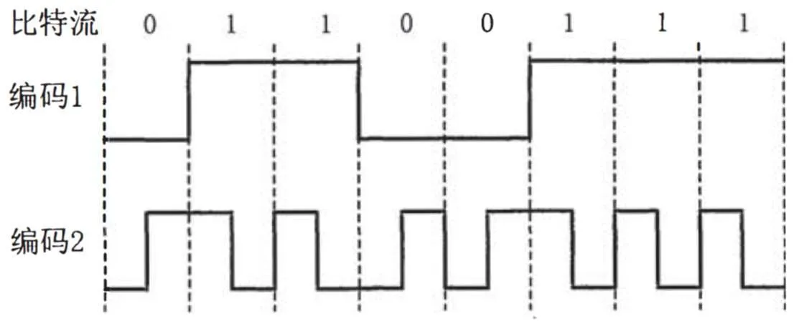
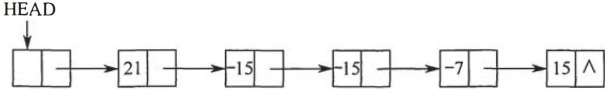
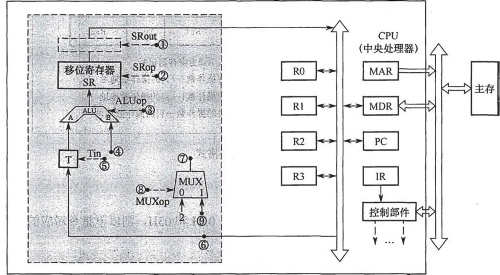
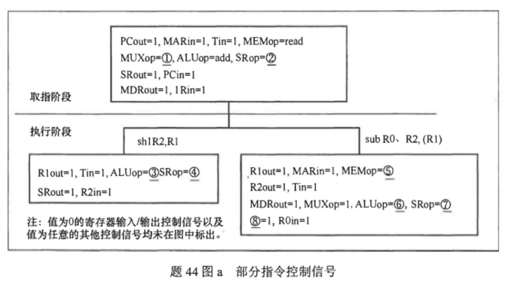
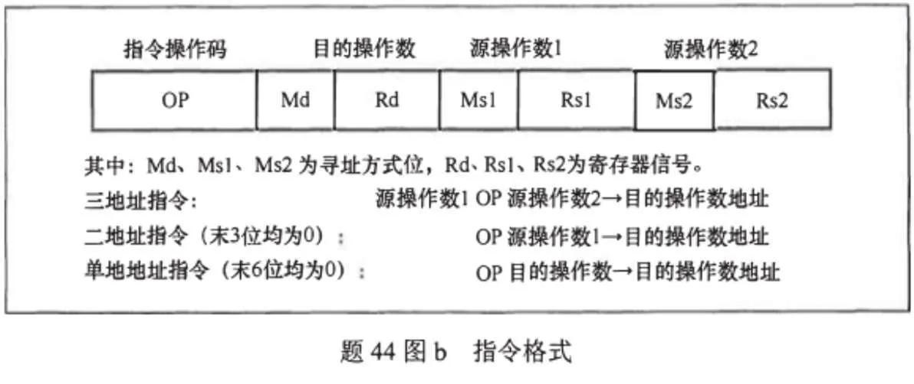
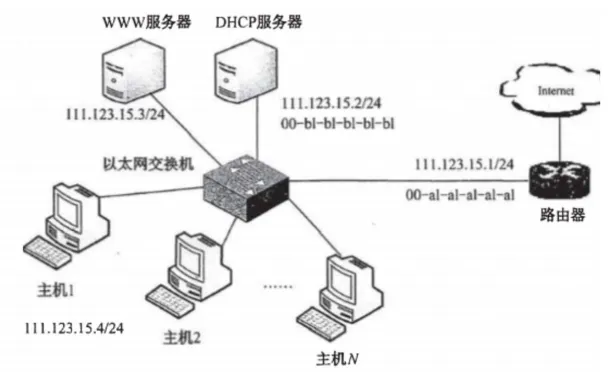

# 2015 年 408 真题 · 刷题纯净版

> 共 47 题（选择 40 题 + 综合 7 题）。仅题干与选项，不含答案。
> 对答案：[[408/真题精读/2015/数据结构]] 等四科精读页。

## 一、单项选择题（40 题，每题 2 分，共 80 分）

### 1.

已知程序如下： 

```c
int S(int n) {
    return (n <= 0) ? 0 : S(n - 1) + n;
}

void main() {
    cout << S(1);
}
```

程序运行时使用栈来保存调用过程的信息，自栈底到栈顶保存的信息依次对应的是（ ）。

- **A.** main() → S (1) → S (0)
- **B.** S (0) → S (1) → main()
- **C.** main() → S (0) → S (1)
- **D.** S (1) → S (0) → main()

---

### 2.

先序序列为 a,b,c,d 的不同二叉树的个数是()。

- **A.** 13
- **B.** 14
- **C.** 15
- **D.** 16

---

### 3.

下列选项给出的是从根分别到达两个叶结点路径上的权值序列，能属于同一棵哈夫曼树的是( )。

- **A.** 24, 10, 5 和 24, 10, 7
- **B.** 24, 10, 5 和 24, 12, 7
- **C.** 24, 10, 10 和 24, 14, 11
- **D.** 24, 10, 5 和 24, 14, 6

---

### 4.

现有一棵无重复关键字的平衡二叉树(AVL 树)，对其进行中序遍历可得到一个降序序列。下列关于该平衡二叉树的叙述中，正确的是( )。

- **A.** 根结点的度一定为 2
- **B.** 树中最小元素一定是叶结点
- **C.** 最后插入的元素一定是叶结点
- **D.** 树中最大元素一定是无左子树

---

### 5.

设有向图 G=(V,E)，顶点集 V={ v0 , v1 , v2 , v3 }，边集 E={< v0 , v1 >，< v0 , v2 >，< v0 , v3 >，< v1 , v3 >}。若从顶点 v0 开始对图进行深度优先遍历，则可能得到的不同遍历序列个数是（）。

- **A.** 2
- **B.** 3
- **C.** 4
- **D.** 5

---

### 6.

求下面带权图的最小(代价)生成树时，可能是克鲁斯卡(Kruskal)算法第 2 次选中但不是普里姆(Prim)算法(从 V4 开始)第 2 次选中的边是（ ）。


- **A.** ( V 1, V 3)
- **B.** ( V 1, V 4)
- **C.** ( V 2, V 3)
- **D.** ( V 3, V 4)

---

### 7.

下列选项中，不能构成折半查找中关键字比较序列的是()。

- **A.** 500,200,450,180
- **B.** 500,450,200,180
- **C.** 180,500,200,450
- **D.** 180,200,500,450

---

### 8.

已知字符串 s 为 "abaabaabacacaabaabcc"，模式串 t 为 "abaabc"。采用 KMP 算法进行匹配，第一次出现"失配"(s[i] ≠ t[j])时，i = j = 5，则下次开始匹配时，i 和 j 的值分别是( )。

- **A.** i = 1, j = 0
- **B.** i = 5, j = 0
- **C.** i = 5, j = 2
- **D.** i = 6, j = 2

---

### 9.

下列排序算法中，元素的移动次数与关键字的初始排列次序无关的是()。

- **A.** 直接插入排序
- **B.** 冒泡排序
- **C.** 基数排序
- **D.** 快速排序

---

### 10.

已知小根堆为 8,15,10,21,34,16,12，删除关键字 8 之后需重建堆，在此过程中，关键字之间的比较次数是()。

- **A.** 1
- **B.** 2
- **C.** 3
- **D.** 4

---

### 11.

希尔排序的组内排序采用的是（）。

- **A.** 直接插入排序
- **B.** 折半插入排序
- **C.** 快速排序
- **D.** 归并排序

---

### 12.

计算机硬件能够直接执行的语言

Ⅰ. 机器语言程序

Ⅱ. 汇编语言程序

Ⅲ. 硬件描述语言程序

- **A.** 仅 Ⅰ
- **B.** 仅 Ⅰ、Ⅱ
- **C.** 仅 Ⅰ、Ⅲ
- **D.** Ⅰ、Ⅱ、Ⅲ

---

### 13.

由 3 个"1"和 5 个"0"组成的 8 位二进制补码，能表示的最小整数（ ）。

- **A.** -126
- **B.** -125
- **C.** -32
- **D.** -3

---

### 14.

下列有关浮点数加减运算的叙述中，正确的是（ ）。

Ⅰ. 对阶操作不会引起阶码上溢或下溢

Ⅱ. 右规和尾数舍入都可能引起阶码上溢

Ⅲ. 左规时可能引起阶码下溢

Ⅳ. 尾数溢出时结果不一定溢出

- **A.** 仅Ⅱ、Ⅲ
- **B.** 仅Ⅰ、Ⅱ、Ⅳ
- **C.** 仅Ⅰ、Ⅲ、Ⅳ
- **D.** Ⅰ、Ⅱ、Ⅲ、Ⅳ

---

### 15.

假定主存地址位数为 32 位，按字节编址，主存和 Cache 之间采用直接映射方式，主存块大小为 4 个字，每字 32 位，写操作时采用回写 (Write Back) 方式，则能存放 4K 字数据的 Cache 的总容量的位数至少是（ ）。

- **A.** 146K
- **B.** 147K
- **C.** 148K
- **D.** 158K

---

### 16.

假定编译器将赋值语句 "x=x+3;" 转换为指令 "add xaddr, 3"，其中 xaddr 是 x 对应的存储单元地址。若执行该指令的计算机采用页式虚拟存储管理方式，并配有相应的 TLB，且 Cache 使用直写（Write Through）方式，则完成该指令功能需要访问主存的次数至少是（ ）。

- **A.** 0
- **B.** 1
- **C.** 2
- **D.** 3

---

### 17.

下列存储器中，在工作期间需要刷新的是（ ）。

- **A.** SRAM
- **B.** SDRAM
- **C.** ROM
- **D.** FLASH

---

### 18.

某计算机使用 4 体交叉编址存储器，假定在存储器总线上出现的主存地址（十进制）序列为 8005，8006，8007，8008，8001，8002，8003，8004，8000，则可能发生访存冲突的地址对是（ ）。

- **A.** 8004 和 8008
- **B.** 8002 和 8007
- **C.** 8001 和 8008
- **D.** 8000 和 8004

---

### 19.

下列有关总线定时的叙述中，错误的是（ ）。

- **A.** 异步通信方式中，全互锁协议最慢
- **B.** 异步通信方式中，非互锁协议的可靠性最差
- **C.** 同步通信方式中，同步时钟信号可由各设备提供
- **D.** 半同步通信方式中，握手信号的采样由同步时钟控制

---

### 20.

若磁盘转速为 7200rpm，平均寻道时间为 8ms，每个磁道包含 1000 个扇区，则访问一个扇区的平均存取时间大约是（ ）。

- **A.** 8.1ms
- **B.** 12.2ms
- **C.** 16.3ms
- **D.** 20.5ms

---

### 21.

在采用中断 I/O 方式控制打印输出的情况下，CPU 和打印控制接口中的 I/O 端口之间交换的信息不可能是（ ）。

- **A.** 打印字符
- **B.** 主存地址
- **C.** 设备状态
- **D.** 控制命令

---

### 22.

内部异常（内中断）可分为故障（fault）、陷阱（trap）和终止（abort）三类。下列有关内部异常的叙述中，错误的是（ ）。

- **A.** 内部异常的产生与当前执行指令相关
- **B.** 内部异常的检测由 CPU 内部逻辑实现
- **C.** 内部异常的响应发生在指令执行过程中
- **D.** 内部异常处理后返回到发生异常的指令继续执行

---

### 23.

处理外部中断时，应该由操作系统保存的是（ ）。

- **A.** 程序计数器（PC）的内容
- **B.** 通用寄存器的内容
- **C.** 快表（TLB）中的内容
- **D.** Cache 中的内容

---

### 24.

假定下列指令已装入指令寄存器，则执行时不可能导致 CPU 从用户态变为内核态（系统态）的是（ ）。

- **A.** `DIV R0, R1;` (R0)/(R1)→R0
- **B.** `INT n;` 产生软中断
- **C.** `NOT R0;` 寄存器 `R0` 的内容取非
- **D.** `MOV R0, addr;` 把地址 `addr` 的内存数据放入寄存器 `R0` 中

---

### 25.

下列选项中，会导致进程从执行态变为就绪态的事件是（ ）。

- **A.** 执行 P(wait) 操作
- **B.** 申请内存失败
- **C.** 启动 I/O 设备
- **D.** 被高优先级进程抢占

---

### 26.

若系统 S1 采用死锁避免方法，S2 采用死锁检测方法。下列叙述中，正确的是（ ）。

Ⅰ、S1 会限制用户申请资源的顺序，而 S2 不会
Ⅱ、S1 需要进程运行所需的资源总量信息，而 S2 不需要
Ⅲ、S1 不会给可能导致死锁的进程分配资源，而 S2 会

- **A.** 仅Ⅰ、Ⅱ
- **B.** 仅Ⅱ、Ⅲ
- **C.** 仅Ⅰ、Ⅲ
- **D.** Ⅰ、Ⅱ、Ⅲ

---

### 27.

系统为某进程分配了 4 个页框，该进程已访问的页号序列为 2, 0, 2, 9, 3, 4, 2, 8, 2, 4, 8, 4, 5。若进程要访问的下一页的页号为 7，依据 LRU 算法，应淘汰页的页号是（ ）。

- **A.** 2
- **B.** 3
- **C.** 4
- **D.** 8

---

### 28.

在系统内存中设置磁盘缓冲区的主要目的是（ ）。

- **A.** 减少磁盘 I/O 次数
- **B.** 减少平均寻道时间
- **C.** 提高磁盘数据可靠性
- **D.** 实现设备无关性

---

### 29.

在文件的索引节点中存放直接索引指针 10 个，一级和二级索引指针各 1 个。磁盘块大小为 1KB，每个索引指针占 4 个字节。若某文件的索引节点已在内存中，则把该文件偏移量（按字节编址）为 1234 和 307400 处所在的磁盘块读入内存，需访问的磁盘块个数分别是（ ）。

- **A.** 1、2
- **B.** 1、3
- **C.** 2、3
- **D.** 2、4

---

### 30.

在请求分页系统中，页面分配策略与页面置换策略不能组合使用的是（ ）。

- **A.** 可变分配，全局置换
- **B.** 可变分配，局部置换
- **C.** 固定分配，全局置换
- **D.** 固定分配，局部置换

---

### 31.

文件系统用位图法表示磁盘空间的分配情况，位图存于磁盘的 32～127 号块中，每个盘块占 1024 个字节，盘块和块内字节均从 0 开始编号。假设要释放的盘块号为 409612，则位图中要修改的位所在的盘块号和块内字节序号分别是（ ）。

- **A.** 81、1
- **B.** 81、2
- **C.** 82、1
- **D.** 82、2

---

### 32.

某硬盘有 200 个磁道（最外侧磁道号为 0），磁道访问请求序列为：130，42，180，15，199，当前磁头位于第 58 号磁道并从外侧向内侧移动。按照 SCAN 调度方法处理完上述请求后，磁头移过的磁道数是（ ）。

- **A.** 208
- **B.** 287
- **C.** 325
- **D.** 382

---

### 33.

通过 POP3 协议接收邮件时，使用的传输层服务类型是（ ）。

- **A.** 无连接不可靠的数据传输服务
- **B.** 无连接可靠的数据传输服务
- **C.** 有连接不可靠的数据传输服务
- **D.** 有连接可靠的数据传输服务

---

### 34.

使用两种编码方案对比特流 01100111 进行编码的结果如下图所示，编码 1 和编码 2 分别是（ ）。



- **A.** NRZ 和曼彻斯特编码
- **B.** NRZ 和差分曼彻斯特编码
- **C.** NRZI 和曼彻斯特编码
- **D.** NRZI 和差分曼彻斯特编码

---

### 35.

主机甲通过 128 kbps 卫星链路，采用滑动窗口协议向主机乙发送数据，链路单向传播延迟为 250 ms，帧长为 1000 字节。不考虑确认帧的开销，为使链路利用率不小于 80%，帧序号的比特数至少是（ ）。

- **A.** 3
- **B.** 4
- **C.** 7
- **D.** 8

---

### 36.

下列关于 CSMA/CD 协议的叙述中，错误的是（ ）。

- **A.** 边发送数据帧，边检测是否发生冲突
- **B.** 适用于无线网络，以实现无线链路共享
- **C.** 需要根据网络跨距和数据传输速率限定最小帧长
- **D.** 当信号传播延迟趋近 0 时，信道利用率趋近 100%

---

### 37.

下列关于交换机的叙述中，正确的是（ ）。

- **A.** 以太网交换机本质上是一种多端口网桥
- **B.** 通过交换机互连的一组工作站构成一个冲突域
- **C.** 交换机每个端口所连网络构成一个独立的广播域
- **D.** 以太网交换机可实现采用不同网络层协议的网络互联

---

### 38.

某路由器的路由表如下表所示：

| 目的网络        | 下一跳     | 接口 |
| --------------- | ---------- | ---- |
| 169.96.40.0/23  | 176.1.1.1  | S1   |
| 169.96.40.0/25  | 176.2.2.2  | S2   |
| 169.96.40.0/27  | 176.3.3.3  | S3   |
| 0.0.0.0/0       | 176.4.4.4  | S4   |

若路由器收到一个目的地址为 169.96.40.5 的 IP 分组，则转发该 IP 分组的接口是（ ）。

- **A.** S1
- **B.** S2
- **C.** S3
- **D.** S4

---

### 39.

主机甲和主机乙新建一个 TCP 连接，甲的拥塞控制初始阈值为 32 KB，甲向乙始终以 MSS = 1 KB 大小的段发送数据，并一直有数据发送；乙为该连接分配 16 KB 接收缓存，并对每个数据段进行确认，忽略段传输延迟。若乙收到的数据全部存入缓存，不被取走，则甲从连接建立成功时刻起，未发生超时的情况下，经过 4 个 RTT 后，甲的发送窗口是（ ）。

- **A.** 1 KB
- **B.** 8 KB
- **C.** 16 KB
- **D.** 32 KB

---

### 40.

某浏览器发出的 HTTP 请求报文如下：

```
GET /index.html HTTP/1.1
Host: www.test.edu.cn
Connection: close
Cookie: 123456
```

下列叙述中，错误的是（ ）。

- **A.** 该浏览器请求浏览 index.html
- **B.** index.html 存放在 www.test.edu.cn 上
- **C.** 该浏览器请求使用持续连接
- **D.** 该浏览器曾经浏览过 www.test.edu.cn

---

## 二、综合应用题（7 题，共 70 分）

### 41. （15 分）

用单链表保存 m 个整数，结点的结构为 `data | link`，且 |data| ≤ n（n 为正整数）。现要求设计一个时间复杂度尽可能高效的算法，对于链表中 data 的绝对值相等的结点，仅保留第一次出现的结点而删除其余绝对值相等的结点。例如，若给定的单链表 head 如下：

则删除结点后的 head 为：

要求：

(1) 给出算法的基本设计思想。

(2) 使用 C 或 C++ 语言，给出单链表结点的数据类型定义。

(3) 根据设计思想，采用 C 或 C++ 语言描述算法，关键之处给出注释。

(4) 说明你所设计算法的时间复杂度和空间复杂度。



---

### 42. （8 分）

已知含有 5 个顶点的图 G 如下图所示。


请回答下列问题：

(1) 写出图 G 的邻接矩阵 A（行、列下标均从 0 开始）。

(2) 求 A²，矩阵 A² 中位于 0 行 3 列元素值的含义是什么？

(3) 若已知具有 n（n ≥ 2）个顶点的图的邻接矩阵为 B，则 Bᵐ（2 ≤ m ≤ n）中非零元素的含义是什么？

---

### 43. （13 分）

某 16 位计算机的主存按字节编址，存取单位为 16 位；采用 16 位定长指令字格式；CPU 采用单总线结构，主要部分如下图所示。


图中 R0～R3 为通用寄存器；T 为暂存器；SR 为移位寄存器，可实现直送（mov）、左移一位（left）和右移一位（right）3 种操作，控制信号为 SRop，SR 的输出由信号 SRout 控制；ALU 可实现直送 A（mova）、A 加 B（add）、A 减 B（sub）、A 与 B（and）、A 或 B（or）、非 A（not）、A 加 1（inc）这 7 种操作，控制信号为 ALUop。

注：已补充内总线到 MAR 的箭头和内总线到 IR 的箭头。

请回答下列问题。

(1) 图中哪些寄存器是程序员可见的？为何要设置暂存器 T？

(2) 控制信号 ALUop 和 SRop 的位数至少各是多少？

(3) 控制信号 SRout 所控制部件的名称或作用是什么？

(4) 端点①～⑨中，哪些端点须连接到控制部件的输出端？

(5) 为完善单总线数据通路，需要在端点①～⑨中相应的端点之间添加必要的连线。写出连线的起点和终点，以正确表示数据的流动方向。

(6) 为什么二路选择器 MUX 的一个输入端是 2？

---

### 44. （10 分）

题 43 中描述的计算机如下图所示。为便于从本题入口独立作答，这里先附该 CPU 单总线数据通路图。







其部分指令执行过程的控制信号如题 44 图 a 所示

图 a  部分指令控制信号

该机指令格式如题 44 图 b 所示，支持寄存器直接和寄存器间接两种寻址方式，寻址方式位分别为 0 和 1，通用寄存器 R0～R3 的编号分别为 0、1、2 和 3。

请回答下列问题。

(1) 该机的指令系统最多可定义多少条指令？

(2) 假定 inc、shl 和 sub 指令的操作码分别为 01H、02H 和 03H，则以下指令对应的机器代码各是什么？

```
inc R1;             // (R1)+1→R1
shl R2, R1;         // (R1)<<1→R2
sub R3, (R1), R2;   // ((R1))–(R2)→R3
```

(3) 假设寄存器 X 的输入和输出控制信号分别为 Xin 和 Xout，其值为 1 表示有效，为 0 表示无效（例如，PCout=1 表示 PC 内容送总线）；存储器控制信号为 MEMop，用于控制存储器的读 (read) 和写 (write) 操作。写出题 44 图 a 中标号①～⑧处的控制信号或控制信号的取值。

(4) 指令 `sub R1，R3，(R2)` 和 `inc R1` 的执行阶段至少各需要多少个时钟周期？

---

### 45. （9 分）

有 A、B 两人通过信箱进行辩论：

- 每个人都从自己的信箱中取得对方的问题，将答案和向对方提出的新问题组成一个邮件放入对方的信箱中
- 假设 A 的信箱最多放 M 个邮件，B 的信箱最多放 N 个邮件
- 初始时 A 的信箱中有 x 个邮件（0 < x < M），B 的信箱中有 y 个邮件（0 < y < N）
- 辩论者每取出一个邮件，邮件数减 1
- A、B 两人的操作过程描述如下：

```c
A {
    while (true) {
        从 A 的信箱中取出一个邮件;
        回答问题并提出一个新问题;
        将新邮件放入 B 的信箱;
    }
}

B {
    while (true) {
        从 B 的信箱中取出一个邮件;
        回答问题并提出一个新问题;
        将新邮件放入 A 的信箱;
    }
}
```

约束：信箱不为空时，辩论者才能从信箱中取邮件，否则等待；信箱不满时，辩论者才能将新邮件放入信箱，否则等待。

请添加必要的信号量和 P、V（或 wait、signal）操作，以实现上述过程的同步。要求写出完整的过程，并说明信号量的含义和初值。

---

### 46. （6 分）

某计算机系统按字节编址，采用二级页表的分页存储管理方式，虚拟地址格式如下所示：

| 页目录号 | 页表索引 | 页内偏移量 |
| :---: | :---: | :---: |
| 10 位 | 10 位 | 12 位 |

请回答下列问题。

（1）页和页框的大小各为多少字节？进程的虚拟地址空间大小为多少页？

（2）假定页目录项和页表项均占 4 字节，则进程的页目录和页表共占多少页？要求写出计算过程。

（3）若某指令周期内访问的虚拟地址为 0100 0000H 和 0111 2048H，则进行地址转换时共访问多少个二级页表？要求说明理由。

---

### 47. （9 分）

某网络拓扑如题 47 图所示，其中路由器内网接口、DHCP 服务器、WWW 服务器与主机 1 均采用静态 IP 地址配置，相关地址信息见图中标注；主机 2～主机 N 通过 DHCP 服务器动态获取 IP 地址等配置信息。



请回答下列问题。

（1）DHCP 服务器可为主机 2～主机 N 动态分配 IP 地址的最大范围是什么？主机 2 使用 DHCP 协议获取 IP 地址的过程中，发送的封装 DHCP Discover 报文的 IP 分组的源 IP 地址和目的 IP 地址分别是什么？

（2）若主机 2 的 ARP 表为空，则该主机访问 Internet 时，发出的第一个以太网帧的目的 MAC 地址是什么？封装主机 2 发往 Internet 的 IP 分组的以太网帧的目的 MAC 地址是什么？

（3）若主机 1 的子网掩码和默认网关分别配置为 255.255.255.0 和 111.123.15.2，则该主机是否能访问 WWW 服务器？是否能访问 Internet？请说明理由。

---

## See Also

- [[408/真题精读/真题精读总目录]]
- [[408/历年真题/历年真题总目录]]
- [[408/历年真题/2015]]
