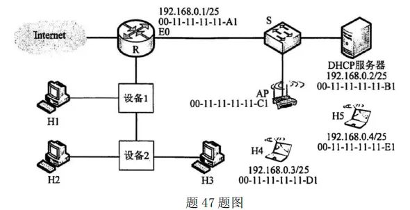

# 2022 年 408 真题 · 刷题纯净版

> 共 47 题（选择 40 题 + 综合 7 题）。仅题干与选项，不含答案。
> 对答案：[[408/真题精读/2022/数据结构]] 等四科精读页。

## 一、单项选择题（40 题，每题 2 分，共 80 分）

### 1.

下列程序段的时间复杂度是（ ）。

```C
int sum = 0;
for (int i = 1; i < n; i *= 2)
    for (int j = 0; j < i; j++)
        sum++;
```

- **A.** $O(\log_2 n)$
- **B.** $O(n)$
- **C.** $O(n\log_2 n)$
- **D.** $O(n^2)$

---

### 2.

给定有限符号集 S, in 和 out 均为 S 中所有元素的任意排列。对于初始为空的栈 ST, 下列叙述中，正确的是( )。

- **A.** 若 in 是 ST 的入栈序列，则不能判断 out 是否为其可能的出栈序列
- **B.** 若 out 是 ST 的出栈序列，则不能判断 in 是否为其可能的入栈序列
- **C.** 若 in 是 ST 的入栈序列，out 是对应 in 的出栈序列，则 in 与 out 一定不同
- **D.** 若 in 是 ST 的入栈序列，out 是对应 in 的出栈序列，则 in 与 out 可能互为倒序

---

### 3.

若结点 p 与 q 在二叉树 T 的中序遍历序列中相邻，且 p 在 q 之前，则下列 p 与 q 的关系中，不可能的是( )。

I. q 是 p 的双亲

II. q 是 p 的右孩子

III. q 是 p 的右兄弟

IV. q 是 p 的双亲的双亲

- **A.** 仅 I
- **B.** 仅 III
- **C.** 仅 II、III
- **D.** 仅 II、IV

---

### 4.

若三叉树 T 中有 244 个结点（叶结点的高度为 1），则 T 的高度至少是 ( )。

- **A.** 8
- **B.** 7
- **C.** 6
- **D.** 5

---

### 5.

对任意给定的含 n (n > 2) 个字符的有限集 S, 用二叉树表示 S 的哈夫曼编码集和定长编码集，分别得到二叉树 T1 和 T2。下列叙述中，正确的是 ( )。

- **A.** T1 与 T2 的结点数相同
- **B.** T1 的高度大于 T2 的高度
- **C.** 出现频次不同的字符在 T1 中处于不同的层
- **D.** 出现频次不同的字符在 T2 中处于相同的层

---

### 6.

对于无向图 G=(V,E)，下列选项中，正确的是(  )。

- **A.** 当 $|V| > |E|$ 时，G 一定是连通的
- **B.** 当 $|V| < |E|$ 时，G 一定是连通的
- **C.** 当 $|V| = |E|-1$ 时，G 一定是不连通的
- **D.** 当 $|V| > |E|+1$ 时，G 一定是不连通的

---

### 7.

下图是一个有 10 个活动的 AOE 网，时间余量最大的活动是 （ ）。


- **A.** c
- **B.** g
- **C.** h
- **D.** j

---

### 8.

在下图所示的 5 阶 B 树 T 中，删除关键字 260 之后需要进行必要的调整，得到新的 B 树 T1。下列选项中，不可能是 T1 根结点中关键字序列的是(  )。


- **A.** 60，90，280
- **B.** 60，90，350
- **C.** 60，85，110，350
- **D.** 60，90，110，350

---

### 9.

下列因素中，影响散列(哈希)方法平均查找长度的是( )。

I. 装填因子

II. 散列函数

III. 冲突解决策略

- **A.** 仅 I、II
- **B.** 仅 I、III
- **C.** 仅 II、III
- **D.** I、 II、 III

---

### 10.

使用二路归并排序对含 n 个元素的数组 M 进行排序时，二路归并操作的功能是( )。

- **A.** 将两个有序表合并为一个新的有序表
- **B.** 将 M 划分为两部分，两部分的元素个数大致相等
- **C.** 将 M 划分为 n 个部分，每个部分中仅含有一个元素
- **D.** 将 M 划分为两部分，一部分元素的值均小于另一部分元素的值

---

### 11.

对数据进行排序时，若采用直接插入排序而不采用快速排序，则可能的原因是（）。

Ⅰ. 大部分元素已有序

Ⅱ. 待排序元素数量很少

Ⅲ. 要求空间复杂度为 $O(1)$

Ⅳ. 要求排序算法是稳定的

- **A.** 仅Ⅰ、Ⅱ
- **B.** 仅Ⅲ、Ⅳ
- **C.** 仅Ⅰ、Ⅱ、Ⅳ
- **D.** Ⅰ、Ⅱ、Ⅲ、Ⅳ

---

### 12.

某计算机主频为 1GHz，程序 P 运行过程中，共执行了 10000 条指令，其中，80% 的指令执行平均需 1 个时钟周期，20% 的指令执行平均需 10 个时钟周期。程序 P 的平均 CPI 和 CPU 执行时间分别是（ ）。

- **A.** 2.8，28μs
- **B.** 28，28μs
- **C.** 2.8，28ms
- **D.** 28，28ms

---

### 13.

32 位补码所能表示的整数范围是（ ）。

- **A.** $-2^{32} \sim 2^{31}-1$
- **B.** $-2^{31} \sim 2^{31}-1$
- **C.** $-2^{32} \sim 2^{32}-1$
- **D.** $-2^{31} \sim 2^{32}-1$

---

### 14.

-0.4375 的 IEEE 754 单精度浮点数表示为（ ）。

- **A.** BEE0 0000H
- **B.** BF60 0000H
- **C.** BF70 0000H
- **D.** C0E0 0000H

---

### 15.

某计算机主存地址为 24 位，采用分页虚拟存储管理方式，虚拟地址空间大小为 4GB，页大小为 4KB，按字节编址。某进程的页表部分内容如下表所示。当 CPU 访问虚拟地址 00082840H，虚-实地址转换的结果是（ ）。

| 虚页号 | 实页号（页框号）| 存在位 |
|---|---|---|
| 82 | 024H | 0 |
| ... | ... | ... |
| 129 | 180H | 1 |
| 130 | 018H | 1 |

- **A.** 得到主存地址 024840H
- **B.** 得到主存地址 180840H
- **C.** 得到主存地址 018840H
- **D.** 检测到缺页异常

---

### 16.

某计算机主存地址为 32 位，按字节编址，某 Cache 的数据区容量为 32KB，主存块大小为 64B，采用 8 路组相联映射方式，该 Cache 中比较器的个数和位数分别为（ ），

- **A.** 8，20
- **B.** 8，23
- **C.** 64，20
- **D.** 64，23

---

### 17.

某内存条包含 8 个 8192×8192×8 位的 DRAM 芯片，按字节编址，支持突发传送方式，对应存储器总线宽度为 64 位，每个 DRAM 芯片内有一个行缓冲区。下列关于该内存条的叙述中，不正确的是（ ）。

- **A.** 内存条的容量为 512MB
- **B.** 采用多模块交叉编址方式
- **C.** 芯片的地址引脚为 26 位
- **D.** 芯片内行缓冲有 8192×8 位

---

### 18.

下列选项中，属于指令集体系结构（ISA）规定的内容是（ ）。

Ⅰ. 指令字格式和指令类型

Ⅱ. CPU 的时钟周期

Ⅲ. 通用寄存器个数和位数

Ⅳ. 加法器的进位方式

- **A.** 仅Ⅰ、Ⅱ
- **B.** 仅Ⅰ、Ⅲ
- **C.** 仅Ⅱ、Ⅳ
- **D.** 仅Ⅰ、Ⅲ、Ⅳ

---

### 19.

设计某指令系统时，假设采用 16 位定长指令字格式，操作码使用扩展编码方式，地址码为 6 位，包含零地址、一地址和二地址 3 种格式的指令。若二地址指令有 12 条，一地址指令有 254 条，则零地址指令的条数最多为（ ）。

- **A.** 0
- **B.** 2
- **C.** 64
- **D.** 128

---

### 20.

将高级语言源程序转换为可执行目标文件的主要过程是（ ）。

- **A.** 预处理 → 编译 → 汇编 → 链接
- **B.** 预处理 → 汇编 → 编译 → 链接
- **C.** 预处理 → 编译 → 链接 → 汇编
- **D.** 预处理 → 汇编 → 链接 → 编译

---

### 21.

下列关于中断 I/O 方式的叙述中，不正确的是（ ）。

- **A.** 适用于键盘、针式打印机等字符型设备
- **B.** 外设和主机之间的数据传送通过软件完成
- **C.** 外设准备数据的时间应小于中断处理时间
- **D.** 外设为某进程准备数据时 CPU 可运行其他进程

---

### 22.

下列关于并行处理技术的叙述中，不正确的是（ ）。

- **A.** 多核处理器属于 MIMD 结构
- **B.** 向量处理器属于 SIMD 结构
- **C.** 硬件多线程技术只可用于多核处理器
- **D.** SMP 中所有处理器共享单一物理地址空间

---

### 23.

下列关于多道程序系统的叙述中，不正确的是（ ）。

- **A.** 支持进程的并发执行
- **B.** 不必支持虚拟存储管理
- **C.** 需要实现对共享资源的管理
- **D.** 进程数越多 CPU 利用率越高

---

### 24.

下列选项中，需要在操作系统进行初始化过程中创建的是（ ）。

- **A.** 中断向量表
- **B.** 文件系统的根目录
- **C.** 硬盘分区表
- **D.** 文件系统的索引节点表

---

### 25.

进程 P0、P1、P2 和 P3 进入就绪队列的时刻、优先级（值越小优先权越高）及 CPU 执行时间如下表所示。

| 进程 | 进入就绪队列的时刻 | 优先级 | CPU 执行时间 |
| --- | --- | --- | --- |
| P0 | 0 ms | 15 | 100 ms |
| P1 | 10 ms | 20 | 60 ms |
| P2 | 10 ms | 10 | 20 ms |
| P3 | 15 ms | 6 | 10 ms |

若系统采用基于优先权的抢占式进程调度算法，则从 0ms 时刻开始调度，到 4 个进程都运行结束为止，发生进程调度的总次数为（ ）。

- **A.** 4
- **B.** 5
- **C.** 6
- **D.** 7

---

### 26.

系统中有三个进程 P0、P1、P2 及三类资源 A、B、C。若某时刻系统分配资源的情况如下表所示，则此时系统中存在的安全序列的个数为（ ）。

| 进程 | 已分配 A | 已分配 B | 已分配 C | 尚需 A | 尚需 B | 尚需 C |
| --- | ---: | ---: | ---: | ---: | ---: | ---: |
| P0 | 2 | 0 | 1 | 0 | 2 | 1 |
| P1 | 0 | 2 | 0 | 1 | 2 | 3 |
| P2 | 1 | 0 | 1 | 0 | 1 | 3 |

当前可用资源 Available = (1, 3, 2)。

- **A.** 1
- **B.** 2
- **C.** 3
- **D.** 4

---

### 27.

下列关于 CPU 模式的叙述中，正确的是（ ）。

- **A.** CPU 处于用户态时只能执行特权指令
- **B.** CPU 处于内核态时只能执行特权指令
- **C.** CPU 处于用户态时只能执行非特权指令
- **D.** CPU 处于内核态时只能执行非特权指令

---

### 28.

下列事件或操作中，可能导致进程 P 由执行态变为阻塞态的是（ ）。

Ⅰ. 进程 P 读文件
Ⅱ. 进程 P 的时间片用完
Ⅲ. 进程 P 申请外设
Ⅳ. 进程 P 执行信号量的 wait() 操作

- **A.** 仅Ⅰ、Ⅳ
- **B.** 仅Ⅱ、Ⅲ
- **C.** 仅Ⅲ、Ⅳ
- **D.** 仅Ⅰ、Ⅲ、Ⅳ

---

### 29.

某进程访问的页 b 不在内存中，导致产生缺页异常，该缺页异常处理过程中不一定包含的操作是（ ）。

- **A.** 淘汰内存中的页
- **B.** 建立页号与页框号的对应关系
- **C.** 将页 b 从外存读入内存
- **D.** 修改页表中页 b 对应的存在位

---

### 30.

下列选项中，不会影响系统缺页率的是（ ）。

- **A.** 页面置换算法
- **B.** 工作集的大小
- **C.** 进程的数量
- **D.** 页缓冲队列的长度

---

### 31.

执行系统调用的过程涉及下列操作，其中由操作系统完成的是（ ）。

Ⅰ. 保存断点和程序状态字
Ⅱ. 保存通用寄存器的内容
Ⅲ. 执行系统调用服务程序
Ⅳ. 将 CPU 模式改为内核态

- **A.** 仅Ⅰ、Ⅲ
- **B.** 仅Ⅱ、Ⅲ
- **C.** 仅Ⅱ、Ⅳ
- **D.** 仅Ⅱ、Ⅲ、Ⅳ

---

### 32.

下列关于驱动程序的叙述中，不正确的是（ ）。

- **A.** 驱动程序与 I/O 控制方式无关
- **B.** 初始化设备是由驱动程序控制完成的
- **C.** 进程在执行驱动程序时可能进入阻塞态
- **D.** 读/写设备的操作是由驱动程序控制完成的

---

### 33.

在 ISO/OSI 参考模型中，实现两个相邻结点间流量控制功能的是（ ）。

- **A.** 物理层
- **B.** 数据链路层
- **C.** 网络层
- **D.** 传输层

---

### 34.

在一条带宽为 200 kHz 的无噪声信道上，若采用 4 个幅值的 ASK 调制，则该信道的最大数据传输速率是（ ）。

- **A.** 200 kbps
- **B.** 400 kbps
- **C.** 800 kbps
- **D.** 1600 kbps

---

### 35.

若某主机的 IP 地址是 183.80.72.48，子网掩码是 255.255.192.0，则该主机所在网络的网络地址是（ ）。

- **A.** 183.80.0.0
- **B.** 183.80.64.0
- **C.** 183.80.72.0
- **D.** 183.80.192.0

---

### 36.

如下图所示的网络中，主机 H 的子网掩码与默认网关分别是（ ）


- **A.** 255.255.255.192, 192.168.1.1
- **B.** 255.255.255.192, 192.168.1.62
- **C.** 255.255.255.224, 192.168.1.1
- **D.** 255.255.255.224, 192.168.1.62

---

### 37.

SDN 控制器向数据平面的 SDN 交换机下发流表时所使用的接口是（ ）

- **A.** 东向接口
- **B.** 南向接口
- **C.** 西向接口
- **D.** 北向接口

---

### 38.

假设主机甲和主机乙已建立一个 TCP 连接，最大段长 MSS = 1 KB，甲一直有数据向乙发送，当甲的拥塞窗口为 16 KB 时，计时器发生了超时，则甲的拥塞窗口再次增长到 16 KB 所需要的时间至少是（ ）。

- **A.** 4 RTT
- **B.** 5 RTT
- **C.** 11 RTT
- **D.** 16 RTT

---

### 39.

假设客户 C 和服务器 S 已建立一个 TCP 连接，通信往返时间 RTT = 50 ms，最长报文段寿命 MSL = 800 ms，数据传输结束后，C 主动请求断开连接。若从 C 主动向 S 发出 FIN 段时刻算起，则 C 和 S 进入 CLOSED 状态所需的时间至少分别是（ ）。

- **A.** 850 ms, 50 ms
- **B.** 1650 ms, 50 ms
- **C.** 850 ms, 75 ms
- **D.** 1650 ms, 75 ms

---

### 40.

假设主机 H 通过 HTTP/1.1 请求浏览某 Web 服务器 S 上的 Web 页 news408.html，news408.html 引用了同目录下的 1 幅图像，news408.html 文件大小为 1 MSS（最大段长），图像文件大小为 3 MSS，H 访问 S 的往返时间 RTT = 10 ms，忽略 HTTP 响应报文的首部开销和 TCP 段传输时延。若 H 已完成域名解析，则从 H 请求与 S 建立 TCP 连接时刻起，到接收到全部内容止，所需的时间至少是（ ）。

- **A.** 30 ms
- **B.** 40 ms
- **C.** 50 ms
- **D.** 60 ms

---

## 二、综合应用题（7 题，共 70 分）

### 41. （13 分）

已知非空二叉树 T 的结点值均为正整数，采用顺序存储方式保存，数据结构定义如下：

```c
typedef struct {                    // MAX_SIZE 为已定义常量
    Elemtype SqBiTNode[MAX_SIZE];   // 保存二叉树结点值的数组
    int      ElemNum;               // 实际占用的数组元素个数
} SqBiTree;
```

T 中不存在的结点在数组 `SqBiTNode` 中用 -1 表示。例如，对于两棵非空二叉树 T₁ 和 T₂：


T₁ 和 T₂ 对应的顺序存储如下

| 数组 | 内容（依次） | ElemNum |
|---|---|---|
| `T₁.SqBiTNode` | `[40, 25, 60, -1, 30, -1, 80, -1, -1, 27]` | 10 |
| `T₂.SqBiTNode` | `[40, 50, 60, -1, 30, -1, -1, -1, -1, -1, 35]` | 11 |

请设计一个尽可能高效的算法，判定一棵采用这种方式存储的二叉树是否为二叉搜索树，若是则返回 true，否则返回 false。要求：

(1) 给出算法的基本设计思想。

(2) 根据设计思想，采用 C 或 C++ 语言描述算法，关键之处给出注释。

---

### 42. （10 分）

现有 n（n > 100000）个数保存在一维数组 M 中，需要查找 M 中最小的 10 个数，请回答下列问题：

(1) 设计一个完成上述查找任务的算法，要求平均情况下的比较次数尽可能少，简单描述其算法思想，不需要程序实现。

(2) 说明你所设计的算法平均情况下的时间复杂度和空间复杂度。

---

### 43. （15 分）

某 CPU 中部分数据通路如图所示，其中，GPRs 为通用寄存器组；FR 为标志寄存器，用于存放 ALU 产生的标志信息；带箭头虚线表示控制信号，如控制信号 ReaD. Write 分别表示主存读、主存写，MDRin 表示内部总线上数据写入 MDR，MDRout 表示 MDR 的内容送内部总线。


(1) ALU 的输入端 A. B 及输出端 F 的最高位分别为 A15 、 B15 及 F15 ，FR 中的符号标志和溢出标志分别为 SF 和 OF，则 SF 的逻辑表达式是什么？A 加 B. A 减 B 时 OF 的逻辑表达式分别是什么？要求逻辑表达式的输入变量为 A15、B15 及 F15 。

(2) 为什么要设置暂存器 Y 和 Z？

(3) 若 GPRs 的输入端 rs、rd 分别为所读、写的通用寄存器的编号，则 GPRs 中最多有多少个通用寄存器？rs 和 rd 来自图中的哪个寄存器？已知 GPRs 内部有一个地址译码器和一个多路选择器，rd 应该连接地址译码器还是多路选择器？

(4) 取指令阶段（不考虑 PC 增量操作）的控制信号序列是什么？若从发出主存读命令到主存读出数据并传送到 MDR 共需 5 个时钟周期，则取指令阶段至少需要几个时钟周期？

(5) 图中控制信号由什么部件产生？图中哪些寄存器的输出信号会连到该部件的输入端？

---

### 44. （8 分）

假设某磁盘驱动器中有 4 个双面盘片，每个盘面有 20000 个磁道，每个磁道有 500 个扇区，每个扇区可记录 512 字节的数据，盘片转速为 7200rpm（转/分），平均寻道时间为 5ms，请回答下列问题。

(1) 每个扇区包含数据及地址信息，地址信息分为 3 个字段，这 3 个字段的名称格式什么？对于该磁盘，各字段至少占多少位？

(2) 一个扇区的平均访问时间约为多少？

(3) 若采用周期挪用 DMA 方式进行磁盘与主机之间的数据传送，磁盘控制器中的数据缓冲区大小为 64 位，则在一个扇区读写过程中，DMA 控制器向 CPU 发送了多少次总线请求？若 CPU 检测到 DMA 控制器的总线请求信号时也需要访问主存，则 DMA 控制器是否可以获得总线使用权？为什么？

---

### 45. （7 分）

某文件系统的磁盘块大小为 4 KB，目录项由文件名和索引节点号构成，每个索引节点占 256 字节，其中包含直接地址项 10 个，一级、二级和三级间接地址项各 1 个，每个地址项占 4 字节。

该文件系统中子目录 `stu` 的结构如下图所示：`stu` 包含子目录 `course` 和文件 `doc`，`course` 子目录包含文件 `course1` 和 `course2`。各文件的文件名、索引节点号、占用磁盘块的块号也一并给出（其中文件 `doc` 占用的磁盘块号 x 为待求）。


请回答下列问题。

(1) 目录文件 `stu` 中每个目录项的内容是什么？

(2) 文件 `doc` 占用的磁盘块的块号 x 的值是多少？

(3) 若目录文件 `course` 的内容已在内存，则打开文件 `course1` 并将其读入内存，需要读几个磁盘块？说明理由。

(4) 若文件 `course2` 的大小增长到 6 MB，为了存取 `course2` 需要使用该文件索引节点的哪几级间接地址项？说明理由。

---

### 46. （8 分）

某进程的两个线程 T1 和 T2 并发执行 A、B、C、D、E、F 共 6 个操作，其中 T1 执行 A、E、F，T2 执行 B、C、D。

操作之间的执行顺序约束（如题 46 图）：


- C 必须在 A 和 B 完成后执行
- D 和 E 必须在 C 完成后执行
- F 必须在 E 完成后执行

请使用信号量的 `wait()`、`signal()` 操作描述 T1 和 T2 之间的同步关系，并说明所用信号量的作用及其初值。

---

### 47. （9 分）

某网络拓扑如题 47 图所示，R 为路由器，S 为以太网交换机，AP 是 802.11 接入点，路由器的 E0 接口和 DHCP 服务器的 IP 地址配置如图中所示；H1 与 H2 属于同一个广播域，但不属于同一个冲突域；H2 和 H3 属于同一个冲突域；H4 和 H5 已经接入网络，并通过 DHCP 动态获取了 IP 地址。现有路由器、100BaseT 以太网交换机和 100BaseT 集线器（Hub）三类设备各若干台。



请回答下列问题。

(1) 设备 1 和设备 2 应该分别选择哪类设备？

(2) 若信号传播速度为 $2 \times 10^8$ m/s，以太网最小帧长为 64 B，信号通过设备 2 时会产生额外的 1.51 μs 的时间延迟，则 H2 与 H3 之间可以相距的最远距离是多少？

(3) 在 H4 通过 DHCP 动态获取 IP 地址过程中，H4 首先发送了 DHCP 报文 M，M 是哪种 DHCP 报文？路由器 E0 接口能否收到封装 M 的以太网帧？S 向 DHCP 服务器转发的封装 M 的以太网帧的目的 MAC 地址是什么？

(4) 若 H4 向 H5 发送一个 IP 分组 P，则 H5 收到的封装 P 的 802.11 帧的地址 1、地址 2 和地址 3 分别是什么？

---

## See Also

- [[408/真题精读/真题精读总目录]]
- [[408/历年真题/历年真题总目录]]
- [[408/历年真题/2022]]
