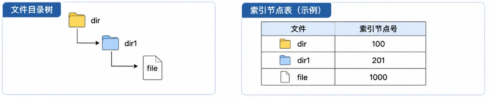

# 2026 年 408 真题 · 刷题纯净版

> 共 47 题（选择 40 题 + 综合 7 题）。仅题干与选项，不含答案。
> 对答案：[[408/真题精读/2026/数据结构]] 等四科精读页。

## 一、单项选择题（40 题，每题 2 分，共 80 分）

### 1.

对于采用顺序存储结构的线性表，当存储空间有足够的空闲空间时，在保持表内元素顺序相对不变的情况下，下列哪些操作会必然导致产生移动次数（）。

I. 表头插入一个元素

II. 表头删除一个元素

III. 表尾插入一个元素

IV. 表尾删除一个元素

- **A.** I、II
- **B.** I、III
- **C.** II、IV
- **D.** III、IV

---

### 2.

设有一个双向链表 L，结构为 [p2, p1]，头结点为 head。初始时 head = cu。现要将每个结点的 p2 指向 p1 指向结点的直接后继，应该进行的操作是（）。

- **A.** `while(cu!=NULL) {cu->p2=cu->p1->p1; cu=cu->p1;}`
- **B.** `while(cu!=NULL && cu->p2!=NULL) {cu->p2 = cu->p1->p1; cu = cu->p1;}`
- **C.** `while(cu!=NULL) {if(cu->p1!=NULL) {cu->p2=cu->p1->p1; cu=cu->p1;}}`
- **D.** `while(cu!=NULL) {if(cu->p1!=NULL) {cu->p2=cu->p1->p1;} else {cu->p2=NULL;} cu=cu->p1;}`

---

### 3.

已知二叉树 T 的中序遍历为 b, e, d, f, c, a, g，层序遍历为 a, b, g, c, d, e, f，则其后序遍历序列为（）。

- **A.** c, e, d, f, b, g, a
- **B.** c, e, f, d, b, g, a
- **C.** e, f, d, c, b, g, a
- **D.** e, g, f, d, b, c, a

---

### 4.

森林 F 中有 5 颗树，其节点个数分别为 2、3、4、5、7，森林中树的次序可以任意，问 F 对应的二叉树最小高度为多少？

- **A.** 5
- **B.** 6
- **C.** 8
- **D.** 10

---

### 5.

假设二叉树中节点权值为 a=1, b=2, c=4, d=5, e=8, f=10, g=12。当带权路径长度 (WPL) 最小时，与节点 e（权值 8）处于相同深度的节点是哪些？

- **A.** d
- **B.** g
- **C.** d, f
- **D.** f, g

---

### 6.

有向图 G=(V, E) 采用邻接表存储，求某点入度的时间复杂度为（）。

- **A.** O(|V|)
- **B.** O(min(|V|, |E|))
- **C.** O(|E|)
- **D.** O(max(|V|, |E|))

---

### 7.

设有向图 G=(V, E)，顶点集大小 n=|V|，每条边标记一个字符。定义字符串集 S 为所有路径上边标记拼接成的字符串的集合。以下说法错误的是（）。

- **A.** 若 G 无环，则 S 是有限集
- **B.** 若 G 无环，则 S 中存在长度为 n 的字符串
- **C.** 若 G 有环，则 S 中存在长度大于 n 的字符串
- **D.** 若 G 有环，则 S 中存在长度小于 2n 的字符串

---

### 8.

已知平衡二叉树 (AVL 树) 高度为 4（根节点高度记为 1），则其根节点的左右子树的节点数之差最多为（）。

- **A.** 1
- **B.** 2
- **C.** 3
- **D.** 5

---

### 9.

使用直接插入排序对序列进行升序排序，以下比较次数最少的是（）。

- **A.** 30, 27, 56, 41, 80, 95, 69
- **B.** 31, 43, 26, 55, 63, 99, 77
- **C.** 61, 84, 51, 23, 34, 91, 40
- **D.** 93, 32, 48, 81, 50, 21, 72

---

### 10.

现有 $n$ 名学生的成绩记录，每位学生的记录包含两门课程的成绩：课程 1（记为 $C_1$）和课程 2（记为 $C_2$）。

排序规则如下：

1. 首先，依据 $C_1$ 成绩升序排列；
2. 若两名学生的 $C_1$ 成绩相同，则依据其总分（即 $C_1 + C_2$）升序排列。

请从下列排序算法中，选择最适合实现上述需求的算法（）。

- **A.** 基数排序
- **B.** 快速排序
- **C.** 希尔排序
- **D.** 选择排序

---

### 11.

在外部排序的 $k$ 路归并过程中，归并趟数为 $d$。下列关于 $k$、$d$、初始归并段及内存大小的说法中，正确的是（）。

Ⅰ. $k$ 越大，$d$ 越小

Ⅱ. 初始归并段数不影响 $d$

Ⅲ. 内存大小限制初始归并段的最大长度

- **A.** 仅 I
- **B.** 仅 I、II
- **C.** 仅 I、III
- **D.** 仅 II、III

---

### 12.

下列关于计算机的系统层次的叙述，错误的是（ ）。

- **A.** 最上层是应用软件层
- **B.** 指令集体系结构是软件和硬件的接口
- **C.** 计算机组成（即微架构）属于指令集体系结构的物理实现层
- **D.** 操作系统可通过 ISA 进行抽象，向上层软件提供服务

---

### 13.

对机器数 `1010 0110B` 先执行算术右移 3 位，再执行算术左移 2 位，最终结果是（ ）。

- **A.** `1101 0000B`
- **B.** `1101 0011B`
- **C.** `0101 0000B`
- **D.** `0101 0011B`

---

### 14.

已知用 IEEE 754 单精度浮点数表示浮点型变量，采用就近舍入（中间值取偶数）。若浮点型变量 x 为 12.1，则 x 的机器数是（ ）。

- **A.** `4141 9999H`
- **B.** `4141 999AH`
- **C.** `41E0 CCCCH`
- **D.** `41E0 CCCDH`

---

### 15.

用 8 个 64M×8bit 的 DRAM 芯片按交叉编址方式构成主存储器，并与一个宽度为 64bit 的存储器总线相连。主存每次最多读写 64bit，且按字节编址。则下列地址中，与主存地址 `0018 001DH` 位于同一芯片中的是（ ）。

- **A.** `0000 01D5H`
- **B.** `000F A020H`
- **C.** `0018 001EH`
- **D.** `0F02 0014H`

---

### 16.

下列不是由指令集体系结构规定的是（ ）。

- **A.** 输入输出指令
- **B.** 采用向量中断
- **C.** 虚拟存储管理方式
- **D.** 指令流水线是否使用超级流水线技术

---

### 17.

哪些指令可能不改变程序下一条指令的地址？（ ）

Ⅰ. 条件转移

Ⅱ. 过程调用

Ⅲ. 陷入指令

Ⅳ. 返回

- **A.** Ⅰ、Ⅱ
- **B.** Ⅰ、Ⅳ
- **C.** Ⅱ、Ⅲ
- **D.** Ⅱ、Ⅳ

---

### 18.

某计算机按字节编址，数据 Cache 共有 1024 行，采用 4 路组相联映射，主存块大小为 32B，若访问主存地址为 1028 的 4 字节数据，则该数据所在主存块对应的组号为（ ）。

- **A.** 4
- **B.** 16
- **C.** 32
- **D.** 64

---

### 19.

某计算机按字节编址，虚拟地址为 16 位，页大小为 256B，页表项中包含装入位（P）、页框号（PPN）等字段。TLB 采用 4 路组相联映射，共有 16 个页表项，TLB 表项中包含标记（Tag）、有效位（V）等字段。在主存页表与 TLB 表项同步后，若主存页表中页号 22 对应的页表项中 P=0，PPN=2AH，则下列不可能出现在组号为 2 的 TLB 表项中的是（ ）。

- **A.** Tag=05H，V=1，PPN=1CH
- **B.** Tag=06H，V=1，PPN=2AH
- **C.** Tag=16H，V=0，PPN=2AH
- **D.** Tag=1AH，V=0，PPN=1CH

---

### 20.

在不考虑异常中断处理和访存的额外开销下，下列关于数据通路结构与 CPI 之间的关系正确的为（ ）。

Ⅰ. 单周期数据通路计算机的 CPI 等于 1

Ⅱ. 多周期数据通路计算机的 CPI 大于 1

Ⅲ. 流水线数据通路计算机的 CPI 等于 1

- **A.** 仅Ⅰ、Ⅱ
- **B.** 仅Ⅰ、Ⅲ
- **C.** 仅Ⅱ、Ⅲ
- **D.** Ⅰ、Ⅱ、Ⅲ

---

### 21.

在 I/O 子系统中，驱动程序和中断服务程序直接控制外设与主机之间的输入/输出操作，这一过程需要使用一些特权指令。下列指令中，不属于特权指令的是（ ）。

- **A.** I/O 指令
- **B.** 关中断指令
- **C.** 中断返回指令
- **D.** 系统调用指令

---

### 22.

中断控制 I/O 方式下，实现 I/O 需要硬件和软件协同完成，中断响应和处理过程中所包含的下列工作中，必须由硬件完成的是（ ）。

- **A.** 开中断
- **B.** 中断判优
- **C.** 保存断点
- **D.** 保存通用寄存器

---

### 23.

下列操作中，在内核模式执行的是（ ）。

- **A.** 编译程序
- **B.** 链接程序
- **C.** 装入程序
- **D.** 命令解释程序

---

### 24.

在支持虚拟存储器系统下的指令执行过程中，正确的是（ ）。

- **A.** 地址转换由操作系统完成
- **B.** 页表项的内容由编译器确定
- **C.** 缺页中断由硬件直接处理
- **D.** 异常由操作系统处理

---

### 25.

下列关于线程的描述中，正确的是（ ）。

- **A.** 内核级线程和用户级线程都由操作系统创建
- **B.** 多个内核级线程可以映射到一个用户级线程
- **C.** 同一个进程下的多个内核级线程共享进程栈
- **D.** 同一个进程下的多个线程共享进程堆

---

### 26.

系统中有 8 个进程，执行下图的操作，资源 S 的初始值为 5。若此时 S 的值为 -2，其中 m 表示执行到访问资源的进程个数，n 表示阻塞的进程个数，则 m 和 n 的值分别是（ ）。

```C
操作
wait(S)
访问资源
signal(S)
```

- **A.** 5, 2
- **B.** 5, 1
- **C.** 6, 2
- **D.** 7, 1

---

### 27.

假设进程 P 的读、写进程集合分别是 R(P) 和 W(P)，进程 Q 的读、写进程集合分别为 R(Q) 和 W(Q)，则进程 P 和 Q 并发执行中，不会发生错误的并发执行充要条件是（ ）。

Ⅰ. R(Q)∩W(P)=∅
Ⅱ. R(P)∩R(Q)=∅
Ⅲ. W(P)∩W(Q)=∅
Ⅳ. R(P)∩W(Q)=∅

- **A.** Ⅰ、Ⅱ
- **B.** Ⅰ、Ⅱ、Ⅲ
- **C.** Ⅰ、Ⅲ、Ⅳ
- **D.** Ⅱ、Ⅲ

---

### 28.

若 64 位的系统采用三级虚拟分页存储管理方式，其结构如下表所示，第三级页表所占用的页框数是（ ）。

```
| 补充位（25） | 一级页表（9） | 二级页表（9） | 三级页表（9） | 页内偏移（12） |
```

- **A.** 1
- **B.** 256
- **C.** 256K
- **D.** 256M

---

### 29.

下列方法中能够有效降低系统平均访存时间的是（ ）。

Ⅰ. TLB
Ⅱ. 多级页表
Ⅲ. 工作集概念
Ⅳ. 页表缓冲队列

- **A.** Ⅰ、Ⅲ
- **B.** Ⅱ、Ⅲ
- **C.** Ⅰ、Ⅲ、Ⅳ
- **D.** Ⅰ、Ⅱ、Ⅳ

---

### 30.

进程 P1 和 P2 共享一个文件 R，该文件的页表项分别是 R1 和 R2，其在 2 个进程中的虚拟地址分别是 W1 和 W2，则下列说法中正确的是（ ）。

- **A.** 页表项 R1 和 R2 的内容完全不同
- **B.** W1 和 W2 映射的物理地址相同
- **C.** 进程 P1 对 W1 的修改不会影响 P2 对 W2 的访问
- **D.** W1 和 W2 虚拟地址相同

---

### 31.

下列关于驱动程序的描述中，错误的是（ ）。

- **A.** 驱动程序是硬件与操作系统之间的接口程序
- **B.** 驱动程序需根据硬件特性定制开发
- **C.** 驱动程序需要设置统一的接口
- **D.** 字符设备、块设备都是同一种 IO 方式

---

### 32.

下列操作中，鼠标中断处理程序完成的是（ ）。

- **A.** 解析鼠标的输入指令含义
- **B.** 将鼠标数据同步到用户应用程序缓冲区
- **C.** 将数据从输入设备传输到数据寄存器
- **D.** 将数据从数据寄存器传输到内核缓冲区

---

### 33.

下列关于分层网络体系结构的叙述中，错误的是（ ）。

- **A.** 每层都有明确的功能边界
- **B.** 层次越多效率越高
- **C.** 有利于各层技术独立演化
- **D.** 上层无需关心下层的具体实现细节

---

### 34.

若在带宽 200 kHz，信噪比 S/N=1023 的信道上，发送一个长度为 1500 B 的分组，则发送该分组的传输时延至少是（ ）。

- **A.** 1 ms
- **B.** 2 ms
- **C.** 3 ms
- **D.** 6 ms

---

### 35.

假设采用 CSMA/CA 的 IEEE 802.11 无线局域网，其数据传输速率为 300 Mbps，DIFS = 128 μs，SIFS = 28 μs。忽略除数据帧以外的其他帧的传输时延及信号传播时延，主机 H 发送一个总长度为 1500 B 的数据帧，则从开始发送数据帧至确认接收方收到所需的时间至少为（ ）。

- **A.** 40 μs
- **B.** 68 μs
- **C.** 168 μs
- **D.** 196 μs

---

### 36.

支持 VLAN 划分的以太网交换机，已按端口划分了两个 VLAN。VLAN 划分结果及各端口连接主机的 MAC 地址如下图所示。下列具有不同目的 MAC 地址（DA）和源 MAC 地址（SA）的以太帧 F1～F4 中，H3 会接收到的是（ ）。


四个候选帧的地址如下：

- F1：DA = `00-1A-2B-3C-4D-03`（H3）；SA = `00-1A-2B-3C-4D-01`（H1）
- F2：DA = `00-1A-2B-3C-4D-04`（H4）；SA = `00-1A-2B-3C-4D-05`（H5）
- F3：DA = `FF-FF-FF-FF-FF-FF`（广播）；SA = `00-1A-2B-3C-4D-02`（H2）
- F4：DA = `00-1A-2B-3C-4D-06`（H6）；SA = `00-1A-2B-3C-4D-03`（H3）

- **A.** 仅 F2、F4
- **B.** 仅 F1、F3
- **C.** 仅 F1、F2
- **D.** 仅 F3、F4

---

### 37.

某网络在 t0 时刻的网络拓扑与 R1 的路由如下图所示。R1 ～ R4 为路由器，基于链路状态路由算法进行路由计算。S0 ～ S4 为路由器 R1 的接口，链路上的数值为链路开销。若在 t1（t1 > t0）时刻，R1 检测到 R1 与 R2 之间的链路断开，则 R1 重新计算路由并进行充分路由聚合后，路由表中路由条目的数量为（ ）。


- **A.** 3
- **B.** 4
- **C.** 5
- **D.** 6

---

### 38.

下列路由协议中，能将一个自治系统划分为多个区域的内部网关协议是（ ）。

Ⅰ. OSPF
Ⅱ. RIP
Ⅲ. BGP

- **A.** 仅 Ⅰ
- **B.** 仅 Ⅱ
- **C.** 仅 Ⅰ、Ⅲ
- **D.** 仅 Ⅱ、Ⅲ

---

### 39.

若将 IP 网络 123.4.4.0/22 划分为规模均衡的 32 个子网，则 IP 地址 123.4.5.11 所在的子网是（ ）。

- **A.** 123.4.4.0/27
- **B.** 123.4.4.32/27
- **C.** 123.4.5.0/27
- **D.** 123.4.5.32/27

---

### 40.

下列叙述中不属于 cookie 的技术典型用途的是（ ）。

- **A.** 用户跟踪
- **B.** 个性化推荐
- **C.** 构建虚拟购物车
- **D.** 缩短 Web 对象的响应时间

---

## 二、综合应用题（7 题，共 72 分）

### 41. （13 分）

（本题满分 13 分）

假定二叉搜索树使用二叉链表存储，存储结构如下：

```c
typedef struct BSTNode {
    int data;
    struct BSTNode *left, *right;
} BSTNode;
```

给一棵二叉搜索树 T 和整数 K，查找树中关键字与 K 之差的绝对值最小的所有结点，并输出该绝对值与结点中的关键字。

(1) 给出算法的基本设计思想。（4 分）

(2) 使用 C/C++ 描述算法。（9 分）

---

### 42. （10 分）

已知入栈序列是 1, 2, 3, …, $n$，回答下列问题：

(1) 当 $n = 9$ 时，是否能得到出栈序列 {2,3,1,6,4,7,5,9,8}？是否能得到出栈序列 {2,3,1,5,6,7,4,9,8}？（2 分）

(2) 已知 1, 2, 3, …, $n$，对于序列 $P_1, P_2, \dots, P_n$ 中的 $P_i$、$P_j$、$P_k$（$i < j < k$），当 $P_i$、$P_j$、$P_k$ 的大小满足什么关系时，$P_1, P_2, \dots, P_n$ 是不可能得到的出栈序列？（2 分）

(3) 当 $n = 4$ 时，以 2 开头的出栈序列个数是多少？（2 分）

(4) 当 $n = k-1$ 时，能够得到的所有出栈序列个数是 $M$ 个。当 $n = k$ 时，以 1 开头的出栈序列个数是多少？以 2 开头的出栈序列个数是多少？所有能够得到的出栈序列个数是多少？（4 分）

---

### 43. （11 分）

某 16 位计算机按字节编址，通用寄存器 R0～R15 的编号为 0～15，存储器地址为 16 位，采用定长指令字，指令格式有 R 型、I 型、M 型三种，如下表所示


R 型：`R[rt] ← R[rt] op1 R[rs]` 或 `R[rt] ← R[rt] op1 num`

I 型：`R[rt] ← R[rt] op2 imm8`

M 型：`R[0] ← M[R[15] + offset]` 或 `M[R[15] + offset] ← R[0]`

其中：

- OP1 为 0001、0010 分别表示加、左移指令；
- OP2 为 0100 表示加立即数指令；
- OP3 为 1110、1111 分别表示取数、存数指令；
- R[r] 表示寄存器 r 中的内容；
- mm 表示移位位数；
- M[addr] 表示存储器地址 addr 中的内容。

请回答下列问题：

(1) 主存单元和通用寄存器的宽度各为多少位？（2 分）

(2) op1 和 op2 的编码是否可以相同？op2 和 op3 的编码是否可以相同？（2 分）

(3) 若 R(2)=ABCDH，R(9)=F001H，则指令 0000 0010 1001 0001 执行后，R2 和 R9 中的内容分别是多少？（2 分）

(4) 若变量 *x* 、 *y* 均为 16 位带符号整数，在存储器中依次从低地址向高地址连续存放， *x* 的地址在 R15 中。实现 *y*=16*x*−5 的 4 条指令 11–14 如题 43 表所示，写出 ①～④ 处的内容。（4 分）

题 43 表：

| 地址 | 内容             |
| ---- | ---------------- |
| 11   | ① 0000 0000 0000 |
| 12   | 0000 ② 0010      |
| 13   | 0100 0000 ③      |
| 14   | 1111 ④           |题 43 表：

| 地址 | 内容             |
| ---- | ---------------- |
| 11   | ① 0000 0000 0000 |
| 12   | 0000 ② 0010      |
| 13   | 0100 0000 ③      |
| 14   | 1111 ④           |（4 分）

---

### 44. （14 分）

假定 43 题中计算机 C 的部分数据通路如题 44 所示。


图中带箭头虚线代表控制信号，IR.rt、IR.rs 分别表示 IR 中的 rt、rs 字段，IR₁₁₋₀ 为 IR 的低 12 位，要求取指令周期完成 PC 增量操作，请回答下列问题

（1）①和②是同一类部件，其名称是什么（1 分）

（2）I 型指令中 imm8 可以是带符号或无符号整数，M 型指令中 offset 是带符号整数，则 EXTOP 至少有几位？为什么？（2 分）

（3）取指周期中 MARSrC、ALUA SrC、ALUB SrC、RegWr 的取值各是什么？（4 分）

（4）左移指令周期中 ALUB SrC、RegWsrc、RegDst、RegWr 的取值各是什么？Extop 是否可以与 M 型指令中的 EXTop 相同？为什么？（7 分）

---

### 45. （7 分）

（本题满分 7 分）

系统采用优先级（优先级值越大优先级越高）+ 时间片轮转调度算法。规则：

- 仅当发生时钟中断时才触发抢占 CPU 的操作
- 时钟中断间隔 = 10 ms
- 进程首次进入就绪队列时，其时间片 = 50 ms
- 若进程因时间片用完而返回就绪队列，其优先级值 − 1
- 若进程被更高优先级抢占而返回就绪队列，其优先级值保持不变
- 多个进程优先级相同时，先进入就绪队列的进程优先

四个进程的到达时刻、初始优先级、CPU 总运行时间如下：

| 进程 | 到达就绪队列时间 (ms) | 优先级 | CPU 运行时间 (ms) |
|---|---|---|---|
| P1 | 10 | 3 | 95 |
| P2 | 10 | 4 | 20 |
| P3 | 12 | 2 | 40 |
| P4 | 14 | 5 | 60 |

(1) 从 10 ms 开始进程调度，直至所有进程调度结束，中断次数 与 CPU 调度次数 各为多少？P1、P2、P3、P4 的首次调度发生在哪个时刻？（5 分）

(2) 若时间片由 50 ms 改为 100 ms，CPU 调度次数将增大、不变还是减少？若时钟中断间隔由 10 ms 改为 1 ms，系统开销将增大、不变还是减少？（2 分）

---

### 46. （8 分）

（本题满分 8 分）

文件系统的目录项包括文件名和索引节点号。磁盘包含索引节点表、位图、目录、文件数据等元数据。设：

- 盘块大小 = 4 KB，盘块号占 4 B
- 索引节点表存放系统所有文件，从 0 开始编号，存放在盘块号 100 开始连续的 4096 个盘块中
- 索引节点占用 128 B，包含直接地址项 5 个 + 一级间接地址项、二级间接地址项、三级间接地址项各 1 个
- 磁盘位示图 / 索引节点位示图分别记录磁盘 / 索引节点的使用情况，0 = 未使用、1 = 已使用

目录结构与各文件的索引节点号如下图所示，`file` 文件占 30 KB。



（1）file 的索引节点所在的盘块号是多少？若 file 的索引节点已经读取到内存，要访问 file 文件中偏移地址 21460 的一个字节数据，则最多需要读多少个盘块？如果文件系统中有足够的磁盘空间，则最多可以存放多少个文件？（3 分）

（2）如果要删除目录 dir1，则需要对元数据进行哪些操作？（5 分）

---

### 47. （9 分）

（本题满分 9 分）

假设客户端 C 建立一条 TCP 连接，向服务器 Si 上传一个总长度为 2000 B 的计算任务描述文件。已知 C 的拥塞窗口初始阈值为 8 MSS，MSS = 500 B，Si 对收到的每个 TCP 段进行确认，且确认段不封装数据。接收窗口始终为 1000 B，RTT = 5 ms，C 建立连接时选择的初始序号为 1000，Si 选择的初始序号为 2000，SYN、ACK、FIN 为标志位，seq 为序号，ack_seq 为确认序号。在整个文件传输过程中未出现任何重传或报文丢失。

（1）C 与 Si 建立 TCP 连接过程需要几次握手？C 收到的 SYN = 1、ACK = 1 的 TCP 段的确认序号是多少？

（2）当 C 接收 Si 发送的 ACK = 1，seq = 2001，ack_seq = 2001，rwnd = 1000 确认段后，C 的拥塞窗口增加到多少？C 的发送窗口设置为多少？

（3）C 与 Si 释放 TCP 连接过程需要几次挥手？C 收到最后一个 TCP 报文段的序号（seq）、确认序号（ack_seq）、FIN 的值分别是多少？

（4）忽略报文段传输时延，且时间从 C 请求建立 TCP 连接时刻算起，则 C 确定 Si 已成功接收到文件的时间是多少？

---

## See Also

- [[408/真题精读/真题精读总目录]]
- [[408/历年真题/历年真题总目录]]
