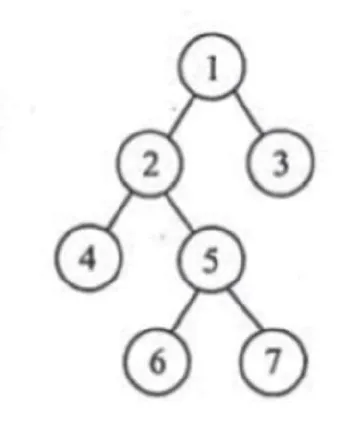
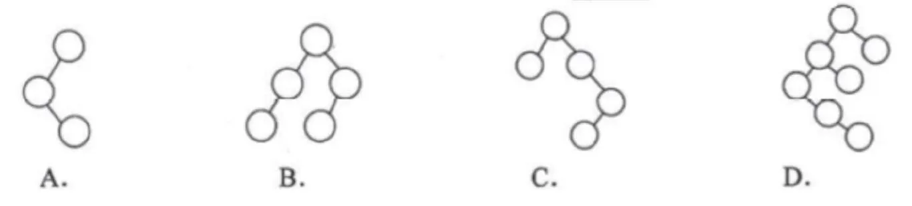
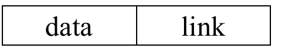

# 2009 408 真题 · 数据结构

> 本科目共 12 题 / 45 分：单项选择题 10 题（20 分）+ 综合应用题 2 题（25 分）。

## 一、单项选择题

### 1. （2 分 · 栈、队列与数组）

为解决计算机与打印机之间速度不匹配的问题，通常设置一个打印数据缓冲区，主机将要输出的数据依次写入该缓冲区，而打印机则依次从该缓冲区中取出数据。该缓冲区的逻辑结构应该是( )。

- **A.** 栈
- **B.** 队列
- **C.** 树
- **D.** 图

**答案**：B

**解析**：答案 B。缓冲区按「先写入的先取出」工作，这正是队列先进先出（FIFO）的特点。栈是后进先出，会颠倒打印顺序；树和图是非线性结构，无法描述这种顺序读写关系。

> 难度 ⭐ ｜ 章节 栈、队列与数组 ｜ 标签 数据结构 / 栈 / 队列 / 数组 / 缓冲区

---

### 2. （2 分 · 栈、队列与数组）

设栈 S 和队列 Q 的初始状态均为空，元素 a, b, c, d, e, f, g 依次进入栈 S 。若每个元素出栈后立即进入队列 Q，且 7 个元素出队的顺序是 b, d, c, f, e, a, g，则栈 S 的容量至少是( )。

- **A.** 1
- **B.** 2
- **C.** 3
- **D.** 4

**答案**：C

**解析**：答案 C。栈的容量即入栈过程中栈内元素最多的个数。按出栈序列 b,d,c,f,e,a,g 模拟入栈、出栈，栈内最多同时有 3 个元素，故容量至少为 3。

> 难度 ⭐⭐⭐ ｜ 章节 栈、队列与数组 ｜ 标签 数据结构 / 栈 / 队列 / 数组

---

### 3. （2 分 · 树与二叉树）

给定二叉树如图所示。设 N 代表二叉树的根，L 代表根结点的左子树，R 代表根结点的右子树。若遍历后的结点序列是 3，1，7，5，6，2，4，则其遍历方式是______。



- **A.** LRN
- **B.** NRL
- **C.** RLN
- **D.** RNL

**答案**：D

**解析**：答案 D。序列中先出现的都是右子树结点，接着是根结点，最后是左子树结点，即按「右子树 → 根 → 左子树」的顺序遍历，记为 RNL。这是中序遍历的镜像（把左右子树的访问顺序对调），不是二叉树三种基本遍历之一。

> 难度 ⭐⭐⭐ ｜ 章节 树与二叉树 ｜ 标签 数据结构 / 树 / 二叉树 / 二叉树遍历

---

### 4. （2 分 · 查找）

下列二叉排序树中，满足平衡二叉树定义的是______。



- **A.** 图 A
- **B.** 图 B
- **C.** 图 C
- **D.** 图 D

**答案**：B

**解析**：答案 B。平衡二叉树要求任意结点的左、右子树高度差绝对值不超过 1。B 满足；其余选项都有不满足该条件的结点，可逐个结点算平衡因子验证。

> 难度 ⭐⭐⭐ ｜ 章节 查找 ｜ 标签 数据结构 / 查找 / 散列表 / B树 / AVL树 / 二叉排序树

---

### 5. （2 分 · 树与二叉树）

已知一棵完全二叉树的第 6 层(设根为第 1 层)有 8 个叶结点，则该完全二叉树的结点个数最多是()。

- **A.** 39
- **B.** 52
- **C.** 111
- **D.** 119

**答案**：C

**解析**：答案 C。第 6 层有 8 个叶结点，说明第 7 层少了 8×2=16 个结点（这 8 个叶结点本应各有 2 个孩子）。满 7 层二叉树共 2⁷−1=127 个结点，减去 16 得 111 个。

> 难度 ⭐⭐⭐ ｜ 章节 树与二叉树 ｜ 标签 数据结构 / 树 / 二叉树 / 二叉树遍历

---

### 6. （2 分 · 树与二叉树）

将森林转换为对应的二叉树，若在二叉树中，结点 u 是结点 v 的父结点的父结点，则在原来的森林中，u 和 v 可能具有的关系是( )。

I. 父子关系

II. 兄弟关系

III. u 的父结点与 v 的父结点是兄弟关系

- **A.** 只有 II
- **B.** I 和 II
- **C.** I 和 III
- **D.** I、II 和 III

**答案**：B

**解析**：答案 B。森林转二叉树用「左孩子右兄弟」规则。转换后 u 是 v 的父结点的父结点，对应原森林中 u 是 v 的祖父（I），或 u 与 v 是隔一个兄弟的兄弟关系（II）；III 不可能。

> 难度 ⭐⭐⭐⭐ ｜ 章节 树与二叉树 ｜ 标签 数据结构 / 树 / 二叉树 / 二叉树遍历

---

### 7. （2 分 · 图）

下列关于无向连通图特性的叙述中，正确的是()。

I. 所有顶点的度之和为偶数

II. 边数大于顶点个数减 1

III. 至少有一个顶点的度为 1

- **A.** 只有 I
- **B.** 只有 II
- **C.** I 和 II
- **D.** I 和 III

**答案**：A

**解析**：答案 A。无向图中每条边连接两个顶点，求度之和时每条边被计两次，故度之和为偶数（I 正确）。n 个顶点 n−1 条边可构成树（II 错误）；完全图不存在度为 1 的顶点（III 错误）。

> 难度 ⭐⭐ ｜ 章节 图 ｜ 标签 数据结构 / 图 / 最短路径 / 最小生成树

---

### 8. （2 分 · 查找）

下列叙述中，不符合 m 阶 B 树定义要求的是()。

- **A.** 根节点最多有 m 棵子树
- **B.** 所有叶结点都在同一层上
- **C.** 各结点内关键字均升序或降序排列
- **D.** 叶结点之间通过指针链接

**答案**：D

**解析**：答案 D。m 阶 B 树要求结点内关键字有序、所有叶结点同层、每个结点至多 m 棵子树。D 的「叶结点之间用指针链接」是 B+ 树的特点，不是 B 树。

> 难度 ⭐⭐ ｜ 章节 查找 ｜ 标签 数据结构 / 查找 / 散列表 / B树

---

### 9. （2 分 · 排序）

已知关键字序列 5，8，12，19，28，20，15，22 是小根堆(最小堆)，插入关键字 3，调整后得到的小根堆是()。

- **A.** 3，5，12，8，28，20，15，22，19
- **B.** 3，5，12，19，20，15，22，8，28
- **C.** 3，8，12，5，20，15，22，28，19
- **D.** 3，12，5，8，28，20，15，22，19

**答案**：A

**解析**：答案 A。插入 3 先放堆尾，再向上调整。原堆 5,8,12,19,28,20,15,22 插入 3 并上浮后为 3,5,12,8,28,20,15,22,19。

> 难度 ⭐⭐ ｜ 章节 排序 ｜ 标签 数据结构 / 排序 / 内部排序 / 外部排序

---

### 10. （2 分 · 排序）

若数据元素序列 11，12，13，7，8，9，23，4，5 是采用下列排序方法之一得到的第二趟排序后的结果，则该排序算法只能是（）。

- **A.** 冒泡排序
- **B.** 插入排序
- **C.** 选择排序
- **D.** 二路归并排序

**答案**：B

**解析**：答案 B。序列 11,12,13,7,8,9,23,4,5 是第二趟后的结果，前三个元素 11,12,13 已有序，符合插入排序「每趟使前面元素有序」的特征。冒泡/选择每趟确定一个最大或最小元素，归并第一趟后应两两有序，均不符。

> 难度 ⭐⭐⭐ ｜ 章节 排序 ｜ 标签 数据结构 / 排序 / 内部排序 / 外部排序

---

## 二、综合应用题

### 41. （10 分 · 图）

带权图(权值非负，表示边连接的两顶点间的距离)的最短路径问题是找出从初始顶点到目标顶点之间的一条最短路径。假设从初始顶点到目标顶点之间存在路径，现有一种解决该问题的方法：

① 设最短路径初始时仅包含初始顶点，令当前顶点 u 为初始顶点；

② 选择离 u 最近且尚未在最短路径中的一个顶点 v，加入到最短路径中，修改当前顶点 u=v；

③ 重复步骤 ②，直到 u 是目标顶点时为止。

请问上述方法能否求得最短路径？若该方法可行，请证明之；否则，请举例说明。

**答案 / 解析**：

答案：不一定能求得最短路径。理由：该方法每次选「离目标最近的邻接点」，是局部贪心，不能保证全局最短。反例：设顶点 1 到 4 的直连边权为 3，另有路径 1→2→3→4 总权为 2，从 1 出发选离 4 最近的邻接点会走权 3 的直边，得到 3 而非最短的 2；还可能因「离目标最近」判断错误而根本走不到目标。

> 难度 ⭐⭐⭐⭐ ｜ 章节 图 ｜ 标签 数据结构 / 图 / 最短路径 / 最小生成树

---

### 42. （15 分 · 线性表）

已知一个带有表头结点的单链表，结点结构为：



假设该链表只给出了头指针 list。在不改变链表的前提下，请设计一个尽可能高效的算法，查找链表中倒数第 k 个位置上的结点（k 为正整数）。若查找成功，算法输出该结点的 data 域的值，并返回 1；否则，只返回 0。要求：

（1）描述算法的基本设计思想。

（2）描述算法的详细实现步骤。

（3）根据设计思想和实现步骤，采用程序设计语言描述算法（使用 C、C++ 或 Java 语言实现），关键之处请给出简要注释。

**答案 / 解析**：

答案：1、基本思想：用快慢双指针，先让指针 p 前进 k 步，再让 q 与 p 同步前进；当 p 到达表尾时，q 即指向倒数第 k 个结点。一趟扫描完成。2、时间 O(n)、空间 O(1)。核心代码：

```c
int FindKthFromEnd(Node *head, int k) {
    Node *p = head, *q = head;
    for (int i = 0; i < k; i++) {
        if (p->link == NULL) return 0;   // k 超过表长
        p = p->link;
    }
    while (p != NULL) { p = p->link; q = q->link; }
    return q->data;
}
```

> 难度 ⭐⭐⭐⭐ ｜ 章节 线性表 ｜ 标签 数据结构 / 线性表 / 顺序表 / 链表

---

## See Also

- [[408/真题精读/2009/计算机组成原理]]
- [[408/真题精读/2009/操作系统]]
- [[408/真题精读/2009/计算机网络]]
- [[408/历年真题/2009]]
- [[408/真题精读/真题精读总目录]]
