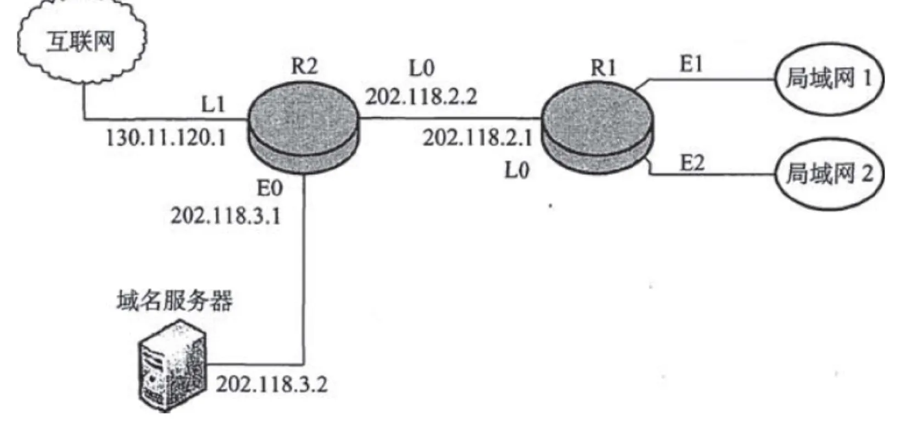

# 2009 408 真题 · 计算机网络

> 本科目共 9 题 / 25 分：单项选择题 8 题（16 分）+ 综合应用题 1 题（9 分）。

## 一、单项选择题

### 33. （2 分 · 计算机网络体系结构）

OSI 参考模型中，自下而上第一个提供端到端服务的层次是（ ）

- **A.** 数据链路层
- **B.** 传输层
- **C.** 会话层
- **D.** 应用层

**答案**：B

**解析**：答案 B。传输层通过端口号提供进程间的端到端逻辑通信，是自下而上第一个提供端到端服务的层次。

> 难度 ⭐⭐ ｜ 章节 计算机网络体系结构 ｜ 标签 计算机网络 / 计算机网络体系结构

---

### 34. （2 分 · 物理层）

在无噪声情况下，若某低通通信链路的带宽为 3 kHz，采用 4 个相位，每个相位具有 4 种振幅的 QAM 调制技术，则该通信链路的最大数据传输速率是（ ）。

- **A.** 12 kbps
- **B.** 24 kbps
- **C.** 48 kbps
- **D.** 96 kbps

**答案**：B

**解析**：答案 B。4 相位 × 4 振幅 = 16 种组合，每码元携带 log₂16=4 bit。按奈奎斯特定理，最大速率 = 2×3k×4 = 24 kbps。

> 难度 ⭐⭐⭐ ｜ 章节 物理层 ｜ 标签 计算机网络 / 物理层 / 编码 / 调制

---

### 35. （2 分 · 数据链路层）

数据链路层采用后退 N 帧（GBN）协议，发送方已经发送了编号为 0～7 的帧。当计时器超时时，若发送方只收到 0、2、3 号帧的确认，则发送方需要重发的帧数是（ ）

- **A.** 2
- **B.** 3
- **C.** 4
- **D.** 5

**答案**：C

**解析**：答案 C。GBN 用累计确认：收到 3 号帧确认表示 0～3 号帧都已收到，1 号确认只是返回途中丢失。因此需重传 4、5、6、7 号帧。

> 难度 ⭐⭐⭐ ｜ 章节 数据链路层 ｜ 标签 计算机网络 / 数据链路层 / MAC / CSMA/CD / PPP

---

### 36. （2 分 · 数据链路层）

以太网交换机进行转发决策时使用的 PDU 地址是（ ）

- **A.** 目的物理地址
- **B.** 目的 IP 地址
- **C.** 源物理地址
- **D.** 源 IP 地址

**答案**：A

**解析**：答案 A。以太网交换机工作在数据链路层，按目的 MAC（物理）地址转发，使用的 PDU 地址是目的物理地址。

> 难度 ⭐ ｜ 章节 数据链路层 ｜ 标签 计算机网络 / 数据链路层 / MAC / CSMA/CD / PPP / 指令流水线 / 内存分配

---

### 37. （2 分 · 数据链路层）

在一个采用 CSMA/CD 协议的网络中，传输介质是一根完整的电缆，传输速率为 1 Gbps，电缆中的信号传播速度是 200000 km/s。若最小数据帧长度减少 800 比特，则最远的两个站点之间的距离至少需要（ ）

- **A.** 增加 160 m
- **B.** 增加 80 m
- **C.** 减少 160 m
- **D.** 减少 80 m

**答案**：D

**解析**：答案 D。CSMA/CD 要求最短帧发送时间不小于碰撞窗口（2 倍往返时延）。帧长缩短后需减少冲突域距离使往返时延同步缩短，计算得最远两站点距离需减少 80m。

> 难度 ⭐⭐⭐ ｜ 章节 数据链路层 ｜ 标签 计算机网络 / 数据链路层 / MAC / CSMA/CD / PPP

---

### 38. （2 分 · 传输层）

主机甲与主机乙之间已建立一个 TCP 连接，主机甲向主机乙发送了两个连续的 TCP 段，分别包含 300 字节和 500 字节的有效载荷，第一个段的序列号为 200，主机乙正确接收到两个段后，发送给主机甲的确认序列号是（ ）。

- **A.** 500
- **B.** 700
- **C.** 800
- **D.** 1000

**答案**：D

**解析**：答案 D。TCP 确认号是期望收到的下一字节序号。乙收到 300+500=800 字节，起始序号 200，故确认号 = 200+800 = 1000。

> 难度 ⭐⭐⭐ ｜ 章节 传输层 ｜ 标签 计算机网络 / 传输层 / TCP / UDP / 拥塞控制

---

### 39. （2 分 · 传输层）

一个 TCP 连接总是以 1 KB 的最大段长发送 TCP 段，发送方有足够多的数据要发送。当拥塞窗口为 16 KB 时发生了超时，如果接下来的 4 个 RTT（往返时间）时间内的 TCP 段的传输都是成功的，那么当第 4 个 RTT 时间内发送的所有 TCP 段都得到肯定应答时，拥塞窗口大小是（ ）。

- **A.** 7 KB
- **B.** 8 KB
- **C.** 9 KB
- **D.** 16 KB

**答案**：C

**解析**：答案 C。超时后 ssthresh=16/2=8KB，拥塞窗口回到 1KB。慢开始：第 1～3 个 RTT 后窗口为 2、4、8KB（达 ssthresh），第 4 个 RTT 转拥塞避免加 1，故为 9KB。

> 难度 ⭐⭐⭐ ｜ 章节 传输层 ｜ 标签 计算机网络 / 传输层 / TCP / UDP / 拥塞控制

---

### 40. （2 分 · 应用层）

FTP 客户和服务器间传递 FTP 命令时，使用的连接是（ ）。

- **A.** 建立在 TCP 之上的控制连接
- **B.** 建立在 TCP 之上的数据连接
- **C.** 建立在 UDP 之上的控制连接
- **D.** 建立在 UDP 之上的数据连接

**答案**：A

**解析**：答案 A。FTP 用 TCP 保证可靠传输，且控制命令走独立的控制连接（带外传送），故选 A。

> 难度 ⭐ ｜ 章节 应用层 ｜ 标签 计算机网络 / 应用层 / HTTP / DNS / FTP / SMTP

---

## 二、综合应用题

### 47. （9 分 · 网络层）

某网络拓扑如下图所示，路由器 R1 通过接口 E1、E2 分别连接局域网 1、局域网 2，通过接口 L0 连接路由器 R2，并通过路由器 R2 连接域名服务器与互联网。R1 的 L0 接口的 IP 地址是 202.118.2.1，R2 的 L0 接口的 IP 地址是 202.118.2.2，L1 接口的 IP 地址是 130.11.120.1，E0 接口的 IP 地址是 202.118.3.1，域名服务器的 IP 地址是 202.118.3.2。

R1 和 R2 的路由表结构为：

| 目的网络 IP 地址 | 子网掩码 | 下一跳 IP 地址 | 接口 |
| --- | --- | --- | --- |

（1）将 IP 地址空间 202.118.1.0/24 划分为 2 个子网，分别分配给局域网 1、局域网 2，每个局域网需分配的 IP 地址数不少于 120 个。请给出子网划分结果，说明理由或给出必要的计算过程。

（2）请给出 R1 的路由表，使其明确包括到局域网 1 的路由、局域网 2 的路由、域名服务器的主机路由和互联网的路由。

（3）请采用路由聚合技术，给出到局域网 1 和局域网 2 的路由。

**答案 / 解析**：

答案：(1) 划为两个 /25 子网：202.118.1.0/25 和 202.118.1.128/25（主机号 7 位，每个可含 126 台主机，满足不少于 120）。
(2) R1 路由表（子网 1 分给局域网 1 时）：局域网 1 用 202.118.1.0/25 经 E1 直连，局域网 2 用 202.118.1.128/25 经 E2 直连；DNS 特定路由 202.118.3.2/32 下一跳 202.118.2.2 经 L0；默认路由 0.0.0.0/0 下一跳 202.118.2.2 经 L0。
(3) 两个局域网可聚合为 202.118.1.0/24，R2 到它们的路由为 202.118.1.0/24 下一跳 202.118.2.1 经 L0。

> 难度 ⭐⭐⭐ ｜ 章节 网络层 ｜ 标签 计算机网络 / 网络层 / IP / 路由 / 子网划分 / CIDR / 应用层

---

## See Also

- [[408/真题精读/2009/数据结构]]
- [[408/真题精读/2009/计算机组成原理]]
- [[408/真题精读/2009/操作系统]]
- [[408/历年真题/2009]]
- [[408/真题精读/真题精读总目录]]
