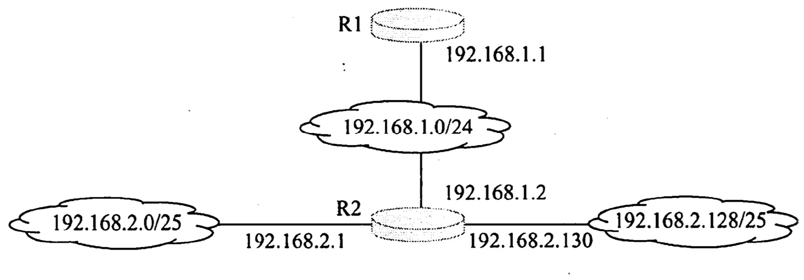
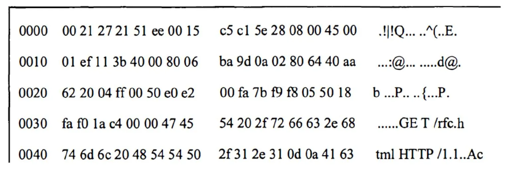

# 2011 408 真题 · 计算机网络

> 本科目共 9 题 / 25 分：单项选择题 8 题（16 分）+ 综合应用题 1 题（9 分）。

## 一、单项选择题

### 33. （2 分 · 计算机网络体系结构）

TCP/IP 参考模型的网络层提供的是（ ）。

- **A.** 无连接不可靠的数据报服务
- **B.** 无连接可靠的数据报服务
- **C.** 有连接不可靠的虚电路服务
- **D.** 有连接可靠的虚电路服务

**答案**：A

**解析**：答案 A。TCP/IP 网络层的 IP 协议提供无连接的、尽最大努力交付（不可靠）的数据报服务，分组独立转发，不保证可靠有序；有连接、可靠的服务由传输层 TCP 提供。

> 难度 ⭐⭐ ｜ 章节 计算机网络体系结构 ｜ 标签 计算机网络 / 计算机网络体系结构 / 传输层 / 网络层

---

### 34. （2 分 · 物理层）

若某通信链路的数据传输速率为 2400 bps，采用 4 相位调制，则该链路的波特率是（ ）。

- **A.** 600 波特
- **B.** 1200 波特
- **C.** 4800 波特
- **D.** 9600 波特

**答案**：B

**解析**：答案 B。4 相位调制有 4 种状态，每个码元携带 log₂4=2 比特。波特率=比特率/log₂4=2400/2=1200 波特。

> 难度 ⭐⭐ ｜ 章节 物理层 ｜ 标签 计算机网络 / 物理层 / 编码 / 调制

---

### 35. （2 分 · 数据链路层）

数据链路层采用选择重传协议（SR）传输数据，发送方已发送了 0 ～ 3 号数据帧，现已收到 1 号帧的确认，而 0、2 号帧依次超时，则此时需要重传的帧数是（ ）。

- **A.** 1
- **B.** 2
- **C.** 3
- **D.** 4

**答案**：B

**解析**：答案 B。选择重传协议中 ACK 不具累积确认作用，1 号帧的确认不代表 0、2 号帧被收到。0、2 号帧超时需重传，共 2 帧；3 号帧计时器未超时，暂不重传。

> 难度 ⭐⭐ ｜ 章节 数据链路层 ｜ 标签 计算机网络 / 数据链路层 / MAC / CSMA/CD / PPP

---

### 36. （2 分 · 数据链路层）

下列选项中，对正确接收到的数据帧进行确认的 MAC 协议是（ ）。

- **A.** CSMA
- **B.** CDMA
- **C.** CSMA/CD
- **D.** CSMA/CA

**答案**：D

**解析**：答案 D。CSMA/CA 是无线局域网 802.11 的 MAC 协议，接收方对正确收到的数据帧要发回 ACK 帧确认；CSMA、CDMA 和 CSMA/CD 都没有这种 MAC 层确认机制。

> 难度 ⭐⭐ ｜ 章节 数据链路层 ｜ 标签 计算机网络 / 数据链路层 / MAC / CSMA/CD / PPP

---

### 37. （2 分 · 网络层）

某网络拓扑如下图所示，路由器 R1 只有到达子网 192.168.1.0/24 的路由。为使 R1 可以将 IP 分组正确地路由到图中所有的子网，则在 R1 中需要增加的一条路由（目的网络，子网掩码，下一跳）是（ ）。

- **A.** 192.168.2.0，255.255.255.128，192.168.1.1
- **B.** 192.168.2.0，255.255.255.0，192.168.1.1
- **C.** 192.168.2.0，255.255.255.128，192.168.1.2
- **D.** 192.168.2.0，255.255.255.0，192.168.1.2

**答案**：D

**解析**：答案 D。192.168.2.0/25 与 192.168.2.128/25 前 24 位相同，可聚合成 192.168.2.0/24，掩码 255.255.255.0；下一跳为与 R1 直连的 R2 接口地址 192.168.1.2。

> 难度 ⭐⭐⭐ ｜ 章节 网络层 ｜ 标签 计算机网络 / 网络层 / IP / 路由 / 子网划分 / CIDR

---

### 38. （2 分 · 网络层）

在子网 192.168.4.0/30 中，能接收目的地址为 192.168.4.3 的 IP 分组的最大主机数是（ ）。

- **A.** 0
- **B.** 1
- **C.** 2
- **D.** 4

**答案**：C

**解析**：答案 C。192.168.4.0/30 的主机号占 2 位：.0 为网络号、.3 为广播地址，可用主机只有 .1、.2 两个。192.168.4.3 是定向广播地址，子网内 2 台主机都接收，故最大主机数为 2。

> 难度 ⭐⭐⭐ ｜ 章节 网络层 ｜ 标签 计算机网络 / 网络层 / IP / 路由 / 子网划分 / CIDR

---

### 39. （2 分 · 传输层）

主机甲向主机乙发送一个（SYN=1, seq=11220）的 TCP 段，期望与主机乙建立 TCP 连接，若主机乙接受该连接请求，则主机乙向主机甲发送的正确的 TCP 段可能是（ ）。

- **A.** `（SYN=0, ACK=0, seq=11221, ack=11221）`
- **B.** `（SYN=1, ACK=1, seq=11220, ack=11220）`
- **C.** `（SYN=1, ACK=1, seq=11221, ack=11221）`
- **D.** `（SYN=0, ACK=0, seq=11220, ack=11220）`

**答案**：C

**解析**：答案 C。乙接受连接后回送 SYN=1、ACK=1 的报文段；seq 为乙自行选定的初始序号，ack 必须为甲发送的 seq 加 1，即 ack=11220+1=11221。选项 C 的 SYN、ACK、ack 均正确。

> 难度 ⭐⭐ ｜ 章节 传输层 ｜ 标签 计算机网络 / 传输层 / TCP / UDP / 拥塞控制

---

### 40. （2 分 · 传输层）

主机甲与主机乙之间已建立一个 TCP 连接，主机甲向主机乙发送了 3 个连续的 TCP 段，分别包含 300 字节、400 字节和 500 字节的有效载荷，第 3 个段的序号为 900。若主机乙仅正确接收到第 1 和第 3 个段，则主机乙发送给主机甲的确认序号是（ ）。

- **A.** 300
- **B.** 500
- **C.** 1200
- **D.** 1400

**答案**：B

**解析**：答案 B。三个段序号连续，第 3 段序号为 900，则第 2 段序号为 900−400=500。乙只连续收到第 1 段，第 2 段缺失，确认号是期待收到的下一字节序号，即第 2 段首字节 500。

> 难度 ⭐⭐⭐ ｜ 章节 传输层 ｜ 标签 计算机网络 / 传输层 / TCP / UDP / 拥塞控制

---

## 二、综合应用题

### 47. （9 分 · 网络层）

某主机的 MAC 地址为 00-15-C5-C1-5E-28，IP 地址为 10.2.128.100（私有地址）。下图分别是网络拓扑，以及该主机进行 Web 请求的一个以太网数据帧前 80 B 的十六进制和 ASCII 码内容。

（1）Web 服务器的 IP 地址是什么？该主机的默认网关的 MAC 地址是什么？

（2）该主机在构造题图中的数据帧时，使用什么协议确定目的 MAC 地址？封装该协议请求报文的以太网帧的目的 MAC 地址是什么？

（3）假设 HTTP/1.1 协议以持续的非流水线方式工作，一次请求—响应时间为 RTT，rfc.html 页面引用了 5 个 JPEG 小图像，则从发出题图中的 Web 请求开始到浏览器收到全部内容为止，需要多少个 RTT？

（4）该帧所封装的 IP 分组经过路由器 R 转发时，需修改 IP 分组头中的哪些字段？

**答案 / 解析**：

答案：
1、以太网帧头占 14 字节，IP 头中目的 IP 字段位于帧内第 14+16=30 字节起，读出 40 aa 62 20，转十进制为 64.170.98.32，即 Web 服务器 IP。帧前 6 字节 00-21-27-21-51-ee 为目的 MAC，因目的主机不在本网段，它即默认网关 10.2.128.1 端口的 MAC 地址。
2、使用 ARP 协议确定默认网关的 MAC 地址；ARP 请求以广播方式发送，封装该请求的以太网帧的目的 MAC 地址为全 1，即 FF-FF-FF-FF-FF-FF。
3、非流水线的持续连接下，收到前一个响应后才能发下一个请求。页面含 1 个 HTML 和 5 个 JPEG 共 6 个对象，每个对象需要 1 个 RTT，共 1+5=6 个 RTT。
4、R 为 NAT 路由器：源 IP 地址由私有地址 10.2.128.100（0a 02 80 64）改为公网地址 101.12.123.15（65 0c 7b 0f）；TTL 减 1；头部校验和重新计算。若分组长度超过输出链路 MTU 触发分片，还需修改总长度、标志、片偏移字段。

> 难度 ⭐⭐⭐⭐ ｜ 章节 网络层 ｜ 标签 计算机网络 / 网络层 / IP / 路由 / 子网划分 / CIDR / 指令流水线 / 进程调度 / 应用层 / 数据链路层

---

## See Also

- [[408/真题精读/2011/数据结构]]
- [[408/真题精读/2011/计算机组成原理]]
- [[408/真题精读/2011/操作系统]]
- [[408/历年真题/2011]]
- [[408/真题精读/真题精读总目录]]
