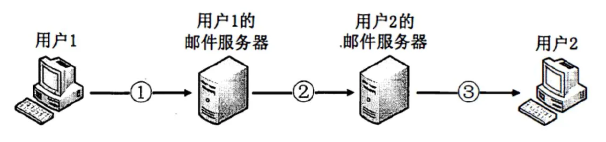
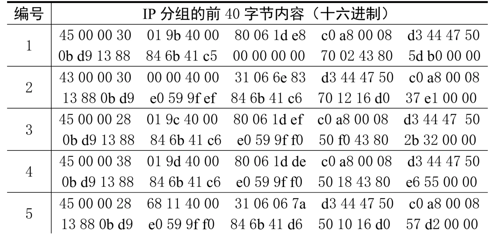
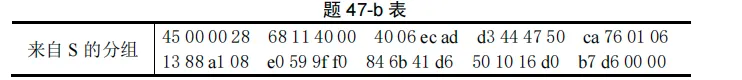
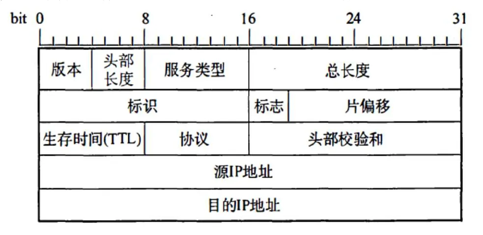
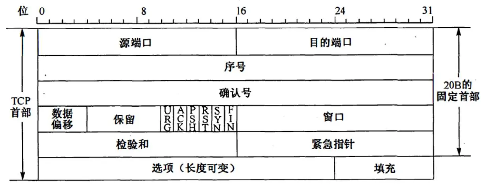

# 2012 408 真题 · 计算机网络

> 本科目共 9 题 / 25 分：单项选择题 8 题（16 分）+ 综合应用题 1 题（9 分）。

## 一、单项选择题

### 33. （2 分 · 网络层）

在 TCP/IP 体系结构中，直接为 ICMP 提供服务的协议是（ ）。

- **A.** PPP
- **B.** IP
- **C.** UDP
- **D.** TCP

**答案**：B

**解析**：答案 B。ICMP 报文作为数据字段封装在 IP 分组中，由 IP 协议直接为其提供服务；PPP 为网络层服务，UDP、TCP 为应用层服务。

> 难度 ⭐⭐ ｜ 章节 网络层 ｜ 标签 计算机网络 / 网络层 / IP / 路由 / 子网划分 / CIDR / 传输层

---

### 34. （2 分 · 物理层）

在物理层接口特性中，用于描述完成每种功能的事件发生顺序的是（ ）。

- **A.** 机械特性
- **B.** 功能特性
- **C.** 过程特性
- **D.** 电气特性

**答案**：C

**解析**：答案 C。过程特性（规程特性）定义各条物理线路的工作过程和时序关系，描述完成每种功能的事件发生顺序；机械、电气、功能特性分别描述接口形状、信号电平、引脚功能。

> 难度 ⭐⭐ ｜ 章节 物理层 ｜ 标签 计算机网络 / 物理层 / 编码 / 调制

---

### 35. （2 分 · 数据链路层）

以太网的 MAC 协议提供的是（ ）。

- **A.** 无连接不可靠服务
- **B.** 无连接可靠服务
- **C.** 有连接不可靠服务
- **D.** 有连接可靠服务

**答案**：A

**解析**：答案 A。以太网采用无连接方式，发送帧不编号、不要求确认，只提供尽最大努力的交付，是不可靠服务，差错处理由高层完成。

> 难度 ⭐⭐ ｜ 章节 数据链路层 ｜ 标签 计算机网络 / 数据链路层 / MAC / CSMA/CD / PPP

---

### 36. （2 分 · 数据链路层）

两台主机之间的数据链路层采用后退 N 帧协议（GBN）传输数据，数据传输速率为 16 kbps，单向传播时延为 270 ms，数据帧长度范围是 128～512 字节，接收方总是以与数据帧等长的帧进行确认。为使信道利用率达到最高，帧序号的比特数至少为（ ）。

- **A.** 5
- **B.** 4
- **C.** 3
- **D.** 2

**答案**：B

**解析**：答案 B。取最短帧 128B=1024bit，发送一帧需 1024/16kbps=64ms；发帧到收到确认共 64+2×270+64=668ms，可发 668/64≈10 帧。帧序号需 2ⁿ≥10，故 n=4。

> 难度 ⭐⭐⭐⭐ ｜ 章节 数据链路层 ｜ 标签 计算机网络 / 数据链路层 / MAC / CSMA/CD / PPP

---

### 37. （2 分 · 网络层）

下列关于 IP 路由器功能的描述中，正确的是（ ）。

Ⅰ. 运行路由协议，设置路由表
Ⅱ. 监测到拥塞时，合理丢弃 IP 分组
Ⅲ. 对收到的 IP 分组头进行差错校验，确保传输的 IP 分组不丢失
Ⅳ. 根据收到的 IP 分组的目的 IP 地址，将其转发到合适的输出线路上

- **A.** 仅 Ⅲ、Ⅳ
- **B.** 仅 Ⅰ、Ⅱ、Ⅲ
- **C.** 仅 Ⅰ、Ⅱ、Ⅳ
- **D.** Ⅰ、Ⅱ、Ⅲ、Ⅳ

**答案**：C

**解析**：答案 C。运行路由协议设置路由表（Ⅰ）、检测到拥塞时合理丢弃 IP 分组并发源点抑制报文（Ⅱ）、按目的 IP 地址转发（Ⅳ）都是路由器功能；Ⅲ 错误，路由器只对首部做差错检验并丢弃出错分组，不保证 IP 分组不丢失。

> 难度 ⭐⭐⭐ ｜ 章节 网络层 ｜ 标签 计算机网络 / 网络层 / IP / 路由 / 子网划分 / CIDR / 指令流水线

---

### 38. （2 分 · 网络层）

ARP 协议的功能是（ ）。

- **A.** 根据 IP 地址查询 MAC 地址
- **B.** 根据 MAC 地址查询 IP 地址
- **C.** 根据域名查询 IP 地址
- **D.** 根据 IP 地址查询域名

**答案**：A

**解析**：答案 A。ARP 将网络层的 IP 地址解析为数据链路层的 MAC 地址，即根据 IP 地址查询 MAC 地址；RARP 的功能相反。

> 难度 ⭐ ｜ 章节 网络层 ｜ 标签 计算机网络 / 网络层 / IP / 路由 / 子网划分 / CIDR / 数据链路层

---

### 39. （2 分 · 网络层）

某主机的 IP 地址为 180.80.77.55，子网掩码为 255.255.252.0。若该主机向其所在子网发送广播分组，则目的地址可以是（ ）。

- **A.** 180.80.76.0
- **B.** 180.80.76.255
- **C.** 180.80.77.255
- **D.** 180.80.79.255

**答案**：D

**解析**：答案 D。子网掩码 255.255.252.0 第 3 字节为 11111100，前 22 位为网络号、后 10 位为主机号。广播地址为主机号全 1：180.80.01001111.11111111，即 180.80.79.255。

> 难度 ⭐⭐⭐ ｜ 章节 网络层 ｜ 标签 计算机网络 / 网络层 / IP / 路由 / 子网划分 / CIDR

---

### 40. （2 分 · 应用层）

若用户 1 与用户 2 之间发送和接收电子邮件的过程如下图所示，则图中①、②、③阶段分别使用的应用层协议可以是（ ）。

- **A.** SMTP、SMTP、SMTP
- **B.** POP3、SMTP、POP3
- **C.** POP3、SMTP、SMTP
- **D.** SMTP、SMTP、POP3

**答案**：D

**解析**：答案 D。① 用户 1 向邮件服务器发送、② 邮件服务器之间转发都使用 SMTP（推方式）；③ 用户 2 从邮件服务器读取邮件使用 POP3（拉方式）。

> 难度 ⭐⭐ ｜ 章节 应用层 ｜ 标签 计算机网络 / 应用层 / HTTP / DNS / FTP / SMTP

---

## 二、综合应用题

### 47. （9 分 · 传输层）

主机 H 通过快速以太网连接 Internet，IP 地址为 192.168.0.8，服务器 S 的 IP 地址为 211.68.71.80。H 与 S 使用 TCP 通信时，在 H 上捕获的其中 5 个 IP 分组如下。

（1）题表中的 IP 分组中，哪几个是由 H 发送的？哪几个完成了 TCP 连接建立过程？哪几个在通过快速以太网传输时进行了填充？

（2）根据题表中的 IP 分组，分析 S 已经收到的应用层数据字节数是多少？

（3）若题表中的某个 IP 分组在 S 发出时的前 40 字节如下，则该 IP 分组到达 H 时经过了多少个路由器？

IP 分组头和 TCP 段头结构如下。

**答案 / 解析**：

答案：1、由源 IP 192.168.0.8（C0A80008H）判断，1、3、4 号分组由 H 发送；1 号（SYN=1,ACK=0）、2 号（SYN=1,ACK=1）、3 号（ACK=1）完成 TCP 连接建立；3、5 号分组总长 40B，小于快速以太网最小数据载荷 46B，传输时需填充。2、H 的应用层数据初始序号为 846B41C6H，5 号分组中 ack = 846B41D6H，S 已收到的数据字节数 = 846B41D6H−846B41C6H = 10H = 16。3、由标识字段 68H 可确定表 b 的分组对应 5 号分组；该分组发出时 TTL = 40H，到达 H 时 TTL = 31H，经过 40H−31H = 15 个路由器。

> 难度 ⭐⭐⭐⭐ ｜ 章节 传输层 ｜ 标签 计算机网络 / 传输层 / TCP / UDP / 拥塞控制 / 网络层 / 数据链路层

---

## See Also

- [[408/真题精读/2012/数据结构]]
- [[408/真题精读/2012/计算机组成原理]]
- [[408/真题精读/2012/操作系统]]
- [[408/历年真题/2012]]
- [[408/真题精读/真题精读总目录]]
