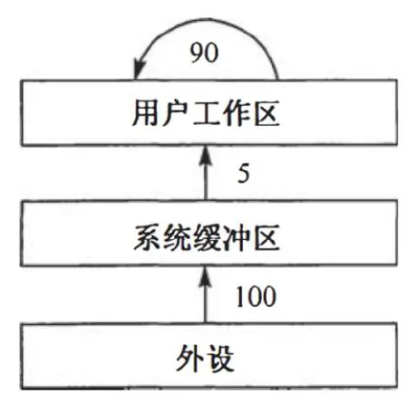
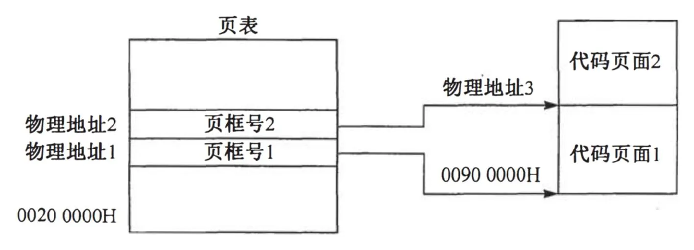

# 2013 408 真题 · 操作系统

> 本科目共 12 题 / 35 分：单项选择题 10 题（20 分）+ 综合应用题 2 题（15 分）。

## 一、单项选择题

### 23. （2 分 · 文件管理）

用户在删除某文件的过程中，操作系统不可能执行的操作是（ ）。

- **A.** 删除此文件所在的目录
- **B.** 删除与此文件关联的目录项
- **C.** 删除与此文件对应的文件控制块
- **D.** 释放与此文件关联的内存缓冲区

**答案**：A

**解析**：答案 A。删除文件时，操作系统要删除与该文件关联的目录项和文件控制块，并释放文件占用的缓冲区，但不会删除文件所在的目录，因为该目录下还有其他文件，故此项不可能执行。

> 难度 ⭐⭐ ｜ 章节 文件管理 ｜ 标签 操作系统 / 文件系统 / 文件 / 目录 / 磁盘

---

### 24. （2 分 · 文件管理）

为支持 CD-ROM 中视频文件的快速随机播放，播放性能最好的文件数据块组织方式是（ ）。

- **A.** 连续结构
- **B.** 链式结构
- **C.** 直接索引结构
- **D.** 多级索引结构

**答案**：A

**解析**：答案 A。快速随机播放要求最短的查询时间。连续结构下任意块的物理位置可由文件起始地址加偏移直接算出，一次定位即可随机访问，查询时间最短；链式和索引结构都需多次访问才能定位。

> 难度 ⭐⭐ ｜ 章节 文件管理 ｜ 标签 操作系统 / 文件系统 / 文件 / 目录 / 磁盘

---

### 25. （2 分 · 输入输出管理）

用户程序发出磁盘 I/O 请求后，系统的处理流程是：用户程序→系统调用处理程序→设备驱动程序→中断处理程序。其中，计算数据所在磁盘的柱面号、磁头号、扇区号的程序是（ ）。

- **A.** 用户程序
- **B.** 系统调用处理程序
- **C.** 设备驱动程序
- **D.** 中断处理程序

**答案**：C

**解析**：答案 C。计算数据所在的柱面号、磁头号、扇区号属于设备驱动程序的功能。这些物理参数因设备硬件而异，由厂家提供的设备驱动程序把逻辑请求转换成具体的磁盘物理地址。

> 难度 ⭐⭐⭐ ｜ 章节 输入输出管理 ｜ 标签 操作系统 / I/O系统 / 中断 / DMA / I/O方式 / 磁盘 / 设备管理

---

### 26. （2 分 · 文件管理）

若某文件系统索引结点 (inode) 中有直接地址项和间接地址项，则下列选项中，与单个文件长度无关的因素是（ ）。

- **A.** 索引结点的总数
- **B.** 间接地址索引的级数
- **C.** 地址项的个数
- **D.** 文件块大小

**答案**：A

**解析**：答案 A。间接地址索引的级数（B）、地址项的个数（C）和文件块大小（D）决定单个文件可寻址的空间。索引结点的总数（A）只决定整个文件系统能容纳的文件个数，与单个文件长度无关。

> 难度 ⭐⭐⭐ ｜ 章节 文件管理 ｜ 标签 操作系统 / 文件系统 / 文件 / 目录 / 磁盘

---

### 27. （2 分 · 输入输出管理）

设系统缓冲区和用户工作区均采用单缓冲，从外设读入 1 个数据块到系统缓冲区的时间为 100，从系统缓冲区读入 1 个数据块到用户工作区的时间为 5，对用户工作区中的 1 个数据块进行分析的时间为 90，如下图所示。进程从外设读入并分析 2 个数据块的最短时间是（ ）。



- **A.** 200
- **B.** 295
- **C.** 300
- **D.** 390

**答案**：C

**解析**：答案 C。单缓冲下各步只能部分重叠：读入块 1 用 100，转入工作区用 5；块 1 分析（90）期间可并行读入块 2（100）；再转入工作区 5，最后分析块 2 用 90。总时间 = 100+5+100+5+90 = 300。

> 难度 ⭐⭐⭐⭐ ｜ 章节 输入输出管理 ｜ 标签 操作系统 / I/O系统 / 中断 / DMA / 缓冲区

---

### 28. （2 分 · 计算机系统概述）

下列选项中，会导致用户进程从用户态切换到内核态的操作是（ ）。 

I. 整数除以零 

II. sin() 函数调用 

III. read 系统调用

- **A.** 仅 I、II
- **B.** 仅 I、III
- **C.** 仅 II、III
- **D.** I、II 和 III

**答案**：B

**解析**：答案 B。整数除以零是异常（内中断），由硬件触发进入内核处理；read 是系统调用，需陷入内核。sin() 只是用户态下的数学库函数调用，不进入内核。故选仅 I、III。

> 难度 ⭐⭐⭐ ｜ 章节 计算机系统概述 ｜ 标签 操作系统 / 计算机系统概述

---

### 29. （2 分 · 计算机系统概述）

计算机开机后，操作系统最终被加载到（ ）。

- **A.** BIOS
- **B.** ROM
- **C.** EPROM
- **D.** RAM

**答案**：D

**解析**：答案 D。开机后 BIOS 把操作系统从磁盘调入内存，操作系统运行需要可读可写的大容量存储，故最终加载到 RAM 中运行。ROM、EPROM 只读且容量小，BIOS 是固化在 ROM 中的引导程序。

> 难度 ⭐ ｜ 章节 计算机系统概述 ｜ 标签 操作系统 / 计算机系统概述

---

### 30. （2 分 · 内存管理）

若用户进程访问内存时产生缺页，则下列选项中，操作系统可能执行的操作是（ ）。 

I. 处理越界错 

II. 置换页 

III. 分配内存

- **A.** 仅 I、II
- **B.** 仅 II、III
- **C.** 仅 I、III
- **D.** I、II 和 III

**答案**：B

**解析**：答案 B。发生缺页中断后，系统可能分配内存（有空闲页框时调入页面）或置换页面（无空闲页框时换出某页腾出空间）。越界检查在地址变换时已由硬件完成，缺页处理不涉及越界错。故选仅 II、III。

> 难度 ⭐⭐ ｜ 章节 内存管理 ｜ 标签 操作系统 / 内存管理 / 分页 / 分段 / 虚拟内存 / 页面置换

---

### 31. （2 分 · 进程与线程）

某系统正在执行三个进程 P1、P2 和 P3，各进程的计算（CPU）时间和 I/O 时间比例如下表所示。

| 进程 | 计算时间 | I/O 时间 |
| --- | ---: | ---: |
| P1 | 90% | 10% |
| P2 | 50% | 50% |
| P3 | 15% | 85% |

为提高系统资源利用率，合理的进程优先级设置应为（ ）。

- **A.** P1>P2>P3
- **B.** P3>P2>P1
- **C.** P2>P1=P3
- **D.** P1>P2=P3

**答案**：B

**解析**：答案 B。I/O 占用多的进程应获更高优先级：它们占用 CPU 时间短，能尽快让出 CPU 发起 I/O，使 CPU 与 I/O 设备并行工作，提高资源利用率。按 I/O 比例排序为 P3(85%) > P2(50%) > P1(10%)。

> 难度 ⭐⭐⭐ ｜ 章节 进程与线程 ｜ 标签 操作系统 / 进程管理 / 进程 / 线程 / 同步 / PV操作 / 进程调度

---

### 32. （2 分 · 进程与线程）

下列关于银行家算法的叙述中，正确的是（ ）。

- **A.** 银行家算法可以预防死锁
- **B.** 当系统处于安全状态时，系统中一定无死锁进程
- **C.** 当系统处于不安全状态时，系统中一定会出现死锁进程
- **D.** 银行家算法破坏了死锁必要条件中的"请求和保持"条件

**答案**：B

**解析**：答案 B。银行家算法属于死锁避免而非预防，A 错。系统处于安全状态时存在让所有进程完成的进程序列，故一定无死锁进程，B 对。不安全状态只是有死锁风险、不必然死锁，C 错。银行家算法不破坏死锁必要条件，D 错。

> 难度 ⭐⭐⭐ ｜ 章节 进程与线程 ｜ 标签 操作系统 / 进程管理 / 进程 / 线程 / 同步 / PV操作 / 死锁

---

## 二、综合应用题

### 45. （7 分 · 进程与线程）

某博物馆最多可容纳 500 人同时参观，有一个出入口，该出入口一次仅允许一个人通过。参观者的活动描述如下：

```text
cobegin
参观者进程 i:
{
    ...
    进门;
    ...
    参观;
    ...
    出门;
    ...
}
coend
```

请添加必要的信号量和 P、V（或 `wait()`、`signal()`）操作，以实现上述过程中的互斥与同步。要求写出完整的过程，说明信号量的含义并赋初值。

**答案 / 解析**：

答案：设两个信号量：mutex 初值 1，用于出入口互斥（一次仅一人通过）；empty 初值 500，表示博物馆还可容纳的人数。参观本身不占用出入口，无需加锁。核心代码：

```c
semaphore empty = 500, mutex = 1;
visitor() {
    P(empty);      // 申请馆内容量
    P(mutex);      // 占用出入口
    进门;
    V(mutex);      // 释放出入口
    参观;
    P(mutex);      // 出门同样占用出入口
    出门;
    V(mutex);
    V(empty);      // 释放一个容量
}
```

> 难度 ⭐⭐ ｜ 章节 进程与线程 ｜ 标签 操作系统 / 进程管理 / 进程 / 线程 / 同步 / PV操作 / 同步与互斥

---

### 46. （8 分 · 内存管理）

某计算机主存按字节编址，逻辑地址和物理地址都是 32 位，页表项大小为 4 字节。


（1）若使用一级页表的分页存储管理方式，逻辑地址结构如下：

| 页号（20 位） | 页内偏移量（12 位） |
| --- | --- |

则页的大小是多少字节？页表最大占用多少字节？


（2）若使用二级页表的分页存储管理方式，逻辑地址结构如下：

| 页目录号（10 位） | 页表索引（10 位） | 页内偏移量（12 位） |
| --- | --- | --- |

设逻辑地址为 LA，请分别给出其对应的页目录号和页表索引的表达式。


（3）采用第（1）问中的分页存储管理方式，一个代码段起始逻辑地址为 0000 8000H，其长度为 8 KB，被装载到从物理地址 0090 0000H 开始的连续主存空间中。页表从主存 0020 0000H 开始的物理地址处连续存放，如下图所示（地址大小自下向上递增）。请计算出该代码段对应的两个页表项的物理地址、这两个页表项中的页框号以及代码页面 2 的起始物理地址。



**答案 / 解析**：

答案：1、页内偏移 12 位，页大小 = 2¹² = 4KB；页表项数 = 2²⁰，页表最大 = 2²⁰×4B = 4MB。2、页目录号 = ((unsigned int)(LA) >> 22) & 0x3FF；页表索引 = ((unsigned int)(LA) >> 12) & 0x3FF。3、代码段起始逻辑地址 00008000H，页号 = 00008000H >> 12 = 8，8KB 长度占第 8、9 两页。页表项 8 的物理地址 = 00200000H + 8×4 = 00200020H，页表项 9 的 = 00200000H + 9×4 = 00200024H。代码段装入 00900000H 起，两个页框号分别为 00900H 和 00901H，代码页面 2 的起始物理地址 = 00901000H。

> 难度 ⭐⭐⭐ ｜ 章节 内存管理 ｜ 标签 操作系统 / 内存管理 / 分页 / 分段 / 虚拟内存 / 页面置换 / 地址转换 / 内存分配 / 文件系统

---

## See Also

- [[408/真题精读/2013/数据结构]]
- [[408/真题精读/2013/计算机组成原理]]
- [[408/真题精读/2013/计算机网络]]
- [[408/历年真题/2013]]
- [[408/真题精读/真题精读总目录]]
