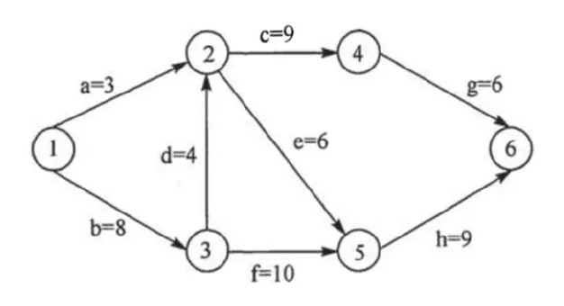

# 2013 408 真题 · 数据结构

> 本科目共 13 题 / 45 分：单项选择题 11 题（22 分）+ 综合应用题 2 题（23 分）。

## 一、单项选择题

### 1. （2 分 · 线性表）

已知两个长度分别为 m 和 n 的升序链表，若将它们合并为一个长度为 m+n 的降序链表，则最坏情况下的时间复杂度是()。

- **A.** O(n)
- **B.** O(m×n)
- **C.** O(min(m,n))
- **D.** O(max(m,n))

**答案**：D

**解析**：答案 D。合并两个升序链表时，每次比较取较小元素链接，最坏情况下两个链表的所有元素都要参与比较，共 m+n 次。因 max(m,n) ≤ m+n ≤ 2max(m,n)，两者同阶，故选 O(max(m,n))。

> 难度 ⭐⭐ ｜ 章节 线性表 ｜ 标签 数据结构 / 线性表 / 顺序表 / 链表

---

### 2. （2 分 · 栈、队列与数组）

一个栈的入栈序列为1,2,3,⋯,n，其出栈序列是p1,p2,p3,⋯,pn，若p2=3，则p3可能取值的个数是()。

- **A.** n-3
- **B.** n-2
- **C.** n-1
- **D.** 无法确定

**答案**：C

**解析**：答案 C。p2=3 说明 3 已出栈，故 p3 必不等于 3。4～n 均可取：不断入栈后立即出栈即可。1、2 也可取：p1=1 时栈内剩 2 可出，p1=2 时栈内剩 1 可出。除 3 外其余 n-1 个值都可达。

> 难度 ⭐⭐⭐⭐ ｜ 章节 栈、队列与数组 ｜ 标签 数据结构 / 栈 / 队列 / 数组

---

### 3. （2 分 · 查找）

若将关键字 1,2,3,4,5,6,7 依次插入到初始为空的平衡二叉树 T 中，则 T 中平衡因子为 0 的分支结点的个数是( )。

- **A.** 0
- **B.** 1
- **C.** 2
- **D.** 3

**答案**：D

**解析**：答案 D。依次插入 1～7 并做旋转调整，最终 AVL 树为 4(2(1,3),6(5,7))。分支结点只有 4、2、6 三个，它们的左右子树等高，平衡因子均为 0；叶子 1、3、5、7 不算分支结点。

> 难度 ⭐⭐⭐⭐ ｜ 章节 查找 ｜ 标签 数据结构 / 查找 / 散列表 / B树 / AVL树

---

### 4. （2 分 · 树与二叉树）

已知三叉树 T 中 6 个叶结点的权分别是 2，3，4，5，6，7，T 的带权(外部)路径长度最小是( )。

- **A.** 27
- **B.** 46
- **C.** 54
- **D.** 56

**答案**：B

**解析**：答案 B。三叉哈夫曼树要求 (n₀−1) 能被 (3−1) 整除，6 个叶子需补 1 个权为 0 的虚叶。依次合并 {0,2,3}→5、{4,5,5}→14、{6,7,14}→27。WPL=6×1+7×1+4×2+5×2+2×3+3×3=46。

> 难度 ⭐⭐⭐⭐ ｜ 章节 树与二叉树 ｜ 标签 数据结构 / 树 / 二叉树 / 二叉树遍历

---

### 5. （2 分 · 树与二叉树）

若 X 是后序线索二叉树中的叶结点，且 X 存在左兄弟结点 Y 。则 X 的右线索指的是( )。

- **A.** X 的父结点
- **B.** 以 Y 为根的子树的最左下结点
- **C.** X 的左兄弟结点 Y
- **D.** 以 Y 为根的子树的最右下结点

**答案**：A

**解析**：答案 A。X 是叶结点且存在左兄弟，则 X 是其父结点的右孩子。后序遍历按 左子树、右子树、根 的顺序进行，访问完 X 后下一个访问的就是父结点，故 X 的右线索指向父结点。

> 难度 ⭐⭐⭐ ｜ 章节 树与二叉树 ｜ 标签 数据结构 / 树 / 二叉树 / 二叉树遍历 / 线索二叉树

---

### 6. （2 分 · 查找）

在任意一棵非空二叉排序树 T1 中，删除某结点 v 之后形成二叉排序树 T2 ，再将 v 插入 T2 形成二叉排序树 T3 。下列关于 T1 与 T3 的叙述中，正确的是( )。 

I. 若 v 是 T1 的叶结点，则 T1 与 T3 不同 

II. 若 v 是 T1 的叶结点，则 T1 与 T3 相同 

III. 若 v 不是 T1 的叶结点，则 T1 与 T3 不同 

IV. 若 v 不是 T1 的叶结点，则 T1 与 T3 相同

- **A.** 仅 I、III
- **B.** 仅 I、IV
- **C.** 仅 II、III
- **D.** 仅 II、IV

**答案**：C

**解析**：答案 C。删除叶结点后其位置的空指针仍在，再插入 v 会沿原查找路径回到同一位置，T3 与 T1 相同，故 II 正确。删除非叶结点后树的结构已变，再插入的 v 只能成为新叶子，T3 与 T1 必不同，故 III 正确。

> 难度 ⭐⭐⭐⭐ ｜ 章节 查找 ｜ 标签 数据结构 / 查找 / 散列表 / B树 / 二叉排序树

---

### 7. （2 分 · 图）

设图的邻接矩阵 A 如下所示。各顶点的度依次是（ ）。

$$
A=\begin{bmatrix}
0&1&0&1\\
0&0&1&1\\
0&1&0&0\\
1&0&0&0
\end{bmatrix}
$$

- **A.** 1，2，1，2
- **B.** 2，2，1，1
- **C.** 3，4，2，3
- **D.** 4，4，2，2

**答案**：C

**解析**：答案 C。邻接矩阵不对称，说明该图是有向图。顶点度 = 出度 + 入度，出度是该行元素之和，入度是该列元素之和。各行和为 2,2,1,1，各列和为 1,2,1,2，相加得各顶点度依次为 3,4,2,3。

> 难度 ⭐⭐ ｜ 章节 图 ｜ 标签 数据结构 / 图 / 最短路径 / 最小生成树 / 图的存储

---

### 8. （2 分 · 图）

若对如下无向图进行遍历，则下列选项中，不是广度优先遍历序列的是()

```graph
type: undirected
nodes:
  a @ (3, 0)
  b @ (1, 1)
  e @ (5, 1)
  c @ (0, 2)
  d @ (2, 2)
  f @ (4, 2)
  g @ (6, 2)
  h @ (3, 3)
edges:
  a -> b
  a -> h
  a -> e
  b -> c
  b -> d
  c -> d
  c -> h
  e -> f
  e -> g
```

- **A.** h，c，a，b，d，e，g，f
- **B.** e，a，f，g，b，h，c，d
- **C.** d，b，c，a，h，e，f，g
- **D.** a，b，c，d，h，e，f，g

**答案**：D

**解析**：答案 D。从 a 出发做 BFS 时，a 的三个邻点 b、e、h 必须先全部访问完，才轮到它们的邻点 c、d、f、g。选项 D 中 c、d 排在 e、h 之前，是沿一条路径深入的深度优先顺序，故不是广度优先遍历序列。

> 难度 ⭐⭐⭐⭐ ｜ 章节 图 ｜ 标签 数据结构 / 图 / 最短路径 / 最小生成树 / 二叉树遍历

---

### 9. （2 分 · 图）

下列 AOE 网表示一项包含 8 个活动的工程。通过同时加快若干活动的进度可以缩短整个工程的工期。下列选项中，加快其进度就可以缩短工程工期的是（ ）。



- **A.** c 和 e
- **B.** d 和 e
- **C.** f 和 d
- **D.** f 和 h

**答案**：C

**解析**：答案 C。计算得关键路径共三条：(b,d,c,g)、(b,d,e,h)、(b,f,h)。只有同时加快每条关键路径上的活动才能缩短工期。f 覆盖 (b,f,h)，d 覆盖前两条，f 与 d 的组合覆盖了全部关键路径。

> 难度 ⭐⭐⭐⭐ ｜ 章节 图 ｜ 标签 数据结构 / 图 / 最短路径 / 最小生成树 / 图算法

---

### 10. （2 分 · 查找）

在一株高度为 2 的 5 阶 B 树中，所含关键字的个数最少是()

- **A.** 5
- **B.** 7
- **C.** 8
- **D.** 14

**答案**：A

**解析**：答案 A。高度为 2 的 5 阶 B 树取最少关键字时：根 1 个关键字、2 个孩子，每个孩子至少 ⌈5/2⌉−1=2 个关键字。共 1+2×2=5 个。

> 难度 ⭐⭐⭐ ｜ 章节 查找 ｜ 标签 数据结构 / 查找 / 散列表 / B树

---

### 11. （2 分 · 排序）

对给定的关键字序列 110, 119, 007, 911, 114, 120, 122 进行基数排序，则第 2 趟分配收集后得到的关键字序列是（）。

- **A.** 007, 110, 119, 114, 911, 120, 122
- **B.** 007, 110, 119, 114, 911, 122, 120
- **C.** 007, 110, 911, 114, 119, 120, 122
- **D.** 110, 120, 911, 122, 114, 007, 119

**答案**：C

**解析**：答案 C。基数排序低位优先，第 2 趟按十位分配：007 入桶 0，110、911、114、119 入桶 1，120、122 入桶 2。按桶号收集，桶内保持上一趟（按个位）的相对顺序，得 007,110,911,114,119,120,122。

> 难度 ⭐⭐⭐ ｜ 章节 排序 ｜ 标签 数据结构 / 排序 / 内部排序 / 外部排序 / 排序算法

---

## 二、综合应用题

### 41. （13 分 · 线性表）

已知一个整数序列 $A = (a_0, a_1, \ldots, a_{n-1})$，其中 $0 \le a_i < n$（$0 \le i < n$）。若存在 $a_{p_1} = a_{p_2} = \cdots = a_{p_m} = x$ 且 $m > n/2$（$0 \le p_k < n,\ 1 \le k \le m$），则称 $x$ 为 $A$ 的主元素。例如：

- A = (0, 5, 5, 3, 5, 7, 5, 5)，则 5 为主元素；
- A = (0, 5, 5, 3, 5, 1, 5, 7)，则 A 中没有主元素。

假设 A 中的 n 个元素保存在一个一维数组中，请设计一个尽可能高效的算法，找出 A 的主元素。若存在主元素，则输出该元素；否则输出 -1。要求：

(1) 给出算法的基本设计思想。

(2) 根据设计思想，采用 C、C++ 或 Java 语言描述算法，关键之处给出注释。

(3) 说明你所设计算法的时间复杂度和空间复杂度。

**答案 / 解析**：

答案：1、基本思想：先扫描一遍选出候选主元素——保存当前元素并计数，遇相同元素计数加 1，遇不同元素计数减 1，计数减到 0 时改取下一个元素重新计数；再扫描一遍统计候选元素出现次数，若大于 n/2 则为主元素，否则输出 −1。2、时间复杂度 O(n)、空间复杂度 O(1)。核心代码：

```c
int majority(int a[], int n) {
    if (n == 0) return -1;
    int num = a[0], cnt = 1;
    for (int i = 1; i < n; i++) {
        if (a[i] == num) cnt++;
        else if (--cnt == 0) { num = a[i]; cnt = 1; }
    }
    int m = 0;
    for (int i = 0; i < n; i++)
        if (a[i] == num) m++;
    return m > n / 2 ? num : -1;
}
```

> 难度 ⭐⭐⭐⭐ ｜ 章节 线性表 ｜ 标签 数据结构 / 线性表 / 顺序表 / 链表

---

### 42. （10 分 · 查找）

设包含 4 个数据元素的集合 S = {"do", "for", "repeat", "while"}，各元素的查找概率依次为：p₁ = 0.35, p₂ = 0.15, p₃ = 0.15, p₄ = 0.35。将 S 保存在一个长度为 4 的顺序表中，采用折半查找法，查找成功时的平均查找长度为 2.2。请回答：

(1) 若采用顺序存储结构保存 S，且要求平均查找长度更短，则元素应如何排列？应使用何种查找方法？查找成功时的平均查找长度是多少？

(2) 若采用链式存储结构保存 S，且要求平均查找长度更短，则元素应如何排列？应使用何种查找方法？查找成功时的平均查找长度是多少？

**答案 / 解析**：

答案：1、顺序存储：元素按查找概率降序排列（两个 0.35 的 do、while 放最前，0.15 的 for、repeat 随后），采用顺序查找，查找成功平均查找长度 = 0.35×1 + 0.35×2 + 0.15×3 + 0.15×4 = 2.1，比折半查找的 2.2 更短。2、链式存储不能折半查找，可构造二叉排序树：以 for 为根，左子树为 do，右子树以 while 为根且其左孩子为 repeat，各元素查找次数即其层数 1、2、2、3，ASL = 0.15×1 + 0.35×2 + 0.35×2 + 0.15×3 = 2.0。

> 难度 ⭐⭐⭐ ｜ 章节 查找 ｜ 标签 数据结构 / 查找 / 散列表 / B树 / 查找算法

---

## See Also

- [[408/真题精读/2013/计算机组成原理]]
- [[408/真题精读/2013/操作系统]]
- [[408/真题精读/2013/计算机网络]]
- [[408/历年真题/2013]]
- [[408/真题精读/真题精读总目录]]
