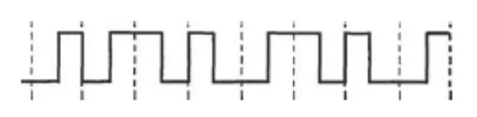

# 2013 408 真题 · 计算机网络

> 本科目共 9 题 / 25 分：单项选择题 8 题（16 分）+ 综合应用题 1 题（9 分）。

## 一、单项选择题

### 33. （2 分 · 计算机网络体系结构）

OSI 参考模型中，应用层的相邻下层实现的功能是（ ）

- **A.** 对话管理
- **B.** 数据格式转换
- **C.** 路由选择
- **D.** 可靠数据传输

**答案**：B

**解析**：答案 B。OSI 参考模型中应用层的相邻下层是表示层（第 6 层）。表示层实现与数据表示有关的功能：数据格式转换、字符集转换、文本压缩、数据加密解密等，故选数据格式转换。

> 难度 ⭐ ｜ 章节 计算机网络体系结构 ｜ 标签 计算机网络 / 计算机网络体系结构

---

### 34. （2 分 · 物理层）

若下图为 10BaseT 网卡接收到的信号波形，则该网卡收到的比特串是（ ）。

- **A.** 0011 0110
- **B.** 1010 1101
- **C.** 0101 0010
- **D.** 1100 0101

**答案**：A

**解析**：答案 A。10BaseT 采用曼彻斯特编码，每个码元中点必有电平跳变，前半低后半高表示 1、前半高后半低表示 0（按教材约定）。按各码元中点的跳变方向逐一解码，得到的比特串为 0011 0110。

> 难度 ⭐⭐⭐ ｜ 章节 物理层 ｜ 标签 计算机网络 / 物理层 / 编码 / 调制

---

### 35. （2 分 · 计算机网络体系结构）

主机甲通过 1 个路由器（存储转发方式）与主机乙互联，两段链路的数据传输速率均为 10Mbps，主机甲分别采用报文交换和分组大小为 10kb 的分组交换向主机乙发送 1 个大小为 8 Mb（1M = 10⁶ ）的报文。若忽略链路传播延迟、分组头开销和分组拆装时间，则两种交换方式完成该报文传输所需的总时间分别为（ ）。

- **A.** 800 ms、1600 ms
- **B.** 801 ms、1600 ms
- **C.** 1600 ms、800 ms
- **D.** 1600 ms、801 ms

**答案**：D

**解析**：答案 D。报文交换需收完整个报文再转发：8Mb/10Mbps=800ms 一段，两段链路共 1600ms。分组交换中每分组 10kb/10Mbps=1ms，共 800 个分组；源端发送 800ms，最后一个分组经路由器再转发 1ms，共 801ms。

> 难度 ⭐⭐⭐⭐ ｜ 章节 计算机网络体系结构 ｜ 标签 计算机网络 / 计算机网络体系结构 / 指令流水线 / 内存分配

---

### 36. （2 分 · 数据链路层）

下列介质访问控制方法中，可能发生冲突的是（ ）

- **A.** CDMA
- **B.** CSMA
- **C.** TDMA
- **D.** FDMA

**答案**：B

**解析**：答案 B。CDMA、TDMA、FDMA 都是信道划分协议，通过静态分配码片、时隙或频段避免冲突。CSMA 是随机访问协议，站点发送前虽侦听信道，但两个站点可能同时检测到信道空闲而发送，仍会发生冲突。

> 难度 ⭐⭐ ｜ 章节 数据链路层 ｜ 标签 计算机网络 / 数据链路层 / MAC / CSMA/CD / PPP

---

### 37. （2 分 · 数据链路层）

HDLC 协议采用零比特填充法，对数据 01111100 01111110 进行组帧后对应的比特串为（ ）

- **A.** 01111100 00111110 10
- **B.** 01111100 01111101 01111110
- **C.** 01111100 01111101 0
- **D.** 01111100 01111110 01111101

**答案**：A

**解析**：答案 A。HDLC 组帧时，数据中出现连续 5 个 1 就在其后插入一个 0（零比特填充）。原数据 01111100 01111110 中两处连续 5 个 1 后各插入一个 0，得 01111100 00111110 10。

> 难度 ⭐⭐⭐ ｜ 章节 数据链路层 ｜ 标签 计算机网络 / 数据链路层 / MAC / CSMA/CD / PPP

---

### 38. （2 分 · 数据链路层）

对于 100 Mbps 的以太网交换机，当输出端口无排队，以直通交换（cut-through switching）方式转发一个以太网帧（不包括前导码）时，引入的转发延迟至少是（ ）。

- **A.** 0 μs
- **B.** 0.48 μs
- **C.** 5.12 μs
- **D.** 121.44 μs

**答案**：B

**解析**：答案 B。直通交换在收到帧的目的地址后即开始转发，只需读取 6 字节的目的 MAC 地址。转发延迟 = 6×8 bit / 100Mbps = 0.48μs。

> 难度 ⭐⭐⭐ ｜ 章节 数据链路层 ｜ 标签 计算机网络 / 数据链路层 / MAC / CSMA/CD / PPP / 指令流水线 / 内存分配

---

### 39. （2 分 · 传输层）

主机甲与主机乙之间已建立一个 TCP 连接，双方持续有数据传输，且数据无差错与丢失。若甲收到 1 个来自乙的 TCP 段，该段的序号为 1913、确认序号为 2046、有效载荷为 100 字节，则甲立即发送给乙的 TCP 段的序号和确认序号分别是（ ）。

- **A.** 2046、2012
- **B.** 2046、2013
- **C.** 2047、2012
- **D.** 2047、2013

**答案**：B

**解析**：答案 B。乙发的段序号 1913、载荷 100 字节，覆盖 1913～2012，甲的确认序号应为 2013（期望的下一个字节）。乙的确认序号 2046 表示乙期望甲下一段从 2046 开始。故甲发回的段序号为 2046、确认序号为 2013。

> 难度 ⭐⭐⭐ ｜ 章节 传输层 ｜ 标签 计算机网络 / 传输层 / TCP / UDP / 拥塞控制

---

### 40. （2 分 · 应用层）

下列关于 SMTP 协议的叙述中，正确的是（ ）。

I. 只支持传输 7 比特 ASCII 码内容

II. 支持在邮件服务器之间发送邮件

III. 支持从用户代理向邮件服务器发送邮件

IV. 支持从邮件服务器向用户代理发送邮件

- **A.** 仅 I、II 和 III
- **B.** 仅 I、II 和 IV
- **C.** 仅 I、III 和 IV
- **D.** 仅 II、III 和 IV

**答案**：A

**解析**：答案 A。SMTP 只支持传输 7 位 ASCII 码内容（I 正确），用于用户代理向邮件服务器发送邮件（III 正确）以及邮件服务器之间传送邮件（II 正确）；邮件服务器向用户代理发送邮件是 POP3/IMAP 的功能（IV 错误）。

> 难度 ⭐⭐ ｜ 章节 应用层 ｜ 标签 计算机网络 / 应用层 / HTTP / DNS / FTP / SMTP

---

## 二、综合应用题

### 47. （9 分 · 网络层）

假设 Internet 的两个自治系统构成的网络如下图所示。自治系统 AS1 由路由器 R1 连接两个子网构成；自治系统 AS2 由路由器 R2、R3 互联并连接 3 个子网构成。各子网地址、R2 的接口名、R1 与 R3 的部分接口 IP 地址如图所示。

（1）假设路由表结构如下。请利用路由聚合技术，给出 R2 的路由表，要求包括到达题图中所有子网的路由，且路由表中的路由项尽可能少。

| 目的网络 | 下一跳 | 接口 |
| --- | --- | --- |

（2）若 R2 收到一个目的 IP 地址为 194.17.20.200 的 IP 分组，R2 会通过哪个接口转发该 IP 分组？

（3）R1 与 R2 之间利用哪个路由协议交换路由信息？该路由协议的报文被封装到哪个协议的分组中进行传输？

**答案 / 解析**：

答案：1、路由聚合：153.14.5.0/25 与 153.14.5.128/25 聚合为 153.14.5.0/24，下一跳 153.14.3.2，接口 S0；194.17.20.0/25 与 194.17.21.0/24 聚合为 194.17.20.0/23，下一跳 194.17.24.2，接口 S1；194.17.20.128/25 为直连子网，接口 E0。R2 路由表共 3 项。2、目的 IP 194.17.20.200 同时匹配 194.17.20.0/23 和 194.17.20.128/25 两条路由，按最长前缀匹配原则，经 E0 接口转发。3、R1 与 R2 分属不同自治系统，应使用边界网关协议 BGP（BGP4）交换路由信息；BGP 报文封装在 TCP 协议段中传输。

> 难度 ⭐⭐⭐ ｜ 章节 网络层 ｜ 标签 计算机网络 / 网络层 / IP / 路由 / 子网划分 / CIDR / 指令流水线 / 内存分配

---

## See Also

- [[408/真题精读/2013/数据结构]]
- [[408/真题精读/2013/计算机组成原理]]
- [[408/真题精读/2013/操作系统]]
- [[408/历年真题/2013]]
- [[408/真题精读/真题精读总目录]]
