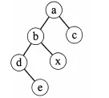
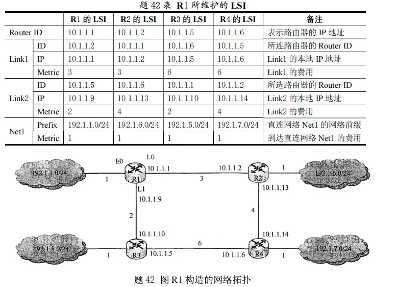

# 2014 408 真题 · 数据结构

> 本科目共 13 题 / 45 分：单项选择题 11 题（22 分）+ 综合应用题 2 题（23 分）。

## 一、单项选择题

### 1. （2 分 · 绪论）

下列程序段的时间复杂度是（ ）。

```c
count = 0;
for (k = 1; k <= n; k *= 2)
    for (j = 1; j <= n; j++)
        count++;
```

- **A.** O(log₂n)
- **B.** O(n)
- **C.** O(nlog₂n)
- **D.** O(n²)

**答案**：C

**解析**：答案 C。外层 k 每次乘 2，从 1 到 n 共执行约 log₂n 次；内层 j 与外层无关，每轮固定执行 n 次。嵌套循环按乘法规则，总执行次数约 n·log₂n，故时间复杂度为 O(nlog₂n)。

> 难度 ⭐⭐ ｜ 章节 绪论 ｜ 标签 数据结构 / 绪论

---

### 2. （2 分 · 栈、队列与数组）

假设栈初始为空，将中缀表达式 `a/b+(c*d-e*f)/g` 转换为等价的后缀表达式的过程中，当扫描到 `f` 时，栈中的元素依次是（ ）。

- **A.** +(*-
- **B.** +(-*
- **C.** /+(*-*
- **D.** /+-*

**答案**：B

**解析**：答案 B。扫描到 f 时，栈中自底向上为 +、(、-、*，即 +(-*。过程：/ 先入栈，遇 + 时被弹出；遇 ( 入栈，遇 * 入栈，遇 - 弹出栈顶 * 后 - 入栈，再遇 * 入栈。

> 难度 ⭐⭐⭐⭐ ｜ 章节 栈、队列与数组 ｜ 标签 数据结构 / 栈 / 队列 / 数组

---

### 3. （2 分 · 栈、队列与数组）

循环队列放在一维数组 A[ 0..M-1] 中，end1 指向队头元素，end2 指向队尾元素的后一个位置。假设队列两端均可进行入队和出队操作，队列中最多能容纳 M-1 个元素。初始时为空。下列判断队空和队满的条件中，正确的是( )。

- **A.** 队空：`end1 == end2`；队满：`end1 == (end2 + 1) mod M`
- **B.** 队空：`end1 == end2`；队满：`end2 == (end1 + 1) mod (M - 1)`
- **C.** 队空：`end1 == (end1 + 1) mod M`；队满：`end1 == (end2 + 1) mod M`
- **D.** 队空：`end1 == (end2 + 1) mod M`；队满：`end2 == (end1 + 1) mod (M - 1)`

**答案**：A

**解析**：答案 A。end1 指向队头、end2 指向队尾后一个位置，队空时二者相等：end1==end2。队满时最多容纳 M-1 个元素，end2 再前进一格即与 end1 相遇，条件为 end1==(end2+1) mod M。

> 难度 ⭐⭐⭐ ｜ 章节 栈、队列与数组 ｜ 标签 数据结构 / 栈 / 队列 / 数组

---

### 4. （2 分 · 树与二叉树）

若对如下的二叉树进行中序线索化，则结点 x 的左、右线索指向的结点分别是( )。



- **A.** e、c
- **B.** e、a
- **C.** b、c
- **D.** b、a

**答案**：D

**解析**：答案 D。中序线索化时，线索分别指向中序遍历序列中的前驱和后继结点。该二叉树的中序遍历序列为 debxac，x 的前驱是 b、后继是 a，故左、右线索分别指向 b、a。

> 难度 ⭐⭐⭐ ｜ 章节 树与二叉树 ｜ 标签 数据结构 / 树 / 二叉树 / 二叉树遍历 / 线索二叉树

---

### 5. （2 分 · 树与二叉树）

将森林 F 转换为对应的二叉树 T，F 中叶子的个数等于( )。

- **A.** T 中叶结点的个数
- **B.** T 中度为 1 的结点个数
- **C.** T 中左孩子指针为空的结点个数
- **D.** T 中右孩子指针为空的结点个数

**答案**：C

**解析**：答案 C。森林转二叉树采用孩子兄弟表示法：结点的第一个孩子成为左子树，兄弟成为右子树。叶结点没有孩子，转换后其左孩子指针必为空，故 F 中叶结点数等于 T 中左孩子指针为空的结点数。

> 难度 ⭐⭐⭐⭐ ｜ 章节 树与二叉树 ｜ 标签 数据结构 / 树 / 二叉树 / 二叉树遍历

---

### 6. （2 分 · 树与二叉树）

5 个字符有如下 4 种编码方案，不是前缀编码的是( )。

- **A.** 01, 0000, 0001, 001, 1
- **B.** 011, 000, 001, 010, 1
- **C.** 000, 001, 010, 011, 100
- **D.** 0, 100, 110, 1110, 1100

**答案**：D

**解析**：答案 D。前缀编码要求任一字符的编码都不是另一字符编码的前缀。D 中 110 是 1100 的前缀，违反该规则，故 D 不是前缀编码。

> 难度 ⭐⭐ ｜ 章节 树与二叉树 ｜ 标签 数据结构 / 树 / 二叉树 / 二叉树遍历 / 物理层

---

### 7. （2 分 · 图）

对如下所示的有向图进行拓扑排序，得到的拓扑序列可能是()


- **A.** 3,1,2,4,5,6
- **B.** 3,1,2,4,6,5
- **C.** 3,1,4,2,5,6
- **D.** 3,1,4,2,6,5

**答案**：D

**解析**：答案 D。按入度为 0 优先删点：先删 3，再删 1，再删 4，此后 2 和 6 入度均为 0，顺序可互换，得到 3,1,4,2,6,5 或 3,1,4,6,2,5。四个选项中只有 D 符合。

> 难度 ⭐⭐⭐ ｜ 章节 图 ｜ 标签 数据结构 / 图 / 最短路径 / 最小生成树 / 图算法

---

### 8. （2 分 · 查找）

用哈希(散列)方法处理冲突(碰撞)时可能出现堆积(聚集)现象，下列选项中，会受堆积现象直接影响的是()

- **A.** 存储效率
- **B.** 散列函数
- **C.** 装填(装载)因子
- **D.** 平均查找长度

**答案**：D

**解析**：答案 D。堆积使同义词之间产生冲突、查找路径变长，直接影响平均查找长度；它对存储效率、散列函数和装填因子均无影响。

> 难度 ⭐⭐⭐ ｜ 章节 查找 ｜ 标签 数据结构 / 查找 / 散列表 / B树

---

### 9. （2 分 · 查找）

在一棵具有 15 个关键字的 4 阶 B 树中，含关键字的结点个数最多是()

- **A.** 5
- **B.** 6
- **C.** 10
- **D.** 15

**答案**：D

**解析**：答案 D。结点数最多要求每个结点含最少的关键字：4 阶 B 树中非根结点最少 ⌈4/2⌉−1=1 个，根结点也最少 1 个。15 个关键字各占一个结点，最多可形成 15 个结点（可构造 4 层 4 阶 B 树，叶结点全在第 4 层）。

> 难度 ⭐⭐⭐ ｜ 章节 查找 ｜ 标签 数据结构 / 查找 / 散列表 / B树

---

### 10. （2 分 · 排序）

用希尔排序方法对一个数据序列进行排序时，若第 1 趟排序结果为 9,1,4,13,7,8,20,23,15，则该趟排序采用的增量(间隔)可能是()

- **A.** 2
- **B.** 3
- **C.** 4
- **D.** 5

**答案**：B

**解析**：答案 B。第 1 趟排序后各间隔子序列应分别有序。增量为 3 时，9,13,20、1,7,23、4,8,15 三组均递增，符合；增量为 2、4、5 时均出现组内逆序（如 9>4、9>7、9>8），排除。

> 难度 ⭐⭐⭐⭐ ｜ 章节 排序 ｜ 标签 数据结构 / 排序 / 内部排序 / 外部排序 / 排序算法

---

### 11. （2 分 · 排序）

下列选项中，不可能是快速排序第 2 趟排序结果的是（）。

- **A.** 2, 3, 5, 4, 6, 7, 9
- **B.** 2, 7, 5, 6, 4, 3, 9
- **C.** 3, 2, 5, 4, 7, 6, 9
- **D.** 4, 2, 3, 5, 7, 6, 9

**答案**：C

**解析**：答案 C。快排每趟至少使一个元素就位，第 2 趟结束时至少 3 个元素应位于最终位置（左边全小于它、右边全大于它）。C 中只有 7、9 两个元素就位，不足 3 个，故不可能是第 2 趟排序结果。

> 难度 ⭐⭐⭐⭐ ｜ 章节 排序 ｜ 标签 数据结构 / 排序 / 内部排序 / 外部排序 / 排序算法

---

## 二、综合应用题

### 41. （13 分 · 树与二叉树）

二叉树的带权路径长度（WPL）是二叉树中所有叶结点的带权路径长度之和。给定一棵二叉树 T，采用二叉链表存储，结点结构为：

```
+--------+--------+--------+
| left   | weight | right  |
+--------+--------+--------+
```

其中叶结点的 weight 域保存该结点的非负权值。设 root 为指向 T 的根结点的指针，请设计求 T 的 WPL 的算法。要求：

(1) 给出算法的基本设计思想。

(2) 使用 C 或 C++ 语言，给出二叉树结点的数据类型定义。

(3) 根据设计思想，采用 C 或 C++ 语言描述算法，关键之处给出注释。

**答案 / 解析**：

答案：1、基本设计思想：采用先序递归遍历，把结点深度作为参数逐层传递；遇到叶结点时累加 weight×depth（根深度为 0），内部结点则递归左右子树并将深度加 1。2、结点数据类型定义：

```c
typedef struct BiTNode {
    int weight;                     // 叶结点的非负权值
    struct BiTNode *lchild, *rchild;
} BiTNode, *BiTree;
```

3、算法描述（递归求 WPL，关键处已注释）：

```c
int WPL(BiTree root, int depth) {
    if (root == NULL) return 0;
    if (root->lchild == NULL && root->rchild == NULL)
        return depth * root->weight;   // 叶结点：权值×深度
    return WPL(root->lchild, depth + 1) +
           WPL(root->rchild, depth + 1);
}
```

调用 WPL(root, 0) 即得结果。时间复杂度 O(n)，空间复杂度 O(树高)。

> 难度 ⭐⭐⭐⭐ ｜ 章节 树与二叉树 ｜ 标签 数据结构 / 树 / 二叉树 / 二叉树遍历 / 链表

---

### 42. （10 分 · 图）

某网络中的路由器运行 OSPF 路由协议，下表是路由器 R1 维护的主要链路状态信息（LSI），下图是根据该表的接口名构造出来的网络拓扑。



请回答下列问题：

(1) 本题中的网络可抽象为数据结构中的哪种结构？

(2) 针对上表中的内容，设计合理的链式存储结构，以保存表中的链路状态信息（LSI）。要求给出链式存储结构的数据定义，并画出对应表的链式存储结构示意图（示意图中仅以 ID 标识结点）。

(3) 按照迪杰斯特拉（Dijkstra）算法的策略，依次给出 R1 到达图中子网 192.1.x.x 的最短路径及费用。

**答案 / 解析**：

答案：1、该网络拓扑可抽象为图（无向图）：4 个路由器作为顶点，路由器之间及路由器与子网的连接作为边。2、采用邻接表形式的链式存储：设 8 个表头结点（R1～R4 及 4 个子网 192.1.1.0/24、192.1.5.0/24、192.1.6.0/24、192.1.7.0/24），每个表头结点挂一条边表链，边表结点记录邻接对象 ID 与代价 metric。数据定义如下：

```c
// 表头结点：路由器或子网
typedef struct HNode {
    int id;                  // 路由器 ID 或子网号
    struct ArcNode *first;   // 指向第一条边
    struct HNode *next;      // 指向下一个表头结点
} HNode;
// 边表结点
typedef struct ArcNode {
    int flag;                // 1：连到路由器；2：连到子网
    int id;                  // 对端路由器 ID 或子网号
    int metric;              // 链路代价
    struct ArcNode *next;
} ArcNode;
```

示意图：每个表头结点（仅以 ID 标识）引出一条边表链，如 R1 的边表依次链接 R2、R3、192.1.1.0/24 等边表结点，各边表结点按 next 指针串联。3、按 Dijkstra 算法，R1 到各子网的最短路径及费用为：192.1.1.0/24 直接到达，费用 1；192.1.5.0/24 经 R1→R3→192.1.5.0/24，费用 3；192.1.6.0/24 经 R1→R2→192.1.6.0/24，费用 4；192.1.7.0/24 经 R1→R2→R4→192.1.7.0/24，费用 8。

> 难度 ⭐⭐⭐⭐ ｜ 章节 图 ｜ 标签 数据结构 / 图 / 最短路径 / 最小生成树 / 网络层

---

## See Also

- [[408/真题精读/2014/计算机组成原理]]
- [[408/真题精读/2014/操作系统]]
- [[408/真题精读/2014/计算机网络]]
- [[408/历年真题/2014]]
- [[408/真题精读/真题精读总目录]]
