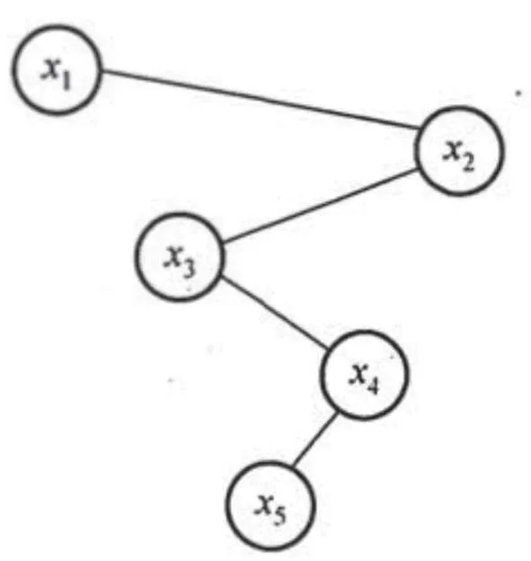
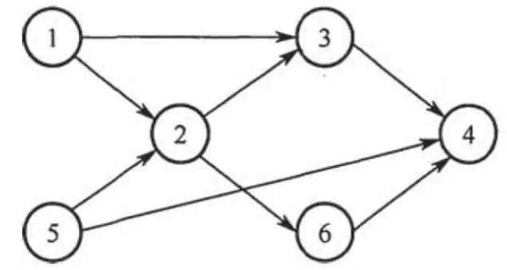

# 2018 408 真题 · 数据结构

> 本科目共 13 题 / 47 分：单项选择题 11 题（22 分）+ 综合应用题 2 题（25 分）。

## 一、单项选择题

### 1. （2 分 · 栈、队列与数组）

若栈 S1 中保存整数，栈 S2 中保存运算符，函数 F() 依次执行下述各步操作： 

1、从 S1 中依次弹出两个操作数 a 和 b;

2、从 S2 中弹出一个运算符 op;

3、执行相应的运算 b op a;

4、将运算结果压入 S1 。

假定 S1 中的操作数依次是 5,8,3,2（2 在栈顶），S2 中的运算符依次是 ×,−,+ （ + 在栈顶）。调用 3 次 F() 后，S1 栈顶保存的值是（ ）。

- **A.** -15
- **B.** 15
- **C.** -20
- **D.** 20

**答案**：B

**解析**：答案 B。三次调用：先弹 a=2、b=3 与运算符 +，得 3+2=5 压回；再弹 a=5、b=8 与 −，得 8−5=3；最后弹 a=3、b=5 与 ×，得 5×3=15 压回，S1 栈顶即 15。

> 难度 ⭐⭐⭐ ｜ 章节 栈、队列与数组 ｜ 标签 数据结构 / 栈 / 队列 / 数组

---

### 2. （2 分 · 栈、队列与数组）

现有队列 Q 与栈 S，初始时 Q 中的元素依次是 1,2,3,4,5,6（1 在队头），S 为空。若仅允许下列 3 种操作：

① 出队并输出出队元素；
② 出队并将出队元素入栈；
③ 出栈并输出出栈元素，

则不能得到的输出序列是( )。

- **A.** 1，2，5，6，4，3
- **B.** 2，3，4，5，6，1
- **C.** 3，4，5，6，1，2
- **D.** 6，5，4，3，2，1

**答案**：C

**解析**：答案 C。A、B、D 均可由①、②、③组合实现。C 要求先输出 3，则 1、2 必须先依次入栈，而栈后进先出，2 必先于 1 出栈，得不到 …1,2 的顺序。

> 难度 ⭐⭐⭐ ｜ 章节 栈、队列与数组 ｜ 标签 数据结构 / 栈 / 队列 / 数组

---

### 3. （2 分 · 栈、队列与数组）

设有一个12×12的对称矩阵M，将其上三角部分的元素mi,j(1≤i≤j≤ 12)按行优先存入 C 语言的一维数组N中，元素m6,6在N中的下标是( )。

- **A.** 50
- **B.** 51
- **C.** 55
- **D.** 66

**答案**：A

**解析**：答案 A。上三角按行优先存储，第 i 行有 12−i+1 个元素。前 5 行共 12+11+10+9+8=50 个，m₆,₆ 是第 6 行第一个元素，为数组中第 51 个元素；C 语言下标从 0 起，故下标为 50。

> 难度 ⭐⭐⭐ ｜ 章节 栈、队列与数组 ｜ 标签 数据结构 / 栈 / 队列 / 数组 / 特殊矩阵

---

### 4. （2 分 · 树与二叉树）

设一棵非空完全二叉树 T 的所有叶结点均位于同一层，且每个非叶结点都有 2 个子结点。若 T 有 k 个叶结点，则 T 的结点总数是( )。

- **A.** $2k-1$
- **B.** $2k$
- **C.** $k^2$
- **D.** $2^{k-1}$

**答案**：A

**解析**：答案 A。所有叶结点同层且非叶结点均有 2 个孩子，即为满二叉树。设树高 h，叶结点数 k=2ʰ⁻¹，总结点数 2ʰ−1=2k−1。

> 难度 ⭐⭐ ｜ 章节 树与二叉树 ｜ 标签 数据结构 / 树 / 二叉树 / 二叉树遍历

---

### 5. （2 分 · 树与二叉树）

已知字符集{a, b, c, d, e, f}，若各字符出现的次数分别为 6, 3, 8, 2, 10, 4，则对应字符集中各字符的哈夫曼编码可能是( )。

- **A.** 00, 1011, 01, 1010, 11, 100
- **B.** 00, 100, 110, 000, 0010, 01
- **C.** 10, 1011, 11, 0011, 00, 010
- **D.** 0011, 10, 11, 0010, 01, 000

**答案**：A

**解析**：答案 A。哈夫曼编码必为前缀码，B 中 00 是 000 的前缀、C 中 10 是 1011 的前缀，均排除。A 的带权路径长度 6×2+3×4+8×2+2×4+10×2+4×3=80，等于最小 WPL，故选 A。

> 难度 ⭐⭐⭐⭐ ｜ 章节 树与二叉树 ｜ 标签 数据结构 / 树 / 二叉树 / 二叉树遍历 / 哈夫曼树 / 物理层

---

### 6. （2 分 · 查找）

已知二叉排序树如下图所示，元素之间应满足的大小关系是（ ）。



- **A.** x 1<x 2<x 3
- **B.** x 1<x 4<x 5
- **C.** x 3<x 5<x 4
- **D.** x 4<x 3<x 5

**答案**：C

**解析**：答案 C。二叉排序树中序遍历序列递增，图中序遍历为 x1、x3、x5、x4、x2，故 x3<x5<x4，选 C。

> 难度 ⭐⭐⭐ ｜ 章节 查找 ｜ 标签 数据结构 / 查找 / 散列表 / B树 / 二叉排序树

---

### 7. （2 分 · 图）

下列选项中，不是如下有向图的拓扑序列的是（ ）



- **A.** 1, 5, 2, 3, 6, 4
- **B.** 5, 1, 2, 6, 3, 4
- **C.** 5, 1, 2, 3, 6, 4
- **D.** 5, 2, 1, 6, 3, 4

**答案**：D

**解析**：答案 D。拓扑序列中任一结点的前驱必须排在它之前；图中有边 1→2，故 1 必须先于 2 出现，D 中 2 排在 1 前，不是拓扑序列。

> 难度 ⭐⭐⭐ ｜ 章节 图 ｜ 标签 数据结构 / 图 / 最短路径 / 最小生成树

---

### 8. （2 分 · 查找）

高度为 5 的 3 阶 B 树含有的关键字个数至少是( )

- **A.** 15
- **B.** 31
- **C.** 62
- **D.** 242

**答案**：B

**解析**：答案 B。3 阶 B 树非根非叶结点最少有 ⌈3/2⌉−1=1 个关键字、2 个孩子，根至少 1 个关键字。高度 5 时结点数最少为 1+2+4+8+16=31，每结点 1 个关键字，故关键字最少 31 个。

> 难度 ⭐⭐⭐⭐ ｜ 章节 查找 ｜ 标签 数据结构 / 查找 / 散列表 / B树

---

### 9. （2 分 · 查找）

现有长度为 7、初始为空的散列表 HT，散列函数 H(k) = k % 7，用线性探测再散列法解决冲突。将关键字 22, 43, 15 依次插人到 HT 后，查找成功的平均查找长度是( )

- **A.** 1.5
- **B.** 1.6
- **C.** 2
- **D.** 3

**答案**：C

**解析**：答案 C。22、43、15 的散列地址均为 1，线性探测后依次放入下标 1、2、3，查找成功比较次数分别为 1、2、3，平均查找长度 (1+2+3)/3=2。

> 难度 ⭐⭐⭐ ｜ 章节 查找 ｜ 标签 数据结构 / 查找 / 散列表 / B树

---

### 10. （2 分 · 排序）

对初始数据序列 (8, 3, 9, 11, 2, 1, 4, 7, 5, 10, 6) 进行希尔排序。若第一趟排序结果为 (1, 3, 7, 5, 2, 6, 4, 9, 11, 10, 8)，第二趟排序结果为 (1, 2, 6, 4, 3, 7, 5, 8, 11, 10, 9)，则两趟排序采用的增量(间隔)依次是( )。

- **A.** 3,1
- **B.** 3,2
- **C.** 5,2
- **D.** 5,3

**答案**：D

**解析**：答案 D。希尔排序按增量分组、组内插入排序后各组有序：第一趟结果沿间隔 5 分组有序，第二趟沿间隔 3 分组有序，故增量依次为 5、3。

> 难度 ⭐⭐⭐⭐ ｜ 章节 排序 ｜ 标签 数据结构 / 排序 / 内部排序 / 外部排序 / 排序算法

---

### 11. （2 分 · 排序）

在将数据序列 (6, 1, 5, 9, 8, 4, 7) 建成大根堆时，正确的序列变化过程是（）。

- **A.** 6, 1, 7, 9, 8, 4, 5 → 6, 9, 7, 1, 8, 4, 5 → 9, 6, 7, 1, 8, 4, 5 → 9, 8, 7, 1, 6, 4, 5
- **B.** 6, 9, 5, 1, 8, 4, 7 → 6, 9, 7, 1, 8, 4, 5 → 9, 6, 7, 1, 8, 4, 5 → 9, 8, 7, 1, 6, 4, 5
- **C.** 6, 9, 5, 1, 8, 4, 7 → 9, 6, 5, 1, 8, 4, 7 → 9, 6, 7, 1, 8, 4, 5 → 9, 8, 7, 1, 6, 4, 5
- **D.** 6, 1, 7, 9, 8, 4, 5 → 7, 1, 6, 9, 8, 4, 5 → 7, 9, 6, 1, 8, 4, 5 → 9, 7, 6, 1, 8, 4, 5 → 9, 8, 6, 1, 7, 4, 5

**答案**：A

**解析**：答案 A。建堆从最后一个非叶结点（下标 3，值 5）向前逐个向下调整：5 与 7 交换，1 与 9 交换，6 先与 9 换、再与 8 换，序列变化恰为 A 的四帧。

> 难度 ⭐⭐⭐⭐ ｜ 章节 排序 ｜ 标签 数据结构 / 排序 / 内部排序 / 外部排序

---

## 二、综合应用题

### 41. （13 分 · 线性表）

给定一个含 n（n ≥ 1）个整数的数组，请设计一个在时间上尽可能高效的算法，找出数组中未出现的最小正整数。例如，数组 {-5, 3, 2, 3} 中未出现的最小正整数是 1；数组 {1, 2, 3} 中未出现的最小正整数是 4。要求：

(1) 给出算法的基本设计思想。

(2) 根据设计思想，采用 C 或 C++ 语言描述算法，关键之处给出注释。

(3) 说明你所设计算法的时间复杂度和空间复杂度。

**答案 / 解析**：

答案：1、基本设计思想：用空间换时间。开辟长度为 n 的标记数组 vis，记录 1～n 中哪些正整数已在 A 中出现。因 A 只有 n 个数，未出现的最小正整数必在 1～n+1 之间。第一遍扫描 A，若 A[i]∈[1,n] 则置 vis[A[i]−1]=1；第二遍从下标 0 起找第一个 vis 为 0 的位置，返回 i+1；若 1～n 全部出现则返回 n+1。2、核心代码：

```c
int findMissMin(int A[], int n) {
    int vis[n], i;
    for (i = 0; i < n; i++) vis[i] = 0;
    for (i = 0; i < n; i++)
        if (A[i] >= 1 && A[i] <= n) vis[A[i] - 1] = 1;
    for (i = 0; i < n; i++)
        if (vis[i] == 0) return i + 1;
    return n + 1;
}
```
3、时间复杂度 O(n)，空间复杂度 O(n)。

> 难度 ⭐⭐⭐⭐ ｜ 章节 线性表 ｜ 标签 数据结构 / 线性表 / 顺序表 / 链表

---

### 42. （12 分 · 图）

拟建设一个光通信骨干网络连通 BJ、CS、XA、QD、JN、NJ、TL 和 WH 等 8 个城市，题 42 图中无向边上的权值表示两个城市间备选光缆的铺设费用。


请回答下列问题：

(1) 仅从铺设费用角度出发，给出所有可能的最经济的光缆铺设方案（用带权图表示），并计算相应方案的总费用。

(2) 题 42 图可采用图的哪一种存储结构？给出求解问题 (1) 所使用的算法名称。

(3) 假设每个城市采用一个路由器按 (1) 中得到的最经济方案组网，主机 H1 直接连接在 TL 的路由器上，主机 H2 直接连接在 BJ 的路由器上。若 H1 向 H2 发送一个 TTL = 5 的 IP 分组，则 H2 是否可以收到该 IP 分组？

**答案 / 解析**：

答案：1、最经济方案即求图的最小生成树，共有两种，总费用均为 16：方案一含边 XA-BJ、XA-WH、TL-JN、QD-JN、QD-NJ、BJ-TL、CS-QD；方案二将 BJ-TL 换为 WH-QD，其余相同。其中权为 2 的 5 条边必选，CS-QD 必选，BJ-TL 与 WH-QD 二选一。2、存储结构可用邻接矩阵或邻接表（8 顶点 12 边为稀疏图，邻接表更省空间）；求最小生成树用 Prim 或 Kruskal 算法。3、若采用含 BJ-TL 直连的方案，H1 到 H2 只经过 TL、BJ 两个路由器，TTL=5 足够，H2 能收到；若采用不含 BJ-TL 的方案，路径为 TL→JN→QD→WH→XA→BJ，需经 6 个路由器，TTL 减至 0 时分组被丢弃，H2 收不到。

> 难度 ⭐⭐⭐⭐ ｜ 章节 图 ｜ 标签 数据结构 / 图 / 最短路径 / 最小生成树 / 网络层

---

## See Also

- [[408/真题精读/2018/计算机组成原理]]
- [[408/真题精读/2018/操作系统]]
- [[408/真题精读/2018/计算机网络]]
- [[408/历年真题/2018]]
- [[408/真题精读/真题精读总目录]]
