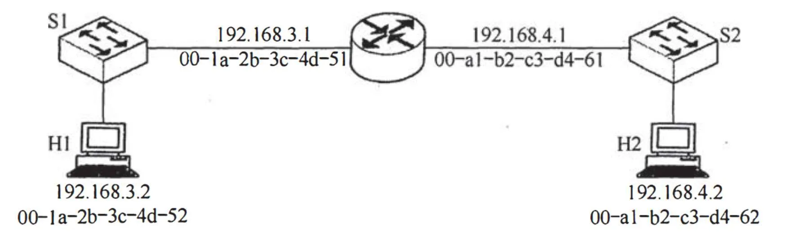

# 2018 408 真题 · 计算机网络

> 本科目共 9 题 / 23 分：单项选择题 8 题（16 分）+ 综合应用题 1 题（7 分）。

## 一、单项选择题

### 33. （2 分 · 应用层）

下列 TCP/IP 应用层协议中，可以使用传输层无连接服务的是（ ）。

- **A.** FTP
- **B.** DNS
- **C.** SMTP
- **D.** HTTP

**答案**：B

**解析**：答案 B。FTP、SMTP、HTTP 对可靠性要求高，使用面向连接的 TCP；DNS 查询报文短小且可超时重发，使用无连接的 UDP。

> 难度 ⭐⭐ ｜ 章节 应用层 ｜ 标签 计算机网络 / 应用层 / HTTP / DNS / FTP / SMTP / 传输层 / 网络层

---

### 34. （2 分 · 物理层）

下列选项中，不属于物理层接口规范定义范畴的是（ ）。

- **A.** 接口形状
- **B.** 引脚功能
- **C.** 物理地址
- **D.** 信号电平

**答案**：C

**解析**：答案 C。物理层接口规范含机械（接口形状）、电气（信号电平）、功能（引脚功能）、规程四特性；物理地址即 MAC 地址，属于数据链路层。

> 难度 ⭐⭐ ｜ 章节 物理层 ｜ 标签 计算机网络 / 物理层 / 编码 / 调制

---

### 35. （2 分 · 数据链路层）

IEEE 802.11 无线局域网的 MAC 协议 CSMA/CA 进行信道预约的方法是（ ）。

- **A.** 发送确认帧
- **B.** 采用二进制指数退避
- **C.** 使用多个 MAC 地址
- **D.** 交换 RTS 与 CTS 帧

**答案**：D

**解析**：答案 D。CSMA/CA 通过交换 RTS 与 CTS 帧预约信道；确认帧用于可靠传输，二进制指数退避用于冲突后退避，都不是信道预约方法。

> 难度 ⭐⭐ ｜ 章节 数据链路层 ｜ 标签 计算机网络 / 数据链路层 / MAC / CSMA/CD / PPP

---

### 36. （2 分 · 数据链路层）

主机甲采用停-等协议向主机乙发送数据，数据传输速率是 3 kbps，单向传播延时是 200 ms，忽略确认帧的传输延时。当信道利用率等于 40% 时，数据帧的长度为（ ）。

- **A.** 240 比特
- **B.** 400 比特
- **C.** 480 比特
- **D.** 800 比特

**答案**：D

**解析**：答案 D。停等协议利用率 U=(x/R)/(x/R+2τ)，代入 R=3000bit/s、τ=200ms、U=0.4，解得 x=800 比特。

> 难度 ⭐⭐⭐ ｜ 章节 数据链路层 ｜ 标签 计算机网络 / 数据链路层 / MAC / CSMA/CD / PPP

---

### 37. （2 分 · 数据链路层）

路由器 R 通过以太网交换机 S1 和 S2 连接两个网络，R 的接口、主机 H1 和 H2 的 IP 地址与 MAC 地址如下图所示。若 H1 向 H2 发送一个 IP 分组 P，则 H1 发出的封装 P 的以太网帧的目的 MAC 地址、H2 收到的封装 P 的以太网帧的源 MAC 地址分别是（ ）。

- **A.** 00-a1-b2-c3-d4-62、00-1a-2b-3c-4d-52
- **B.** 00-a1-b2-c3-d4-62、00-a1-b2-c3-d4-61
- **C.** 00-1a-2b-3c-4d-51、00-1a-2b-3c-4d-52
- **D.** 00-1a-2b-3c-4d-51、00-a1-b2-c3-d4-61

**答案**：D

**解析**：答案 D。H1 与 H2 不在同一子网，帧先发往默认网关，H1 发出帧的目的 MAC 为路由器 R 左口 00-1a-2b-3c-4d-51；R 转发时重写帧头，H2 收到帧的源 MAC 为 R 右口 00-a1-b2-c3-d4-61。

> 难度 ⭐⭐⭐ ｜ 章节 数据链路层 ｜ 标签 计算机网络 / 数据链路层 / MAC / CSMA/CD / PPP / 内存分配 / 网络层

---

### 38. （2 分 · 网络层）

某路由表中有转发接口相同的 4 条路由表项，其目的网络地址分别是 35.230.32.0/21、35.230.40.0/21、35.230.48.0/21 和 35.230.56.0/21，将该 4 条路由聚合后的目的网络地址为（ ）。

- **A.** 35.230.0.0/19
- **B.** 35.230.0.0/20
- **C.** 35.230.32.0/19
- **D.** 35.230.32.0/20

**答案**：C

**解析**：答案 C。四个 /21 的第三字节 32、40、48、56 前 3 位相同（001），最长公共前缀 16+3=19 位，第三字节其余位清零得 32，故聚合为 35.230.32.0/19。

> 难度 ⭐⭐⭐ ｜ 章节 网络层 ｜ 标签 计算机网络 / 网络层 / IP / 路由 / 子网划分 / CIDR / 指令流水线

---

### 39. （2 分 · 传输层）

UDP 协议实现分用（demultiplexing）时所依据的头部字段是（ ）。

- **A.** 源端口号
- **B.** 目的端口号
- **C.** 长度
- **D.** 校验和

**答案**：B

**解析**：答案 B。分用是接收方传输层依据报文段首部的目的端口号，把数据正确交付给本机对应进程。

> 难度 ⭐⭐ ｜ 章节 传输层 ｜ 标签 计算机网络 / 传输层 / TCP / UDP / 拥塞控制

---

### 40. （2 分 · 应用层）

无需转换即可由 SMTP 协议直接传输的内容是（ ）。

- **A.** JPEG 图形
- **B.** MPEG 视频
- **C.** EXE 文件
- **D.** ASCII 文本

**答案**：D

**解析**：答案 D。SMTP 只允许传输 7 位 ASCII 内容，JPEG、MPEG、EXE 等二进制文件需经 MIME 编码（如 Base64）后才能传输，ASCII 文本无需转换。

> 难度 ⭐⭐ ｜ 章节 应用层 ｜ 标签 计算机网络 / 应用层 / HTTP / DNS / FTP / SMTP

---

## 二、综合应用题

### 47. （7 分 · 网络层）

某公司网络如题 47 图所示。IP 地址空间 192.168.1.0/24 被均分给销售部和技术部两个子网，并已分别为部分主机和路由器接口分配了 IP 地址，销售部子网的 MTU = 1500 B，技术部子网的 MTU = 800 B。

请回答下列问题。

(1) 销售部子网的广播地址是什么？技术部子网的子网地址是什么？若每个主机仅分配一个 IP 地址，则技术部子网还可以连接多少台主机？

(2) 假设主机 192.168.1.1 向主机 192.168.1.208 发送一个总长度为 1500 B 的 IP 分组，IP 分组的头部长度为 20 B，路由器在通过接口 F1 转发该 IP 分组时进行了分片。若分片时尽可能分为最大片，则一个最大 IP 分片封装数据的字节数是多少？至少需要分为几个分片？每个分片的片偏移量是多少？

**答案 / 解析**：

答案：1、192.168.1.0/24 均分为两个 /25：销售部为 192.168.1.0/25，广播地址 192.168.1.127；技术部为 192.168.1.128/25，子网地址即 192.168.1.128。技术部可分配主机 2⁷−2=126 台，已分配给主机 192.168.1.129～208 共 80 个，路由器接口 192.168.1.254 占 1 个，还可连接 126−80−1=45 台。2、技术部 MTU=800B、IP 头 20B，最大分片数据为 ⌊(800−20)/8⌋×8=776B；原分组数据 1500−20=1480B，需 ⌈1480/776⌉=2 个分片；第 1 片偏移 0，第 2 片偏移 776/8=97。

> 难度 ⭐⭐⭐ ｜ 章节 网络层 ｜ 标签 计算机网络 / 网络层 / IP / 路由 / 子网划分 / CIDR / 指令流水线

---

## See Also

- [[408/真题精读/2018/数据结构]]
- [[408/真题精读/2018/计算机组成原理]]
- [[408/真题精读/2018/操作系统]]
- [[408/历年真题/2018]]
- [[408/真题精读/真题精读总目录]]
