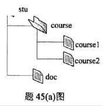
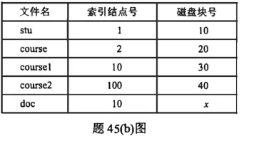

# 2022 408 真题 · 操作系统

> 本科目共 12 题 / 35 分：单项选择题 10 题（20 分）+ 综合应用题 2 题（15 分）。

## 一、单项选择题

### 23. （2 分 · 计算机系统概述）

下列关于多道程序系统的叙述中，不正确的是（ ）。

- **A.** 支持进程的并发执行
- **B.** 不必支持虚拟存储管理
- **C.** 需要实现对共享资源的管理
- **D.** 进程数越多 CPU 利用率越高

**答案**：D

**解析**：答案 D。并发与共享是多道程序系统的基本特征，A、C 正确；不采用虚拟存储也能实现多道并发，B 正确。进程过多会使资源竞争加剧甚至死锁，CPU 利用率不一定随进程数增加而提高，D 错。

> 难度 ⭐⭐ ｜ 章节 计算机系统概述 ｜ 标签 操作系统 / 计算机系统概述

---

### 24. （2 分 · 计算机系统概述）

下列选项中，需要在操作系统进行初始化过程中创建的是（ ）。

- **A.** 中断向量表
- **B.** 文件系统的根目录
- **C.** 硬盘分区表
- **D.** 文件系统的索引节点表

**答案**：A

**解析**：答案 A。中断向量表存放中断服务程序入口地址，必须在 OS 初始化时建立。文件系统根目录、硬盘分区表、索引节点表分别于格式化、分区、文件系统创建时生成，不属于 OS 初始化内容。

> 难度 ⭐⭐ ｜ 章节 计算机系统概述 ｜ 标签 操作系统 / 计算机系统概述

---

### 25. （2 分 · 进程与线程）

进程 P0、P1、P2 和 P3 进入就绪队列的时刻、优先级（值越小优先权越高）及 CPU 执行时间如下表所示。

| 进程 | 进入就绪队列的时刻 | 优先级 | CPU 执行时间 |
| --- | --- | --- | --- |
| P0 | 0 ms | 15 | 100 ms |
| P1 | 10 ms | 20 | 60 ms |
| P2 | 10 ms | 10 | 20 ms |
| P3 | 15 ms | 6 | 10 ms |

若系统采用基于优先权的抢占式进程调度算法，则从 0ms 时刻开始调度，到 4 个进程都运行结束为止，发生进程调度的总次数为（ ）。

- **A.** 4
- **B.** 5
- **C.** 6
- **D.** 7

**答案**：C

**解析**：答案 C。0ms 调度 P0，10ms P2 抢占，15ms P3 抢占，25ms P3 结束调度 P2，40ms P2 结束调度 P0，130ms P0 结束调度 P1，190ms P1 结束，共调度 6 次。

> 难度 ⭐⭐⭐ ｜ 章节 进程与线程 ｜ 标签 操作系统 / 进程管理 / 进程 / 线程 / 同步 / PV操作 / 队列 / 进程调度

---

### 26. （2 分 · 进程与线程）

系统中有三个进程 P0、P1、P2 及三类资源 A、B、C。若某时刻系统分配资源的情况如下表所示，则此时系统中存在的安全序列的个数为（ ）。

| 进程 | 已分配 A | 已分配 B | 已分配 C | 尚需 A | 尚需 B | 尚需 C |
| --- | ---: | ---: | ---: | ---: | ---: | ---: |
| P0 | 2 | 0 | 1 | 0 | 2 | 1 |
| P1 | 0 | 2 | 0 | 1 | 2 | 3 |
| P2 | 1 | 0 | 1 | 0 | 1 | 3 |

当前可用资源 Available = (1, 3, 2)。

- **A.** 1
- **B.** 2
- **C.** 3
- **D.** 4

**答案**：B

**解析**：答案 B。可用资源 (1,3,2) 只能满足 P0 需求 (0,2,1)，故 P0 必在最前；P0 完成后 Work=(3,3,3)，P1、P2 均可执行，安全序列为 P0→P1→P2 和 P0→P2→P1，共 2 个。

> 难度 ⭐⭐⭐ ｜ 章节 进程与线程 ｜ 标签 操作系统 / 进程管理 / 进程 / 线程 / 同步 / PV操作

---

### 27. （2 分 · 计算机系统概述）

下列关于 CPU 模式的叙述中，正确的是（ ）。

- **A.** CPU 处于用户态时只能执行特权指令
- **B.** CPU 处于内核态时只能执行特权指令
- **C.** CPU 处于用户态时只能执行非特权指令
- **D.** CPU 处于内核态时只能执行非特权指令

**答案**：C

**解析**：答案 C。用户态只能执行非特权指令；内核态可执行特权指令和非特权指令，A、B、D 的「只能」限定均不成立。

> 难度 ⭐⭐ ｜ 章节 计算机系统概述 ｜ 标签 操作系统 / 计算机系统概述

---

### 28. （2 分 · 进程与线程）

下列事件或操作中，可能导致进程 P 由执行态变为阻塞态的是（ ）。

Ⅰ. 进程 P 读文件
Ⅱ. 进程 P 的时间片用完
Ⅲ. 进程 P 申请外设
Ⅳ. 进程 P 执行信号量的 wait() 操作

- **A.** 仅Ⅰ、Ⅳ
- **B.** 仅Ⅱ、Ⅲ
- **C.** 仅Ⅲ、Ⅳ
- **D.** 仅Ⅰ、Ⅲ、Ⅳ

**答案**：D

**解析**：答案 D。读文件要等待磁盘 I/O 完成，申请外设可能因设备被占而等待，wait() 使信号量减 1 为负时阻塞，三者都会使进程进入阻塞态；时间片用完只转入就绪态，故为 Ⅰ、Ⅲ、Ⅳ。

> 难度 ⭐⭐ ｜ 章节 进程与线程 ｜ 标签 操作系统 / 进程管理 / 进程 / 线程 / 同步 / PV操作 / 同步与互斥 / 文件系统

---

### 29. （2 分 · 内存管理）

某进程访问的页 b 不在内存中，导致产生缺页异常，该缺页异常处理过程中不一定包含的操作是（ ）。

- **A.** 淘汰内存中的页
- **B.** 建立页号与页框号的对应关系
- **C.** 将页 b 从外存读入内存
- **D.** 修改页表中页 b 对应的存在位

**答案**：A

**解析**：答案 A。缺页处理须将页 b 从外存读入、建立页号与页框号对应、修改存在位，B、C、D 必做；仅当内存无空闲页框时才需淘汰页面，A 不一定发生。

> 难度 ⭐⭐⭐ ｜ 章节 内存管理 ｜ 标签 操作系统 / 内存管理 / 分页 / 分段 / 虚拟内存 / 页面置换

---

### 30. （2 分 · 内存管理）

下列选项中，不会影响系统缺页率的是（ ）。

- **A.** 页面置换算法
- **B.** 工作集的大小
- **C.** 进程的数量
- **D.** 页缓冲队列的长度

**答案**：D

**解析**：答案 D。置换算法、工作集大小、进程数量都影响缺页发生的次数；页缓冲队列只加快缺页后的处理速度，不改变缺页次数，故不影响缺页率。

> 难度 ⭐⭐⭐⭐ ｜ 章节 内存管理 ｜ 标签 操作系统 / 内存管理 / 分页 / 分段 / 虚拟内存 / 页面置换

---

### 31. （2 分 · 计算机系统概述）

执行系统调用的过程涉及下列操作，其中由操作系统完成的是（ ）。

Ⅰ. 保存断点和程序状态字
Ⅱ. 保存通用寄存器的内容
Ⅲ. 执行系统调用服务程序
Ⅳ. 将 CPU 模式改为内核态

- **A.** 仅Ⅰ、Ⅲ
- **B.** 仅Ⅱ、Ⅲ
- **C.** 仅Ⅱ、Ⅳ
- **D.** 仅Ⅱ、Ⅲ、Ⅳ

**答案**：B

**解析**：答案 B。保存断点和程序状态字、将 CPU 模式改为内核态由硬件自动完成；保存通用寄存器、执行系统调用服务程序由操作系统完成，故选 Ⅱ、Ⅲ。

> 难度 ⭐⭐⭐ ｜ 章节 计算机系统概述 ｜ 标签 操作系统 / 计算机系统概述

---

### 32. （2 分 · 输入输出管理）

下列关于驱动程序的叙述中，不正确的是（ ）。

- **A.** 驱动程序与 I/O 控制方式无关
- **B.** 初始化设备是由驱动程序控制完成的
- **C.** 进程在执行驱动程序时可能进入阻塞态
- **D.** 读/写设备的操作是由驱动程序控制完成的

**答案**：A

**解析**：答案 A。驱动程序须针对具体 I/O 控制方式编写，轮询、中断、DMA 的驱动各不相同，并非与 I/O 控制方式无关，A 错；初始化设备、读写设备均由驱动程序控制，执行驱动时可能因设备忙而阻塞，B、C、D 正确。

> 难度 ⭐⭐⭐ ｜ 章节 输入输出管理 ｜ 标签 操作系统 / I/O系统 / 中断 / DMA

---

## 二、综合应用题

### 45. （7 分 · 文件管理）

某文件系统的磁盘块大小为 4 KB，目录项由文件名和索引节点号构成，每个索引节点占 256 字节，其中包含直接地址项 10 个，一级、二级和三级间接地址项各 1 个，每个地址项占 4 字节。

该文件系统中子目录 `stu` 的结构如下图所示：`stu` 包含子目录 `course` 和文件 `doc`，`course` 子目录包含文件 `course1` 和 `course2`。各文件的文件名、索引节点号、占用磁盘块的块号也一并给出（其中文件 `doc` 占用的磁盘块号 x 为待求）。





请回答下列问题。

(1) 目录文件 `stu` 中每个目录项的内容是什么？

(2) 文件 `doc` 占用的磁盘块的块号 x 的值是多少？

(3) 若目录文件 `course` 的内容已在内存，则打开文件 `course1` 并将其读入内存，需要读几个磁盘块？说明理由。

(4) 若文件 `course2` 的大小增长到 6 MB，为了存取 `course2` 需要使用该文件索引节点的哪几级间接地址项？说明理由。

**答案 / 解析**：

答案：1、目录项由文件名和索引结点号构成，stu 中两条目录项为 course→2、doc→10。2、doc 与 course1 的索引结点号同为 10，是同一文件的硬链接，故 x 等于 course1 所占磁盘块号 30。3、需读 2 个磁盘块：course 目录内容已在内存，先据 course1 的目录项读出其索引结点所在块，再据索引结点读出 30 号数据块。4、6MB 需 6MB/4KB=1536 个磁盘块；直接地址 10 块加一级间接 1024 块共 1034 块仍不够，二级间接还能管理 1024×1024 块，故需使用一级和二级间接地址项。

> 难度 ⭐⭐⭐ ｜ 章节 文件管理 ｜ 标签 操作系统 / 文件系统 / 文件 / 目录 / 磁盘

---

### 46. （8 分 · 进程与线程）

某进程的两个线程 T1 和 T2 并发执行 A、B、C、D、E、F 共 6 个操作，其中 T1 执行 A、E、F，T2 执行 B、C、D。

操作之间的执行顺序约束（如题 46 图）：


- C 必须在 A 和 B 完成后执行
- D 和 E 必须在 C 完成后执行
- F 必须在 E 完成后执行

请使用信号量的 `wait()`、`signal()` 操作描述 T1 和 T2 之间的同步关系，并说明所用信号量的作用及其初值。

**答案 / 解析**：

答案：同步关系有两对：C 须等 A 完成（A→C），E 须等 C 完成（C→E）；B、D、F 均在各自线程内有序，不需同步。设两个初值为 0 的信号量 AC、CE：AC 表示「A 已完成」，CE 表示「C 已完成」。核心代码：

```c
semaphore AC = 0, CE = 0;
T1() { A; signal(AC); wait(CE); E; F; }
T2() { B; wait(AC); C; signal(CE); D; }
```

> 难度 ⭐⭐⭐ ｜ 章节 进程与线程 ｜ 标签 操作系统 / 进程管理 / 进程 / 线程 / 同步 / PV操作 / 同步与互斥

---

## See Also

- [[408/真题精读/2022/数据结构]]
- [[408/真题精读/2022/计算机组成原理]]
- [[408/真题精读/2022/计算机网络]]
- [[408/历年真题/2022]]
- [[408/真题精读/真题精读总目录]]
