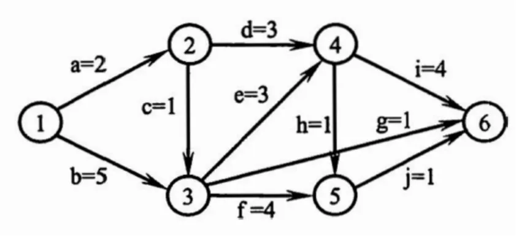
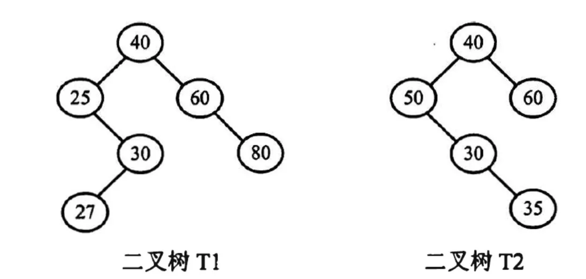

# 2022 408 真题 · 数据结构

> 本科目共 13 题 / 45 分：单项选择题 11 题（22 分）+ 综合应用题 2 题（23 分）。

## 一、单项选择题

### 1. （2 分 · 绪论）

下列程序段的时间复杂度是（ ）。

```C
int sum = 0;
for (int i = 1; i < n; i *= 2)
    for (int j = 0; j < i; j++)
        sum++;
```

- **A.** $O(\log_2 n)$
- **B.** $O(n)$
- **C.** $O(n\log_2 n)$
- **D.** $O(n^2)$

**答案**：B

**解析**：答案 B。外层循环 i 取值 1,2,4,…,2ᵏ⁻¹，内层每轮执行 i 次，总次数 = 1+2+4+…+2ᵏ⁻¹ = 2ᵏ−1 ≈ n−1，故时间复杂度为 O(n)。

> 难度 ⭐⭐⭐ ｜ 章节 绪论 ｜ 标签 数据结构 / 绪论

---

### 2. （2 分 · 栈、队列与数组）

给定有限符号集 S, in 和 out 均为 S 中所有元素的任意排列。对于初始为空的栈 ST, 下列叙述中，正确的是( )。

- **A.** 若 in 是 ST 的入栈序列，则不能判断 out 是否为其可能的出栈序列
- **B.** 若 out 是 ST 的出栈序列，则不能判断 in 是否为其可能的入栈序列
- **C.** 若 in 是 ST 的入栈序列，out 是对应 in 的出栈序列，则 in 与 out 一定不同
- **D.** 若 in 是 ST 的入栈序列，out 是对应 in 的出栈序列，则 in 与 out 可能互为倒序

**答案**：D

**解析**：答案 D。给定入栈序列就能求出全部可能的出栈序列，故 A、B 的「不能判断」错误；每入栈立即出栈时 in 与 out 相同，C 错。全部元素入栈后再依次出栈，out 恰为 in 的倒序，D 正确。

> 难度 ⭐⭐⭐ ｜ 章节 栈、队列与数组 ｜ 标签 数据结构 / 栈 / 队列 / 数组

---

### 3. （2 分 · 树与二叉树）

若结点 p 与 q 在二叉树 T 的中序遍历序列中相邻，且 p 在 q 之前，则下列 p 与 q 的关系中，不可能的是( )。

I. q 是 p 的双亲

II. q 是 p 的右孩子

III. q 是 p 的右兄弟

IV. q 是 p 的双亲的双亲

- **A.** 仅 I
- **B.** 仅 III
- **C.** 仅 II、III
- **D.** 仅 II、IV

**答案**：B

**解析**：答案 B。I 可能：p 是 q 左子树中序遍历的末结点；II 可能：q 无左子树，访问 p 后即访问 q；IV 可能：p 是 q 左子树中最右下的结点。III 不可能：p、q 为右兄弟时，中序必先访问共同双亲再访问 q，二者不可能相邻。

> 难度 ⭐⭐⭐⭐ ｜ 章节 树与二叉树 ｜ 标签 数据结构 / 树 / 二叉树 / 二叉树遍历

---

### 4. （2 分 · 树与二叉树）

若三叉树 T 中有 244 个结点（叶结点的高度为 1），则 T 的高度至少是 ( )。

- **A.** 8
- **B.** 7
- **C.** 6
- **D.** 5

**答案**：C

**解析**：答案 C。高度 h 的满三叉树最多 (3ʰ−1)/2 个结点：h=5 时最多 121，h=6 时最多 364，121<244≤364，故高度至少为 6。

> 难度 ⭐⭐⭐ ｜ 章节 树与二叉树 ｜ 标签 数据结构 / 树 / 二叉树 / 二叉树遍历

---

### 5. （2 分 · 树与二叉树）

对任意给定的含 n (n > 2) 个字符的有限集 S, 用二叉树表示 S 的哈夫曼编码集和定长编码集，分别得到二叉树 T1 和 T2。下列叙述中，正确的是 ( )。

- **A.** T1 与 T2 的结点数相同
- **B.** T1 的高度大于 T2 的高度
- **C.** 出现频次不同的字符在 T1 中处于不同的层
- **D.** 出现频次不同的字符在 T2 中处于相同的层

**答案**：D

**解析**：答案 D。定长编码各字符码长相同，在 T2 中必处于同一层且均为叶结点，与频次无关，D 正确。哈夫曼树 T1 结点数 2n−1，与 T2 一般不同，高度也不必然更高，频次不同的字符可能同层，A、B、C 错。

> 难度 ⭐⭐⭐ ｜ 章节 树与二叉树 ｜ 标签 数据结构 / 树 / 二叉树 / 二叉树遍历 / 哈夫曼树 / 物理层

---

### 6. （2 分 · 图）

对于无向图 G=(V,E)，下列选项中，正确的是(  )。

- **A.** 当 $|V| > |E|$ 时，G 一定是连通的
- **B.** 当 $|V| < |E|$ 时，G 一定是连通的
- **C.** 当 $|V| = |E|-1$ 时，G 一定是不连通的
- **D.** 当 $|V| > |E|+1$ 时，G 一定是不连通的

**答案**：D

**解析**：答案 D。无向图连通至少需 |V|−1 条边；|V|>|E|+1 即 |E|<|V|−1，边数不足以连通全部顶点，必不连通。其余选项均可构造反例。

> 难度 ⭐⭐⭐ ｜ 章节 图 ｜ 标签 数据结构 / 图 / 最短路径 / 最小生成树

---

### 7. （2 分 · 图）

下图是一个有 10 个活动的 AOE 网，时间余量最大的活动是 （ ）。



- **A.** c
- **B.** g
- **C.** h
- **D.** j

**答案**：B

**解析**：答案 B。活动时间余量 = vl(终点)−ve(起点)−持续时间。ve 为 0,2,5,8,9,12，vl 为 0,4,5,8,11,12：c 余量 5−2−1=2，g 余量 12−5−1=6，h 余量 11−8−1=2，j 余量 12−9−1=2，g 最大。

> 难度 ⭐⭐⭐⭐ ｜ 章节 图 ｜ 标签 数据结构 / 图 / 最短路径 / 最小生成树 / 图算法

---

### 8. （2 分 · 查找）

在下图所示的 5 阶 B 树 T 中，删除关键字 260 之后需要进行必要的调整，得到新的 B 树 T1。下列选项中，不可能是 T1 根结点中关键字序列的是(  )。


- **A.** 60，90，280
- **B.** 60，90，350
- **C.** 60，85，110，350
- **D.** 60，90，110，350

**答案**：D

**解析**：答案 D。5 阶 B 树非根结点关键字数须满足 2≤k≤4。删 260 可取其前驱 110 或后继 280 替换，调整后根可为 {60,85,110,350}、{60,90,350} 或 {60,90,280}。D 的 {60,90,110,350} 是未修复下溢的中间状态，不可能。

> 难度 ⭐⭐⭐⭐ ｜ 章节 查找 ｜ 标签 数据结构 / 查找 / 散列表 / B树

---

### 9. （2 分 · 查找）

下列因素中，影响散列(哈希)方法平均查找长度的是( )。

I. 装填因子

II. 散列函数

III. 冲突解决策略

- **A.** 仅 I、II
- **B.** 仅 I、III
- **C.** 仅 II、III
- **D.** I、 II、 III

**答案**：D

**解析**：答案 D。装填因子越大冲突越频繁，平均查找长度越大；散列函数决定关键字分布的均匀程度，冲突解决策略决定冲突后的查找路径，三者都影响平均查找长度。

> 难度 ⭐⭐ ｜ 章节 查找 ｜ 标签 数据结构 / 查找 / 散列表 / B树

---

### 10. （2 分 · 排序）

使用二路归并排序对含 n 个元素的数组 M 进行排序时，二路归并操作的功能是( )。

- **A.** 将两个有序表合并为一个新的有序表
- **B.** 将 M 划分为两部分，两部分的元素个数大致相等
- **C.** 将 M 划分为 n 个部分，每个部分中仅含有一个元素
- **D.** 将 M 划分为两部分，一部分元素的值均小于另一部分元素的值

**答案**：A

**解析**：答案 A。二路归并就是把两个有序表合并为一个新的有序表。B、C 描述的是归并排序的划分过程，D 是快速排序的划分操作。

> 难度 ⭐ ｜ 章节 排序 ｜ 标签 数据结构 / 排序 / 内部排序 / 外部排序 / 排序算法

---

### 11. （2 分 · 排序）

对数据进行排序时，若采用直接插入排序而不采用快速排序，则可能的原因是（）。

Ⅰ. 大部分元素已有序

Ⅱ. 待排序元素数量很少

Ⅲ. 要求空间复杂度为 $O(1)$

Ⅳ. 要求排序算法是稳定的

- **A.** 仅Ⅰ、Ⅱ
- **B.** 仅Ⅲ、Ⅳ
- **C.** 仅Ⅰ、Ⅱ、Ⅳ
- **D.** Ⅰ、Ⅱ、Ⅲ、Ⅳ

**答案**：D

**解析**：答案 D。插入排序在序列基本有序时接近 O(n)、元素少时常数小、空间 O(1)、且稳定；快排在这些场景下均不如插入排序，故四个理由都成立。

> 难度 ⭐⭐⭐ ｜ 章节 排序 ｜ 标签 数据结构 / 排序 / 内部排序 / 外部排序 / 排序算法

---

## 二、综合应用题

### 41. （13 分 · 树与二叉树）

已知非空二叉树 T 的结点值均为正整数，采用顺序存储方式保存，数据结构定义如下：

```c
typedef struct {                    // MAX_SIZE 为已定义常量
    Elemtype SqBiTNode[MAX_SIZE];   // 保存二叉树结点值的数组
    int      ElemNum;               // 实际占用的数组元素个数
} SqBiTree;
```

T 中不存在的结点在数组 `SqBiTNode` 中用 -1 表示。例如，对于两棵非空二叉树 T₁ 和 T₂：



T₁ 和 T₂ 对应的顺序存储如下

| 数组 | 内容（依次） | ElemNum |
|---|---|---|
| `T₁.SqBiTNode` | `[40, 25, 60, -1, 30, -1, 80, -1, -1, 27]` | 10 |
| `T₂.SqBiTNode` | `[40, 50, 60, -1, 30, -1, -1, -1, -1, -1, 35]` | 11 |

请设计一个尽可能高效的算法，判定一棵采用这种方式存储的二叉树是否为二叉搜索树，若是则返回 true，否则返回 false。要求：

(1) 给出算法的基本设计思想。

(2) 根据设计思想，采用 C 或 C++ 语言描述算法，关键之处给出注释。

**答案 / 解析**：

答案：1、基本思想：对顺序存储的二叉树做中序遍历，用变量 val 记录已访问结点的最大值（初值为负整数）；当前结点值不大于 val 则返回 false，否则更新 val。下标 i 的左孩子为 2i+1、右孩子为 2i+2，下标越界或值为 −1 表示空子树，返回 true。2、时间复杂度 O(n)，空间复杂度 O(h)（h 为树高，递归栈）。核心代码：

```c
int val = -1;   // 已遍历结点的最大值，初值小于任意正整数
bool solve(SqBiTree T, int i) {
    if (i >= T.ElemNum || T.SqBiTNode[i] == -1) return true;  // 空子树
    if (!solve(T, 2*i+1)) return false;       // 先判定左子树
    if (T.SqBiTNode[i] <= val) return false;  // 中序序列必须严格递增
    val = T.SqBiTNode[i];
    return solve(T, 2*i+2);                   // 再判定右子树
}
bool isBST(SqBiTree T) { return solve(T, 0); }
```

> 难度 ⭐⭐⭐⭐ ｜ 章节 树与二叉树 ｜ 标签 数据结构 / 树 / 二叉树 / 二叉树遍历 / 二叉排序树

---

### 42. （10 分 · 排序）

现有 n（n > 100000）个数保存在一维数组 M 中，需要查找 M 中最小的 10 个数，请回答下列问题：

(1) 设计一个完成上述查找任务的算法，要求平均情况下的比较次数尽可能少，简单描述其算法思想，不需要程序实现。

(2) 说明你所设计的算法平均情况下的时间复杂度和空间复杂度。

**小题**：

- （1）设计一个完成上述查找任务的算法，要求平均情况下的比较次数尽可能少，简单描述其算法思想，不需要程序实现。
- （2）说明你所设计的算法平均情况下的时间复杂度和空间复杂度。

**答案 / 解析**：

答案：1、维护一个含 10 个元素的大根堆 H，各元素初值为足够大的数。遍历 M 中每个元素 s：若 s 小于堆顶，则删除堆顶并把 s 插入堆；否则跳过。扫描完毕，堆中即为最小的 10 个数，每个元素平均只需与堆顶比较 1 次即被淘汰。也可用含 10 个元素的升序数组，s 小于最大元素时插入并丢弃最大者，效果相同。2、时间复杂度 O(n)，空间复杂度 O(1)（仅 10 个元素的堆，与 n 无关）。

> 难度 ⭐⭐⭐ ｜ 章节 排序 ｜ 标签 数据结构 / 排序 / 内部排序 / 外部排序

---

## See Also

- [[408/真题精读/2022/计算机组成原理]]
- [[408/真题精读/2022/操作系统]]
- [[408/真题精读/2022/计算机网络]]
- [[408/历年真题/2022]]
- [[408/真题精读/真题精读总目录]]
