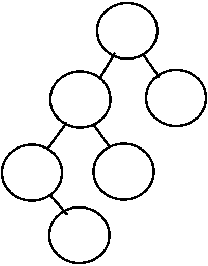
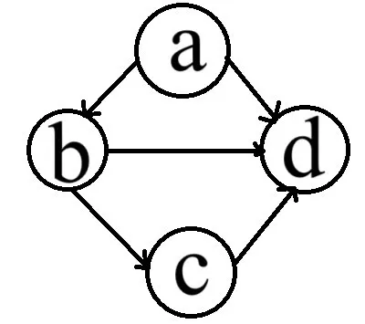

# 2023 408 真题 · 数据结构

> 本科目共 13 题 / 45 分：单项选择题 11 题（22 分）+ 综合应用题 2 题（23 分）。

## 一、单项选择题

### 1. （2 分 · 线性表）

下列对顺序存储的有序表（长度为 $n$）实现给定操作的算法中，平均时间复杂度为 $O(1)$ 的是( )。

- **A.** 查找包含指定值元素的算法
- **B.** 插入包含指定值元素的算法
- **C.** 删除第 $i$ 个元素的算法
- **D.** 获取第 $i$ 个值的算法

**答案**：D

**解析**：答案 D。顺序存储支持随机存取，按下标 i 经 LOC(aᵢ)=LOC(a₁)+(i−1)×L 直接计算地址、一次访存即可取到值，与表长 n 无关，为 O(1)。按值查找需比较（O(n) 或 O(log n)），插入和删除需移动后续元素（O(n)），都达不到常数级。

> 难度 ⭐⭐ ｜ 章节 线性表 ｜ 标签 数据结构 / 线性表 / 顺序表 / 链表

---

### 2. （2 分 · 线性表）

现有非空双向链表 L，其结点结构为：

```
prev | data | next
```

`prev` 是指向直接前驱结点的指针，`next` 是指向直接后继结点的指针。若要在 L 中指针 `p` 所指向的结点（非尾结点）之后插入指针 `s` 指向的新结点，则在执行了语句序列 `s->next = p->next; p->next = s;` 后，还要执行（ ）。

- **A.** `s->next->prev = p; s->prev = p;`
- **B.** `p->next->prev = s; s->prev = p;`
- **C.** `s->prev = s->next->prev; s->next->prev = s;`
- **D.** `p->next->prev = s->prev; s->next->prev = p;`

**答案**：C

**解析**：答案 C。执行 s->next = p->next; p->next = s; 后，还需让 s->prev 指向 p、原后继的 prev 指向 s。此时 p->next 已是 s，须借 s->next 找到原后继：s->prev = s->next->prev（此刻仍为 p），再 s->next->prev = s。

> 难度 ⭐⭐⭐⭐ ｜ 章节 线性表 ｜ 标签 数据结构 / 线性表 / 顺序表 / 链表 / 文件系统

---

### 3. （2 分 · 栈、队列与数组）

若采用三元组表存储结构存储稀疏矩阵 M，则除三元组外，下列数据中还需要保存的是( )。

I. M 的行数

II. M 中包含非零元素的行数

III. M 的列数

IV. M 中包含非零元素的列数

- **A.** 仅 I 和 III
- **B.** 仅 I 和 IV
- **C.** 仅 II 和 IV
- **D.** I、II、III、IV

**答案**：A

**解析**：答案 A。三元组表只记录非零元的行、列、值，要完整恢复矩阵还必须另存矩阵的行数 I 和列数 III，用于确定矩阵规模与越界判断。非零元所在的行、列信息已含在每条三元组中，无需额外保存。即仅 I、III。

> 难度 ⭐⭐ ｜ 章节 栈、队列与数组 ｜ 标签 数据结构 / 栈 / 队列 / 数组 / 特殊矩阵

---

### 4. （2 分 · 树与二叉树）

在由 6 个字符组成的字符集 S 中，各个字符出现的频次分别为 3, 4, 5, 6, 8, 10，为 S 构造的哈夫曼树的加权平均长度为( )。

- **A.** 2.4
- **B.** 2.5
- **C.** 2.67
- **D.** 2.75

**答案**：B

**解析**：答案 B。合并过程：3+4=7，5+6=11，7+8=15，10+11=21，15+21=36。3、4、5、6 编码长 3，8、10 长 2。加权平均长度 = ((3+4+5+6)×3+(8+10)×2)/36 = 90/36 = 2.5。

> 难度 ⭐⭐⭐ ｜ 章节 树与二叉树 ｜ 标签 数据结构 / 树 / 二叉树 / 二叉树遍历 / 哈夫曼树

---

### 5. （2 分 · 树与二叉树）

已知一棵二叉树的树形如下图所示，若其后序遍历为 f, d, b, e, c, a，则其先序序列为（ ）。



- **A.** a, e, d, f, b, c
- **B.** a, c, e, b, d, f
- **C.** c, a, b, e, f, d
- **D.** d, f, e, b, a, c

**答案**：A

**解析**：答案 A。后序最后一个 a 是根，其前的 f、d、b、e 属左子树，c 属右子树。左子树后序 f、d、b、e 中 e 为根，其左子树含 d、f，右子树为 b；d 的孩子为 f。按根左右的先序得：a, e, d, f, b, c。

> 难度 ⭐⭐⭐ ｜ 章节 树与二叉树 ｜ 标签 数据结构 / 树 / 二叉树 / 二叉树遍历

---

### 6. （2 分 · 图）

已知无向连通图 G 中各边的权值均为 1，下列算法中，一定能够求出图 G 中从某顶点到其余各个顶点最短路径的是( )。

I. 普里姆（Prim）算法

II. 克鲁斯卡尔（Kruskal）算法

III. 图的广度优先搜索

- **A.** 仅 I
- **B.** 仅 III
- **C.** 仅 I 和 II
- **D.** I、II、III

**答案**：B

**解析**：答案 B。Prim 和 Kruskal 解决最小生成树问题，与两点间最短路径无关。各边权均为 1 时，BFS 从源点按层扩展，第 k 层顶点到源点恰经过 k 条边，即为最短路径长度。仅 III 正确。

> 难度 ⭐⭐⭐ ｜ 章节 图 ｜ 标签 数据结构 / 图 / 最短路径 / 最小生成树

---

### 7. （2 分 · 查找）

下列关于非空 B 树的叙述中，正确的是( )。

I. 插入操作可能增加树的高度

II. 删除操作一定会导致叶结点的变化

III. 查找某关键字一定要查找到叶结点

IV. 插入的新关键字最终位于叶结点中

- **A.** 仅 I
- **B.** 仅 I、II
- **C.** 仅 III、IV
- **D.** 仅 I、II、IV

**答案**：B

**解析**：答案 B。I 正确：插入使叶结点分裂，根分裂则树高增加。II 正确：无论直接删叶结点关键字，还是用前驱/后继替换内部结点关键字后再删，最终都落在叶结点上。III 错误：内部结点命中即返回，不必查到叶结点。IV 错误：分裂时中位数上移，新关键字可能不在叶结点。

> 难度 ⭐⭐⭐⭐ ｜ 章节 查找 ｜ 标签 数据结构 / 查找 / 散列表 / B树

---

### 8. （2 分 · 查找）

对含有 600 个元素的有序顺序表进行折半查找，关键字之间的比较次数最多是( )。

- **A.** 9
- **B.** 10
- **C.** 30
- **D.** 300

**答案**：B

**解析**：答案 B。折半查找的最多比较次数为判定树的高度 ⌊log₂n⌋+1。log₂600 介于 9 与 10 之间，⌊log₂600⌋=9，故最多比较 9+1=10 次。

> 难度 ⭐⭐ ｜ 章节 查找 ｜ 标签 数据结构 / 查找 / 散列表 / B树 / 查找算法

---

### 9. （2 分 · 查找）

现有长度为 5，初始为空的散列表 HT，散列表函数 H(k) = (k+4) % 5 用线性探查再散列法解决冲突。若将关键字序列 2022,12,25 依次插入 HT 中，然后删除关键字 25，则 HT 中查找失败的平均查找长度（ ）。

- **A.** 1
- **B.** 1.6
- **C.** 1.8
- **D.** 2.2

**答案**：C

**解析**：答案 C。插入后 2022 在位置 1、12 在位置 2、25 在位置 4；删除 25 后该位置留删除标记，查找失败须越过标记继续探测至真正的空位。5 个起点的失败比较次数为 1、3、2、1、2，ASL=(1+3+2+1+2)/5=1.8。

> 难度 ⭐⭐⭐ ｜ 章节 查找 ｜ 标签 数据结构 / 查找 / 散列表 / B树

---

### 10. （2 分 · 排序）

下列排序算法中，不稳定的是( )。

I. 希尔排序

II. 归并排序

III. 快速排序

IV. 堆排序

V. 基数排序

- **A.** 仅 I 和 II
- **B.** 仅 II 和 V
- **C.** 仅 I、III、IV
- **D.** 仅 III、IV、V

**答案**：C

**解析**：答案 C。不稳定的是希尔、快速、堆排序：希尔跨组跳跃式比较交换，快排划分交换可能越过相等元素，堆排序建堆调整时大跨度交换，都可能改变相等元素的相对顺序。归并和基数排序稳定。

> 难度 ⭐⭐ ｜ 章节 排序 ｜ 标签 数据结构 / 排序 / 内部排序 / 外部排序 / 排序算法

---

### 11. （2 分 · 排序）

使用快速排序算法对数据进行升序排序，若经过一次划分后得到的数据序列是 68, 11, 70, 23, 80, 77, 48, 81, 93, 88，则该次划分的枢轴是( )。

- **A.** 11
- **B.** 70
- **C.** 80
- **D.** 81

**答案**：D

**解析**：答案 D。划分后枢轴必处于最终位置：其左边元素均不超过它、右边均不小于它。11 左边有 68 大于它；70 右边有 23、48 小于它；80 右边有 77、48 小于它；81 左边最大为 80、右边最小为 88，符合条件。

> 难度 ⭐⭐⭐ ｜ 章节 排序 ｜ 标签 数据结构 / 排序 / 内部排序 / 外部排序 / 排序算法

---

## 二、综合应用题

### 41. （13 分 · 图）

已知有向图 G 采用邻接矩阵存储，类型定义如下：

```c
typedef struct {                    // 图的类型定义
    int  numVertices, numEdges;     // 图中顶点数和有向边数
    char VerticesList[MAXV];        // 顶点表，MAXV 为已定义常量
    int  Edge[MAXV][MAXV];          // 邻接矩阵
} MGraph;
```

将图中出度大于入度的顶点称为 K 顶点。例如在题 41 图中，顶点 a 和 b 都是 K 顶点。



设计算法 `int printVertices(MGraph G)`：对给定任意非空有向图 G，输出 G 中所有 K 顶点，并返回 K 顶点的个数。要求：

(1) 给出算法的设计思想。

(2) 根据算法思想，写出 C/C++ 描述，并注释。

**答案 / 解析**：

答案：1、设计思想：邻接矩阵中第 i 行非零元的个数为顶点 i 的出度，第 i 列非零元的个数为其入度。对每个顶点分别统计出度和入度，若出度 > 入度则输出该顶点并使计数加 1，最后返回 K 顶点个数。2、时间 O(n²)、空间 O(1)。核心代码：

```c
int printVertices(MGraph G) {
    int count = 0;
    for (int v = 0; v < G.numVertices; v++) {
        int outdegree = 0, indegree = 0;
        for (int i = 0; i < G.numVertices; i++)
            outdegree += G.Edge[v][i];   // 第 v 行之和为出度
        for (int i = 0; i < G.numVertices; i++)
            indegree += G.Edge[i][v];    // 第 v 列之和为入度
        if (outdegree > indegree) {
            printf("%c ", G.VerticesList[v]);
            count++;
        }
    }
    return count;
}
```

> 难度 ⭐⭐⭐ ｜ 章节 图 ｜ 标签 数据结构 / 图 / 最短路径 / 最小生成树 / 图的存储

---

### 42. （10 分 · 排序）

对含有 n（n > 0）个记录的文件进行外部排序，采用置换-选择排序生成初始归并段时需要使用一个工作区，工作区中能保存 m 个记录，请回答下列问题：

(1) 如果文件中有 19 个记录，其关键字是 51, 94, 37, 92, 14, 63, 15, 99, 48, 56, 23, 60, 31, 17, 43, 8, 90, 166, 100；当 m = 4 时，可以生成几个初始归并段，各是什么？

(2) 对任意的 m（n > m > 0），生成的第一个初始归并段的长度最大值和最小值分别是多少？

**小题**：

- （1）如果文件中有 19 个记录，其关键字是 51, 94, 37, 92, 14, 63, 15, 99, 48, 56, 23, 60, 31, 17, 43, 8, 90, 166, 100；当 m = 4 时，可以生成几个初始归并段，各是什么？
- （2）对任意的 m（n > m > 0），生成的第一个初始归并段的长度最大值和最小值分别是多少？

**答案 / 解析**：

答案：1、共生成 3 个初始归并段：R1 = (37, 51, 63, 92, 94, 99)，长度 6；R2 = (14, 15, 23, 31, 48, 56, 60, 90, 166)，长度 9；R3 = (8, 17, 43, 100)，长度 4。三段合计 19 个记录。2、第一个初始归并段长度的最大值 = n，最小值 = m。

说明：置换-选择排序每次从容量 m 的工作区中选出不小于当前段已输出最大关键字的最小记录输出，小于它的新记录冻结留到下一段，工作区全部冻结或输入读完时结束当前段。

> 难度 ⭐⭐⭐⭐ ｜ 章节 排序 ｜ 标签 数据结构 / 排序 / 内部排序 / 外部排序 / 排序算法 / 文件系统

---

## See Also

- [[408/真题精读/2023/计算机组成原理]]
- [[408/真题精读/2023/操作系统]]
- [[408/真题精读/2023/计算机网络]]
- [[408/历年真题/2023]]
- [[408/真题精读/真题精读总目录]]
