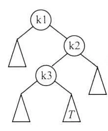

# 2024 408 真题 · 数据结构

> 本科目共 13 题 / 45 分：单项选择题 11 题（22 分）+ 综合应用题 2 题（23 分）。

## 一、单项选择题

### 1. （2 分 · 线性表）

已知带头结点的非空单链表 L 的头指针为 h，指针 p 指向 L 中间的一个链表结点(不是第一个和最后一个结点)。q=p->next，p->next=q->next，q->next=h->next，h->next=q。这段代码的功能是（ ）。

- **A.** 把 q 指向的结点插入到 p 的后面
- **B.** 把 p 指向的结点插入到 q 的后面
- **C.** 把 p 指向的结点插入到 h 的后面
- **D.** 把 q 指向的结点插入到 h 的后面

**答案**：D

**解析**：答案 D。q=p->next 记下后继，p->next=q->next 把 q 摘出，q->next=h->next 指向原首结点，h->next=q 把 q 接到头结点之后，即把 q 摘除后插入到链表头部。

> 难度 ⭐⭐⭐ ｜ 章节 线性表 ｜ 标签 数据结构 / 线性表 / 顺序表 / 链表 / 文件系统

---

### 2. （2 分 · 栈、队列与数组）

表达式 `x+y*(z-u)/v` 的等价后缀是（ ）

- **A.** xyzu-*v/+
- **B.** xyzu-v/*+
- **C.** +x/*y-zuv
- **D.** +x*y/-zuv

**答案**：A

**解析**：答案 A。按优先级自内向外转换：z-u 得 zu-，y*(z-u) 得 yzu-*，再除以 v 得 yzu-*v/，最后加 x 得 x yzu-*v/+，即 xyzu-*v/+。操作数次序不变，运算符按优先级依次后移。

> 难度 ⭐⭐ ｜ 章节 栈、队列与数组 ｜ 标签 数据结构 / 栈 / 队列 / 数组

---

### 3. （2 分 · 树与二叉树）

p、q、v 都是二叉树 T 中的结点，二叉树 T 的中序遍历为 ···, p，v，q，··· ，其中 v 有两个孩子结点，则下列说法正确的是( )。

- **A.** p 没右孩子，q 没左孩子
- **B.** p 没右孩子，q 有左孩子
- **C.** p 有右孩子，q 没左孩子
- **D.** p 有右孩子，q 有左孩子

**答案**：A

**解析**：答案 A。中序序列中 p 紧邻 v 之前，是 v 左子树中最后访问的结点，必无右孩子；q 紧邻 v 之后，是 v 右子树中最先访问的结点，必无左孩子。

> 难度 ⭐⭐⭐⭐ ｜ 章节 树与二叉树 ｜ 标签 数据结构 / 树 / 二叉树 / 二叉树遍历

---

### 4. （2 分 · 图）

给定无向图的邻接多重表，求顶点 b、d 的度()


- **A.** 0, 2
- **B.** 2, 4
- **C.** 3, 2
- **D.** 2, 3

**答案**：B

**解析**：答案 B。由邻接多重表还原图，边为 a-b、a-d、b-d、a-c、c-d、c-e、d-e。b 出现在 a-b、b-d 两条边中，度为 2；d 出现在 a-d、b-d、c-d、d-e 四条边中，度为 4。

> 难度 ⭐⭐⭐⭐ ｜ 章节 图 ｜ 标签 数据结构 / 图 / 最短路径 / 最小生成树

---

### 5. （2 分 · 查找）

下列数据结构中，不适合直接使用折半查找的是( )

I. 有序链表
II. 无序数组
III. 有序静态链表
IV. 无序静态链表

- **A.** 仅 I、II
- **B.** 仅 II、IV
- **C.** 仅 I、II、IV
- **D.** I、II、III、IV

**答案**：D

**解析**：答案 D。折半查找要求序列有序且能随机存取。链表（含静态链表）不能 O(1) 定位中点，静态链表的逻辑顺序也不等于数组下标；无序数组不满足有序条件，故四种结构均不适合。

> 难度 ⭐⭐⭐ ｜ 章节 查找 ｜ 标签 数据结构 / 查找 / 散列表 / B树 / 查找算法 / 链表

---

### 6. （2 分 · 串）

KMP 算法使用修正后的 next 数组进行模式匹配，模式串 S = "aabaab"，当主串中某字符与 S 中某字符失去配对时，S 将向右滑动的最长距离是( )

- **A.** 5
- **B.** 4
- **C.** 3
- **D.** 2

**答案**：A

**解析**：答案 A。"aabaab" 的 next 为 -1,0,1,0,1,2，修正后 nextval 为 -1,-1,1,-1,-1,1。失配时滑动距离为 j−nextval[j]，第 5 个字符失配时滑 4−(−1)=5 位，为最大值。

> 难度 ⭐⭐⭐⭐ ｜ 章节 串 ｜ 标签 数据结构 / 串 / 文件系统

---

### 7. （2 分 · 查找）

一棵二叉搜索树如下图所示，$K_1$、$K_2$、$K_3$ 分别是对应结点中保存的关键字、三角形表示子树。则子树 T 中任一结点中保存的关键字 X 满足的是（ ）。



- **A.** $X < K_1$
- **B.** $X > K_2$
- **C.** $K_1 < X < K_3$
- **D.** $K_3 < X < K_2$

**答案**：D

**解析**：答案 D。T 是 K3 的右子树，故 X>K3；K3 在 K2 的左子树中，故 X<K2；又 K3 在 K1 的右子树中，K3>K1。综合得 K3<X<K2。

> 难度 ⭐⭐⭐ ｜ 章节 查找 ｜ 标签 数据结构 / 查找 / 散列表 / B树 / 二叉排序树

---

### 8. （2 分 · 排序）

使用快速排序算法对含 N（N ≥ 3） 个元素的数组 M 进行排序，若第一趟排序将除枢轴外的 N-1 个元素划分为 P 和 Q 两个部分，则下列叙述中，正确的是（ ）。

- **A.** P 和 Q 块间有序
- **B.** P 和 Q 均块内有序
- **C.** P 和 Q 的元素个数大致相等
- **D.** P 和 Q 中均不存在相等的元素

**答案**：A

**解析**：答案 A。第一趟划分只保证枢轴左侧元素都小于枢轴、右侧都大于枢轴，即 P、Q 两块间有序；块内仍未排序，需递归继续，块内元素个数与是否相等均无保证。

> 难度 ⭐⭐⭐ ｜ 章节 排序 ｜ 标签 数据结构 / 排序 / 内部排序 / 外部排序 / 排序算法

---

### 9. （2 分 · 排序）

已知关键字序列 28, 22, 20, 19, 8, 12, 15, 5 是大根堆(最大堆)，对该堆进行两次删除操作后，得到的新堆是( )。

- **A.** 20, 19, 15, 12, 8, 5
- **B.** 20, 19, 15, 5, 8, 12
- **C.** 20, 19, 12, 15, 8, 5
- **D.** 20, 19, 8, 12, 15, 5

**答案**：B

**解析**：答案 B。删 28：末元素 5 上移下沉，得 22,19,20,5,8,12,15；删 22：末元素 15 上移下沉，得 20,19,15,5,8,12。即两次删除后新堆的层序为 20,19,15,5,8,12。

> 难度 ⭐⭐⭐ ｜ 章节 排序 ｜ 标签 数据结构 / 排序 / 内部排序 / 外部排序

---

### 10. （2 分 · 排序）

初始有三个升序序列 (3, 5)、(7, 9)、(6)，若按从左至右的次序选择有序序列进行二路归并排序，则关键字之间的总比较次数是( )。

- **A.** 3
- **B.** 4
- **C.** 5
- **D.** 6

**答案**：C

**解析**：答案 C。第一轮合并 (3,5) 与 (7,9)：3 比 7、5 比 7 共 2 次，剩余直接尾接；第二轮合并 (3,5,7,9) 与 (6)：3、5、7 各与 6 比较共 3 次。总比较次数 2+3=5。

> 难度 ⭐⭐⭐ ｜ 章节 排序 ｜ 标签 数据结构 / 排序 / 内部排序 / 外部排序 / 排序算法

---

### 11. （2 分 · 排序）

在外排序中，利用败者树对初始为升序的归并段进行多路归并，败者树中记录"冠军"的结点保存的是（ ）。

- **A.** 最大关键字
- **B.** 最小关键字
- **C.** 最大关键字所在的归并段号
- **D.** 最小关键字所在的归并段号

**答案**：D

**解析**：答案 D。败者树的内部结点记录每轮比较中"败者"所在的归并段号，根结点即"冠军"结点，保存的是当前最小关键字所在的归并段号。

> 难度 ⭐⭐⭐ ｜ 章节 排序 ｜ 标签 数据结构 / 排序 / 内部排序 / 外部排序

---

## 二、综合应用题

### 41. （13 分 · 图）

2023 年 10 月 26 日，神舟十七号载人飞船发射取得圆满成功，再次彰显了中国航天事业的辉煌成就。载人航天工程是包含众多子工程的复杂系统工程，为了保证工程的有序开展，需要明确各子工程的前导工程，以协调各子工程的实施。该问题可以简化、抽象为有向图的拓扑序列问题。

已知有向图 G 采用邻接矩阵存储，类型定义如下：

```c
typedef struct {                    // 图的类型定义
    int  numVertices, numEdges;     // 图的顶点数和有向边数
    char VerticesList[MAXV];        // 顶点表，MAXV 为已定义常量
    int  Edge[MAXV][MAXV];          // 邻接矩阵
} MGraph;
```

请设计算法：`int uniquely(MGraph G)`，判定 G 是否存在唯一的拓扑序列，若是则返回 1，否则返回 0。要求：

(1) 给出算法的基本设计思想。（4 分）

(2) 根据设计思想，采用 C 或 C++ 语言描述算法，关键之处给出注释。（9 分）

**答案 / 解析**：

答案：1、基本思想：仿 Kahn 算法做 n 轮，每轮统计入度为 0 的顶点。若恰好只有 1 个，则删除它并令其后继的入度减 1；若为 0 个说明剩余顶点成环，若多于 1 个说明有多种选法，均不存在唯一拓扑序列，返回 0。每轮都唯一则返回 1。2、时间复杂度 O(n²)，空间复杂度 O(n)。核心代码：

```c
int uniquely(MGraph G) {
    int i, j, k, cnt, v0;
    int n = G.numVertices, inDeg[MAXV] = {0};
    for (i = 0; i < n; i++)                    // 统计各顶点入度
        for (j = 0; j < n; j++)
            if (G.Edge[i][j] != 0) inDeg[j]++;
    for (k = 0; k < n; k++) {                  // 重复 n 轮
        cnt = 0; v0 = -1;
        for (i = 0; i < n; i++)
            if (inDeg[i] == 0) { cnt++; v0 = i; }
        if (cnt != 1) return 0;                // 有环或拓扑序不唯一
        inDeg[v0] = -1;                        // 摘除 v0
        for (j = 0; j < n; j++)
            if (G.Edge[v0][j] != 0) inDeg[j]--; // 后继入度减 1
    }
    return 1;
}
```

> 难度 ⭐⭐⭐⭐ ｜ 章节 图 ｜ 标签 数据结构 / 图 / 最短路径 / 最小生成树 / 图的存储

---

### 42. （10 分 · 查找）

将关键字 20, 3, 11, 18, 9, 14, 7 依次存储到长度为 11 的散列表 HT 中，散列函数为 H(key) = (key × 3) mod 11。

H₀ 为初始散列地址，H₁、H₂、H₃、…、H_k 分别为第 1 次冲突、第 2 次冲突、第 3 次冲突、…、第 k 次冲突时探测的地址，H_k = (H₀ + k²) mod 11。

请回答下列问题：

(1) 画出所构造的 HT，并计算 HT 的装填因子。

(2) 给出在 HT 中查找关键字 14 的关键字比较序列。

(3) 在 HT 中查找关键字 8，确认查找失败时的散列地址是多少？

**答案 / 解析**：

答案：1、HT 各地址 0～10 依次为 11、空、14、7、空、20、9、空、空、3、18；装填因子 α=7/11。2、查找 14：H₀=9 处为 3，H₁=10 处为 18，H₂=2 处命中 14，比较序列为 3、18、14。3、查找 8：H₀=2 处为 14，H₁=3 处为 7，H₂=6 处为 9，H₃=0 处为 11，H₄=7 处为空，查找失败，失败时的散列地址为 7。

> 难度 ⭐⭐⭐⭐ ｜ 章节 查找 ｜ 标签 数据结构 / 查找 / 散列表 / B树

---

## See Also

- [[408/真题精读/2024/计算机组成原理]]
- [[408/真题精读/2024/操作系统]]
- [[408/真题精读/2024/计算机网络]]
- [[408/历年真题/2024]]
- [[408/真题精读/真题精读总目录]]
