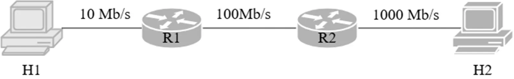
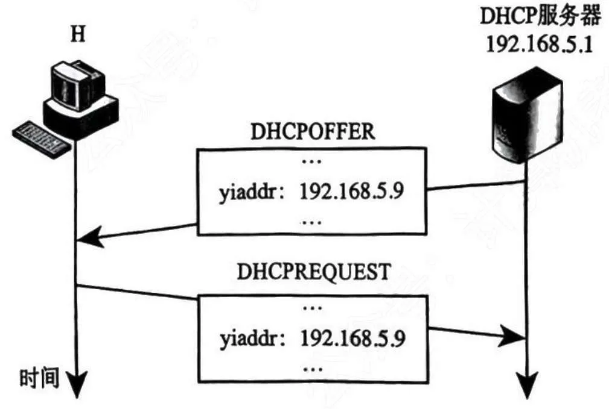

# 2025 408 真题 · 计算机网络

> 本科目共 9 题 / 25 分：单项选择题 8 题（16 分）+ 综合应用题 1 题（9 分）。

## 一、单项选择题

### 33. （2 分 · 计算机网络体系结构）

如下图所示，主机 H1 向 H2 发送一个 2 MB（1 MB = 10⁶ B）文件有三种方式：① 电路交换，建立时间为 32 μs，速度为 10 Mbps；② 分组交换，分组长度为 400 B，忽略首部；③ 报文交换。电路交换的时间为 Tcs，报文交换的时间为 Tms，分组交换的时间为 Tps，则三者的大小关系是（ ）。

- **A.** Tcs > Tms > Tps
- **B.** Tms > Tps > Tcs
- **C.** Tms > Tcs > Tps
- **D.** Tps > Tms > Tcs

**答案**：B

**解析**：答案 B。Tcs = 32μs + 2MB/10Mbps ≈ 1.600032s；Tms = 1.6 + 0.16 + 0.016 = 1.776s；Tps ≈ 1.600035s（末段仅多传 400B），Tms > Tps > Tcs。

> 难度 ⭐⭐⭐⭐ ｜ 章节 计算机网络体系结构 ｜ 标签 计算机网络 / 计算机网络体系结构 / 内存分配 / 文件系统

---

### 34. （2 分 · 数据链路层）

某差错编码的编码集为 { 10011010，01011100，11110000，00001111 }，其检错和纠错能力是（ ）。

- **A.** 可以检测不超过 2 位错，检错率 100%；可纠正不超过 1 位错
- **B.** 可以检测不超过 2 位错，检错率 100%；可纠正不超过 2 位错
- **C.** 可以检测不超过 3 位错，检错率 100%；可纠正不超过 1 位错
- **D.** 可以检测不超过 3 位错，检错率 100%；可纠正不超过 2 位错

**答案**：C

**解析**：答案 C。4 个码字两两海明距离最小为 4。检错能力 e ≤ d−1 = 3，可检测不超过 3 位错；纠错能力 t ≤ ⌊(d−1)/2⌋ = 1，可纠正不超过 1 位错。

> 难度 ⭐⭐⭐ ｜ 章节 数据链路层 ｜ 标签 计算机网络 / 数据链路层 / MAC / CSMA/CD / PPP / 物理层

---

### 35. （2 分 · 数据链路层）

现有一 10BaseT 以太网，甲乙处于同一个冲突域，连续发生 11 次冲突，甲再次发送的最大时间间隔为（ ）。

- **A.** 0.512 ms
- **B.** 0.5632 ms
- **C.** 52.3776 ms
- **D.** 104.8064 ms

**答案**：C

**解析**：答案 C。10BaseT 时隙为 51.2μs。第 11 次冲突后的退避指数 k = min(11, 10) = 10，随机数范围 [0, 1023]，最大等待 1023 × 51.2μs = 52.3776 ms。

> 难度 ⭐⭐⭐⭐ ｜ 章节 数据链路层 ｜ 标签 计算机网络 / 数据链路层 / MAC / CSMA/CD / PPP

---

### 36. （2 分 · 应用层）

一台新接入网络的主机 H 通过 DHCP 服务器动态请求 IP 地址过程中，与 DHCP 服务器交换 DHCP 报文过程如下图所示。封装 DHCP 的 REQUEST 报文的 IP 数据报的目的 IP 地址和源 IP 地址分别是（ ）。

- **A.** 192.168.5.1, 0.0.0.0
- **B.** 192.168.5.1, 192.168.5.9
- **C.** 255.255.255.255, 0.0.0.0
- **D.** 255.255.255.255, 192.168.5.9

**答案**：C

**解析**：答案 C。DHCP 的 REQUEST 阶段主机尚未获得正式 IP，源 IP 为 0.0.0.0；目的 IP 用广播地址 255.255.255.255，使所有 DHCP 服务器都能收到，通知选定结果并释放暂留地址。

> 难度 ⭐⭐⭐ ｜ 章节 应用层 ｜ 标签 计算机网络 / 应用层 / HTTP / DNS / FTP / SMTP / 内存分配 / 网络层

---

### 37. （2 分 · 网络层）

假设路由器实现 NAT 功能，内网中主机 H 的 IP 地址为 192.168.1.5/24。若 H 运行某应用向 Internet 发送一个 UDP 报文段，则路由器在转发封装该 UDP 报文段的 IP 数据报的过程中，UDP 报文的首部字段会被修改的是（ ）。

Ⅰ. 源端口号
Ⅱ. 目的端口号
Ⅲ. 总长度
Ⅳ. 校验和

- **A.** 仅 Ⅰ、Ⅲ
- **B.** 仅 Ⅰ、Ⅳ
- **C.** 仅 Ⅱ、Ⅲ
- **D.** 仅 Ⅱ、Ⅳ

**答案**：B

**解析**：答案 B。NAT/NAPT 改写源 IP，并用源端口号区分不同会话，故源端口被修改（Ⅰ）；源 IP 变化使 UDP 校验和（含伪首部）必须重算（Ⅳ）。目的端口号和总长度不变。

> 难度 ⭐⭐⭐⭐ ｜ 章节 网络层 ｜ 标签 计算机网络 / 网络层 / IP / 路由 / 子网划分 / CIDR / 指令流水线 / 传输层

---

### 38. （2 分 · 传输层）

主机甲通过 TCP 向主机乙发送数据的部分过程如下图，seq 为序号，ack_seq 为确认序号，rcwnd 为接收窗口。甲在 t0 时刻的拥塞窗口和发送窗口均为 2000 B，拥塞控制阈值为 8000 B，MSS = 1000 B。甲始终以 MSS 发送 TCP 段。若甲在 t1 时刻收到如图所示的确认段，则甲在未收到新的确认段之前，还可以继续向乙发送的 TCP 段数是（ ）。

- **A.** 2
- **B.** 3
- **C.** 4
- **D.** 5

**答案**：A

**解析**：答案 A。t1 时甲仍处慢启动，收到一个 ack 后 cwnd 增至 3000B；发送窗口 = min(cwnd, rwnd) = 3000B；已发未确认的只有 seq=3001 段（1000B），故还可发 2000B，即 2 个 MSS。

> 难度 ⭐⭐⭐⭐ ｜ 章节 传输层 ｜ 标签 计算机网络 / 传输层 / TCP / UDP / 拥塞控制

---

### 39. （2 分 · 传输层）

Time 是一个提供时间查询服务的 C/S 架构网络应用，支持客户通过 UDP 和 TCP 向 Time 服务器请求时间。若某客户与 Time 服务器通信往返时间为 8ms，则该客户分别通过 UDP 和 TCP 向该服务器请求服务，所需的最少时间分别是（ ）。

- **A.** 8 ms，8 ms
- **B.** 8 ms，16 ms
- **C.** 16 ms，8 ms
- **D.** 16 ms，16 ms

**答案**：B

**解析**：答案 B。UDP 无连接，一次请求/响应只需 1 个 RTT = 8ms。TCP 需先完成三次握手，第三次握手的 ACK 可与请求数据捎带发出，共需 2 个 RTT = 16ms。

> 难度 ⭐⭐ ｜ 章节 传输层 ｜ 标签 计算机网络 / 传输层 / TCP / UDP / 拥塞控制

---

### 40. （2 分 · 应用层）

关于 POP3，正确的是（ ）。

I 支持用户代理从邮件服务器读取邮件

II 支持用户代理向邮件服务器发送邮件

III 支持邮件服务器之间发送与接收邮件

IV 支持一条 TCP 连接收取多封邮件

- **A.** Ⅰ、Ⅳ
- **B.** Ⅱ、Ⅲ
- **C.** Ⅰ、Ⅱ、Ⅲ
- **D.** Ⅰ、Ⅲ、Ⅳ

**答案**：A

**解析**：答案 A。POP3 支持用户代理从邮件服务器读取邮件（Ⅰ），并可在一条 TCP 连接上收取多封邮件（Ⅳ）；用户代理发送邮件、邮件服务器之间转发均由 SMTP 负责，Ⅱ、Ⅲ 错。

> 难度 ⭐⭐ ｜ 章节 应用层 ｜ 标签 计算机网络 / 应用层 / HTTP / DNS / FTP / SMTP / 传输层

---

## 二、综合应用题

### 47. （9 分 · 网络层）

某工程部网络通过卫星链路接入互联网（拓扑见下图）。已知：

- S1 和 S2 为千兆以太网交换机
- 卫星轨道高度 36 000 km，电磁波速度 300 000 km/s
- TR1 和 TR2 是卫星信号地面收发设备，实现全双工调制解调
- 卫星链路为 R1、R2 之间提供对称全双工信道，每个方向数据传输速率为 200 kbps

(1) 忽略卫星信号中继、TR1、TR2 调制解调开销，则 R1 到 R2 之间的卫星链路单向传播时延是多少？主机 H 向总部服务器传输数据时可达到的最大吞吐量是多少？若忽略各层协议首部开销以及以太网的传播时延，则 H → 服务器上传一个 4000 B 的文件，至少需要多长时间？

(2) 基于 GBN 为卫星链路设计单向可靠的链路层协议 SLP，支持 R1 → R2 发送数据。SLP 数据帧长 1500 B，忽略 ACK 帧长度，要求 SLP 单向信道利用率不低于 80%，则发送窗口至少为多少？SLP 帧序号至少为多少位？

(3) 总部给工程部分配 IP 地址空间 10.10.10.0/24，再划分为 3 个子网：管理区子网、生活区子网、作业区子网。已知管理区子网地址为 10.10.10.33/26，若生活区子网不少于 120 个 IP 地址、作业子网与管理区子网 IP 均不少于 60 个，H 已正确配置 IP。请问作业区子网和生活区子网地址各是多少？

**答案 / 解析**：

答案：1、卫星链路需经地面→卫星→地面两段，单向传播时延 = 2×36000/300000 = 0.24s；最大吞吐量近似等于链路带宽，为 200 kbps；上传 4000B 文件：传输时延 = 4000×8/200000 = 0.16s，加传播时延 0.24s，共 0.4s。2、数据帧发送时延 Td = 1500×8/200000 = 0.06s，RTT = 0.48s；利用率 U = N·Td/(Td+RTT) ≥ 0.8，得 N ≥ 7.2，发送窗口至少 8。GBN 要求帧序号空间 ≥ 发送窗口 + 1，即 2ᵏ ≥ 9，帧序号至少 4 位。3、生活区需 ≥ 120 个地址，主机位 7 位（2⁷−2 = 126），掩码 /25，子网地址为 10.10.10.128/25；作业区需 ≥ 60 个地址，主机位 6 位（2⁶−2 = 62），掩码 /26，子网地址为 10.10.10.64/26（管理区为 10.10.10.0/26）。

> 难度 ⭐⭐⭐⭐ ｜ 章节 网络层 ｜ 标签 计算机网络 / 网络层 / IP / 路由 / 子网划分 / CIDR / 指令流水线 / 内存分配 / 文件系统 / 数据链路层 / 物理层

---

## See Also

- [[408/真题精读/2025/数据结构]]
- [[408/真题精读/2025/计算机组成原理]]
- [[408/真题精读/2025/操作系统]]
- [[408/历年真题/2025]]
- [[408/真题精读/真题精读总目录]]
