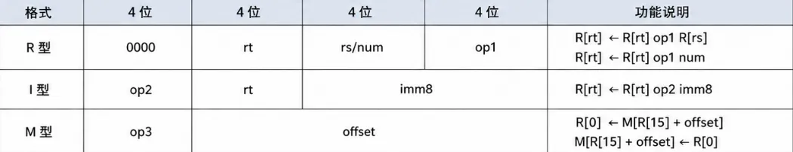
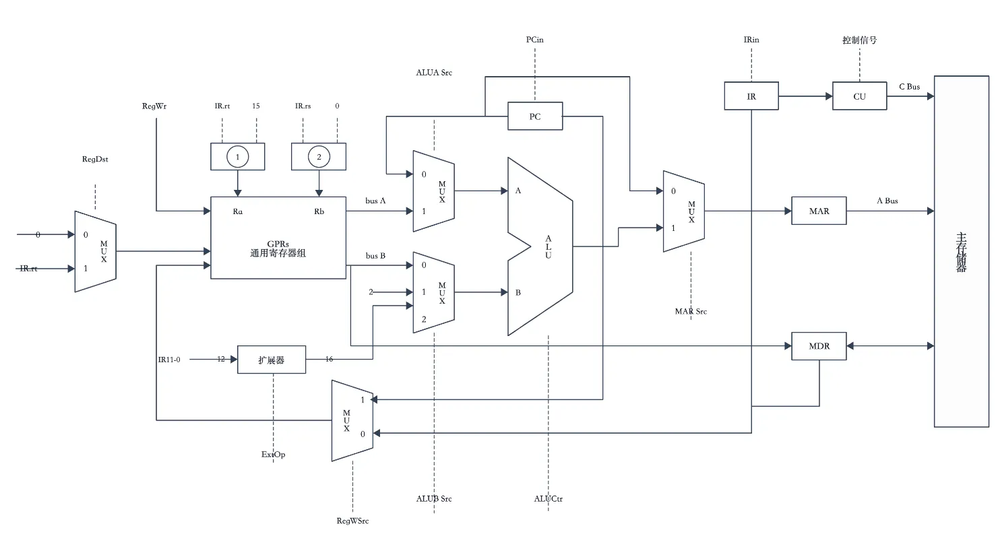

# 2026 408 真题 · 计算机组成原理

> 本科目共 13 题 / 47 分：单项选择题 11 题（22 分）+ 综合应用题 2 题（25 分）。

## 一、单项选择题

### 12. （2 分 · 计算机系统概述）

下列关于计算机的系统层次的叙述，错误的是（ ）。

- **A.** 最上层是应用软件层
- **B.** 指令集体系结构是软件和硬件的接口
- **C.** 计算机组成（即微架构）属于指令集体系结构的物理实现层
- **D.** 操作系统可通过 ISA 进行抽象，向上层软件提供服务

**答案**：C

**解析**：答案 C。计算机组成（微架构）是 ISA 的逻辑实现层，而非物理实现层，C 的说法错误；计算机系统最上层是应用软件，ISA 是软硬件接口，操作系统通过 ISA 抽象硬件，A、B、D 均正确。

> 难度 ⭐⭐ ｜ 章节 计算机系统概述 ｜ 标签 计算机组成原理 / 计算机系统概述

---

### 13. （2 分 · 数据表示与运算）

对机器数 `1010 0110B` 先执行算术右移 3 位，再执行算术左移 2 位，最终结果是（ ）。

- **A.** `1101 0000B`
- **B.** `1101 0011B`
- **C.** `0101 0000B`
- **D.** `0101 0011B`

**答案**：A

**解析**：答案 A。1010 0110B 算术右移 3 位，符号位 1 向左扩展，得 1111 0100B（−12）；再算术左移 2 位，高位丢弃、低位补 0，得 1101 0000B（−48）。

> 难度 ⭐⭐⭐ ｜ 章节 数据表示与运算 ｜ 标签 计算机组成原理 / 数据表示 / 运算

---

### 14. （2 分 · 数据表示与运算）

已知用 IEEE 754 单精度浮点数表示浮点型变量，采用就近舍入（中间值取偶数）。若浮点型变量 x 为 12.1，则 x 的机器数是（ ）。

- **A.** `4141 9999H`
- **B.** `4141 999AH`
- **C.** `41E0 CCCCH`
- **D.** `41E0 CCCDH`

**答案**：B

**解析**：答案 B。12.1=1.5125×2³，符号 0，阶码 130=10000010B；尾数 1.10000011001100110011001…，就近舍入末位进 1 后合成 IEEE 754 单精度数，即 4141 999AH。

> 难度 ⭐⭐⭐⭐ ｜ 章节 数据表示与运算 ｜ 标签 计算机组成原理 / 数据表示 / 运算

---

### 15. （2 分 · 存储器层次结构）

用 8 个 64M×8bit 的 DRAM 芯片按交叉编址方式构成主存储器，并与一个宽度为 64bit 的存储器总线相连。主存每次最多读写 64bit，且按字节编址。则下列地址中，与主存地址 `0018 001DH` 位于同一芯片中的是（ ）。

- **A.** `0000 01D5H`
- **B.** `000F A020H`
- **C.** `0018 001EH`
- **D.** `0F02 0014H`

**答案**：A

**解析**：答案 A。8 芯片交叉编址且按字节编址，地址低 3 位决定芯片号：0018 001DH 低 3 位为 101（模 8 余 5）。A 中 0xD5 低 3 位也是 101，同芯片；其余选项低 3 位分别为 000、110、100，不符。

> 难度 ⭐⭐⭐⭐ ｜ 章节 存储器层次结构 ｜ 标签 计算机组成原理 / 存储器层次结构

---

### 16. （2 分 · 指令系统）

下列不是由指令集体系结构规定的是（ ）。

- **A.** 输入输出指令
- **B.** 采用向量中断
- **C.** 虚拟存储管理方式
- **D.** 指令流水线是否使用超级流水线技术

**答案**：D

**解析**：答案 D。ISA 规定指令集、寄存器、内存模型、中断机制等软硬件接口，不涉及实现细节。输入输出指令、向量中断、虚拟存储管理方式都属 ISA 范畴；是否采用超级流水线是微架构的设计选择，不由 ISA 规定。

> 难度 ⭐⭐⭐ ｜ 章节 指令系统 ｜ 标签 计算机组成原理 / 指令系统 / 寻址方式 / CISC / RISC

---

### 17. （2 分 · 指令系统）

哪些指令可能不改变程序下一条指令的地址？（ ）

Ⅰ. 条件转移

Ⅱ. 过程调用

Ⅲ. 陷入指令

Ⅳ. 返回

- **A.** Ⅰ、Ⅱ
- **B.** Ⅰ、Ⅳ
- **C.** Ⅱ、Ⅲ
- **D.** Ⅱ、Ⅳ

**答案**：B

**解析**：答案 B。条件转移在条件不满足时顺序执行，不改变下一条指令地址；返回指令若返回地址恰为自身也不改变。过程调用和陷入指令必然跳转，一定会改变地址。故可能不改变的是 I、IV。

> 难度 ⭐⭐⭐⭐ ｜ 章节 指令系统 ｜ 标签 计算机组成原理 / 指令系统 / 寻址方式 / CISC / RISC

---

### 18. （2 分 · 存储器层次结构）

某计算机按字节编址，数据 Cache 共有 1024 行，采用 4 路组相联映射，主存块大小为 32B，若访问主存地址为 1028 的 4 字节数据，则该数据所在主存块对应的组号为（ ）。

- **A.** 4
- **B.** 16
- **C.** 32
- **D.** 64

**答案**：C

**解析**：答案 C。1024 行 4 路组相联，组数为 1024/4=256。主存块大小 32B，块地址为 ⌊1028/32⌋=32，组号 = 32 mod 256 = 32。

> 难度 ⭐⭐⭐ ｜ 章节 存储器层次结构 ｜ 标签 计算机组成原理 / 存储器层次结构 / Cache

---

### 19. （2 分 · 存储器层次结构）

某计算机按字节编址，虚拟地址为 16 位，页大小为 256B，页表项中包含装入位（P）、页框号（PPN）等字段。TLB 采用 4 路组相联映射，共有 16 个页表项，TLB 表项中包含标记（Tag）、有效位（V）等字段。在主存页表与 TLB 表项同步后，若主存页表中页号 22 对应的页表项中 P=0，PPN=2AH，则下列不可能出现在组号为 2 的 TLB 表项中的是（ ）。

- **A.** Tag=05H，V=1，PPN=1CH
- **B.** Tag=06H，V=1，PPN=2AH
- **C.** Tag=16H，V=0，PPN=2AH
- **D.** Tag=1AH，V=0，PPN=1CH

**答案**：A

**解析**：答案 A。页号 22=00010110B，TLB 16 项 4 路组相联，组号占低 2 位（组 2）、标记占高 6 位（05H）。页表中该项 P=0、PPN=2AH，组 2 中 Tag=05H 的项应与之一致；A 的 V=1、PPN=1CH 矛盾，不可能出现。

> 难度 ⭐⭐⭐⭐ ｜ 章节 存储器层次结构 ｜ 标签 计算机组成原理 / 存储器层次结构 / Cache / 地址转换 / 同步与互斥 / 内存分配

---

### 20. （2 分 · 中央处理器）

在不考虑异常中断处理和访存的额外开销下，下列关于数据通路结构与 CPI 之间的关系正确的为（ ）。

Ⅰ. 单周期数据通路计算机的 CPI 等于 1

Ⅱ. 多周期数据通路计算机的 CPI 大于 1

Ⅲ. 流水线数据通路计算机的 CPI 等于 1

- **A.** 仅Ⅰ、Ⅱ
- **B.** 仅Ⅰ、Ⅲ
- **C.** 仅Ⅱ、Ⅲ
- **D.** Ⅰ、Ⅱ、Ⅲ

**答案**：D

**解析**：答案 D。单周期每条指令在一个时钟周期内完成，CPI=1；多周期一条指令需多个时钟周期，CPI>1；流水线理想情况下每周期完成一条指令，CPI=1。I、II、III 均正确。

> 难度 ⭐⭐ ｜ 章节 中央处理器 ｜ 标签 计算机组成原理 / CPU / 数据通路 / 指令流水线 / CPU设计 / 性能指标 / I/O方式

---

### 21. （2 分 · 输入输出系统）

在 I/O 子系统中，驱动程序和中断服务程序直接控制外设与主机之间的输入/输出操作，这一过程需要使用一些特权指令。下列指令中，不属于特权指令的是（ ）。

- **A.** I/O 指令
- **B.** 关中断指令
- **C.** 中断返回指令
- **D.** 系统调用指令

**答案**：D

**解析**：答案 D。特权指令只能在内核态执行：I/O 指令、关中断、中断返回都是特权指令；系统调用指令（如 syscall、int）本身可在用户态执行，通过陷入切换到内核态，不属于特权指令。

> 难度 ⭐⭐ ｜ 章节 输入输出系统 ｜ 标签 计算机组成原理 / I/O系统 / 中断 / DMA / I/O方式

---

### 22. （2 分 · 中央处理器）

中断控制 I/O 方式下，实现 I/O 需要硬件和软件协同完成，中断响应和处理过程中所包含的下列工作中，必须由硬件完成的是（ ）。

- **A.** 开中断
- **B.** 中断判优
- **C.** 保存断点
- **D.** 保存通用寄存器

**答案**：C

**解析**：答案 C。保存断点（PC）必须由硬件在响应中断时自动完成，保证中断返回能恢复现场；开中断由软件指令实现，保存通用寄存器由中断服务程序完成。故必须由硬件完成的是 C。

> 难度 ⭐⭐ ｜ 章节 中央处理器 ｜ 标签 计算机组成原理 / CPU / 数据通路 / 指令流水线 / I/O方式

---

## 二、综合应用题

### 43. （11 分 · 指令系统）

某 16 位计算机按字节编址，通用寄存器 R0～R15 的编号为 0～15，存储器地址为 16 位，采用定长指令字，指令格式有 R 型、I 型、M 型三种，如下表所示

R 型：`R[rt] ← R[rt] op1 R[rs]` 或 `R[rt] ← R[rt] op1 num`

I 型：`R[rt] ← R[rt] op2 imm8`

M 型：`R[0] ← M[R[15] + offset]` 或 `M[R[15] + offset] ← R[0]`

其中：

- OP1 为 0001、0010 分别表示加、左移指令；
- OP2 为 0100 表示加立即数指令；
- OP3 为 1110、1111 分别表示取数、存数指令；
- R[r] 表示寄存器 r 中的内容；
- mm 表示移位位数；
- M[addr] 表示存储器地址 addr 中的内容。

请回答下列问题：

(1) 主存单元和通用寄存器的宽度各为多少位？（2 分）

(2) op1 和 op2 的编码是否可以相同？op2 和 op3 的编码是否可以相同？（2 分）

(3) 若 R(2)=ABCDH，R(9)=F001H，则指令 0000 0010 1001 0001 执行后，R2 和 R9 中的内容分别是多少？（2 分）

(4) 若变量 *x* 、 *y* 均为 16 位带符号整数，在存储器中依次从低地址向高地址连续存放， *x* 的地址在 R15 中。实现 *y*=16*x*−5 的 4 条指令 11–14 如题 43 表所示，写出 ①～④ 处的内容。（4 分）

题 43 表：

| 地址 | 内容             |
| ---- | ---------------- |
| 11   | ① 0000 0000 0000 |
| 12   | 0000 ② 0010      |
| 13   | 0100 0000 ③      |
| 14   | 1111 ④           |

**小题**：

- （1）主存单元和通用寄存器的宽度各为多少位？（2 分）
- （2）op1 和 op2 的编码是否可以相同？op2 和 op3 的编码是否可以相同？（2 分）
- （3）若 R(2)=ABCDH，R(9)=F001H，则指令 0000 0010 1001 0001 执行后，R2 和 R9 中的内容分别是多少？（2 分）
- （4）若变量 *x* 、 *y* 均为 16 位带符号整数，在存储器中依次从低地址向高地址连续存放， *x* 的地址在 R15 中。实现 *y*=16*x*−5 的 4 条指令 11–14 如题 43 表所示，写出 ①～④ 处的内容。

题 43 表：

| 地址 | 内容             |
| ---- | ---------------- |
| 11   | ① 0000 0000 0000 |
| 12   | 0000 ② 0010      |
| 13   | 0100 0000 ③      |
| 14   | 1111 ④           |（4 分）

**答案 / 解析**：

答案：
1、按字节编址，主存单元宽度为 8 位；机器字长 16 位、运算以字为单位，通用寄存器宽度为 16 位。
2、op1 在低 4 位 [3:0]（仅当 [15:12]=0000 即 R 型时有效），op2 在高 4 位 [15:12]，分属不同字段，编码可以相同；op2 与 op3 都占 [15:12]，编码不能相同，否则无法区分 I 型和 M 型。
3、指令 0000 0010 1001 0001 为 R 型：前缀 0000、rt=0010、rs=1001、op1=0001（加），执行 R[2]←R[2]+R[9]。ABCDH+F001H=19BCEH，16 位寄存器取低 16 位，R2=9BCEH（进位丢弃），R9=F001H 不变。
4、实现 y=16x−5 的 4 条指令：取数 R[0]←M[R[15]] 为 1110 0000 0000 0000；左移 4 位 R[0]←R[0]<<4 为 0000 0000 0100 0010；加立即数 −5 为 0100 0000 1111 1011；存数 M[R[15]+2]←R[0] 为 1111 0000 0000 0010。故 ①=1110，②=0000 0100，③=1111 1011，④=0000 0000 0010。

> 难度 ⭐⭐⭐⭐ ｜ 章节 指令系统 ｜ 标签 计算机组成原理 / 指令系统 / 寻址方式 / CISC / RISC / 物理层

---

### 44. （14 分 · 中央处理器）

假定 43 题中计算机 C 的部分数据通路如题 44 所示。

图中带箭头虚线代表控制信号，IR.rt、IR.rs 分别表示 IR 中的 rt、rs 字段，IR₁₁₋₀ 为 IR 的低 12 位，要求取指令周期完成 PC 增量操作，请回答下列问题

（1）①和②是同一类部件，其名称是什么（1 分）

（2）I 型指令中 imm8 可以是带符号或无符号整数，M 型指令中 offset 是带符号整数，则 EXTOP 至少有几位？为什么？（2 分）

（3）取指周期中 MARSrC、ALUA SrC、ALUB SrC、RegWr 的取值各是什么？（4 分）

（4）左移指令周期中 ALUB SrC、RegWsrc、RegDst、RegWr 的取值各是什么？Extop 是否可以与 M 型指令中的 EXTop 相同？为什么？（7 分）

**小题**：

- （1）①和②是同一类部件，其名称是什么（1 分）
- （2）I 型指令中 imm8 可以是带符号或无符号整数，M 型指令中 offset 是带符号整数，则 EXTOP 至少有几位？为什么？（2 分）
- （3）取指周期中 MARSrC、ALUA SrC、ALUB SrC、RegWr 的取值各是什么？（4 分）
- （4）左移指令周期中 ALUB SrC、RegWsrc、RegDst、RegWr 的取值各是什么？Extop 是否可以与 M 型指令中的 EXTop 相同？为什么？（7 分）

**答案 / 解析**：

答案：
1、多路选择器（MUX）：R 型指令用 IR 中的 rs、rt 字段选择寄存器，M 型指令固定用 R0、R15，需在两类来源之间二选一。
2、EXTOP 至少 1 位：只需区分零扩展和符号扩展两种模式即可。
3、取指周期：MARSrc=0（MAR 取 PC）、ALUASrc=0（ALU 的 A 端用 PC）、ALUBSrc=1（B 端用常数 2，完成 PC+2）、RegWr=0（不写寄存器）。
4、左移指令：ALUBSrc=2（B 端取扩展后的移位位数）、RegWSrc=1（写回 ALU 结果）、RegDst=1（写 R[rt]）、RegWr=1。EXTOP 不能与 M 型指令相同：移位位数是无符号数需零扩展，M 型 offset 是带符号数需符号扩展，两者 EXTOP 取值不同。

> 难度 ⭐⭐⭐⭐ ｜ 章节 中央处理器 ｜ 标签 计算机组成原理 / CPU / 数据通路 / 指令流水线 / CPU设计 / 文件系统

---

## See Also

- [[408/真题精读/2026/数据结构]]
- [[408/真题精读/2026/操作系统]]
- [[408/真题精读/2026/计算机网络]]
- [[408/历年真题/2026]]
- [[408/真题精读/真题精读总目录]]
