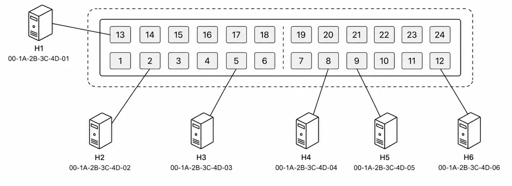
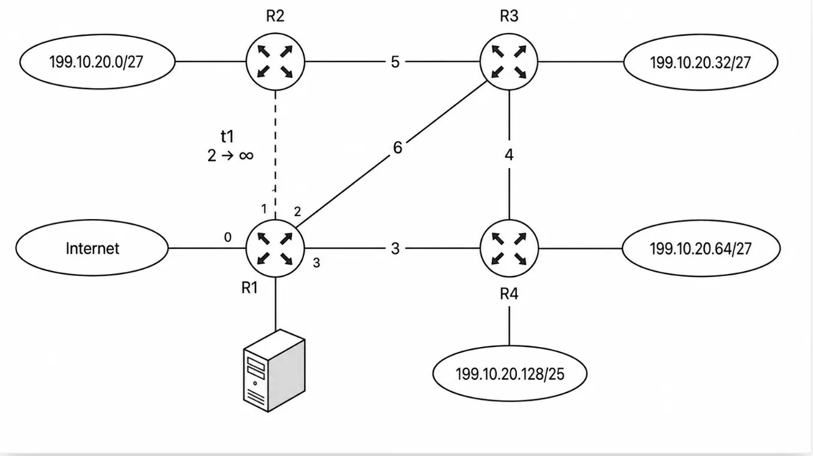

# 2026 408 真题 · 计算机网络

> 本科目共 9 题 / 25 分：单项选择题 8 题（16 分）+ 综合应用题 1 题（9 分）。

## 一、单项选择题

### 33. （2 分 · 计算机网络体系结构）

下列关于分层网络体系结构的叙述中，错误的是（ ）。

- **A.** 每层都有明确的功能边界
- **B.** 层次越多效率越高
- **C.** 有利于各层技术独立演化
- **D.** 上层无需关心下层的具体实现细节

**答案**：B

**解析**：答案 B。分层使各层功能边界清晰、可独立演化，上层通过接口使用下层服务、无需关心实现细节（A、C、D 对）；但层次越多封装开销越大，效率不一定越高，B 错。

> 难度 ⭐⭐ ｜ 章节 计算机网络体系结构 ｜ 标签 计算机网络 / 计算机网络体系结构

---

### 34. （2 分 · 物理层）

若在带宽 200 kHz，信噪比 S/N=1023 的信道上，发送一个长度为 1500 B 的分组，则发送该分组的传输时延至少是（ ）。

- **A.** 1 ms
- **B.** 2 ms
- **C.** 3 ms
- **D.** 6 ms

**答案**：D

**解析**：答案 D。由香农公式 C=B·log₂(1+S/N)=2×10⁵×log₂1024=2×10⁶ bit/s。分组 1500B=12000 bit，传输时延至少为 12000/(2×10⁶)=6 ms。

> 难度 ⭐⭐⭐ ｜ 章节 物理层 ｜ 标签 计算机网络 / 物理层 / 编码 / 调制

---

### 35. （2 分 · 数据链路层）

假设采用 CSMA/CA 的 IEEE 802.11 无线局域网，其数据传输速率为 300 Mbps，DIFS = 128 μs，SIFS = 28 μs。忽略除数据帧以外的其他帧的传输时延及信号传播时延，主机 H 发送一个总长度为 1500 B 的数据帧，则从开始发送数据帧至确认接收方收到所需的时间至少为（ ）。

- **A.** 40 μs
- **B.** 68 μs
- **C.** 168 μs
- **D.** 196 μs

**答案**：B

**解析**：答案 B。数据帧传输时间 1500×8/(300×10⁶)=40 μs；发送方收到 ACK 还需接收方等待 SIFS=28 μs（ACK 传输时延与传播时延忽略），共 40+28=68 μs。

> 难度 ⭐⭐⭐ ｜ 章节 数据链路层 ｜ 标签 计算机网络 / 数据链路层 / MAC / CSMA/CD / PPP

---

### 36. （2 分 · 数据链路层）

支持 VLAN 划分的以太网交换机，已按端口划分了两个 VLAN。VLAN 划分结果及各端口连接主机的 MAC 地址如下图所示。下列具有不同目的 MAC 地址（DA）和源 MAC 地址（SA）的以太帧 F1～F4 中，H3 会接收到的是（ ）。

四个候选帧的地址如下：

- F1：DA = `00-1A-2B-3C-4D-03`（H3）；SA = `00-1A-2B-3C-4D-01`（H1）
- F2：DA = `00-1A-2B-3C-4D-04`（H4）；SA = `00-1A-2B-3C-4D-05`（H5）
- F3：DA = `FF-FF-FF-FF-FF-FF`（广播）；SA = `00-1A-2B-3C-4D-02`（H2）
- F4：DA = `00-1A-2B-3C-4D-06`（H6）；SA = `00-1A-2B-3C-4D-03`（H3）

- **A.** 仅 F2、F4
- **B.** 仅 F1、F3
- **C.** 仅 F1、F2
- **D.** 仅 F3、F4

**答案**：B

**解析**：答案 B。H3 在 VLAN 1。F1 目的即 H3、源在 VLAN 1，同 VLAN 单播，收到；F3 是 VLAN 1 广播帧，收到；F2 源、目的在 VLAN 2，收不到；F4 目的在 VLAN 2，单播不跨 VLAN 泛洪，且是 H3 自己发出的帧，收不到。

> 难度 ⭐⭐⭐⭐ ｜ 章节 数据链路层 ｜ 标签 计算机网络 / 数据链路层 / MAC / CSMA/CD / PPP / 内存分配

---

### 37. （2 分 · 网络层）

某网络在 t0 时刻的网络拓扑与 R1 的路由如下图所示。R1 ～ R4 为路由器，基于链路状态路由算法进行路由计算。S0 ～ S4 为路由器 R1 的接口，链路上的数值为链路开销。若在 t1（t1 > t0）时刻，R1 检测到 R1 与 R2 之间的链路断开，则 R1 重新计算路由并进行充分路由聚合后，路由表中路由条目的数量为（ ）。

- **A.** 3
- **B.** 4
- **C.** 5
- **D.** 6

**答案**：C

**解析**：答案 C。断链后 Net1 改经 R3→R2 到达，各网络仍可达。聚合后路由表为 5 条：199.10.20.0/27、199.10.20.32/27 经 R3，199.10.20.64/27、199.10.20.128/25 经 R4，0.0.0.0/0 默认。

> 难度 ⭐⭐⭐⭐ ｜ 章节 网络层 ｜ 标签 计算机网络 / 网络层 / IP / 路由 / 子网划分 / CIDR

---

### 38. （2 分 · 网络层）

下列路由协议中，能将一个自治系统划分为多个区域的内部网关协议是（ ）。

Ⅰ. OSPF
Ⅱ. RIP
Ⅲ. BGP

- **A.** 仅 Ⅰ
- **B.** 仅 Ⅱ
- **C.** 仅 Ⅰ、Ⅲ
- **D.** 仅 Ⅱ、Ⅲ

**答案**：A

**解析**：答案 A。OSPF 是内部网关协议（IGP），支持把自治系统划分为多个区域；RIP 是 IGP 但不支持区域划分；BGP 是外部网关协议，用于自治系统之间。只有 OSPF 符合题意。

> 难度 ⭐⭐ ｜ 章节 网络层 ｜ 标签 计算机网络 / 网络层 / IP / 路由 / 子网划分 / CIDR

---

### 39. （2 分 · 网络层）

若将 IP 网络 123.4.4.0/22 划分为规模均衡的 32 个子网，则 IP 地址 123.4.5.11 所在的子网是（ ）。

- **A.** 123.4.4.0/27
- **B.** 123.4.4.32/27
- **C.** 123.4.5.0/27
- **D.** 123.4.5.32/27

**答案**：C

**解析**：答案 C。/22 再借 5 位主机位划成 32 个子网，前缀变为 /27，每个子网 32 个地址。123.4.5.11 落在 123.4.5.0～123.4.5.31，所在子网为 123.4.5.0/27。

> 难度 ⭐⭐⭐ ｜ 章节 网络层 ｜ 标签 计算机网络 / 网络层 / IP / 路由 / 子网划分 / CIDR

---

### 40. （2 分 · 应用层）

下列叙述中不属于 cookie 的技术典型用途的是（ ）。

- **A.** 用户跟踪
- **B.** 个性化推荐
- **C.** 构建虚拟购物车
- **D.** 缩短 Web 对象的响应时间

**答案**：D

**解析**：答案 D。Cookie 在客户端保存状态信息，用于用户跟踪、个性化推荐、维护购物车；缩短 Web 对象响应时间靠缓存、CDN 等手段，不是 Cookie 的典型用途。

> 难度 ⭐⭐ ｜ 章节 应用层 ｜ 标签 计算机网络 / 应用层 / HTTP / DNS / FTP / SMTP

---

## 二、综合应用题

### 47. （9 分 · 传输层）

（本题满分 9 分）

假设客户端 C 建立一条 TCP 连接，向服务器 Si 上传一个总长度为 2000 B 的计算任务描述文件。已知 C 的拥塞窗口初始阈值为 8 MSS，MSS = 500 B，Si 对收到的每个 TCP 段进行确认，且确认段不封装数据。接收窗口始终为 1000 B，RTT = 5 ms，C 建立连接时选择的初始序号为 1000，Si 选择的初始序号为 2000，SYN、ACK、FIN 为标志位，seq 为序号，ack_seq 为确认序号。在整个文件传输过程中未出现任何重传或报文丢失。

（1）C 与 Si 建立 TCP 连接过程需要几次握手？C 收到的 SYN = 1、ACK = 1 的 TCP 段的确认序号是多少？

（2）当 C 接收 Si 发送的 ACK = 1，seq = 2001，ack_seq = 2001，rwnd = 1000 确认段后，C 的拥塞窗口增加到多少？C 的发送窗口设置为多少？

（3）C 与 Si 释放 TCP 连接过程需要几次挥手？C 收到最后一个 TCP 报文段的序号（seq）、确认序号（ack_seq）、FIN 的值分别是多少？

（4）忽略报文段传输时延，且时间从 C 请求建立 TCP 连接时刻算起，则 C 确定 Si 已成功接收到文件的时间是多少？

**答案 / 解析**：

答案：
1、TCP 建立连接需三次握手；C 收到的 SYN=1、ACK=1 段是第二次握手，其确认序号为 C 的初始序号加 1，即 1000+1=1001。
2、慢启动阶段每收到一个 ACK，拥塞窗口加 1 MSS：cwnd 从 2 MSS 增至 3 MSS=1500B；发送窗口取拥塞窗口与接收窗口的较小值，即 min(1500B, 1000B)=1000B。
3、TCP 释放连接需四次挥手；C 收到的最后一段是 Si 的 FIN+ACK：seq 为 Si 初始序号加 1（SYN 消耗一个序号）=2001；ack_seq 为 C 的 FIN 序号加 1，C 数据最后字节序号为 3000、FIN 序号为 3001，故 ack_seq=3002；FIN=1。
4、连接建立耗时 1 RTT=5ms；文件 2000B 分 4 个 MSS 传输：5ms 建连完成，10ms 收到第一个报文段的确认，15ms 收到随后两个报文段的确认，20ms 收到最后一个报文段的确认，故 C 确定 Si 成功接收文件的时刻为 20ms。

> 难度 ⭐⭐⭐⭐ ｜ 章节 传输层 ｜ 标签 计算机网络 / 传输层 / TCP / UDP / 拥塞控制 / 进程调度 / 文件系统

---

## See Also

- [[408/真题精读/2026/数据结构]]
- [[408/真题精读/2026/计算机组成原理]]
- [[408/真题精读/2026/操作系统]]
- [[408/历年真题/2026]]
- [[408/真题精读/真题精读总目录]]
