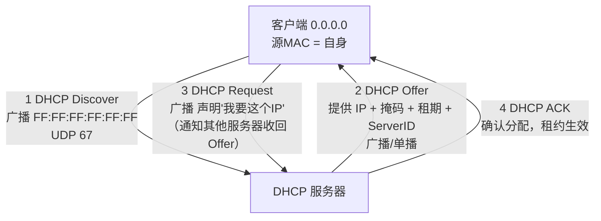
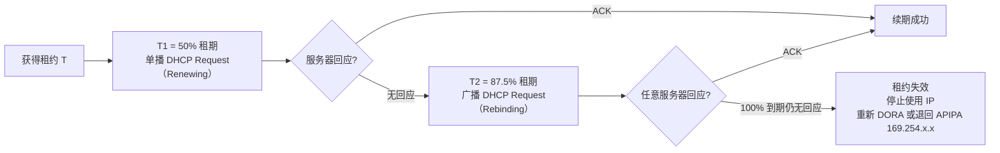
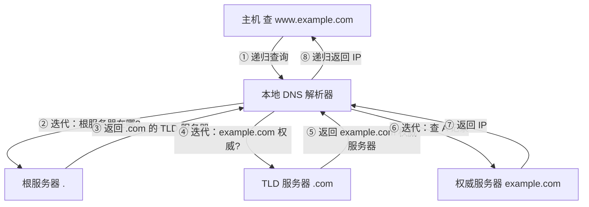
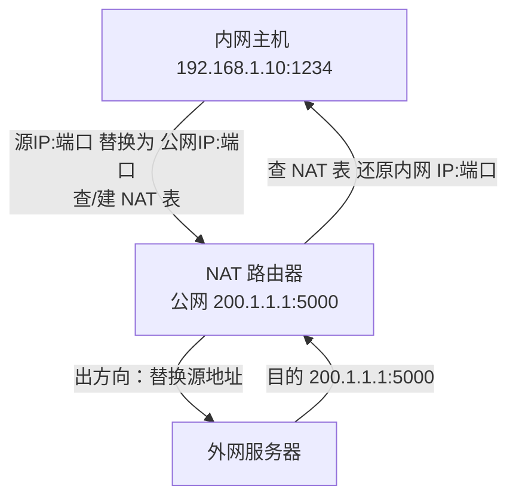
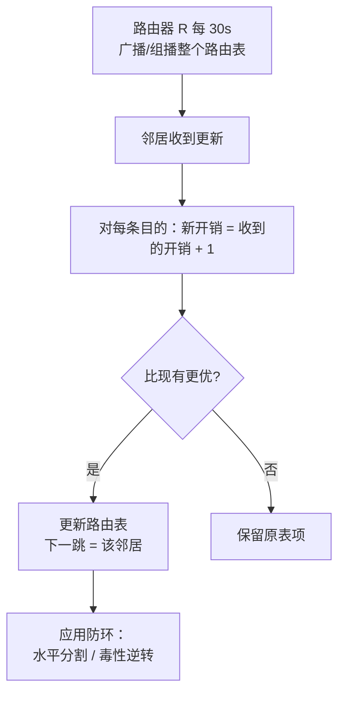
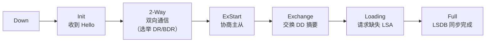

# 考前速看 · 计算机网络核心协议

> 按「核心协议（DHCP / DNS / ARP）+ 其他需明确流程的协议（NAT / ICMP / RIP / OSPF）」整理。每个协议给出**交互流程图 + 关键报文/字段 + 易错点**，适合考前快速回顾。

---

## 一、核心协议

### 1. DHCP（动态主机配置协议）

**作用**：自动给主机分配 IP 地址及网络配置（子网掩码、默认网关、DNS 等）。
**端口**：服务器 `UDP 67`，客户端 `UDP 68`。客户端初始无 IP，使用 `0.0.0.0` 并以**广播**（目的 IP `255.255.255.255`）通信。

#### 1.1 完整交互流程（DORA 四步）



- **Discover**：客户端广播，发现网络中的 DHCP 服务器（可能有多个）。
- **Offer**：服务器从地址池选一个 IP，携带 `yiaddr`（提供给客户机的 IP）、`subnet mask`、`lease time`、`server identifier` 等返回。
- **Request**：客户端**广播**发送（让所有服务器都听到，未选中的服务器可收回各自的 Offer）。
- **ACK**：被选中的服务器确认，租约正式生效。

#### 1.2 租约续期机制



- **T1（50%）**：客户端**单播** DHCP Request 向原服务器续租。
- **T2（87.5%）**：仍无回应则**广播** DHCP Request，向任意服务器请求续租。
- **100% 到期**：租约失效，停止使用该 IP，重新发起 DORA 或退回 APIPA（`169.254.0.0/16`）。

#### 1.3 DHCP 中继代理（Relay Agent）

- **问题**：DHCP 用广播，广播无法跨路由器（子网边界）。
- **原理**：在路由器（或三层交换机）上配置 DHCP 中继代理。客户端广播的 Discover/Request 被中继代理**接收并转为单播**，转发给指定的 DHCP 服务器；服务器回包经中继代理转回客户端子网。
- **关键字段**：中继代理在转发时填写 **`giaddr`（网关地址 / 中继代理地址字段）**，告诉服务器"客户机属于哪个子网"，服务器据此从对应地址池分配 IP。

**易错点**：Discover/Request 是广播；无中继时 Offer/ACK 也常为广播（客户端尚无 IP）。中继场景下服务器靠 `giaddr` 判断分配哪个子网地址。

---

### 2. DNS（域名系统）

**作用**：将域名解析为 IP 地址。采用**分布式、层次化**的命名空间。

#### 2.1 递归查询 vs 迭代查询

| 维度 | 递归查询 | 迭代查询 |
|------|----------|----------|
| 谁来干活 | 被问的服务器负责一路查到底 | 被问的服务器只返回"下一步该问谁" |
| 返回结果 | 直接给最终答案（或失败） | 返回下一级服务器地址，由查询方继续问 |
| 典型位置 | 主机 → 本地 DNS（递归） | 本地 DNS → 根/TLD/权威（迭代） |

> 实际中：**主机到本地 DNS 解析器用递归**；**本地 DNS 到根、TLD、权威服务器用迭代**（减轻根/TLD 负担）。

#### 2.2 完整域名解析过程



#### 2.3 缓存机制

- 解析器（本地 DNS）和主机都缓存解析结果，每条记录带 **TTL（生存时间）**。
- 缓存命中的查询不再向上递归，直接返回，**显著降低延迟与根服务器负载**。
- 支持**否定缓存**（查询失败的结果也缓存一段时间，避免重复无效查询）。

#### 2.4 层级结构（根 → TLD → 权威）

```
. (根)
├── com.   (TLD 顶级域)
│   └── example.com.   (权威服务器，持有 www 的 A 记录)
├── cn.
└── org.
```

- **根服务器**：管理 TLD 地址（全球 13 套逻辑根，实际大量镜像）。
- **TLD 服务器**：管理对应顶级域（如 `.com`、`.cn`）下的权威服务器。
- **权威服务器**：某个具体域名的真正管理者，返回最终 IP。

#### 2.5 报文关键字段

- 头部：`ID`（匹配请求/响应）、`QR`（0 查询 / 1 响应）、`OpCode`、`AA`（权威回答）、`RD`（期望递归）、`RA`（可用递归）、`RCODE`、`QDCOUNT / ANCOUNT / NSCOUNT / ARCOUNT`。
- 资源记录类型：`A`(IPv4)、`AAAA`(IPv6)、`CNAME`(别名)、`NS`(名称服务器)、`MX`(邮件)、`PTR`(反向)、`SOA`(起始授权)。

**易错点**：递归/迭代的分工是高频考点；TTL 同时决定缓存有效期。

---

### 3. ARP（地址解析协议）

**作用**：已知 IP 地址，解析出对应的 MAC 地址（网络层 → 数据链路层）。

#### 3.1 ARP 请求 / 响应帧格式

- **以太网帧头**：目的 MAC = `FF:FF:FF:FF:FF:FF`（请求为广播），源 MAC = 发送方，类型 `0x0806`。
- **ARP 报文**（28 字节）：

| 字段 | 说明 |
|------|------|
| 硬件类型 | `1` = 以太网 |
| 协议类型 | `0x0800` = IPv4 |
| 硬件地址长度 | `6`（MAC 字节数） |
| 协议地址长度 | `4`（IP 字节数） |
| **操作码 Op** | `1` = 请求，`2` = 响应 |
| 发送方 MAC / IP | 请求方自己的 |
| 目标 MAC / IP | 请求时目标 MAC = `0`；响应时填全 |

#### 3.2 ARP 缓存表

- 主机/路由器维护 **IP → MAC** 映射表，收到 ARP 响应后缓存条目并带**超时时间**（典型约 20 分钟）。
- 发送数据前先查 ARP 表，**命中则直接用，未命中才发 ARP 请求**。
- 收到任何 ARP（请求或响应）都会**更新本地对应条目**（即使不是发给自己的响应——这是免费 ARP 与欺骗的基础）。

#### 3.3 免费 ARP（Gratuitous ARP）

- 主机用**自己的 IP 作为目标 IP** 发送 ARP 请求（问"谁是 X.X.X.X"，而 X 就是自己）。
- **作用**：
  1. **检测 IP 地址冲突**（若有别人应答，说明 IP 重复）。
  2. **主动更新**同网段其他主机的 ARP 缓存（如故障切换 / 虚拟机迁移后 MAC 变了）。

#### 3.4 ARP 欺骗（ARP Spoofing / Poisoning）

- **原理**：ARP 无认证机制，任何主机都可发送伪造 ARP 响应。攻击者冒充网关（把网关 IP 映射到攻击者 MAC），使受害者流量先经攻击者，实现**中间人攻击（MITM）**。
- **条件**：依赖"收到 ARP 就更新缓存"的特性 + 局域网广播可达。
- **防护**：静态 ARP 绑定、ARP 防火墙、DHCP Snooping + 动态 ARP 检测（DAI）。

**易错点**：ARP 只在**同一广播域（同子网）**内工作；跨子网通信时，主机先 ARP 解析**默认网关**的 MAC，而非目标主机的 MAC。

---

## 二、其他需明确流程的协议

### 4. NAT（网络地址转换）

**作用**：将私有 IP 与公网 IP 相互转换，缓解 IPv4 地址不足、隐藏内网拓扑。

#### 4.1 地址转换流程（以 NAPT / PAT 为例）



- 出方向：将数据包**源 IP:端口** 替换为路由器公网 IP:端口，并在 **NAT 转换表** 记录映射。
- 入方向：根据目的端口查表，还原为内网 **IP:端口** 转发。
- 类型：**静态 NAT**（一对一）、**动态 NAT**（地址池）、**NAPT/PAT**（端口复用，最常用）。

**易错点**：NAT 修改网络层 IP 与传输层端口，**破坏端到端透明性**（影响 P2P、IPsec 等），需 ALG 辅助；NAPT 靠端口区分内网不同主机/会话。

---

### 5. ICMP（网际控制报文协议）

**作用**：在 IP 之上报告差错、传递控制信息（**本身不可靠，仅尽力而为**）。封装在 IP 数据报中（协议号 `1`）。

#### 5.1 差错报告

| 类型 Type | 含义 | 触发场景 |
|-----------|------|----------|
| 3 | 目的不可达 | 网络/主机/端口/协议不可达 |
| 11 | 时间超时 | TTL 减到 0（traceroute 利用） |
| 5 | 重定向 | 告诉源站更优路由 |
| 12 | 参数问题 | IP 首部出错 |

- 差错报文**携带出错 IP 数据报的首部 + 前 8 字节**（含端口号），便于源端识别。

#### 5.2 回显机制（Ping）

- **Echo Request（类型 8）/ Echo Reply（类型 0）**：源端发请求，目的端回显。
- `ping` 据此测连通性与往返时延（RTT）。
- `traceroute` 利用 **TTL = 1, 2, 3…** 递增 + 收到 Type 11 超时报文，逐跳探测路径。

**易错点**：ICMP 本身不保证送达；防火墙常屏蔽 ICMP，ping 不通 ≠ 服务不可用。

---

### 6. RIP（路由信息协议）

**类型**：**距离向量（DV）** 路由协议，度量 = **跳数**，最大 15，**16 = 不可达**（防环上限）。

#### 6.1 路由更新流程



- 邻居间**定期（30s）交换完整路由表**（RIP v1 广播，v2 组播 `224.0.0.9`）。
- 收到更新后计算 `新开销 = 通告跳数 + 1`，若更优则更新（下一跳指向该邻居）。
- **防环机制**：**水平分割**（不向来源接口回传该路由）、**毒性逆转**（通告不可达 `16` 显式否定）、**触发更新**、**抑制计时器**。
- **缺点**：收敛慢、易"计数到无穷"、跳数度量粗糙。

**易错点**：RIP 最大 15 跳；"距离向量"强调只告诉邻居"到各目的的距离"，不掌握全网拓扑。

---

### 7. OSPF（开放最短路径优先）

**类型**：**链路状态（LS）** 路由协议，基于 **Dijkstra（SPF）算法**，度量 = 链路带宽（开销）。

#### 7.1 邻居建立状态机



- **Hello 报文**：发现/维持邻居，在广播型多路访问网络选举 **DR（指定路由器）/ BDR（备份）**，仅 DR/BDR 与其他路由器建立全邻接，减少邻接数。
- 状态机：`Down → Init → 2-Way → ExStart → Exchange → Loading → Full`。

#### 7.2 LSA 泛洪过程

1. 路由器感知链路变化，**生成 LSA**（链路状态通告），洪泛给所有 OSPF 邻居。
2. 每个路由器收到 LSA 后**刷新自己的 LSDB** 并继续转发（除回传接口外），最终**全网 LSDB 一致**。
3. 各路由器**独立运行 Dijkstra**，以自己为根计算最短路径树，得到路由表。
4. 确认机制：LSU 由 **LSAck** 确认。

- **区域（Area）**：划分骨干区 `Area 0` 与常规区，**ABR（区域边界路由器）** 汇总，限制 LSA 泛洪范围、加快收敛。
- **报文类型**：Hello、DD（数据库描述）、LSR（链路状态请求）、LSU（链路状态更新，携带 LSA）、LSAck。

**易错点**：OSPF 是**链路状态**（全网联一张图再各自算最短路），区别于 RIP 的"只听邻居说距离"；LSDB 同步完成才到 Full 状态。

---

## See Also

- [[408/计算机网络/04-计算机网络必考点]]
- [[408/00-408考点总目录]]
- [[408/操作系统/03-操作系统必考点]]

---

_整理于 2026-08-10，适用于 408 考前快速回顾。重点协议：DHCP / DNS / ARP；辅助流程：NAT / ICMP / RIP / OSPF。_
