---
tags:
  - "#考研政治"
  - "#分析题"
  - "#答题技巧"
  - "#答题模板"
created: 2026-07-22
aliases:
  - 政治大题答题思路
  - 考研政治分析题模板
---

# 考研政治分析题常见答题思路与步骤

> 本文整理考研政治分析题（34-38题）的通用答题框架、分科目模板、设问类型应对策略及高分技巧。

---

## 一、通用答题四步框架

### 1.1 整体流程图

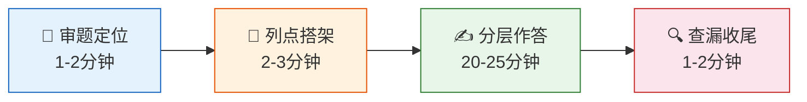

### 1.2 第一步：审题定位

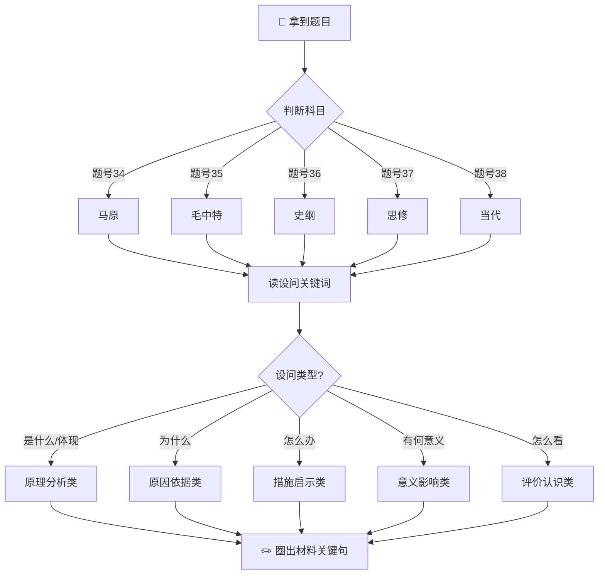

| 要做什么 | 具体操作 |
|---------|---------|
| 判断科目 | 看题号（34马原/35毛中特/36史纲/37思修/38当代） |
| 锁定考点范围 | 读设问关键词，对应高频考点表 |
| 明确设问类型 | "是什么"/"为什么"/"怎么办"/"怎么看"/"有何意义" |
| 圈定材料关键句 | 用笔标出材料中与理论对应的句子 |

### 1.3 第二步：列点搭架

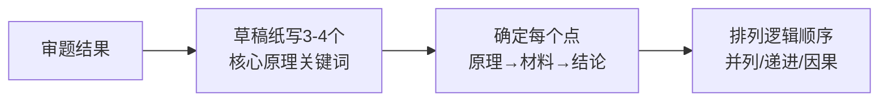

- 在草稿纸上写出要答的**3-4个核心原理/论点关键词**
- 确定每个点**"原理+材料+结论"**的基本展开方向
- 排列逻辑顺序（并列/递进/因果）

### 1.4 第三步：分层作答

每个采分点按以下结构展开：

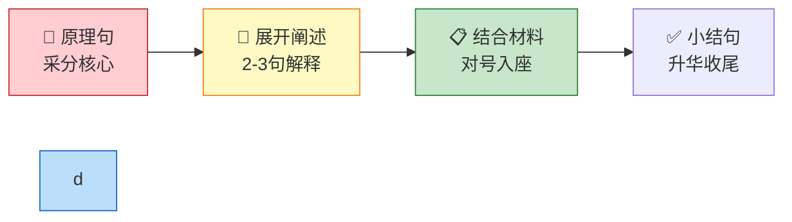

```
【原理句】+【展开阐述】+【结合材料】+【小结句】
```

### 1.5 第四步：查漏收尾

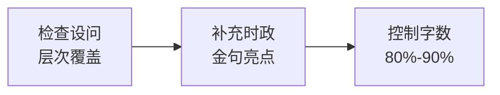

- 检查是否覆盖了设问的所有层次
- 补充时政金句、领导人讲话（加分项）
- 字数控制在答题卡的**80%-90%**

---

## 二、五种设问类型及对应思路

### 2.1 设问类型决策树

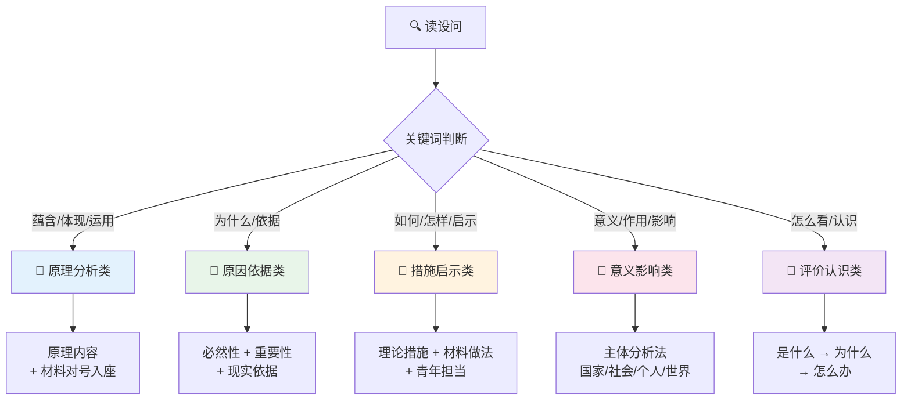

### 2.2 各类设问答题结构对比

| 设问类型 | 关键词 | 核心思路 | 答题结构 |
|---------|--------|---------|---------|
| **原理分析类** | "蕴含/体现/运用…原理" | 先写原理内容，再用材料"对号入座" | 原理句→展开→扣材料→小结 |
| **原因依据类** | "为什么/依据/原因" | 必然性+重要性+现实依据 | 理论原因→现实意义→材料印证 |
| **措施启示类** | "如何/怎样/启示" | 理论措施+材料做法+青年担当 | 理论措施→材料做法→青年行动 |
| **意义影响类** | "意义/作用/影响" | 主体分析法（对国家/社会/个人/世界） | 分主体作答→逐层展开→总结 |
| **评价认识类** | "如何看待/认识/评价" | 是什么+为什么+怎么办（三段论） | 定性判断→分析原因→给出态度 |

---

## 三、五科大题专属答题模板

### 3.0 五科模板总览

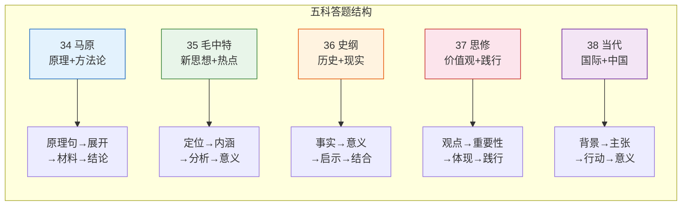

---

### 3.1 马原（第34题）——哲学原理+方法论

**最常考：辩证法（矛盾） / 认识论**

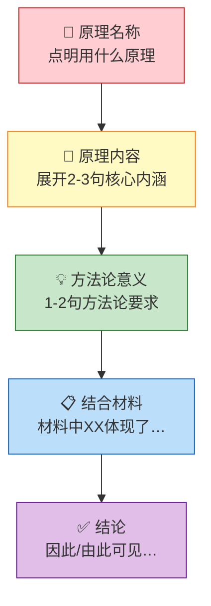

```
【模板】
1. 原理名称：________（原理）
2. 原理内容：________（展开2-3句核心内涵）
3. 方法论意义：________（1-2句方法论要求）
4. 结合材料：材料中"……"体现了________
5. 结论：因此/由此可见________
```

**高频原理速查：**

| 原理 | 原理句 | 方法论 |
|------|--------|--------|
| 对立统一 | 矛盾是事物发展的动力和源泉 | 在对立中把握统一，在统一中把握对立 |
| 矛盾普遍性 | 矛盾存在于一切事物发展过程中 | 承认矛盾、分析矛盾、解决矛盾 |
| 矛盾特殊性 | 矛盾着的事物各有特点 | 具体问题具体分析 |
| 主次矛盾 | 主要矛盾决定事物发展进程 | 集中力量抓重点，统筹兼顾 |
| 矛盾主次方面 | 主要方面决定事物性质 | 分清主流与支流 |
| 实践决定认识 | 实践是认识的基础/来源/动力/目的/检验标准 | 坚持实践第一 |
| 认识运动规律 | 认识具有反复性和无限性 | 与时俱进、开拓创新 |
| 真理客观性 | 真理是客观的、具体的、有条件的 | 坚持和发展真理 |

---

### 3.2 毛中特（第35题）——新思想+时政热点

**最常考：中国式现代化 / 高质量发展 / 新质生产力**

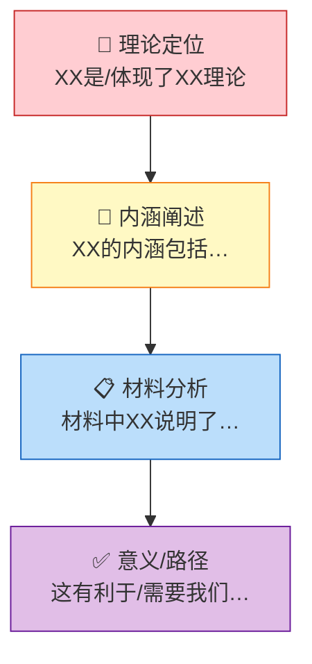

```
【模板】
1. 理论定位：________是/体现了________（理论依据）
2. 内涵阐述：________的内涵包括________
3. 材料分析：材料中"……"说明了________
4. 意义/路径：这有利于/需要我们________
```

**答题常用金句来源：**
- 二十大报告
- 中央经济工作会议
- 两会政府工作报告
- 领导人最新讲话

---

### 3.3 史纲（第36题）——历史逻辑+现实意义

**最常考：党史 / 新中国成立 / 改革开放 / 革命精神**

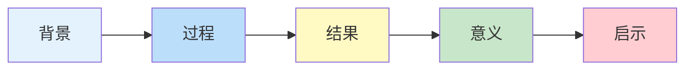

```
【模板】
1. 历史事实：________（事件/会议/人物）
2. 历史意义：________（当时的历史价值）
3. 现实启示：今天我们要________（结合新时代）
4. 材料结合：材料表明________
```

**历史事件答题逻辑：**
```
背景 → 过程 → 结果 → 意义 → 启示
```

---

### 3.4 思修法基（第37题）——价值观+道德法治

**最常考：理想信念 / 爱国主义 / 人生价值 / 社会主义核心价值观**

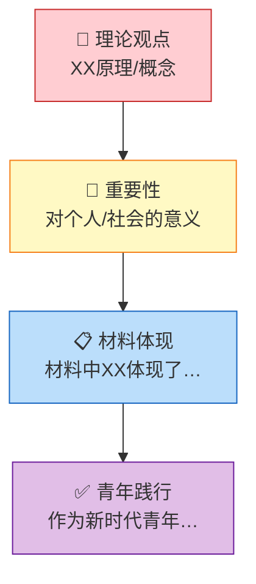

```
【模板】
1. 理论观点：________（原理/概念）
2. 重要性：________（对个人/社会的意义）
3. 材料体现：材料中"……"体现了________
4. 青年践行：作为新时代青年，我们应该________
```

**常用落脚点：**
- 坚定理想信念
- 投身强国实践
- 锤炼品德修为
- 矢志艰苦奋斗

---

### 3.5 当代（第38题）——国际视野+中国方案

**最常考：人类命运共同体 / 三大倡议 / "一带一路"**

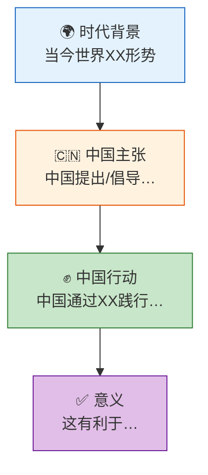

```
【模板】
1. 时代背景：当今世界________（国际形势判断）
2. 中国主张：中国提出/倡导________
3. 中国行动：中国通过________践行这一理念
4. 意义：这有利于________（对世界/对人类）
```

**常用答题角度：**
- 政治：多边主义、国际关系民主化
- 经济：开放型世界经济、互利共赢
- 安全：共同安全、合作安全
- 文明：文明交流互鉴
- 生态：绿色发展、气候变化合作

---

## 四、高分技巧与常见失分点

### 4.1 答题卡布局示意图

```
┌─────────────────────────────────────────────────────────────┐
│  题号：34（马原）                                            │
├─────────────────────────────────────────────────────────────┤
│  ①【原理句】对立统一规律认为……                              │
│    【展开】矛盾是事物发展的动力和源泉……                       │
│    【材料】材料中"XX"体现了矛盾的同一性……                   │
│    【小结】因此……                                            │
│                                                             │
│  ②【原理句】矛盾普遍性原理认为……                            │
│    【展开】矛盾存在于一切事物发展过程中……                     │
│    【材料】材料中"XX"体现了……                               │
│    【小结】由此可见……                                        │
│                                                             │
│  ③【原理句】……                                              │
│    ……                                                       │
└─────────────────────────────────────────────────────────────┘
          ↑ 分点标号     ↑ 原理前置      ↑ 紧扣材料
```

### 4.2 加分 vs 失分对比

```mermaid
flowchart LR
    subgraph ✅ 加分技巧
    A1["分点标号<br/>①②③④"] --> B1["阅卷采点清晰"]
    A2["原理前置<br/>首句采分词"] --> B2["老师一眼看到"]
    A3["材料扣题<br/>每点回扣"] --> B3["避免堆砌扣分"]
    A4["时政金句<br/>二十大/讲话"] --> B4["体现政治素养"]
    A5["字迹工整<br/>清晰可辨"] --> B5["印象分提升"]
    end
    
    subgraph ❌ 常见失分
    C1["原理写错"] --> D1["该点0分"]
    C2["不结合材料"] --> D2["扣30%-50%"]
    C3["逻辑混乱"] --> D3["找不到采分点"]
    C4["字数失衡"] --> D4["漏点/浪费时间"]
    C5["审题偏差"] --> D5["答非所问"]
    end
    
    style B1 fill:#c8e6c9
    style B2 fill:#c8e6c9
    style B3 fill:#c8e6c9
    style B4 fill:#c8e6c9
    style B5 fill:#c8e6c9
    
    style D1 fill:#ffcdd2
    style D2 fill:#ffcdd2
    style D3 fill:#ffcdd2
    style D4 fill:#ffcdd2
    style D5 fill:#ffcdd2
```

### ✅ 加分技巧

| 技巧 | 说明 |
|------|------|
| **分点标号** | ①②③④清晰排列，方便阅卷采点 |
| **原理前置** | 每点第一句必须是原理，让阅卷老师一眼看到采分词 |
| **材料扣题** | 每点都要回扣材料，避免"原理+原理"堆砌 |
| **时政金句** | 适当引用二十大/领导人原话，体现政治素养 |
| **字迹工整** | 不求漂亮，求清晰可辨 |

### ❌ 常见失分点

| 问题 | 后果 |
|------|------|
| 原理写错/张冠李戴 | 该点0分，严重失分 |
| 只写原理不结合材料 | 扣30%-50%分数 |
| 分点混乱、逻辑不清 | 阅卷找不到采分点 |
| 字数过少/过多 | 过少漏点，过多浪费时间 |
| 审题偏差（答非所问） | 原理对但方向错，低分 |

---

## 五、考场时间分配建议

### 5.1 分析题时间轴（共120分钟）

```
0        25        50        75       100       120分钟
├─────────┼─────────┼─────────┼─────────┼─────────┤
│▓▓▓▓▓▓▓▓│         │         │         │         │  34 马原
│         │▓▓▓▓▓▓▓▓│         │         │         │  35 毛中特
│         │         │▓▓▓▓▓▓▓▓│         │         │  36 史纲
│         │         │         │▓▓▓▓▓▓▓▓│         │  37 思修
│         │         │         │         │▓▓▓▓▓▓▓▓│  38 当代
```

### 5.2 单题时间分配

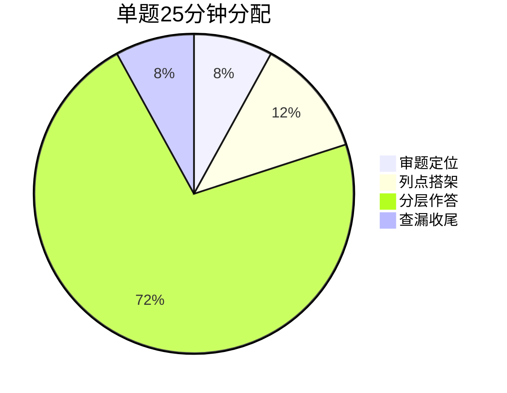

| 题号 | 科目 | 建议用时 | 字数建议 |
|------|------|---------|---------|
| 34 | 马原 | 22-25分钟 | 600-800字 |
| 35 | 毛中特 | 22-25分钟 | 600-800字 |
| 36 | 史纲 | 22-25分钟 | 600-800字 |
| 37 | 思修 | 22-25分钟 | 600-800字 |
| 38 | 当代 | 22-25分钟 | 600-800字 |
| **合计** | — | **约120分钟** | — |

---

## 六、答题结构速记口诀

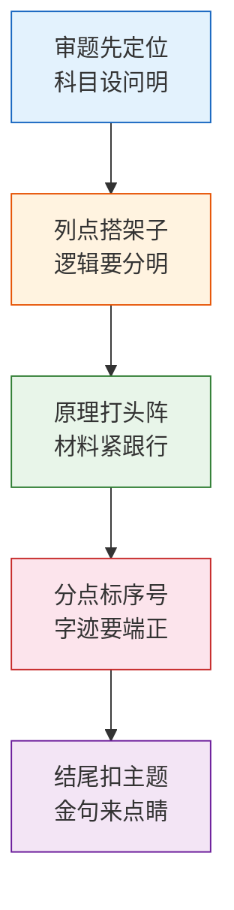

```
审题先定位，科目设问明；
列点搭架子，逻辑要分明；
原理打头阵，材料紧跟行；
分点标序号，字迹要端正；
结尾扣主题，金句来点睛。
```

---

## 七、实战应用示例

### 7.1 马原例题演示

**【模拟题】** 阅读材料，回答问题。

> 材料：某企业在发展过程中，既注重扩大生产规模（"做大"），又注重提升产品质量（"做优"）。董事长说："做大和做优是一对矛盾，但我们要学会在做大中求优，在求优中做大。"

**问题**：材料体现了唯物辩证法的什么原理？

**【解题步骤】**

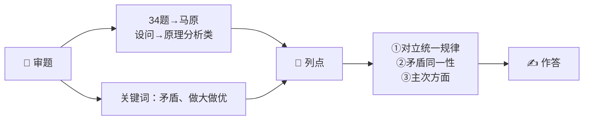

**【参考答案】**

> ① **对立统一规律认为，矛盾是事物发展的动力和源泉。** 矛盾双方既对立又统一，推动事物发展。材料中"做大"与"做优"是一对矛盾，二者相互制约又相互促进，共同推动企业发展。
>
> ② **矛盾同一性是指矛盾双方相互依存、相互贯通。** 在一定条件下，矛盾双方可以相互转化。材料中"在做大中求优，在求优中做大"体现了做大与做优相互依存、相互转化的关系。
>
> ③ **矛盾主次方面原理要求分清主流与支流。** 企业要在保持规模优势的同时，把质量作为主要方面来抓，实现高质量发展。

---

### 7.2 毛中特例题演示

**【模拟题】** 阅读材料，回答问题。

> 材料：党的二十大报告指出，中国式现代化是人口规模巨大的现代化，是全体人民共同富裕的现代化，是物质文明和精神文明相协调的现代化，是人与自然和谐共生的现代化，是走和平发展道路的现代化。

**问题**：如何理解中国式现代化？

**【解题步骤】**

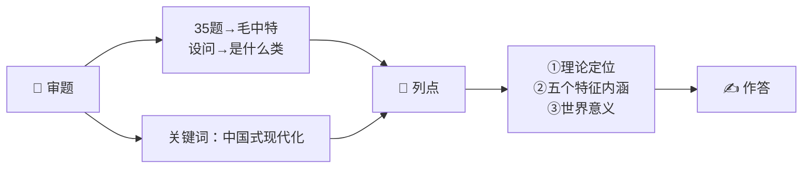

**【参考答案】**

> ① **中国式现代化是中国共产党领导的社会主义现代化。** 既有各国现代化的共同特征，更有基于自己国情的中国特色。
>
> ② **中国式现代化有五个鲜明特征：** 人口规模巨大的现代化、全体人民共同富裕的现代化、物质文明和精神文明相协调的现代化、人与自然和谐共生的现代化、走和平发展道路的现代化。
>
> ③ **中国式现代化开创了人类文明新形态。** 打破了"现代化=西方化"的迷思，为发展中国家实现现代化提供了新路径。

---

### 7.3 答题自检清单

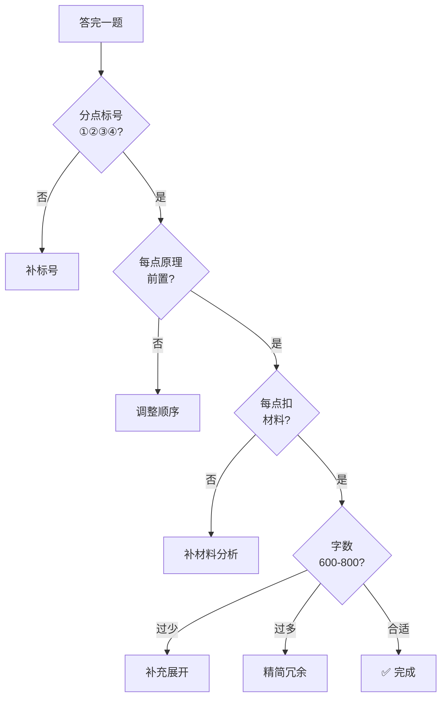

| 检查项 | ✓/✗ |
|--------|-----|
| 分点标号清晰 | □ |
| 原理句前置 | □ |
| 每点结合材料 | □ |
| 逻辑顺序合理 | □ |
| 字数适中 | □ |
| 字迹工整 | □ |

---

> 📌 **配套笔记**：[[政治/历年真题考点分析.md|历年真题考点分析]] —— 配合本答题模板使用效果更佳。
